# **Estimation, Filtering, and Detection**

### **Vladimír Havlena**

**vladimir.havlena@cvut.cz**

EFD lecture notes, September 2024

## Outline

- [1. About this course](#page-2-0)
- [2. Statistics, estimation methods](#page-6-0)
- [3. Bayesian method](#page-34-0)
- [4. Parameter estimation](#page-47-0)
- [5. Kalman filter](#page-104-0)
- [6. Change detection](#page-131-0)
- [7. Monte Carlo implementation of bayesian methods](#page-158-0)
- [8. Gaussian process regression](#page-181-0)

# <span id="page-2-0"></span>**1. About this course**


# EFD course approach

### **Extraction of information about "hidden" variables in a stochastic dynamic system**

### **System parameters**

▶ I/O models (ARX, AXMAX)


### System identification

- ▶ structure determination
- ▶ parameter estimation
- ▶ batch/recursive algorithm

### **System state**

▶ state-space models


#### State estimation

- ▶ filtering
- ▶ prediction
- ▶ smoothing

### **Unifying framework - bayesian approach**

$$p(y|\theta, \ldots) \Rightarrow p(\theta|y, \ldots)$$

$$p(y|\theta,\ldots) \Rightarrow p(\theta|y,\ldots)$$
  $p(y|x,\ldots) \Rightarrow p(x|y,\ldots)$   $p(y|m,\ldots) \Rightarrow p(m|y,\ldots)$ 

### **System mode**

▶ bank of multiple models


Fault detection and isolation

- ▶ system mode probability
- ▶ mode switching hidden Markov process

$$p(y|m, \ldots) \Rightarrow p(m|y, \ldots)$$

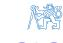


# Course info (i)

#### **Prerequisites**

- 1. Good foundation of linear system theory / control theory
- 2. Basic knowledge of probability, statistics, and optimization
- 3. Graduate level of mathematical and engineering competency (using math as a tool to formulate and solve problems)
- 4. Working knowledge of MATLAB

#### **Seminar**

- 1. Application of theory to selected examples (whiteboard / Matlab)
- 2. Three homework assignments (5 bonus points for best solution presented)
- 3. Mid year test
- 4. Access to support material (MS Teams, Doodle, older lecture recordings)

# Course info (ii)

### **Course evaluation** (max 100 points per component)

- 1. Seminar (mid-year test + 3 assignments + bonus points) 40% (limit 50 points for credit)
- 2. Written test (10 + 2 questions, no references) 30% (limit 50 points to pass)
- 3. Example (more complex, references permitted) 30%
- 4. Oral exam
  - ▶ clarifications in indeterminate cases
  - ▶ supplementary reading included in lecture slides ("A" grade candidates)

#### **Recommended reading**

- 1. F. L. Lewis, L. Xie and D. Popa: Optimal and Robust Estimation: With an Introduction to Stochastic Control Theory. CRC Press, 2005.
- 2. V. Havlena a J. Štecha: Moderní teorie řízení. Nakladatelství ČVUT, Praha, 1999.
- 3. D. Simon: Optimal state estimation. John Wiley & Sons, Inc., New Jersey, 2006.
- 4. S. Särkkä: Bayesian Filtering and Smoothing. Cambridge Universdity Press, Cambridge, 2013.
- 5. B. P. Gibbs: Advanced Kalman filtering, least squares and modeling: a practical handbook. John Wiley & Sons, Inc., New Jersey, 2011.
- 6. B. D. O. Anderson and S. B. Moore: Optimal Filtering. Prentice Hall, USA, 2005.
- 7. L. Ljung: System Identification Theory for the User. Prentice Hall, USA, 1999.
- 8. C. E. Rasmussen and C. K. I. Williams: Gaussian Processes for Machine Learning. MIT Press, 2006, ISBN 026218253X. c


# <span id="page-6-0"></span>**2. Statistics, estimation methods**


### Statistics

### **Meaning of the term "statistics"**

- ▶ Field of science, study of inference the process of drawing conclusions from data that are subject to uncertainty/random variations (pl. only)
- ▶ Any function of observed data drawn from <sup>p</sup>*θ*(x) independent of *<sup>θ</sup>* (sg. or pl.)

#### **Statistical model**

- ▶ Assumption about the population (sampling probability density function <sup>p</sup>*θ*(x))
- ▶ Requires good understanding of underlying first principles and causal relations (vs. correlation only)

#### **Random sample**

▶ Set of n representative data items selected from a statistical population

$$X_i \sim p_{\theta}(x) \rightarrow \{X_1, \dots, X_n\}$$

n – size of the sample, *θ* – parameter (may be unknown)

▶ <sup>X</sup><sup>i</sup> are **i.i.d. random variables** (independent, identically distributed)

#### **Estimate**

- ▶ A function of observed data (i.e. also a statistic) used to infer the value of an unknown parameter (e.g. *µ, σ*<sup>2</sup> )
- ▶ Key properties to make it a useful estimate
  - ▶ Unbiased
  - ▶ Consistent (improves with sample size)
  - ▶ Efficient (best of all alternative estimates, achieves Cramer-Rao bound)


# Some well-known statistics

### **Assumptions**

- ▶ <sup>X</sup><sup>i</sup> are i.i.d. random variables
- ▶ Mean E {Xi} <sup>=</sup> *<sup>µ</sup>*, variance cov {Xi} <sup>=</sup> *<sup>σ</sup>*

$$\mathcal{E}\left\{\sum_{i=1}^{n} X_{i}\right\} = n\mu, \qquad \operatorname{cov}\left\{\sum_{i=1}^{n} X_{i}\right\} = \mathcal{E}\left\{\left(\sum_{i=1}^{n} X_{i} - n\mu\right)^{2}\right\} = \mathcal{E}\left\{\sum_{i=1}^{n} (X_{i} - \mu)^{2}\right\} = n\sigma$$

### **Statistics**

▶ Sample mean (sample average, arithmetic average)

$$\bar{X} = \frac{1}{n} \sum_{i=1}^{n} X_{i}$$

$$\mathcal{E}\left\{\bar{X}\right\} = \mathcal{E}\left\{\frac{1}{n} \sum_{i=1}^{n} X_{i}\right\} = \frac{1}{n} \sum_{i=1}^{n} \mu = \mu$$

$$\operatorname{cov}\left\{\bar{X}\right\} = \mathcal{E}\left\{\left(\frac{1}{n} \sum_{i=1}^{n} X_{i} - \mu\right)^{2}\right\} = \frac{1}{n^{2}} \sum_{i=1}^{n} \sigma^{2} = \frac{\sigma^{2}}{n^{2}}$$


2

# Some well-known statistics (2)

▶ Sample 2nd central moment – biased estimate of *σ*

$$C_2 = \frac{1}{n} \sum_{i=1}^{n} (X_i - \bar{X})$$

2

$$\mathcal{E}\left\{C_2\right\} = \frac{n-1}{n} \ \sigma^2$$

▶ Sample variance – unbiased estimate of *σ* 2

$$s^{2} = \frac{1}{n-1} \sum_{i=1}^{n} (X_{i} - \bar{X})^{2}$$
$$\mathcal{E}\left\{s^{2}\right\} = \sigma^{2}$$

▶ Identity (try to derive ...)

$$\sum_{i=1}^{n} (X_i - \bar{X})^2 = \sum_{i=1}^{n} (X_i - \mu)^2 - n(\bar{X} - \mu)^2$$

Huygens/Steiner parallel axis theorem in mechanics (X¯ – center of gravity)

### Normal (Gaussian) distribution

#### Normal probability density function

$$X_i \sim \mathcal{N}\left(\mu, \sigma^2\right) \quad \rightarrow \quad p(x) = \frac{1}{\sqrt{2\pi} \, \sigma} \, e^{-\frac{(x-\mu)^2}{2\sigma^2}}$$

▶ Fully defined by the mean  $\mu$  and the variance  $\sigma^2$ 

#### Why it is so frequently used?

► Convenience – analytic formulas for many related statistics

$$\sum_{i=1}^{n} X_{i} \sim \mathcal{N}\left(n\mu, n\sigma^{2}\right)$$

$$\bar{X} \sim \mathcal{N}\left(\mu, \sigma^{2}/n\right)$$

$$X_i \sim \mathcal{N}(0,1) \rightarrow \sum_{i=1}^{n} X_i^2 \sim \chi_n^2(x) = \frac{1}{2^{\frac{n}{2}} \Gamma(\frac{n}{2})} \times^{\frac{n}{2}-1} e^{-\frac{x}{2}}$$

Chi-square distribution, Student T-distribution, Fischer F-distribution etc.

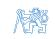

# Normal (Gaussian) distribution (2)

- ▶ Empirical experience properties of populations, physical experiments etc.
- ▶ Central limit theorem

**Theorem (Lindeberg/Lévy)** – continuous random variables

Let X<sup>i</sup> be a sequence of i.i.d. random variables, E {Xi} = *µ*, cov {Xi} = *σ* 2 . Then

$$Y_n = rac{1}{\sqrt{n}} \sum_{i=1}^n rac{X_i - \mu}{\sigma} 
ightarrow \mathcal{N}(0,1) \quad ext{ or } \quad \sum_{i=1}^n X_i 
ightarrow \mathcal{N}\left(n\mu, n\sigma^2
ight)$$

**Theorem (Moivre/Laplace)** – discrete random variables

Let X<sup>i</sup> be a sequence of i.i.d. random variables with alternative distribution P{X<sup>i</sup> = 1} = q, P{X<sup>i</sup> = 0} = 1 − q, E {Xi} = q, cov {Xi} = q(1 − q)). Then

$$Y_n = rac{1}{\sqrt{n}} \sum_{i=1}^n rac{X_i - q}{\sqrt{q(1-q)}} 
ightarrow \mathcal{N}(0,1) \quad ext{or} \quad \sum_{i=1}^n X_i 
ightarrow \mathcal{N}ig( nq, nq(1-q) ig)$$

# Normal (Gaussian) distribution (3)

▶ Maximum entropy principle

**Entropy** – a measure of uncertainty for a given p.d.f. f (x)

$$H(x) = -\int f(x) \ln f(x) \, dx$$

**Maximum entropy principle:** for given moments

$$\mathcal{E}\left\{g_i(x)\right\} = \int g_i(x)f(x)dx , \quad i = 1, \ldots, n$$

the probability density function f (x) resulting in maximum entropy H(x) can be characterized as

$$f(x) = K \exp \left(-\sum_{i=1}^{n} \lambda_i g_i(x)\right)$$

**Example:** assumption of normal distribution – minimum "added" information

$$\mathcal{E}\left\{x^{2}\right\} = M_{2} \qquad \rightarrow \qquad f(x) = K e^{-\lambda_{1}x^{2}} \sim \mathcal{N}\left(0, M_{2}\right)$$

$$\mathcal{E}\left\{(x - \mu)^{2}\right\} = C_{2} \qquad \rightarrow \qquad f(x) = K e^{-\lambda_{1}(x - \mu)^{2}} \sim \mathcal{N}\left(\mu, C_{2}\right)$$

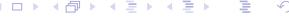

### Multivariable Gaussian bell function

Multivariable normal p.d.f.

$$X_i \sim \mathcal{N}\Big(\hat{x}, P\Big) \quad \to \quad p(x) = \frac{1}{(2\pi)^{n/2}} \; (\det P)^{-1/2} \; \exp\Big\{-\frac{1}{2}(x-\hat{x})^T P^{-1}(x-\hat{x})\Big\}$$

Covariance ellipsoid

$$E_{\alpha} = \left\{ x \mid (x - \hat{x})^{T} P^{-1} (x - \hat{x}) \leq \alpha \right\}$$

► Random variable  $(x-\hat{x})^T P^{-1}(x-\hat{x}) \sim \chi_n^2$ Why?

$$y = P^{-1/2}(x - \hat{x}) \sim \mathcal{N}(0, I_n)$$

$$cov \{y\} = \mathcal{E} \left\{ P^{-1/2} (x - \hat{x}) (x - \hat{x})^T P^{-T/2} \right\}$$
$$= P^{-1/2} P P^{-T/2} = I_n$$

$$y^T y = \sum_{i=1}^n y_i^2 \sim \chi_n^2$$

 $lackbox{ Probability content of covariance elipsoid } E_{lpha}$ 

$$Pr\left\{x\in E_{\alpha}\right\} = F_{\chi_{n}^{2}}(\alpha)$$

$$\chi_2^2(y) = \frac{1}{2^{\frac{n}{2}}\Gamma(\frac{n}{2})} y^{\frac{n}{2}-1} e^{-\frac{y}{2}} \bigg|_{x=2} = \frac{1}{2} e^{-\frac{y}{2}}$$


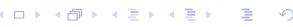

# Multivariable Gaussian bell function (2)

### Covariance ellipsoid shape

- ▶ Center of <sup>E</sup>*<sup>α</sup>* mean <sup>x</sup><sup>ˆ</sup>
- ▶ Semi-axes <sup>E</sup>*<sup>α</sup>* size/direction <sup>√</sup> *αλ*<sup>i</sup> v<sup>i</sup>

*λ*i *. . .* eigenvalues of covariance matrix P

vi *. . .* unit eigenvectors of covariance matrix P

### **Example**

Uncorrelated noise data xˆ = [0*,* 0]

$$P = \begin{bmatrix} 1 & 0 \\ 0 & 1 \end{bmatrix}, \ \lambda = \begin{bmatrix} 1.0 \\ 1.0 \end{bmatrix}, \ V = \begin{bmatrix} 1.0 & 0.0 \\ 0.0 & 1.0 \end{bmatrix}$$

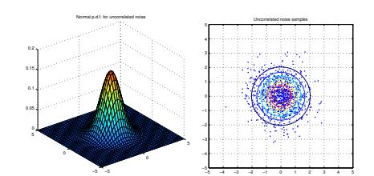

<sup>T</sup> Correlated noise data xˆ = [0*,* 0] T

$$P = \begin{bmatrix} 2 & 1 \\ 1 & 1 \end{bmatrix}, \ \lambda = \begin{bmatrix} 2.6 \\ 0.4 \end{bmatrix}, \ V = \begin{bmatrix} 0.8 & 0.5 \\ 0.5 & -0.8 \end{bmatrix}$$

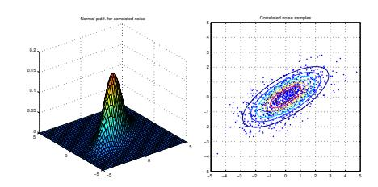

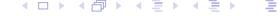

### Mean Square Estimate

### **MS problem formulation**

- ▶ Find estimate xˆ(y)
- ▶ x (random) vector to be estimated
- ▶ y observable data vector
- ▶ Information about x, y relationship joint p.d.f. p(x*,* y)
- ▶ Optimality criterion Mean Square (MS) error

$$J_{MS} = \int \int (x - \hat{x}_{MS}(y))^{T} (x - \hat{x}_{MS}(y)) p(x, y) dx dy$$

▶ Minimization – rewrite joint p.d.f. as p(x*,* y) = p(x|y) p(y)

$$J_{MS} = \int \int (x - \hat{x}_{MS}(y))^T (x - \hat{x}_{MS}(y)) p(x|y) dx p(y) dy$$

p.d.f. p(y) non-negative → sufficient to minimize inner integral (for each y)

$$J'_{MS}(y) = \int (x - \hat{x}_{MS}(y))^T (x - \hat{x}_{MS}(y)) p(x|y) dx$$


# Mean Square Estimate (2)

► Inner integral

$$J_{\mathsf{MS}}'(y) = \mathcal{E}\left\{\boldsymbol{x}^T\boldsymbol{x}|\boldsymbol{y}\right\} - \mathcal{E}\left\{\boldsymbol{x}|\boldsymbol{y}\right\}^T\hat{\boldsymbol{x}}_{\mathsf{MS}}(y) - \hat{\boldsymbol{x}}_{\mathsf{MS}}^T(y)\mathcal{E}\left\{\boldsymbol{x}|\boldsymbol{y}\right\} + \hat{\boldsymbol{x}}_{\mathsf{MS}}^T(y)\hat{\boldsymbol{x}}_{\mathsf{MS}}(y)$$

Stationary point

$$\frac{\partial J_{\rm MS}'}{\partial \hat{\mathbf{x}}_{\rm MS}(y)} = -2\mathcal{E}\left\{x|y\right\} + 2\hat{\mathbf{x}}_{\rm MS}(y) = 0 \quad \rightarrow \quad \hat{\mathbf{x}}_{\rm MS}(y) = \mathcal{E}\left\{x|y\right\}$$

#### Conclusion: MS estimate – conditional mean value

► Measure of quality – estimation error covariance matrix

$$P_{\tilde{\mathbf{x}}_{\mathsf{MS}}} = \mathcal{E}\left\{\tilde{\mathbf{x}}(y)\tilde{\mathbf{x}}^{\mathsf{T}}(y)\right\}, \quad \tilde{\mathbf{x}}(y) = \mathbf{x} - \hat{\mathbf{x}}_{\mathsf{MS}}(y), \quad \mathcal{E}\left\{\tilde{\mathbf{x}}\right\} = 0$$

$$P_{\tilde{x}_{\mathsf{MS}}} = \int \int \tilde{x}(y) \tilde{x}^{\mathsf{T}}(y) p(x|y) \ dx \ p(y) \ dy = \int P_{x|y}(y) p(y) \ dy = P_{x|y}$$

 $P_{x|y}(y)$  ..... covariance matrix of estimate error for given value of y

 $P_{x|y}$  ..... mean covariance matrix (independent of y)

► Criterion function – trace of error covariance matrix

$$J_{\mathsf{MS}} = \mathcal{E}\left\{\tilde{x}^{\mathsf{T}}\tilde{x}\right\} = \mathcal{E}\left\{\mathsf{tr}\;\tilde{x}^{\mathsf{T}}\tilde{x}\right\} = \mathcal{E}\left\{\mathsf{tr}\;\tilde{x}\tilde{x}^{\mathsf{T}}\right\} = \mathsf{tr}\;P_{\tilde{x}_{\mathsf{MS}}}$$


### Orthogonality principle

▶ Random variables x, y are **orthogonal** if

$$\mathcal{E}\left\{x^{T}y\right\} = \int\int x^{T}y \ p(x,y) \ dxdy = 0$$

▶ Orthogonality principle for MS estimate: any function g(y) of observed data y satisfies

$$\mathcal{E}\left\{g(y)^{T}\left(x-\mathcal{E}\left\{x|y\right\}\right)\right\}=0$$

Proof: direct calculation

- ▶ MS error (x − E {x|y}) is orthogonal to all functions of observed data g(y)
- ▶ MS estimate is the best estimate of x based on observable data y in terms of Euclidian norm

$$\mathcal{E}\{\|x - \mathcal{E}\{x|y\}\|\} \le \mathcal{E}\{\|x - g(y)\|\}$$

where Euclidian norm

$$\|x\| = \sqrt{x^T x}$$


### Linear Mean Square Estimate

### Mean Square estimate xˆMS(y) issues

- ▶ Requires knowledge of joint distribution difficult to obtain from data
- ▶ Results in conditional mean analytical solution may not exist

#### **LMS problem formulation**

▶ Find estimate xˆLMS(y) as a linear function of observed data

$$\hat{x}_{\mathsf{LMS}}(y) = Ay + b$$

- ▶ Information about x, y relationship joint 1st and 2nd moments only
- ▶ Optimality criterion Linear Mean Square (LMS) error

$$J_{\text{LMS}} = \int \int \left(x - \hat{x}_{\text{LMS}}(y)\right)^{T} \left(x - \hat{x}_{\text{LMS}}(y)\right) p(x, y) \ dx \ dy$$

# Linear Mean Square Estimate (2)

#### **LMS criterion minimization**

▶ Properties of trace operator

$$J_{LMS} = \mathcal{E}\left\{ (x - Ay - b)^{T} (x - Ay - b) \right\} = \text{tr } \mathcal{E}\left\{ (x - Ay - b) (x - Ay - b)^{T} \right\}$$
$$= \text{tr } \left[ P_{xx} + A(P_{yy} + \mu_{y}\mu_{y}^{T})A^{T} + (b - \mu_{x})(b - \mu_{x})^{T} + 2A\mu_{y}(b - \mu_{x})^{T} - 2AP_{yx} \right]$$

helpful hint: write x as *µ*<sup>x</sup> + ˜x

▶ Formulas from matrix analysis

$$\frac{\partial}{\partial Y} \operatorname{tr} XYZ = X^T Z^T, \qquad \frac{\partial}{\partial X} \operatorname{tr} XYX^T = 2XY$$

▶ Stationary point conditions

$$\frac{\partial}{\partial A}J_{LMS} = 2A(P_{yy} + \mu_y \mu_y^T) + 2(b - \mu_x)\mu_y^T - 2P_{xy} = 0$$

$$\frac{\partial}{\partial b}J_{LMS} = 2(b - \mu_x) + 2A\mu_y = 0$$

▶ Resulting estimate (covariance matrix <sup>P</sup>yy positive definite <sup>→</sup> is regular)

$$A = P_{xy}P_{yy}^{-1}, \qquad b = \mu_x - P_{xy}P_{yy}^{-1}\mu_y$$

depends only on the 1st and 2nd moments


# Linear Mean Square Estimate (3)

#### **Interpretation of LMS formula**

▶ Correction gain <sup>P</sup>xy<sup>P</sup> −1 yy

$$\hat{x}_{\mathsf{LMS}}(y) = \mu_{\mathsf{x}} + P_{\mathsf{x}\mathsf{y}}P_{\mathsf{y}\mathsf{y}}^{-1}\left(y - \mu_{\mathsf{y}}\right) \quad o \quad \hat{x}_{\mathsf{LMS}}(y) - \mu_{\mathsf{x}} = P_{\mathsf{x}\mathsf{y}}P_{\mathsf{y}\mathsf{y}}^{-1}\left(y - \mu_{\mathsf{y}}\right)$$

### **LMS error covariance**

▶ <sup>P</sup>x˜LMS does not depend on <sup>y</sup>

$$P_{\bar{x}_{LMS}} = \mathcal{E}\left\{ (x - \hat{x}_{LMS}(y)) (x - \hat{x}_{LMS}(y))^{T} \right\}$$

$$= \mathcal{E}\left\{ \left( (x - \mu_{x}) - P_{xy}P_{yy}^{-1}(y - \mu_{y}) \right) \left( (x - \mu_{x}) - P_{xy}P_{yy}^{-1}(y - \mu_{y}) \right)^{T} \right\}$$

$$= P_{xx} - P_{xy}P_{yy}^{-1}P_{yx}$$

#### **Orthogonality principle** for LMS estimate

▶ LMS error orthogonal to all **linear** functions of observable data g(y) = Ay + b

$$\operatorname{tr} \mathcal{E} \left\{ 1 \times \left( x - \hat{x}_{\mathsf{LMS}}(y) \right)^T \right\} = \operatorname{tr} \mathcal{E} \left\{ 1 \times \left( \left( x - \mu_x \right) - P_{xy} P_{yy}^{-1} \left( y - \mu_y \right) \right)^T \right\} = 0$$

$$\operatorname{tr} \mathcal{E} \left\{ y \left( x - \hat{x}_{\mathsf{LMS}}(y) \right)^T \right\} = \operatorname{tr} \mathcal{E} \left\{ y \left( \left( x - \mu_x \right) - P_{xy} P_{yy}^{-1} \left( y - \mu_y \right) \right)^T \right\} = 0$$

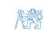


### MS and LMS estimate for normally distributed variables

**Joint normal p.d.f.**  $(y, x - \text{vectors with } n_y, n_x \text{ elements})$ 

$$p\left(\begin{bmatrix} y \\ x \end{bmatrix}\right) = \mathcal{N}\left(\begin{bmatrix} \mu_y \\ \mu_x \end{bmatrix}; \begin{bmatrix} P_{yy} & P_{yx} \\ P_{xy} & P_{xx} \end{bmatrix}\right)$$

$$p\left(\begin{bmatrix} y \\ x \end{bmatrix}\right) = (2\pi)^{-\frac{n_y+n_x}{2}} \det \begin{bmatrix} P_{yy} & P_{yx} \\ P_{xy} & P_{xx} \end{bmatrix}^{-\frac{1}{2}} \exp \left\{-\frac{1}{2} \begin{bmatrix} y - \mu_y \\ x - \mu_x \end{bmatrix}^T \begin{bmatrix} P_{yy} & P_{yx} \\ P_{xy} & P_{xx} \end{bmatrix}^{-1} \begin{bmatrix} y - \mu_y \\ x - \mu_x \end{bmatrix}\right\}$$

### Conditional p.d.f.

▶ Use chain rule p(x, y) = p(y) p(x|y)

$$p\left(\begin{bmatrix} y \\ x \end{bmatrix}\right) = (2\pi)^{-n_y/2} \det P_{yy}^{-1/2} \exp\left\{-\frac{1}{2} (y - \mu_y)^T P_{yy}^{-1} (y - \mu_y)\right\} \times \\
\times (2\pi)^{-n_x/2} \det P_{x|y}^{-1/2} \exp\left\{-\frac{1}{2} (x - \mu_{x|y})^T P_{x|y}^{-1} (x - \mu_{x|y})\right\}$$

where

$$\mu_{x|y} = \mu_x + P_{xy}P_{yy}^{-1}(y - \mu_y), \qquad P_{x|y} = P_{xx} - P_{xy}P_{yy}^{-1}P_{yx}$$

Conclusion: conditional mean is a linear function of the data, therefore

$$\hat{x}_{\mathsf{MS}}(y) = \hat{x}_{\mathsf{LMS}}(y)$$

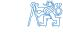

#### How to factorize the joint p.d.f. ?

ightharpoonup Joint covariance matrix ightharpoonup product of triangular matrices

$$\begin{bmatrix} P_{yy} & P_{yx} \\ P_{xy} & P_{xx} \end{bmatrix} \begin{bmatrix} I & -P_{yy}^{-1}P_{yx} \\ 0 & I \end{bmatrix} = \begin{bmatrix} P_{yy} & 0 \\ P_{xy} & P_{xx} - P_{xy}P_{yy}^{-1}P_{yx} \end{bmatrix}$$

ightharpoonup Transformation matrix with unit determinant ightharpoonup factor determinant

$$\det \begin{bmatrix} P_{yy} & P_{yx} \\ P_{xy} & P_{xx} \end{bmatrix} = \det \begin{bmatrix} P_{yy} \end{bmatrix} \det \begin{bmatrix} P_{xx} - P_{xy}P_{yy}^{-1}P_{yx} \end{bmatrix}$$

▶ Inverse of covariance matrix from inverse of triangular factors

$$\begin{bmatrix} P_{yy} & P_{yx} \\ P_{xy} & P_{xx} \end{bmatrix}^{-1} = \begin{bmatrix} P_{yy}^{-1} + P_{yy}^{-1} P_{yx} P_{x|y}^{-1} P_{xy} P_{yy}^{-1} & -P_{yy}^{-1} P_{x|y} P_{x|y}^{-1} \\ -P_{x|y}^{-1} P_{xy} P_{yy}^{-1} & P_{x|y}^{-1} \end{bmatrix}$$

► Factor quadratic form

$$\begin{bmatrix} y - \mu_y \\ x - \mu_x \end{bmatrix}^T \begin{bmatrix} P_{yy} & P_{yx} \\ P_{xy} & P_{xx} \end{bmatrix}^{-1} \begin{bmatrix} y - \mu_y \\ x - \mu_x \end{bmatrix} = (y - \mu_y)^T P_{yy}^{-1} (y - \mu_y) +$$

$$+ (x - \mu_x - P_{xy} P_{yy}^{-1} (y - \mu_y))^T P_{x|y}^{-1} (x - \mu_x - P_{xy} P_{yy}^{-1} (y - \mu_y))$$


### Maximum Likelihood Estimate

### Classical (frequentist) approach

- Parameter x of p.d.f.  $p_x(y)$  is a deterministic but unknown constant
- Sampled data

$$y \sim p_x(y) = p(y|x)$$

For deterministic x, the c.p.d.f. p(x|y) is not well defined

#### Likelihood function

ightharpoonup C.p.d.f. p(y|x) interpreted as a function of unknown parameter x

$$I(x|y) = p(y|x)$$

### Maximum Likelihood (ML) estimate

► Maximize the likelihood for given data

$$\hat{x}_{\mathsf{ML}}(y) = \arg\max_{x} I(x|y)$$

Likelihood equation (using the fact that log(.) function is monotonic)

$$\left. \frac{\partial \ln I(x|y)}{\partial x} \right|_{x = \hat{x}_{\text{MI}}} = 0$$

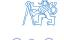

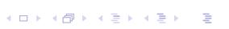

# Maximum Likelihood Estimate – example

### **Example: repeated measurement with gaussian noise**

▶ Measurement model y = Cx + e

$$p_e(e) = (2\pi)^{-n_y/2} |R|^{-1/2} \exp\left\{-\frac{1}{2}e^TR^{-1}e\right\}$$

▶ For given x, y is a linear transformation of r.v. e

$$y = Ie + Cx \rightarrow e = y - Cx \rightarrow p(y|x) = p_e(y - Cx)$$

(random variable transformation theorem)

▶ Likelihood function

$$I(x|y) = (2\pi)^{-n_y/2} |R|^{-1/2} \exp\left\{-\frac{1}{2}(y - Cx)^T R^{-1}(y - Cx)\right\}$$

log likelihood

$$\ln I(x|y) = -\frac{1}{2}(y - Cx)^{T}R^{-1}(y - Cx) - \frac{n_{y}}{2}\ln(2\pi) - \frac{1}{2}\ln|R|$$

likelihood equation

$$\frac{\partial \ln I(x|y)}{\partial x} = C^{T} R^{-1} (y - Cx) = 0$$


# Maximum Likelihood Estimate – example (2)

#### Resulting ML estimate

▶ Well designed experiment → matrix C has full rank

$$\hat{\mathbf{x}}_{\mathsf{ML}} = \left( C^{\mathsf{T}} R^{-1} C \right)^{-1} C^{\mathsf{T}} R^{-1} \mathbf{y}$$

▶ Model of *n* independent samples with various precision

$$C = \begin{bmatrix} 1 \\ \vdots \\ 1 \end{bmatrix}, \quad e \sim \mathcal{N} \left( \begin{bmatrix} 0 \\ \vdots \\ 0 \end{bmatrix}, \begin{bmatrix} \sigma_1^2 & & 0 \\ & \ddots & \\ 0 & & \sigma_n^2 \end{bmatrix} \right)$$

► ML estimate – weighted average

$$\hat{x}_{\mathsf{ML}} = \frac{\frac{y_1}{\sigma_1^2} + \dots + \frac{y_n}{\sigma_n^2}}{\frac{1}{\sigma_1^2} + \dots + \frac{1}{\sigma_n^2}}$$

weights proportional to precisions  $1/\sigma_i^2$ 

► For samples with equal precision – arithmetic average

$$\hat{x}_{ML} = \frac{y_1 + \dots + y_n}{n} = \bar{y}$$

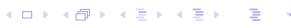

### Properties of ML estimate

#### Linear measurement model

$$y = Cx + e$$

ML estimate of x is unbiased

$$\mathcal{E}\left\{\hat{\mathbf{x}}_{\mathsf{ML}}|\mathbf{x}\right\} = \mathcal{E}\left\{\left.\left(\mathbf{C}^{\mathsf{T}}\mathbf{R}^{-1}\mathbf{C}\right)^{-1}\mathbf{C}^{\mathsf{T}}\mathbf{R}^{-1}(\mathbf{C}\mathbf{x} + \mathbf{e})\right|\mathbf{x}\right\} = \mathbf{x}$$

Estimation error covariance matrix

$$P_{\tilde{\mathbf{x}}_{\mathsf{ML}}} = \mathcal{E}\left\{ \left( \mathbf{x} - \hat{\mathbf{x}}_{\mathsf{ML}} \right) \left( \mathbf{x} - \hat{\mathbf{x}}_{\mathsf{ML}} \right)^{T} \middle| \mathbf{x} \right\} = \mathcal{E}\left\{ \tilde{\mathbf{x}}_{\mathsf{ML}} \tilde{\mathbf{x}}_{\mathsf{ML}}^{T} \middle| \mathbf{x} \right\}$$
$$= \left( C^{T} R^{-1} C \right)^{-1} C^{T} R^{-1} \mathcal{E}\left\{ e e^{T} \middle| \mathbf{x} \right\} R^{-1} C \left( C^{T} R^{-1} C \right)^{-1} = \left( C^{T} R^{-1} C \right)^{-1}$$

#### Theorem (Cramér–Rao)

Let  $\hat{x}(y)$  be unbiased estimate of parameter x based on data y. Then the covariance matrix of  $\tilde{x}_{ML}$  is bounded  $P_{\tilde{x}} \geq F^{-1}(x)$  by the Fischer information matrix

$$F(x) = \mathcal{E}\left\{ \left( \frac{\partial \ln I(x|y)}{\partial x} \right) \left( \frac{\partial \ln I(x|y)}{\partial x} \right)^T \right\} = -\mathcal{E}\left\{ \frac{\partial^2 \ln I(x|y)}{\partial x^2} \right\}.$$

Equality applies iff

$$\frac{\partial \ln I(x|y)}{\partial x} = k(x)(x - \hat{x}).$$


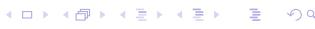

#### **Estimate is unbiased** – by definition

$$\mathcal{E}\left\{\hat{x}(y) - x \mid x\right\} = \int (\hat{x}(y) - x) \, p(y \mid x) = 0$$

▶ Derivative of this integral with respect to (unknown) parameter x

$$\frac{\partial}{\partial x} \int (\hat{x}(y) - x) \, p(y|x) dy = -\int p(y|x) dy + \int (\hat{x}(y) - x) \, \frac{\partial p(y|x)}{\partial x} \, dy = 0$$

first term R p(y|x)dy = 1

second term – log derivative 
$$\frac{\partial p(y|x)}{\partial x} = p(y|x) \frac{\partial \ln p(y|x)}{\partial x} = p(y|x) \frac{\partial \ln l(x|y)}{\partial x}$$

▶ Resulting formula

$$\int (\hat{x}(y) - x) \frac{\partial \ln I(x|y)}{\partial x} p(y|x) dy = 1$$

▶ Apply Schwarz inequality E {f (y)g(y)} ≤ p E {f <sup>2</sup>(y)} E {g <sup>2</sup>(y)}

$$\int (\hat{x}(y)-x)^2 \, \rho(y|x) \, dy \times \int \left\{ \frac{\partial \ln I(x|y)}{\partial x} \right\}^2 \rho(y|x) \, dy = \sigma_{\tilde{x}}^2 \, F(x) \ge 1$$

**Interpretation:** information about x – mean "curvature" of ln l(x|y)


# Properties of ML estimate (2)

▶ Estimate is **efficient** – Cramer Rao bound

$$P_{\tilde{x}} = F^{-1}$$

▶ Estimate is **consistent** – convergency in probability

$$P(\|x - \hat{x}(y_1, \dots, y_n)\| > \varepsilon) \to 0 \text{ for } n \to \infty$$

**Example:** Repeated measurement with gaussian noise (contd.)

▶ Fischer information matrix

$$\ln I(x|y) = -\frac{1}{2}(y - Cx)^{T}R^{-1}(y - Cx) - \frac{n_{y}}{2}\ln(2\pi) - \frac{1}{2}\ln|R|$$

$$\partial \ln I(x|y) = C^{T}R^{-1}(y - Cx) - \frac{\partial^{2}\ln I(x|y)}{\partial x^{2}} = C^{T}R^{-1}C$$

$$\frac{\partial \operatorname{III}(X|Y)}{\partial x} = C^T R^{-1} (y - Cx), \qquad \frac{\partial \operatorname{III}(X|Y)}{\partial x^2} = -C^T R^{-1} C = -F$$

**Conclusion 1:** Px˜ML = F <sup>−</sup><sup>1</sup> , estimate xˆML(y) is efficient

▶ Convergence (for *σ* n limited)

$$F = P_{\tilde{\mathbf{x}}_{\mathsf{ML}}}^{-1} = \boldsymbol{C}^T \boldsymbol{R}^{-1} \boldsymbol{C} = \frac{1}{\sigma_1^2} + \dots + \frac{1}{\sigma_n^2} \;, \quad \mathsf{therefore} \quad P_{\tilde{\mathbf{x}}_{\mathsf{ML}}} \to 0$$

**Conclusion 2:** Px˜ML → 0, estimate xˆML(y) is consistent


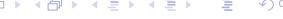

# Comparison of MS and a ML estimate

#### **Linear measurement model**

$$y = Cx + e, \quad e \sim \mathcal{N}(0, R)$$

#### **MS estimate**

▶ Minimize parameter error

$$J_{\mathsf{MS}} = \mathcal{E}\left\{ \left( x - \hat{x}_{\mathsf{MS}} \right)^{\mathsf{T}} \left( x - \hat{x}_{\mathsf{MS}} \right) \right\}$$

▶ Formula MS estimate

$$P_{\tilde{\mathbf{x}}_{\mathsf{MS}}} = \left(P_{\mathsf{xx}}^{-1} + C^{\mathsf{T}} R^{-1} C\right)^{-1} \quad \rightarrow \quad \hat{\mathbf{x}}_{\mathsf{MS}} = \mu_{\mathsf{x}} + P_{\tilde{\mathbf{x}}_{\mathsf{MS}}} C^{\mathsf{T}} R^{-1} \left(y - C \mu_{\mathsf{x}}\right)$$

#### **ML estimate**

▶ Minimize weighted prediction error

$$J_{\mathsf{ML}} = \mathcal{E}\left\{ \left( y - C\hat{x}_{\mathsf{ML}} \right)^{\mathsf{T}} R^{-1} \left( y - C\hat{x}_{\mathsf{ML}} \right) \right\}$$

▶ Formula for ML estimate

$$P_{\tilde{\mathbf{x}}_{\mathsf{ML}}} = \left(C^{\mathsf{T}}R^{-1}C\right)^{-1} \quad \to \quad \hat{\mathbf{x}}_{\mathsf{ML}} = P_{\tilde{\mathbf{x}}_{\mathsf{ML}}}C^{\mathsf{T}}R^{-1}\mathbf{y}$$

▶ Limit case of MS estimate (missing prior information on x)

$$\mu_{\scriptscriptstyle \mathsf{X}} = 0, \quad P_{\scriptscriptstyle \mathsf{XX}}^{-1} = 0 \quad \text{or} \quad P_{\scriptscriptstyle \mathsf{XX}} o \infty$$

▶ Regularized ML estimate (<sup>P</sup> −1 x˜ML = *ε*I + C <sup>T</sup> R <sup>−</sup>1C or P −1 x˜ML = P −1 xx + C <sup>T</sup> R <sup>−</sup>1C)


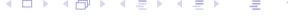

#### **Formulas for MS estimate**

▶ MS estimate covariance

$$P_{\bar{x}_{MS}} = P_{xx} - P_{xy} P_{yy}^{-1} P_{yx}$$

$$= P_{xx} - P_{xx} C^{T} (CP_{xx} C^{T} + R)^{-1} CP_{xx}$$

$$= (P_{xx}^{-1} + C^{T} R^{-1} C)^{-1}$$

last step follows from Matrix Inversion Lemma (MIL)

$$(A + BCD)^{-1} = A^{-1} - A^{-1}B(C^{-1} + DA^{-1}B)^{-1}DA^{-1}$$

▶ MS estimate mean

$$\hat{x}_{MS} = \mu_{x} + P_{xy} P_{yy}^{-1} (y - \mu_{y})$$

$$= \mu_{x} + P_{xx} C^{T} (CP_{xx} C^{T} + R)^{-1} (y - C\mu_{x})$$

$$= \mu_{x} + P_{\tilde{x}_{MS}} C^{T} R^{-1} (y - C\mu_{x})$$

### Examples of ML estimates

#### Alternative/Bernouli distribution

▶ Result of coin tossing experiment

$$P{X=1} = \theta, P{X=0} = 1-\theta \rightarrow p(x|\theta) = \theta^{x}(1-\theta)^{1-x}, x \in {0,1}$$

for *n* independent trials  $x = [x_1, x_2, \dots, x_n]^T$ 

$$\rho_n(x|\theta) = \prod_{i=1}^n \theta^{x_i} (1-\theta)^{1-x_i}, \ x_i \in \{0,1\}$$

Log likelihood function

$$L_n(\theta) = \ln p_n(x|\theta) = \sum_{i=1}^n \{x_i \ln \theta + (1-x_i) \ln(1-\theta)\} = n\bar{X} \ln \theta + n(1-\bar{X}) \ln(1-\theta)$$

likelihood equation

$$\frac{dL_n(\theta)}{d\theta} = n\bar{X}\frac{1}{\theta} - n(1-\bar{X})\frac{1}{1-\theta} = 0 \quad \to \quad \widehat{\theta}_{ML} = \bar{X}$$

- Conclusions
  - ▶ ML estimate is defined by sample average
  - ► ML estimate can be updated recursively


# Examples of ML estimates (2)

#### Uniform distribution

Probability density function

$$p(x|\theta) = U_{\theta}(x) = \frac{1}{2\theta}$$
 for  $x \in \langle -\theta, \theta \rangle$   
= 0 otherwise

Likelihood function – estimate θ should maximize

$$I_n(\theta) = \rho_n(x|\theta) = \left(\frac{1}{2\theta}\right)^n$$

for all observed  $x_i \in \langle -\theta, \theta \rangle$ 

- Conclusions
  - ▶ ML estimate is defined by sample maximum

$$\widehat{\theta}_{ML} = \max_{i} |x_i|$$

ML estimate can be updated recursively


### Examples of ML estimates (3)

#### Cauchy distribution

▶ Probability density function

$$C_{\theta}(x) = \frac{1}{\pi \left(1 + (x - \theta)^2\right)}$$

$$p_n(x|\theta) = \frac{1}{\pi^n} \prod_{i=1}^n \frac{1}{(1+(x_i-\theta)^2)}$$

- ► "Heavy tails" used in robustness analysis
- Log likelihhod

$$L_n(\theta) = -n \ln \pi - \sum_i \ln \left(1 + (x_i - \theta)^2\right)$$

maximize  $L_n(\theta) \rightarrow$  minimize the term

$$f(\theta) = \sum_{i} \ln \left(1 + (x_i - \theta)^2\right)$$

- Conclusions
  - only numerical solution available
  - ▶ no "smaller" statistics than the full data set


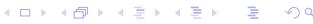

# <span id="page-34-0"></span>**3. Bayesian method**


### Classical vs. bayesian statistics

#### **Classical (frequentist) approach**

- ▶ Probability = limit of relative frequency of given event
- ▶ Objective quality, independent of the observer
- ▶ Limit results based on infinite data set

### **Bayesian approach**

- ▶ Probability density function can describe
  - ▶ **randomness** of a family of i.i.d. samples "objective" p.d.f.
  - ▶ **uncertainty** of a single parameter "subjective" p.d.f.
- ▶ Rational behaviour under uncertainty
  - ▶ uncertainty has the same structure as probability
  - ▶ probability theory tool for description of accumulation of information from data
- ▶ Analysis based on finite data set
- ▶ Still a matter of dispute

### Bayesian inference

#### Elements of Bayes formula

Bayes formula (we do not "estimate" – we "calculate" posterior)

$$p(\theta|y) = \frac{p(y|\theta) p(\theta)}{p(y)} = \frac{p(y|\theta) p(\theta)}{\int p(y|\theta) p(\theta) d\theta}$$

 $\blacktriangleright$  Model: explain observations  $y_i$  by some unknown internal parameter  $\theta$  (direct probability)

$$p(y|\theta) \rightarrow \text{likelihood } l(\theta|y)$$

 $\triangleright$  Subjective p.d.f. of parameter  $\theta$  – statistician's knowledge about the world (inverse probability)

$$p(\theta|y_1), p(\theta|y_1, y_2), \ldots, p(\theta|y_1, y_2, \ldots, y_n)$$

subjective knowledge is corrected by objective information in the data

$$p(\theta|y_1) \propto l(\theta|y_1)p(\theta)$$

$$p(\theta|y_1, y_2) \propto l(\theta|y_2)p(\theta|y_1)$$

$$\vdots$$

$$p(\theta|y_1, y_2, \dots, y_n) \propto l(\theta|y_n)p(\theta|y_1, y_2, \dots, y_{n-1})$$

- posterior c.p.d.f. is proportional to prior c.p.d.f. multiplied by likelihood
- likelihood  $I(\theta|y_i)$  represents all **information** about  $\theta$  in the data item  $y_i$
- p.d.f. describes uncertainty in parameter vs. randomness in observations


# Bayesian inference - unfair coin example

#### **Application of Bayesian formula**

▶ Model: experiment outcome y ∈ {0*,* 1}

$$P\{Y=1\} = \theta, P\{Y=0\} = 1-\theta \rightarrow p(y|\theta) = \theta^{y}(1-\theta)^{1-y}$$

- ▶ Prior p.d.f.: p(*θ*) = 1 for *θ* ∈ ⟨0*,* 1⟩, otherwise p(*θ*) = 0
- ▶ Update by nth independent trial

$$p(\theta|y_1,\ldots,y_n) \propto \theta^{y_n} (1-\theta)^{1-y_n} p(\theta|y_1,\ldots,y_{n-1})$$

▶ Resulting c.p.d.f. for *θ* = 0*.*35, n = 1*,* 3*,* 5*,* 10*,* 40

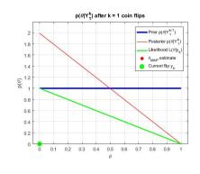

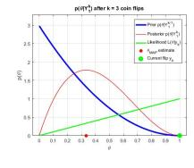

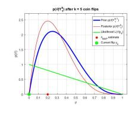


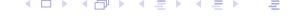

# Bayesian inference (2)

#### **Conjugated prior**

▶ Utilize naturally recursive character of bayesian update

$$p(\theta|y_1, y_2, \ldots, y_n) \propto I(\theta|y_n) p(\theta|y_1, y_2, \ldots, y_{n-1})$$

- ▶ Analytic formula for p.d.f. is preserved (invariant w.r.t. update by likelihood) (for example normal prior × normal likelihood → normal posterior )
- ▶ **Functional** recursion can be reduced to **algebraic** recursion on parameters of p.d.f. (for example mean and covariance for normal distribution)
- ▶ Selection of prior information supplementary reading

### **Chain rule**

- ▶ Composition of uncertain information
- ▶ No assumption on independency (e.g. for time dependent variables)

$$\begin{aligned}
\rho(y_2, y_1) &= \rho(y_2|y_1) \rho(y_1) \\
\rho(y_3, y_2, y_1) &= \rho(y_3|y_2, y_1) \rho(y_2|y_1) \rho(y_1) \\
\rho(y_n, y_{n-1}, \dots, y_1) &= \prod_{k=2}^{n} \rho(y_k|y_{k-1}, \dots, y_1) \cdot \rho(y_1)
\end{aligned}$$

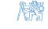


### Supplementary reading

Selection of prior p.d.f.

Core of bayesian approach criticism - dependence of the result on prior selection

- ▶ Non-informative prior locally flat with respect to likelihood function
- ▶ Principle of stable estimate information in data will dominate the prior (otherwise experiment does not make much sense)
- ▶ Informative prior can improve transient properties (e.g. parameter identification for adaptive control)

Problem – how to parameterize the model ?

- ▶ Inference in different "coordinates" may result in different results ? (e.g. estimation of *σ* vs. *σ* 2 )
- ▶ In which coordinates is the locally flat p.d.f. really non-informative ?

#### **Jeffrey's rule**

▶ Prior p.d.f. should be proportional to square root of Fischer information

$$p(\theta) \propto F(\theta)^{1/2} = \mathcal{E} \left\{ -\frac{\partial^2 \ln I(\theta|y)}{\partial \theta^2} \right\}^{1/2}$$

▶ Prior p.d.f. uniform iff F(*θ*) does not depend on *θ* – "data translated" likelihood

### Example (prior p.d.f. for scale parameter)

Assume  $\mu$  is known

$$y = [y_1, \ldots, y_n]^T \sim \mathcal{N}(\mu, \sigma^2)$$

lacktriangle Likelihood function for  $\sigma$  is not "data translated" (data  $\sim$  statistics  $n,\ s^2$ )

$$l(\sigma|\mu,y) = \prod_{i=1}^{n} \frac{1}{\sqrt{2\pi}\sigma} e^{-\frac{(y_i - \mu)^2}{2\sigma^2}} \propto \sigma^{-n} e^{-\frac{ns^2}{2\sigma^2}}, \qquad s^2 = \frac{1}{n} \sum_{i=1}^{n} (y_i - \mu)^2$$

 $\blacktriangleright$  Use transformed coordinates In  $\sigma$ 

$$I(\sigma|\mu,y) \propto \frac{s^n}{\sigma^n} e^{-\frac{ns^2}{2\sigma^2}} \rightarrow I(\ln \sigma|\mu,y) \propto \exp\left(n(\ln s - \ln \sigma) - \frac{n}{2} e^{2(\ln s - \ln \sigma)}\right)$$

likelihood function  $I(\ln \sigma | \mu, y)$  is "data translated" (can you validate ?) non-informative prior for  $\ln \sigma$  is uniform p.d.f. (for  $\sigma > 0$ )

Non-informative prior for  $\sigma$  (theorem on transformation of p.d.f.)

$$p(\log \sigma | \mu) \propto 1 \quad \to \quad p(\sigma | \mu) = p(\log \sigma | \mu) \left| \frac{d \log \sigma}{d\sigma} \right| \propto \sigma^{-1}$$


## Parameters of normal distribution

### **Estimation of** *µ* **for known** *σ*

**Goal:** Find posterior p.d.f. p(*µ*| *σ,* y)

$$y = [y_1, \dots, y_n]^T \sim \mathcal{N}(\mu, \sigma^2)$$
,  $\sigma^2$  is known

▶ Likelihood function

$$I(\mu|\sigma,y) = \prod_{i=1}^{n} \frac{1}{\sqrt{2\pi}\sigma} \exp\left(-\frac{(y_i-\mu)^2}{2\sigma^2}\right) \propto \exp\left(-\frac{(\mu-\overline{y})^2}{2\sigma^2/n}\right)$$

- ▶ Data represented by sample average y = <sup>1</sup> n P<sup>n</sup> i=1 yi
- ▶ Non-informative prior p(*µ*| *σ*) ∝ const.
- ▶ Posterior p.d.f.

$$p(\mu|\sigma,y) \;=\; \left(2\pi\sigma^2/n\right)^{-1/2} \; \mathrm{e}^{-\displaystyle\frac{\left(\mu-\overline{y}\right)^2}{2\sigma^2/n}} \;=\; \mathcal{N}\left(\overline{y}\,,\,\frac{\sigma^2}{n}\right)$$

compare with sample average properties


# Parameters of normal distribution (2)

### **Simultaneous estimate of** *µ* **and** *σ*

**Goal:** Find posterior p.d.f. p(*µ, σ*| y)

▶ Likelihood function

$$I(\mu, \sigma | y) = \prod_{i=1}^{n} \frac{1}{\sqrt{2\pi}\sigma} \exp\left(-\frac{(y_i - \mu)^2}{2\sigma^2}\right) \propto \sigma^{-n} \exp\left(-\frac{1}{2\sigma^2} \sum_{i=1}^{n} (y_i - \mu)^2\right)$$

arrange the exponent as

$$\sum_{i=1}^{n} (y_i - \mu)^2 = \sum_{i=1}^{n} (y_i - \overline{y})^2 + n(\overline{y} - \mu)^2 = \nu s^2 + n(\overline{y} - \mu)^2$$

▶ Data represented by sample average, degrees of freedom and sample variance

$$\overline{y} = \frac{1}{n} \sum_{i=1}^{n} y_i, \quad \nu = n-1, \quad s^2 = \frac{1}{\nu} \sum_{i=1}^{n} (y_i - \overline{y})^2$$

▶ Resulting likelihood form

$$I(\mu, \sigma | y) \propto \sigma^{-n} \exp\left(-\frac{1}{2} \frac{(\mu - \overline{y})^2}{\sigma^2/n} - \frac{\nu}{2} \frac{s^2}{\sigma^2}\right)$$

▶ Non-informative prior p(*µ*| *σ*) ∝ const., p(*σ*) ∝ *σ*−<sup>1</sup>


# Parameters of normal distribution (3)

▶ Posterior p.d.f.

$$p(\mu, \sigma | y) = \left(\frac{n}{2\pi}\right)^{1/2} \frac{2}{\Gamma(\nu/2)} \left(\frac{\nu s^2}{2}\right)^{\nu/2} \sigma^{-(n+1)} \exp\left(-\frac{(\mu - \overline{y})^2}{2\sigma^2/n} - \frac{\nu s^2}{2\sigma^2}\right)$$

can be normalized using integrals

$$\int_{0}^{\infty} x^{-(\nu+1)} e^{-a/x^{2}} dx = \frac{1}{2} a^{-\nu/2} \Gamma(\nu/2)$$
$$\int_{-\infty}^{\infty} e^{-\frac{1}{2\sigma^{2}}(x-\mu)^{2}} dx = \sqrt{2\pi}\sigma$$

▶ Joint posterior can be factorized as p(*µ, σ*| y) = p(*µ*| *σ,* y) p(*σ*| y)

Conditional p.d.f. for *µ*

$$p(\mu | \sigma, y) = (2\pi\sigma^2/n)^{-1/2} \exp\left(-\frac{(\mu - \overline{y})^2}{2\sigma^2/n}\right) = \mathcal{N}\left(\overline{y}, \frac{\sigma^2}{n}\right)$$

Marginal p.d.f. for *σ*

$$p(\sigma|y) = \frac{2}{\Gamma(\nu/2)} \left(\frac{\nu s^2}{2}\right)^{\nu/2} \sigma^{-(\nu+1)} \exp\left(-\frac{\nu s^2}{2\sigma^2}\right) = \chi_{\nu}^2 \left(\frac{\nu s^2}{\sigma^2}\right)$$

mean value E *σ* 2 | y = s


# Parameters of normal distribution (3)

### **Marginal c.p.d.f. of** *µ* **for unknown** *σ*

▶ Example of nuisance parameter use

$$p(\mu|y) = \int_0^\infty p(\mu|\sigma, y) p(\sigma|y) d\sigma$$

▶ Using the same integrals as previous slide, get

Normalized p.h.p. of *µ*

$$p(\mu|y) = \left(\frac{n}{\nu s^2}\right)^{1/2} \frac{\Gamma((\nu+1)/2)}{\Gamma(\nu/2)\Gamma(1/2)} \left[1 + \frac{n(\mu-\overline{y})^2}{\nu s^2}\right]^{-\frac{\nu+1}{2}}$$

i.e. normalized value t = *µ* − y s*/* √ n ∼ Student t-distribution with *ν* degrees of freedom

$$p(t) = t\left(\overline{y}, s^2/n, \nu\right) = \left(\frac{1}{\nu}\right)^{1/2} \frac{\Gamma\left((\nu+1)/2\right)}{\Gamma(\nu/2)\Gamma(1/2)} \left[1 + \frac{t^2}{\nu}\right]^{-\frac{\nu+1}{2}}$$

For large *ν* ≫ 10, Student t-distribution can be approximated by normal distribution

$$e^{x} = \lim_{n \to \infty} \left( 1 + \frac{x}{n} \right)^{n}$$


# Sufficient statistics

#### **Likelihood principle**

▶ Data affect the posterior only via likelihood function

$$p(\theta|y) \propto I(\theta|y) p(\theta)$$

▶ Estimate of *µ* for given *σ*

$$I(\mu|\sigma,y) \propto \exp\left(-rac{(\mu-\overline{y})^2}{2\sigma^2/n}
ight)$$

sufficient statistics for *µ* – a couple {y*,* n} or equivalent

▶ Simultaneous estimate of *µ*, *σ*

$$I(\mu,\sigma|\,y) \propto \sigma^{-(n\!+\!1)} \; \exp\left(-rac{(\mu-\overline{y})^2}{2\sigma^2/n} - rac{(n-1)s^2}{2\sigma^2}
ight)$$

sufficient statistics for *µ, σ* – a triple {y*,* s 2 *,* n} or equivalent

- ▶ Statistic with minimum number of elements minimal sufficient statistic
- ▶ Existence of finite sufficient statistics
  - ▶ accumulation of information from data in limited memory space
  - ▶ corresponds to the concept of "state" of dynamic system

### Informative prior for $\sigma$

#### Thought experiment

▶ Define the prior p.d.f.  $p(\sigma)$  by using auxiliary data set

$$y_a = [y_{a1}, \ldots, y_{a_{n_a}}]^T$$

resulting posterior p.d.f. of  $\sigma$  can be used as informative prior

$$p(\sigma) = p(\sigma | y_a) \propto \sigma^{-(\nu_a + 1)} \exp\left(-\frac{\nu_a s_a^2}{2\sigma^2}\right)$$

Posterior p.d.f. using actual data

$$p(\sigma|y) \propto \sigma^{-(\nu_a + \nu + 1)} \exp\left(-\frac{\nu_a s_a^2 + \nu s^2}{2\sigma^2}\right) = \sigma^{-(\overline{\nu} + 1)} \exp\left(-\frac{\overline{\nu} \, \overline{s}^2}{2\sigma^2}\right)$$

- ▶ Degrees of freedom  $\overline{\nu} = \nu_a + \nu$
- $\blacktriangleright \text{ Variance } \overline{\nu}\,\overline{s}^2 = \nu_a s_a^2 + \nu s^2$
- ightharpoonup Conditional  $p(\mu | \sigma, y)$  will not be affected

Composition of informative prior with data – initial statistics

- $\triangleright \nu_a$  prior accuracy (in terms of sample size)
- $ightharpoonup s_a^2$  prior information about  $\sigma^2$  value


# <span id="page-47-0"></span>**4. Parameter estimation**


# Model of a dynamic system for control

#### **Objective:** system identification for optimal (adaptive) control based on observed data

▶ Data available at time t: input variables u, output variables y

$$\mathcal{D}^{t} = \{u(0), y(0), \dots, u(t), y(t)\}\$$

▶ Problem formulation: optimal control law on T-step horizon – criterion

$$\mathcal{J} = \mathcal{E}\left\{J\left(\mathcal{D}_{t+1}^{t+T}
ight) \middle| \mathcal{D}^{t}
ight\} = \int J\left(\mathcal{D}_{t+1}^{t+T}
ight) 
ho\left(\left.\mathcal{D}_{t+1}^{t+T}\middle| \mathcal{D}^{t}
ight) \right. \left. d\left.\mathcal{D}_{t+1}^{t+T}
ight.$$

▶ Need to evaluate p.d.f (using chain rule)

p

$$\begin{split} \left( \left. \mathcal{D}_{t+1}^{t+T} \right| \mathcal{D}^{t} \right) &= & \rho \left( y(t+T) | u(t+T), \mathcal{D}^{t+T-1} \right) \ \rho \left( u(t+T) | \mathcal{D}^{t+T-1} \right) \\ &\times & \cdots \\ &\times & \rho \left( y(t+2) | u(t+2), \mathcal{D}^{t+1} \right) \ \rho \left( u(t+2) | \mathcal{D}^{t+1} \right) \\ &\times & \rho \left( y(t+1) | u(t+1), \mathcal{D}^{t} \right) \ \rho \left( u(t+1) | \mathcal{D}^{t} \right) \end{split}$$

# Model of a dynamic system for control (2)

**Controlled system model** = set of c.p.d.f.

$$p\left(y(t) \mid u(t), \mathcal{D}^{t-1}\right)$$

**Control law** = set of c.p.d.f.

$$p\left(u(t)\left|\mathcal{D}^{t-1}\right.\right)$$

### **Sampling scheme**

▶ Information available at time t → information delay in closed loop (causality of the control law)

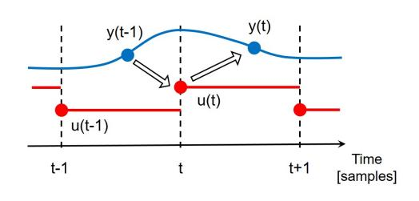

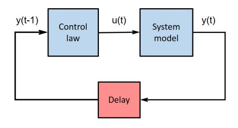

**System model = predictor** of system output based on history and current input

### Model structure and parameters

#### System model / predictor

- ► Non-parametric (used in ML/AI)
- Parametric (preferred in system identification why ?)

$$p\left(y(t)\Big|u(t),\mathcal{D}^{t-1}
ight) = \int p\left(y(t)\Big|u(t),\mathcal{D}^{t-1}, heta
ight) p\left( heta\Big|u(t),\mathcal{D}^{t-1}
ight) d heta$$

- Model structure  $p\left(y(t) | u(t), \mathcal{D}^{t-1}, \theta\right)$
- Knowledge of parameters  $p\left(\theta \middle| u(t), \mathcal{D}^{t-1}\right)$

# **Update of parameter knowledge** based on new data $\{u(t), y(t)\}$

$$\rho\left(\theta \middle| \mathcal{D}^{t}\right) = \frac{\rho\left(y(t) \middle| u(t), \mathcal{D}^{t-1}, \theta\right) \rho\left(\theta \middle| u(t), \mathcal{D}^{t-1}\right)}{\rho\left(y(t) \middle| u(t), \mathcal{D}^{t-1}\right)} \\
\propto \rho\left(y(t) \middle| u(t), \mathcal{D}^{t-1}, \theta\right) \rho\left(\theta \middle| \mathcal{D}^{t-1}\right)$$

- lacktriangle Model structure likelihood function of parameter heta
- Assumption  $p\left(\theta \middle| u(t), \mathcal{D}^{t-1}\right) = p\left(\theta \middle| \mathcal{D}^{t-1}\right)$

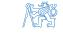

# Model structure and parameters (2)

#### **Natural condition of control**

$$p\left(\theta \middle| u(t), \mathcal{D}^{t-1}\right) = p\left(\theta \middle| \mathcal{D}^{t-1}\right)$$

#### Interpretation

- 1. Calculation of new input does not affect knowledge of internal parameters
  - ▶ valid for LQG controller with incomplete state information
  - ▶ not true for LQ with complete state information
- 2. Implies also

$$p\left(u(t)\middle|\theta,\mathcal{D}^{t-1}\right)=p\left(u(t)\middle|\mathcal{D}^{t-1}\right)$$

▶ two alternatives how to factor joint p.d.f.

$$\begin{split} \rho\left(\theta, u(t) \middle| \mathcal{D}^{t-1}\right) &= \rho\left(\theta \middle| u(t), \mathcal{D}^{t-1}\right) \rho\left(u(t) \middle| \mathcal{D}^{t-1}\right) \\ &= \rho\left(u(t) \middle| \theta, \mathcal{D}^{t-1}\right) \rho\left(\theta \middle| \mathcal{D}^{t-1}\right) \\ &= \rho\left(\theta \middle| \mathcal{D}^{t-1}\right) \rho\left(u(t) \middle| \mathcal{D}^{t-1}\right) \end{split}$$

▶ all information relevant for control law design is contained in the data Dt−<sup>1</sup>

# Model structure and parameters (3)

#### **Time varying systems**

▶ Parameter *θ* is (slowly) time varying

$$p\left(y(t)|u(t),\mathcal{D}^{t-1}
ight) = \int p\left(y(t)|u(t),\mathcal{D}^{t-1}, heta(t)
ight) \; p\left( heta(t)|u(t),\mathcal{D}^{t-1}
ight) \; d heta(t)$$

#### **Update of parameter c.p.d.f. in two steps**

▶ **Data update** step (filtering) – using bayes formula

$$\begin{split} \rho\left(\theta(t)|\mathcal{D}^{t-1}\right) &\to \rho\left(\theta(t)|\mathcal{D}^{t}\right) \\ \left(\theta(t)|\mathcal{D}^{t}\right) &\propto \rho\left(y(t)|u(t),\mathcal{D}^{t-1},\theta(t)\right) &\rho\left(\theta(t)|\mathcal{D}^{t-1}\right) \end{split}$$

▶ **Time update** step (prediction) – using model

$$p\left( heta(t+1)|\mathcal{D}^t
ight) = \int p\left( heta(t+1)| heta(t),\mathcal{D}^t
ight) \; p\left( heta(t)|\mathcal{D}^t
ight) \; d heta(t)$$

▶ **Parameter development model** not known, replaced by heuristics (forgetting)

p *θ*(t)|D<sup>t</sup> → p *θ*(t +1)|D<sup>t</sup>

p

$$ho\left( heta(t\!+\!1)| heta(t),\mathcal{D}^t
ight)$$

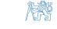


# Frequently used structures of input-output models

#### **Data generator**

▶ State-space model of linear stochastic system

$$x(t+1) = Ax(t) + Bu(t) + v(t)$$
  
$$y(t) = Cx(t) + Du(t) + e(t)$$

$$ightharpoonup v(t)$$
,  $e(t)$  white sequences,  $\mathcal{E}\left\{\left[egin{array}{c} v(t)\\ e(t) \end{array}\right]\left[egin{array}{c} v(t)\\ e(t) \end{array}\right]^T\right\}=\left[egin{array}{c} Q & 0\\ 0 & R \end{array}\right]$ 

#### **Output data properties**

▶ Deterministic part of the model (I/O transfer function)

$$G(z) = C(zI - A)^{-1}B + D$$

▶ Stochastic part of the model (factorized power spectrum density)

$$S_{yy}(z) = C(zI - A)^{-1}Q(z^{-1}I - A)^{-T}C^{T} + R = H(z)\Sigma_{e}H^{T}(z^{-1})$$

▶ Generic I/O description of generated data

$$y(t) = G(d)u(t) + H(d)e(t)$$
  $d = z^{-1}$  delay operator

▶ Pulse response matrices

$$G(d) = G_0 + G_1 d + G_2 d^2 + \cdots$$
 deterministic transfer function  $H(d) = I + H_1 d + H_2 d^2 + \cdots$  noise shaping filter (monic)


# Frequently used structures of input-output models (2)

**System model for control** – predictive c.p.d.f. p y(t)|u(t)*,* Dt−<sup>1</sup> *, θ*

### **Equivalent "data generator" and "predictor"**

▶ Spectral factorization of <sup>S</sup>yy (z)

$$H(d)$$
 stable, minimum phase  $\rightarrow$  inverse filter  $H^{-1}(d)$  stable

▶ Noise sequence e(t) given by data u(t), y(t)

$$e(t) = H^{-1}(d) \Big( y(t) - G(d)u(t) \Big)$$

▶ Predicted output value y(t) – separate past and new information

$$y(t) = G(d)u(t) + (H(d) - I)e(t) + e(t)$$
$$= \hat{y}(t | \mathcal{D}^{t-1}, u(t), \theta) + e(t)$$

second term depends only on past data Dt−<sup>1</sup>

$$(H(d) - I)e(t) = H_1e(t-1) + H_2e(t-2) + \cdots$$

simplified notation yˆ t <sup>D</sup>t−<sup>1</sup> *,* u(t)*, θ* = ˆy (t |t−1*,* u(t) )


# Frequently used structures of input-output models (3)

#### **Predictor equation**

▶ Predicted mean value – depends on noise properties

$$\hat{y}(t|t-1, u(t)) = H^{-1}(d)G(d)u(t) + \left(I - H^{-1}(d)\right)y(t)$$

predictor vs. data generator dynamics

$$\hat{y}(t|t-1, u(t)) = H^{-1}(d)G(d)u(t) + (I-H^{-1}(d))(G(d)u(t) + H(d)e(t))$$

$$= G(d)u(t) + (H(d)-I)e(t)$$

▶ Probabilistic description

$$y(t) = \hat{y}(t|t-1, u(t)) + e(t), \quad e(t) \sim p_e(.)$$

transformation of random variable e(t)

$$p(y(t)|u(t), \mathcal{D}^{t-1}, \theta) = p_{e}\left(y(t) - \hat{y}\left(t|t-1, u(t)\right)\right)$$

# ARX model

### **ARX model** (Auto Regressive model with eXternal input)

▶ Linear difference equation + stochastic term e(t) ∼ 0*, σ*<sup>2</sup> e 

$$y(t) + a_1 y(t-1) + \dots + a_{n_a} y(t-n_a) = b_0 u(t) + b_1 u(t-1) + \dots + b_{n_b} u(t-n_b) + e(t)$$

also called **equation error model**

▶ Polynomial description – polynomials in delay operator d

$$a(d) = 1 + a_1 d + \dots + a_{n_a} d^{n_a}$$
,  $b(d) = b_0 + b_1 d + \dots + b_{n_b} d^{n_b}$ 

na, n<sup>b</sup> – structural parameters of the model

▶ Difference equation form

$$a(d)y(t) = b(d)u(t) + e(t)$$

▶ Fractional form

$$y(t) = \frac{b(d)}{a(d)} u(t) + \frac{1}{a(d)} e(t)$$

- ▶ transfer function of the deterministic part chosen arbitrarily
- ▶ noise shaping filter defined implicitly

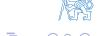

### ARX model (2)

#### ARX predictor

Generic form

$$\hat{y}(t|t-1, u(t)) = H^{-1}(d)G(d)u(t) + \left(I - H^{-1}(d)\right)y(t)$$

- For ARX model  $G(d) = \frac{b(d)}{a(d)}$ ,  $H(d) = \frac{1}{a(d)}$
- Resulting predictor

$$\hat{y}(t|t-1,u(t)) = (1-a(d)) \ y(t) + b(d) \ u(t) = -\sum_{i=1}^{n_d} a_i y(t-i) + \sum_{i=0}^{n_d} b_i u(t-i)$$

- Define
  - parameter vector

$$\theta = [a_1, a_2, \dots, a_{n_a}, b_0, b_1, \dots, b_{n_b}]^T$$

data vector (regressor)

$$z(t) = [-y(t-1), -y(t-2), \dots, -y(t-n_a), u(t), u(t-1), \dots, u(t-n_b)]^T$$

▶ Predicted output value is a linear function of parameters

$$\hat{y}(t|t-1) = z^{T}(t)\theta$$

- ARX parameter estimation linear regression
- $\blacktriangleright \ \, \text{For gaussian noise} \quad e(t) \sim \mathcal{N}\left(0,\sigma_e^2\right) \ \rightarrow \ \, p(y(t)|u(t),\mathcal{D}^{t-1},\theta) = \mathcal{N}\left(z^T\!(t)\theta,\,\sigma_e^2\right)$


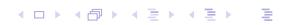

### ARMAX model

### **ARMAX model** (Auto Regressive Moving Average model with eXternal input)

▶ Model of stochastic part – equation error defined by MA process

$$y(t) + a_1 y(t-1) + \cdots + a_{n_a} y(t-n_a) = b_0 u(t) + \cdots + b_{n_b} u(t-n_b) + e(t) + c_1 e(t-1) + \cdots + c_{n_c} e(t-n_c)$$

- ▶ Polynomial description monic polynomial <sup>c</sup>(d) = <sup>1</sup> <sup>+</sup> <sup>c</sup>1<sup>d</sup> <sup>+</sup> · · · <sup>+</sup> <sup>c</sup>nc d nc
- ▶ Difference equation form

$$a(d)y(t) = b(d)u(t) + c(d)e(t)$$

▶ Fractional form

$$y(t) = \frac{b(d)}{a(d)} u(t) + \frac{c(d)}{a(d)} e(t)$$

▶ independent properties of deterministic and stochastic part

#### **ARMAX predictor**

▶ Generic form

$$\hat{y}(t|t-1,u(t)) = H^{-1}(d)G(d)u(t) + \left(I - H^{-1}(d)\right)y(t)$$

- ▶ For ARMAX model <sup>G</sup>(d) = <sup>b</sup>(d) a(d) *,* <sup>H</sup>(d) = <sup>c</sup>(d) a(d)
- ▶ Resulting predictor

$$\hat{y}(t|t-1) = \left(1 - \mathsf{a}(d)\right)\,y(t) + b(d)u(t) + \left(\mathsf{c}(d) - 1\right)\,\left(y(t) - \hat{y}(t|t-1)\right)$$


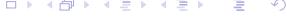

## ARMAX model (2)

#### **ARMAX predictor**

- ▶ Define
  - ▶ prediction error

$$\varepsilon(t|t-1) = y(t) - \hat{y}(t|t-1)$$

▶ parameter vector

$$\theta = [a_1, a_2, \dots, a_{n_a}, b_0, b_1, \dots, b_{n_b}, c_1, c_2, \dots, c_{n_c}]$$

T

▶ regressor

$$z(t) = [-y(t-1), \ldots, -y(t-n_a), u(t), \ldots, u(t-n_b), \varepsilon(t-1|t-2), \ldots, \varepsilon(t-n_c|t-n_c-1)]^{T}$$

data items *ε*(t−1|t−2)*, . . .* depend on parameter values *θ*

▶ Predicted output value is not a linear function of parameters

$$\hat{y}(t|t-1) = z^{T}(t)\theta = z^{T}(t,\theta)\theta$$

- ▶ ARMAX parameter estimation **pseudolinear regression**
  - ▶ approximate method
  - ▶ simple recursive implementation, convergence conditions known
  - ▶ option: use posterior prediction error *<sup>ε</sup>*(t|t) in the regressor

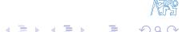

### ARMAX model (3)

#### ARMAX model is equivalent to state-space model in observer canonical form

Output value

$$y(t) = -a_1y(t-1) - \cdots - a_ny(t-n) + b_0u(t) + \cdots + b_nu(t-n) + e(t) + c_1e(t-1) + \cdots + c_ne(t-n)$$

Represent delayed terms by states

$$y(t) = b_0u(t) + e(t) + x_1(t)$$

$$x_1(t+1) = -a_1y(t) - \cdots - a_ny(t-n+1) + b_1u(t) + \cdots + b_nu(t-n+1) + c_1e(t) + \cdots$$

$$= -a_1y(t) + b_1u(t) + c_1e(t) + x_2(t)$$

$$\vdots$$

$$x_n(t+1) = -a_ny(t) + b_nu(t) + c_ne(t)$$

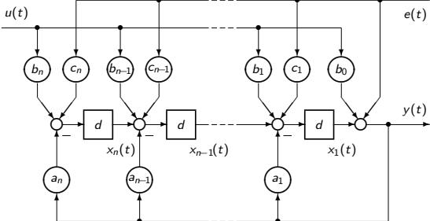


### Output error model

#### **OE (output error) model**

▶ Stochastic component = output measurement error

$$x(t) + a_1 x(t-1) + \dots + a_{n_a} x(t-n_a) = b_0 u(t) + b_1 u(t-1) + \dots + b_{n_b} u(t-n_b)$$
  
$$y(t) = x(t) + e(t)$$

▶ Polynomial description

$$y(t) = \frac{b(d)}{a(d)} u(t) + e(t) \quad \rightarrow \quad a(d)y(t) = b(d)u(t) + a(d)e(t)$$

OE model is equivalent to ARMAX model for c(d) = a(d)

#### **OE predictor**

▶ Generic form (for OE model, H(d) = 1)

$$\hat{y}(t|t-1) = \frac{b(d)}{a(d)} u(t)$$

▶ Resulting predictor

$$\hat{y}(t|t-1) = b(d)u(t) + (1 - a(d))\hat{y}(t|t-1)$$


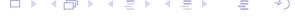

### Output error model (2)

### **OE predictor**

- ▶ Define
  - ▶ Parameter vector

$$\theta = [a_1, a_2, \dots, a_{n_a}, b_0, b_1, \dots, b_{n_b}]^T$$

▶ Regressor

$$z(t) = [-\hat{y}(t-1|t-2), \dots, -\hat{y}(t-n_a|t-n_a-1), u(t), u(t-1), \dots, u(t-n_b)]^T$$

data items yˆ(t−1|t−2)*, . . .* depend on parameter values *θ*

▶ Predicted output value is not a linear function of parameters

$$\hat{y}(t|t-1) = z^{T}(t)\theta = z^{T}(t,\theta)\theta$$

- ▶ OE parameter estimation pseudo linear regression
  - ▶ parallel model without any correction by observed data y(t)
  - ▶ approximate method
  - ▶ option: use posterior predicted value yˆ(t|t) in the regressor

### Positional vs. incremental model

### **Incremental model (ARX example)**

▶ Stochastic component – **random walk** (process with independent increments)

$$v(t) = v(t-1) + e(t) = \sum_{\tau = -\infty}^{t} e(\tau)$$

▶ Equation error model with random walk stochastic component

$$y(t) + a_1y(t-1) + \cdots + a_{n_a}y(t-n_a) = b_0u(t) + b_1u(t-1) + \cdots + b_{n_b}u(t-n_b) + v(t)$$

subtract equation for output y(t−1)

$$\Delta y(t) + a_1 \Delta y(t-1) + \cdots + a_{n_a} \Delta y(t-n_a) = b_0 \Delta u(t) + b_1 \Delta u(t-1) + \cdots + b_{n_b} \Delta u(t-n_b) + e(t)$$

increments 
$$\Delta y(t) = y(t) - y(t-1)$$
,  $\Delta u(t) = u(t) - u(t-1)$ 

▶ Predictor

$$\hat{y}(t|t-1) = y(t-1) + \left(1 - a(d)\right)\Delta y(t) + b(d)\Delta u(t)$$

reference for prediction – past output

- ▶ Properties of incremental models
  - ▶ compensation of piecewise constant disturbance
  - ▶ control action with integral character (piecewise constant reference)

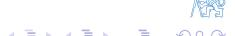

### Least square method

### History

- Solution of overdetermined equation systems

  - ▶ minimize the sum of the squares of the residuals  $e_k = y_k f(x_k, \theta)$ ▶ first application: Gauss used LS to process data about the newly discovered planetoid Ceres in 1795
- Linear regression problem e.g. ARX parameter estimation
- ► Alternative formulations e.g. error in variables
  - also the independent variables are uncertain
  - more complex problem (iterative solution required)

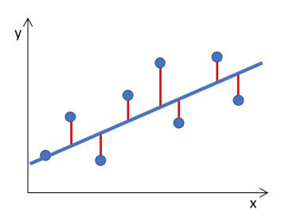


# ARX model estimation (batch data processing)

### **Batch processing**

Set of observed data

$$\mathcal{D}_1^T = \{u(1), y(1), \dots, u(T), y(T)\}\$$

(initial data - not included in this notation)

Model structure

$$y(t) = z^{T}(t)\theta + e(t), \quad e(t) \sim \mathcal{N}(0, \sigma_e^2), \quad \theta \in \mathcal{R}^n$$

► Compact matrix notation

$$Y = Z\theta + E$$

output vector

$$Y = [y(1), y(2), \dots, y(T)]^T$$

regressor (data) matrix

$$Z = \begin{bmatrix} z^T(1) \\ \vdots \\ z^T(T) \end{bmatrix}$$

prediction error vector

$$E = [e(1), e(2), \dots, e(T)]^T$$

# ARX model estimation (batch data processing) (2)

#### **Bayesian estimate**

▶ Likelihood function (transformation E = Y − Z*θ*)

$$I(\theta, \sigma_e | Y) \propto \sigma_e^{-T} \exp \left(-\frac{1}{2\sigma_e^2} (Y - Z\theta)^T (Y - Z\theta)\right)$$

▶ Rearrange quadratic form

$$(Y-Z\theta)^T(Y-Z\theta) = (Y-\hat{Y})^T(Y-\hat{Y}) + (\theta-\hat{\theta})^TZ^TZ(\theta-\hat{\theta})$$

parameter estimate

$$\hat{\theta} = (Z^T Z)^{-1} Z^T Y = P_{\theta} Z^T Y$$

output prediction

$$\hat{Y} = Z\hat{\theta}$$

▶ Residual sum of squares / degrees of freedom

$$s^2 = \frac{1}{\nu} (Y - \hat{Y})^T (Y - \hat{Y}), \qquad \nu = T - n$$

▶ Posterior c.p.d.f. of parameters *<sup>θ</sup>* and *<sup>σ</sup>*<sup>e</sup> (with non-informative priors)

$$p(\theta, \sigma_e | \mathcal{D}^T) \propto \sigma_e^{-(T+1)} \exp\left(-\frac{\nu s^2}{2\sigma_e^2} - \frac{1}{2\sigma_e^2}(\theta - \hat{\theta})^T P_\theta^{-1}(\theta - \hat{\theta})\right)$$


# ARX model estimation (batch data processing) (3)

- ▶ Posterior c.p.d.f. of parameters *<sup>θ</sup>* and *<sup>σ</sup>*<sup>e</sup>
  - ▶ c.p.d.f. of *<sup>θ</sup>* for given *<sup>σ</sup>*<sup>e</sup>

$$p(\theta | \sigma_e, \mathcal{D}^T) = (\sqrt{2\pi}\sigma)^{-n} |P|^{-1/2} \exp\left(-\frac{1}{2\sigma_e^2} (\theta - \hat{\theta})^T P_\theta^{-1} (\theta - \hat{\theta})\right)$$

normal distribution

$$p(\theta | \sigma_e, \mathcal{D}^T) = \mathcal{N}(\hat{\theta}, \sigma_e^2 P_\theta)$$

▶ c.p.d.f. of *<sup>σ</sup>*<sup>e</sup>

$$p(\sigma_{e}|\ \mathcal{D}^{T}) = \frac{2}{\Gamma(\nu/2)} \left(\frac{\nu s^{2}}{2}\right)^{\nu/2} \sigma_{e}^{-(\nu+1)} \exp\left(-\frac{\nu s^{2}}{2\sigma_{e}^{2}}\right)$$

*χ* distribution

$$p(\sigma_e | \mathcal{D}^T) = \chi_{\nu}^2 \left( \frac{\nu s^2}{2\sigma_e^2} \right)$$

noise variance

$$\mathcal{E}\left\{\sigma_e^2|\mathcal{D}^T\right\} = s$$

▶ marginal distribution of *<sup>θ</sup>* (averaged over *<sup>σ</sup>*<sup>e</sup> )

$$p(\theta | \mathcal{D}^T) \propto \left[ 1 + \frac{(\theta - \hat{\theta})^T P_{\theta}^{-1} (\theta - \hat{\theta})}{\nu s^2} \right]^{-(\nu + n)/2} = t_n \left( \hat{\theta}, s^2 P_{\theta}, \nu \right)$$

n–dimensional Student t–distribution with *ν* degrees of freedom

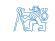

# ARX model estimation (batch data processing) (4)

#### Bias of ARX model parameter estimate

Data matrix Z not correlated with noise vector E

$$\mathcal{E}\left\{\hat{\theta}\middle|\theta\right\} = \mathcal{E}\left\{(Z^TZ)^{-1}Z^T(Z\theta + E)\middle|\theta\right\} = \theta$$

- **unbiased** estimate of  $\theta$
- ▶ valid for Finite Impulse Response (FIR) model

$$y(t) = \sum_{i=1}^{n_b} b_i u(t-i) + e(t)$$

▶ Data matrix Z contains noise vector elements e(.)

$$\mathcal{E}\left\{ \left(Z^{T}Z\right)^{-1}Z^{T}E\right)\right\} \neq 0$$

- true for general ARX model
- output observations y(.) in data matrix

# ARX model estimation - order selection

**Example :** 4th order data generator with ARX structure, *σ* 2 <sup>e</sup> = 0*.*25 × 10−<sup>4</sup>

$$a(d) = (1 - 0.8d)^4 = 1 - 3.2d + 3.84d^2 - 2.05d^3 + 0.41d^4$$
$$b(d) = 10^{-2} \times (3.2d + 4.8d^2 + 4.8d^3 + 3.2d^4)$$

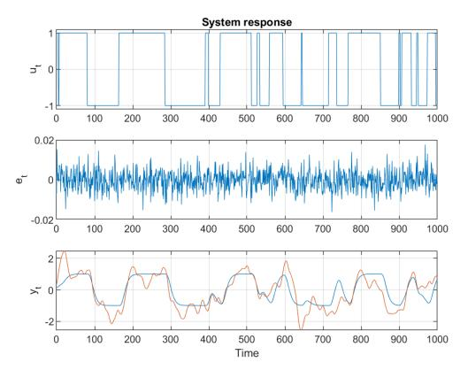

# ARX model estimation - order selection (2)

### **How to evaluate resulting model quality ?**

▶ Residual sum of squares / estimated noise variance

$$\sigma_e^2 \approx s^2 = \frac{1}{T-n} \left( Y - Z\hat{\theta} \right)^T \left( Y - Z\hat{\theta} \right)$$

▶ Akaike information criterion AIC (penalizing model complexity)

$$AIC = T\log(s^2) + 2n$$


# ARX model estimation - order selection (3)

### **How to evaluate resulting model quality (contd.) ?**

▶ Prediction error covariance function (data set size T, lag k *<* K ≪ T)

$$R_{e,e}(k) = \mathcal{E}\left\{e(t)e(t+k)\right\} \approx \frac{1}{T-k}\sum_{t=1}^{T-k}e(t)e(t+k)$$

▶ Parameter significance (vs. zero value hypothesis)

$$P_{\theta} = (Z^T Z)^{-1}, \quad P_{\theta \mid \sigma^2} = \sigma^2 (Z^T Z)^{-1}, \quad \text{cov } \{\theta_i\} \approx s^2 P_{\theta i, i}$$

▶ Compare models of 2nd and 6th order


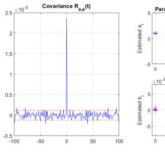

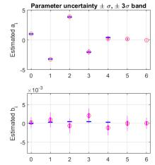


# ARX model estimation - order selection (4)

### **Textbook example results**

▶ Data generator with ARX structure used


# ARX model estimation - order selection (5)

### **More realistic example results**

▶ Data generator with ARMAX structure used, c(d) = 1 + d + d


# ARX model estimation (recursive data processing)

### **Conjugated prior** (follows from batch processing)

▶ Self-reproducing c.p.d.f.

$$\rho\left(\theta, \sigma_{e} | \mathcal{D}^{t}\right) = \rho\left(\theta | \sigma_{e}, \mathcal{D}^{t}\right) \times \rho\left(\sigma_{e} | \mathcal{D}^{t}\right) = \mathcal{N}(\hat{\theta}(t), \sigma_{e}^{2} P(t)) \times \chi_{\nu(t)}^{2}\left(\frac{\nu(t) s^{2}(t)}{2\sigma_{e}^{2}}\right)$$

▶ Data update step → algebraic recursion for statistics *θ*ˆ(t), P(t), s 2 (t), *ν*(t)

$$p\left(\theta, \sigma_{e} | \mathcal{D}^{t}\right) \propto p\left(y(t) | \theta, \sigma_{e}, u(t), \mathcal{D}^{t-1}\right) p\left(\theta, \sigma_{e} | \mathcal{D}^{t-1}\right)$$

▶ Resulting formulas for statistics

$$\hat{\theta}(t) = \hat{\theta}(t-1) + \frac{P(t-1)z(t)}{1+\zeta(t)} \varepsilon(t|t-1)$$

$$P(t) = P(t-1) - \frac{P(t-1)z(t)z^{T}(t)P(t-1)}{1+\zeta(t)}$$

$$\nu(t)s^{2}(t) = \nu(t-1)s^{2}(t-1) + \frac{\varepsilon^{2}(t|t-1)}{1+\zeta(t)}$$

$$\nu(t) = \nu(t-1) + 1$$

▶ Auxiliary variables (prediction error, regressor norm)

$$\varepsilon(t|t-1) = y(t) - z^{\mathsf{T}}(t)\hat{\theta}(t-1), \qquad \zeta(t) = z^{\mathsf{T}}(t)P(t-1)z(t)$$


### Data update step

$$p\left(\theta, \sigma_{e} | \mathcal{D}^{t}\right) \propto p\left(y(t) | \theta, \sigma_{e}, u(t), \mathcal{D}^{t-1}\right) p\left(\theta, \sigma_{e} | \mathcal{D}^{t-1}\right)$$

▶ Model/likelihood function – predictive c.p.d.f. of output y(t)

$$\rho\left(y(t)|\theta,\sigma_e,u(t),\mathcal{D}^{t-1}\right) = \mathcal{N}(z^T(t)\theta,\sigma_e^2) \propto \sigma^{-1} \exp\left(-\frac{1}{2\sigma_e^2}(y(t)-z^T(t)\theta)^2\right)$$

Application of Bayes formula

$$\begin{split} \rho\left(\theta,\sigma_{e}|\mathcal{D}^{t}\right) &\propto & \sigma_{e}^{-(\nu(t)|\mathbf{H})} e^{-\frac{\nu(t)s^{2}(t)}{2\sigma_{e}^{2}}} \times \sigma_{e}^{-n}e^{-\frac{1}{2\sigma_{e}^{2}}}(\theta-\hat{\theta}(t))^{T}P(t)^{-1}(\theta-\hat{\theta}(t)) \\ &\propto & \sigma_{e}^{-1}e^{-\frac{1}{2\sigma_{e}^{2}}}(y(t)-z^{T}(t)\theta)^{T}(y(t)-z^{T}(t)\theta) \\ &\times & \sigma_{e}^{-(\nu(t-1)|\mathbf{H})} e^{-\frac{\nu(t-1)s^{2}(t-1)}{2\sigma_{e}^{2}}} \\ &\times & \sigma_{e}^{-(\nu(t-1)|\mathbf{H})} e^{-\frac{\nu(t-1)s^{2}(t-1)}{2\sigma_{e}^{2}}} \\ &\times & \sigma_{e}^{-n}e^{-\frac{1}{2\sigma_{e}^{2}}}(\theta-\hat{\theta}(t-1))^{T}P(t-1)^{-1}(\theta-\hat{\theta}(t-1)) \end{split}$$

lacktriangle Compare expressions in exponents ightarrow recursions for statistics


# Supplementary reading

ARX model estimation (recursive data processing) (2)

ightharpoonup Compare functions of parameter  $\theta$ 

$$\begin{split} \nu(t) \, s^2(t) + \left(\theta - \hat{\theta}(t)\right)^T & P(t)^{-1} \left(\theta - \hat{\theta}(t)\right) = \\ & = \quad \nu(t-1) \, s^2(t-1) + \left(y(t) - z^T(t)\theta\right)^2 + \left(\theta - \hat{\theta}(t-1)\right)^T & P(t-1)^{-1} \left(\theta - \hat{\theta}(t-1)\right) \end{split}$$

Normalized covariance matrix

$$P(t)^{-1} = P(t-1)^{-1} + z(t)z^{T}(t)$$

Matrix Inversion Lemma (MIL)

$$(A + BCD)^{-1} = A^{-1} - A^{-1}B(C^{-1} + DA^{-1}B)^{-1}DA^{-1}$$

$$P(t) = P(t-1) - \frac{P(t-1)z(t)z^{T}(t)P(t-1)}{1 + z^{T}(t)P(t-1)z(t)}$$

ightharpoonup Mean value of parameter heta

$$\hat{\theta}(t) = \hat{\theta}(t-1) + P(t)z(t)(y(t) - z^{T}(t)\hat{\theta}(t-1)) 
= \hat{\theta}(t-1) + \frac{P(t-1)z(t)}{1 + z^{T}(t)P(t-1)z(t)} (y(t) - z^{T}(t)\hat{\theta}(t-1))$$


# Supplementary reading

ARX model estimation (recursive data processing) (3)

- ▶ Compare functions of noise variance  $\sigma_e$
- Number of degrees of freedom

$$\nu(t) = \nu(t-1) + 1$$

Residual sum of squares

$$\nu(t)s^{2}(t) = \nu(t-1)s^{2}(t-1) + \frac{\varepsilon^{2}(t|t-1)}{1+z^{T}(t)P(t-1)z(t)}$$

Note: compare with output prediction error

$$\mathcal{E}\left\{\left.\varepsilon^{2}(t|t-1)\right|\,\sigma_{e}\right\}=\sigma_{e}^{2}\left(1+z^{T}(t)P(t-1)z(t)\right)$$

- How to initialize the recursions ?
  - $ightharpoonup s^2(0)$  ... prior estimate of noise variance  $\sigma_e^2$
  - ightharpoonup 
    u(0) ... weight of prior variance  $\sigma_e^2$  (auxiliary data sample size)
  - $\hat{\theta}(0)$  ... prior estimate of parameters
  - ightharpoonup P(0) ... prior estimate of parameter covariance matrix (normalized by  $s^2(0)$ )
- Time update step not needed

$$\theta(t) = \theta = \text{constant}$$

# ARX model estimation - recursive algorithm convergence

#### **Batch vs. recusive results**

- ▶ Terminal values of recusive processing equivalent to batch processing
- ▶ Impact of excitation
- ▶ Uncertainty of <sup>a</sup><sup>i</sup> vs. <sup>b</sup><sup>i</sup> parameters


# ARX model – tracking of time-varying parameters

### **Slowly time-varying parameters:** change of notation *θ, σ*<sup>e</sup> → *θ*(t)*, σ*<sup>e</sup> (t)

▶ Data update step

$$\rho\left(\theta(t), \sigma_e(t)|\mathcal{D}^t\right) \propto \rho\left(y(t)|\theta(t), \sigma_e(t), u(t), \mathcal{D}^{t-1}\right) \rho\left(\theta(t), \sigma_e(t)|\mathcal{D}^{t-1}\right)$$

▶ statistics depend on time and available data

$$\hat{\theta}(t|t-1), P(t|t-1), s^2(t|t-1), \nu(t|t-1) \rightarrow \hat{\theta}(t|t), P(t|t), s^2(t|t), \nu(t|t)$$

▶ resulting formulas for statistics

$$\hat{\theta}(t|t) = \hat{\theta}(t|t-1) + \frac{P(t|t-1)z(t)}{1+\zeta(t|t-1)} \varepsilon(t|t-1)$$

$$P(t|t) = P(t|t-1) - \frac{P(t|t-1)z(t)z^{T}(t)P(t|t-1)}{1+\zeta(t|t-1)}$$

$$\nu(t|t)s^{2}(t|t) = \nu(t|t-1)s^{2}(t|t-1) + \frac{\varepsilon^{2}(t|t-1)}{1+\zeta(t|t-1)}$$

$$\nu(t|t) = \nu(t|t-1) + 1$$

▶ auxiliary variables (prediction error, regressor norm)

$$\varepsilon(t|t-1) = y(t) - z^{T}(t)\hat{\theta}(t|t-1), \qquad \zeta(t|t-1) = z^{T}(t)P(t|t-1)z(t)$$


# ARX model – tracking of time-varying parameters (2)

▶ Time update step (naive model)

$$\theta(t+1) \sim \theta(t)$$

▶ resulting update statistics for *<sup>θ</sup>*

$$\hat{ heta}(t+1|t) = \hat{ heta}(t|t), \quad P(t+1|t) = P(t|t)$$

▶ parameter tracking ability – Kalman gain

$$K(t) = \frac{P(t|t-1)z(t)}{1+\zeta(t|t-1)}$$

proportional to (normalized) parameter covariance matrix P(t|t−1)

▶ sufficient excitation condition – information matrix increasing in time

$$P(t|t-1)^{-1} = \sum_{\tau=1}^{t-1} z(\tau)z^{\tau}(\tau) > \alpha t I$$

covariance matrix is upper-limited

$$P(t|t-1) < \frac{1}{\alpha t}I$$

▶ Impact of new data (Kalman gain) is diminishing – naive model does not work

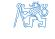

# ARX model – tracking of time-varying parameters (3)

▶ Time update – conceptual solution

$$p\left( heta(t+1)|\mathcal{D}^t
ight) = \int p\left( heta(t+1)| heta(t),\mathcal{D}^t
ight) \; p\left( heta(t)|\mathcal{D}^t
ight) \; d heta(t)$$

parameter development model given by c.p.d.f.

$$p\left(\theta(t\!+\!1)|\theta(t),\mathcal{D}^t
ight)$$

▶ Impact of convolution integral – increase of parameter uncertainty

#### **Linear forgetting**

▶ Model of parameter drift

$$\theta(t+1) = \theta(t) + \nu(t), \qquad \nu(t) \sim \mathcal{N}\left(0; \sigma_e^2 V(t)\right)$$

time update of parameter covariance matrix

$$P(t+1|t) = P(t|t) + V(t)$$

- ▶ Prior information about drift directions can be incorporated in V (t)
- ▶ Time-varying noise variance not covered


# ARX model – tracking of time-varying parameters (4)

### **Exponential forgetting**

▶ Direct increase of parameter uncertainty for both *<sup>θ</sup>* and *<sup>σ</sup>*<sup>e</sup>

$$p\left( heta(t+1)|\mathcal{D}^t
ight) \propto p^arphi\left( heta(t)|\mathcal{D}^t
ight), \qquad arphi \in (0,\,1] \;\; ext{forgetting factor}$$

▶ Resulting statistics

$$P(t+1|t) = \frac{1}{\varphi}P(t|t)$$
$$\hat{\theta}(t+1|t) = \hat{\theta}(t|t)$$
$$\nu(t+1|t) + n + 1 = \varphi \ (\nu(t|t) + n + 1)$$
$$\nu(t+1|t)s^{2}(t+1|t) = \varphi \ \nu(t|t)s^{2}(t|t)$$

- ▶ Properties
  - ▶ increase of *<sup>θ</sup>* uncertainty multiplication of covariance by 1*/φ* <sup>≥</sup> <sup>1</sup>
  - ▶ efficient sample size used to estimate *<sup>σ</sup>* e (t) reduced – steady-state value

$$t_{
m ef}=arphi(t_{
m ef}\!+\!1)$$

"data window" length – how to choose *φ* ?

$$t_{
m ef} = rac{1}{1-arphi}$$


#### **Exponential forgetting formulas**

▶ Time-update step – conceptual solution

$$p\left( heta(t+1), \sigma_{ ext{e}}(t+1)|\mathcal{D}^{t}
ight) \propto \left.
ho^{arphi}\left( heta(t), \sigma_{ ext{e}}(t)|\mathcal{D}^{t}
ight)
ight|_{ heta(t) = heta(t+1), \ \sigma_{ ext{e}}(t) = \sigma_{ ext{e}}(t+1)}$$

▶ After substitution

$$\sigma_e^{-(\nu(t+1|t)+1)}(t+1) e^{-\frac{\nu(t+1|t)s^2(t+1|t)}{2\sigma_e^2(t+1)}} \times \\ \sigma_e^{-n}(t+1)e^{-\frac{1}{2\sigma_e^2(t+1)}}(\theta(t+1)-\hat{\theta}(t+1|t))^T P(t+1|t)^{-1}(\theta(t+1)-\hat{\theta}(t+1|t)) \\ \propto \sigma_e^{-(\nu(t|t)+1)\varphi}(t+1) e^{-\frac{\nu(t|t)s^2(t|t)\varphi}{2\sigma_e^2(t+1)}} \times \\ \sigma_e^{-n\varphi}(t+1)e^{-\frac{1}{2\sigma_e^2(t+1)}}(\theta(t+1)-\hat{\theta}(t|t))^T P(t|t)^{-1}\varphi(\theta(t+1)-\hat{\theta}(t|t))$$

▶ Time-update for individual statistics – by comparison, e.g.

$$\theta^{T}(t+1) P(t+1|t)^{-1} \theta(t+1) = \theta^{T}(t+1) P(t|t)^{-1} \varphi \theta(t+1)$$

# ARX model with forgetting - combined time-update and data-update step

#### If only a single time index is used, be cautious

Combined recursion for predicted values

$$\hat{\theta}(t+1|t) = \hat{\theta}(t|t-1) + \frac{P(t|t-1)z(t)}{1+\zeta(t|t-1)} \varepsilon(t|t-1)) 
P(t+1|t) = \frac{1}{\varphi} \left( P(t|t-1) - \frac{P(t|t-1)z(t)z^{T}(t)P(t|t-1)}{1+\zeta(t|t-1)} \right)$$

Combined recursion for filtered values

$$\hat{\theta}(t|t) = \hat{\theta}(t-1|t-1) + \frac{P(t-1|t-1)z(t)}{\varphi + z^{T}(t)P(t-1|t-1)z(t)} \varepsilon(t|t-1)) 
P(t|t) = \frac{1}{\varphi} \left( P(t-1|t-1) - \frac{P(t-1|t-1)z(t)z^{T}(t)P(t-1|t-1)}{\varphi + z^{T}(t)P(t-1|t-1)z(t)} \right)$$

Definitions used

$$\zeta(t|t-1) = z^{T}(t)P(t|t-1)z(t) 
\zeta(t|t) = z^{T}(t)P(t|t)z(t) 
\varepsilon(t|t-1) = y(t) - z^{T}(t)\hat{\theta}(t|t-1) 
\varepsilon(t|t) = y(t) - z^{T}(t)\hat{\theta}(t|t)$$


### Problems with parameter tracking

#### Poor system excitation

- ▶ Linear interdependence of data items e.g. closed-loop identification
- ▶ No information about the parameter value in some directions
  - ▶ information subject to forgetting not replaced by new one
  - ▶ covariance wind–up unlimited growth of some eigenvalues of covariance matrix

#### Possible solutions

- ▶ Excitation by external signals optimal experiment design
- ▶ Exponential forgetting with varying forgetting factor
  - ▶ fixed trace of covariance matrix ⇒ limited eigenvalues of P(t +1|t)
  - ▶ constant "information content" concept (Fortesque, 1981)

$$\varphi(t) = 1 - \alpha \frac{\varepsilon^2(t|t-1)}{1 + \zeta(t|t-1)}$$

- ▶ Restricted forgetting concept (Kulhavý, 1987)
  - ▶ forget only information that has been modified during data update step

## Restricted forgetting

#### **Data update**

▶ Parameter uncertainty

$$\tilde{\theta}(t|t-1) = \theta(t) - \hat{\theta}(t|t-1)$$

▶ Uncertainty of scalar product x <sup>T</sup> *θ*

$$\operatorname{cov}\left\{\boldsymbol{x}^{T}\boldsymbol{\theta}\right\} = \mathcal{E}\left\{\boldsymbol{x}^{T}\tilde{\boldsymbol{\theta}}\tilde{\boldsymbol{\theta}}^{T}\boldsymbol{x}\right\} = \boldsymbol{x}^{T}\boldsymbol{P}\boldsymbol{x}$$

▶ Covariance matrix update

$$P(t|t) = P(t|t-1) - \frac{P(t|t-1)z(t)z^{T}(t)P(t|t-1)}{1 + \zeta(t|t-1)}$$

▶ Uncertainty in regressor data direction z(t)

$$\operatorname{cov}\left\{\left.z^{T}\!(t)\theta(t)\right|\,\mathcal{D}^{t}\right\}=z^{T}\!(t)P(t|t)z(t)=\frac{z^{T}\!(t)P(t|t-1)z(t)}{1+\zeta(t|t-1)}$$

uncertainty reduced by factor 1*/*(1 + *ζ*(t|t−1))

▶ Uncertainty in orthogonal directions <sup>x</sup>(t) <sup>⊥</sup><sup>P</sup> <sup>z</sup>(t)

$$\operatorname{cov}\left\{\left.x^{T}(t)\theta(t)\right|\,\mathcal{D}^{t}\right\} = x^{T}(t)P(t|t)x(t) = x^{T}(t)P(t|t-1)x(t)$$

no uncertainty reduction

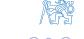


### Restricted forgetting (2)

#### Time update

- Use selective uncertainty increase
- Regressor data direction z(t) follow the drift model

$$z^{T}(t)P(t+1|t)z(t) = z^{T}(t)P(t|t)z(t) + z^{T}(t)V(t)z(t) = \zeta(t|t) + \zeta_{\nu}(t)$$

where

$$\zeta_{\nu}(t) = z^{T}(t)V(t)z(t)$$

▶ Orthogonal directions  $x(t) \perp_P z(t)$  – no uncertainty increase

$$x^{T}(t)P(t+1|t)x(t) = x^{T}(t)P(t|t)x(t)$$

► Can be achieved by "restricted" drift covariance matrix

$$V(t|t) = \frac{\zeta_{\nu}(t)}{\zeta^{2}(t|t)} P(t|t) z(t) z^{T}(t) P(t|t)$$

Validate by direct calculation ...

$$z^{\mathsf{T}}(t)V(t|t)z(t) = \frac{\zeta_{\nu}(t)}{\zeta^{2}(t|t)}z^{\mathsf{T}}(t)P(t|t)z(t)z^{\mathsf{T}}(t)P(t|t)z(t) = \zeta_{\nu}(t)$$

$$x^{T}(t)V(t|t)x(t) = \frac{\zeta_{\nu}(t)}{\zeta^{2}(t|t)}x^{T}(t)P(t|t)z(t)z^{T}(t)P(t|t)x(t) = 0$$


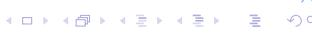

# Restricted forgetting (3)

### **Restricted linear forgetting**

▶ Relation for Kalman gain

$$P(t|t)z(t) = \frac{P(t|t-1)z(t)}{1+\zeta(t|t-1)} = K(t)$$

▶ Restricted drift covariance matrix

$$V(t|t) = P(t|t)z(t) \frac{\zeta_{\nu}(t)}{\zeta^{2}(t|t)} z^{T}(t)P(t|t) = K(t)\frac{\zeta_{\nu}(t)}{\zeta^{2}(t|t)}K^{T}(t)$$

### **Restricted exponential forgetting**

▶ Equivalent parameter drift model

$$V(t) = rac{1-arphi}{arphi} P(t|t) \quad o \quad \zeta_
u(t) = rac{1-arphi}{arphi} \zeta(t|t)$$

▶ Restricted drift covariance matrix

$$V(t|t) = K(t) \frac{\frac{1-\varphi}{\varphi}\zeta(t|t)}{\zeta^2(t|t)} K^{T}(t) = K(t) \frac{1-\varphi}{\varphi\zeta(t|t)} K^{T}(t)$$


### Restricted forgetting (4)

▶ Combined time-update + data-update step

$$P(t+1|t) = P(t|t-1) - \frac{P(t|t-1)z(t)z^{T}(t)P(t|t-1)}{\alpha(t)^{-1} + \zeta(t|t-1)}$$

where

$$\alpha(t) = \frac{\varphi(1+\zeta(t|t-1))-1}{\zeta(t|t-1)}$$

▶ MIL → weight of z(t)z <sup>T</sup>(t) dyad in information matrix update

$$P(t+1|t)^{-1} = P(t|t-1)^{-1} + \alpha(t)z(t)z^{T}(t)$$

- ▶ for *φ <* <sup>1</sup>*/*(1 <sup>+</sup> *<sup>ζ</sup>*) uncertainty increase (*α <* 0)
- ▶ for *φ >* <sup>1</sup>*/*(1 <sup>+</sup> *<sup>ζ</sup>*) uncertainty reduction (*α >* 0)
- ▶ Restricted forgetting limited to a single direction both LF/EF interpretations
  - ▶ equivalent forgetting factor

$$arphi(t|t) = rac{\zeta(t|t)}{\zeta(t|t) + \zeta_{
u}(t)}$$

▶ derive from LF model, use also for EF on *<sup>σ</sup>*<sup>e</sup> statistics

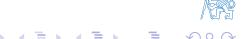

### Numerical implementation of bayesian estimation algorithms

#### Conditioning for gaussian variables

Joint probability density function

$$\rho\left(\left[\begin{array}{c}\mathbf{y}\\\mathbf{x}\end{array}\right]\right) = \mathcal{N}\left(\left[\begin{array}{c}\mu_{y}\\\mu_{x}\end{array}\right]; \left[\begin{array}{c}P_{yy} & P_{yx}\\P_{xy} & P_{xx}\end{array}\right]\right)$$

▶ LD-factorization of joint covariance matrix

$$\begin{bmatrix} P_{yy} & P_{yx} \\ P_{xy} & P_{xx} \end{bmatrix} = \begin{bmatrix} L_y & 0 \\ K & L_{x|y} \end{bmatrix} \begin{bmatrix} D_y & 0 \\ 0 & D_{x|y} \end{bmatrix} \begin{bmatrix} L_y^T & K^T \\ 0 & L_{x|y}^T \end{bmatrix} = \begin{bmatrix} d_y \\ d_{x|y} \end{bmatrix}; \begin{bmatrix} L_y^T & K^T \\ 0 & L_{x|y}^T \end{bmatrix}$$

 $L_y$ ,  $L_{x|y}$  monic lower triangual

$$D_y = \operatorname{diag} d_y$$
,  $D_{x|y} = \operatorname{diag} d_{x|y}$  non-negative

▶ Substitute into formulas for conditional mean and covariance matrix

$$\mu_{x|y} = \mu_x + P_{xy}P_{yy}^{-1}(y - \mu_y)$$
,  $P_{x|y} = P_{xx} - P_{xy}P_{yy}^{-1}P_{yx}$ 

all the terms can be defined in terms of LD factors

$$P_{yy} = L_y D_y L_y^T$$

$$P_{xy} = K D_y L_y^T$$

$$P_{xx} = K D_y K^T + L_{x|y} D_{x|y} L_{x|y}^T$$


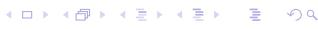

# Numerical implementation of bayesian estimation algorithms (2)

#### Conditioning for gaussian variables – results

▶ LD-factors of the joint covariance matrix

$$\left| \left[ \begin{array}{c} d_y \\ d_{x|y} \end{array} \right]; \left[ \begin{array}{cc} L_y^T & K^T \\ 0 & L_{x|y}^T \end{array} \right] \right|$$

 $\triangleright$  Factors of the marginal covariance matrix  $P_y$ 

$$P_{y} = L_{y}D_{y}L_{y}^{T} = \left| d_{y}; L_{y}^{T} \right|$$

**F**actors of the conditional covariance matrix  $P_{x|y}$ 

$$P_{x|y} = L_{x|y} D_{x|y} L_{x|y}^T = |d_{x|y}; L_{x|y}^T|$$

Conditioned mean

$$\mu_{x|y} = \mu_x + KL_y^{-1}\varepsilon$$
, where  $\varepsilon = y - \mu_y$ .

In scalar case, LD–factorization directly provides Kalman gain

$$L_y = 1 \rightarrow KL_y^{-1} = K$$

Avoid LD-factorization, implement direct update of the LD-factors


# Numerical implementation of bayesian estimation algorithms (3)

#### Linear regression with LD-factorized covariance matrix

▶ Algorithm input: LD-factors (monic lower triangular/non-negative diagonal)

$$P(t|t-1) = L(t|t-1)D(t|t-1)L^{T}(t|t-1) = \left| d(t|t-1); L^{T}(t|t-1) \right|$$

▶ Joint covariance matrix of output  $y(t) = z^{T}(t)\theta(t)$  and parameters  $\theta(t)$ 

$$\left| \begin{bmatrix} 1 \\ d(t|t-1) \end{bmatrix}; \begin{bmatrix} 1 & 0 \cdots 0 \\ L^{T}(t|t-1)z(t) & L^{T}(t|t-1) \end{bmatrix} \right| \quad \text{(verify!)}$$

► Transform the factors to get triangular L-matrix (e.g. dyadic reduction algorithm)

$$\begin{bmatrix} 1 & 0 & 0 & \cdots & 0 & 0 \\ x & 1 & x & \cdots & x & x \\ x & 0 & 1 & \cdots & x & x \\ \vdots & & & \ddots & & \\ x & & & & 1 & x \\ x & & & & & 1 \end{bmatrix} \longrightarrow \begin{bmatrix} 1 & x & x & \cdots & x & x \\ 0 & 1 & x & \cdots & x & x \\ 0 & & 1 & \cdots & x & x \\ \vdots & & & \ddots & & \\ \vdots & & & \ddots & & \\ 0 & & & & & 1 & x \\ \vdots & & & & \ddots & \\ 0 & & & & & & 1 \end{bmatrix}$$

Algorithm output: LD-factors of joint distribution

$$\left| \begin{bmatrix} d_{y}(t) \\ d(t|t) \end{bmatrix}; \begin{bmatrix} 1 & k^{T}(t) \\ 0 & L^{T}(t|t) \end{bmatrix} \right|$$

- k(t) Kalman gain
- $d_{y}(t) = 1 + \zeta(t|t-1)$  normalized output variance
- d(t|t), L(t|t) LD-factors of posterior parameter covariance matrix

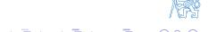


# Numerical implementation of bayesian estimation algorithms (4)

#### **Data update step**

- ▶ Parameter covariance factors
- P(t|t) = L(t|t)D(t|t)L T (t|t) = <sup>d</sup>(t|t); <sup>L</sup> T (t|t)

▶ Parameter mean value

*θ*ˆ(t|t) = *θ*ˆ(t|t−1) + k(t)*ε*(t|t−1)

▶ Number of degrees of freedom

*ν*(t|t) = *ν*(t|t−1) + 1

▶ Sum of residual squares

$$\nu(t|t)s^{2}(t|t) = \nu(t|t-1)s^{2}(t|t-1) + \frac{\varepsilon^{2}(t|t-1)}{d_{y}(t)}$$

### **Time update step – exponential forgetting**

▶ Covariance matrix

$$P(t+1|t) = \frac{1}{\varphi}P(t|t) \qquad \rightarrow \qquad d(t+1|t) = \frac{1}{\varphi}d(t|t)$$

▶ Other statistics

$$\hat{\theta}(t+1|t) = \hat{\theta}(t|t)$$

$$\nu(t+1|t) + n + 1 = \varphi(\nu(t|t) + n + 1)$$

$$\nu(t+1|t)s^{2}(t+1|t) = \varphi(\nu(t|t)s^{2}(t|t)$$


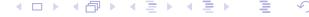

# Numerical implementation of bayesian estimation algorithms (5)

#### Time update - linear forgetting

Covariance matrix (parameter drift in factorized form)

$$P(t+1|t) = P(t|t) + V(t)$$
,  $V(t) = \left| d_v(t); L_v^T(t) \right|$ 

update triangularity to get  $\mathit{L}(t+1|t)$  – significant computational burden

$$\left| d(t+1|t); L^{T}(t+1|t) \right| = \left| \begin{bmatrix} d(t|t) \\ d_{v}(t) \end{bmatrix}; \begin{bmatrix} L^{T}(t|t) \\ L^{T}_{v}(t) \end{bmatrix} \right|$$

### Time update – restricted forgetting

Covariance matrix (restricted exponential forgetting)

$$igg| d(t+1|t); L^T(t+1|t) igg| = \left[ egin{array}{c} d(t|t) \ \dfrac{(1-arphi)d_y}{arphi(d_y-1)} \end{array} 
ight]; \left[ egin{array}{c} L^T(t|t) \ k^T(t) \end{array} 
ight]$$

Covariance update (restricted linear forgetting)

$$\left| d(t+1|t); L^T(t+1|t) \right| = \left| \left[ \begin{array}{c} d(t|t) \\ \frac{\zeta_{\nu}(t)d_y^2}{(d_{\nu}-1)^2} \end{array} \right] : \left[ \begin{array}{c} L^T(t|t) \\ k^T(t) \end{array} \right] \right|$$

Rank-1 update – more numerically efficient


# Numerical implementation of bayesian estimation algorithms (6)

### **Dyadic reduction algorithm**

- ▶ Input: factorized covariance matrix R = MDM<sup>T</sup>
  - M extended monic lower triangular → recover triangularity
- ▶ Hint: operate on sum of two dyads (m<sup>i</sup> monic)

m

$$Q_{i,j} = m_i d_i m_i^T + m_j d_j m_j^T$$

$$_i^T = [0, \dots, 0, \frac{1}{1}, m_{i,i+1}, \dots, m_{i,n}], \qquad m_j^T = [0, \dots, 0, \frac{m_{j,i}}{1}, m_{j,i+1}, \dots, m_{j,n}]$$

**Algorithm:** The dyads can be modified to

$$Q_{i,j} = \tilde{m}_i \tilde{d}_i \tilde{m}_i^\mathsf{T} + \tilde{m}_j \tilde{d}_j \tilde{m}_j^\mathsf{T}, \quad \tilde{m}_{j,i} = 0,$$

$$\tilde{m}_{i}^{T} = [0, \dots, 0, \frac{1}{1}, \tilde{m}_{i,i+1}, \dots, \tilde{m}_{i,n}], \quad \tilde{m}_{j}^{T} = [0, \dots, 0, \frac{0}{1}, \tilde{m}_{j,i+1}, \dots, \tilde{m}_{j,n}],$$

where

$$\begin{array}{lcl} \tilde{d}_{i} & = & d_{i} + m_{j,i}^{2} d_{j} \\ \\ \tilde{d}_{j} & = & d_{j} / \tilde{d}_{i} \ d_{i} \\ \\ \mu & = & d_{j} / \tilde{d}_{i} \ m_{j,i} \\ \\ \tilde{m}_{j} & = & m_{j} - m_{j,i} m_{i} \\ \\ \tilde{m}_{i} & = & m_{i} + \mu \tilde{m}_{j} \end{array}$$


# Numerical implementation of bayesian estimation algorithms (7)

### MATLAB function LDFIL

```
function [stheta_out, ssigma_out, k, eps, dy] ...
         = ldfil(stheta, ssigma, data, phi)
% =========================================================
% LDFIL - ARX identification with LD factorized covariance
% =========================================================
% stheta = [theta,d,L^T]
% ssigma = [nu,nus2]
% data = [z^T,y]
% phi = forgetting coefficient
% =========================================================
% unpack input ============================================
n = length(data) - 1;
z = data(1:n)';
y = data(n+1);
theta = stheta(:,1);
dth = stheta(:,2);
ltht = stheta(:,3:n+2);
% check forgetting factor =================================
if nargin < 4,
  phi = 1;
else
  phi = min(phi,1);
  phi = max(phi,.01);
end
% update covariance =======================================
m = [1, zeros(1,n); ltht*z, ltht ];
d = [1; dth ];
```

```
% run dydr for i=1 ========================
for j = n+1:-1:2,
  mji = m(j,1);
  di = d(1)+mji*mji*d(j);
  mu = mji*d(j)/di;
  d(j) = d(j)*d(1)/di;
  d(1) = di;
  m(j,:) = m(j,:)-mji*m(1,:);
  m(1,:) = m(1,:)+mu*m(j,:);
end
% decompose ===============================
dy = d(1);
dth = d(2:n+1)/phi;
ltht = m(2:n+1,2:n+1);
k = m(1,2:n+1)';
% update theta ============================
eps = y - z'*theta;
theta = theta + k*eps;
stheta_out = [theta,dth,ltht];
% update sigma ============================
if ~isempty(ssigma)
  nu = ssigma(1);
  nus2 = ssigma(2);
  nu = phi*(nu+1);
  nus2 = phi*(nus2+eps*eps/dy);
  ssigma_out = [nu,nus2];
else
  ssigma_out = [];
end
```

Try to modify to other forgetting methods (restricted linear/exponential)


### Convergence of the Least-Square method

### Convergence vs. experiment design

Data generator

$$y(t) = z^{T}(t)\theta^{*}$$

(otherwise parameter "true" value not well defined)

▶ Parameter error converges to zero

$$\tilde{\theta}(t) = \theta^* - \hat{\theta}(t) \longrightarrow 0$$

under sufficient excitation condition

$$\sum_{\tau=1}^t z(\tau) z^{T}(\tau) > \alpha I t$$

- **Experiment design:** quality of data test eigenvalues of  $\sum_{\tau=1}^{t} z(\tau)z^{T}(\tau)$
- ► Tracking of time-varying parameters persistent excitation condition

$$\alpha_1 I > \sum_{\tau=t}^{t+T_p} z(\tau) z^{T}(\tau) > \alpha_2 I$$

(sufficient excitation in all time intervals)

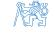

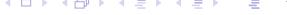

### Stability of parameter error (Lyapunov method)

- ▶ Parameter error state of corresponding dynamic system
- Data update step

$$\tilde{\theta}(t) = \tilde{\theta}(t-1) - \frac{P(t-1)z(t)z^T(t)}{1+\zeta(t)}\tilde{\theta}(t-1) = \left(I - \frac{P(t-1)z(t)z^T(t)}{1+\zeta(t)}\right)\tilde{\theta}(t-1)$$

transition matrix

$$I - \frac{P(t-1)z(t)z^{T}(t)}{1+\zeta(t)} = \left(P(t-1) - \frac{P(t-1)z(t)z^{T}(t)P(t-1)}{1+\zeta(t)}\right)P^{-1}(t-1)$$

parameter error dynamics

$$\tilde{\theta}(t) = P(t)P^{-1}(t-1)\tilde{\theta}(t-1)$$

▶ Lyapunov function – use positive definite precision matrix  $P^{-1}(t)$ 

$$V(t) = \tilde{\theta}^{T}(t)P^{-1}(t)\tilde{\theta}(t)$$

Lyapunov function non-increasing  $\rightarrow$  parameter error is Lyapunov–stable

# Supplementary reading

Convergence of the Least-Square method (2)

► Increment of the Lyapunov function

$$\Delta V(t) = \tilde{\theta}^{T}(t)P^{-1}(t)\tilde{\theta}(t) - \tilde{\theta}^{T}(t-1)P^{-1}(t-1)\tilde{\theta}(t-1) 
= \tilde{\theta}^{T}(t)P^{-1}(t)\left(P(t)P^{-1}(t-1)\tilde{\theta}(t-1)\right) - \tilde{\theta}^{T}(t-1)P^{-1}(t-1)\tilde{\theta}(t-1) 
= \tilde{\theta}^{T}(t)P^{-1}(t-1)\tilde{\theta}(t-1) - \tilde{\theta}^{T}(t-1)P^{-1}(t-1)\tilde{\theta}(t-1) 
= \left(\tilde{\theta}(t) - \tilde{\theta}(t-1)\right)^{T}P^{-1}(t-1)\tilde{\theta}(t-1)$$

using estimation error dynamics

$$\tilde{\theta}(t) - \tilde{\theta}(t-1) = \left(P(t)P^{-1}(t-1) - I\right)\tilde{\theta}(t-1)$$

resulting formula

$$\Delta V(t) = \tilde{\theta}^{T}(t-1) \left( P^{-1}(t-1)P(t) - I \right) P^{-1}(t-1)\tilde{\theta}(t-1) 
= \tilde{\theta}^{T}(t-1) \left( P^{-1}(t-1) \left( P(t-1) - \frac{P(t-1)z(t)z^{T}(t)P(t-1)}{1+\zeta(t)} \right) - I \right) P^{-1}(t-1)\tilde{\theta}(t-1) 
= -\tilde{\theta}^{T}(t-1) \frac{z(t)z^{T}(t)}{1+\zeta(t)} \tilde{\theta}(t-1)$$

Conclusion: Lyapunov function is non-increasing

$$\Delta V(t) \leq 0$$


▶ Lyapunov function is non-increasing (bounded) and also

$$V(t) = \left\| \left\| \widetilde{\theta}(t) \right\|_{P^{-1}(t)}^{2} \ge \lambda_{\min} \left( P^{-1}(t) \right) \left\| \left\| \widetilde{\theta}(t) \right\|^{2}$$

▶ Minimum eigenvalue of precision matrix

$$P^{-1}(t) = P^{-1}(t-1) + z(t)z^T(t) \quad \longrightarrow \quad \lambda_{\min}\left(P^{-1}(t)\right) \geq \lambda_{\min}\left(P^{-1}(t-1)\right)$$

▶ If the minimum eigenvalue is increasing (sufficient excitation condition)

$$\lim_{t o \infty} \lambda_{\mathsf{min}} \left( P^{-1}(t) 
ight) = \lim_{t o \infty} \lambda_{\mathsf{min}} \left( \sum_{ au=1}^t \mathsf{z}( au) \mathsf{z}^\mathsf{T}( au) 
ight) = \infty$$

then for bounded Lyapunov function

$$\lambda_{\min}\left(P^{-1}(t)\right) \left\| \tilde{\theta}(t) \right\|^2 \leq V(t) < \infty \quad \longrightarrow \quad \lim_{t \to \infty} \tilde{\theta}(t) = 0$$

# Incorporation of prior information

### **What information can be provided during algorithm initialization ?**

▶ C.p.d.f. of parameters *<sup>θ</sup>* and *<sup>σ</sup>*<sup>e</sup>

$$p(\theta | \sigma_e, \mathcal{D}^t) = \mathcal{N}(\widehat{\theta}, \sigma_e^2 P), \quad p(\sigma_e | \mathcal{D}^t) = \chi_{\nu}^2 \left( \frac{\nu s^2}{2\sigma_e^2} \right)$$

▶ Noise variance estimate

$$\mathcal{E}\left\{\sigma_e^2|\mathcal{D}^t\right\} = s^2$$

#### **Confidence intervals for** *θ*

▶ Assume

$$\theta_i^L \leq \theta_i \leq \theta_i^H$$

translates to prior mean value

$$\hat{\theta}_i(1|0) = \frac{\theta_i^H + \theta_i^L}{2}$$

and prior covariance matrix diagonal elements (interval ± *α σθ*, *α* = 2 *. . .* 3)

$$s^{2}(1|0)P_{ii}(1|0) = \left(\frac{\theta_{i}^{H} - \theta_{i}^{L}}{2\alpha}\right)^{2}$$


#### Incorporation of prior information (2)

### **Parameter drift covariance "shaping"**

▶ Parameter drift – linear forgetting

$$P(t+1|t) = P(t|t) + V(t)$$

▶ Define "significant" direction l l <sup>T</sup> Vl = *σ*<sup>1</sup> l T l other directions x ⊥ l x <sup>T</sup> Vx = *σ*<sup>0</sup> x T x

▶ This property will be satisfied by drift covariance matrix

$$V = \sigma_1 \frac{II^T}{I^T I} + \sigma_0 \left( I - \frac{II^T}{I^T I} \right)$$

(prove by substitution)

▶ Applications: fixed steady-state gain, time-varying transport delay etc.

### Smooth impulse response

Model

$$y(t) = \sum_{i=0}^{N} g_i u(t-i) + e(t)$$

▶ Translate "smoothness" to prior information on  $\tilde{g}_i = g_i - \hat{g}_i(1|0)$ 

$$\Delta^2 \tilde{g}_i = \tilde{g}_{i+2} - 2\tilde{g}_{i+1} + \tilde{g}_i \quad \to \quad 0$$

using matrix notation

$$\Delta^2 \tilde{\mathbf{g}} = \begin{bmatrix} 1 \\ -2 & 1 \\ 1 & -2 & 1 \\ & \ddots & \ddots & \ddots \\ & & 1 & -2 & 1 \end{bmatrix} \begin{bmatrix} \tilde{\mathbf{g}}_0 \\ \tilde{\mathbf{g}}_1 \\ \vdots \\ \tilde{\mathbf{g}}_N \end{bmatrix} = D \begin{bmatrix} \tilde{\mathbf{g}}_0 \\ \tilde{\mathbf{g}}_1 \\ \vdots \\ \tilde{\mathbf{g}}_N \end{bmatrix}$$

► Initialize covariance matrix *P*(1|0)

$$\operatorname{\mathsf{cov}}\left\{\Delta^2 \tilde{\mathbf{g}} \mid \mathbf{0} \right\} = \mathit{DPD}^T pprox \sigma_{\mathbf{g}}^2 \mathbf{I}, \qquad \sigma_{\mathbf{g}} o \mathbf{0}$$

therefore

$$P(1|0) = \sigma_{\sigma}^2 D^{-1} D^{-T}$$

▶ Further improvement: "decreasing curvature" for  $\Delta^2 \tilde{g}_i \approx \sigma_{g_i}^2$ 


# <span id="page-104-0"></span>**5. Kalman filter**


### Linear stochastic system

#### State-space model

$$x(t+1) = Ax(t) + Bu(t) + v(t)$$

$$y(t) = Cx(t) + Du(t) + e(t)$$

$$\mathcal{E}\left\{ \begin{bmatrix} v(t) \\ e(t) \end{bmatrix} \right\} = 0, \quad \mathcal{E}\left\{ \begin{bmatrix} v(t_1) \\ e(t_1) \end{bmatrix}, \begin{bmatrix} v(t_2) \\ e(t_2) \end{bmatrix}^T \right\} = \begin{bmatrix} Q & S \\ S^T & R \end{bmatrix} \delta(t_1 - t_2)$$

 $\delta(t_1-t_2)$  Kronecker symbol (vs. Dirac pulse in continuous time)

### Time evolution of state and output

Mean values

$$\hat{x}(t+1) = A\hat{x}(t) + Bu(t) 
\hat{y}(t) = C\hat{x}(t) + Du(t)$$

Covariance matrices

$$\operatorname{cov}\left\{\begin{bmatrix}x(t+1)\\y(t)\end{bmatrix}\right\} = \begin{bmatrix}AP_{x}(t)A^{T} + Q & AP_{x}(t)C^{T} + S\\CP_{x}(t)A^{T} + S^{T} & CP_{x}(t)C^{T} + R\end{bmatrix}$$

Hint: use dynamics of error 
$$\tilde{x}(t)=x(t)-\hat{x}(t),\ \tilde{y}(t)=y(t)-\hat{y}(t)$$
 
$$\tilde{x}(t+1) = A\tilde{x}(t)+v(t)$$
 
$$\tilde{y}(t) = C\tilde{x}(t)+e(t)$$


### Linear stochastic system (2)

For stable matrix A,  $P_x(t)$  will converge to steady-state covariance of the state

$$P_{\scriptscriptstyle X} = \lim_{t \to \infty} P_{\scriptscriptstyle X}(t)$$

steady-state solution satisfies Lyapunov equation

$$P_{x} = AP_{x}A^{T} + Q$$

- Interpretation of Lyapunov equation
  - ightharpoonup stability test for deterministic system  $AP_xA^T-P_x=-Q$
  - steady-state covariance matrix for stochastic system

#### Sampling of continuous-time linear stochastic system

▶ Continuous-time dynamics, discrete time output measurement

$$dx_c(\tau) = A_c x_c(\tau) d\tau + B_c u_c(\tau) d\tau + dv_c(\tau),$$
  

$$y_c(kT_s) = C_c x_c(kT_s) + e_c(kT_s)$$

 $dv_c(\tau)$  – increment of Wiener process

$$\mathcal{E}\left\{dv_{c}(\tau)\right\} = 0, \qquad \mathcal{E}\left\{dv_{c}(\tau) \ dv_{c}^{T}(\tau)\right\} = Q_{c}d\tau$$


# Linear stochastic system (3)

### **Asynchronous sampling scheme**

- ▶ Relative delay *<sup>ε</sup>* = (T<sup>s</sup> <sup>−</sup> <sup>T</sup><sup>c</sup> )*/*T<sup>s</sup> ) (see sampling scheme in Chapter 4)
- ▶ Deterministic part of the model

$$A = e^{A_c T_s} \qquad B = \int_0^{T_s} e^{A_c \nu} d\nu B_c$$

$$C = C_c e^{A_c \varepsilon T_s} \qquad D = C_c \int_0^{\varepsilon T_s} e^{A_c \nu} d\nu B_c$$

▶ Stochastic part of the model

$$Q = \int_0^{T_s} e^{A_c \nu} Q_c e^{A_c^T \nu} d\nu$$

$$S = \int_0^{\varepsilon T_s} e^{A_c \nu} Q_c e^{A_c^T \nu} C_c^T d\nu$$

$$R = \int_0^{\varepsilon T_s} C_c e^{A_c \nu} Q_c e^{A_c^T \nu} C_c^T d\nu + R_c$$

Discrete-time covariance matrix of noise inputs for *ε >* 0 correlated, i.e. S ̸= 0


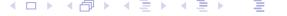

### Kalman filter – conceptual solution

### **System state estimate based on input and output data**

- ▶ Deterministic approach −→ state observer state error dynamics given by state injection – matrix A − KC
- ▶ Stochastic approach −→ Kalman filter state estimate given by c.p.d.f. p x(t)| Dt−<sup>1</sup>

#### **State of stochastic system – probabilistic definition**

▶ System state – contains all information relevant for prediction of <sup>x</sup>(<sup>t</sup> +1)*,* <sup>y</sup>(t)

$$\rho\left(x(t+1),y(t)\mid x(t),u(t),\mathcal{D}^{t-1}\right)=\rho\left(x(t+1),y(t)\mid x(t),u(t)\right)$$

▶ Output equation – marginal p.d.f.

$$p(y(t)|x(t),u(t)) = \int p(x(t+1),y(t)|x(t),u(t)) dx(t+1)$$

▶ State transition equation – conditioned p.d.f.

$$p(x(t+1)|x(t), u(t), y(t)) = \frac{p(x(t+1), y(t)|x(t), u(t))}{p(y(t)|x(t), u(t))}$$

dependence on y(t) – information available based on sampling scheme


### Kalman filter – conceptual solution (2)

#### Model of a dynamic system - review

► Single step predictor (see Chapter 3)

$$\begin{split} \rho\Big(y(t)|\,u(t),\mathcal{D}^{t-1}\Big) &= \int \rho\Big(y(t)\,\Big|\,x(t),u(t),\mathcal{D}^{t-1}\Big)\,\rho\Big(x(t)\,\Big|\,u(t),\mathcal{D}^{t-1}\Big)\,dx(t) \quad \text{(state def.)} \\ &= \int \rho\left(y(t)|\,x(t),u(t)\right)\rho\Big(x(t)\,\Big|\,u(t),\mathcal{D}^{t-1}\Big)\,dx(t) \\ &= \int \rho\left(y(t)|\,x(t),u(t)\right)\rho\left(x(t)\,\Big|\,\mathcal{D}^{t-1}\Big)\,dx(t) \end{split}$$

Natural condition of control

$$p\left(x(t) \mid \mathcal{D}^{t-1}, u(t)\right) = p\left(x(t) \mid \mathcal{D}^{t-1}\right)$$

not valid e.g. in case of complete state information

$$u(t) = -k^T x(t)$$

state-feedback control - additional information about the state

• Output predictor is based on state estimate  $p(x(t) \mid \mathcal{D}^{t-1})$ 

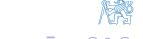

### Kalman filter – conceptual solution (3)

### State estimate development (uncorrelated process and measurement noise)

Initial estimate

$$p(x(t) \mid \mathcal{D}^{t-1})$$

▶ Data-update (filtration) step

$$\rho\left(x(t) \mid \mathcal{D}^{t}\right) = \frac{\rho\left(y(t) \mid x(t), u(t), \mathcal{D}^{t-1}\right)}{\rho\left(y(t) \mid u(t), \mathcal{D}^{t-1}\right)} \rho\left(x(t) \mid u(t), \mathcal{D}^{t-1}\right) \qquad \text{(state def. + n.c.c.)}$$

$$\propto \rho\left(y(t) \mid x(t), u(t)\right) \rho\left(x(t) \mid \mathcal{D}^{t-1}\right)$$

using data u(t), y(t)

▶ Time-update (prediction) step

$$p\left(x(t+1) \mid \mathcal{D}^{t}\right) = \int p\left(x(t+1) \mid x(t), \mathcal{D}^{t}\right) p\left(x(t) \mid \mathcal{D}^{t}\right) dx(t)$$

using state transition model

$$p\left(x(t+1) \mid x(t), \mathcal{D}^t\right) = p\left(x(t+1) \mid x(t), u(t), y(t)\right)$$


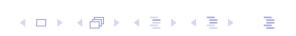

### Kalman filter algorithm

#### Assumption

- ightharpoonup Process noise and measurement noise are not correlated (S=0)
- then data-update and time-udate step can be performed separately

### Data-update step

▶ Joint c.p.d.f. of state x(t) and output y(t)

$$\rho\left(\begin{bmatrix}x(t)\\y(t)\end{bmatrix}\middle|\mathcal{D}^{t-1}\right) = \mathcal{N}\left(\begin{bmatrix}\hat{x}(t|t-1)\\\hat{y}(t|t-1)\end{bmatrix};\begin{bmatrix}P(t|t-1)&P(t|t-1)C^T\\CP(t|t-1)&CP(t|t-1)C^T+R\end{bmatrix}\right)$$

$$\hat{y}(t|t-1) = C\hat{x}(t|t-1) + Du(t)$$

► Conditional mean  $\mu_{x|y} = \mu_x + P_{xy}P_{yy}^{-1}(y - \mu_y)$ 

$$\hat{x}(t|t) = \hat{x}(t|t-1) + L(t)(y(t) - C\hat{x}(t|t-1) - Du(t))$$

$$L(t) = P(t|t-1)C^{T} \left(CP(t|t-1)C^{T} + R\right)^{-1}$$

► Conditional covariance matrix  $P_{x|y} = P_{xx} - P_{xy}P_{yy}^{-1}P_{yx}$ 

$$P(t|t) = P(t|t-1) - P(t|t-1)C^{T} (CP(t|t-1)C^{T} + R)^{-1} CP(t|t-1)$$

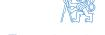

# Kalman filter algorithm (2)

#### **Time-update step**

▶ Conditional mean – prediction

$$\hat{x}(t+1|t) = A\hat{x}(t|t) + Bu(t)$$

▶ Conditional covariance matrix – prediction

$$P(t+1|t) = AP(t|t)A^{T} + Q$$

#### **Combined data-update and time-update step**

▶ Conditional mean

$$\hat{x}(t+1|t) = A(\hat{x}(t|t-1) + L(t)(y(t) - C\hat{x}(t|t-1) - Du(t))) + Bu(t) 
= (A - AL(t)C)\hat{x}(t|t-1) + (B - AL(t)D)u(t) + AL(t)y(t)$$

▶ Conditional covariance matrix

$$P(t+1|t) = AP(t|t-1)A^{T} - AP(t|t-1)C^{T} \left(CP(t|t-1)C^{T} + R\right)^{-1}CP(t|t-1)A^{T} + Q$$

uncorrelated noise assumption – standard form of Ricatti equation


### Supplementary reading

Kalman filter algorithm – correlated noise

### **Assumption**

- ▶ Process noise and measurement noise are correlated (<sup>S</sup> ̸<sup>=</sup> <sup>0</sup>)
- ▶ ... then data-update and time-update step cannot be performed separately

#### **Update algorithm 1 – recover separated data and time update step**

▶ Transform system equations to get non-correlated noise

$$\mathcal{E}\left\{\left[\begin{array}{c}v(t)\\e(t)\end{array}\right]\left[\begin{array}{c}v(t)\\e(t)\end{array}\right]^T\right\}=\left[\begin{array}{cc}Q&S\\S^T&R\end{array}\right]$$

Hint: after the data-update step, update information about the process noise v(t) for known value of y(t)

$$e(t) = y(t) - Cx(t) - Du(t)$$

conditioned process noise properties

$$\hat{v}(t|t) = SR^{-1} \Big( y(t) - Cx(t) - Du(t) \Big)$$

$$Q(t|t) = Q - SR^{-1}S^{T}$$


▶ De-correlated state transition equation

$$x(t+1) = A'x(t) + B'u(t) + SR^{-1}y(t) + v'(t)$$

where

$$A' = A - SR^{-1}C$$
  
$$B' = B - SR^{-1}D$$

▶ Noise covariance matrix is block-diagonal

$$\mathcal{E}\left\{ \left[ \begin{array}{c} v'(t) \\ e(t) \end{array} \right] \cdot \left[ \begin{array}{c} v'(t) \\ e(t) \end{array} \right]^T \right\} = \left[ \begin{array}{cc} Q - SR^{-1}S^T & 0 \\ 0 & R \end{array} \right] = \left[ \begin{array}{cc} Q' & 0 \\ 0 & R \end{array} \right]$$

▶ Time-update step (using known value of output <sup>y</sup>(t)

$$\hat{x}(t+1|t) = A'\hat{x}(t|t) + B'u(t) + SR^{-1}y(t)$$
  
 $P(t+1|t) = A'P(t|t)A'^{T} + Q'$ 

#### Update algorithm 2 - combined data and time update step

Combined data and time update - bayesian solution

$$p\left(x(t+1)|\mathcal{D}^{t}\right) = \frac{p\left(x(t+1),y(t)|u(t),\mathcal{D}^{t-1}\right)}{p\left(y(t)|u(t),\mathcal{D}^{t-1}\right)}$$

▶ Joint c.p.d.f. of state x(t+1) and output y(t)

$$\begin{split} \rho\bigg(\begin{bmatrix} x(t+1) \\ y(t) \end{bmatrix} \bigg| \, \mathcal{D}^{t-1} \bigg) &= \mathcal{N}\bigg(\begin{bmatrix} \hat{x}(t+1|t-1) \\ \hat{y}(t|t-1) \end{bmatrix}; \begin{bmatrix} AP(t|t-1)A^T + Q & AP(t|t-1)C^T + \mathbf{S} \\ CP(t|t-1)A^T + \mathbf{S}^T & CP(t|t-1)C^T + R \end{bmatrix} \bigg) \\ & \hat{x}(t+1|t-1) &= A\hat{x}(t|t-1) + Bu(t) \\ & \hat{y}(t|t-1) &= C\hat{x}(t|t-1) + Du(t) \end{split}$$

Conditional mean  $\mu_{x|y} = \mu_x + P_{xy}P_{yy}^{-1}(y - \mu_y)$ 

$$\hat{x}(t+1|t) = A\hat{x}(t|t-1) + Bu(t) + K(t)(y(t) - C\hat{x}(t|t-1) - Du(t)) 
K(t) = (AP(t|t-1)C^{T} + S)(CP(t|t-1)C^{T} + R)^{-1}$$

Conditional covariance matrix  $P_{x|y} = P_{xx} - P_{xy}P_{yy}^{-1}P_{yx}$ 

$$P(t+1|t) = AP(t|t-1)A^{T} - \left(AP(t|t-1)C^{T} + S\right)\left(CP(t|t-1)C^{T} + R\right)^{-1}\left(CP(t|t-1)A^{T} + S^{T}\right) + Q$$


### Stochastic properties of Kalman filter

#### Stochastic properties not affected by deterministic input

Consider linear stochastic system

$$x(t+1) = Ax(t) + v(t)$$
  
$$y(t) = Cx(t) + e(t)$$

▶ Information about filter performance – prediction error sequence

$$\varepsilon(t|t-1) = y(t) - \hat{y}(t|t-1)$$

(based on measurable output)

Apply orthogonality principle (properties of LMS estimate)

$$\begin{split} \mathcal{E}\left\{\left(y(t)-\hat{y}(t|t-1)\right)^T 1\right\} &= \mathcal{E}\left\{\left(x(t)-\hat{x}(t|t-1)\right)^T C^T\right\} = 0 \\ \mathcal{E}\left\{\left(y(t)-\hat{y}(t|t-1)\right)^T y(t-\tau)\right\} &= \mathcal{E}\left\{\left(x(t)-\hat{x}(t|t-1)\right)^T C^T y(t-\tau)\right\} = 0 \\ \mathcal{E}\left\{\varepsilon^T (t|t-1)\varepsilon(t-\tau|t-\tau-1)\right\} &= \mathcal{E}\left\{\left(x(t)-\hat{x}(t|t-1)\right)^T C^T \left(y(t-\tau)-\hat{y}(t-\tau|t-\tau-1)\right)\right\} = 0 \end{split}$$

- **Conclusion:**  $\varepsilon(t|t-1)$  should be a white noise sequence
  - lackbox Can be validated using sample autocovariance function (for  $au=0,1,\ldots$ )

$$R_{\varepsilon\varepsilon}(\tau) = \frac{1}{T-\tau} \sum_{t=\tau}^{r} \varepsilon(t|\ldots) \varepsilon^{T}(t-\tau|\ldots)$$


# Stochastic properties of Kalman filter (2)

#### **Prediction error – innovation**

▶ Prediction error

$$\varepsilon(t|t-1) = Cx(t) + e(t) - C\hat{x}(t|t-1) = C\tilde{x}(t|t-1) + e(t)$$

variance is time-varying (until Kalman filter convergence P(t|t−1) → P)

$$\mathcal{E}\left\{\varepsilon(t|t-1)\varepsilon^{T}(t|t-1)\middle|\mathcal{D}^{t-1}\right\} = CP(t|t-1)C^{T} + R$$

#### **Kalman filter and innovation**

▶ Kalman filter as a noise shaping filter

$$\hat{x}(t+1|t) = A\hat{x}(t|t-1) + L(t)\varepsilon(t|t-1) 
y(t) = C\hat{x}(t|t-1) + \varepsilon(t|t-1)$$

output – random process with given spectral density Syy (z)

▶ Kalman filter as a whitening filter

$$\hat{x}(t+1|t) = (A-L(t)C)\hat{x}(t|t-1)+L(t)y(t) 
\varepsilon(t|t-1) = y(t) - C\hat{x}(t|t-1)$$

output – white noise innovation sequence


## Kalman filter for coloured noise

#### **Terminology**

▶ Optics analogy: white light – all (visible) frequencies represented uniformly coloured light – frequencies not represented uniformly

### **Kalman filter for coloured process noise**

▶ Process model

$$x(t+1) = Ax(t) + Bu(t) + v(t)$$
  
$$y(t) = Cx(t) + Du(t) + e(t)$$

noise shaping filter (v ′ (t) white noise input)

$$x_{\nu}(t+1) = A_{\nu}x_{\nu}(t) + B_{\nu}v'(t)$$
  
 $v(t) = C_{\nu}x_{\nu}(t) + D_{\nu}v'(t)$ 

power spectrum density

$$S_{vv}(z) = \left(C_v(zI - A_v)^{-1}B_v + D_v\right)\left(C_v(z^{-1}I - A_v)^{-1}B_v + D_v\right)^T$$

▶ Augmented state space model

$$\begin{bmatrix} x(t+1) \\ x_{v}(t+1) \\ y(t) \end{bmatrix} = \begin{bmatrix} A & C_{v} \\ 0 & A_{v} \\ C & 0 \end{bmatrix} \begin{bmatrix} x(t) \\ x_{v}(t) \end{bmatrix} + \begin{bmatrix} B \\ 0 \\ D \end{bmatrix} u(t) + \begin{bmatrix} D_{v} \\ B_{v} \\ 0 \end{bmatrix} v'(t) + \begin{bmatrix} 0 \\ 0 \\ I \end{bmatrix} e(t)$$

filter design - standard derivation (with white noise inputs)


# Kalman filter for coloured noise (2)

#### **Kalman filter for coloured measurement noise**

▶ Process model

$$x(t+1) = Ax(t) + Bu(t) + v(t)$$
  
$$y(t) = Cx(t) + Du(t) + e(t)$$

noise shaping filter (e ′ (t) white noise input)

$$x_e(t+1) = A_e x_e(t) + B_e e'(t)$$

$$e(t) = C_e x_e(t) + D_e e'(t)$$

power spectrum density

$$S_{ee}(z) = \left(C_e(zI - A_e)^{-1}B_e + D_e\right)\left(C_e(z^{-1}I - A_e)^{-1}B_e + D_e\right)^T$$

▶ Augmented state space model

$$\begin{bmatrix} x(t+1) \\ x_e(t+1) \\ y(t) \end{bmatrix} = \begin{bmatrix} A & 0 \\ 0 & A_e \\ C & C_e \end{bmatrix} \begin{bmatrix} x(t) \\ x_e(t) \end{bmatrix} + \begin{bmatrix} B \\ 0 \\ D \end{bmatrix} u(t) + \begin{bmatrix} I & 0 \\ 0 & B_e \\ 0 & D_e \end{bmatrix} \begin{bmatrix} v(t) \\ e'(t) \end{bmatrix}$$

filter design – standard derivation (with correlated white noise input)

- ▶ Coloured both process and measurement noise combine the two methods
- ▶ Engineering point of view: modification of Kalman filter frequency response (transfer function <sup>F</sup>y*/*x<sup>ˆ</sup> )


# Continuous-time Kalman filter with discrete output measurement

#### **Continuous-time stochastic system**

- ▶ Continuous-time white noise does not exist (why?)
- ▶ State development

$$dx(\tau) = A_c x(\tau) d\tau + B_c u(\tau) d\tau + dw(\tau)$$

uncertainty – increment of Wiener process

$$\mathcal{E}\left\{dw(\tau)\right\}=0$$

$$\mathcal{E}\left\{dw(\tau)\ dw^{T}(\tau)\right\} = Qd\tau$$

expectation changes the order of infinitesimally small term

▶ Mean value dynamics

$$d\hat{x}(\tau) = A_c\hat{x}(\tau)d\tau + B_cu(\tau)d\tau$$

or also

$$\frac{d\hat{x}(\tau)}{d\tau} = A_c\hat{x}(\tau) + B_cu(\tau)$$

▶ Estimation error dynamics

$$d\tilde{x}(\tau) = A\tilde{x}(\tau)d\tau + dw(\tau)$$


# Continuous-time Kalman filter with discrete output measurement (2)

▶ Covariance matrix dynamics

$$P(\tau + d\tau) = \mathcal{E}\left\{\tilde{x}(\tau + d\tau)\tilde{x}^{T}(\tau + d\tau)\right\}$$

$$= \mathcal{E}\left\{\left(\tilde{x}(\tau) + A\tilde{x}(\tau)d\tau + dw(\tau)\right)\left(\tilde{x}(\tau) + A\tilde{x}(\tau)d\tau + dw(\tau)\right)^{T}\right\}$$

$$= P(\tau) + AP(\tau)d\tau + P(\tau)A^{T}d\tau + Qd\tau + AP(\tau)A^{T}(d\tau)^{2}$$

and using limit process

$$\frac{dP(\tau)}{d\tau} = \lim_{d\tau \to 0} \frac{P(\tau + d\tau) - P(\tau)}{d\tau} = AP(\tau) + P(\tau)A^{T} + Q$$

#### **Kalman filter steps**

▶ Data-update (after time-update step)

$$\hat{x}(k+1|k) = \hat{x}(\tau)|_{\tau = (k+1)T_S}, \qquad P(k+1|k) = P(\tau)|_{\tau = (k+1)T_S}$$

based on discrete-time observations

$$y(k) = C_c x(k) + e(k), \qquad x(k) = x(\tau)|_{\tau = kT_s}$$

▶ Time-update – continuous-time model, initial condition (after data-update step)

$$\hat{x}(\tau)|_{\tau=kT_s} = \hat{x}(k|k), \qquad P(\tau)|_{\tau=kT_s} = P(k|k)$$


# Prediction, filtering and smoothing

Available data set

$$\mathcal{D}^{T_f} = \{u(1), y(1), \ldots, u(t), y(t), \ldots, u(T_f), y(T_f)\}$$

Estimate at time  $t \leq T_f$ 

$$\begin{array}{lll} p(x(t)|\mathcal{D}^t) & \dots & & \text{filtering} \\ p(x(t+\tau)|\mathcal{D}^t) & \dots & & \text{prediction } (\tau>0) \\ p(x(t)|\mathcal{D}^{T_f}) & \dots & & \text{smoothing } (t< T_f) \end{array}$$

Bayesian smoothing equation (uncorrelated noise, input not relevant)

$$\rho\left(x(t)\middle|\mathcal{D}^{T_f}\right) = \int \rho\left(x(t)\middle|x(t+1),\mathcal{D}^t\right) \rho\left(x(t+1)\middle|\mathcal{D}^{T_f}\right) dx(t+1)$$

Stochastic inversion of system dynamics

$$\rho\Big(x(t)\Big|x(t+1),\,\mathcal{D}^t\Big) = \frac{\rho(x(t+1)|x(t))\,\rho\Big(x(t)\Big|\mathcal{D}^t\Big)}{\rho(x(t+1)|\mathcal{D}^t\Big)}$$

Resulting backward run equation (functional recursion)

$$p\left(x(t)\middle|\mathcal{D}^{T_f}\right) = p\left(x(t)\middle|\mathcal{D}^t\right) \int p(x(t+1)|x(t)) \frac{p\left(x(t+1)\middle|\mathcal{D}^{T_f}\right)}{p(x(t+1)|\mathcal{D}^t)} dx(t+1)$$


# Kalman smoother (Rauch-Tung-Striebel)

### **Transform functional recursion to parametric recursion**

- ▶ Statistics from forward run of Kalman filter
  - ▶ data update step filtering c.p.d.f

$$p(x(t)|\mathcal{D}^t) = \mathcal{N}(\hat{x}(t|t), P(t|t))$$

▶ time-update step – predictive c.p.d.f.

$$p(x(t+1)|\mathcal{D}^t) = \mathcal{N}(\hat{x}(t+1|t), P(t+1|t))$$

- ▶ Backward (smoothing) run of Kalman filter
  - ▶ smoothing step

$$p(x(t)|\mathcal{D}^{T_f}) = \mathcal{N}(\hat{x}(t|T_f), P(t|T_f))$$

▶ Kalman gain

$$F(t) = P(t|t)A^{T}P^{-1}(t+1|t)$$

▶ state update

$$\hat{x}(t|T_f) = \hat{x}(t|t) + F(t)(\hat{x}(t+1|T_f) - \hat{x}(t+1|t))$$

▶ covariance update

$$P(t|T_f) = P(t|t) - F(t) \Big( P(t+1|t) - P(t+1|T_f) \Big) F^{T}(t)$$

▶ Backward run does not depend on data, but only on forward run statistics!


# State estimation for non-linear stochastic systems

### **Taylor series expansion for random variables**

▶ Consider transformation of normal random variable

$$x \sim \mathcal{N}(\hat{x}, P_x)$$

by a non-linear mapping

$$y = g(x)$$

▶ Gaussian approximation of y based on the mean and covariance

$$y = g(x) = g(\hat{x} + \tilde{x}) \approx g(\hat{x}) + \frac{\partial g}{\partial x}^T \tilde{x} + \frac{1}{2} \sum_{i} \tilde{x}^T \frac{\partial^2 g_i}{\partial x^2} \tilde{x} e_i + \cdots$$

▶ Linear approximation

$$\mathcal{E} \{ y \} = \mathcal{E} \left\{ g(\hat{x}) + \frac{\partial g}{\partial x}^T \tilde{x} \right\} = g(\hat{x})$$

$$\operatorname{cov} \{ y \} = \mathcal{E} \left\{ \frac{\partial g}{\partial x}^T \tilde{x} \tilde{x}^T \frac{\partial g}{\partial x} \right\} = \frac{\partial g}{\partial x}^T P_x \frac{\partial g}{\partial x}$$

▶ 2-nd order approximation (scalar case)

$$\mathcal{E}\left\{y\right\} = \mathcal{E}\left\{g\left(\hat{x}\right) + \frac{dg}{dx}\tilde{x} + \frac{1}{2}\frac{d^{2}g}{dx^{2}}\tilde{x}^{2}\right\} = g\left(\hat{x}\right) + \frac{1}{2}\frac{\partial^{2}g}{\partial x^{2}}P_{x}$$


#### Extended Kalman filter

#### EKF - local approximation based on linearized model

Consider non-linear discrete-time stochastic system

$$x(t+1) = f(x(t), u(t), v(t)),$$
  $cov \{v(t)\} = Q$   
 $y(t) = g(x(t), u(t), e(t)),$   $cov \{e(t)\} = R$ 

### EKF data update step

► For available predicted values

$$\hat{x}(t|t-1), \quad P(t|t-1), \quad \hat{e}(t|t-1) = 0$$

linearize at the "best available estimate"

$$y(t) \approx g(\hat{x}(t|t-1), u(t), 0) + C(t)(x(t)-\hat{x}(t|t-1)) + \Gamma_e(t)e(t)$$

where

$$C(t) = \left. \frac{\partial g(x, u, e)}{\partial x} \right|_{x = \hat{x}(t|t-1), u = u(t), e = 0}, \qquad \Gamma_e(t) = \left. \frac{\partial g(x, u, e)}{\partial e} \right|_{x = \hat{x}(t|t-1), u = u(t), e = 0}$$

Kalman gain

$$L(t) = P(t|t-1)C^{T}(t) \left(C(t)P(t|t-1)C^{T}(t) + \Gamma_{e}(t)R\Gamma_{e}^{T}(t)\right)^{-1}$$

### Extended Kalman filter (2)

Mean and covariance update

$$\hat{x}(t|t) = \hat{x}(t|t-1) + L(t)(y(t) - g(\hat{x}(t|t-1), u(t), 0))$$

$$P(t|t) = P(t|t-1) - L(t) \left( C(t)P(t|t-1)C^{T}(t) + \Gamma_{e}(t)R\Gamma_{e}^{T}(t) \right) L^{T}(t)$$

#### EKF time-update step

For available filtered values, linearize

$$x(t+1) \approx f\left(\hat{x}(t|t), u(t), 0\right) + A(t)\left(x(t) - \hat{x}(t|t)\right) + \Gamma_{\nu}(t)\nu(t)$$

where

$$A(t) = \left. \frac{\partial f(x, u, v)}{\partial x} \right|_{x = \hat{x}(t|t), u = u(t), v = 0}, \qquad \Gamma_v(t) = \left. \frac{\partial f(x, u, v)}{\partial v} \right|_{x = \hat{x}(t|t), u = u(t), v = 0}$$

Mean and covariance update

$$\hat{x}(t+1|t) = f\left(\hat{x}(t|t), u(t), 0\right)$$

$$P(t+1|t) = A(t)P(t|t)A^{T}(t) + \Gamma_{v}(t)Q\Gamma_{v}^{T}(t)$$

Second-order approximation for the mean (scalar case)

$$\mathcal{E}\left\{f(x)\right\} \approx f(\mathcal{E}\left\{x\right\}) + \frac{1}{2} \frac{\partial^2 f(x)}{\partial x^2} \operatorname{cov}\left\{x\right\}$$


### Extended Kalman filter (3)

#### Iterated EKF - more accurate data update

Output measurement

$$y(t) = g(x(t), u(t)) + e(t)$$

Bayesian update

$$\begin{array}{lll} \rho(x(t)|\mathcal{D}^t) & \propto & \rho(y(t)|x(t)) \; \rho(x(t)|\mathcal{D}^{t-1}) \\ & \propto & \exp\left\{-\frac{1}{2} \; \|x(t) - \hat{x}(t|t-1)\|_{P^{-1}(t|t-1)}^2 - \frac{1}{2} \; \|y(t) - g(x(t),u(t))\|_{R^{-1}}^2\right\} \end{array}$$

- ► MAP estimate solution of non-linear least square problem (Gauss-Newton)
  - initialize  $\hat{x}^{(0)}(t) = \hat{x}(t|t-1)$
  - iterate

$$K^{(i)}(t) = P(t|t-1)G^{(i)}^{T}(t)\left(G^{(i)}(t)P(t|t-1)G^{(i)}^{T}(t) + R\right)^{-1}, \quad G^{(i)}(t) = \left.\frac{\partial g\left(x,u\right)}{\partial x}\right|_{x=\hat{x}^{(i)}(t),u=u(t)}$$

$$\hat{x}^{(i+1)}(t) = \hat{x}(t|t-1) + K^{(i)}(t)\left(y(t) - g(\hat{x}^{(i)}(t),u(t)) - G^{(i)}(t)\left(\hat{x}(t|t-1) - \hat{x}^{(i)}(t)\right)\right)$$

$$\approx \hat{x}^{(i)}(t)$$

until  $\hat{x}^{(i\!+\!1)}(t) pprox \hat{x}^{(i)}(t)$ 

then set

$$\hat{x}(t|t) = \hat{x}^{(i)}(t)$$

$$P(t|t) = P(t|t-1) - K^{(i)}(t)G^{(i)}(t)P(t|t-1)$$


## Unscented Kalman filter

### **Unscented transformation for normal distribution**

- ▶ For calculation of mean values E {<sup>f</sup> (x)}, p.d.f. <sup>N</sup> (ˆx*,* <sup>P</sup>xx ) can be represented by a set of *<sup>σ</sup>*–points
- ▶ *σ*–point definition

$$x_0 = \hat{x}, \quad w_0 = \frac{k}{n_x + k}$$

$$x_i = \hat{x} + S_i, \quad w_i = \frac{1}{2(n_x + k)}, \quad i = 1, \dots, n_x$$

$$x_i = \hat{x} - S_i, \quad w_i = \frac{1}{2(n_x + k)}, \quad i = n_x + 1, \dots, 2n_x$$

direction vectors – columns of Choleski factor of weighted covariance matrix

$$(n_x + k)P_{xx} = S^T S, S^T = [S_1, \dots, S_n]$$

parameter k controls the distance of *σ*–points from mean xˆ (theoretical optimum for normal distribution k = 3 − n<sup>x</sup> )

▶ Moments of <sup>x</sup> ∼ N (ˆx*,* <sup>P</sup>xx ) given as

$$\hat{x} = \sum_{i=0}^{2n_{\chi}} w_i x_i, \ \ P_{xx} = \sum_{i=0}^{2n_{\chi}} w_i (x_i - \hat{x}) (x_i - \hat{x})^T$$


### Unscented Kalman filter (2)

#### Data-update step

LMS estimate of x based on measurement y

$$\mathcal{E}\{x|y\} = \hat{x} + P_{xy}P_{yy}^{-1}(y - \hat{y}), \qquad \text{cov}\{x|y\} = P_{xx} - P_{xy}P_{yy}^{-1}P_{yx}$$

For available predicted values

$$\hat{x}(t|t-1), \quad P(t|t-1)$$

and output equation

$$y(t) = g(x(t)) + e(t), cov \{e(t)\} = R$$

required moments can be approximated based on  $\sigma\text{-points }x_i^\sigma(t|t\!-\!1)$ 

$$y_i(t) = g\left(x_i^{\sigma}(t|t-1)\right), \quad i = 0,\ldots,2n_x$$

Resulting formulas

$$\hat{y}^{A}(t) = \sum_{i=0}^{2n_{X}} w_{i}y_{i}(t)$$
 $P_{yy}^{A}(t) = \sum_{i=0}^{2n_{X}} w_{i} \left(y_{i}(t) - \hat{y}^{A}(t)\right) \left(y_{i}(t) - \hat{y}^{A}(t)\right)^{T} + R$ 
 $P_{xy}^{A}(t) = \sum_{i=0}^{2n_{X}} w_{i} \left(x_{i}^{\sigma}(t|t-1) - \hat{x}(t|t-1)\right) \left(y_{i}(t) - \hat{y}^{A}(t)\right)^{T}$ 


# Unscented Kalman filter (3)

#### **Time-update step**

▶ For available filtered values

$$\hat{x}(t|t), P(t|t)$$

and state transition equation

$$x(t+1) = f(x(t)) + v(t), \quad cov \{v(t)\} = Q$$

required moments can be approximated based on *σ*–points x *σ* i (t|t)

$$x_i(t+1) = f\left(x_i^{\sigma}(t|t)\right), \quad i = 0, \ldots, 2n_x$$

▶ Resulting formulas

$$\hat{x}^A(t+1) = \sum_{i=0}^{2n_X} w_i x_i(t+1)$$

$$P^{A}(t+1) = \sum_{i=0}^{2n_{X}} w_{i} \left(x_{i}(t+1) - \hat{x}^{A}(t+1)\right) \left(x_{i}(t+1) - \hat{x}^{A}(t+1)\right)^{T} + Q$$

and continue with data update step for

$$\hat{x}(t+1|t) \approx \hat{x}^A(t+1), \quad P(t+1|t) \approx P^A(t+1)$$


# <span id="page-131-0"></span>**6. Change detection**


## Change vs. fault and failure

### **Specific technical terminology**

#### Statistical analysis

- ▶ Change detection identify that probability distribution of a stochastic process changed
- ▶ Rigorous background statistical hypothesis testing

#### Engineering applications

- ▶ Fault a physical defect of a component that may lead to a failure
- ▶ Failure inability of a system to perform its function
- ▶ Fault detection identify that a fault has occurred
- ▶ Fault isolation pinpoint the type of fault
- ▶ Fault tolerance system ability to perform specific function in case of a specific fault has occurred
- ▶ Fault recovery replacement of faulty component during system operation (using e.g. redundancy)
- ▶ Failure recovery more complex process of restoring system functionality (e.g. after system crash)

# Adaptation vs. change detection methods

#### **Type of change**

- ▶ Slow parameter drift parameter estimation, forgetting
- ▶ Abrupt change detection and isolation

### **On-line change detection**

▶ Observe sequence of data items

$$y(t) \sim p_{\theta}(y(t)|y(t-1),\ldots,y(1))$$

- ▶ Time of change <sup>t</sup><sup>0</sup> unknown
  - for t ≤ t<sup>0</sup> parameter *θ* = *θ*<sup>0</sup>
  - for t *>* t<sup>0</sup> parameter *θ* = *θ*<sup>1</sup>
- ▶ Optimization problem e.g. minimize "delay" for given false alarm rate

### **Off-line change detection**

- ▶ Finite sample y(1)*, . . . ,* y(N) available
- ▶ Hypotheses to be tested
  - ▶ <sup>H</sup>0: no change

$$p_{\theta}(y(t)|y(t-1),\ldots,y(1)) = p_{\theta_0}(y(t)|y(t-1),\ldots,y(1))$$
 for  $t=1,\ldots,N$ 

▶ <sup>H</sup>1: change at time <sup>t</sup>0*,* <sup>1</sup> <sup>≤</sup> <sup>t</sup><sup>0</sup> <sup>≤</sup> <sup>N</sup>−<sup>1</sup>

$$\begin{array}{lcl} \rho_{\theta}(y(t)|y(t-1),\ldots,y(1)) & = & \rho_{\theta_0}(y(t)|y(t-1),\ldots,y(1)) & \text{for } t=1,\ldots,t_0 \\ \rho_{\theta}(y(t)|y(t-1),\ldots,y(1)) & = & \rho_{\theta_1}(y(t)|y(t-1),\ldots,y(1)) & \text{for } t=t_0+1,\ldots,N \end{array}$$


### Statistical hypothesis testing

### Statistical hypothesis – assumption on distribution of observed data

- Non-parametric hypothesis type of distribution (e.g. Gaussian vs. Cauchy)
- Parametric hypothesis value of a parameter for given distribution (e.g.  $\mu, \sigma^2$ )
  - ightharpoonup simple hypothesis parameter completely specified (e.g.  $\mu=0$ )
  - lacktriangle composite hypothesis parameter not completely specified (e.g.  $\mu>0$ )

### Statistical test - decision function mapping a sample to selected hypothesis

- ightharpoonup Null hypothesis  $H_0$  (no change)
- ► Alternative hypothesis *H*<sub>1</sub> (change occurred)
- ightharpoonup Objective: invalidate  $H_0$  using test statistics based on observed sample

$$\mathcal{Y}^N = \{y(1), \ldots, y(N)\}, \quad y(k) \in \Omega$$

▶ Critical function  $g: \Omega^N \to \{0,1\}$ 

$$\begin{array}{rcl} \Omega^N &=& \Omega_0^N \cup \Omega_1^N, & & \text{disjunctive regions} & \Omega_0^N \cap \Omega_1^N = \emptyset \\ \\ g(\mathcal{Y}^N) &=& 0 & & \text{for } \mathcal{Y}^N \in \Omega_0^N \\ \\ g(\mathcal{Y}^N) &=& 1 & & \text{for } \mathcal{Y}^N \in \Omega_1^N \text{ (critical region of the test)} \end{array}$$


# Statistical hypothesis testing (2)

#### **Quality of the test**

▶ Significance level *<sup>α</sup>* – probability of incorrectly rejecting <sup>H</sup><sup>0</sup>

$$lpha = P\left\{\mathcal{Y}^N \in \Omega_1^N | H_0 
ight\} = P\left\{g(\mathcal{Y}^N) 
eq 0 | H_0 
ight\}$$
 type I error (false positive rate)

▶ Test power (1 <sup>−</sup> *<sup>β</sup>*) – probability of correctly rejecting <sup>H</sup><sup>0</sup>

$$eta=P\Big\{\mathcal{Y}^N\in\Omega_0^N|H_1\Big\}=P\Big\{g(\mathcal{Y}^N)
eq1|H_1\Big\}$$
 type II error (false negative rate)

▶ Example: change of the mean value (based on a single sample y)

$$H_0: y \sim \mathcal{N}(0, 0.1), \qquad H_1: y \sim \mathcal{N}(1, 0.1)$$


# Statistical hypothesis testing (3)

#### Test optimization criteria

▶ Errors depend on critical function

$$\alpha = \alpha(g) \ge 0, \quad \beta = \beta(g) \ge 0$$

### Most powerful test $g_{MP}^*$

- ▶ Select significance level (typically  $\alpha_0 = 0.01 \dots 0.05$ )
- ▶ Minimize type II error (maximize power) for fixed type I error

$$g_{MP}^* = \arg\min_{g} \beta(g)$$
 with constraint  $\alpha(g) = \alpha_0$ 

### Bayesian test $g_B^*$

- ▶ Requires known prior probabilities  $P\{H_0\}$ ,  $P\{H_1\}$
- ► Minimize weighted probability of type I / type II error

$$w(g) = P\{g(\mathcal{Y}^N) \neq 0 | H_0\} P\{H_0\} + P\{g(\mathcal{Y}^N) \neq 1 | H_1\} P\{H_1\} = \alpha(g)P\{H_0\} + \beta(g)P\{H_1\}$$
$$g_B^* = \arg\min_{g} w(g)$$

► Can be extended to minimum loss test (cost of false positive/negative)

### Minimax test $g_{MinMax}^*$

Minimize maximum probability of type I / type II errors

$$g_{\textit{MinMax}}^* = \arg\min_{g} \max\{\alpha(g), \beta(g)\}$$


### Likelihood ratio methods: simple hypothesis

#### **Neyman-Pearson lemma (1933)**

Let H<sup>0</sup> and H<sup>1</sup> correspond to populations with distributions p0(Y <sup>N</sup> ) and p1(Y <sup>N</sup> ). Then there exists a a most-powerful test with critical function g(Y <sup>N</sup> ) and a constant *λ<sup>α</sup>* such that

$$\mathcal{E}\left\{\left.g(\mathcal{Y}^N)\right|\,H_0
ight\}=lpha$$
  $g(\mathcal{Y}^N)=1$  for  $rac{
ho_1(\mathcal{Y}^N)}{
ho_0(\mathcal{Y}^N)}\geq\lambda_lpha$   $g(\mathcal{Y}^N)=0$  for  $rac{
ho_1(\mathcal{Y}^N)}{
ho_0(\mathcal{Y}^N)}<\lambda_lpha$ 

#### **Likelihood Ratio Test (LR) implementation**

▶ For independent samples, the statistics for LR test can be calculated as

$$\frac{\rho_{1}(\mathcal{Y}^{N})}{\rho_{0}(\mathcal{Y}^{N})} = \frac{\prod_{k=1}^{N} \rho_{1}(y(k))}{\prod_{k=1}^{N} \rho_{0}(y(k))} = \prod_{k=1}^{N} \frac{\rho_{1}(y(k))}{\rho_{0}(y(k))} \longrightarrow \ln \frac{\rho_{1}(\mathcal{Y}^{N})}{\rho_{0}(\mathcal{Y}^{N})} = \sum_{k=1}^{N} \ln \frac{\rho_{1}(y(k))}{\rho_{0}(y(k))} = \sum_{k=1}^{N} s(y(k))$$

i.e. the sufficient statistic can be updated as

$$S_k = S_{k-1} + s(y(k))$$

▶ Resulting Log likelihood test

$$S_N \geq \ln \lambda_{\alpha}$$


### Likelihood ratio methods: composite hypothesis

#### **Generalized Neyman-Pearson lemma**

Consider composite hypotheses H<sup>0</sup> = {*θ* : *θ* ∈ Θ0} and H<sup>1</sup> = {*θ* : *θ* ∈ Θ1}. Then there exists a critical function gˆ(Y <sup>N</sup> ) and a constant *λ<sup>α</sup>* such that

$$\begin{split} \sup_{\theta \in \Theta_0} \mathcal{E} \left\{ \left. g(\mathcal{Y}^N) \right| \theta \right\} &= \alpha \\ \hat{g}(\mathcal{Y}^N) &= 1 \ \text{ for } \ \frac{\sup_{\theta \in \Theta_1} p_{\theta}(\mathcal{Y}^N)}{\sup_{\theta \in \Theta_0} p_{\theta}(\mathcal{Y}^N)} \geq \lambda_{\alpha} \\ \hat{g}(\mathcal{Y}^N) &= 0 \ \text{ for } \ \frac{\sup_{\theta \in \Theta_1} p_{\theta}(\mathcal{Y}^N)}{\sup_{\theta \in \Theta_0} p_{\theta}(\mathcal{Y}^N)} < \lambda_{\alpha} \end{split}$$

#### **Generalized Likelihood Ratio Test (GLR) implementation**

▶ For composite hypotheses, GLR is a LR test based on ML estimates of *θ*

$$\hat{ heta}_0 = rg \sup_{ heta \in \Theta_0} I( heta|(\mathcal{Y}^N), \qquad \hat{ heta}_1 = rg \sup_{ heta \in \Theta_1} I( heta|(\mathcal{Y}^N))$$

▶ Resulting test

$$\hat{g}(\mathcal{Y}^N) = 1 \text{ for } \frac{p_{\hat{ heta}_1}(\mathcal{Y}^N)}{p_{\hat{ heta}_0}(\mathcal{Y}^N)} \geq \lambda_{lpha}, \qquad \hat{g}(\mathcal{Y}^N) = 0 \text{ for } \frac{p_{\hat{ heta}_1}(\mathcal{Y}^N)}{p_{\hat{ heta}_0}(\mathcal{Y}^N)} < \lambda_{lpha}$$


## Sequential likelihood ratio method

#### **Classical LR test**

▶ Critical function g(Y <sup>N</sup> ) and *λ<sup>α</sup>* defined for given fixed N

$$g(\boldsymbol{\mathcal{Y}}^N) = 1 \ \text{ for } \ \frac{\rho_1(\boldsymbol{\mathcal{Y}}^N)}{\rho_0(\boldsymbol{\mathcal{Y}}^N)} \geq \lambda_\alpha \ , \qquad g(\boldsymbol{\mathcal{Y}}^N) = 0 \ \text{ for } \ \frac{\rho_1(\boldsymbol{\mathcal{Y}}^N)}{\rho_0(\boldsymbol{\mathcal{Y}}^N)} < \lambda_\alpha$$

### **Sequential Likelihood Ratio (SLR) test – Wald (1945)**

Critical function replaced by a decision scheme with time-varying k

▶ Statistics update

$$S_k = S_{k-1} + \ln \frac{p_1(y(k))}{p_0(y(k))}$$

▶ Decision step: accept decision

$$g(\mathcal{Y}^N) = 1$$
 for  $S_k \ge b$ ,  $g(\mathcal{Y}^N) = 0$  for  $S_k \le a$ 

otherwise continue (for a *<* S<sup>k</sup> *<* b, more information to be accumulated)

▶ Parameters a *<* b are given as

$$\label{eq:alpha} \mathbf{a} \approx \ln \frac{\beta}{1-\alpha} \ , \qquad \mathbf{b} \approx \ln \frac{1-\beta}{\alpha}$$

Note: with sequential approach, both type I and type II errors are under control


### Detection algorithms based on LR test

#### Objectives/assumptions/approach

▶ Develop "on-line" recursive algorithm based on sequence of observed data

$$y(k) \sim p_{\theta}(y(k)|y(k-1),\ldots,y(1))$$

- lacktriangle Assume single change of the value of parameter heta
  - **b** before the change  $\theta = \theta_0$
  - after the change  $\theta=\theta_1$
  - ightharpoonup time of the change  $t_0$  unknown
- Use log LR test statistic

$$s(y) = \ln \frac{I(\theta_1|y)}{I(\theta_0|y)} = \ln \frac{p(y|\theta_1)}{p(y|\theta_0)} = \ln \frac{p_{\theta_1}(y)}{p_{\theta_0}(y)}$$

with properties

$$\mathcal{E}\left\{s(y)|\theta=\theta_{0}\right\}<0,\qquad \mathcal{E}\left\{s(y)|\theta=\theta_{1}\right\}>0$$

Parameter change  $\longrightarrow$  change of sign of statistic s(y) mean (will be illustrated on the change of population mean value)

# Properties of statistics s(y) and $S_N(\mathcal{Y}^N)$

#### Example - change of mean value

- Independent normal variables with known variation  $\sigma^2$ , change of parameter  $\mu$
- Observed samples from populations

$$p(y|\mu_0) = \frac{1}{\sqrt{2\pi}\sigma}e^{-\frac{(y-\mu_0)^2}{2\sigma^2}}, \qquad p(y|\mu_1) = \frac{1}{\sqrt{2\pi}\sigma}e^{-\frac{(y-\mu_1)^2}{2\sigma^2}}$$

► Statistic s(y)

$$\ln I(\mu|y) = -\ln \sigma - \frac{1}{2} \ln 2\pi - \frac{(y-\mu)^2}{2\sigma^2}$$

$$s(y) = \ln \frac{I(\mu_1|y)}{I(\mu_0|y)} = -\frac{(y-\mu_1)^2}{2\sigma^2} + \frac{(y-\mu_0)^2}{2\sigma^2} = \frac{\mu_1 - \mu_0}{\sigma^2} \left(y - \frac{\mu_0 + \mu_1}{2}\right)$$

ightharpoonup Properties of s(y) - mean value

$$\mathcal{E}\left\{s(y)|\mu = \mu_0\right\} = \frac{\mu_1 - \mu_0}{\sigma^2} \left(\mu_0 - \frac{\mu_0 + \mu_1}{2}\right) = -\frac{(\mu_1 - \mu_0)^2}{2\sigma^2} < 0$$

$$\mathcal{E}\left\{s(y)|\mu = \mu_1\right\} = \frac{\mu_1 - \mu_0}{\sigma^2} \left(\mu_1 - \frac{\mu_0 + \mu_1}{2}\right) = -\frac{(\mu_1 - \mu_0)^2}{2\sigma^2} > 0$$

builder difference proportional to signal (delta  $\mu$ ) to noise ( $\sigma^2$ ) ratio


#### Properties of statistics s(y) and SN(Y <sup>N</sup>) (2)

▶ Properties of s(y) - variance

$$\begin{split} \{\tilde{s}(y)|\mu &= \mu_i\} &= \frac{\mu_1 - \mu_0}{\sigma^2} \left( \mu_i + \tilde{y} - \frac{\mu_0 + \mu_1}{2} \right) - \frac{\mu_1 - \mu_0}{\sigma^2} \left( \mu_i - \frac{\mu_0 + \mu_1}{2} \right) \\ &= \frac{\mu_1 - \mu_0}{\sigma^2} \ \tilde{y} \\ &\text{cov} \{s(y)|\mu = \mu_i\} = \frac{(\mu_1 - \mu_0)^2}{\sigma^4} \ \text{cov} \{y\} = \frac{(\mu_1 - \mu_0)^2}{\sigma^2} \end{split}$$

▶ Properties of <sup>S</sup><sup>N</sup> (<sup>Y</sup> <sup>N</sup> ) for independent samples y(k)

$$\mathcal{E}\left\{S_N(\mathcal{Y}^N)|\mu=\mu_i\right\} = \sum_{k=1}^N \mathcal{E}\left\{s(y(k))|\mu=\mu_i\right\} = N \mathcal{E}\left\{s(y)|\mu=\mu_i\right\}$$

$$\operatorname{cov}\left\{\left.S_N(\mathcal{Y}^N)\right|\mu=\mu_i\right\} = \sum_{k=1}^N \operatorname{cov}\left\{s(y(k))|\mu=\mu_i\right\} = N \operatorname{cov}\left\{s(y)|\mu=\mu_i\right\}$$

- ▶ mean difference proportional to N
- ▶ standard deviation / scale proportional to p (N)
- ▶ increased sample size results in better discrimination / reduction of false alarm rate


#### Properties of statistics s(y) and SN(Y <sup>N</sup>) (3)

### S<sup>N</sup> **statistics for change of mean value**

▶ Signal/noise ratio <sup>∆</sup>*<sup>µ</sup> <sup>σ</sup>* = 1


▶ Signal/noise ratio *δµ <sup>σ</sup>* = 0*.*5


# Detection algorithms (1)

### **GMA algorithm** (Geometric Moving Average)

- ▶ Exponentially weighted data
- ▶ Cumulative statistic

$$S_k = (1 - \varphi) \sum_{i=0}^{\infty} \varphi^{k-i} s_{k-i} = \varphi S_{k-1} + (1 - \varphi) s_k$$

▶ Critical function

$$g_k = 1 \ \ {
m for} \ \ S_k \geq \lambda, \qquad g_k = 0 \ \ {
m for} \ \ S_k < \lambda$$

### **FMA algorithm** (Finite Moving Average)

- ▶ Finite window based data
- ▶ Cumulative statistics

$$S_k = \sum_{i=0}^{N-1} s_{k-i} = S_{k-1} + s_k - s_{k-N}$$

▶ Critical function

$$g_k = 1 \; ext{ for } \; S_k \geq \lambda, \qquad g_k = 0 \; ext{ for } \; S_k < \lambda$$


# Detection algorithms (2)

### **CUSUM algorithm** (Cumulative Sum)

▶ Recall that

$$\mathcal{E}\left\{s_k|\theta=\theta_0\right\}<0,\qquad \mathcal{E}\left\{s_k|\theta=\theta_1\right\}>0$$

i.e. statistic S<sup>k</sup> = Sk−<sup>1</sup> + s<sup>k</sup> is decreasing until the change time

▶ Relevant information: change of the statistics with respect to minimum value

$$m_k = \min_{i=0,\ldots,k} S_i$$

▶ Critical function

$$g_k = 1$$
 for  $S_k - m_k \ge \lambda,$   $g_k = 0$  for  $S_k - m_k < \lambda$ 

adaptive threshold to make detection delay independent of run time

#### **CUSUM method interpreted as repeated SLR test**

- ▶ If <sup>g</sup><sup>k</sup> <sup>=</sup> 0 (for <sup>S</sup><sup>k</sup> *<sup>&</sup>lt;* <sup>−</sup>*ε*), restart SLR cycle
- ▶ Statistics development (for *ε* → 0)

$$S_k = S_{k-1} + s_k$$
 for  $S_{k-1} + s_k > 0$   
 $S_k = 0$  for  $S_{k-1} + s_k \le 0$ 

▶ Compact notation

$$S_k = \left(S_{k-1} + s_k\right)^+$$


# Detection algorithms (3)

### **Example: CUSUM** S<sup>k</sup> **statistics for change of mean value**

▶ Signal/noise ratio


### Change detection in state-space model

#### Hidden Markov model

- Dynamic system continuous state Markov process
  - state property

$$p(x(t+1)|x(t),x(t-1),...,x(1)) = p(x(t+1)|x(t))$$

▶ System can run in multiple modes  $m(t) \in \{1, ..., M\}$ 

$$p_i(x(t+1), y(t)|x(t), u(t)) = p(x(t+1), y(t)|x(t), u(t), m(t) = i)$$

- Active mode m(t) discrete state Markov process
- ▶ Observations  $\{y(1), y(2), \dots, y(t)\}$  hidden Markov model (HMM)
  - > state and mode cannot be observed directly
  - **b** observations y(t) depend on associated Markov chains  $\{x(t), m(t)\}$


# Change detection in state-space model (2)

#### Active mode dynamics

- Active mode m(t) Markov process with discrete state  $m(t) \in \{1, ..., M\}$
- Transitions described by transition probabilities

$$\pi_{i,j}(t) = P\left\{m(t+1)=j\mid m(t)=i\right\}$$

- ▶ Stationary Markov process constant transition matrix  $\Pi(t) = \Pi$
- Probability distribution over modes

$$P_m(t) = (P\{m(t) = 1\}, \dots, P\{m(t) = N\})^T$$

time update / stationary distribution  $\propto$  to left eigenvector  $\lambda_\Pi=1$ 

$$P_m(t+1) = \Pi^T P_m(t), \qquad P_m^T(\infty) = P_m^T(\infty) \Pi$$

Example: transition matrix and weighted graph representation

$$\Pi = \begin{pmatrix} 0.6 & 0.3 & 0.1 \\ 0.0 & 0.4 & 0.6 \\ 0.4 & 0.2 & 0.4 \end{pmatrix}$$

$$P_m(0) = (1.000, 0.000, 0.000)^T$$

$$P_m(1) = (0.600, 0.300, 0.100)^T$$

$$P_m(2) = (0.400, 0.320, 0.270)^T$$

$$\vdots$$

$$P_m(\infty) = (0.353, 0.294, 0.353)^T$$


### Use of bank of models

#### Multiple models of state-transition

State-transition models

$$p_i(x(t+1)|x(t), u(t), y(t)) = p(x(t+1)|x(t), u(t), y(t), m(t) = i)$$

- changes in state dynamics
- changes in external disturbances (unknown input observer)

#### Multiple models of output measurement

Measurement models

$$p_i(y(t)|x(t), u(t)) = p(y(t)|x(t), u(t), m(t) = i)$$

- sensor fault (noise / bias)
- communication loss (frozen sensor)
- sensor range limitation

#### Markov model of transitions (different problem formulations)

- ▶ Parallel models → structure selection problem
  - b different structure and state representation
- ► Alternative models → change/fault detection problem
  - consistent structure and state representation
  - complexity reversible vs. irreversible changes
- ▶ Interacting models → dimensionality reduction
  - consistent structure and state representation
  - complexity fixed


# HMM probability evaluation

#### **Parallel models**

▶ Prior probabilities on a set of models

$$P_{m_i}(0) \approx 1/M, \qquad i=1,\ldots,M$$

▶ Data update step for p(m(t)|Dt−<sup>1</sup>

)

$$P(m(t)|\mathcal{D}^t) \propto p(y(t)|\mathcal{D}^{t-1}, u(t), m(t)) P(m(t)|\mathcal{D}^{t-1})$$

Predictive c.p.d.f. of output

$$p(y(t)|\mathcal{D}^{t-1}, u(t), m(t)) = \int p(y(t)|x(t), u(t), m(t)) \ p(x(t)|\mathcal{D}^{t-1}, m(t)) \ dx$$

depends on measurement equation

$$p(y(t)|x(t),u(t),m(t)=i) = p_i(y(t)|x(t),u(t)) = \mathcal{N}(C_i\hat{x}_i(t|t-1) + D_iu(t), C_iP_i(t|t-1)C_i^T + R_i)$$

and state-estimate

$$p(x(t)|\mathcal{D}^{t-1}, m(t)=i) = p_i(x(t)|\mathcal{D}^{t-1}) = \mathcal{N}(\hat{x}_i(t|t-1), P_i(t|t-1))$$


# HMM probability evaluation (2)

▶ Time-update step for P(m(t)|Dt−<sup>1</sup> ) (no switching/interaction)

$$P\{m(t) = i | m(t-1) = j, \mathcal{D}^{t-1}\} = \delta(i, j), i, j = 1, ..., M$$

#### **Complexity**

- ▶ M Kalman filters running in parallel
- ▶ No information exchange
- ▶ State vectors / model structure for individual modes need not be consistent


# HMM probability evaluation (3)

#### Alternative models

▶ Bayesian approach – update probability

$$P\left(m(t) \mid \mathcal{D}^t\right)$$

based on "future" data set (relative to decision time t)

$$\mathcal{D}_{t+1}^{t+d} = \{u(t+1), y(t+1), \dots, u(t+d), y(t+d)\}$$

Make decision based on posterior probability

$$P\left(m(t)\left|\mathcal{D}^{t+d}\right.\right)$$

(changes in system dynamic are not visible in current output)

$$\begin{array}{cccccccccccccccccccccccccccccccccccc$$

# HMM probability evaluation (4)

### **Accumulation of information from "future "data**

▶ Build tree of alternative mode trajectories

$$\mathcal{M}^{k}(t) = \{m(t), m(t+1), \ldots, m(t+k)\}\$$

with decision delay given by tree depth k

▶ Evaluate probabilities <sup>P</sup> M<sup>k</sup> (t) <sup>D</sup>t+<sup>k</sup> for all possible mode trajectories

#### **Data-update step**

▶ Bayes formula

$$P\left(\mathcal{M}^{k}(t) \middle| \mathcal{D}^{t+k}\right) \propto P\left(y(t+k) \middle| \mathcal{D}^{t+k-1}, u(t+k), \mathcal{M}^{k}(t)\right) \times P\left(\mathcal{M}^{k}(t) \middle| \mathcal{D}^{t+k-1}\right)$$

▶ Predictive c.p.d.f. of output

$$p\left(y(t+k)\middle|\mathcal{D}^{t+k-1},u(t+k),\mathcal{M}^{k}(t)\right) = \int p\left(y(t+k)|x(t+k),u(t+k),m(t+k)\right) \times p\left(x(t+k)\middle|\mathcal{D}^{t+k-1},\mathcal{M}^{k-1}(t)\right) dx(t+k)$$

depends on bank of Kalman filter estimates along mode trajectories

$$\rho\left(x(t+k)\left|\mathcal{D}^{t+k-1},\mathcal{M}^{k-1}(t)\right.\right)=\mathcal{N}\left\{\hat{x}\left(t+k|t+k-1,\mathcal{M}^{k-1}(t)\right);P\left(t+k|t+k-1,\mathcal{M}^{k-1}(t)\right)\right\}$$


# HMM probability evaluation (5)

### **Time-update step**

▶ Markov property: probability distribution on the set of modes at time t+k

$$P\left(\mathcal{M}^{k+1}(t)\middle|\mathcal{D}^{t+k}\right) = P\left(m(t+k+1)\middle|m(t+k),\mathcal{D}^{t+k}\right)P\left(\mathcal{M}^{k}(t)\middle|\mathcal{D}^{t+k}\right)$$
$$= P\left(m(t+k+1)\middle|m(t+k)\right)P\left(\mathcal{M}^{k}(t)\middle|\mathcal{D}^{t+k}\right)$$

#### **Active mode detection**

▶ Posterior probability – marginal distribution of all branches stemming from the root

$$P\left(m(t)|\mathcal{D}^{t+d}
ight) = \sum_{m(t+1),\dots,m(t+d)} P\left(\mathcal{M}^d(t)|\mathcal{D}^{t+d}
ight)$$

#### **Properties**

- ▶ Consistent state representation for all modes
- ▶ Exponential complexity growth some pruning may be required
- ▶ Reduce complexity by prior information (reversible vs. irreversible changes)
- ▶ Fixed vs. variable tree depth (sequential decision making problem)


### Interacting multiple models

#### **Data update step**

▶ Individual mode probabilities and state estimates

$$P(m(t)=i | \mathcal{D}^{t}) \propto p(y(t) | \mathcal{D}^{t-1}, u(t), m(t)=i) P(m(t)=i | \mathcal{D}^{t-1})$$

$$\times (t) | \mathcal{D}^{t}) \propto p(y(t) | \mathcal{D}^{t-1}, u(t), m(t)=i) p_{i}(x(t) | \mathcal{D}^{t-1}) \approx \mathcal{N}(\hat{x}_{i}(t|t); P_{i}(t|t))$$

### **Model mixing**

▶ Known prior mixing probabilities (time invariant)

pi 

$$\pi_{i|j} = P\{m(t) = i|m(t-1) = j\}$$

▶ Mixed mode probability for i-th mode

$$\bar{P}\left(m(t)=i\,\Big|\,\mathcal{D}^{t}
ight)=\sum_{j=1}^{M}\pi_{i\,|j|}\,P\left(m(t)=j\,\Big|\,\mathcal{D}^{t}
ight)$$

▶ Mixed state estimate for i-th mode

$$ar{p}_iig(\!x(t)ig|\mathcal{D}^tig) = \sum_{j=1}^M 
ho_{i|j}(t) \; 
ho_jig(\!x(t)ig|\mathcal{D}^tig) \quad ext{with} \quad 
ho_{i|j}(t) = rac{\pi_{i|j} \; Pig(\!m(t)=jig|\mathcal{D}^tig)}{\sum_k \pi_{i|k} \; P\left(\!m(t)=kig|\mathcal{D}^tig)}$$


# Interacting multiple models (2)


#### Mixture approximation

▶ Approximate mixture distribution  $\bar{p}_i(.|.)$  by a normal distribution

$$ar{p}_i \Big( x(t) \, \Big| \, \mathcal{D}^t \, \Big) \;\; o \;\; \mathcal{N} \left( ar{\mathbf{x}}_i(t|t); ar{P}_i(t|t) 
ight) pprox \sum_i p_{i|j}(t) \; \mathcal{N} \left( \hat{\mathbf{x}}_j(t|t); P_j(t|t) 
ight)$$

Fitting the mean and covariance

wriance 
$$\bar{x}_i(t|t) = \sum_{j=1}^M \rho_{i|j}(t) \; \hat{x}_j(t|t)$$
 
$$\bar{P}_i(t|t) = \sum_{i=1}^M \rho_{i|j}(t) \left( P_j(t|t) + (\hat{x}_j(t|t) - \bar{x}_i(t|t)) \; (\hat{x}_j(t|t) - \bar{x}_i(t|t))^T \right)$$


### Interacting multiple models (3)

### Time update step

Keep mode probability

$$P(m(t+1)=i \mid \mathcal{D}^t) = \bar{P}(m(t)=i \mid \mathcal{D}^t)$$

▶ Time update step for approximated state estimates for individual modes

$$\begin{array}{lcl} \rho_i\Big(x(t+1)\Big|\mathcal{D}^t\Big) & = & \rho_i\Big(x(t+1)\Big|x(t),u(t)\Big) \; \bar{\rho}_i\Big(x(t)\Big|\mathcal{D}^{t-1}\Big) \\ & \approx & \mathcal{N}\Big(\hat{x}_i(t+1|t);P_i(t+1|t)\Big) \end{array}$$

#### **Properties**

- Consistent state representation for all modes
- IMM algorithm with fixed complexity

# <span id="page-158-0"></span>**7. Monte Carlo implementation of bayesian methods**


### Optimal decision problem

#### Decision based on observed data y

$$d^*(y) = \arg\min_{d} \int L(\theta, d) p(\theta|y) \ d\theta$$

- ▶ Utility/loss function maximize utility  $U(\theta, d)$  or minimize loss  $L(\theta, d)$
- ▶ Decision d to be optimized
- Information about unknown parameter based on available data  $p(\theta|y)$

#### Example

▶ Parameter estimation  $d = \hat{\theta} \rightarrow MS$  estimate

$$L(\theta, \hat{\theta}) = (\theta - \hat{\theta})^2, \qquad \hat{\theta}^*(y) = \arg\min_{\hat{\theta}} \int (\theta - \hat{\theta})^2 p(\theta|y) \ d\theta = \mathcal{E}\{\theta|y\}$$

#### Where are the problems

► Calculation of posterior c.p.d.f.

$$p(\theta|y) \propto p(y|\theta) p(\theta)$$

Normalization – multivariate integration (for dimension of  $\theta$  greater than 3-4)

$$p(\theta|y) = \frac{p(y|\theta)p(\theta)}{\int p(y|\theta)p(\theta)d\theta}$$

▶ Solution – represent the c.p.d.f. by a sample  $y_i \sim p(y|\mathcal{D}), i = 1, ..., N$ 


# Non-parametric estimate of p.d.f.

### **Empirical p.d.f.**

▶ Empirical p.d.f. of a sample Y <sup>n</sup> = {y1*, . . . ,* yn}

$$r_n(y) = rac{1}{n} \sum_{i=1}^n \delta(y-y_i), \qquad \delta(y)$$
 – Dirac function (distribution)

▶ Recursive update

$$r_n(y) = \frac{n-1}{n} r_{n-1}(y) + \frac{1}{n} \delta(y - y_n)$$

▶ Multivariable case – "scatter plot"

### **Histogram**

- ▶ Allocate data sample Y <sup>n</sup> = {y1*, . . . ,* yn} into m bins with width h
- ▶ Indicator (membership) function

$$l_j(y) = 1$$
 for  $y$  in  $j$ -th interval/bin  
= 0 otherwise

▶ Histogram defined as

$$h_n(y) = \frac{1}{nh} \sum_{i=1}^n \sum_{j=1}^m I_j(y_i)$$


# Non-parametric estimate of p.d.f. (2)

#### Histogram normalization

- ▶ Sample  $\mathcal{Y}^n = \{y_1, \dots, y_n\}$ , m bins, width h
- ▶ Bin count  $n_b(j)$ , bin probability  $p_b(j) = n_b(j)/n$
- ► Normalized count (Matlab 'count')

$$\sum_{j=1}^m n_b(j) = 1$$

Normalized probability (Matlab 'prob')

$$\sum_{j=1}^{m} \rho_b(j) = 1$$

Probability density function (Matlab 'pdf')

$$\int_{-\infty}^{\infty} h_n(y) dy \approx \sum_{j=1}^{m} h\left(\frac{p_b(j)}{h}\right) = 1$$

- ► Normalized cumulative count (Matlab 'cumcount')
- ► Cumulative probability function (Matlab 'cdf')


# Non-parametric estimate of p.d.f. (3)

#### Kernel estimate

 $\blacktriangleright$  Kernel K(y), width h

$$k_{n,h}(y) = \frac{1}{nh} \sum_{i=1}^{n} K\left(\frac{y-y_i}{h}\right)$$

- Frequently used kernels
  - rightharpoonup normal kernel  $K(y) = \frac{1}{\sqrt{2\pi}} \exp\left(-y^2/2\right)$
  - Tukey kernel  $K(y) = \frac{15}{16} (1 y^2)^2$  with finite support  $|y| \le 1$
- ► Kernel width: tradeoff between smoothing and resolution
  - $\triangleright$  globally optimal width for known p(y)

$$h = \left[ \frac{\int K^2(y) \ dy}{\int y^2 K^2(y) \ dy} \right]^{1/5} \left[ n \int \frac{d^2 p(y)}{d \ y^2} \ dy \right]^{-1/5}$$

- $\qquad \qquad \text{for unknown } p(y) \text{, iterate } h^{(i)} \rightarrow p(y) \approx k_{n,h^{(i)}}(y) \rightarrow h^{(i+1)} \rightarrow p(y) \approx k_{n,h^{(i+1)}}(y) \ \dots \\$
- local approximation k-th nearest neighbor distance  $d_k(y)$

$$k_n(y) = \sum_{i=1}^n \frac{K\left(\frac{y-y_i}{d_k(y)}\right)}{nd_k(y)}$$


# Non-parametric estimate of p.d.f. (4)

#### Kernel width for normally distributed data

Optimal kernel width formula

$$h = \left[ \frac{\int K^2(y) \ dy}{\int y^2 K^2(y) \ dy} \right]^{1/5} \left[ n \int \frac{d^2 p(y)}{d \ y^2} \ dy \right]^{-1/5} \approx 1.06 \ \sigma n^{-1/5}$$

▶ Kernel estimate based on n=20 samples from  $\mathcal{N}(0,1)$ :  $h\approx 0.58\,\sigma$ 


# Generators of (pseudo)random numbers

### Uniform distribution $u \sim U(0,1)$

- Congruence method
  - ▶ select seed x<sub>0</sub> (e.g. UINT32)
  - ightharpoonup iterate  $x_i = (69069 x_{i-1} + 1) \mod 2^{32}$
  - ightharpoonup get sample  $u_i = 2^{-32}x_i$
- ► Test of Matlab 'rnd(.)' implementation distribution and covariance function


# Generators of (pseudo)random numbers (2)

### Normal distribution $\mathcal{N}(0,1)$

- Box-Muler method
  - ightharpoonup get samples  $u_1, u_2 \sim U(0, 1)$
  - lacktriangledown calculate two independent samples  $\mathit{x}_1, \mathit{x}_2 \sim \mathcal{N}(0, 1)$  as

$$x_1 = \sqrt{-2 \ln u_1} \cos(2\pi u_2), \quad x_2 = \sqrt{-2 \ln u_1} \sin(2\pi u_2)$$

- Application of central limit theorem
  - for i.i.d. samples  $x_i \sim (\mu, \sigma^2)$

$$y_n = \frac{\sum_{i=1}^n x_i - n\mu}{\sigma\sqrt{n}} \longrightarrow \mathcal{N}(0,1)$$

▶ apply to  $u \sim U(0,1) \sim (\frac{1}{2}, \frac{1}{12})$  and sample size n=12

$$y_{12} = \frac{\sum_{i=1}^{12} x_i - 12 \frac{1}{2}}{\frac{1}{\sqrt{12}} \sqrt{12}} = \sum_{i=1}^{12} x_i - 6 \longrightarrow \mathcal{N}(0,1)$$

- simple formula
- **•** no values in tails  $|y_i| > 6\sigma = 6$  (probability below 1e-8)


# Generators of (pseudo)random numbers (3)

#### General distribution

- Transformation by inverse of cumulative distribution function F
  - ightharpoonup get sample  $u \sim U(0,1) \in \langle 0,1 \rangle$ 
    - then  $x = F^{-1}(u)$  has p.d.f. f(x)

### Proof:

- $g(u) = F^{-1}(u)$ , therefore  $g^{-1}(x) = F(x)$  and

$$p_x(x) = p_u(F(x)) \frac{d F(x)}{d x} = 1 f(x) = f(x)$$

#### Theorem: transformation of random variable

Let  $x \sim p_x(x)$  and y = g(x) a monotonous function of x. Then

$$p_{y}(y) = p_{x}(g^{-1}(y)) \left| \frac{dg^{-1}(y)}{dy} \right|$$

Proof: for g increasing (decreasing g results in sign change – absolute value above)

$$P_y(y) = \Pr\{Y \le y\} = \Pr\{g(X) \le y\} = \Pr\{X \le g^{-1}(y)\} = P_x\left(g^{-1}(y)\right)$$

$$p_{y}(y) = \frac{d P_{y}(y)}{dy} = \frac{d P_{x}(g^{-1}(y))}{dy} = p_{x}(g^{-1}(y)) \frac{dg^{-1}(y)}{dy}$$


# Generators of (pseudo)random numbers (4)

### **Resampling methods**

- ▶ Available sample <sup>x</sup><sup>i</sup> <sup>∼</sup> <sup>g</sup>(x)
- ▶ Required sample <sup>x</sup><sup>i</sup> <sup>∼</sup> <sup>f</sup> (x)*/*( R f (x) dx) (f (x) ≥ 0 not necessarily normalized)

### **Accept-reject algorithm**

- ▶ Assume f (x)*/*g(x) *<* M for some finite M
- ▶ Algorithm:
  - (1) get sample x ∼ g(x)
  - (2) get sample u ∼ U(0*,* 1)
  - (3) if u ≤ f (x) Mg(x) , accept y<sup>i</sup> = x, otherwise go to step (1)

### **Example**

- ▶ Available sample <sup>x</sup><sup>i</sup> <sup>∼</sup> <sup>U</sup>(−1*.*5*,*1*.*5)
- ▶ Required sample f (x) = exp(−x <sup>2</sup>*/*2)
- ▶ Finite M: f (x)*/*g(x) ≤ 3
- ▶ Accepted samples u ≤ f (x) 3g(x)


### Numerical integration

#### Monte Carlo quadrature - direct sampling

▶ Calculate mean value using sample  $\theta_i \sim p(\theta)$ , i = 1, ..., N

$$I_N(f) = \mathcal{E} \{f\} = \int f(\theta) p(\theta) d\theta$$

▶ Use empirical p.d.f. and Dirac "sifting property"

$$\hat{J}_N(f) = \int f(\theta) p(\theta) \ d\theta = \frac{1}{N} \sum_{i=1}^N \int f(\theta) \delta(\theta - \theta_i) \ d\theta = \frac{1}{N} \sum_{i=1}^N f(\theta_i)$$

#### Example

Estimation of the value of  $\pi$ 

$$\pi = 4 \int_0^1 \sqrt{1 - x^2} \ p(x) dx \approx \frac{4}{N} \sum_{i=1}^N \sqrt{1 - x_i^2}$$

using samples  $x_i \sim U(0,1)$ 


## Numerical integration (2)

### **Monte Carlo quadrature – weighted sampling**

- ▶ Calculate mean value using sample *<sup>θ</sup>*<sup>i</sup> <sup>∼</sup> <sup>q</sup>(*θ*)*,* <sup>i</sup> <sup>=</sup> <sup>1</sup>*, . . . ,* <sup>N</sup>
- ▶ The different density functions corrected by weights

$$w_i = p(\theta_i)/q(\theta_i) \ge 0$$

(assuming support of q(*θ*) covers support of p(*θ*))

$$I_N(f) = \int f(\theta)p(\theta)d\theta = \int f(\theta) \frac{p(\theta)}{q(\theta)} q(\theta)d\theta = \int f(\theta) w(\theta) q(\theta)d\theta$$

▶ Use empirical p.d.f. of q(*.*) and Dirac "sifting property"

$$\hat{I}_{N}(f) = \int f(\theta)p(\theta) \ d\theta = \int f(\theta) \ w(\theta) \ q(\theta)d\theta = \frac{1}{N} \sum_{i=1}^{N} w(\theta_{i})f(\theta_{i})$$


# Numerical integration (3)

### **Example: Posterior mean (importance sampling)**

▶ Use sample from prior p.d.f. *<sup>θ</sup>*<sup>i</sup> <sup>∼</sup> <sup>p</sup>(*θ*) to get posterior mean

$$\hat{I}_{N}(f) = \mathcal{E}\left\{f(\theta)|y\right\} = \int f(\theta)p(\theta|y) \ d\theta = \int f(\theta) \frac{p(\theta|y)}{p(\theta)} \ p(\theta) \ d\theta \approx \frac{1}{N} \sum_{i=1}^{N} w_{i} \ f(\theta_{i})$$

▶ Use likelihood to get weights

$$w_i = \frac{p(\theta_i|y)}{p(\theta_i)} = \frac{p(y|\theta_i)}{p(y)}$$

and normalize by p(y)

$$\hat{I}_{N}(f) = \int f(\theta) \frac{p(y|\theta)}{p(y)} p(\theta) d\theta = \frac{\int f(\theta)p(y|\theta)p(\theta) d\theta}{p(y)} = \frac{\int f(\theta)p(y|\theta)p(\theta) d\theta}{\int p(y|\theta)p(\theta) d\theta}$$

$$= \frac{\frac{1}{N} \sum_{i=1}^{N} \omega_{i}f(\theta_{i})}{\frac{1}{N} \sum_{i=1}^{N} \omega_{i}} = \sum_{i=1}^{N} w_{i}f(\theta_{i})$$

▶ Resulting weights: normalized likelihood **(importance function)**

$$w_i = \frac{\omega_i}{\sum_{j=1}^N \omega_j} = \frac{p(y|\theta_i)}{\sum_j p(y|\theta_j)}$$

samples *θ*<sup>i</sup> given by prior p(*θ*), weights given by likelihood p(y|*θ*)


# Recursive bayesian update

### **Weighted bootstrap method**

- ▶ Algorithm:
  - 1. given samples xi ∼ g ( x ), i = 1*, . . . ,* N
  - 2. calculate weights wi = f ( xi ) */* g ( xi )
  - 3. calculate normalized weights q i = P wi Nj=1 wi
  - 4. sample from discrete distribution p ( x<sup>i</sup> ) = q i

$$\hat{r}_N(x) = \sum_{i=1}^N q_i \delta(x - x_i)$$

- ▶ Use inverse cumulative distribution function method
- ▶ Application to bayesian data update ▶ uniform prior <sup>p</sup>(x<sup>i</sup> ) = <sup>g</sup>(x<sup>i</sup> ) = <sup>1</sup>*/*<sup>N</sup>

  - ▶ likelihood <sup>f</sup> (x<sup>i</sup> ) = <sup>p</sup>(xi|y)
  - ▶ sampling from normalized likelihood (importance function)


### Recursive bayesian update (2)

#### Kalman filter implementation by weighted bootstrap (2 step algorithm)

▶ Non-linear state space model (arbitrary noise distribution)

$$x(k+1) = f(x(k), u(k), v(k)), v(k) \sim p_v(.)$$
  
 $y(k) = g(x(k), u(k), e(k)), e(k) \sim p_e(.)$ 

- Inicialization
  - ▶ set k = 0
  - ightharpoonup get sample  $x_i \sim p(x(0)|\mathcal{D}^0), \quad i=1,\ldots,N$
- ▶ Time-update step
  - ▶ get sample  $v_i(k) \sim p_v(v(k)), i = 1, ..., N$
  - ▶ calculate sample  $x_i(k+1|k) \sim p(x(k+1)|\mathcal{D}^k)$  for all samples  $x_i(k|k)$  as

$$x_i(k+1|k) = f(x_i(k|k), u(k), v_i(k))$$

- Data-update step
  - $\triangleright$  set k = k + 1
  - ightharpoonup get output measurement y(k)
  - $\triangleright$  evaluate likelihoods for all samples  $x_i(k|k-1)$ , normalize

$$w_i = p(y(k)|x_i(k|k-1), u(k)), \quad q_i = \frac{w_i}{\sum_{i=1}^N w_i}$$

resample  $x_i(k|k-1)$  to  $x_i(k|k)$  (weighted bootstrap with  $p(x_i(k|k-1)) = q_i$ )


### Recursive bayesian update (3)

### Kalman filter implementation by weighted bootstrap (1 step algorithm)

- Inicialization
  - ▶ set k = 0
  - ightharpoonup get sample  $x_i \sim p(x(0)|\mathcal{D}^0), \quad i=1,\ldots,N$
- ► Combined data + time update step algorithm
  - get output measurement y(k)
  - evaluate likelihoods of all samples  $x_i(k|k-1)$  and normalize

$$q_i = \frac{w_i}{\sum_{j=1}^{N} w_j} = \frac{p(y(k)|x_i(k|k-1), u(k))}{\sum_{j=1}^{N} p(y(k)|x_j(k|k-1), u(k))}$$

- - get sample  $x_j$  from discrete distribution of x(k|k-1) with weights q
  - get sample  $v_i$  from  $p_v(v(k))$
  - calculate new sample  $x_j(k+1|k) = f(x_j, u(k), v_j)$

### Recursive bayesian update (4)

#### Kalman filter implementation by weighted bootstrap

▶ Evaluation of the likelihood  $p(y(k)|x_i(k|k-1), u(k))$ 

$$p(y(k)|x_i(k|k-1), u(k)) = p_e\left(g^{-1}(x_i(k|k-1), u(k), y(k))\right) \left| \frac{dg^{-1}(\ldots)}{dy(k)} \right|$$

simplified for additive measurement noise

$$y(k) = g'(x(k), u(k)) + e(k)$$
,  $e(k) \sim p_e(e(k))$ 

$$p(y(k)|x_i(k|k-1), u(k)) = p_e\left(y(k) - g'(x_i(k|k-1), u(k))\right)$$

Resulting state estimate (mean, covariance matrix)

$$\hat{x}(k|k-1) \approx \frac{1}{N} \sum_{i=1}^{N} x_i(k|k-1)$$

$$P(k|k-1) \approx \frac{1}{N-n} \sum_{i=1}^{N} (x_i(k|k-1) - \hat{x}(k|k-1)) (x_i(k|k-1) - \hat{x}(k|k-1))^T$$


### Kalman filter implementation summary

#### Bayesian description - functional recursion

Data-update step

$$p(x(t)|\mathcal{D}^{t}) = \frac{p(y(t)|x(t), u(t))}{p(y(t)|\mathcal{D}^{t-1}, u(t))} \times p(x(t)|\mathcal{D}^{t-1})$$

▶ Time-update step

$$p(x(t+1)|\mathcal{D}^t) = \int p(x(t+1)|x(t), \mathcal{D}^t) p(x(t)|\mathcal{D}^t) dx(t)$$

state transition model

$$p(x(t+1)|x(t), \mathcal{D}^t) = p(x(t+1)|x(t), u(t), y(t))$$

Smoothing step – backward run

$$\rho(x(t)|\mathcal{D}^{t_f}) = \rho(x(t)|\mathcal{D}^t) \times \\ \times \int \rho(x(t+1)|x(t), u(t)) \frac{\rho(x(t+1)|\mathcal{D}^{t_f})}{\rho(x(t+1)|\mathcal{D}^t)} dx(t+1)$$

initialized by final condition  $p(x(t_f)|\mathcal{D}^{t_f})$ 


# Kalman filter implementation summary (2)

#### P.d.f. representation by samples

Data-update: prior p.d.f. represented by

$$r_N\left(x(t)\,\Big|\,\mathcal{D}^{t-1}\right) = \sum_{i=1}^N w^{(i)}(t|t-1)\,\,\delta\left(x(t)-x^{(i)}(t)\right)$$

with equal prior weights

$$w^{(i)}(t|t-1)=\frac{1}{N}$$

Posterior p.d.f. represented by

$$r_N(x(t) \mid \mathcal{D}^t) = \sum_{i=1}^N w^{(i)}(t|t) \delta(x(t) - x^{(i)}(t))$$

with posterior weights

$$w^{(i)}(t|t) = \frac{p(y(t)|x^{(i)}(t|t-1), u(t))}{\sum_{j=1}^{N} p(y(t)|x^{(j)}(t|t-1), u(t))}$$


# Kalman filter implementation summary (3)

▶ Time-update step – new set of sample points

$$x^{(i)}(t+1) = f(x^{(j)}(t), u(t)) + v^{(i)}(t)$$

$$x^{(j)}(t) \sim p(x(t)|t), \qquad v^{(i)}(t) \sim p_v(v(t))$$

▶ Smoothing step – p.d.f. represented as

$$r_N\left(x(t) \mid \mathcal{D}^{t_f}\right) = \sum_{i=1}^N w^{(i)}(t \mid t_f) \delta\left(x(t) - x^{(i)}(t)\right)$$

*δ* distribution property → weights

$$w^{(i)}(t|t_f) \propto w^{(i)}(t|t) imes \sum_{j=1}^N w^{(j)}(t+1|t_f) \ p\left(x^{(j)}(t+1)\Big| x^{(i)}(t), u(t)\right)$$

▶ All c.p.d.f. at time t are represented by the same set of sample points

$$x^{(i)}(t) = x^{(i)}(t|t-1) = x^{(i)}(t|t) = x^{(i)}(t|t_f)$$


## Kalman filter implementation summary (4)

#### **Resulting estimates**

- ▶ Mean value of the state weighted average
  - ▶ predicted state estimates

$$\hat{x}_{\text{MS}}(t|t-1) = \sum_{i=1}^{N} w^{(i)}(t|t-1) \ x^{(i)}(t) = \frac{1}{N} \sum_{i=1}^{N} x^{(i)}(t)$$

▶ filtered state estimates

$$\hat{x}_{ ext{MS}}(t|t) = \sum_{i=1}^{N} w^{(i)}(t|t) \ x^{(i)}(t)$$

▶ smoothed state estimates

$$\hat{x}_{ ext{MS}}(t|t_f) = \sum_{i=1}^{N} w^{(i)}(t|t_f) \ x^{(i)}(t)$$

▶ Maximum aposterior probability (MAP) value of the state (for filtered/smoothed estimate only)

$$\hat{x}_{\mathrm{MAP}}(t|t') = x^{(i)}(t)$$
 where  $i = rg \max_{j} w^{(j)}(t|t'), \ t' := t, \ t_f$ 


### Kalman filter example (multimodal distribution)

#### Optimal ignition advance for internal combustion engine

Model

$$\theta^* = \theta_0 + \alpha(n - n_0)$$

▶ Torque estimated from crankshaft acceleration ( $m_{max}$  and  $n_0$  known)

$$m(k) = m_{max} - (\theta(k) - \theta^*(n))^2 + e(k), \quad e \sim \mathcal{N}(0, 1)$$

Likelihood function

$$p(y|\theta_0, \alpha, m(k), \theta(k), n(k)) \propto \exp\left(-\frac{1}{2}\left[m(k) - m_{max} + (\theta(k) - \theta_0 - \alpha(n(k) - n_0))^2\right]^2\right)$$

Posterior p.d.f.


Single sample used


Two samples, different n(k),  $\theta(k)$ 


# Markov chain MC method

Given full set of conditioned distributions, find the joint and marginal distributions

▶ Analytic solution

$$p(x) = \int p(x|y) p(y) dy, \qquad p(y) = \int p(y|x) p(x) dx$$

integral equation for p(x) – use substitution

$$p(x) = \int p(x|y) \int p(y|x')p(x') dx dy = \iint p(x|y)p(y|x')dy \ p(x')dx' = \int h(x,x')p(x')dx'$$

▶ Solution: steady-state of Markov process

$$x' \sim p(x^{(i)}) \rightarrow y \sim p(y|x') \rightarrow x \sim p(x|y) \sim p(x^{(i+1)}) \rightarrow \ldots$$

▶ Generalization to n variables – Gibbs sampler

$$\mathcal{E}\left\{f(x_1,\ldots,x_n)\right\} = \lim_{k\to\infty} \frac{1}{k} \sum_{i=1}^k f(x_1^{(i)},\ldots,x_n^{(i)})$$

▶ Marginal p.d.f. <sup>p</sup>(x<sup>j</sup> ) estimate (using c.p.d.f. <sup>p</sup>(x<sup>j</sup> |X<sup>j</sup> ) as a kernel)

i=1

$$p(x_j) \approx \frac{1}{N} \sum_{i=1}^{N} p(x_j^{(i)}|X_j^{(i)}), \quad X_j = \{x_1, \dots, x_{j-1}, x_{j+1}, \dots, x_n\}$$


# <span id="page-181-0"></span>**8. Gaussian process regression**


### Random variable and random process

#### **Probability space**

▶ set of elementary events <sup>S</sup> <sup>=</sup> {*ζ*1*, . . . , ζ*n}

$$\mathcal{A}\subseteq\mathcal{S}$$
 ... event,  $\mathcal{A}=\mathcal{S}$  ... certain event,  $\mathcal{A}=\emptyset$  ... impossible event

- ▶ probability of an event P(A)
  - 1. P(A) ≥ 0
  - 2. P(S) = 1
  - 3. If A ∩ B = ∅ , then P(A ∪ B) = P(A) + P(B)

### **Random variable**

- ▶ mapping S 7→ <sup>R</sup>, a value <sup>X</sup>(*ζ*<sup>i</sup> ) assigned to each outcome of an experiment *<sup>ζ</sup>*<sup>i</sup>
- ▶ the mapping X(*.*) must satisfy the following conditions
  - 1. the set {*ζ*i|X(*ζ*<sup>i</sup> ) ≤ x} = {X ≤ x} is an event
  - 2. probability of events P({X(*ζ*<sup>i</sup> ) = −∞}) = 0 and P({X(*ζ*<sup>i</sup> ) = ∞}) = 1

**Cummulative distribution function / probability density function** of a random variable X

$$F_X(x) = P\{X \le x\}, \qquad f_X(x) = \frac{dF_X(x)}{dx}$$


### Random variable and random process

#### Random process

- ightharpoons mapping  $\mathbb{T} imes \mathcal{S} \mapsto \mathbb{R}$ , a time function  $X(t,\zeta_i)$  assigned to each outcome of an experiment  $\zeta_i$ 
  - if  $\mathbb{T} = \mathbb{R}$ , then  $X(t, \zeta)$  is a continuous-time process
  - ▶ if  $\mathbb{T} = \mathbb{N}$ , then  $X(k, \zeta)$  is a discrete-time process
- we frequently omit the dependency on  $\zeta$ , using notation X(t) or X(k)

Interpretation of X(.,.)

- 1. both t and  $\zeta$  are variables the family of functions  $X(t,\zeta)$
- 2. variable t, fixed  $\zeta$  a single realization (sample) of the process
- 3. fixed t, variable  $\zeta$  a random variable corresponding to the value of the process at a fixed time t
- 4. fixed t, fixed  $\zeta$  a number corresponding to the value of a single realization of the process at a fixed time t

First order distribution function of a random process X(t)

$$F_X(x,t) = P\{X(t) \le x\}, \qquad f_X(x,t) = \frac{dF_X(x,t)}{dx}$$

Second order distribution function of a random process X(t) – a joint distribution of  $X(t_1)$  and  $X(t_2)$ 

$$F_X(x_1, x_2, t_1, t_2) = P\{X(t_1) \le x_1, X(t_2) \le x_2\}, \qquad f_X(x_1, x_2, t_1, t_2) = \frac{d^2 F_X(x_1, x_2, t_1, t_2)}{dx_1 dx_2}$$

n-th order distribution function of a random process X(t) – a joint distribution of  $X(t_1), \ldots, X(t_n)$ 


### Random variable and random process

**Mean value** of a random process X(t)

$$\mu_X(t) = \mathcal{E}\left\{X(t)\right\} = \int x \, f_X(x,t) dx$$

**Correlation function** of a random process X(t)

$$R_X(t_1, t_2) = \mathcal{E}\left\{X(t_1)X(t_2)\right\} = \int x_1x_2 \ f_X(x_1, x_2, t_1, t_2)dx_1dx_2$$

**Covariance function** of a random process X(t)

$$C_X(t_1,t_2) = \mathcal{E}\left\{ (X(t_1) - \mu(t_1)(X(t_2) - \mu(t_2)) \right\} = \int (x_1 - \mu(t_1))(x_2 - \mu(t_2)) \ f_X(x_1,x_2,t_1,t_2) dx_1 dx_2 dx_2 dx_2 dx_2 dx_2 dx_2 dx_2 dx_2$$

### **Stationarity**

- ▶ Process properties are not affected by time shift, process X(t) and process X(t + *τ*) have the same statistics
- ▶ Mean value is constant (simplified notation <sup>f</sup><sup>X</sup> (x) <sup>→</sup> <sup>f</sup> (x))

$$f(x,t) = f(x,t+ au)$$
 for any  $au \implies \mathcal{E}\left\{X(t)
ight\} = \mathsf{constant}$ 

▶ Correlation/covariance functions depend only on time difference <sup>t</sup><sup>1</sup> <sup>−</sup> <sup>t</sup><sup>2</sup>

$$f(x_1, x_2, t_1, t_2) = f(x_1, x_2, t_1 + \tau, t_2 + \tau)$$
 for any  $\tau \Rightarrow R_X(t_1, t_2) = R_X(t_1 - t_2)$ 


## Gaussian process

### **Definition**

Process X(t) is gaussian if random variables X(t1)*,* X(t2)*, . . . ,* X(tn) have jointly normal distribution for any n*,*t1*,*t2*, . . . ,*tn.

#### **Properties**

- ▶ If a process is gaussian and stationary, normal distribution of <sup>X</sup>(t1)*,* <sup>X</sup>(t2)*, . . . ,* <sup>X</sup>(tn) is fully determined by mean *µ*(t<sup>i</sup> ) and covariance matrix Pi*,*<sup>j</sup> = C<sup>X</sup> (t<sup>i</sup> − t<sup>j</sup> )
- ▶ If random variables x, y are normally distributed with joint p.d.f.

$$p\left(\left[\begin{array}{c} y\\x\end{array}\right]\right) = \mathcal{N}\left(\left[\begin{array}{c} \mu_y\\\mu_x\end{array}\right]; \left[\begin{array}{cc} P_{yy} & P_{yx}\\P_{xy} & P_{xx}\end{array}\right]\right).$$

then the marginal p.d.f. p(y) and the conditional p.d.f. p(x| y) are given as

$$\begin{aligned} p(y) &= \mathcal{N} \left( \mu_{y}; \ P_{y} \right) \\ p(x|y) &= \mathcal{N} \left( \mu_{x|y}; \ P_{x|y} \right) \\ P_{y} &= P_{yy}, \ \mu_{x|y} = \mu_{x} + P_{xy} P_{yy}^{-1} \left( y - \mu_{y} \right), \ P_{x|y} = P_{xx} - P_{xy} P_{yy}^{-1} P_{yx} \end{aligned}$$

(see MS/LMS estimate for normally distributed variables - Section 2)


### Regression - functional space view

#### **GPR** model

ightharpoonup model structure: gaussian process x(t) with noisy observations y(t)

$$y(t) = x(t) + e(t)$$
, with i.i.d. noise  $e(t) \sim \mathcal{N}(0, \sigma_e^2)$ 

mean value and a covariance (kernel function)

$$\mu(t) = \mathcal{E}\{x(t)\}, \quad \text{cov}\{x(t_1), x(t_2)\} = \mathcal{E}\{(x(t_1) - \mu(t_1))(x(t_2) - \mu(t_2))\} = k(t_1, t_2)$$

notation

$$x(t) = \mathcal{GP}(\mu(t), k(t_1, t_2))$$

covariance matrix of  $x(t_i)$ ,  $y(t_j)$  defined by k(.,.)

$$\operatorname{cov}\left\{ \begin{array}{l} x(t_1) \\ \vdots \\ x(t_n) \end{array} \right\} = \left( \begin{array}{ccc} k(t_1, t_1) & \cdots & k(t_1, t_n) \\ \vdots & \ddots & \vdots \\ k(t_n, t_1) & \cdots & k(t_n, t_n) \end{array} \right), \quad \operatorname{cov}\left\{ \begin{array}{c} y(t_1) \\ \vdots \\ y(t_n) \end{array} \right\} = \left( \begin{array}{ccc} k(t_1, t_1) + \sigma_e^2 & \cdots & k(t_1, t_n) \\ \vdots & \ddots & \vdots \\ k(t_n, t_1) & \cdots & k(t_n, t_n) + \sigma_e^2 \end{array} \right)$$

ightharpoonup can be generalized to functions  $y_i = x(z_i) + e_i$ , with multivariable argument z


### Regression - functional space view

### Example

lackbox linear model y=z heta+e, with prior  $heta\sim\mathcal{N}\left\{0,\sigma_{ heta}^2
ight\}$ 


- lacktriangle GP sample trajectories for prior/posterior heta
- ▶ prediction of x(t) from  $y = [y(t_1), ..., y(t_n)]^T$

$$\operatorname{cov}\left\{\begin{array}{c} x(t) \\ y \end{array}\right\} = \left[\begin{array}{ccc} P_{xx} & P_{xy} \\ P_{yx} & P_{yy} \end{array}\right] = \left[\begin{array}{ccc} k(t,t) & k(t,t_1) & \cdots & k(t,t_n) \\ \vdots & & P_{yy} \end{array}\right]$$

conditional mean

$$\mu_{x|y} = \mu_x + P_{xy}P_{yy}^{-1}(y - \mu_y) = (k(t, t_1), \dots, k(t, t_n))P_{yy}^{-1}y = k^T(t) d_y$$

- ▶ *n*-dimensional vector  $P_{xy} k^{T}(t)$  to be evaluated for each x(t)
- ightharpoonup data-based vector  $d_y$  is fixed, can be precalculated
- ▶ alternative view: prediction = weighted sum od kernels  $cov\{x(t),y(t_j)\}=k(t,t_j)$


### Generic prediction formula

#### **Noise free observations**

▶ use samples <sup>x</sup><sup>i</sup> to estimate values of <sup>x</sup> ∗

$$X = \{x_i = x(z_i), i = 1, \dots, n\}, X^* = \{x_j^* = x(z_j^*), j = 1, \dots, m\}$$

▶ joint distribution of observed data and predicted values

$$\begin{bmatrix} X \\ X^* \end{bmatrix} \sim \mathcal{N} \left\{ 0, \begin{bmatrix} K(Z,Z) & K(Z,Z^*) \\ K(Z^*,Z) & K(Z^*Z^*) \end{bmatrix} \right\}, \ K_{i,j}(Z,Z) = k(z_i,z_j)$$

GP predictor 
$$\mathcal{E}\left\{X^*|X\right\} = K(Z^*,Z)K^{-1}(Z,Z)X$$

$$cov \{X^*|X\} = K(Z^*, Z^*) - K(Z^*, Z)K(Z, Z)^{-1}K(Z, Z^*)$$

#### **Noisy observations**

▶ use samples <sup>y</sup><sup>i</sup> to estimate values of <sup>x</sup> ∗ j

$$Y = \{y_i = x(z_i) + e_i, i = 1, ..., n\}, X^* = \{x_j^* = x(z_j^*), j = 1, ..., m\}$$

▶ GP predictor E {X∗|Y } = K(Z

$$\mathcal{E}\left\{X^*|Y\right\} = K(Z^*, Z)\left(K(Z, Z) + \sigma_e^2 I\right)^{-1} Y$$

$$cov\{X^*|Y\} = K(Z^*, Z^*) - K(Z^*, Z) (K(Z, Z) + \sigma_e^2 I)^{-1} K(Z, Z^*)$$


# Kernel function

#### **Linear model**

$$x(t) = z^{T}(t)\theta$$
, prior distribution  $\theta \sim \mathcal{N}(0, \Sigma) = \mathcal{N}(0, \sigma^{2}I_{n})$ 

▶ mean value

$$\mathcal{E}\left\{x(t)\right\} = \mathcal{E}\left\{z^{T}(t)\theta\right\} = 0$$

▶ kernel function

$$k(t_1, t_2) = \mathcal{E} \left\{ x(t_1)x(t_2) \right\} = \mathcal{E} \left\{ z^{T}(t_1)\theta\theta^{T}z(t_2) \right\} = z^{T}(t_1)\Sigma z(t_2) = \sigma^2 z^{T}(t_1)z(t_2)$$

covariance between output values is a function of input values only

#### **Linear-in-parameters model**

$$x(t) = \Phi^{T}(t)\theta$$
, prior distribution  $\theta \sim \mathcal{N}(0, \Sigma) = \mathcal{N}(0, \sigma^{2}I_{m})$ 

▶ m-dimensional basis function space

$$\Phi(t) = (\varphi_1(z(t)), \dots, \varphi_m(z(t))^T$$

▶ mean value

$$\mathcal{E}\left\{x(t)\right\} = \mathcal{E}\left\{\Phi^{T}(t)\theta\right\} = 0$$

▶ kernel function

$$k(t_1, t_2) = \mathcal{E}\left\{x(t_1)x(t_2)\right\} = \mathcal{E}\left\{\Phi^T(t_1)\theta\theta^T\Phi(t_2)\right\} = \Phi^T(t_1)\Sigma\Phi(t_2) = \sigma^2\Phi^T(t_1)\Phi(t_2)$$


# Kernel function

### **Polynomial model**

$$x(t) = \Phi^{T}(t)\theta$$
, prior distribution  $\theta \sim \mathcal{N}(0, \Sigma) = \mathcal{N}(0, \sigma^{2}I_{m})$ 

▶ m-dimensional basis-function space

$$\Phi(t) = \left(1, z(t), z^2(t), \ldots\right)^T$$

- ▶ mean value E {x(t)} = 0
- ▶ kernel function

$$k(t_1,t_2) = \sigma^2 \left(1, z(t_1), z^2(t_1), \ldots\right) \left(1, z(t_2), z^2(t_2), \ldots\right)^T = \sigma^2 \left(1 + z(t_1)z(t_2) + z^2(t_1)z^2(t_2) + \ldots\right)$$

#### **Kernel functions in a Hilbert space**

▶ covariance defined by a scalar product of regressors (need not be finite-dimensional)

$$k(t_1, t_2) = \sigma^2 \Phi^T(t_1) \Phi(t_2) = \sigma^2 \langle \Phi(t_1), \Phi(t_2) \rangle$$

▶ <sup>l</sup><sup>2</sup> space – square-summable sequences Φ(t) = {*φ*1(t)*, φ*2(t)*, . . . , φ*m(t)*, . . .*}, scalar product well defined

$$\sum_{i=1}^{\infty} arphi_i^2(t) < \infty \hspace{3mm} 
ightarrow \hspace{3mm} k(t_1,t_2) = \sigma^2 \left\langle \Phi(t_1), \Phi(t_2) 
ight
angle = \sigma^2 \sum_{i=1}^{\infty} arphi_i(t_1) arphi_i(t_2)$$

▶ kernel trick - no parametric view equivalent feasible


### Kernel function

### Squared-exponential (SE) kernel

#### Scalar model

$$y_i = x(z_i) + e_i$$
, no parametric representation available, prior  $x(.) = 0$ 

- kernel function  $\operatorname{cov}\left\{x_i, x_j\right\} = k(z_i, z_j) = \sigma^2 \exp\left(-\frac{1}{2\lambda^2} \|z_i z_j\|^2\right)$
- length-scale parameter  $\lambda$  degree of "similarity" of  $x_i, x_i$  (smoothing factor, local character)


#### Multivariable model

- $\blacktriangleright \text{ kernel function } k(z_i,z_j) = \sigma^2 \exp\left(-\frac{1}{2}\left(z_i-z_j\right)^T\Lambda^{-1}\left(z_i-z_j\right)\right), \quad \Lambda = \text{diag } \left(\lambda_1^2,\dots,\lambda_n^2\right)$
- hyperparameters of the kernel function  $\sigma^2$  overall variance of the function x(.)  $\lambda_1, \ldots, \lambda_n$  characteristic length-scale of the process (directionally sensitive)
- radial basis function NN


# Kernel functions

### **Some other kernels**

▶ affine kernel - space of all linear (affine) functions

$$k(z_1, z_2) = \sigma^2 (1 + z_1 z_2)$$

▶ Brownian kernel - random walk process <sup>x</sup><sup>k</sup> <sup>=</sup> P<sup>k</sup> i=0 ei

$$k(z_1,z_2)=\sigma^2\min(z_1,z_2)$$

▶ mized kernel (affine and SE – global character)


### **Fundamental kernel property**

- ▶ results in positive (semi)definite covariance matrix
- ▶ sum/product/affine functions of kernels is also a kernel (prior information + hyperparameter optimization)


# Dynamic system identification via GPR

### **Impulse response / FIR model**

▶ estimate GP g(*.*) using observed data u(t)*,* y(t)

$$y(t) = \sum_{\tau=0}^{T} g(\tau)u(t-\tau) + e(t)$$

- ▶ prior information on g(t)
  - ▶ non-stationary SE kernel (scale *<sup>λ</sup>*) + exponential decay (time constant *<sup>τ</sup>*)

$$k(t_1, t_2) = \sigma^2 \exp\left(-\frac{(t_1 - t_2)^2}{2\lambda^2}\right) \exp\left(-\frac{t_1 + t_2}{\tau}\right)$$

▶ 1st/2nd order spline with exponential stability (Pillonetto, Automatica 2014)

$$k(t_1, t_2) = \sigma^2 \exp\left(-rac{\max(t_1, t_2)}{ au}
ight)$$
  $\exp\left(-rac{(t_1 + t_2 + \max(t_1, t_2))}{ au}
ight) - rac{\sigma^2}{6} \exp\left(rac{-3\max(t_1, t_2)}{ au}
ight)$ 

2 *τ* 6 ▶ prediction of g = [g(0)*, . . . ,* g(T)]<sup>T</sup> from y = [y(t1)*, . . . ,* y(tn)]<sup>T</sup> , t<sup>1</sup> ≥ T

<sup>k</sup>(t1*,* <sup>t</sup>2) = *<sup>σ</sup>*

$$\operatorname{cov}\left\{\begin{array}{c}g\\y\end{array}\right\} = \left[\begin{array}{cc}P_{gg} & P_{gy}\\P_{yg} & P_{yy}\end{array}\right]$$


# Dynamic system identification via GPR

#### **Covariance function**

$$cov \{g(t_1)y(t_2)\} = cov \left\{g(t_1), \sum_{\tau=0}^{T} g(\tau)u(t_2 - \tau)\right\} = \sum_{\tau=0}^{T} k(t_1, \tau)u(t_2 - \tau)$$

$$cov \{y(t_1)y(t_2)\} = cov \left\{\sum_{\tau_1=0}^{T} g(\tau)u(t_1 - \tau_1), \sum_{\tau=0}^{T} g(\tau_2)u(t_2 - \tau_2)\right\} = \sum_{\tau_1=0}^{T} \sum_{\tau_1=0}^{T} k(\tau_1, \tau_2)u(t_1 - \tau_1)u(t_2 - \tau_2)$$

### **Example**

▶ continuous time impulse response, <sup>T</sup><sup>s</sup> <sup>=</sup> <sup>1</sup>s, measurement noise <sup>e</sup><sup>i</sup> ∼ N (0*,* 1)

$$g(t) = \exp(-t/15)\sin(2\pi t/20)$$

▶ comparison of ARX/FIR and GP results (optimized hyperparameters *λ*, *τ*)


### Non-parametric function approximation

#### **Greedy algorithm**

- ightharpoonup select m points from n training set points to approximate the whole set,  $n \ll m$
- next point selection related to "quality of fit"
  - prediction error  $\varepsilon_i = y_i \hat{x}_i$ (need to know the value  $y_i = x(z_i) + e_i$ )
  - variance of  $x_i$  prediction (only a function of input  $z_i$ , evaluation of output  $y_i$  not needed)
- practical experience
  - variance of  $x_i$  prediction is not related to actual bias  $y_i \hat{x}_i$

#### Example

- approximation of a 2D non-linear function
  - errors after 10 / 50 steps of greedy algorithm
  - selection of kernel functions is critical (two different regions)


## Non-parametric function approximation

### **Can we estimate also function derivatives ?**

Linear operation on data is directly projected to kernels

▶ kernel function for x(z)

$$cov \{x(z(t_1)), x(z(t_2))\} = k(z(t_1), z(t_2))$$

- ▶ kernel functions for d*/*dz x(z)
  - ▶ derivative of the 1st argument (estimate dx*/*dz from data <sup>x</sup>(z))

$$\operatorname{cov}\left\{\frac{\partial x(z(t_1))}{\partial z(t_1)}, x(z(t_2))\right\} = \frac{\partial k(z(t_1), z(t_2))}{\partial z(t_1)}$$

▶ derivative of the 2nd argument (estimate <sup>x</sup>(z) from data dx*/*dz)

$$\operatorname{cov}\left\{x(z(t_1)), \frac{\partial x(z(t_2))}{\partial z(t_2)}\right\} = \frac{\partial k(z(t_1), z(t_2))}{\partial z(t_2)}$$

▶ second derivative

$$\mathsf{cov}\left\{\frac{\partial x(z(t_1))}{\partial z(t_1)}, \frac{\partial x(z(t_2))}{\partial z(t_2)}\right\} = \frac{\partial^2 k(z(t_1), z(t_2))}{\partial z(t_1) \ \partial z(t_2)}$$

Can be used in both directions

- ▶ use function values to estimate its derivative
- ▶ use function derivatives to estimate its values


## Non-parametric function approximation

#### **Example**

Function derivatives for SE kernel(MATLAB Symbolic Math toolbox)

$$Y = \exp(-(x1 - x2)^2/(2 * r))$$

$$diff(Y, x1) = -(\exp(-(x1 - x2)^2/(2 * r)) * (2 * x1 - 2 * x2))/(2 * r)$$

$$diff(Y, x2) = +(\exp(-(x1 - x2)^2/(2 * r)) * (2 * x1 - 2 * x2))/(2 * r)$$

$$diff(Y, x1, x1) = (\exp(-(x1 - x2)^2/(2 * r)) * (2 * x1 - 2 * x2)^2)/(4 * r^2) - \exp(-(x1 - x2)^2/(2 * r))/r$$

$$diff(Y, x1, x2) = \exp(-(x1 - x2)^2/(2 * r))/r - (\exp(-(x1 - x2)^2/(2 * r)) * (2 * x1 - 2 * x2)^2)/(4 * r^2)$$

$$diff(Y, x2, x1) = \exp(-(x1 - x2)^2/(2 * r))/r - (\exp(-(x1 - x2)^2/(2 * r)) * (2 * x1 - 2 * x2)^2)/(4 * r^2)$$

$$diff(Y, x2, x2) = (\exp(-(x1 - x2)^2/(2 * r)) * (2 * x1 - 2 * x2)^2)/(4 * r^2) - \exp(-(x1 - x2)^2/(2 * r))/r$$

#### **Summary**

- ▶ GPR is a powerfull non-parametric function approximation method
- ▶ art of kernel design tool for incorporation of prior information
- ▶ optimization of hyperparameters is crucial
- ▶ bridge between traditional system identification/statistics and AI methods (kernel trick - high-dimensional feature spaces, e.g. support vector machine)

