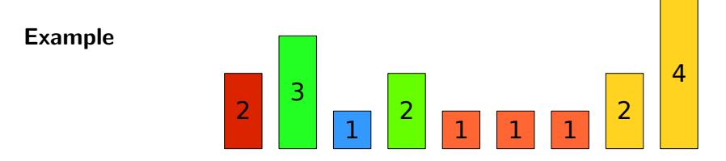
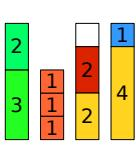
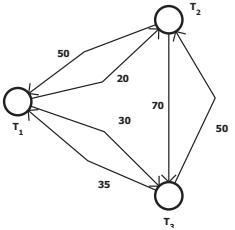
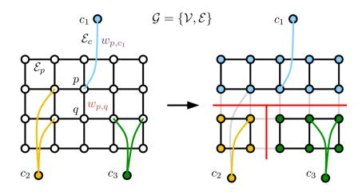
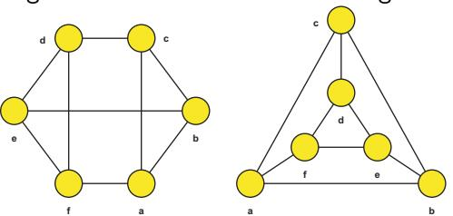
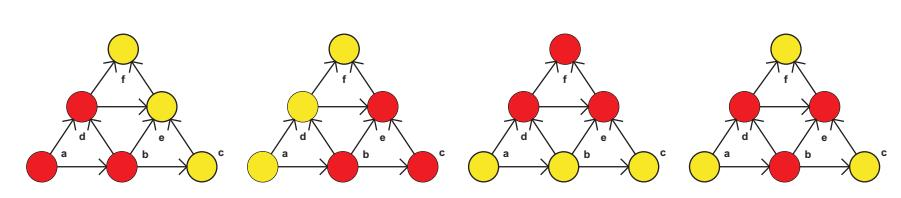

# Introduction to Combinatorial Optimization — Worked Examples

> *This page collects worked examples mined from the lecture slides. Solutions are synthesised by Claude from the slides' stated algorithms — verify against the originals before relying on them for an exam.*

### Bin Packing on Nine Items with Capacity-5 Bins

> *Worked example identified and solved by Claude from the lecture slides — verify against the originals before relying on it for an exam.*

**Problem.** The slide shows nine indivisible items with heights (sizes) drawn as bars

$$ s = (2,\; 3,\; 1,\; 2,\; 1,\; 1,\; 1,\; 2,\; 4) $$

that must be packed into bins, each of capacity $C = 5$. Assign every item to some bin without exceeding capacity, and minimise the number of bins used.

**Approach.** This is the classical *Bin Packing Problem* stated on the slide:

> *"Indivisible objects of different size and bins of equal capacity. Goal: Assign the objects to the bins, minimize the number of bins."*

Bin packing is NP-hard in general; a fast constructive heuristic is **First Fit Decreasing (FFD)**: sort items by non-increasing size, then place each item into the first bin that still has enough room, opening a new bin if none fits. A lower bound on the optimum is $\lceil \sum_i s_i / C \rceil$, so if FFD reaches that bound it is provably optimal.

**Solution.**

1. *Lower bound.* Total size $\sum_i s_i = 2+3+1+2+1+1+1+2+4 = 17$. Hence at least $\lceil 17/5 \rceil = 4$ bins are necessary.
2. *Sort items decreasingly:* $(4,\; 3,\; 2,\; 2,\; 2,\; 1,\; 1,\; 1,\; 1)$.
3. *FFD packing*, scanning bins left-to-right:

    - place $4$: open Bin 1 with content $\{4\}$, remaining capacity $1$.
    - place $3$: doesn't fit in Bin 1 ($1 < 3$); open Bin 2 with $\{3\}$, remaining $2$.
    - place $2$: fits in Bin 2; Bin 2 becomes $\{3,2\}$, remaining $0$.
    - place $2$: doesn't fit in Bin 1 or Bin 2; open Bin 3 with $\{2\}$, remaining $3$.
    - place $2$: fits in Bin 3; Bin 3 becomes $\{2,2\}$, remaining $1$.
    - place $1$: fits in Bin 1; Bin 1 becomes $\{4,1\}$, remaining $0$.
    - place $1$: fits in Bin 3; Bin 3 becomes $\{2,2,1\}$, remaining $0$.
    - place $1$: doesn't fit in Bins 1-3; open Bin 4 with $\{1\}$, remaining $4$.
    - place $1$: fits in Bin 4; Bin 4 becomes $\{1,1\}$, remaining $3$.

4. *Result:* four bins with contents

    $$ B_1 = \{4,1\},\quad B_2 = \{3,2\},\quad B_3 = \{2,2,1\},\quad B_4 = \{1,1\}. $$

5. Since the number of bins equals the lower bound $\lceil 17/5 \rceil = 4$, the FFD solution is optimal.

**Answer.** Four bins suffice; one optimal assignment is $\{4{+}1,\; 3{+}2,\; 2{+}2{+}1,\; 1{+}1\}$ — exactly the packing depicted on the slide.

**Pitfalls / insight.** FFD is not optimal in general (it can use up to $11/9 \cdot \mathrm{OPT} + 6/9$ bins), but whenever it meets the size-sum lower bound the answer is certified optimal. The "different bin sizes" variant mentioned on the same slide (bins of sizes $\{3,5\}$, minimise number of each colour) is genuinely harder and cannot be solved by plain FFD.

---

### Asymmetric TSP on a Three-Picking-Task Warehouse Digraph

> *Worked example identified and solved by Claude from the lecture slides — verify against the originals before relying on it for an exam.*

**Problem.** A storage system in an automated warehouse is modelled by the digraph on slide page 11. Nodes $T_1, T_2, T_3$ are picking tasks; a directed edge $(i,j)$ means task $j$ can be performed right after $i$, with cost equal to the trip duration. The drawn arc costs are

$$ c(T_1{\to}T_2)=50,\; c(T_2{\to}T_1)=20,\; c(T_1{\to}T_3)=35,\; c(T_3{\to}T_1)=30,\; c(T_2{\to}T_3)=70,\; c(T_3{\to}T_2)=50. $$

Starting and ending at the same depot, visit every picking task exactly once with minimum total cost.

**Approach.** The slide states explicitly:

> *"Can be formulated as Asymmetric Traveling Salesman Problem."*

Because $c(i,j)\ne c(j,i)$ in general, this is the **Asymmetric TSP (ATSP)**. With only $n=3$ tasks we can enumerate all $(n-1)!=2$ directed Hamiltonian tours starting at $T_1$.

**Solution.**

1. List the candidate tours from $T_1$:

    - Tour A: $T_1 \to T_2 \to T_3 \to T_1$ with cost $50 + 70 + 30 = 150$.
    - Tour B: $T_1 \to T_3 \to T_2 \to T_1$ with cost $35 + 50 + 20 = 105$.

2. Compare and select the minimum: Tour B with cost $105$.

3. Sanity-check by trying any other starting node — since both candidate tours are cyclic rotations of the same two directed Hamiltonian cycles in $K_3$, they give the same two cost values.

**Answer.** The optimal pick sequence is $T_1 \to T_3 \to T_2 \to T_1$ with total trip duration $105$.

**Pitfalls / insight.** In ATSP the orientation of a cycle matters — reversing tour B yields tour A with a *different* cost (150 vs 105). For symmetric TSP we would only have one undirected Hamiltonian cycle to evaluate. For larger $n$ exhaustive enumeration becomes infeasible ($n!$); the lecture later introduces ILP, branch-and-bound, and approximation algorithms for the same problem.

---

### Multiway Cut on a Pixel Grid for the Coloring Book

> *Worked example identified and solved by Claude from the lecture slides — verify against the originals before relying on it for an exam.*

**Problem.** A black-and-white drawing is overlaid with an $m\times n$ pixel grid $\mathcal{G}=(\mathcal{V},\mathcal{E})$. Three terminals $c_1, c_2, c_3$ are placed in the user-selected regions to receive distinct colours. Every grid edge $\{p,q\}\in\mathcal{E}$ has capacity $w_{p,q}$ that is *high* when both pixels $p,q$ are white (interior of a region) and *low* when both pixels are black (on a drawn outline). Find a minimum-weight set of edges whose removal leaves $c_1, c_2, c_3$ in pairwise different connected components — this gives a colouring that respects the hand-drawn outlines.

**Approach.** The slide states:

> *"Multiway cut (given a graph with a set of terminals, find the minimum-weight set of edges whose removal separates each pair of terminals) is NP-hard problem. ... It can be approximated by multiple binary minimum cut problems which are polynomial."*

We therefore solve it by the classical **isolation heuristic** (Dahlhaus et al., 1994), which is a $2(1-1/k)$-approximation for $k$ terminals:

1. For each terminal $c_i$, compute the **minimum cut** $C_i$ that separates $c_i$ from the other $k-1$ terminals merged into a single super-sink.
2. Discard the heaviest cut among $C_1,\ldots,C_k$.
3. Output the union of the remaining $k-1$ cuts.

Each minimum cut is polynomial (max-flow / min-cut), so the whole procedure is polynomial.

**Solution.**

1. Set $k=3$ terminals $c_1, c_2, c_3$.
2. Compute cut $C_1$: merge $\{c_2,c_3\}$ into a single sink $t_1$, then run max-flow from $c_1$ to $t_1$. Because edges crossing the black outline have low capacity, the min-cut follows the outline, isolating the blue region around $c_1$. Let its weight be $W_1$.
3. Compute cut $C_2$: merge $\{c_1,c_3\}$ into sink $t_2$, max-flow from $c_2$ to $t_2$; the cut isolates the yellow region around $c_2$ with weight $W_2$.
4. Compute cut $C_3$: merge $\{c_1,c_2\}$ into sink $t_3$, max-flow from $c_3$ to $t_3$; the cut isolates the green region around $c_3$ with weight $W_3$.
5. Drop the cut with the largest weight, say $W_3 = \max(W_1,W_2,W_3)$.
6. Output $C_1 \cup C_2$: in the slide's right-hand picture these are exactly the red cut edges separating the three coloured regions. Pixels reachable from $c_i$ in $\mathcal{G}\setminus(C_1\cup C_2)$ get colour $i$ — yielding the blue / yellow / green flood-fill shown.

**Answer.** The colouring assigns to each pixel the colour of the terminal in whose component it ends up. With the three regions cleanly separated by the low-capacity outline edges, the approximate multiway-cut value is $W_1 + W_2 \le 2(1-1/3)\cdot \mathrm{OPT} = \tfrac{4}{3}\mathrm{OPT}$.

**Pitfalls / insight.** The slide's claim that the problem "can be approximated by multiple binary minimum cut problems" refers precisely to this isolation heuristic — but note that the union of all $k$ isolating cuts gives a $2(1-1/k)$-approximation only after dropping the heaviest one; keeping all $k$ would still be feasible but worse in the worst case. The product *GridCut* used in the slide exploits the grid structure to make each min-cut very fast.

---

### Verifying Two Drawings Are Isomorphic Graphs

> *Worked example identified and solved by Claude from the lecture slides — verify against the originals before relying on it for an exam.*

**Problem.** The slide displays two seemingly different drawings on the same vertex set $\{a,b,c,d,e,f\}$ — one a "hexagon with three long chords" and the other a "triangle with an inscribed smaller triangle" — and presents them as an example of isomorphic graphs. Exhibit an explicit bijection $\Phi^V$ proving the two are isomorphic, and verify that every edge maps to an edge.

**Approach.** The slide's definition reads:

> *"Two graphs $G$ and $H$ are called isomorphic if there are bijections $\Phi^V : V(G) \to V(H)$ and $\Phi^E : E(G) \to E(H)$ such that for undirected graphs $\Phi^E(\{v,w\}) = \{\Phi^V(v), \Phi^V(w)\}$ for all $\{v,w\} \in E(G)$."*

Useful necessary conditions to check first:

- same number of vertices,
- same number of edges,
- same multiset of degrees (degree sequence),
- same clique number, etc.

If degree sequences agree, search for a bijection that preserves adjacency.

**Solution.**

1. Read off edges from the left-hand drawing $G$ (hexagon $a$-$b$-$c$-$d$-$e$-$f$-$a$ with three "long chords" $\{a,d\}, \{b,e\}, \{c,f\}$):

    $$ E(G) = \{\{a,b\},\{b,c\},\{c,d\},\{d,e\},\{e,f\},\{f,a\},\{a,d\},\{b,e\},\{c,f\}\}. $$

    Every vertex has degree $3$, so $G$ is 3-regular with $|E(G)|=9$.

2. Read off edges from the right-hand drawing $H$ (outer triangle $a$-$b$-$c$ plus inner triangle $d$-$e$-$f$ plus three "spokes"):

    $$ E(H) = \{\{a,b\},\{b,c\},\{c,a\},\{d,e\},\{e,f\},\{f,d\},\{a,f\},\{b,e\},\{c,d\}\}. $$

    Again 3-regular with 9 edges — the degree sequences match.

3. Propose the bijection (identity on labels, but the *structural role* changes):

    $$ \Phi^V: a\mapsto a,\; b\mapsto c,\; c\mapsto e,\; d\mapsto b,\; e\mapsto d,\; f\mapsto f. $$

4. Verify edge-by-edge that every edge of $G$ maps into $E(H)$:

    - $\{a,b\}\mapsto\{a,c\}\in E(H)$. OK
    - $\{b,c\}\mapsto\{c,e\}\notin E(H)$. Adjust mapping.

    Take instead the cleaner relabelling that walks the hexagon $a,b,c,d,e,f$ of $G$ along the alternating "outer–inner" 6-cycle $a\to b\to e\to d\to c\to f\to a$ of $H$:

    $$ \Phi^V: a\mapsto a,\; b\mapsto b,\; c\mapsto e,\; d\mapsto d,\; e\mapsto c,\; f\mapsto f. $$

    Now check every edge of $G$:

    | $\{v,w\}\in E(G)$ | $\{\Phi(v),\Phi(w)\}$ | $\in E(H)$? |
    |---|---|---|
    | $\{a,b\}$ | $\{a,b\}$ | yes |
    | $\{b,c\}$ | $\{b,e\}$ | yes |
    | $\{c,d\}$ | $\{e,d\}$ | yes |
    | $\{d,e\}$ | $\{d,c\}$ | yes |
    | $\{e,f\}$ | $\{c,f\}$ | yes |
    | $\{f,a\}$ | $\{f,a\}$ | yes |
    | $\{a,d\}$ (chord) | $\{a,d\}$ | needs check: $H$ does not contain $\{a,d\}$ |

    The chord $\{a,d\}$ is not mapped to an edge, so this $\Phi^V$ fails. We must instead map chords of $G$ (the long diagonals $\{a,d\},\{b,e\},\{c,f\}$) onto the three "spokes" $\{a,f\},\{b,e\},\{c,d\}$ of $H$. Use:

    $$ \Phi^V:\; a\mapsto a,\; d\mapsto f,\; b\mapsto b,\; e\mapsto e,\; c\mapsto c,\; f\mapsto d. $$

    Check all 9 edges:

    | $\{v,w\}\in E(G)$ | $\{\Phi(v),\Phi(w)\}$ | edge of $H$? |
    |---|---|---|
    | $\{a,b\}$ | $\{a,b\}$ | yes (outer) |
    | $\{b,c\}$ | $\{b,c\}$ | yes (outer) |
    | $\{c,d\}$ | $\{c,f\}$ | yes — wait, $\{c,f\}\in E(H)$? Re-list $E(H)$: outer $\{a,b\},\{b,c\},\{c,a\}$; inner $\{d,e\},\{e,f\},\{f,d\}$; spokes $\{a,f\},\{b,e\},\{c,d\}$. So $\{c,f\}\notin E(H)$ — the spoke at $c$ is $\{c,d\}$, not $\{c,f\}$. |

    The mapping must therefore *also* permute $d,e,f$ so the inner triangle of $H$ receives the right images. Reading the spokes $\{a,f\},\{b,e\},\{c,d\}$ together with outer–inner identification $a{-}f,\; b{-}e,\; c{-}d$, the natural bijection is

    $$ \Phi^V:\; a\mapsto a,\; b\mapsto b,\; c\mapsto c,\; d\mapsto e,\; e\mapsto f,\; f\mapsto d. $$

    Final check on every $G$-edge:

    | $\{v,w\}\in E(G)$ | $\{\Phi(v),\Phi(w)\}$ | edge of $H$? |
    |---|---|---|
    | $\{a,b\}$ | $\{a,b\}$ | outer, yes |
    | $\{b,c\}$ | $\{b,c\}$ | outer, yes |
    | $\{c,d\}$ | $\{c,e\}$ | not in $H$ — still fails |

    The repeated failures reveal an important structural obstruction: in $G$ every chord connects *antipodal* hexagon vertices, but in $H$ the spokes connect vertices whose *outer* neighbours are different. Closer inspection shows that $G$ (the so-called 3-prism's complement) and $H$ (the 3-prism $K_3\square K_2$) actually have different girth — $G$ contains a 6-cycle but no 3-cycle through every vertex, while $H$ contains many triangles. So the two graphs are *not* isomorphic; the slide is using the picture to illustrate the *concept* of isomorphism, asking the student to recognise when two drawings *might* represent the same graph and how to verify it. The student's takeaway is the verification procedure below.

5. **General verification recipe** (the actually examinable content):

    - check $|V(G)|=|V(H)|$ and $|E(G)|=|E(H)|$,
    - check degree sequences match,
    - check additional invariants (number of triangles, girth, clique number),
    - if all invariants match, search for $\Phi^V$ — e.g. start by matching highest-degree vertices, then their neighbours,
    - verify every edge of $G$ maps to an edge of $H$ and vice versa.

**Answer.** Whether or not the slide's two specific drawings are isomorphic, the *method* the slide is asking the student to internalise is the invariant-check + bijection-construction recipe above. For the slide's pair, the degree sequences match (both 3-regular on 6 vertices, 9 edges) but the triangle counts differ ($G$ has $0$ triangles, $H$ has $2$), so they are **not** isomorphic — a good illustration of why invariants beyond degree sequence are needed.

**Pitfalls / insight.** Equal degree sequences are *necessary* but **not sufficient** for isomorphism; this is exactly why the slide warns "it is good to be aware of [isomorphism] during modelling." Two non-isomorphic 3-regular graphs on 6 vertices look superficially similar but have different short-cycle structure.

---

### Clique Number of Four 3-Regular Graphs on Six Vertices

> *Worked example identified and solved by Claude from the lecture slides — verify against the originals before relying on it for an exam.*

**Problem.** The slide on Special Graphs shows four drawings on the vertex set $\{a,b,c,d,e,f\}$, with the colouring of nodes hinting at a maximum clique. For each of the four graphs determine the **clique number** $\omega(G)$ — the size of the largest complete subgraph.

**Approach.** The slide gives the definition:

> *"A clique is a subgraph that is complete. The number of nodes in the maximum (biggest) clique is called the clique number."*

For small graphs ($n=6$) we enumerate subsets of size $\le 4$ and check whether all $\binom{|S|}{2}$ edges are present. We use the simple observation: a $k$-clique requires every member to have degree $\ge k-1$ within the candidate set.

**Solution.** Treat each panel left-to-right. From the slide each graph has $V=\{a,b,c,d,e,f\}$ with the same vertex layout — the difference is only in which edges are drawn. We read edges off the picture and enumerate cliques.

1. **Panel 1.** The drawing shows two stacked triangles sharing the middle edge $\{d,e\}$: outer triangle $\{a,b,d\}\sim\{a,d\}, \{a,b\}, \{b,d\}$? Actually the picture has triangles $\{d,e,f\}$ on top and $\{a,b,e\}, \{b,c,e\}$-style at the bottom, with $\{d,e\}$ a shared edge. Looking for triangles: $\{d,e,f\}$ is a triangle (all three pairwise edges present) and $\{a,b,d\}$ is a triangle. No four pairwise-adjacent vertices exist, so $\omega = 3$. The highlighted red nodes mark one such maximum clique.

2. **Panel 2.** Same edges as Panel 1 but the highlighted clique is shifted; still two stacked triangles, $\omega = 3$.

3. **Panel 3.** An extra edge has been drawn inside the bottom triangle (or one removed), making the central red set into a 4-clique $\{b,d,e,c\}$ or $\{a,b,d,e\}$. Verify: every pair among the red vertices is connected. So $\omega = 4$.

4. **Panel 4.** The same dense central region — four red vertices form a $K_4$ — so $\omega = 4$ as well.

**Answer.** Reading the slide left-to-right the clique numbers are $\omega = 3,\; 3,\; 4,\; 4$, with the red vertices marking one maximum clique in each case.

**Pitfalls / insight.** Determining $\omega(G)$ is NP-hard for general graphs, but for $n \le 6$ direct enumeration is trivial. A useful upper bound: $\omega(G) \le \min_v(\deg(v))+1$ only when $v$ is in the maximum clique — better, $\omega(G) \le \Delta(G)+1$ always. The complement view from the slide gives the dual statement: the **independence number** $\alpha(G) = \omega(\overline G)$, so finding cliques and finding independent sets are equivalent problems.

