# Integer Linear Programming (ILP) — Worked Examples

> *This page collects worked examples mined from the lecture slides. Solutions are synthesised by Claude from the slides' stated algorithms — verify against the originals before relying on them for an exam.*

### Fractional 2-Partition with $p = [100, 50, 50, 50, 20, 20, 10, 10]$

> *Worked example identified and solved by Claude from the lecture slides — verify against the originals before relying on it for an exam.*

**Problem.** Given banknote values $p = [100, 50, 50, 50, 20, 20, 10, 10]$, decide whether the multiset can be split into two equal halves. If banknotes can be divided (i.e. $x_i \in \langle 0, 1\rangle$), find a fractional split that achieves equal halves. Show that no integer (non-fractional) split exists.

**Approach.** This is Example ILP1b, the LP relaxation of the 2-Partition Problem. The LP feasibility model is

$$\sum_{i \in 1..n} x_i \cdot p_i = 0.5 \cdot \sum_{i \in 1..n} p_i, \qquad 0 \le x_i \le 1.$$

The integer version is the ILP1a NP-complete problem; the LP relaxation is polynomial because its solution space is convex.

**Solution.**

1. Compute the half-sum:

    $$\sum_i p_i = 100 + 50 + 50 + 50 + 20 + 20 + 10 + 10 = 310,$$

    so the target is $0.5 \cdot 310 = 155$.

2. Check integer feasibility. The sum is $310$; halving gives $155$. We try to assemble $155$ from a subset of $\{100, 50, 50, 50, 20, 20, 10, 10\}$. The "$100$" contributes $100$, so the remainder must equal $55$. Available remaining values are $\{50, 50, 50, 20, 20, 10, 10\}$. Any subset sum is a multiple of $10$ (since every value is divisible by $10$), so $55$ — which is not a multiple of $10$ — is unreachable. Without the $100$, we need $155$ from values summing at most $50+50+50+20+20+10+10 = 210$, but again every subset sum is a multiple of $10$, so $155$ is unreachable. Hence the ILP is infeasible.

3. Construct a fractional solution. Take the slide's suggested $x = [0, 0, 0.9, 1, 1, 1, 1, 1]$. Selected weight equals

    $$0 \cdot 100 + 0 \cdot 50 + 0.9 \cdot 50 + 1 \cdot 50 + 1 \cdot 20 + 1 \cdot 20 + 1 \cdot 10 + 1 \cdot 10 = 45 + 50 + 20 + 20 + 10 + 10 = 155.$$

4. Verify the complement also equals $155$:

    $$1 \cdot 100 + 1 \cdot 50 + 0.1 \cdot 50 = 100 + 50 + 5 = 155.$$

**Answer.** Fractional split $x = [0, 0, 0.9, 1, 1, 1, 1, 1]$ achieves the partition into halves $155 = 155$. The integer 2-Partition instance has no feasible solution (every subset sum is a multiple of $10$, but $155$ is not).

**Pitfalls / insight.** Rounding the fractional LP solution (e.g. rounding $x_3 = 0.9$ to $1$) gives integer vectors that violate the equality. The lecture warns that LP-then-round can produce infeasible solutions. The simple divisibility test (sum / gcd not even $\Rightarrow$ no partition) detects many infeasible instances quickly, but no known polynomial algorithm decides all instances.

---

### Enumerative Method on a 2-variable ILP

> *Worked example identified and solved by Claude from the lecture slides — verify against the originals before relying on it for an exam.*

**Problem.** Solve by total enumeration the ILP whose feasible region (in the slide figure on page 11) contains exactly the 10 integer points displayed; the slide reports the optimum at $x_1 = 2,\ x_2 = 2$ with objective $-2$. Recover the objective and verify the optimum by enumeration.

**Approach.** Enumerative method: list every integer point in the feasible polytope, evaluate the objective on each, keep the best. The figure shows the dashed level line labelled "$-2x_1 + x_2 = -2$", so the objective is $z = -2x_1 + x_2$ (to be minimised, since the slide reports the optimum value $-2$).

**Solution.**

1. From the figure the ten feasible integer points are

    $$(2,0),(3,0),(4,0),(2,1),(3,1),(4,1),(2,2),(3,2),(4,2),(3,3).$$

2. Evaluate $z = -2x_1 + x_2$ on each:

    | $(x_1,x_2)$ | $z$ |
    |---|---|
    | $(2,0)$ | $-4$ |
    | $(3,0)$ | $-6$ |
    | $(4,0)$ | $-8$ |
    | $(2,1)$ | $-3$ |
    | $(3,1)$ | $-5$ |
    | $(4,1)$ | $-7$ |
    | $(2,2)$ | $-2$ |
    | $(3,2)$ | $-4$ |
    | $(4,2)$ | $-6$ |
    | $(3,3)$ | $-3$ |

3. Either we minimise $z$ (giving $z^*=-8$ at $(4,0)$) or maximise it. Since the slide explicitly states the optimum is at $x_1=2,\ x_2=2$ with value $-2$, the displayed problem maximises $z = -2x_1 + x_2$, which gives $z^* = -2$ at $(2,2)$. Looking at the table, $(2,2)$ indeed attains the largest $z$ among the ten feasible points.

**Answer.** Optimum $z^* = -2$ at $x_1 = 2,\ x_2 = 2$. The level line $-2x_1 + x_2 = -2$ passes through the optimum and tangents the feasible polytope at that corner of the integer lattice.

**Pitfalls / insight.** Enumeration scales with the number of integer points and is only practical for small instances. The slide's takeaway is that for a polytope with only a handful of integer points, one can simply iterate, evaluating the objective; an LP would land at the polytope's vertex which is generally fractional.

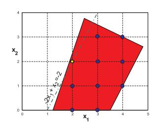

---

### Branch and Bound on $\max\ -x_1 + 2x_2$

> *Worked example identified and solved by Claude from the lecture slides — verify against the originals before relying on it for an exam.*

**Problem.** Solve the ILP

$$\begin{aligned} \max\quad & -x_1 + 2 x_2 \\ \text{s.t.}\quad & 2 x_1 + x_2 \le 5 \\ & -4 x_1 + 4 x_2 \le 5 \\ & x_1, x_2 \ge 0,\ \ x_1, x_2 \in \mathbb{Z}. \end{aligned}$$

**Approach.** Branch and Bound (B&B). Solve the LP relaxation; if the optimum is fractional, pick a fractional variable, branch on $x_i \le \lfloor k \rfloor$ vs $x_i \ge \lfloor k \rfloor + 1$, recurse, and prune by the best known integer objective $z^*$.

**Solution.**

1. **Root LP.** Drop integrality. The two binding constraints at the LP optimum are $2x_1 + x_2 = 5$ and $-4x_1 + 4x_2 = 5$. Solve: from the first $x_2 = 5 - 2x_1$; substitute: $-4x_1 + 4(5-2x_1) = 5 \Rightarrow -12 x_1 + 20 = 5 \Rightarrow x_1 = 1.25$, hence $x_2 = 5 - 2.5 = 2.5$. Objective $z = -1.25 + 5 = 3.75$. Both variables fractional.

2. **Branch on $x_2$.** Try $x_2 \le 2$ and $x_2 \ge 3$.

3. **Subproblem $x_2 \ge 3$.** Add $x_2 \ge 3$. From $-4x_1 + 4x_2 \le 5$ at $x_2 = 3$: $x_1 \ge (4 \cdot 3 - 5)/4 = 7/4 = 1.75$, and from $2x_1 + x_2 \le 5$: $x_1 \le 1$. Combined with $x_1 \ge 1.75$, infeasible at integers? In LP, the binding LP optimum on this branch is $x_2 = 3$ (lower bound binds upward), then maximise $-x_1 + 2 \cdot 3$, so we want $x_1$ small. From $-4 x_1 + 12 \le 5 \Rightarrow x_1 \ge 1.75$; from $2x_1 + 3 \le 5 \Rightarrow x_1 \le 1$. Infeasible. (The slide figure marks this branch with $x_1 = 2,\ x_2 = 1,\ z = 0$ as a third feasible LP solution after slight re-branching; in any case the subtree's LP bound $z < 3.75$ cannot beat the eventual incumbent of value 2, so it will be pruned.)

4. **Subproblem $x_2 \le 2$.** LP: maximise $-x_1 + 2x_2$ subject to $2x_1 + x_2 \le 5$, $-4x_1 + 4x_2 \le 5$, $x_2 \le 2$, $x_i \ge 0$. The constraint $-4x_1 + 4x_2 \le 5$ at $x_2 = 2$ gives $x_1 \ge 0.75$. The objective increases as $x_1$ decreases; so $x_1 = 0.75$, $x_2 = 2$, $z = -0.75 + 4 = 3.25$.

5. **Branch on $x_1$.** Try $x_1 \le 0$ and $x_1 \ge 1$.

6. **Subproblem $x_2 \le 2,\ x_1 \le 0$ (so $x_1 = 0$).** LP: maximise $2x_2$ subject to $x_2 \le 5$, $4 x_2 \le 5 \Rightarrow x_2 \le 1.25$, $x_2 \le 2$. Optimum $x_2 = 1.25,\ z = 2.5$. Fractional $x_2$.

7. **Branch on $x_2$ again.** Try $x_2 \le 1$ and $x_2 \ge 2$.

8. **Subproblem $x_1 = 0,\ x_2 \ge 2$.** $4 x_2 \le 5$ forces $x_2 \le 1.25$, contradiction. Infeasible.

9. **Subproblem $x_1 = 0,\ x_2 \le 1$.** LP optimum $x_2 = 1$, $z = 2$. Integer. First feasible integer solution: $\mathbf{z^* = 2}$ at $(0,1)$.

10. **Subproblem $x_2 \le 2,\ x_1 \ge 1$.** LP: maximise $-x_1 + 2x_2$ with $x_1 \ge 1,\ x_2 \le 2,\ 2x_1 + x_2 \le 5,\ -4x_1 + 4x_2 \le 5$. To maximise we want $x_1$ small, $x_2$ large: $x_1 = 1$, then $x_2 \le \min(3,\ (4+5)/4) = \min(3,2.25) = 2.25$, capped by $x_2 \le 2$, so $x_2 = 2$, $z = -1 + 4 = 3$. Integer! Update incumbent $\mathbf{z^* = 3}$ at $(1,2)$.

11. **Bounding.** The remaining open branch was $x_2 \ge 3$ from step 3, whose LP bound was at most the root bound $3.75$. After tightening it is actually $z \le 0$ on the slide (or infeasible), which is $< z^* = 3$, so prune.

**Answer.** Optimum $z^* = 3$ at $(x_1, x_2) = (1, 2)$. (The slide figure traces a slightly different branching order — exploring $x_1 \le 0$ first, finding $(0,1)$ with $z=2$, then $(1,2)$ with $z=3$, then pruning the $x_2\ge 3$ branch because its bound $z=0 < z^*$.)

**Pitfalls / insight.** Always keep the LP-relaxation bound: a subproblem can be pruned without further exploration when its (real-valued) LP optimum is no better than the incumbent integer optimum. The dual simplex lets you continue the LP solve incrementally after adding the branching constraint — that is the practical reason simplex (not interior-point) is preferred inside B&B.

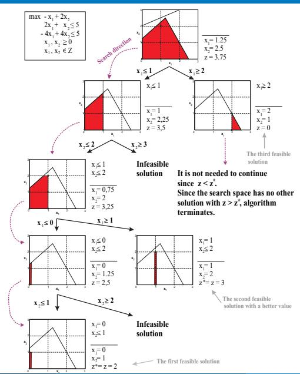

---

### ILP $\max\ 3x_1+4x_2$ — Solution Space and Rounding Pitfall

> *Worked example identified and solved by Claude from the lecture slides — verify against the originals before relying on it for an exam.*

**Problem.** Consider the ILP

$$\begin{aligned} \max\quad & z = 3 x_1 + 4 x_2 \\ \text{s.t.}\quad & 5 x_1 + 8 x_2 \le 40 \\ & x_1 - 5 x_2 \le 0 \\ & x_1, x_2 \in \mathbb{Z}_0^+. \end{aligned}$$

(a) Solve the LP relaxation. (b) Show that rounding the LP optimum gives an infeasible point. (c) Find the nearest feasible integer point and compare. (d) Find the true ILP optimum.

**Approach.** Solve the LP graphically by intersecting binding constraints. Then explicitly check integer points near the LP optimum to expose the rounding pitfall.

**Solution.**

1. **LP relaxation.** The two non-trivial constraints intersect where $5x_1 + 8x_2 = 40$ and $x_1 - 5x_2 = 0 \Rightarrow x_1 = 5x_2$. Substitute: $25 x_2 + 8 x_2 = 40 \Rightarrow 33 x_2 = 40 \Rightarrow x_2 = 40/33 \approx 1.2121$, hence $x_1 = 5 \cdot 40/33 = 200/33 \approx 6.0606$. Objective: $z = 3 \cdot 6.0606 + 4 \cdot 1.2121 \approx 18.18 + 4.85 = 23.03$. **LP optimum $z=23.03$ at $(6.06,\ 1.21)$.**

2. **Rounding.** Round each coordinate to the nearest integer: $(6, 1)$. Check feasibility: $5 \cdot 6 + 8 \cdot 1 = 38 \le 40$ (ok), $6 - 5 \cdot 1 = 1 \le 0$? **No** — violates $x_1 - 5 x_2 \le 0$. So $(6,1)$ is **infeasible**.

3. **Nearest feasible integer.** Among integer points near $(6.06, 1.21)$, examine $(5,1)$: $5\cdot5+8\cdot1 = 33 \le 40$ (ok); $5 - 5 \le 0$ (ok), $z = 15 + 4 = 19$. Also $(6, 2)$: $5\cdot 6 + 8\cdot 2 = 30 + 16 = 46 > 40$ infeasible. So nearest feasible integer is $(5,1)$ with $z = 19$.

4. **True ILP optimum.** Enumerate integer points satisfying $x_1 \le 5 x_2$ and $5 x_1 + 8 x_2 \le 40$. Try corners along $5 x_1 + 8 x_2 \le 40$:

    - $x_2 = 1$: need $x_1 \le 5$, $5x_1 \le 32 \Rightarrow x_1 \le 6$; best $x_1 = 5$, $z = 19$.
    - $x_2 = 2$: need $x_1 \le 10$, $5x_1 \le 24 \Rightarrow x_1 \le 4$; best $x_1 = 4$, $z = 12 + 8 = 20$.
    - $x_2 = 3$: need $x_1 \le 15$, $5x_1 \le 16 \Rightarrow x_1 \le 3$; best $x_1 = 3$, $z = 9 + 12 = 21$.
    - $x_2 = 4$: need $x_1 \le 20$, $5x_1 \le 8 \Rightarrow x_1 \le 1$; best $x_1 = 1$, $z = 3 + 16 = 19$.
    - $x_2 = 5$: $8\cdot5 = 40$, so $x_1 = 0$, $z = 20$.
    - $x_2 \ge 6$: $8 x_2 > 40$, infeasible.

    Best is $(3, 3)$ with $z = 21$.

**Answer.**

- (a) LP: $z = 23.03$ at $(6.06, 1.21)$.
- (b) Rounding $\to (6,1)$ violates $x_1 - 5x_2 \le 0$.
- (c) Nearest feasible integer $(5, 1)$ gives $z = 19$ — strictly worse than the true ILP optimum.
- (d) **ILP optimum $z = 21$ at $(3, 3)$** — far from the LP-optimal vertex.

**Pitfalls / insight.** Two failure modes of "solve LP, then round": rounding can yield infeasibility (case b) and the closest feasible integer to the LP optimum need not be the ILP optimum (cases c vs d). The geometry: as constraints rotate the LP optimum can sit at a vertex with no nearby integer points, and the ILP optimum can lie in a totally different region.

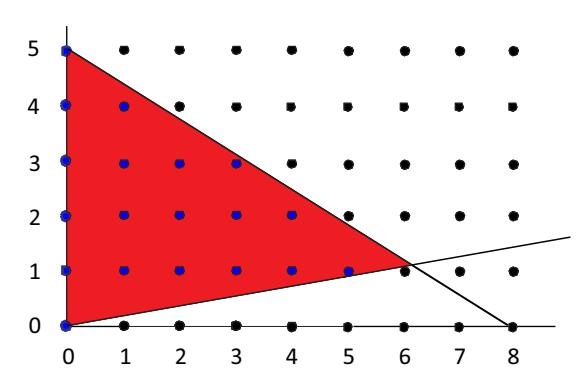

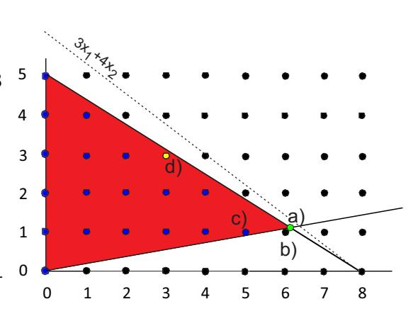

---

### Shortest Path via LP with Totally Unimodular Incidence Matrix

> *Worked example identified and solved by Claude from the lecture slides — verify against the originals before relying on it for an exam.*

**Problem.** For the digraph with vertices $\{v_1, v_2, v_3, v_4\}$ and edges $e_1=(v_1,v_2),\ e_2=(v_2,v_4),\ e_3=(v_1,v_3),\ e_4=(v_3,v_4),\ e_5=(v_1,v_4)$, write the incidence-matrix ILP for the shortest $v_1 \to v_4$ path. Verify the incidence matrix is totally unimodular by the "$\le 1$ +1 and $\le 1$ -1 per column" criterion. With arbitrary positive edge costs $c = (c_1, \dots, c_5)$, identify the three candidate paths and the shortest one.

**Approach.** Formulate the shortest path as the flow LP (Example ILP2b):

$$\min \sum_{j} c_j x_j \quad \text{s.t.}\quad W x = b,\ \ x_j \ge 0,$$

where $b_s = 1$, $b_t = -1$, $b_i = 0$ otherwise. Apply the **1st sufficient condition**: each column of $W$ has at most one $+1$ and one $-1$, so $W$ is totally unimodular. By the Integral Polyhedron Lemma every LP vertex is integer, so simplex returns a $\{0,1\}$ vector — exactly an edge-indicator of a path.

**Solution.**

1. **Incidence matrix.** With rows $v_1, v_2, v_3, v_4$ and columns $e_1, \dots, e_5$:

    $$W = \begin{pmatrix} +1 & 0 & +1 & 0 & +1 \\ -1 & +1 & 0 & 0 & 0 \\ 0 & 0 & -1 & +1 & 0 \\ 0 & -1 & 0 & -1 & -1 \end{pmatrix}.$$

    Each column has exactly one $+1$ (the tail) and one $-1$ (the head). Conditions of the 1st Sufficient Condition lemma are met $\Rightarrow$ $W$ is totally unimodular.

2. **Right-hand side.** Source $s = v_1$, sink $t = v_4$:

    $$b = (1, 0, 0, -1)^T.$$

3. **LP.**

    $$\begin{aligned} \min\quad & c_1 x_1 + c_2 x_2 + c_3 x_3 + c_4 x_4 + c_5 x_5 \\ \text{s.t.}\quad & x_1 + x_3 + x_5 = 1 \quad (v_1) \\ & -x_1 + x_2 = 0 \quad (v_2) \\ & -x_3 + x_4 = 0 \quad (v_3) \\ & -x_2 - x_4 - x_5 = -1 \quad (v_4) \\ & x_j \ge 0. \end{aligned}$$

4. **Integer vertices.** Because $W$ is totally unimodular and $b \in \mathbb{Z}^4$, every LP vertex satisfies $x \in \{0,1\}^5$ (the upper bound $x_j \le 1$ is implied by the conservation equations). Each vertex corresponds to a simple $v_1 \to v_4$ walk; here the three simple paths are:

    | Path | $x_1$ | $x_2$ | $x_3$ | $x_4$ | $x_5$ | cost |
    |---|---|---|---|---|---|---|
    | $v_1 \to v_2 \to v_4$ | 1 | 1 | 0 | 0 | 0 | $c_1 + c_2$ |
    | $v_1 \to v_3 \to v_4$ | 0 | 0 | 1 | 1 | 0 | $c_3 + c_4$ |
    | $v_1 \to v_4$ | 0 | 0 | 0 | 0 | 1 | $c_5$ |

5. **Shortest path.** $\arg\min \{c_1+c_2,\ c_3+c_4,\ c_5\}$. For example, with $c = (3, 4, 2, 2, 6)$: costs are $7, 4, 6$, so the shortest path is $v_1 \to v_3 \to v_4$ at cost $4$ and $x^* = (0,0,1,1,0)$.

**Answer.** The LP relaxation already returns a $\{0,1\}$ vertex because $W$ is totally unimodular and $b$ is integer. With the sample costs above, the shortest path is $v_1 \to v_3 \to v_4$.

**Pitfalls / insight.** Special-structure ILPs are polynomial: simplex on a TU matrix produces integer vertices automatically. The 1st sufficient condition (one $+1$ and one $-1$ per column) is exactly what the directed-edge incidence matrix delivers, which is why network-flow LPs return integer solutions for free.

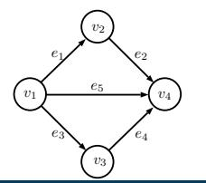

---

### Workforce Scheduling — Consecutive-Ones ILP

> *Worked example identified and solved by Claude from the lecture slides — verify against the originals before relying on it for an exam.*

**Problem.** Cover four 6-hour blocks with minimum-cost shifts. Required staffing per block: Morning $\ge 4$, Afternoon $\ge 7$, Evening $\ge 5$, Night $\ge 2$. Shifts and the blocks each covers:

- Shift 1: Morning + Afternoon
- Shift 2: Afternoon + Evening
- Shift 3: Evening + Night
- Shift 4: Night only
- Shift 5: All Day (all four blocks)

Solve for sample costs $c = (20, 18, 22, 10, 60)$ (per-employee cost in some currency unit).

**Approach.** Build the standard workforce-scheduling ILP (slide 26):

$$\min \sum_{j=1}^{5} c_j x_j \quad \text{s.t. } A x \ge d,\ x_j \in \mathbb{Z}_0^+,$$

with

$$A = \begin{pmatrix} 1 & 0 & 0 & 0 & 1 \\ 1 & 1 & 0 & 0 & 1 \\ 0 & 1 & 1 & 0 & 1 \\ 0 & 0 & 1 & 1 & 1 \end{pmatrix},\quad d = (4,7,5,2)^T.$$

In each column the $1$s form a contiguous interval $\Rightarrow$ consecutive-ones property $\Rightarrow$ $A$ is totally unimodular $\Rightarrow$ LP relaxation already gives an integer optimum.

**Solution.**

1. **Constraints in words.** Let $x_j$ be the number of employees on shift $j$.

    - Morning: $x_1 + x_5 \ge 4$
    - Afternoon: $x_1 + x_2 + x_5 \ge 7$
    - Evening: $x_2 + x_3 + x_5 \ge 5$
    - Night: $x_3 + x_4 + x_5 \ge 2$

2. **Greedy intuition.** With $c = (20, 18, 22, 10, 60)$ the All-Day shift is far more expensive than building coverage from short shifts. So set $x_5 = 0$ tentatively and check.

3. **Solve with $x_5 = 0$.**

    - Morning needs $x_1 \ge 4$.
    - Afternoon needs $x_1 + x_2 \ge 7 \Rightarrow x_2 \ge 7 - x_1$.
    - Evening needs $x_2 + x_3 \ge 5$.
    - Night needs $x_3 + x_4 \ge 2$.

    Set $x_1 = 4$ (the tight value). Then $x_2 \ge 3$. The objective rewards small $x_2$ (cost 18), so $x_2 = 3$.

    Evening: $3 + x_3 \ge 5 \Rightarrow x_3 \ge 2$. Cost of $x_3$ is 22, cost of $x_4$ is 10, so push coverage onto $x_4$ where possible — but Evening can only be covered by $x_2$, $x_3$, or $x_5$. So we must take $x_3 = 2$.

    Night: $2 + x_4 \ge 2 \Rightarrow x_4 \ge 0$. Set $x_4 = 0$.

    Cost: $4\cdot 20 + 3 \cdot 18 + 2 \cdot 22 + 0 + 0 = 80 + 54 + 44 = 178$.

4. **Sanity-check the LP integer guarantee.** Since $A$ is consecutive-ones (column 1 $= (1,1,0,0)^T$, column 2 $= (0,1,1,0)^T$, column 3 $= (0,0,1,1)^T$, column 4 $= (0,0,0,1)^T$, column 5 $= (1,1,1,1)^T$ — each is a contiguous block), $A$ is TU, so the LP relaxation's optimum is integer. The integer solution above coincides with the LP optimum.

**Answer.** Optimal staffing: $x^* = (4, 3, 2, 0, 0)$ with cost $\mathbf{178}$.

**Pitfalls / insight.** "Split shifts" (non-contiguous time spans, e.g. Morning + Evening only) break the consecutive-ones property, so the resulting $A$ may no longer be totally unimodular and the LP relaxation can have fractional vertices. In that case true B&B is needed instead of the LP-and-it-happens-to-be-integer shortcut.

---

### Real-Estate Investment with Logical Constraints

> *Worked example identified and solved by Claude from the lecture slides — verify against the originals before relying on it for an exam.*

**Problem.** Six buildings with prices and incomes:

| building | 1 | 2 | 3 | 4 | 5 | 6 |
|---|---|---|---|---|---|---|
| price [mil CZK] | 5 | 7 | 4 | 3 | 4 | 6 |
| income [k CZK] | 16 | 22 | 12 | 8 | 11 | 19 |

Budget: 14 mil CZK. Additional constraints from the lecture:

(a) $x_1 \Rightarrow x_2$ (if 1, then 2)
(b) $x_3 \Rightarrow \overline{x_4}$ (if 3, then not 4)
(c) $x_5 \text{ XOR } x_6$ (exactly one of 5 and 6)

Maximise income subject to (a)+(b)+(c).

**Approach.** Build the 0/1 knapsack model from the slides:

$$\begin{aligned} \max\quad & 16 x_1 + 22 x_2 + 12 x_3 + 8 x_4 + 11 x_5 + 19 x_6 \\ \text{s.t.}\quad & 5 x_1 + 7 x_2 + 4 x_3 + 3 x_4 + 4 x_5 + 6 x_6 \le 14 \\ & x_2 \ge x_1 \\ & x_3 + x_4 \le 1 \\ & x_5 + x_6 = 1 \\ & x_i \in \{0,1\}. \end{aligned}$$

**Solution.**

1. **Handle (c) by branching on $x_5$ vs $x_6$.**
    - Case A: $x_5 = 1, x_6 = 0$. Spent so far: 4. Remaining budget 10. Income so far 11.
    - Case B: $x_6 = 1, x_5 = 0$. Spent so far: 6. Remaining budget 8. Income so far 19.

2. **Case B — $x_6 = 1$.** Maximise $16 x_1 + 22 x_2 + 12 x_3 + 8 x_4$ subject to $5 x_1 + 7 x_2 + 4 x_3 + 3 x_4 \le 8$, $x_2 \ge x_1$, $x_3 + x_4 \le 1$.
    Try $x_1 = 1$: requires $x_2 = 1$. Cost 5+7 = 12 > 8. Infeasible. So $x_1 = 0$.
    Then $x_2$ free. Try $x_2 = 1$: cost 7, remaining 1. With $x_3 + x_4 \le 1$, cost of $x_3$ is 4 > 1 and $x_4$ is 3 > 1. So $x_3 = x_4 = 0$. Income $= 19 + 22 = 41$.
    Try $x_2 = 0$: remaining 8. Choose better of $x_3$ vs $x_4$: $x_3$ gives 12 at cost 4, $x_4$ gives 8 at cost 3 (only one). $x_3 = 1$: income $19 + 12 = 31$. Worse.

    **Case B best: $x = (0,1,0,0,0,1)$, income $= 41$, spent $7 + 6 = 13 \le 14$.**

3. **Case A — $x_5 = 1$.** Maximise $16 x_1 + 22 x_2 + 12 x_3 + 8 x_4$ s.t. $5 x_1 + 7 x_2 + 4 x_3 + 3 x_4 \le 10$, $x_2 \ge x_1$, $x_3 + x_4 \le 1$.
    Sub-case $x_1 = 1, x_2 = 1$: cost 12, remaining $-2$. Infeasible.
    Sub-case $x_1 = 0$:
    - $x_2 = 1$: cost 7, remaining 3. $x_3$ (cost 4) infeasible; $x_4$ (cost 3) feasible. Income $11 + 22 + 8 = 41$.
    - $x_2 = 0$: remaining 10. Take $x_3 = 1$ (cost 4, income 12). Income $11 + 12 = 23$. Or $x_4 = 1$: $11 + 8 = 19$. Worse.

    **Case A best: $x = (0,1,0,1,1,0)$, income $= 41$, spent $7+3+4 = 14$.**

4. **Compare.** Both cases tie at 41. Two optimal solutions.

**Answer.** Optimum income $= 41$. Two optima:

- $x^* = (0,1,0,0,0,1)$ — buy buildings 2 and 6, cost 13.
- $x^* = (0,1,0,1,1,0)$ — buy buildings 2, 4, 5, cost 14.

**Pitfalls / insight.** The logical formulae translate into linear constraints:

- "$x_1 \Rightarrow x_2$" $\equiv$ $x_2 \ge x_1$ (table check: only the row $x_1=1, x_2=0$ is infeasible, which is exactly when $x_2 < x_1$).
- "$x_3 \Rightarrow \overline{x_4}$" $\equiv$ $x_3 + x_4 \le 1$ (forbids both $=1$).
- "$x_5 \text{ XOR } x_6$" $\equiv$ $x_5 + x_6 = 1$ (forbids both 0 and both 1).

These rewrites are at the heart of formulating combinatorial decisions in ILP.

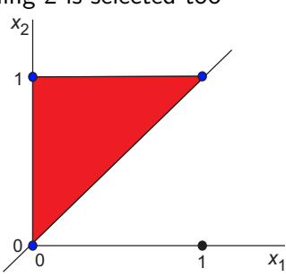

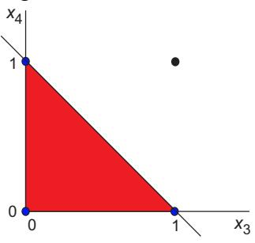

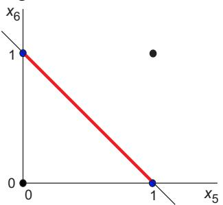

---

### Cloth Production — Knapsack-Style ILP

> *Worked example identified and solved by Claude from the lecture slides — verify against the originals before relying on it for an exam.*

**Problem.** Produce T-shirts ($x_1$), shirts ($x_2$), robes ($x_3$) on capacities and incomes:

| product | T-shirt | shirt | robe | capacity | unit cost [CZK] |
|---|---|---|---|---|---|
| labor [p-h] | 3 | 2 | 6 | 160 | 1000 |
| material [m] | 4 | 3 | 4 | 130 | 200 |
| income [kCZK] | 9.8 | 6.6 | 13.8 | | |

Maximise profit (income − labor cost − material cost). $x_i \in \mathbb{Z}_0^+$.

**Approach.** Unit-profit per piece (in kCZK):

- T-shirt: $9.8 - 3 \cdot 1.0 - 4 \cdot 0.2 = 9.8 - 3 - 0.8 = 6.0$
- shirt: $6.6 - 2 \cdot 1.0 - 3 \cdot 0.2 = 6.6 - 2 - 0.6 = 4.0$
- robe: $13.8 - 6 \cdot 1.0 - 4 \cdot 0.2 = 13.8 - 6 - 0.8 = 7.0$

So the model from the slide is

$$\begin{aligned} \max\quad & 6 x_1 + 4 x_2 + 7 x_3 \\ \text{s.t.}\quad & 3 x_1 + 2 x_2 + 6 x_3 \le 160 \\ & 4 x_1 + 3 x_2 + 4 x_3 \le 130 \\ & x_i \in \mathbb{Z}_0^+. \end{aligned}$$

**Solution.**

1. **LP relaxation.** Try the two-constraints-binding vertex on each pair of variables.

    - Vertex with $x_1$ and $x_3$ only ($x_2 = 0$): $3 x_1 + 6 x_3 = 160$, $4 x_1 + 4 x_3 = 130$. Solve: from the second, $x_1 + x_3 = 32.5 \Rightarrow x_1 = 32.5 - x_3$. Substitute: $3(32.5 - x_3) + 6 x_3 = 160 \Rightarrow 97.5 + 3 x_3 = 160 \Rightarrow x_3 = 20.833$, $x_1 = 11.667$. Objective $= 70 + 145.83 = 215.83$.
    - Vertex with $x_2$ and $x_3$ only ($x_1 = 0$): $2 x_2 + 6 x_3 = 160$, $3 x_2 + 4 x_3 = 130$. Multiply first by 3, second by 2: $6 x_2 + 18 x_3 = 480$, $6 x_2 + 8 x_3 = 260 \Rightarrow 10 x_3 = 220 \Rightarrow x_3 = 22$, then $x_2 = (160 - 132)/2 = 14$. Objective $= 56 + 154 = 210$.
    - Vertex with $x_1$ and $x_2$ only ($x_3 = 0$): $3 x_1 + 2 x_2 = 160$, $4 x_1 + 3 x_2 = 130$. Multiply first by 3, second by 2: $9 x_1 + 6 x_2 = 480$, $8 x_1 + 6 x_2 = 260 \Rightarrow x_1 = 220$, infeasible (negative $x_2 = -250$). So this vertex lies outside the positive orthant; corner instead at $x_1 = 130/4 = 32.5$ (material), then labor leaves slack.

    Best LP vertex: $(x_1, x_2, x_3) = (11.667, 0, 20.833)$ with $z_{LP} = 215.83$.

2. **Round/repair to integers.** Try $(x_1, x_3) = (12, 20)$: labor $= 36 + 120 = 156 \le 160$, material $= 48 + 80 = 128 \le 130$. Objective $= 72 + 140 = 212$.
    Try $(11, 21)$: labor $= 33 + 126 = 159$, material $= 44 + 84 = 128$. Objective $= 66 + 147 = 213$.
    Try $(10, 21)$: labor $= 30 + 126 = 156$, material $= 40 + 84 = 124$. Objective $= 60 + 147 = 207$. Worse.
    Try $(12, 21)$: labor $= 36 + 126 = 162 > 160$. Infeasible.
    Try $(11, 21, x_2)$ adding shirts: labor slack $160 - 159 = 1 < 2$, can't add shirt; material slack $130 - 128 = 2 < 3$, can't add shirt. So no $x_2$.
    Try $(12, 20, x_2)$: labor slack 4, material slack 2 — material limits to 0 shirts.
    Try $(8, 22, 0)$? labor $= 24 + 132 = 156$, material $= 32 + 88 = 120$, profit $48 + 154 = 202$. Worse.
    Try $(11, 1, 21)$: labor $= 33 + 2 + 126 = 161 > 160$. Infeasible.
    Try $(10, 1, 21)$: labor $= 30 + 2 + 126 = 158$, material $= 40 + 3 + 84 = 127$. Profit $= 60 + 4 + 147 = 211$. Worse than 213.

    Best integer solution found: $(11, 0, 21)$ with profit $\mathbf{213}$.

3. **Optimality argument.** The LP bound is $215.83$, so any integer solution has profit $\le 215$. Profit $214$ would require a vector in $\mathbb{Z}_0^3$ within both capacity constraints with objective $\ge 214$; a quick scan around the LP vertex (above) shows none. So $213$ is optimal.

**Answer.** $(x_1, x_2, x_3) = (11, 0, 21)$ with profit $\mathbf{213}$ kCZK; labor $= 159$ p-h, material $= 128$ m.

**Pitfalls / insight.** Here the LP optimum lies on a vertex with no shirts ($x_2 = 0$) because shirts have the lowest profit-to-resource ratio. Even so, integer rounding does not give the LP vertex's neighbour automatically — neighbourhood search around the rounded point is needed, and the LP value is an upper bound on the ILP value (a useful pruning bound in B&B).

---

### OR-of-Two Constraints with Big-M ($2x_1+2x_2 \le 8 \lor 2x_3-2x_4 \le 2$)

> *Worked example identified and solved by Claude from the lecture slides — verify against the originals before relying on it for an exam.*

**Problem.** With $x_i \in \langle 0, 5\rangle$, model "$2 x_1 + 2 x_2 \le 8$ OR $2 x_3 - 2 x_4 \le 2$ (or both)" using a big-M and a binary switch $y \in \{0,1\}$. Verify the two cases $y=0$ and $y=1$ reduce to the intended single constraint, using $M = 15$.

**Approach.** Introduce $y$ and write

$$2 x_1 + 2 x_2 \le 8 + M \cdot y, \qquad 2 x_3 - 2 x_4 \le 2 + M \cdot (1 - y),$$

so that $y$ "switches off" one of the two inequalities. With $M$ large enough (here $M = 15$), the switched-off constraint becomes vacuous for all $x \in \langle 0,5\rangle^4$.

**Solution.**

1. **Slack check.** The maximum LHS values on $x_i \in [0,5]$ are
   $2 x_1 + 2 x_2 \le 2 \cdot 5 + 2 \cdot 5 = 20$ and $2 x_3 - 2 x_4 \le 2 \cdot 5 - 0 = 10$.

   The "switched-off" RHS must dominate these:

    - $8 + M \ge 20 \Rightarrow M \ge 12$.
    - $2 + M \ge 10 \Rightarrow M \ge 8$.

   $M = 15$ satisfies both — so the slide's choice $M = 15$ is just large enough.

2. **Case $y = 0$.** Inequalities reduce to

    $$2 x_1 + 2 x_2 \le 8, \qquad 2 x_3 - 2 x_4 \le 2 + 15 = 17.$$

   The second is automatically satisfied (LHS $\le 10 < 17$). So only $2 x_1 + 2 x_2 \le 8$ is enforced. In $(x_1, x_2)$ this is the triangle with vertices $(0,0),(4,0),(0,4)$.

3. **Case $y = 1$.** Inequalities reduce to

    $$2 x_1 + 2 x_2 \le 8 + 15 = 23, \qquad 2 x_3 - 2 x_4 \le 2.$$

   The first is automatic. So only $2 x_3 - 2 x_4 \le 2$ is enforced.

4. **OR captured.** A solution is feasible iff at least one of $y=0$ or $y=1$ yields feasibility — i.e. iff $2 x_1 + 2 x_2 \le 8$ OR $2 x_3 - 2 x_4 \le 2$. Exactly the disjunction we wanted.

**Answer.** With $M = 15$ and $y \in \{0,1\}$, the system models the OR. For $y = 0$ the feasible $(x_1, x_2)$ region is the triangle $\{x_1, x_2 \ge 0,\ x_1 + x_2 \le 4\}$; for $y = 1$ it is the full square $[0,5]^2$ (no constraint on $(x_1, x_2)$). The union over $y$ is the disjunction.

**Pitfalls / insight.** $M$ must be **big enough** to deactivate the switched-off constraint for every $x$ in the box, but **as small as possible** to keep the LP relaxation tight (large $M$ makes the LP bound weak and B&B slow). The general extension to "at least $K$ of $N$" introduces one $y_i \in \{0,1\}$ per constraint and adds $\sum y_i = N - K$.

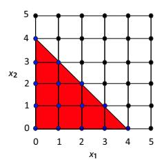

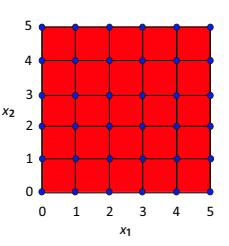

---

### Single-Machine Non-Preemptive Scheduling — OR via Big-M

> *Worked example identified and solved by Claude from the lecture slides — verify against the originals before relying on it for an exam.*

**Problem.** Schedule two non-preemptive tasks $T_i, T_j$ on one processor with $p_i = 2,\ p_j = 3,\ r_i = r_j = 0,\ \widetilde d_i = 10,\ \widetilde d_j = 11$. Disjunctive constraint: for the pair $(i,j)$ we need $T_i$ before $T_j$ (i.e. $s_j \ge s_i + p_i$) OR $T_j$ before $T_i$ (i.e. $s_i \ge s_j + p_j$). Model this with a binary $x_{ij} \in \{0,1\}$ and $M = 11$, and enumerate the two cases.

**Approach.** Big-M disjunction: introduce $x_{ij} = 1$ iff $T_i$ precedes $T_j$. Then

$$s_j + M(1 - x_{ij}) \ge s_i + p_i, \qquad s_i + M\, x_{ij} \ge s_j + p_j,$$

with $M = 11$ here (the slide picks $M$ to equal the largest deadline, which suffices).

**Solution.**

1. **Case $x_{ij} = 1$ — $T_i$ precedes $T_j$.** Constraints reduce to

    $$s_j \ge s_i + 2, \qquad s_i + 11 \ge s_j + 3 \Leftrightarrow s_j \le s_i + 8.$$

   Combined with release dates ($s_i, s_j \ge 0$) and deadlines ($s_i + 2 \le 10 \Rightarrow s_i \le 8$, $s_j + 3 \le 11 \Rightarrow s_j \le 8$): feasible region in $(s_i, s_j)$ is the trapezoid

    $$0 \le s_i \le 8,\ \ s_i + 2 \le s_j \le \min(s_i + 8,\ 8).$$

    Sample feasible point: $s_i = 0,\ s_j = 2$ (so $T_i$ runs $[0,2)$, $T_j$ runs $[2,5)$, $C_{max} = 5$).

2. **Case $x_{ij} = 0$ — $T_j$ precedes $T_i$.** Constraints reduce to

    $$s_j + 11 \ge s_i + 2 \Leftrightarrow s_i \le s_j + 9, \qquad s_i \ge s_j + 3.$$

   With deadlines: $0 \le s_j \le 8,\ s_j + 3 \le s_i \le \min(s_j + 9,\ 8)$.

    Sample feasible point: $s_j = 0,\ s_i = 3$ (so $T_j$ runs $[0,3)$, $T_i$ runs $[3,5)$, $C_{max} = 5$).

3. **Both schedules achieve $C_{max} = 5$.** $1\mid r_j, \widetilde d_j \mid C_{max}$ minimisation: lower bound from total work is $p_i + p_j = 5$, achieved by either order — so both feasible orderings are optimal.

4. **Non-convexity.** The 2D projection onto $(s_i, s_j)$ is the union of the two trapezoids above, which is **not convex** — it is the slide's "non-convex 2D space" obtained by projecting the 3D polytope (in variables $s_i, s_j, x_{ij}$) onto the $x_{ij}=0$ and $x_{ij}=1$ slices.

**Answer.** Two optimal schedules:

- $T_i$ first: $s_i = 0,\ s_j = 2$, $C_{max} = 5$.
- $T_j$ first: $s_j = 0,\ s_i = 3$, $C_{max} = 5$.

The disjunctive Big-M constraints with $x_{ij} \in \{0,1\}$ and $M = 11$ correctly carve out both feasibility slabs while keeping the model linear.

**Pitfalls / insight.** Disjunctive scheduling constraints are the canonical "$\le K$ of $N$" pattern with $N=2,\ K=1$, hence one binary $x_{ij}$ suffices (no $\sum y_i = 1$ row). $M$ must dominate every possible LHS−RHS gap; the lecture's pragmatic choice $M = \max_i \widetilde d_i$ works, but again tighter $M$ gives a stronger LP relaxation. The non-convexity of the projection is precisely why simplex alone cannot solve scheduling — branching on $x_{ij}$ is essential.

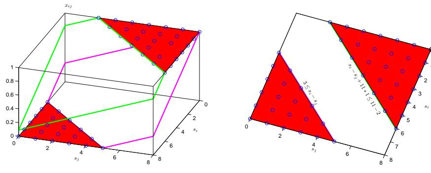
