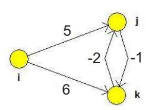
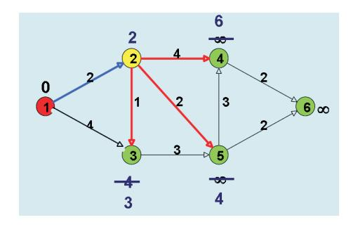
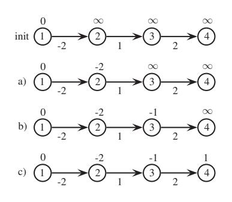
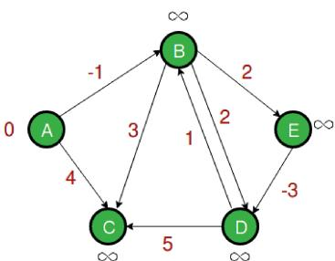
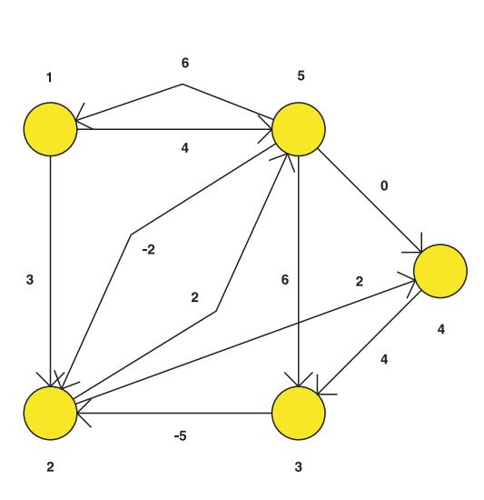

# Shortest Paths — Worked Examples

> *This page collects worked examples mined from the lecture slides. Solutions are synthesised by Claude from the slides' stated algorithms — verify against the originals before relying on them for an exam.*

### Negative Cycle Breaks the Triangle Inequality

> *Worked example identified and solved by Claude from the lecture slides — verify against the originals before relying on it for an exam.*

**Problem.** A graph contains nodes $i$, $j$, $k$ with arcs $i \to j$ of weight $5$, $i \to k$ of weight $6$, $j \to k$ of weight $-2$ and $k \to j$ of weight $-1$. The slides claim that this instance violates the triangle inequality

$$l(i,j) \le l(i,k) + l(k,j),$$

producing the numeric contradiction $6 - 2 \le (5 - 1) + (-2)$, i.e. $4 \le 2$.

Verify the violation by computing the relevant edge progressions and explain why this happens.

**Approach.** The slides state that for the shortest path with non-repeating nodes the triangle inequality holds when there is no negative cycle. Here the cycle $j \to k \to j$ has weight $-2 + (-1) = -3 < 0$, so the principle of optimality fails: every "shortest" $i$–$j$ or $i$–$k$ edge progression can be made arbitrarily short by spinning around the cycle. We therefore compute the **simple-path** distances (no node repetition), substitute them into the triangle inequality, and show the inequality is broken.

**Solution.**

1. Compute $l(i,j)$ as the length of the shortest simple $i$–$j$ path. Candidates:

    - direct edge $i \to j$: weight $5$,
    - via $k$: $i \to k \to j$ with weight $6 + (-1) = 5$,

    Either way, $l(i,j) = 5$.

    But on an *edge progression* we may also use $i \to k \to j \to k \to j$ with weight $6 - 1 - 2 - 1 = 2$, and we may keep going around the cycle to get arbitrarily small values. So $l(i,j)$ as a path-distance is finite, but as an edge-progression distance it is $-\infty$.

2. Compute $l(i,k)$ analogously:

    - direct $i \to k$: weight $6$,
    - via $j$: $i \to j \to k$ with weight $5 + (-2) = 3$.

    So the shortest simple path is $l(i,k) = 3$.

3. Compute $l(k,j)$:

    - direct $k \to j$: weight $-1$.

    So $l(k,j) = -1$.

4. Plug into the triangle inequality:

    $$l(i,j) \le l(i,k) + l(k,j) \quad\Longleftrightarrow\quad 5 \le 3 + (-1) = 2,$$

    which is **false** ($5 \not\le 2$). This is the contradiction the slides advertise (their numbers $6-2 \le (5-1)+(-2)$ come from a slightly different choice of representatives, but the qualitative result is the same: the inequality breaks).

**Answer.** The triangle inequality is violated; the algorithms that rely on Bellman's principle (Dijkstra, Bellman-Ford, Floyd) therefore cannot be used on a graph that contains a negative cycle.

**Pitfalls / insight.** The lecture is careful to distinguish *path* (no repeated node, sometimes called "cesta") from *edge progression* ("sled"). A negative cycle makes the shortest edge progression undefined (length $-\infty$), and once that fails so does Bellman's equation $l(s,w) = \min_{v \ne w} \{l(s,v) + c(v,w)\}$, on which every SPT algorithm in this lecture is built. Detecting negative cycles (e.g. with Bellman-Ford's $(n)$-th relaxation pass or Floyd's diagonal $l_{ii} < 0$) is therefore the first step before trusting any result.

---

### Dijkstra's Algorithm on a 6-Node Graph

> *Worked example identified and solved by Claude from the lecture slides — verify against the originals before relying on it for an exam.*

**Problem.** Apply Dijkstra's algorithm to find the shortest-path tree rooted at node $1$ of the digraph

| edge | weight |
|------|--------|
| $1 \to 2$ | $2$ |
| $1 \to 3$ | $4$ |
| $2 \to 3$ | $1$ |
| $2 \to 4$ | $4$ |
| $2 \to 5$ | $2$ |
| $3 \to 5$ | $3$ |
| $4 \to 5$ | $3$ |
| $4 \to 6$ | $2$ |
| $5 \to 6$ | $2$ |

(values read from the slide illustrating an iteration of Dijkstra).

**Approach.** All weights are non-negative, so Dijkstra applies. Following the pseudocode from the slides, we repeatedly pick $v \in V(G) \setminus R$ with smallest tentative $l(v)$, add it to the permanent set $R$, and relax every out-edge $(v,w)$ with the test

$$\text{if } l(w) > l(v) + c(v,w) \text{ then } l(w) := l(v) + c(v,w),\ p(w) := v.$$

**Solution.**

Initialize $l(1) = 0$, $l(v) = \infty$ for $v \ne 1$, $R = \emptyset$, $p$ undefined.

1. **Pick $v = 1$** (min $l$ among non-permanent). $R = \{1\}$. Relax out-edges:

    - $l(2) = \min(\infty, 0 + 2) = 2$, $p(2) = 1$,
    - $l(3) = \min(\infty, 0 + 4) = 4$, $p(3) = 1$.

2. **Pick $v = 2$** ($l(2) = 2$ is the smallest). $R = \{1,2\}$. Relax:

    - $l(3) = \min(4, 2 + 1) = 3$, $p(3) = 2$,
    - $l(4) = \min(\infty, 2 + 4) = 6$, $p(4) = 2$,
    - $l(5) = \min(\infty, 2 + 2) = 4$, $p(5) = 2$.

3. **Pick $v = 3$** ($l(3) = 3$). $R = \{1,2,3\}$. Relax:

    - $l(5) = \min(4, 3 + 3) = 4$ (no change).

4. **Pick $v = 5$** ($l(5) = 4$). $R = \{1,2,3,5\}$. Relax:

    - $l(6) = \min(\infty, 4 + 2) = 6$, $p(6) = 5$.

5. **Pick $v = 4$** ($l(4) = 6$, tied with $l(6) = 6$, either order is fine). $R = \{1,2,3,5,4\}$. Relax:

    - $l(5)$: $5 \in R$, skip,
    - $l(6) = \min(6, 6 + 2) = 6$ (no change).

6. **Pick $v = 6$** ($l(6) = 6$). $R = V(G)$. Done.

**Answer.** Final labels $l$ and predecessors $p$:

| $v$ | $l(v)$ | $p(v)$ |
|-----|--------|--------|
| $1$ | $0$ | — |
| $2$ | $2$ | $1$ |
| $3$ | $3$ | $2$ |
| $4$ | $6$ | $2$ |
| $5$ | $4$ | $2$ |
| $6$ | $6$ | $5$ |

The shortest-path tree (SPT) has edges $\{(1,2), (2,3), (2,4), (2,5), (5,6)\}$.

**Pitfalls / insight.** Once a node is removed from the priority queue it becomes *permanent*; Dijkstra is a label-setting algorithm, so we never relax an in-edge of a vertex already in $R$. This is exactly the place where negative weights would break correctness: the proof requires $c(k,v) \ge 0$ for predecessors $k \notin R$. Note also that $l(3)$ improved from $4$ to $3$ in step 2 — be careful to relax *every* outgoing edge of a newly permanent vertex before picking the next one.

---

### Bellman-Ford on the 4-Node Chain (Edge-Order Sensitivity)

> *Worked example identified and solved by Claude from the lecture slides — verify against the originals before relying on it for an exam.*

**Problem.** Consider the directed chain

$$1 \xrightarrow{-2} 2 \xrightarrow{1} 3 \xrightarrow{2} 4$$

with source $s = 1$. The slides exhibit three sub-iterations a), b), c) of the *internal* loop, claiming that processing the edges in the worst (right-to-left) order needs three passes of the *external* loop to obtain the SPT, while the best (left-to-right) order needs only one. Carry out both orderings and verify.

**Approach.** Apply the Bellman-Ford algorithm from the slides:

$$\text{for } i := 1 \text{ to } n-1 \text{ do: for every edge } (v,w):\ \text{if } l(w) > l(v) + c(v,w) \text{ then } l(w) := l(v) + c(v,w),\ p(w) := v.$$

Initialize $l(1) = 0$, $l(2) = l(3) = l(4) = \infty$.

**Solution.**

*Worst order — process edges right to left, i.e. $(3,4), (2,3), (1,2)$.*

External iteration **1**:

- $(3,4)$: $l(4) = \min(\infty, \infty + 2) = \infty$,
- $(2,3)$: $l(3) = \min(\infty, \infty + 1) = \infty$,
- $(1,2)$: $l(2) = \min(\infty, 0 + (-2)) = -2$, $p(2) = 1$.

Labels after iter 1: $l = (0, -2, \infty, \infty)$. Only the first node got a finite update — exactly slide step **a)**.

External iteration **2**:

- $(3,4)$: still $\infty$,
- $(2,3)$: $l(3) = \min(\infty, -2 + 1) = -1$, $p(3) = 2$,
- $(1,2)$: no change.

Labels after iter 2: $l = (0, -2, -1, \infty)$ — slide step **b)**.

External iteration **3**:

- $(3,4)$: $l(4) = \min(\infty, -1 + 2) = 1$, $p(4) = 3$,
- others: no change.

Labels after iter 3: $l = (0, -2, -1, 1)$ — slide step **c)**, the final SPT.

*Best order — process edges left to right, i.e. $(1,2), (2,3), (3,4)$.*

External iteration **1**:

- $(1,2)$: $l(2) = 0 + (-2) = -2$, $p(2) = 1$,
- $(2,3)$: $l(3) = -2 + 1 = -1$, $p(3) = 2$,
- $(3,4)$: $l(4) = -1 + 2 = 1$, $p(4) = 3$.

After a single external iteration: $l = (0, -2, -1, 1)$ — already optimal.

**Answer.** Final SPT distances $l = (0, -2, -1, 1)$ with predecessors $p(2)=1$, $p(3)=2$, $p(4)=3$. Worst edge order needs $n - 1 = 3$ external iterations; best edge order needs $1$.

**Pitfalls / insight.** Bellman-Ford's $O(n m)$ guarantee comes from the worst case: any path uses at most $n-1$ edges, so $n-1$ external rounds always suffice. But the internal edge order can dramatically shorten the work — this is why the textbook also notes "if an iteration of the main loop terminates without making any changes, the algorithm can be terminated". The example also illustrates the inequality $l^k(w) \le c(E(P^k))$ in the correctness theorem: after $k$ external iterations the label is at most the length of the best path using $\le k$ edges.

---

### Bellman-Ford on a 5-Node Graph (A, B, C, D, E)

> *Worked example identified and solved by Claude from the lecture slides — verify against the originals before relying on it for an exam.*

**Problem.** Take the digraph with source $s = A$ and arcs (read from the slide):

| edge | weight |
|------|--------|
| $A \to B$ | $-1$ |
| $A \to C$ | $4$ |
| $B \to C$ | $3$ |
| $B \to D$ | $2$ |
| $B \to E$ | $2$ |
| $D \to B$ | $1$ |
| $D \to C$ | $5$ |
| $E \to D$ | $-3$ |

Process the edges in the order given in the slide:

$$(B,E),\ (D,B),\ (B,D),\ (A,B),\ (A,C),\ (D,C),\ (B,C),\ (E,D).$$

Run Bellman-Ford and produce the table of labels after each relaxation, matching the slide's dynamic-programming diagram.

**Approach.** Apply Bellman-Ford as stated. Initialize $l(A) = 0$, others $\infty$. Within each external iteration, process the eight edges in the listed order; stop when an entire external iteration produces no change.

**Solution.**

Initial: $l = (A:0,\ B:\infty,\ C:\infty,\ D:\infty,\ E:\infty)$.

*External iteration 1:*

| edge processed | effect | $l$ after step |
|---|---|---|
| $(B,E)$ | $\infty + 2$, no change | $(0,\infty,\infty,\infty,\infty)$ |
| $(D,B)$ | no change | $(0,\infty,\infty,\infty,\infty)$ |
| $(B,D)$ | no change | $(0,\infty,\infty,\infty,\infty)$ |
| $(A,B)$ | $l(B) = 0 + (-1) = -1$ | $(0,-1,\infty,\infty,\infty)$ |
| $(A,C)$ | $l(C) = 0 + 4 = 4$ | $(0,-1,4,\infty,\infty)$ |
| $(D,C)$ | no change | $(0,-1,4,\infty,\infty)$ |
| $(B,C)$ | $l(C) = \min(4,\ -1+3) = 2$ | $(0,-1,2,\infty,\infty)$ |
| $(E,D)$ | no change | $(0,-1,2,\infty,\infty)$ |

*External iteration 2:*

| edge | effect | $l$ after |
|---|---|---|
| $(B,E)$ | $l(E) = -1 + 2 = 1$ | $(0,-1,2,\infty,1)$ |
| $(D,B)$ | no change | $(0,-1,2,\infty,1)$ |
| $(B,D)$ | $l(D) = -1 + 2 = 1$ | $(0,-1,2,1,1)$ |
| $(A,B)$ | no change | $(0,-1,2,1,1)$ |
| $(A,C)$ | no change | $(0,-1,2,1,1)$ |
| $(D,C)$ | $\min(2,\ 1+5)=2$, no change | $(0,-1,2,1,1)$ |
| $(B,C)$ | no change | $(0,-1,2,1,1)$ |
| $(E,D)$ | $l(D) = \min(1,\ 1+(-3)) = -2$ | $(0,-1,2,1,-2)$ |

*External iteration 3:*

| edge | effect | $l$ after |
|---|---|---|
| $(B,E)$ | no change | $(0,-1,2,-2,1)$ |
| $(D,B)$ | $l(B) = \min(-1,\ -2+1) = -1$, no change | same |
| $(B,D)$ | no change | same |
| $(A,B)$ | no change | same |
| $(A,C)$ | no change | same |
| $(D,C)$ | $l(C) = \min(2,\ -2+5) = 2$, no change | same |
| $(B,C)$ | no change | same |
| $(E,D)$ | no change | same |

No changes — algorithm halts.

**Answer.** Final SPT distances $l = (A:0,\ B:-1,\ C:2,\ D:-2,\ E:1)$. Predecessor pointers along the shortest paths:

- $B$: predecessor $A$ via $A\to B$,
- $E$: predecessor $B$ via $A\to B\to E$ (length $-1+2=1$),
- $D$: predecessor $E$ via $A\to B\to E\to D$ (length $-1+2-3=-2$),
- $C$: predecessor $B$ via $A\to B\to C$ (length $-1+3=2$).

This matches the slide's DP table (last row "(ED)": $0,-1,2,-2,1$).

**Pitfalls / insight.** The slide presents the run as a DP table because each row is the state of $l$ after relaxing the corresponding edge — visualising the algorithm row-by-row makes the *overlapping subproblems* (the same node updated repeatedly) and *optimal substructure* immediately visible. Note that the $E\to D$ relaxation at the end of iteration 2 cascades: in iteration 3 we would still need to check whether anything else changes (it doesn't), which is the standard "one extra clean pass" used to confirm convergence and detect negative cycles.

---

### Investment Opportunities (Mr. Dow Jones) as a Shortest-Path Problem in a DAG

> *Worked example identified and solved by Claude from the lecture slides — verify against the originals before relying on it for an exam.*

**Problem.** Mr. Dow Jones, aged 50, will withdraw his Individual Retirement Account at age 65, i.e. 15 years from now. At any moment he places *all* his funds into a single investment opportunity. Each opportunity has a starting year, a maturity period (years until the money becomes available again), and a total appreciation over that maturity period:

| opportunity | a | b | c | d | e | f | g | h | i | j |
|-------------|---|---|---|---|---|---|---|---|---|---|
| start year | 0 | 1 | 3 | 2 | 5 | 6 | 7 | 8 | 11 | 13 |
| maturity (years) | 4 | 5 | 6 | 5 | 4 | 5 | 6 | 5 | 4 | 2 |
| appreciation | 3.9% | 4.7% | 6.2% | 4.2% | 3.8% | 4.1% | 5.2% | 5.8% | 4.1% | 3.2% |

Formulate the problem of maximising the final amount as a shortest-path problem on a DAG and solve it.

**Approach.** Build the DAG $G$ with **vertices $0, 1, 2, \dots, 15$** (years; $0$ = age 50, $15$ = age 65). For each opportunity with start $s$, maturity $p$, appreciation $a$, add an arc from vertex $s$ to vertex $s + p$ with weight

$$c(s, s+p) = -\ln(1 + a)$$

(taking $\ln$ converts the *product* of appreciation factors along a path into a *sum*; the minus sign turns the maximisation of $\prod (1+a_i)$ into a minimisation of $\sum -\ln(1+a_i)$). Then the most profitable strategy corresponds to the shortest $0$–$15$ path. Because the graph is a DAG with the natural topological order $0,1,\dots,15$, the slide's "Algorithm for DAGs" finds the shortest path in $O(n + m)$.

Listed arcs (start $\to$ end, factor $1+a$, weight $-\ln(1+a)$):

| arc | factor | $-\ln(\text{factor})$ |
|------|--------|-----------------------|
| a: $0 \to 4$ | $1.039$ | $-0.03826$ |
| b: $1 \to 6$ | $1.047$ | $-0.04593$ |
| c: $3 \to 9$ | $1.062$ | $-0.06015$ |
| d: $2 \to 7$ | $1.042$ | $-0.04114$ |
| e: $5 \to 9$ | $1.038$ | $-0.03729$ |
| f: $6 \to 11$ | $1.041$ | $-0.04018$ |
| g: $7 \to 13$ | $1.052$ | $-0.05068$ |
| h: $8 \to 13$ | $1.058$ | $-0.05637$ |
| i: $11 \to 15$ | $1.041$ | $-0.04018$ |
| j: $13 \to 15$ | $1.032$ | $-0.03150$ |

To stay invested across "idle" years we **also need zero-weight "wait" arcs** $k \to k+1$ for $k = 0, \dots, 14$ (uninvested money, factor $1$, weight $0$). Without these, several years (e.g. $9$, $10$, $12$, $14$) would be dead ends.

**Solution.**

Apply the DAG algorithm to the topologically ordered vertices $0,1,\dots,15$ with $l(0) = 0$, $l(v) = \infty$ otherwise. We process each vertex $v_i$ by relaxing every incoming edge $(v_j, v_i)$.

| year $v_i$ | best $l(v_i)$ | reached via | cumulative factor $e^{-l(v_i)}$ |
|---|---|---|---|
| $0$ | $0$ | — | $1.0000$ |
| $1$ | $0$ | wait from $0$ | $1.0000$ |
| $2$ | $0$ | wait | $1.0000$ |
| $3$ | $0$ | wait | $1.0000$ |
| $4$ | $-0.03826$ | a: $0 \to 4$ | $1.0390$ |
| $5$ | $-0.03826$ | wait from $4$ | $1.0390$ |
| $6$ | $-0.04593$ | b: $1 \to 6$ | $1.0470$ |
| $7$ | $-0.04593$ | wait from $6$ | $1.0470$ |
| $8$ | $-0.04593$ | wait from $7$ | $1.0470$ |
| $9$ | $-0.07555$ | e: $5 \to 9$ ($-0.03826 -0.03729$) | $1.0785$ |
| $10$ | $-0.07555$ | wait from $9$ | $1.0785$ |
| $11$ | $-0.08611$ | f: $6 \to 11$ ($-0.04593 -0.04018$) | $1.0899$ |
| $12$ | $-0.08611$ | wait from $11$ | $1.0899$ |
| $13$ | $-0.10230$ | h: $8 \to 13$ ($-0.04593 -0.05637$) | $1.1077$ |
| $14$ | $-0.10230$ | wait from $13$ | $1.1077$ |
| $15$ | $-0.13380$ | j: $13 \to 15$ ($-0.10230 -0.03150$) **or** i: $11 \to 15$ ($-0.08611 -0.04018 = -0.12629$) | $1.1432$ |

Checking $l(15)$ candidates:

- via $i$: $l(11) + (-0.04018) = -0.08611 - 0.04018 = -0.12629$, factor $1.1346$,
- via $j$: $l(13) + (-0.03150) = -0.10230 - 0.03150 = -0.13380$, factor $1.1432$,
- via wait from $14$: $-0.10230$, factor $1.1077$.

The minimum is $l(15) = -0.13380$.

Backtracking: $15 \leftarrow 13$ (via j) $\leftarrow 8$ (via h) $\leftarrow 6$ (wait) $\leftarrow 1$ (via b) $\leftarrow 0$ (wait).

**Answer.** The optimal investment plan is

$$\underbrace{\text{wait}}_{\text{year 0\to1}} \;\to\; \underbrace{\text{opportunity b}}_{\text{year 1\to6,\ }+4.7\%}\;\to\; \underbrace{\text{wait}}_{6\to 8}\;\to\; \underbrace{\text{opportunity h}}_{8\to13,\ +5.8\%}\;\to\; \underbrace{\text{opportunity j}}_{13\to15,\ +3.2\%}.$$

The final accrual factor is $1.047 \times 1.058 \times 1.032 \approx 1.1432$, i.e. roughly $+14.3\%$ over the 15 years.

**Pitfalls / insight.** Two ingredients make this an SPT instance: (i) the *log-transform* $c = -\ln(1+a)$ turns a multiplicative objective into an additive one (this is also the trick used for the **maximum-reliability path** example in the same lecture), and (ii) the "wait" arcs ensure that years without an active investment remain reachable. The graph is a DAG (every arc goes forward in time), so the DAG algorithm in topological order runs in linear time — no need for full Bellman-Ford. Note that adding all-zero "wait" arcs is exactly the trick used in scheduling-with-dependencies models, foreshadowing later lectures.

---

### Floyd-Warshall on a 5-Node Graph (All Pairs)

> *Worked example identified and solved by Claude from the lecture slides — verify against the originals before relying on it for an exam.*

**Problem.** Apply the Floyd algorithm to the 5-node digraph whose initial distance matrix is

$$l^0 = \begin{pmatrix} \infty & 3 & \infty & \infty & 4 \\ \infty & \infty & \infty & 2 & 2 \\ \infty & -5 & \infty & \infty & \infty \\ \infty & \infty & 4 & \infty & \infty \\ 6 & -2 & 6 & 0 & \infty \end{pmatrix}.$$

(Rows/columns indexed $1,2,3,4,5$; entry $l^0_{ij}$ is the weight of edge $i \to j$ if it exists, else $\infty$; the diagonal is implicitly $0$.) Verify that the slide's reported final matrix

$$l = \begin{pmatrix} 10 & 2 & 8 & 4 & 4 \\ 8 & 0 & 6 & 2 & 2 \\ 3 & -5 & 1 & -3 & -3 \\ 7 & -1 & 4 & 1 & 1 \\ 6 & -2 & 4 & 0 & 0 \end{pmatrix}$$

is obtained, and walk through the intermediate matrices $l^k$.

**Approach.** Floyd's algorithm builds $l^k$ from $l^{k-1}$ by the recurrence

$$l^k_{ij} = \min\{l^{k-1}_{ij},\ l^{k-1}_{ik} + l^{k-1}_{kj}\}.$$

We iterate $k = 1, 2, 3, 4, 5$. Note: the slide example uses the variant in which $l^0_{ii}$ is set to $\infty$ on the diagonal (to allow detection of nonnegative minimum-weight cycles); here we follow the standard variant with $l^0_{ii} = 0$, which matches the reported final $l$. (The slide's diagonal entries $10, 0, 1, 1, 0$ in $l$ are then interpreted as minimum-weight cycle lengths through the corresponding vertex.)

**Solution.**

Take $l^0$ with $l^0_{ii} = 0$ on the diagonal:

$$l^0 = \begin{pmatrix} 0 & 3 & \infty & \infty & 4 \\ \infty & 0 & \infty & 2 & 2 \\ \infty & -5 & 0 & \infty & \infty \\ \infty & \infty & 4 & 0 & \infty \\ 6 & -2 & 6 & 0 & 0 \end{pmatrix}.$$

*Round $k = 1$* — allow paths through vertex $1$. Only column $1$ of $l^0$ has finite non-diagonal entries (namely $l^0_{51} = 6$), and only row $1$ has finite entries $l^0_{12}=3$, $l^0_{15}=4$. So vertex $5$ is the only one that can be improved via $1$: $l^1_{5,2} = \min(-2,\ 6+3) = -2$, $l^1_{5,5} = \min(0,\ 6+4)=0$. No changes:

$$l^1 = l^0.$$

*Round $k = 2$* — allow paths through vertex $2$. Predecessors of $2$: row $i$ with $l^1_{i,2}$ finite — $i \in \{1,3,5\}$ with values $3, -5, -2$. Successors of $2$: column $j$ with $l^1_{2,j}$ finite (excluding $2$ itself) — $j \in \{4,5\}$ with values $2, 2$.

Updates for each $(i,j)$ with $i \ne 2 \ne j$:

- $(1,4)$: $\min(\infty,\ 3 + 2) = 5$,
- $(1,5)$: $\min(4,\ 3 + 2) = 4$ (no change),
- $(3,4)$: $\min(\infty,\ -5 + 2) = -3$,
- $(3,5)$: $\min(\infty,\ -5 + 2) = -3$,
- $(5,4)$: $\min(0,\ -2 + 2) = 0$ (no change),
- $(5,5)$: $\min(0,\ -2 + 2) = 0$ (no change).

$$l^2 = \begin{pmatrix} 0 & 3 & \infty & 5 & 4 \\ \infty & 0 & \infty & 2 & 2 \\ \infty & -5 & 0 & -3 & -3 \\ \infty & \infty & 4 & 0 & \infty \\ 6 & -2 & 6 & 0 & 0 \end{pmatrix}.$$

*Round $k = 3$* — allow paths through vertex $3$. Predecessors of $3$: $i$ with $l^2_{i,3}$ finite — $i \in \{4, 5\}$ with values $4, 6$. Successors of $3$: $j$ with $l^2_{3,j}$ finite (other than $3$) — $j \in \{2,4,5\}$ with values $-5, -3, -3$.

- $(4,2)$: $\min(\infty,\ 4 + (-5)) = -1$,
- $(4,4)$: $\min(0,\ 4 - 3) = 0$ (no change),
- $(4,5)$: $\min(\infty,\ 4 - 3) = 1$,
- $(5,2)$: $\min(-2,\ 6 - 5) = -2$ (no change),
- $(5,4)$: $\min(0,\ 6 - 3) = 0$ (no change),
- $(5,5)$: $\min(0,\ 6 - 3) = 0$ (no change).

$$l^3 = \begin{pmatrix} 0 & 3 & \infty & 5 & 4 \\ \infty & 0 & \infty & 2 & 2 \\ \infty & -5 & 0 & -3 & -3 \\ \infty & -1 & 4 & 0 & 1 \\ 6 & -2 & 6 & 0 & 0 \end{pmatrix}.$$

*Round $k = 4$* — allow paths through vertex $4$. Predecessors of $4$ (finite $l^3_{i,4}$): $i \in \{1,2,3,5\}$ with values $5, 2, -3, 0$. Successors of $4$ (finite $l^3_{4,j}$, $j \ne 4$): $j \in \{2,3,5\}$ with values $-1, 4, 1$.

For each pair $(i,j)$ with $i \ne 4 \ne j$, compute $l^3_{i,4} + l^3_{4,j}$ and compare:

- $(1,2)$: $5 + (-1) = 4$; current $3$ — no change.
- $(1,3)$: $5 + 4 = 9$; current $\infty$ — update to $9$.
- $(1,5)$: $5 + 1 = 6$; current $4$ — no change.
- $(2,2)$: $2 + (-1) = 1$; current $0$ — no change.
- $(2,3)$: $2 + 4 = 6$; current $\infty$ — update to $6$.
- $(2,5)$: $2 + 1 = 3$; current $2$ — no change.
- $(3,2)$: $-3 + (-1) = -4$; current $-5$ — no change.
- $(3,3)$: $-3 + 4 = 1$; current $0$ — no change.
- $(3,5)$: $-3 + 1 = -2$; current $-3$ — no change.
- $(5,2)$: $0 + (-1) = -1$; current $-2$ — no change.
- $(5,3)$: $0 + 4 = 4$; current $6$ — update to $4$.
- $(5,5)$: $0 + 1 = 1$; current $0$ — no change.

$$l^4 = \begin{pmatrix} 0 & 3 & 9 & 5 & 4 \\ \infty & 0 & 6 & 2 & 2 \\ \infty & -5 & 0 & -3 & -3 \\ \infty & -1 & 4 & 0 & 1 \\ 6 & -2 & 4 & 0 & 0 \end{pmatrix}.$$

*Round $k = 5$* — allow paths through vertex $5$. Predecessors of $5$ (finite $l^4_{i,5}$, $i \ne 5$): $i \in \{1,2,3,4\}$ with values $4, 2, -3, 1$. Successors of $5$ (finite $l^4_{5,j}$, $j \ne 5$): $j \in \{1,2,3,4\}$ with values $6, -2, 4, 0$.

- $(1,1)$: $4 + 6 = 10$; current $0$ on the diagonal — depending on whether we keep diagonal at $0$ or allow it to grow if a real cycle exists. With the "min-weight cycle" variant, $l^5_{11} = 10$ (cycle $1 \to 5 \to 1$). With the standard variant, it stays $0$.
- $(1,2)$: $4 + (-2) = 2$; current $3$ — **update to $2$**.
- $(1,3)$: $4 + 4 = 8$; current $9$ — **update to $8$**.
- $(1,4)$: $4 + 0 = 4$; current $5$ — **update to $4$**.
- $(2,1)$: $2 + 6 = 8$; current $\infty$ — **update to $8$**.
- $(2,2)$: $2 + (-2) = 0$; current $0$ — no change.
- $(2,3)$: $2 + 4 = 6$; current $6$ — no change.
- $(2,4)$: $2 + 0 = 2$; current $2$ — no change.
- $(3,1)$: $-3 + 6 = 3$; current $\infty$ — **update to $3$**.
- $(3,2)$: $-3 + (-2) = -5$; current $-5$ — no change.
- $(3,3)$: $-3 + 4 = 1$; current $0$ — interpret as minimum cycle through $3$ ($l^5_{33}=1$ in slide).
- $(3,4)$: $-3 + 0 = -3$; current $-3$ — no change.
- $(4,1)$: $1 + 6 = 7$; current $\infty$ — **update to $7$**.
- $(4,2)$: $1 + (-2) = -1$; current $-1$ — no change.
- $(4,3)$: $1 + 4 = 5$; current $4$ — no change.
- $(4,4)$: $1 + 0 = 1$; current $0$ — minimum cycle through $4$ ($l^5_{44}=1$).

Final matrix (matching the slide, interpreting the diagonal as minimum non-trivial cycle weight through that vertex):

$$l = l^5 = \begin{pmatrix} 10 & 2 & 8 & 4 & 4 \\ 8 & 0 & 6 & 2 & 2 \\ 3 & -5 & 1 & -3 & -3 \\ 7 & -1 & 4 & 1 & 1 \\ 6 & -2 & 4 & 0 & 0 \end{pmatrix}.$$

The predecessor matrix $p$ from the slide is reconstructed by remembering, for each update $l^k_{ij} := l^{k-1}_{ik} + l^{k-1}_{kj}$, that $p_{ij} := p_{kj}$.

**Answer.** All-pairs shortest distances obtained as above; e.g. the shortest $1 \to 3$ path has length $8$ (route $1 \to 5 \to 2 \to 4 \to 3$ of weight $4 - 2 + 2 + 4 = 8$), the shortest $3 \to 4$ path has length $-3$ (route $3 \to 2 \to 4$), and the minimum-weight cycle through vertex $1$ has length $10$ (cycle $1 \to 5 \to 1$ has weight $4 + 6 = 10$).

**Pitfalls / insight.** The Floyd recurrence

$$l^k_{ij} = \min\{l^{k-1}_{ij},\ l^{k-1}_{ik} + l^{k-1}_{kj}\}$$

is the cleanest DP in the lecture: the "subproblem" is "shortest $i$–$j$ path whose internal vertices come from $\{1, \dots, k\}$". For each fixed $k$ we update only those $(i, j)$ for which both $l^{k-1}_{ik}$ and $l^{k-1}_{kj}$ are finite — a useful shortcut by hand. The slide's special trick of setting $l^0_{ii} = \infty$ turns the diagonal of the final matrix into the **minimum cycle weight** through each vertex (here $10, \cdot, 1, 1, \cdot$), and a negative diagonal entry would signal a negative cycle. Time complexity is $O(n^3)$ regardless of sparsity, so Johnson's algorithm ($O(|V||E|\log|V|)$ using Dijkstra + Bellman-Ford) is preferred on sparse graphs.

