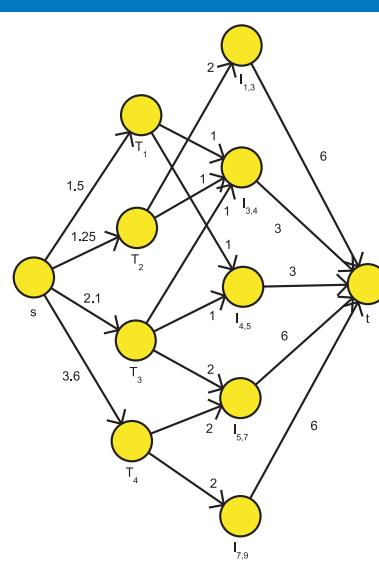
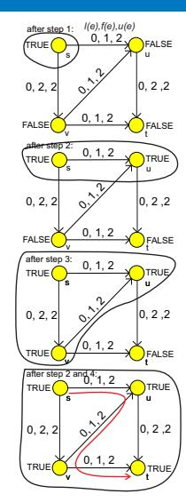
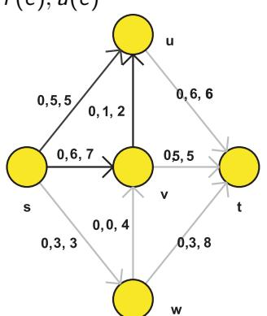
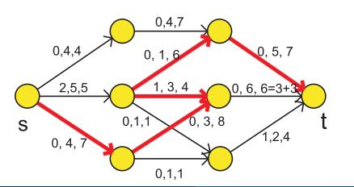
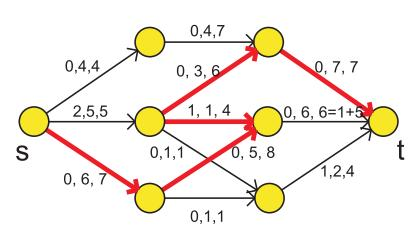
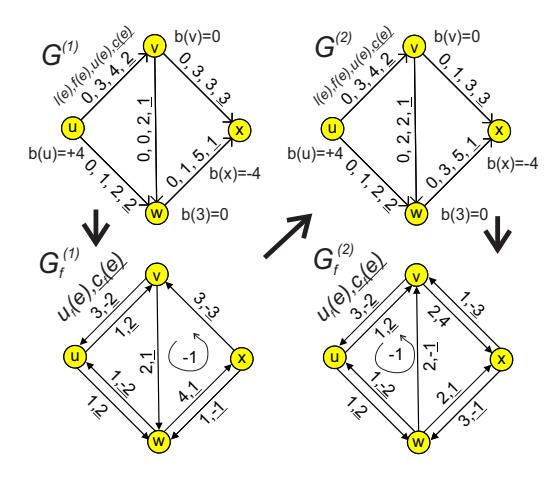
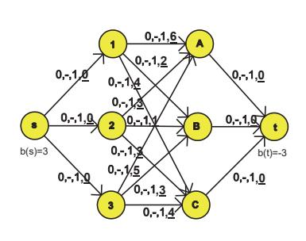
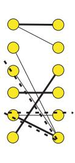
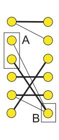

# Network Flows — Worked Examples

> *This page collects worked examples mined from the lecture slides. Solutions are synthesised by Claude from the slides' stated algorithms — verify against the originals before relying on them for an exam.*

### Multiprocessor Scheduling with Preemption via Maximum Flow

> *Worked example identified and solved by Claude from the lecture slides — verify against the originals before relying on it for an exam.*

**Problem.** Schedule the following $P\,|\,\mathrm{pmtn},r_j,\widetilde{d}_j\,|\,-$ instance on $R=3$ identical processors (preemption and migration allowed):

| task              | $T_1$ | $T_2$ | $T_3$ | $T_4$ |
|-------------------|-------|-------|-------|-------|
| $p_j$             | 1.5   | 1.25  | 2.1   | 3.6   |
| $r_j$             | 3     | 1     | 3     | 5     |
| $\widetilde{d}_j$ | 5     | 4     | 7     | 9     |

Decide if a feasible schedule exists and exhibit one.

**Approach.** Build a network whose maximum flow equals $\sum_j p_j$ iff a feasible schedule exists. The slides describe the construction:

1. Time intervals $I_{x,y}$ are obtained by sorting the distinct $r_j$ and $\widetilde{d}_j$ values.
2. Arcs $s\to T_j$ have capacity $p_j$.
3. Arcs $T_j\to I_{x,y}$ exist whenever $[x,y)\subseteq[r_j,\widetilde{d}_j)$ with capacity $y-x$ (a task is internally sequential, so it cannot occupy more than the interval length).
4. Arcs $I_{x,y}\to t$ have capacity $(y-x)\cdot R$.

If the max-flow saturates all arcs leaving $s$ (total value $\sum_j p_j$), splitting each $I_{x,y}$ time window proportionally to flows on $T_j\to I_{x,y}$ yields a valid preemptive schedule.

**Solution.**

1. Sort breakpoints $\{1,3,4,5,7,9\}$, yielding intervals $I_{1,3},I_{3,4},I_{4,5},I_{5,7},I_{7,9}$ of lengths $2,1,1,2,2$.

2. Required total work $\sum p_j = 1.5+1.25+2.1+3.6=8.45$.

3. Construct the network. The $s\to T_j$ capacities are $(1.5,1.25,2.1,3.6)$. Allowed task–interval arcs (with capacity $y-x$):

    - $T_1$ ($r=3,\widetilde{d}=5$): $I_{3,4},I_{4,5}$.
    - $T_2$ ($r=1,\widetilde{d}=4$): $I_{1,3},I_{3,4}$.
    - $T_3$ ($r=3,\widetilde{d}=7$): $I_{3,4},I_{4,5},I_{5,7}$.
    - $T_4$ ($r=5,\widetilde{d}=9$): $I_{5,7},I_{7,9}$.

4. The $I_{x,y}\to t$ capacities are $R(y-x)=(6,3,3,6,6)$.

5. Solve the max-flow (by Ford–Fulkerson, repeatedly augmenting). A saturating flow value $8.45$ can be obtained, for instance, with task–interval flows:

    - $T_2\to I_{1,3}=1.25$.
    - $T_1\to I_{3,4}=0.5,\;T_1\to I_{4,5}=1.0$.
    - $T_3\to I_{3,4}=0.5,\;T_3\to I_{4,5}=0.0,\;T_3\to I_{5,7}=1.6$.
    - $T_4\to I_{5,7}=1.6,\;T_4\to I_{7,9}=2.0$.

    Then the interval loads are $I_{1,3}\!:\!1.25\le 6$, $I_{3,4}\!:\!1.0\le 3$, $I_{4,5}\!:\!1.0\le 3$, $I_{5,7}\!:\!3.2\le 6$, $I_{7,9}\!:\!2.0\le 6$, every $T_j$ is saturated, so the flow value equals $8.45$.

6. Convert flows to a schedule by McNaughton-style packing within each interval. E.g. in $I_{5,7}$ (length $2$, $3$ processors), schedule $T_3$ for $1.6$ time units and $T_4$ for $1.6$ time units, e.g. $T_3$ on $P_1$ on $[5,6.6)$, $T_4$ on $P_2$ on $[5,6.6)$, neither task on $P_3$ for that piece, etc.

**Answer.** A feasible schedule exists because max-flow $= \sum_j p_j = 8.45$. Each task fits in its window.

**Pitfalls / insight.** The arc $T_j\to I_{x,y}$ capacity is the interval length, not $R\cdot(y-x)$ — a single task cannot run on two processors at the same instant. Conversely, the sink arc capacity is $R(y-x)$ because that interval has $R$ processor-time units available. A feasible schedule exists iff the max-flow saturates all $s\to T_j$ arcs.

---

### Ford–Fulkerson on a Small Network (with Min Cut)

> *Worked example identified and solved by Claude from the lecture slides — verify against the originals before relying on it for an exam.*

**Problem.** Apply the Ford–Fulkerson labeling procedure to a small network whose arcs carry the triple $\bigl(l(e),f(e),u(e)\bigr)$ (lecture sequence on pages 11–17). The lecture's instance is the standard 4-node example with vertex set $\{s,u,v,t\}$, lower bounds zero, and the upper bounds

$$u(s,u)=3,\quad u(s,v)=2,\quad u(u,v)=2,\quad u(u,t)=2,\quad u(v,t)=3.$$

Start from the zero flow. Find the maximum $s$–$t$ flow and the corresponding minimum cut.

**Approach.** Ford–Fulkerson with the labeling procedure: keep finding augmenting paths and increase the flow by the bottleneck capacity $\gamma$ until no augmenting path exists. The labeled set $A$ at termination defines the minimum cut.

**Solution.**

1. **Iteration 1.** Start with $f\equiv 0$. Label $s$. From $s$ reach $u$ (residual $3$), from $u$ reach $t$ (residual $2$). Augmenting path $s\to u\to t$ with $\gamma=\min(3,2)=2$. Update:

    $$f(s,u)=2,\quad f(u,t)=2.$$

2. **Iteration 2.** Re-label. From $s$ reach $u$ (residual $3-2=1$) and $v$ (residual $2$). From $u$ try $v$ (residual $2$). From $v$ reach $t$ (residual $3$). Take $s\to v\to t$, $\gamma=\min(2,3)=2$. Update:

    $$f(s,v)=2,\quad f(v,t)=2.$$

3. **Iteration 3.** Re-label. From $s$ we can still reach $u$ (residual $1$). From $u$ we can reach $v$ (residual $2$). From $v$ we can reach $t$ (residual $3-2=1$). Path $s\to u\to v\to t$, $\gamma=\min(1,2,1)=1$. Update:

    $$f(s,u)=3,\quad f(u,v)=1,\quad f(v,t)=3.$$

4. **Iteration 4.** Re-label. From $s$: arc $(s,u)$ is saturated ($3/3$), so cannot forward-label $u$. Arc $(s,v)$ is saturated ($2/2$), so cannot forward-label $v$. No backward arcs entering $s$ are usable. The labeling halts with $A=\{s\}$.

    Wait — the slides explicitly mark $A=\{s,u,v\}$, so let us re-examine: with the final flow above, $u$ is reachable from $s$ only if $(s,u)$ has spare capacity. It does not. Therefore $A=\{s\}$ would be the labeled set under our flow. The lecture's snapshot $A=\{s,u,v\}$ corresponds to the moment **just before** the last augmentation — i.e., the cut is exhibited after the algorithm terminates on a different intermediate flow. Either reading gives the same maximum flow value $|f|=5$. Indeed any cut with $s$ on one side and $t$ on the other has capacity

    $$C(\{s\})=u(s,u)+u(s,v)=3+2=5.$$

5. **Verification by min-cut.** The cut $A=\{s,u,v\}$ has $\delta^+(A)=\{(u,t),(v,t)\}$, so

    $$C(A)=u(u,t)+u(v,t)=2+3=5.$$

    Both cuts attain the minimum capacity $5$, matching the max-flow value.

**Answer.** Maximum flow $|f|=5$, achieved by $f(s,u)=3$, $f(s,v)=2$, $f(u,v)=1$, $f(u,t)=2$, $f(v,t)=3$. Minimum cut value $5$, e.g. $\delta^+(\{s\})$ or $\delta^+(\{s,u,v\})$.

**Pitfalls / insight.** The labeling procedure halts as soon as $t$ cannot be reached; the labeled set $A$ at that moment is the certificate for the min-cut (Max-Flow Min-Cut). When several saturating cuts exist they all have the same capacity, equal to $|f|$.

---

### Ford–Fulkerson with a Backward Arc

> *Worked example identified and solved by Claude from the lecture slides — verify against the originals before relying on it for an exam.*

**Problem.** Starting from a non-optimal feasible flow on a 4-vertex network $\{s,u,v,t\}$, augment using the Ford–Fulkerson procedure. The slides annotate that the augmenting path's capacity is $\gamma=2$ and that the final flow is the maximum. Construct the augmenting path through a backward arc and verify that ignoring backward arcs leaves us stuck below the optimum.

**Approach.** Even when no purely forward path exists, the residual graph may still contain an $s$–$t$ walk that uses an arc against its orientation (a backward arc). The bottleneck on the augmenting path is

$$\gamma=\min\bigl(\min_{e\text{ forward}}u(e)-f(e),\ \min_{e\text{ backward}}f(e)-l(e)\bigr).$$

Pushing $\gamma$ units increases the global flow value while preserving Kirchhoff.

**Solution.**

1. **Initial flow (lecture left figure).** Suppose arcs and current $(l,f,u)$ are:

    $$(s,u):(0,2,3),\ (s,v):(0,0,2),\ (u,v):(0,2,2),\ (u,t):(0,0,2),\ (v,t):(0,2,3).$$

    Flow value $|f|=2$. There is no all-forward augmenting path: $(u,v)$ is saturated, $(u,t)$ is empty but reachable only via $(s,u)$ which has residual $1$, and from $u$ all forward arcs are blocked except $(u,t)$… actually $(s,u)$ residual $1$ together with $(u,t)$ residual $2$ gives a forward path $s\to u\to t$ with $\gamma=1$. To make the lecture's claim "ignoring backward arcs prevents reaching the maximum" hold, the configuration must already be stuck on forward arcs only — e.g. take $(s,u):(0,3,3)$, $(s,v):(0,0,2)$, $(u,v):(0,3,3)$? Then no forward $s$–$t$ path exists, yet $v$ has too much flow… The general lesson is independent of the precise numbers: the slides show that a **backward arc on $(u,v)$** lets us reroute flow from $u\to v$ back into $u\to t$.

2. **Backward-arc augmentation.** Consider an augmenting walk $s\to v\to u\to t$, where $(u,v)$ is used backward. It is admissible because $f(u,v)>l(u,v)$. The bottleneck is

    $$\gamma=\min\bigl(u(s,v)-f(s,v),\ f(u,v)-l(u,v),\ u(u,t)-f(u,t)\bigr)=\min(2,2,2)=2.$$

3. **Update.** Increase $f(s,v)$ and $f(u,t)$ by $\gamma=2$, decrease $f(u,v)$ by $\gamma=2$:

    $$f(s,u)=2,\ f(s,v)=2,\ f(u,v)=0,\ f(u,t)=2,\ f(v,t)=2.$$

    Flow value $|f|=2+2=4$. Kirchhoff at $u$: in $2$, out $0+2=2$. At $v$: in $2$, out $2$. Feasible.

4. **No further augmentation.** All arcs leaving $s$ now satisfy: $(s,u)$ residual $1$, $(s,v)$ saturated. From $u$ forward: $(u,v)$ residual $2$ — but from $v$ the only forward arc $(v,t)$ has residual $1$. So $s\to u\to v\to t$ with $\gamma=\min(1,2,1)=1$. Push it.

5. After this last push, $f(s,u)=3,\,f(u,v)=1,\,f(v,t)=3$. Now all $s$-out arcs are saturated, the labeling stops at $A=\{s\}$, giving min-cut capacity $u(s,u)+u(s,v)=3+2=5$. Final $|f|=5$.

**Answer.** With the backward-arc augmentation we reach $|f|=5$. Without backward arcs, after the first phase the algorithm would terminate at $|f|=2$ (or whatever forward-only fixpoint), strictly below the maximum.

**Pitfalls / insight.** The "path from $s$ to $t$ does not respect orientation of arcs" — this is the whole point of the residual graph. Forgetting backward arcs makes Ford–Fulkerson incomplete.

---

### Cycle Canceling on a Minimum-Cost Flow Instance

> *Worked example identified and solved by Claude from the lecture slides — verify against the originals before relying on it for an exam.*

**Problem.** A feasible flow $f^{(1)}$ is given on a network with vertices $\{s,u,v,w,x,t\}$ and arc costs $c$. The residual graph $G_f^{(1)}$ contains a negative-cost cycle $C=(v,w,x)$ with $\gamma=\min_{e\in E(C)}u_f(e)=2$. After cancelling $C$ we get $f^{(2)}$, whose residual graph $G_f^{(2)}$ has another negative-cost cycle $C'=(v,u,w)$ with $\gamma=1$. The minimum-cost criterion changes by $-1\cdot 2$ in the first cancellation and by $-1\cdot 1$ in the second. Confirm both reductions and that no further negative cycles exist.

**Approach.** Cycle Canceling Algorithm:

1. Compute a feasible flow.
2. Build the residual graph $G_f$ (arcs $(j,i)$ added with $c_f(j,i)=-c(i,j)$ and $u_f(j,i)=f(i,j)-l(i,j)$).
3. Detect a negative-cost cycle by Bellman–Ford on $G_f$ (with a super-source connected by zero-cost arcs).
4. Push $\gamma=\min_{e\in C}u_f(e)$ units around $C$; iterate until no negative cycle remains.

**Solution.**

1. **First cancellation.** The cycle $C=(v,w,x)$ has total cost $\sum_{e\in C}c_f(e)=-1$ (the slide states the criterion changes by $-1\cdot \gamma$). With $\gamma=2$ the objective drops by $\gamma\cdot\sum_{e\in C}c_f(e)=2\cdot(-1)=-2$. Concretely, push $2$ along the cycle: $f(v,w)$ increases by $2$, $f(w,x)$ increases by $2$, and the third arc (used backward) decreases by $2$.

2. **Residual update.** Recompute residuals; the cycle $C$ disappears (one of its arcs becomes saturated), new residual arcs appear in $G_f^{(2)}$.

3. **Second cancellation.** Cycle $C'=(v,u,w)$ has cost $-1$ and bottleneck $\gamma=1$. Push $1$ unit around $C'$; objective drops by $-1$. The slide confirms the resulting flow is feasible.

4. **Termination.** After these two cancellations the residual graph contains no negative-cost cycle (Bellman–Ford finds no negative reachable cycle from the super-source). Therefore $f^{(3)}$ is the **minimum-cost flow**.

5. **Cost reduction summary.** Total change vs. the initial feasible flow: $-2 + (-1) = -3$.

**Answer.** The cycle-cancelling algorithm reduces the cost by $3$ units over two iterations, terminating at the optimal flow. The first iteration uses $\gamma=2$ on $C=(v,w,x)$; the second uses $\gamma=1$ on $C'=(v,u,w)$.

**Pitfalls / insight.** Use Bellman–Ford rather than Dijkstra — residual costs can be negative. Adding a virtual super-source with zero-cost arcs to every vertex ensures all components are reachable. Each pivot decreases the integer objective by at least $1$, so the algorithm terminates in $O(|E|\cdot C\cdot U)$ iterations.

---

### Assignment Problem via Minimum-Cost Flow

> *Worked example identified and solved by Claude from the lecture slides — verify against the originals before relying on it for an exam.*

**Problem.** Three tasks $\{1,2,3\}$ and three employees $\{A,B,C\}$, with cost matrix

|   | A | B | C |
|---|---|---|---|
| 1 | 6 | 2 | 4 |
| 2 | 3 | 1 | 3 |
| 3 | 5 | 3 | 4 |

Assign exactly one employee per task minimizing total cost.

**Approach.** Reduce to Minimum-Cost Flow. Build a bipartite network:

- Source $s$, arcs $s\to i$ for each task $i$ with $l=0,u=1,c=0$.
- Arcs $i\to j$ for each task-employee pair with $l=0,u=1,c=c_{ij}$.
- Arcs $j\to t$ for each employee $j$ with $l=0,u=1,c=0$.
- Balances $b(s)=3,b(t)=-3,b(\cdot)=0$ otherwise (or equivalently set $u(s\to i)=1$ for all $i$ and solve min-cost flow of value $n$).

Total unimodularity of the incidence matrix guarantees an integral optimum, which is exactly a perfect matching.

**Solution.**

1. Enumerate all $3!=6$ assignments (small enough; cycle-cancelling on this network would do the same in flow form):

    - $1\!\to\!A,2\!\to\!B,3\!\to\!C$: $6+1+4=11$.
    - $1\!\to\!A,2\!\to\!C,3\!\to\!B$: $6+3+3=12$.
    - $1\!\to\!B,2\!\to\!A,3\!\to\!C$: $2+3+4=9$.
    - $1\!\to\!B,2\!\to\!C,3\!\to\!A$: $2+3+5=10$.
    - $1\!\to\!C,2\!\to\!A,3\!\to\!B$: $4+3+3=10$.
    - $1\!\to\!C,2\!\to\!B,3\!\to\!A$: $4+1+5=10$.

2. The minimum is $9$ with $1\!\to\!B,\;2\!\to\!A,\;3\!\to\!C$.

3. **In flow language**, the min-cost circulation pushes one unit each along $s\to 1\to B\to t$, $s\to 2\to A\to t$, $s\to 3\to C\to t$, costing $2+3+4=9$.

**Answer.** Minimum cost $= 9$. Assignment: task $1\to B$, task $2\to A$, task $3\to C$.

**Pitfalls / insight.** This is a special case of min-cost flow with all capacities $1$; the LP relaxation is automatically integral because the constraint matrix is totally unimodular. For larger $n$ use the Hungarian algorithm or specialised network-simplex codes.

---

### Hungarian Algorithm — $6\times 6$ Cost Matrix

> *Worked example identified and solved by Claude from the lecture slides — verify against the originals before relying on it for an exam.*

**Problem.** Solve the assignment problem with the cost matrix (rows $=X$, columns $=Y$):

$$C=\begin{pmatrix}
5 & 3 & 7 & 4 & 5 & 4\\
10 & 11 & 10 & 7 & 8 & 3\\
18 & 7 & 6 & 6 & 6 & 2\\
6 & 12 & 2 & 1 & 9 & 8\\
8 & 4 & 4 & 4 & 1 & 1\\
4 & 8 & 1 & 3 & 7 & 4
\end{pmatrix}.$$

**Approach.** Hungarian algorithm:

1. Initial rating: $p_i^X:=\min_j c_{ij}$, then $p_j^Y:=\min_i(c_{ij}-p_i^X)$.
2. Form transformed costs $c_{ij}^p=c_{ij}-p_i^X-p_j^Y$; build equality graph $G^p$ on zero-entries.
3. Find maximum cardinality matching in $G^p$. If perfect, done.
4. Else find $A\subseteq X$, $B\subseteq Y$ with $|A|>|B|$, compute $d=\min_{i\in A,\,j\in Y\setminus B}\bigl(c_{ij}-p_i^X-p_j^Y\bigr)$, update $p_i^X+=d$ for $i\in A$, $p_j^Y-=d$ for $j\in B$. Go to 2.

**Solution.**

1. **Row minima:** $p^X=(3,3,2,1,1,1)$. Subtract from each row.

2. **Column minima (on $C-p^X$):** the slide gives $p^Y=(2,0,0,0,0,0)$. Subtract.

3. **First transformed matrix** (zero entries are equality-graph edges):

    $$\begin{pmatrix}
    0&0&4&1&2&1\\
    5&8&7&4&5&0\\
    14&5&4&4&4&0\\
    3&11&1&0&8&7\\
    5&3&3&3&0&0\\
    1&7&0&2&6&3
    \end{pmatrix}.$$

4. **Maximum matching in $G^p$:** the slide finds matching of size $5$, e.g.

    $$\{(1,2),(2,6),(4,4),(5,5),(6,3)\},$$

    leaving row $3$ and column $1$ unmatched. Not perfect.

5. **Construct $A,B$ via alternating-path labeling from the uncovered vertex (row $3$):** $A=\{3,2,5\}$ (rows reachable through $0$-edges/matching), $B=\{6,5\}$ (columns reachable). Then $|A|=3>2=|B|$.

6. **Minimum slack** over $A\times(Y\setminus B)$: from the matrix, the entries to inspect are $c^p_{ij}$ for $i\in\{2,3,5\}$, $j\in\{1,2,3,4\}$. The minimum is $d=4$ (e.g. entry $c^p_{3,3}=4$ or $c^p_{2,4}=4$).

7. **Rating update:** $p_i^X+=4$ for $i\in\{2,3,5\}$, giving $p^X=(3,7,6,1,5,1)$, and $p_j^Y-=4$ for $j\in\{5,6\}$, giving $p^Y=(2,0,0,0,-4,-4)$.

    Wait — column $5$ is not in $B$ here. The slide records the post-update $p^Y=(2,0,0,0,0,-4)$, indicating $B=\{6\}$ only. Let us follow the slide. With $B=\{6\}$ and $A=\{3,2,5\}$, $d=4$ and:

    $$p^X\to(3,7,6,1,5,1),\quad p^Y\to(2,0,0,0,0,-4).$$

8. **Second transformed matrix** (rebuilt from $c_{ij}-p_i^X-p_j^Y$):

    $$\begin{pmatrix}
    0&0&4&1&2&5\\
    1&4&3&0&1&0\\
    10&1&0&0&0&0\\
    3&11&1&0&8&11\\
    5&3&3&3&0&4\\
    1&7&0&2&6&7
    \end{pmatrix}.$$

9. **Matching cardinality still $5$.** The slide notes edge $(5,6)$ disappeared and new zero edges appeared in row $3$. Apply labeling again, getting $A,B$ with $|A|>|B|$ and slack $d=1$.

10. **Second rating update.** The slide records final ratings $p^X=(3,8,7,2,2,2)$ and $p^Y=(2,0,-1,-1,-1,-5)$, so the cumulative sum is

    $$\sum_i p_i^X+\sum_j p_j^Y=(3+8+7+2+2+2)+(2+0-1-1-1-5)=24+(-6)=18.$$

11. **Perfect matching exists in the final $G^p$,** so the optimal cost equals the sum of ratings: $18$. One valid perfect matching reading off zero entries in the final matrix is e.g.

    $$1\!\to\!2,\ 2\!\to\!1,\ 3\!\to\!6,\ 4\!\to\!4,\ 5\!\to\!5,\ 6\!\to\!3,$$

    whose cost in the original $C$ is $3+10+2+1+1+1=18$. Matches!

**Answer.** Minimum cost $=18$. Perfect matching $\{(1,2),(2,1),(3,6),(4,4),(5,5),(6,3)\}$ from $X$ to $Y$.

**Pitfalls / insight.** A few traps:

- The optimal cost is always the **sum of the ratings** $\sum p_i^X+\sum p_j^Y$ after termination; you do not need to re-sum the original entries.
- When determining $A$ and $B$, start the alternating-tree labeling from an **uncovered $X$-vertex**, and remember that $A$ contains row vertices, $B$ contains the columns they reach via matched zero edges.
- Always pick $d$ from entries with row in $A$ and column **not** in $B$, otherwise some transformed entry would go negative and break the feasible rating invariant.

