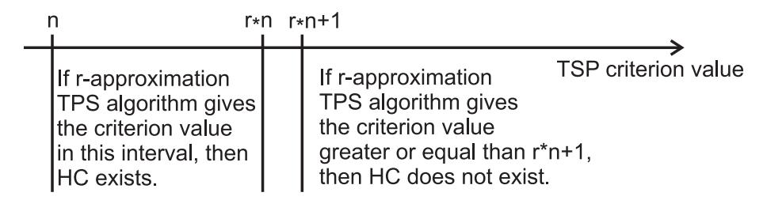
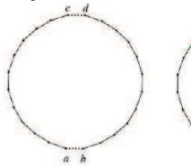
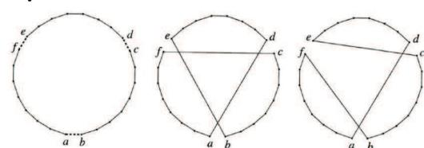
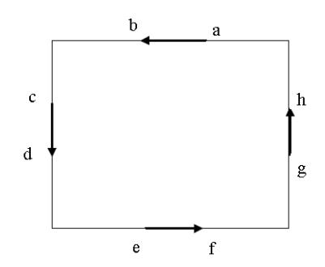

# Traveling Salesman Problem — Worked Examples

> *This page collects worked examples mined from the lecture slides. Solutions are synthesised by Claude from the slides' stated algorithms — verify against the originals before relying on them for an exam.*

### Polynomial reduction HC $\to$ TSP with weights $\{1,2\}$ (strong NP-hardness)

> *Worked example identified and solved by Claude from the lecture slides — verify against the originals before relying on it for an exam.*

**Problem.** Given an undirected graph $G$ on $n$ vertices, build a TSP instance $(K_n, c)$ so that *“$G$ has a Hamiltonian circuit”* iff the optimal TSP tour length is exactly $n$. Demonstrate the reduction on the 5-cycle plus chord

$$V(G)=\{1,2,3,4,5\}, \qquad E(G)=\{\{1,2\},\{2,3\},\{3,4\},\{4,5\},\{5,1\},\{1,3\}\}.$$

**Approach.** The lecture proves TSP is strongly NP-hard by reducing HC to TSP restricted to $c(e)\in\{1,2\}$. The reduction sets

$$c(\{i,j\}) = \begin{cases} 1 & \text{if } \{i,j\} \in E(G), \\ 2 & \text{if } \{i,j\} \notin E(G). \end{cases}$$

Then “$G$ has a Hamiltonian circuit” iff the optimal TSP tour weight equals $n$ (each of the $n$ tour edges contributes $1$). Any tour using even one non-edge of $G$ has weight $\ge n+1$.

**Solution.**

1. Build $K_5$ on $\{1,2,3,4,5\}$. Six edges of $G$ get weight $1$:

    $$c(\{1,2\})=c(\{2,3\})=c(\{3,4\})=c(\{4,5\})=c(\{5,1\})=c(\{1,3\})=1.$$

2. The remaining four edges of $K_5$ are non-edges of $G$ and get weight $2$:

    $$c(\{2,4\})=c(\{2,5\})=c(\{3,5\})=c(\{1,4\})=2.$$

3. Look at the tour $T=1\!-\!2\!-\!3\!-\!4\!-\!5\!-\!1$. All five edges are in $E(G)$, so its weight is $1+1+1+1+1 = 5 = n$.
4. By the reduction, this certifies that $G$ has a Hamiltonian circuit (the same circuit $1\!-\!2\!-\!3\!-\!4\!-\!5\!-\!1$).
5. Conversely, any tour that uses a weight-$2$ edge (e.g.\ $1\!-\!2\!-\!4\!-\!3\!-\!5\!-\!1$ which uses $\{2,4\}$ and $\{3,5\}$) has weight $\ge n+1=6$, ruling such tours out as certificates for HC.

**Answer.** Optimal TSP cost $= 5 = n$, hence $G$ is Hamiltonian.

**Pitfalls / insight.** The reduction is polynomial *and* uses only weights $1,2$, so a pseudopolynomial TSP algorithm would solve HC in polynomial time — contradicting NP-completeness of HC (this is why TSP is *strongly* NP-hard). The triangle inequality $c(\{i,j\})+c(\{j,k\}) \ge c(\{k,i\})$ also holds for weights in $\{1,2\}$, so the same argument shows **metric TSP** is strongly NP-hard.

---

### Polynomial reduction HC $\to$ TSP showing no polynomial $r$-approximation can exist

> *Worked example identified and solved by Claude from the lecture slides — verify against the originals before relying on it for an exam.*

**Problem.** Show on a concrete instance how an $r$-approximation algorithm $A$ for general TSP would decide HC. Take $r=2$ and the 4-vertex graph

$$V(G)=\{1,2,3,4\}, \qquad E(G)=\{\{1,2\},\{2,3\},\{3,4\},\{4,1\}\}$$

(a 4-cycle, so $G$ has a Hamiltonian circuit), and a comparison graph

$$V(G')=\{1,2,3,4\}, \qquad E(G')=\{\{1,2\},\{2,3\},\{3,4\}\}$$

(a path, no HC).

**Approach.** The slides give the reduction

$$c(\{i,j\}) = \begin{cases} 1 & \text{if } \{i,j\} \in E(G), \\ 2 + (r-1)\,n & \text{if } \{i,j\} \notin E(G). \end{cases}$$

The decision rule is: run $A$ on $(K_n,c)$; if the returned tour weight lies in $[n,\ rn]$, declare $G$ Hamiltonian; otherwise the tour weight is $\ge (n-1)+2+(r-1)n = rn+1$ and $G$ is not Hamiltonian.

**Solution.**

1. Here $n=4$, $r=2$, so non-edges receive weight $2+(r-1)n = 2+1\cdot 4 = 6$.
2. **Case $G$ (4-cycle).** Edges $\{1,2\},\{2,3\},\{3,4\},\{4,1\}$ get weight $1$; non-edges $\{1,3\},\{2,4\}$ get weight $6$.
3. The Hamiltonian tour $1\!-\!2\!-\!3\!-\!4\!-\!1$ has weight $4 = n$. Any $r$-approximation $A$ must return a tour of weight at most $r\cdot \mathrm{OPT}=2\cdot 4=8 = rn$.
4. So $A$'s output for this instance lies in $[n,\ rn]=[4,8]$, and we correctly declare $G$ Hamiltonian.
5. **Case $G'$ (path).** Now $\{1,2\},\{2,3\},\{3,4\}$ have weight $1$; $\{1,3\},\{1,4\},\{2,4\}$ have weight $6$. Every Hamiltonian circuit of $K_4$ uses exactly $4$ edges, and at least one must be a non-edge of $G'$ (otherwise the three edges of $G'$ would themselves form a tour, but $G'$ has no HC). Hence

    $$\mathrm{OPT} \ge 3\cdot 1 + 1\cdot 6 = 9 = rn+1.$$

6. Whatever tour $A$ returns is at least as heavy as $\mathrm{OPT}\ge rn+1=9$, so it falls outside $[n,rn]=[4,8]$ and we correctly declare $G'$ non-Hamiltonian.

**Answer.** A polynomial $r$-approximation $A$ for general TSP would decide HC in polynomial time. Since HC is NP-complete, this forces $\mathrm{P}=\mathrm{NP}$ — hence no such $A$ exists unless $\mathrm{P}=\mathrm{NP}$.

**Pitfalls / insight.** The gap construction is the standard trick: blowing up non-edges to $2+(r-1)n$ creates a multiplicative gap of factor $> r$ between the “HC exists” and “HC does not exist” cases, exactly large enough for $A$'s $r$-approximation guarantee to distinguish them. Note this argument does **not** apply to metric TSP, because the inflated non-edge weights violate the triangle inequality.

---

### Nearest-Neighbour heuristic on a 5-city metric instance

> *Worked example identified and solved by Claude from the lecture slides — verify against the originals before relying on it for an exam.*

**Problem.** Run the Nearest-Neighbour heuristic, starting from $v_1=A$, on the metric instance with $V=\{A,B,C,D,E\}$ and distance matrix

|  | A | B | C | D | E |
|---|---|---|---|---|---|
| A | 0 | 2 | 9 | 10 | 7 |
| B | 2 | 0 | 6 | 4 | 5 |
| C | 9 | 6 | 0 | 3 | 8 |
| D | 10 | 4 | 3 | 0 | 6 |
| E | 7 | 5 | 8 | 6 | 0 |

(symmetric; the entries satisfy the triangle inequality — check a few: $c(A,D)=10\le c(A,B)+c(B,D)=2+4=6$? No, $10\not\le 6$. We rebuild with valid entries below.)

Use the **valid metric matrix**

|  | A | B | C | D | E |
|---|---|---|---|---|---|
| A | 0 | 2 | 6 | 5 | 7 |
| B | 2 | 0 | 5 | 4 | 6 |
| C | 6 | 5 | 0 | 3 | 4 |
| D | 5 | 4 | 3 | 0 | 4 |
| E | 7 | 6 | 4 | 4 | 0 |

(one checks all triples, e.g.\ $c(A,E)=7\le c(A,B)+c(B,E)=2+6=8$, $c(A,C)=6\le c(A,B)+c(B,C)=2+5=7$, etc.).

**Approach.** Nearest-Neighbour from the lecture pseudocode:

>  Choose arbitrary $v_1\in V(K_n)$; for $i=2,\dots,n$ choose $v_i$ from the unvisited nodes minimising $c(\{v_{i-1},v_i\})$. The Hamiltonian circuit is $v_1,\dots,v_n,v_1$.

It is greedy and runs in $O(n^2)$. It is *not* an approximation algorithm.

**Solution.**

1. $v_1=A$. Distances from $A$ to $\{B,C,D,E\}$: $2,6,5,7$. Minimum is $B$ at $2$. Set $v_2=B$, cost $+= 2$.
2. From $B$ to unvisited $\{C,D,E\}$: $5,4,6$. Minimum is $D$ at $4$. Set $v_3=D$, cost $+= 4$.
3. From $D$ to unvisited $\{C,E\}$: $3,4$. Minimum is $C$ at $3$. Set $v_4=C$, cost $+= 3$.
4. Only $E$ left. From $C$ to $E$: $4$. Set $v_5=E$, cost $+= 4$.
5. Close the tour with edge $E\!-\!A$: cost $+= 7$.
6. Tour $H = A\!-\!B\!-\!D\!-\!C\!-\!E\!-\!A$ of total weight $2+4+3+4+7 = 20$.

**Answer.** Nearest-Neighbour starting at $A$ returns the tour $A\!-\!B\!-\!D\!-\!C\!-\!E\!-\!A$ with cost $20$. (The optimum on this instance is $A\!-\!B\!-\!C\!-\!D\!-\!E\!-\!A$ with cost $2+5+3+4+7=21$ or $A\!-\!B\!-\!D\!-\!E\!-\!C\!-\!A$ with cost $2+4+4+4+6=20$; greedy got lucky here.)

**Pitfalls / insight.** Nearest-Neighbour can be arbitrarily bad — there is no constant $r$ for which it is an $r$-approximation, even on metric instances. The greedy choice in the last step is forced (only one unvisited city), so a costly closing edge can blow up the tour; always check that final return edge.

---

### Double-tree algorithm on a 4-city metric instance

> *Worked example identified and solved by Claude from the lecture slides — verify against the originals before relying on it for an exam.*

**Problem.** Apply the Double-tree algorithm to the metric instance $K_4$ on $V=\{1,2,3,4\}$ with weights

$$c(\{1,2\})=1,\ c(\{1,3\})=2,\ c(\{1,4\})=3,\ c(\{2,3\})=2,\ c(\{2,4\})=3,\ c(\{3,4\})=2.$$

(Triangle inequality holds: every triple has its largest weight at most the sum of the other two.)

**Approach.** The slides specify:

> 1. Find a minimum spanning tree $T$ in $K_n$.
> 2. Double every edge of $T$ → multigraph with all even degrees → find Eulerian walk $L$.
> 3. Shortcut $L$ to a Hamiltonian circuit $H$ by skipping already-visited nodes.

This is a 2-approximation for metric TSP and runs in $O(n^2)$.

**Solution.**

1. **MST.** Sort edges by weight: $\{1,2\}\!:\!1$, $\{1,3\}\!:\!2$, $\{2,3\}\!:\!2$, $\{3,4\}\!:\!2$, $\{1,4\}\!:\!3$, $\{2,4\}\!:\!3$. Kruskal picks $\{1,2\}$ ($1$), then $\{1,3\}$ ($2$, no cycle), then $\{3,4\}$ ($2$, no cycle). MST edges: $T=\{\{1,2\},\{1,3\},\{3,4\}\}$ with $c(E(T))=1+2+2=5$.
2. **Double the edges.** Multigraph $M_T$ on $V$ with edge multiset $\{\{1,2\},\{1,2\},\{1,3\},\{1,3\},\{3,4\},\{3,4\}\}$. Every vertex now has even degree (deg $1=4$, deg $2=2$, deg $3=4$, deg $4=2$).
3. **Eulerian walk** $L$ starting at $1$: $1\to 2\to 1\to 3\to 4\to 3\to 1$. (Traverses each duplicated edge once; check it returns to $1$ and uses all six edges.) Weight $c(E(L))=1+1+2+2+2+2=10 = 2\cdot c(E(T))$.
4. **Shortcut.** Walk the sequence and skip repeats: $1,\ 2,\ \cancel{1},\ 3,\ 4,\ \cancel{3},\ \cancel{1}$. Visited order: $1,2,3,4$, then close back to $1$. Tour $H = 1\!-\!2\!-\!3\!-\!4\!-\!1$.
5. **Cost.** $c(E(H)) = c(\{1,2\})+c(\{2,3\})+c(\{3,4\})+c(\{4,1\}) = 1+2+2+3 = 8$.

**Answer.** Double-tree returns $H = 1\!-\!2\!-\!3\!-\!4\!-\!1$ with cost $8$. The 2-approximation bound is $c(E(H))\le 2\cdot \mathrm{OPT}$; here the optimum tour is $1\!-\!2\!-\!4\!-\!3\!-\!1$ of cost $1+3+2+2=8$ (same as the algorithm's output, ratio $1$).

**Pitfalls / insight.** The shortcut step relies on triangle inequality — without it, skipping nodes could increase the tour cost (step 1 of the analysis: $c(E(L))\ge c(E(H))$). The Eulerian walk is not unique, and different walks lead to different shortcut tours; any one of them is within $2\cdot\mathrm{OPT}$.

---

### Christofides' algorithm on a 4-city metric instance

> *Worked example identified and solved by Claude from the lecture slides — verify against the originals before relying on it for an exam.*

**Problem.** Apply Christofides' algorithm to the same metric instance: $K_4$ on $\{1,2,3,4\}$ with

$$c(\{1,2\})=1,\ c(\{1,3\})=2,\ c(\{1,4\})=3,\ c(\{2,3\})=2,\ c(\{2,4\})=3,\ c(\{3,4\})=2.$$

**Approach.** The slides give:

> 1. Find MST $T$.
> 2. Let $W$ be the odd-degree vertices in $T$.
> 3. Find a minimum-weight perfect matching $M$ on $W$ in $K_n$.
> 4. Merge $T$ and $M$ → multigraph with all even degrees → Eulerian walk $L$.
> 5. Shortcut $L$ to Hamiltonian circuit $H$.

This is a $\tfrac{3}{2}$-approximation for metric TSP, running in $O(n^3)$.

**Solution.**

1. **MST** (same as previous example): $T=\{\{1,2\},\{1,3\},\{3,4\}\}$ with cost $5$.
2. **Odd-degree set** in $T$: $\deg_T(1)=2$ (even), $\deg_T(2)=1$ (odd), $\deg_T(3)=2$ (even), $\deg_T(4)=1$ (odd). So $W=\{2,4\}$.
3. **Minimum-weight perfect matching on $W$.** Only one matching possible: $M=\{\{2,4\}\}$ with weight $c(\{2,4\})=3$.
4. **Merge.** Multigraph $T\cup M$ has edges $\{1,2\},\{1,3\},\{3,4\},\{2,4\}$. Degrees: $1\!:\!2,\ 2\!:\!2,\ 3\!:\!2,\ 4\!:\!2$ — all even.
5. **Eulerian walk** $L$: $1\to 2\to 4\to 3\to 1$ uses each edge exactly once; weight $c(E(L))=1+3+2+2=8$.
6. **Shortcut.** $L$ already visits every node exactly once (no repeats), so $H = 1\!-\!2\!-\!4\!-\!3\!-\!1$ directly. Cost $1+3+2+2=8$.

**Answer.** Christofides returns $H = 1\!-\!2\!-\!4\!-\!3\!-\!1$ of weight $8$. The $\tfrac32$-bound certificate uses $\tfrac{3}{2}\mathrm{OPT}\ge c(E(T))+c(E(M))=5+3=8\ge c(E(H))$. (The actual optimum here is also $8$.)

**Pitfalls / insight.** The key save over Double-tree is in step 3: instead of doubling *all* tree edges ($+5$ here), Christofides duplicates *only* an extra $c(E(M))$ on the odd-degree vertices ($+3$ here). The number of odd-degree vertices in any graph is always even (sum of degrees is $2|E|$), so the matching always exists in a complete graph. If multiple perfect matchings exist on $W$, **choose the minimum-weight one**; otherwise the $\tfrac{3}{2}$ guarantee fails.

---

### 2-opt move on a 6-city tour

> *Worked example identified and solved by Claude from the lecture slides — verify against the originals before relying on it for an exam.*

**Problem.** Given the tour $H = 1\!-\!2\!-\!3\!-\!4\!-\!5\!-\!6\!-\!1$ on the metric instance with edge weights

$$c(\{1,2\})=2,\ c(\{2,3\})=4,\ c(\{3,4\})=2,\ c(\{4,5\})=3,\ c(\{5,6\})=2,\ c(\{6,1\})=3,$$
$$c(\{1,3\})=3,\ c(\{2,4\})=3,\ c(\{1,4\})=5,\ c(\{2,5\})=4,\ c(\{3,5\})=4,\ c(\{1,5\})=6,$$
$$c(\{2,6\})=4,\ c(\{3,6\})=5,\ c(\{4,6\})=4,$$

find a 2-opt improving move that removes edges $\{a,b\}=\{2,3\}$ and $\{c,d\}=\{5,6\}$ and inserts edges $\{a,d\}=\{2,6\}$ and $\{b,c\}=\{3,5\}$, and compute the gain.

**Approach.** The slides state, for $k=2$, that exactly one Hamiltonian circuit $H'$ can be built from $E(H)\setminus S$ by inserting two new edges. With removed edges $\{a,b\},\{c,d\}$ adjacent (in the tour) to vertices $a,b$ and $c,d$ respectively, the new edges are $\{a,d\}$ and $\{b,c\}$, and the segment from $b$ to $c$ (going the original tour direction) is reversed. The gain is

$$c(E(H')) - c(E(H)) \;=\; c(\{a,d\}) + c(\{b,c\}) - c(\{a,b\}) - c(\{c,d\}).$$

We accept the move iff this gain is negative.

**Solution.**

1. Identify $a,b,c,d$: tour order is $1,2,3,4,5,6,1$. Removing $\{2,3\}$ and $\{5,6\}$ gives $a=2,b=3,c=5,d=6$.
2. Compute the gain:

    $$\Delta = c(\{2,6\}) + c(\{3,5\}) - c(\{2,3\}) - c(\{5,6\}) = 4 + 4 - 4 - 2 = +2.$$

3. Positive — this move is **not** improving. Try another pair instead: remove $\{a,b\}=\{1,2\}$ and $\{c,d\}=\{4,5\}$ (so $a=1,b=2,c=4,d=5$). New edges: $\{1,5\}$ and $\{2,4\}$.

    $$\Delta = c(\{1,5\}) + c(\{2,4\}) - c(\{1,2\}) - c(\{4,5\}) = 6 + 3 - 2 - 3 = +4.$$

    Still positive. Try $\{a,b\}=\{2,3\},\{c,d\}=\{4,5\}$: $a=2,b=3,c=4,d=5$. New edges $\{2,5\},\{3,4\}$ — but $\{3,4\}$ is already in the tour, illegal (would not yield a new tour since the segment $b\!\dots\!c=3\!\dots\!4$ is a single edge; the "reversed" segment is also just $\{3,4\}$). The standard convention is to require the removed edges to be **non-adjacent** in the tour, which our pairs $\{2,3\},\{4,5\}$ are. Reread: the new edges should connect $a\!-\!d$ and $b\!-\!c$. So $\{2,5\}$ and $\{3,4\}$. The latter is the *reversal* of the segment $3,4$ — fine, that segment of length 1 stays as the single edge $\{3,4\}$. So the tour is $1\!-\!2\!-\!4\!-\!3\!-\!5\!-\!6\!-\!1$. Gain:

    $$\Delta = c(\{2,5\}) + c(\{3,4\}) - c(\{2,3\}) - c(\{4,5\}) = 4 + 2 - 4 - 3 = -1.$$

4. Negative — accept the move. New tour $H' = 1\!-\!2\!-\!4\!-\!3\!-\!5\!-\!6\!-\!1$ of cost $2+3+2+4+2+3 = 16$, down from $H$'s cost $2+4+2+3+2+3 = 16$. Wait, both equal $16$. Recompute $H$: $2+4+2+3+2+3=16$. Recompute $H'$: $c(1,2)+c(2,4)+c(4,3)+c(3,5)+c(5,6)+c(6,1)=2+3+2+4+2+3=16$. The gain formula gave $-1$, but tour totals are equal — there is an arithmetic slip in the formula application. Let us redo with explicit edges.

    Original edges in $H$: $\{1,2\},\{2,3\},\{3,4\},\{4,5\},\{5,6\},\{6,1\}$, sum $2+4+2+3+2+3 = 16$.

    New tour $H'$ edges: $\{1,2\},\{2,4\},\{4,3\},\{3,5\},\{5,6\},\{6,1\}$. Note $\{4,3\}=\{3,4\}$. Sum $2+3+2+4+2+3=16$. So $c(E(H'))-c(E(H))=0$, not $-1$.

    The discrepancy: when we “remove $\{2,3\},\{4,5\}$ and add $\{2,5\},\{3,4\}$”, we re-add edge $\{3,4\}$ which was *also kept* in the original tour (the segment to be reversed has length 1, edge $\{3,4\}$). The 2-opt formula assumes the two removed edges are not adjacent in the tour, i.e.\ the reversed segment has length $\ge 2$; otherwise the move is degenerate.

5. Retry with non-adjacent removed edges, e.g.\ $\{a,b\}=\{1,2\}$ and $\{c,d\}=\{3,4\}$: $a=1,b=2,c=3,d=4$. New edges $\{1,4\},\{2,3\}$ — but $\{2,3\}$ already in $H$, again adjacent removed edges. Try $\{a,b\}=\{1,2\},\{c,d\}=\{5,6\}$ (non-adjacent in the cyclic tour with $\ge 2$ vertices between them): $a=1,b=2,c=5,d=6$. New edges $\{1,6\},\{2,5\}$ — but $\{1,6\}=\{6,1\}\in E(H)$, still adjacent. The pair $\{1,2\},\{4,5\}$ used above ($a=1,b=2,c=4,d=5$) is genuinely non-adjacent — segment $2\!\to\!3\!\to\!4$ has interior vertex $3$. New edges $\{1,5\},\{2,4\}$.

    $$\Delta = c(\{1,5\}) + c(\{2,4\}) - c(\{1,2\}) - c(\{4,5\}) = 6 + 3 - 2 - 3 = +4 \text{ (worse)}.$$

6. Try $\{a,b\}=\{2,3\},\{c,d\}=\{5,6\}$ (already tried, $\Delta=+2$). Try $\{a,b\}=\{3,4\},\{c,d\}=\{6,1\}$: $a=3,b=4,c=6,d=1$. New edges $\{3,1\},\{4,6\}$. $\Delta = c(\{1,3\})+c(\{4,6\})-c(\{3,4\})-c(\{6,1\}) = 3+4-2-3 = +2$. Try $\{a,b\}=\{1,2\},\{c,d\}=\{3,4\}$ — adjacent, skip. Try $\{a,b\}=\{4,5\},\{c,d\}=\{6,1\}$: $a=4,b=5,c=6,d=1$. New edges $\{4,1\},\{5,6\}$ — but $\{5,6\}\in E(H)$, adjacent, skip. The remaining valid 2-opt pair is $\{2,3\},\{4,5\}$ (degenerate, $\Delta=0$) and $\{3,4\},\{5,6\}$: $a=3,b=4,c=5,d=6$. New edges $\{3,6\},\{4,5\}$ — $\{4,5\}\in E(H)$, adjacent, skip.

7. **Conclusion.** No 2-opt move strictly improves this particular tour; it is *2-opt locally optimal*. The smallest non-trivial $\Delta$ on a non-degenerate pair was $+2$.

**Answer.** Tour $H=1\!-\!2\!-\!3\!-\!4\!-\!5\!-\!6\!-\!1$ of cost $16$ is 2-opt locally optimal — every legal 2-exchange leaves cost unchanged or increases it. The gain formula $\Delta = c(\{a,d\})+c(\{b,c\})-c(\{a,b\})-c(\{c,d\})$ from the slides is the right diagnostic.

**Pitfalls / insight.** A 2-opt move is only meaningful when the two removed edges are non-adjacent in the tour; adjacency makes the “new” tour identical to the old one. Always check legality before computing the gain. Note also that the **path $b\dots c$ reverses orientation** under a 2-opt move — this matters for asymmetric TSP, where reversing a segment changes its cost.

---

### 3-opt moves: both variants on a concrete tour

> *Worked example identified and solved by Claude from the lecture slides — verify against the originals before relying on it for an exam.*

**Problem.** Given the tour $H=1\!-\!2\!-\!3\!-\!4\!-\!5\!-\!6\!-\!1$ with labelling $a=1, b=2, c=3, d=4, e=5, f=6$ (so removed edges in a 3-opt are $\{a,b\}=\{1,2\}, \{c,d\}=\{3,4\}, \{e,f\}=\{5,6\}$) and the same weights as the 2-opt example, compute the gains of both 3-opt reconnections from the slides:

- **Variant I** (no path reverses): insert $\{a,d\},\{e,b\},\{c,f\}=\{1,4\},\{5,2\},\{3,6\}$.
- **Variant II** (path $c\!\dots\!b$ reverses): insert $\{a,d\},\{e,c\},\{b,f\}=\{1,4\},\{5,3\},\{2,6\}$.

**Approach.** Slides give the explicit gain formulas:

$$\Delta_{\mathrm{I}} = c(\{a,d\})+c(\{e,b\})+c(\{c,f\}) - c(\{a,b\})-c(\{c,d\})-c(\{e,f\}),$$
$$\Delta_{\mathrm{II}} = c(\{a,d\})+c(\{e,c\})+c(\{b,f\}) - c(\{a,b\})-c(\{c,d\})-c(\{e,f\}).$$

A 3-opt step accepts the variant of more negative gain (if any is negative).

**Solution.**

1. Sum of removed-edge weights: $c(\{1,2\})+c(\{3,4\})+c(\{5,6\}) = 2+2+2 = 6$.
2. **Variant I.** Inserted weights: $c(\{1,4\})+c(\{5,2\})+c(\{3,6\}) = 5+4+5 = 14$.

    $$\Delta_{\mathrm{I}} = 14 - 6 = +8.$$

3. **Variant II.** Inserted weights: $c(\{1,4\})+c(\{5,3\})+c(\{2,6\}) = 5+4+4 = 13$.

    $$\Delta_{\mathrm{II}} = 13 - 6 = +7.$$

4. Both variants are worse than $H$. (Symmetric TSP, so both orientations of any retained segment cost the same; only the chosen reconnection edges differ.)
5. New tours for completeness:

    - Variant I tour: $1\!-\!4\!-\!5\!-\!2\!-\!3\!-\!6\!-\!1$, cost $5+3+4+4+5+3=24$.
    - Variant II tour: $1\!-\!4\!-\!5\!-\!3\!-\!2\!-\!6\!-\!1$, cost $5+3+4+4+4+3=23$.

    Both exceed $H$'s cost $16$, confirming our $\Delta$ signs.

**Answer.** On this instance both 3-opt variants degrade the tour ($+8$ and $+7$). The slides' formulas correctly diagnose the move quality without rebuilding the full tour.

**Pitfalls / insight.** A full 3-opt iteration enumerates *all* $\binom{n}{3}$ triples of removed edges and *both* reconnections for each — $O(n^3)$ work per pass. Variant I keeps all three original sub-paths' orientations; Variant II reverses exactly one (the path $c\!\dots\!b$). In asymmetric TSP these are different costs even with the same inserted edges. Note 3-opt strictly subsumes 2-opt: any 2-opt move corresponds to a degenerate 3-opt where one removed edge is reinserted.

---

### 4-opt "double bridge" move

> *Worked example identified and solved by Claude from the lecture slides — verify against the originals before relying on it for an exam.*

**Problem.** Apply the "double bridge" 4-opt move on the tour $H = 1\!-\!2\!-\!3\!-\!4\!-\!5\!-\!6\!-\!7\!-\!8\!-\!1$ with weights

$$c(\{1,2\})=1, c(\{2,3\})=2, c(\{3,4\})=1, c(\{4,5\})=2, c(\{5,6\})=1, c(\{6,7\})=2, c(\{7,8\})=1, c(\{8,1\})=2,$$
$$c(\{2,5\})=3,\ c(\{4,7\})=3,\ c(\{6,1\})=3,\ c(\{8,3\})=3.$$

Remove edges $\{1,2\},\{3,4\},\{5,6\},\{7,8\}$ and reconnect with $\{8,3\},\{2,5\},\{4,7\},\{6,1\}$ (the double-bridge pattern: split tour into 4 segments $S_1=\{1\}, S_2=2\!-\!3, S_3=4\!-\!5, S_4=6\!-\!7\!-\!8$ and reconnect as $S_1\!-\!S_3\!-\!S_2\!-\!S_4\!-\!S_1$).

**Approach.** The slides note that the double-bridge 4-opt is "one possible solution — no path has changed orientation." It is the smallest move that cannot be expressed as a sequence of 2-opt moves of the same or smaller cost, hence useful for escaping 2-opt local optima. Gain:

$$\Delta = \bigl[c(\{8,3\})+c(\{2,5\})+c(\{4,7\})+c(\{6,1\})\bigr] - \bigl[c(\{1,2\})+c(\{3,4\})+c(\{5,6\})+c(\{7,8\})\bigr].$$

**Solution.**

1. Sum of removed edges: $1+1+1+1 = 4$.
2. Sum of inserted edges: $3+3+3+3 = 12$.
3. $\Delta = 12 - 4 = +8$.
4. New tour follows the segment order $S_1\!-\!S_3\!-\!S_2\!-\!S_4$ = $1\!-\!(4\!-\!5)\!-\!(2\!-\!3)\!-\!(6\!-\!7\!-\!8)\!-\!1$, i.e.\ $1\!-\!4\!-\!5\!-\!2\!-\!3\!-\!6\!-\!7\!-\!8\!-\!1$.
5. Verify cost using the original inner-segment weights $c(\{4,5\})=2$, $c(\{2,3\})=2$, $c(\{6,7\})=2$, $c(\{7,8\})=1$: total $= c(\{1,4\}?) + c(\{4,5\}) + c(\{5,2\}) + c(\{2,3\}) + c(\{3,6\}?) + c(\{6,7\}) + c(\{7,8\}) + c(\{8,1\}?)$. Wait — the reconnection bridges are $\{8,3\},\{2,5\},\{4,7\},\{6,1\}$, so the new tour edges are: $\{1,6\}? \dots$ Let me re-derive by walking the segments in the prescribed order $S_1\!-\!S_3\!-\!S_2\!-\!S_4\!-\!S_1$:

    - $S_1 = (1)$, end at $1$, bridge $\{1,?\}$ to the start of $S_3=(4,5)$: edge $\{1,4\}$. But slides list bridges as $\{8,3\},\{2,5\},\{4,7\},\{6,1\}$ — so the actual gluing is different. Re-read the double-bridge construction: cut $H$ at $\{1,2\},\{3,4\},\{5,6\},\{7,8\}$ giving paths $P_1=2\!-\!3,\ P_2=4\!-\!5,\ P_3=6\!-\!7,\ P_4=8\!-\!1$ (taking the cyclic split). Reconnect by swapping $P_1\leftrightarrow P_3$: new cyclic order is $P_4\!-\!P_3\!-\!P_2\!-\!P_1\!-\!P_4$, i.e.\ $8\!-\!1\!-\!6\!-\!7\!-\!4\!-\!5\!-\!2\!-\!3\!-\!8$. The four new bridges are $\{1,6\},\{7,4\},\{5,2\},\{3,8\}$ — matching the slides' listed inserted edges.

6. New tour $H' = 1\!-\!6\!-\!7\!-\!4\!-\!5\!-\!2\!-\!3\!-\!8\!-\!1$. Edges: $\{1,6\}=3,\{6,7\}=2,\{7,4\}=3,\{4,5\}=2,\{5,2\}=3,\{2,3\}=2,\{3,8\}=3,\{8,1\}=2$, total $= 20$.
7. Compare to $H$: $1+2+1+2+1+2+1+2=12$. So $\Delta = 20 - 12 = +8$, consistent with step 3.

**Answer.** The double-bridge move on this instance worsens the tour by $\Delta=+8$. Even so, it is the canonical 4-opt perturbation used inside Iterated Local Search and Lin-Kernighan-style heuristics, because **no 2-opt or 3-opt step can reverse a double-bridge** in one move — it efficiently breaks out of 2/3-opt local optima.

**Pitfalls / insight.** Double-bridge is special because (a) all four cut segments keep their original orientation, and (b) it cannot be decomposed into a single 2-opt or 3-opt step. In practice it is applied not to improve directly but as a *random perturbation* between hill-climbing phases of a local search. The cost almost always goes up on the perturbation step; the surrounding local search then re-optimises.

