# Scheduling — Worked Examples

> *This page collects worked examples mined from the lecture slides. Solutions are synthesised by Claude from the slides' stated algorithms — verify against the originals before relying on them for an exam.*

### 3-Partition decision instance (feasible)

> *Worked example identified and solved by Claude from the lecture slides — verify against the originals before relying on it for an exam.*

**Problem.** $A=\{4,5,5,5,5,6\}$, hence $m=2$, $B=15$, and the per-item bounds become $3.75 < a_i < 7.5$. Decide whether $A$ admits a 3-partition into $m=2$ disjoint subsets, each summing to $B=15$.

**Approach.** 3-Partition is the canonical strongly NP-complete problem used in the slides to prove that $1 \mid r_j, \widetilde{d}_j \mid C_{max}$ is strongly NP-hard. Per the note on the slide: if a feasible $A_j$ exists, it must contain exactly **three** integers (summing 4 elements would exceed $B$ because each $a_i > B/4$; summing 2 elements would fall short because each $a_i < B/2$).

**Solution.**

1. List the items: $4,5,5,5,5,6$.
2. Note that the total $4+5+5+5+5+6 = 30 = mB = 2\cdot 15$, so the cardinality/sum condition is satisfied.
3. Search for a triple summing to $15$. Trying $\{4,5,6\}$: $4+5+6 = 15$. ✓
4. The remaining three elements form $\{5,5,5\}$ with sum $5+5+5 = 15$. ✓

**Answer.** Feasible 3-partition: $A_1 = \{4,5,6\}$, $A_2 = \{5,5,5\}$.

**Pitfalls / insight.** The constraint $B/4 < a_i < B/2$ forces every feasible bin to contain exactly three items — this is what makes the "3"-Partition problem strongly NP-complete (whereas ordinary Partition is only weakly NP-hard). The slide leverages exactly this rigidity when reducing to scheduling.

---

### 3-Partition decision instance (infeasible)

> *Worked example identified and solved by Claude from the lecture slides — verify against the originals before relying on it for an exam.*

**Problem.** $A=\{4,4,4,6,6,6\}$, $m=2$, $B=15$. Decide whether a 3-partition exists.

**Approach.** Same as above: enumerate triples that sum to $B=15$, given each $a_i \in (3.75, 7.5)$.

**Solution.**

1. Total: $4+4+4+6+6+6 = 30 = mB$. ✓
2. Enumerate triples (3 fours and 3 sixes available):

    - $\{4,4,4\}$: sum $12 \ne 15$
    - $\{4,4,6\}$: sum $14 \ne 15$
    - $\{4,6,6\}$: sum $16 \ne 15$
    - $\{6,6,6\}$: sum $18 \ne 15$

3. No triple sums to $15$, so no feasible $A_1$ exists.

**Answer.** **No solution.**

**Pitfalls / insight.** A correct sum total ($\sum a_i = mB$) is necessary but not sufficient. The rigid "three items per bin" structure makes infeasibility easy to spot by exhaustion when $m$ is small.

---

### Bratley's Algorithm for $1\mid r_j, \widetilde{d}_j \mid C_{max}$

> *Worked example identified and solved by Claude from the lecture slides — verify against the originals before relying on it for an exam.*

**Problem.** Schedule four non-preemptive jobs on one machine, minimising $C_{max}$, while respecting release dates and deadlines:

$$r = (4,1,1,0), \qquad p = (2,1,2,2), \qquad \widetilde{d} = (8,5,6,4).$$

**Approach.** Bratley's algorithm is a Branch & Bound that enumerates permutations of tasks. Each node is labelled by *(task order)/(completion time of the last task)*. Bounding rules:

1. Eliminate a node whose completion exceeds any deadline — together with all its sibling branches that would also be forced to schedule the "critical" task too late.
2. Decomposition: if at level $k$ the completion of the last scheduled task is $\le r_i$ for every still-unscheduled task $T_i$, the subtree rooted at this node becomes a fresh, smaller, independent instance.
3. Termination by the **Block-with-Release-Time-Property (BRTP)**: if the suffix of $k$ tasks starting from $T_{[1]}$ runs without idle, $T_{[1]}$ starts at its release date, and $r_{[1]} \le r_{[i]}$ for all later $i$ in the block, the schedule is optimal.

**Solution.**

1. Root: enumerate the first task. Candidates: $T_4$ (only one ready at $t=0$), $T_2$, $T_3$ (ready at $t=1$ after one unit of idle), $T_1$ (ready at $t=4$ — clearly suboptimal as starting).
2. Branch $T_4$ first ($s_4=0$, $C_4=2 \le \widetilde{d}_4 = 4$ ✓).

    - Sub-branch $T_4 \to T_2$: $s_2=2$, $C_2=3 \le 5$ ✓.

        - $T_4 \to T_2 \to T_3$: $s_3=3$, $C_3=5 \le 6$ ✓. Then $T_1$: $s_1 = \max(5, r_1) = 5$, $C_1=7 \le 8$ ✓. Full schedule, $C_{max}=7$.
        - $T_4 \to T_2 \to T_1$: $T_1$ not ready until $t=4$, so $s_1=4$, $C_1=6$. Then $T_3$: $s_3=6$, $C_3=8$ but $\widetilde{d}_3=6$ ✗ — prune.

    - Sub-branch $T_4 \to T_3$: $s_3=2$, $C_3=4 \le 6$ ✓.

        - $T_4 \to T_3 \to T_2$: $s_2=4$, $C_2=5 \le 5$ ✓. Then $T_1$: $s_1=5$, $C_1=7$. Feasible, $C_{max}=7$.
        - $T_4 \to T_3 \to T_1$: $s_1=4$, $C_1=6$. Then $T_2$: $s_2=6$, $C_2=7$ but $\widetilde{d}_2=5$ ✗ — prune.

3. Check BRTP on $T_4 \to T_2 \to T_3 \to T_1$ with start times $0,2,3,5$ and completions $2,3,5,7$. Between consecutive jobs there is no idle (machine runs $[0,7)$). $T_4$ starts at $r_4=0$. Release dates in this order are $(0,1,1,4)$, all $\ge r_{[1]}=0$. **BRTP holds**, so the schedule is optimal.

**Answer.** Optimal sequence $T_4, T_2, T_3, T_1$ with start times $(0,2,3,5)$ and $C_{max}=7$. (The sequence $T_4, T_3, T_2, T_1$ is an alternative optimum.)

**Pitfalls / insight.** Always test the deadline at every node; one violation prunes the whole subtree *and* all siblings that share the critical task. The BRTP terminator is a sufficient (not necessary) optimality test — if it does not fire, you must continue search and tighten the bound by setting all $\widetilde{d}_i := \min(\widetilde{d}_i, C_{max}-\varepsilon)$.

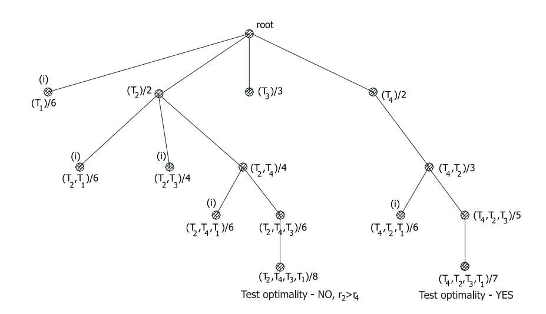

---

### Horn's Algorithm for $1 \mid pmtn, r_j \mid L_{max}$

> *Worked example identified and solved by Claude from the lecture slides — verify against the originals before relying on it for an exam.*

**Problem.** Four preemptive tasks on a single machine, minimising $L_{max}$:

$$\mathcal{T}=\{T_1,T_2,T_3,T_4\}, \quad p=(3,2,3,4), \quad r=(0,4,2,0), \quad d=(13,8,11,16).$$

**Approach.** Horn's algorithm = "EDD over currently-ready tasks", with preemption triggered whenever the set of ready tasks changes (i.e. at every new release date). At every $t_1$ we run the ready task with smallest due date $d_i$ until either it completes or a new task arrives (whichever is sooner).

**Solution.**

1. **$t=0$.** Ready: $\{T_1, T_4\}$. Earliest due: $T_1$ ($d_1=13 < d_4=16$). Next release at $t_2=2$ (task $T_3$). Run $T_1$ for $\delta=\min(p_1,t_2-t_1)=\min(3,2)=2$ in $[0,2)$. Remaining $p_1=1$.
2. **$t=2$.** Ready: $\{T_1, T_3, T_4\}$. Min $d$: $T_3$ ($d_3=11$). Next release at $t_2=4$ ($T_2$). Run $T_3$ for $\delta=\min(3,2)=2$ in $[2,4)$. Remaining $p_3=1$.
3. **$t=4$.** Ready: $\{T_1, T_2, T_3, T_4\}$. Min $d$: $T_2$ ($d_2=8$). No further release; $t_2=\infty$. Run $T_2$ for $\delta=\min(2,\infty)=2$ in $[4,6)$. $T_2$ completes.
4. **$t=6$.** Ready: $\{T_1, T_3, T_4\}$. Min $d$: $T_3$ ($d_3=11$). Run $T_3$ for the remaining $\delta=1$ in $[6,7)$. $T_3$ completes.
5. **$t=7$.** Ready: $\{T_1, T_4\}$. Min $d$: $T_1$. Run the remaining $\delta=1$ in $[7,8)$. $T_1$ completes.
6. **$t=8$.** Ready: $\{T_4\}$. Run $\delta=4$ in $[8,12)$. $T_4$ completes.

Completion times: $C_1=8, C_2=6, C_3=7, C_4=12$. Lateness:

$$L_1 = 8-13 = -5,\ L_2 = 6-8 = -2,\ L_3 = 7-11 = -4,\ L_4 = 12-16 = -4.$$

**Answer.** Gantt: $T_1[0,2)\,T_3[2,4)\,T_2[4,6)\,T_3[6,7)\,T_1[7,8)\,T_4[8,12)$. $L_{max} = -2$ (achieved by $T_2$).

**Pitfalls / insight.** Preemption can only happen at release dates — between two consecutive releases the currently-running task is the *EDD pick over the present ready set*, not over all tasks. Negative $L_{max}$ simply means the schedule is feasible with slack equal to $|L_{max}|$.

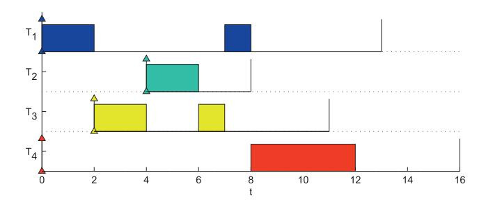

---

### Chetto-Silly-Bouchentouf transformation + EDF

> *Worked example identified and solved by Claude from the lecture slides — verify against the originals before relying on it for an exam.*

**Problem.** Solve $1 \mid pmtn, prec, r_j, d_j=\widetilde{d}_j \mid L_{max}$ on five tasks with

$$r = (0,3,2,6,3),\quad p = (2,3,2,2,3),\quad \widetilde{d}=d = (3,7,13,9,13),$$

and precedence relations $T_3 \prec T_5$, $T_4 \prec T_5$ (inferred from the slide's recalculated values).

**Approach.** Chetto–Silly–Bouchentouf turns dependent tasks into an *equivalent* independent set by tightening parameters:

- Release dates are pushed forward along precedence: $r'_j = \max\{r_j, \max_{T_h \in \mathrm{Pred}(T_j)}(r'_h + p_h)\}$, traversing the DAG topologically.
- Deadlines are pulled backward: $\widetilde{d}'_j = \min\{\widetilde{d}_j, \min_{T_k \in \mathrm{Succ}(T_j)}(\widetilde{d}'_k - p_k)\}$, traversing in reverse topological order.

Then **EDF** (Earliest Deadline First, with preemption) is run on the independent instance $(r', p, \widetilde{d}')$.

**Solution.**

1. **Update $r'$** (forward sweep). Tasks with no predecessors keep their $r$: $r'_1=0$, $r'_2=3$, $r'_3=2$, $r'_4=6$. For $T_5$ with predecessors $T_3, T_4$:

    $$r'_5 = \max\{r_5,\ r'_3+p_3,\ r'_4+p_4\} = \max\{3,\ 2+2,\ 6+2\} = 8.$$

    So $r' = (0,3,2,6,8)$.

2. **Update $\widetilde{d}'$** (backward sweep). Tasks with no successors keep their $\widetilde{d}$: $\widetilde{d}'_1=3$, $\widetilde{d}'_2=7$, $\widetilde{d}'_4=9$, $\widetilde{d}'_5=13$. For $T_3$ with successor $T_5$:

    $$\widetilde{d}'_3 = \min\{13,\ \widetilde{d}'_5 - p_5\} = \min\{13,\ 13-3\} = 10.$$

    For $T_4$ with successor $T_5$: $\widetilde{d}'_4 = \min\{9, 13-3\} = 9$ (unchanged). So $\widetilde{d}' = (3,7,10,9,13)$.

3. **Run EDF** on the independent instance.

    - $t=0$: ready $\{T_1\}$ ($\widetilde{d}'_1=3$). Run $T_1$ in $[0,2)$. $T_1$ done.
    - $t=2$: ready $\{T_3\}$ ($\widetilde{d}'_3=10$). Run $T_3$ in $[2,3)$.
    - $t=3$: $T_2$ arrives ($\widetilde{d}'_2=7 < 10$). Preempt; run $T_2$ in $[3,6)$. $T_2$ done.
    - $t=6$: ready $\{T_3(\text{1 remaining}), T_4\}$, deadlines $10$ vs $9$. Run $T_4$ in $[6,8)$. $T_4$ done.
    - $t=8$: ready $\{T_3, T_5\}$, deadlines $10$ vs $13$. Run $T_3$ remaining unit in $[8,9)$. $T_3$ done.
    - $t=9$: ready $\{T_5\}$. Run $T_5$ in $[9,12)$.

4. **Check lateness** against the original deadlines $d$:

    $$L_1=2-3=-1,\ L_2=6-7=-1,\ L_3=9-13=-4,\ L_4=8-9=-1,\ L_5=12-13=-1.$$

**Answer.** Gantt: $T_1[0,2)\,T_3[2,3)\,T_2[3,6)\,T_4[6,8)\,T_3[8,9)\,T_5[9,12)$. $L_{max} = -1$ — the schedule is feasible.

**Pitfalls / insight.** Always run EDF on the *modified* parameters, but evaluate $L_{max}$ against the *original* deadlines (the modification was just a trick to handle precedences). Note how a single transitive predecessor chain ($T_3 \prec T_5$ via $T_4$ is not the same as $T_3 \prec T_5$ directly) is propagated by repeatedly taking the max.

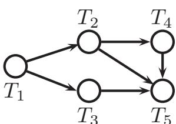

---

### McNaughton's Algorithm — Example 1

> *Worked example identified and solved by Claude from the lecture slides — verify against the originals before relying on it for an exam.*

**Problem.** Preemptive scheduling on $R=3$ identical parallel resources with $p=(2,3,2,3,2)$, minimising $C_{max}$.

**Approach.** McNaughton's algorithm achieves the trivial lower bound

$$C_{max}^* = \max\Bigl\{\max_i p_i,\ \tfrac{1}{R}\sum_i p_i\Bigr\}$$

by sweeping tasks left-to-right along a virtual "timeline of length $C_{max}^*$ wrapped around the $R$ machines": fit a task on the current machine if its remaining piece fits in the leftover space, otherwise split it across the wrap-around to the next machine. Each task is split at most once.

**Solution.**

1. Compute $C^*_{max} = \max\{3, 12/3\} = \max\{3,4\} = 4$.
2. Fill machine $P_1$ starting at $t=0$:

    - $T_1$ ($p_1=2$): fits in $[0,2)$.
    - $T_2$ ($p_2=3$): $2+3 = 5 > 4$. Place its first piece in $[2,4)$ on $P_1$ (2 units), carry $3-2=1$ unit to $P_2$.

3. Continue on $P_2$:

    - $T_2$ remainder (1 unit): $[0,1)$ on $P_2$.
    - $T_3$ ($p_3=2$): $1+2 \le 4$, place in $[1,3)$ on $P_2$.
    - $T_4$ ($p_4=3$): $3+3=6>4$. Place first piece in $[3,4)$ on $P_2$ (1 unit), carry $3-1=2$ units to $P_3$.

4. Continue on $P_3$:

    - $T_4$ remainder: $[0,2)$ on $P_3$.
    - $T_5$ ($p_5=2$): $2+2 \le 4$, place in $[2,4)$ on $P_3$.

**Answer.** Schedule (length $C_{max}=4$):

| Machine | Schedule |
|---------|----------|
| $P_1$   | $T_1[0,2)\,T_2[2,4)$ |
| $P_2$   | $T_2[0,1)\,T_3[1,3)\,T_4[3,4)$ |
| $P_3$   | $T_4[0,2)\,T_5[2,4)$ |

**Pitfalls / insight.** The two pieces of a split task must not overlap in time — placing the carried remainder at $t=0$ on the next machine while the head still runs on the previous machine works precisely because $C^*_{max} \ge \max_i p_i$. If you violated that bound, McNaughton would produce overlap, i.e. the task would run on two CPUs simultaneously.

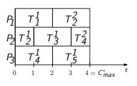

---

### McNaughton's Algorithm — Example 2 (the long-task case)

> *Worked example identified and solved by Claude from the lecture slides — verify against the originals before relying on it for an exam.*

**Problem.** $R=3$, $p=(10,8,4,14,1)$, minimise $C_{max}$.

**Approach.** Same as Example 1; the only difference is that here one task is *very* long.

**Solution.**

1. $C^*_{max} = \max\{14, 37/3\} = \max\{14, 12.33\} = 14$ — driven by $p_4$ itself.
2. $P_1$: $T_1$ $[0,10)$. $T_2$ ($p=8$) at $t=10$ would need until $18>14$: place piece $[10,14)$ on $P_1$ (4 units), carry $4$.
3. $P_2$: $T_2$ remainder $[0,4)$. $T_3$ $[4,8)$. $T_4$ ($p=14$): $8+14=22>14$: piece $[8,14)$ on $P_2$ (6 units), carry $8$.
4. $P_3$: $T_4$ remainder $[0,8)$. $T_5$ $[8,9)$.

**Answer.** $C_{max}=14$ with

| Machine | Schedule |
|---------|----------|
| $P_1$   | $T_1[0,10)\,T_2[10,14)$ |
| $P_2$   | $T_2[0,4)\,T_3[4,8)\,T_4[8,14)$ |
| $P_3$   | $T_4[0,8)\,T_5[8,9)$ |

**Pitfalls / insight.** When a single task's length dominates $\frac{1}{R}\sum p_i$, the makespan equals that task's processing time and the other machines may finish early — no algorithm can do better while keeping the tasks sequential.

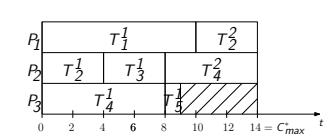

---

### Tight instance for the LS approximation factor

> *Worked example identified and solved by Claude from the lecture slides — verify against the originals before relying on it for an exam.*

**Problem.** For $R=4$ identical parallel machines and *no* precedences, exhibit an instance that attains the LS bound $r_{LS}=2-\frac{1}{R}=\frac{7}{4}$. The slide uses

$$n=(R-1)\cdot R + 1 = 13,\qquad p=(\underbrace{1,1,\dots,1}_{12},\ R)=(1,1,\dots,1,4).$$

**Approach.** List Scheduling assigns each task in list order to the currently earliest-free machine. By manipulating the order of the heavy task we get either the worst-case or the optimum.

**Solution.**

1. **Bad order $L = (T_n, T_1, \dots, T_{n-1})$**. Heavy task ($p=4$) goes first: schedule $T_n$ on $P_1$ for $[0,4)$. The remaining 12 unit tasks fill $P_2, P_3, P_4$ — each gets 4 unit tasks in time $[0,4)$. After $t=4$, all machines are free *except* that we still have used up all tasks. So $C_{max}^{LS} = 4 + 0 = 4$? Wait — at $t=0$ each machine grabs *one* task: $P_1 \leftarrow T_n$ (busy till 4), $P_2,P_3,P_4 \leftarrow T_1,T_2,T_3$ (busy till 1). At $t=1$ machines 2,3,4 take $T_4,T_5,T_6$ (busy till 2). And so on. After $t=4$ machines 2,3,4 have processed $4 \times 3 = 12$ unit tasks total — that's all of them. So $C^{LS}_{max} = 4$.

    Hmm — that ties the optimum. The Graham worst case actually uses the *good* list for LPT and the *bad* list as $L' = (T_1, T_2, \dots, T_n)$: unit tasks first.

2. **Worst-case order $L' = (T_1, \dots, T_{n-1}, T_n)$**. Process unit tasks first. At each tick all four machines pick one unit task; after $\lceil 12/4 \rceil = 3$ ticks, all 12 unit tasks are scheduled and all machines are idle at $t=3$. Then $T_n$ ($p=4$) is assigned to (say) $P_1$ and runs $[3,7)$. So $C^{LS}_{max} = 7$.

3. **Optimum.** Run $T_n$ on $P_1$ in $[0,4)$ in parallel with all 12 unit tasks distributed $4+4+4$ on $P_2,P_3,P_4$ in $[0,4)$. $C^*_{max} = 4$.

4. **Ratio.** $\frac{C^{LS}_{max}}{C^*_{max}} = \frac{7}{4} = 2 - \frac{1}{4} = r_{LS}$. The bound is attained.

**Answer.** With the bad list $L'$, $C^{LS}_{max} = 7$; with the optimal placement, $C^*_{max} = 4$; ratio $7/4$ matches Graham's worst case for $R=4$.

**Pitfalls / insight.** LS is sensitive to list order: placing the longest task *first* (LPT) protects you from the worst case here. The 12 unit tasks can be packed snugly only when the long task is started simultaneously with them.

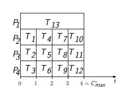

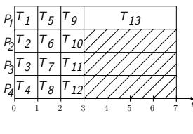

---

### Tight instance for the LPT approximation factor

> *Worked example identified and solved by Claude from the lecture slides — verify against the originals before relying on it for an exam.*

**Problem.** For $R=3$ machines, exhibit an instance attaining the LPT bound $r_{LPT}=\frac{4}{3}-\frac{1}{3R}=\frac{4}{3}-\frac{1}{9}=\frac{11}{9}$. The slide uses

$$n = 2R+1 = 7,\qquad p=(2R-1,2R-1,2R-2,2R-2,R+1,R+1,R)=(5,5,4,4,4,4,3).$$

**Approach.** LPT = LS with the list pre-sorted by non-increasing $p_i$. After sorting, LS greedily assigns each task to the machine with the smallest current load.

**Solution.**

1. Sort: $(5,5,4,4,4,4,3)$ — already sorted.
2. Run LPT:

    - $T_1$ ($p=5$) $\to P_1$, load $5$.
    - $T_2$ ($p=5$) $\to P_2$, load $5$.
    - $T_3$ ($p=4$) $\to P_3$, load $4$.
    - $T_4$ ($p=4$) $\to P_3$ (smallest load $4$), new load $8$.
    - $T_5$ ($p=4$) $\to P_1$ (loads $5,5,8$, smallest $P_1$ at $5$), new load $9$.
    - $T_6$ ($p=4$) $\to P_2$, new load $9$.
    - $T_7$ ($p=3$) $\to P_3$? Loads $9,9,8$ — smallest is $P_3$, new load $11$.

    $C^{LPT}_{max} = 11$.

3. **Optimum.** Pair big tasks with small ones: $\{T_1, T_3\}=(5,4)\to P_1$, $\{T_2, T_4\}=(5,4)\to P_2$, $\{T_5,T_6,T_7\}=(4,4,3)\to P_3$. Loads $9,9,9$. So $C^*_{max} = 9$.

4. **Ratio.** $\frac{11}{9} = \frac{4}{3} - \frac{1}{9} = r_{LPT}$. ✓

**Answer.** $C^{LPT}_{max}=11$ vs. $C^*_{max}=9$; ratio $\frac{11}{9}$ matches the Graham 1966 LPT bound for $R=3$.

**Pitfalls / insight.** The tight instance is built so that LPT is forced to put the small task $T_7$ on the machine that already has two big tasks — exactly the configuration that wastes one machine's slack. Note that $r_{LPT} < r_{LS}$ for all $R \ge 2$, confirming the benefit of pre-sorting.

---

### List Scheduling anomalies

> *Worked example identified and solved by Claude from the lecture slides — verify against the originals before relying on it for an exam.*

**Problem.** With $R=2$, $n=8$, $p=(3,4,2,4,4,2,13,2)$, list $L=(T_1,T_2,T_3,T_4,T_5,T_6,T_7,T_8)$, and the precedence DAG given on the slide (containing $T_3 \prec T_4$ among others), LS finds a schedule of length $C^*_{max}=17$. Show that *any of* the following innocent-looking changes can **increase** $C_{max}$:

1. Swap the order of $T_7$ and $T_8$ in $L$: $L=(T_1,T_2,T_3,T_4,T_5,T_6,T_8,T_7)$.
2. Remove the precedence constraint $T_3 \prec T_4$.
3. Decrease every $p_i$ by one unit.

**Approach.** This is the classical "Graham anomaly" demonstration: LS is not monotone in (a) list order, (b) precedence tightness, or (c) processing-time tightness. Each change can re-route the greedy assignments in a way that interleaves the long task ($T_7$, $p=13$) less efficiently with the rest.

**Solution.**

1. With the baseline list and DAG, the slide shows $C^*_{max}=17$ (the long task $T_7$ runs in parallel with a sequence of shorter tasks that exactly fill its 13 units after some prefix work).
2. **(Order change)** Swapping $T_7$ and $T_8$ pushes $T_7$ later in the list; now LS may start it after additional small tasks have already locked in the schedule on both processors, producing $C_{max} > 17$.
3. **(Precedence relaxation)** Removing $T_3 \prec T_4$ frees $T_4$ to be picked earlier — but earlier might mean it competes with $T_7$ for $P_2$, leaving $P_1$ idle and again $C_{max} > 17$.
4. **(Faster processing)** Decreasing each $p_i$ by one (so $p_7=12$ etc.) shifts every completion forward, but the freed slots get filled by *different* tasks than in the original schedule; the resulting interleaving can again be worse than the baseline.

**Answer.** Each anomaly transforms a $C^*_{max}=17$ schedule into a *longer* one despite the change being "favourable" in a naive sense. The slide's Gantt charts (see figures) display the new makespans.

**Pitfalls / insight.** Approximation factor $r_{LS} = 2 - 1/R$ bounds the *worst case versus optimum*; nothing forbids a particular LS run from getting worse when the input is "improved". Practical implication: do not rely on monotone behaviour of LS / LPT — small perturbations need to be re-solved from scratch.

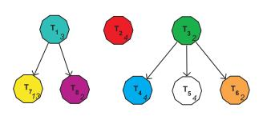

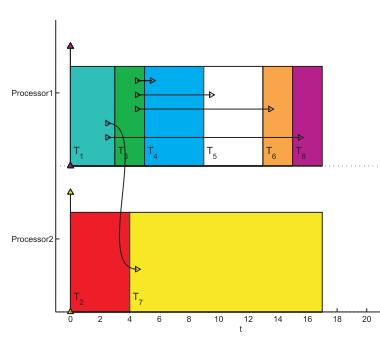

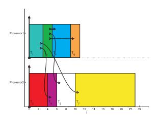

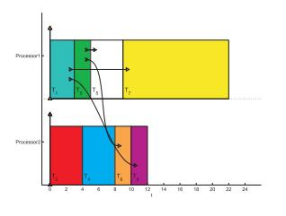

---

### Rothkopf's Dynamic Programming for $P\mid\mid C_{max}$

> *Worked example identified and solved by Claude from the lecture slides — verify against the originals before relying on it for an exam.*

**Problem.** Schedule $n=3$ tasks with $p=(2,1,2)$ on $R=2$ identical machines, $UB=5$.

**Approach.** Rothkopf's DP builds a binary table $x_i(t_1,t_2)$ where $t_v$ is the "current load" of machine $v$. Recurrence:

$$x_i(t_1,t_2) = \bigvee_{v=1}^{R} x_{i-1}(t_1,\dots,t_v - p_i,\dots,t_R).$$

After filling for $i=1\dots n$, the optimal makespan is

$$C^*_{max} = \min_{\substack{t_1,t_2:\\ x_n(t_1,t_2)=1}} \max\{t_1,t_2\}.$$

Time complexity $O(n \cdot UB^R)=O(3 \cdot 25)$.

**Solution.**

1. **$i=0$**: $x_0(0,0)=1$, all others $0$.
2. **$i=1$**, $p_1=2$. $x_1(t_1,t_2) = x_0(t_1-2,t_2) \vee x_0(t_1,t_2-2)$. So $x_1(2,0)=1$ and $x_1(0,2)=1$.
3. **$i=2$**, $p_2=1$. $x_2(t_1,t_2) = x_1(t_1-1,t_2) \vee x_1(t_1,t_2-1)$. From $(2,0)$: get $(3,0)$ and $(2,1)$. From $(0,2)$: get $(1,2)$ and $(0,3)$. So $x_2=1$ at $\{(3,0),(2,1),(1,2),(0,3)\}$.
4. **$i=3$**, $p_3=2$. $x_3(t_1,t_2) = x_2(t_1-2,t_2) \vee x_2(t_1,t_2-2)$. From $(3,0)$: $(5,0),(3,2)$. From $(2,1)$: $(4,1),(2,3)$. From $(1,2)$: $(3,2),(1,4)$. From $(0,3)$: $(2,3),(0,5)$. So $x_3=1$ at $\{(5,0),(4,1),(3,2),(2,3),(1,4),(0,5)\}$.
5. Read off optimum: $\min \max(t_1,t_2) = \min\{5,4,3,3,4,5\} = 3$, attained at $(3,2)$ or $(2,3)$.
6. **Reconstruct schedule** for $(3,2)$: came from $(1,2)$ via $t_1 := t_1+2$, i.e. $T_3$ on $P_1$. State $(1,2)$ came from $(0,2)$ via $t_1+=1$, i.e. $T_2$ on $P_1$. State $(0,2)$ came from $(0,0)$ via $t_2+=2$, i.e. $T_1$ on $P_2$.

**Answer.** $C^*_{max}=3$. One optimal assignment: $T_1$ on $P_2$ in $[0,2)$; $T_2$ on $P_1$ in $[0,1)$; $T_3$ on $P_1$ in $[1,3)$.

**Pitfalls / insight.** The DP table is $UB^R = 25$ cells per task; this is the source of pseudo-polynomiality (polynomial in $UB$ when $R$ is fixed, exponential in $R$). For fixed $R=2$ this remains a weakly NP-hard regime where Rothkopf is the textbook exact method.

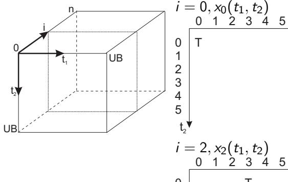

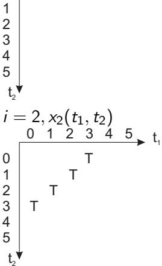

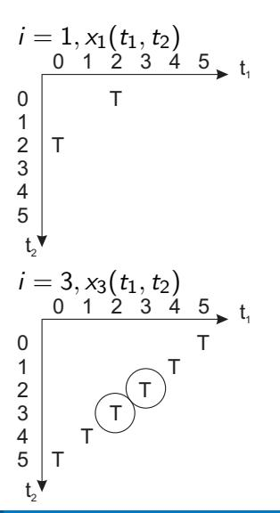

---

### Muntz & Coffman's Level Algorithm for $P\mid pmtn, prec \mid C_{max}$

> *Worked example identified and solved by Claude from the lecture slides — verify against the originals before relying on it for an exam.*

**Problem.** Schedule a precedence-constrained preemptive task set on $R=2$ identical machines using Muntz–Coffman levels. The instance (read from the slide) has $n=8$ tasks with starting processing times and the DAG drawn in the slide; initial levels are computed from the longest path to a leaf.

**Approach.** At each event time $t$ the algorithm:

1. computes the **level** $\ell_j$ of each remaining task = $p_j$ + longest remaining work to a terminal task,
2. forms $\mathcal{Z}$ = currently-free tasks (all predecessors completed),
3. picks $\mathcal{S} \subseteq \mathcal{Z}$ = tasks with the highest level; if $|\mathcal{S}| > h$ (free resources) each gets the *shared* fractional capacity $\beta = h/|\mathcal{S}|$, otherwise one full machine each ($\beta=1$),
4. advances time by $\delta$ until **either** some task finishes, **or** the level of a higher-priority shared task drops to that of a not-yet-scheduled one, **or** a fast-rate task's remaining level drops below a slow-rate task's level,
5. updates remaining processing times by $\delta\beta$ and repeats.

Finally, McNaughton's algorithm is used to re-schedule the fractional intervals into concrete machine assignments.

**Solution.** (Following the slide's reported trace.)

1. **$t=0$**: free set $\mathcal{Z}=\{T_2\}$ at top level (say level $9$). With $h=2$ free machines and $|\mathcal{S}|=1$, assign one machine to $T_2$ at full rate ($\beta=1$). The remaining machine is given to the next-highest level pair $\mathcal{S}=\{T_1, T_3\}$ but at fractional rate $\beta=\tfrac{1}{2}$ each. Advance until case (3) fires at $\delta=2$ — the fast-running $T_2$'s level reaches that of $T_1,T_3$.
2. **$t=2$**: state $p=(2,2,2,5,3,1,2,0)$ (slide), levels $(7,7,7,5,5,1,2,0)$, $\mathcal{Z}=\{T_1,T_2,T_3\}$ all tied at the top. With three top-level tasks but only $h=2$ machines, $\beta=\tfrac{2}{3}$ to each of $T_1,T_2,T_3$. Advance by $\delta=3$ (case (1): one of them finishes, since $2/(\tfrac{2}{3})=3$).
3. **$t=5$**: $T_1,T_2,T_3$ all complete simultaneously. Now successors $T_4, T_5$ are free with levels $(3,1)$ (after the $3\cdot\tfrac{2}{3}=2$ units of work each). Continue assigning full machines to highest levels…
4. (The slide collapses further details into the final Gantt; the key takeaways are the two events $\delta=2$ (case 3) and $\delta=3$ (case 1).)
5. Apply McNaughton's wrap-around to the fractional segments to obtain a feasible non-overlapping Gantt chart.

**Answer.** The algorithm produces an exact optimal schedule because for $R=2$ Muntz–Coffman is exact on $P2 \mid pmtn, prec \mid C_{max}$. The slide's Gantt depicts the final concrete makespan.

**Pitfalls / insight.** The fractional-rate trick is just bookkeeping — physically, two tasks sharing one machine at rate $\tfrac{1}{2}$ means alternating preemptions whose total CPU time equals half the wall-clock interval. The three event types $\delta$-cases are how the algorithm decides when re-evaluation is necessary; ignoring case (3) is a common student mistake.

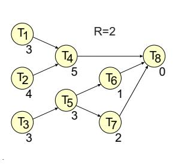

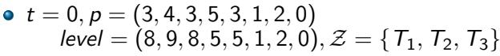

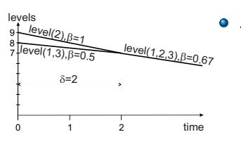

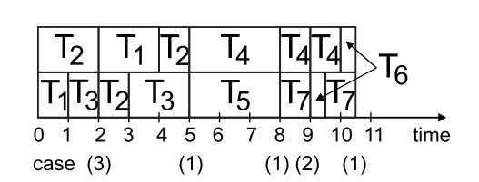

---

### Time-indexed ILP for $PS1 \mid temp \mid C_{max}$

> *Worked example identified and solved by Claude from the lecture slides — verify against the originals before relying on it for an exam.*

**Problem.** Formulate the **time-indexed** ILP for $\mathcal{T}=\{T_1,T_2,T_3\}$ with $p=(1,2,1)$ and $UB=5$, illustrating both the assignment constraint ("$T_1$ is scheduled exactly once") and the resource constraint at $t=2$.

**Approach.** Introduce $x_{it}\in\{0,1\}$ with $x_{it}=1$ iff task $T_i$ starts at time $t$. Then:

- **Each task scheduled exactly once:** $\sum_{t=0}^{UB-1} x_{it}=1$ for every $i$.
- **Single-resource non-overlap at time $t$:** $\sum_{i=1}^{n} \sum_{k=\max(0,t-p_i+1)}^{t} x_{ik} \le 1$ — at any clock tick, at most one task is in-progress.
- **Temporal:** $\sum_{t} t\cdot x_{it} + l_{ij} \le \sum_t t\cdot x_{jt}$ whenever there is a temporal edge $l_{ij}$.
- **Makespan:** $\sum_t t\cdot x_{it} + p_i \le C_{max}$.

**Solution.**

1. Variables: $x_{1,0},x_{1,1},\dots,x_{1,4}$; $x_{2,0},\dots,x_{2,4}$; $x_{3,0},\dots,x_{3,4}$; $C_{max}\in\{0,\dots,5\}$.
2. **Assignment for $T_1$:** $x_{1,0}+x_{1,1}+x_{1,2}+x_{1,3}+x_{1,4}=1$.
3. **Resource constraint at $t=2$:** for each task the inner sum spans starts from $\max(0,2-p_i+1)$ to $2$:

    - $T_1$ ($p_1=1$): range $k\in\{2\}$ → contributes $x_{1,2}$.
    - $T_2$ ($p_2=2$): range $k\in\{1,2\}$ → contributes $x_{2,1}+x_{2,2}$.
    - $T_3$ ($p_3=1$): range $k\in\{2\}$ → contributes $x_{3,2}$.

    Combined constraint at $t=2$:

    $$x_{1,2} + x_{2,1} + x_{2,2} + x_{3,2} \le 1.$$

4. Write the analogous resource constraint for every $t\in\{0,\dots,4\}$, plus the makespan constraints.
5. Solve as an ILP; one feasible/optimal assignment (without temporal constraints) is $s = (0, 1, 3)$ giving $C_{max}=4$, encoded by $x_{1,0}=x_{2,1}=x_{3,3}=1$, all other $x=0$.

**Answer.** $n\cdot UB + 1 = 16$ variables and $|E|+UB+2n = |E|+11$ constraints; the resource constraint at $t=2$ reads $x_{1,2}+x_{2,1}+x_{2,2}+x_{3,2}\le 1$.

**Pitfalls / insight.** The trick of *summing over all start times that could still be running at $t$* is what makes the time-indexed formulation linear. The price is the variable count blowing up with $UB$ — fine when $UB$ is small, painful otherwise.

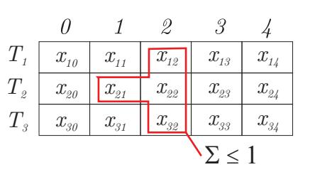

---

### Relative-order ILP polytope for two tasks

> *Worked example identified and solved by Claude from the lecture slides — verify against the originals before relying on it for an exam.*

**Problem.** Visualise the relative-order ILP feasible region for two tasks $T_i, T_j$ on one resource with $p_i=2$, $p_j=3$, no temporal constraints, $UB=11$, and $s_i\in\langle 0,8\rangle$.

**Approach.** The resource constraint between two tasks $i<j$ on the same resource is the "big-M" sandwich

$$p_j \le s_i - s_j + UB \cdot x_{ij} \le UB - p_i.$$

If $x_{ij}=1$, $T_i$ precedes $T_j$ and the inequalities reduce to $s_i + p_i \le s_j$. If $x_{ij}=0$, $T_j$ precedes $T_i$ and they reduce to $s_j + p_j \le s_i$. The feasible region in $(s_i, s_j, x_{ij})$ is a 3D polytope; projecting to $(s_i, s_j)$ yields two L-shaped regions corresponding to the two task orderings.

**Solution.**

1. **Case $x_{ij}=1$** (top layer of the polytope): plug into the constraint:

    - Lower bound: $p_j = 3 \le s_i - s_j + 11 \Rightarrow s_j \le s_i + 8$.
    - Upper bound: $s_i - s_j + 11 \le UB - p_i = 9 \Rightarrow s_j \ge s_i + 2 = s_i + p_i$. ✓

    Feasible 2D region: $\{(s_i, s_j) : s_j \ge s_i + 2\}$ — i.e. $T_i$ runs before $T_j$.

2. **Case $x_{ij}=0$** (bottom layer):

    - Lower: $3 \le s_i - s_j \Rightarrow s_i \ge s_j + 3 = s_j + p_j$. ✓
    - Upper: $s_i - s_j \le 9$ (slack with $UB=11$).

    Feasible region: $\{(s_i, s_j) : s_i \ge s_j + 3\}$ — i.e. $T_j$ runs before $T_i$.

3. The two regions together fill the entire valid (non-overlapping) part of the 2D start-time plane; the strip $s_i+p_i > s_j$ and $s_j+p_j > s_i$ — the *infeasible "overlap" diamond* — is excluded.

**Answer.** The 3D polytope has two horizontal "L"-shaped slabs (at $x_{ij}=0$ and $x_{ij}=1$); the 2D projection is exactly the complement of the overlap region. Decreasing $UB$ tilts the violet/green hyperplanes (the LP relaxation tightens) — pushing the polytope's slabs closer to the feasible 2D union.

**Pitfalls / insight.** $UB$ acts as the "big-M": too tight an $UB$ cuts off feasible integer solutions; too loose an $UB$ weakens the LP relaxation and slows branch-and-bound. The pair of inequalities is the only place where the variable $x_{ij}$ appears, so understanding this 3D picture is essential to debugging the model.

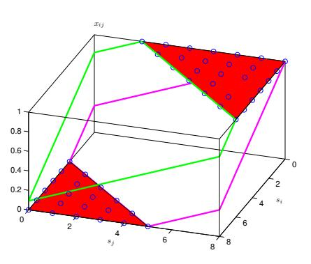

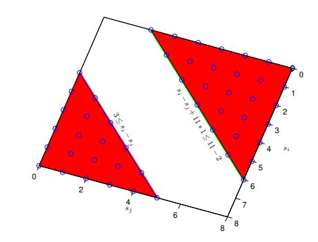
