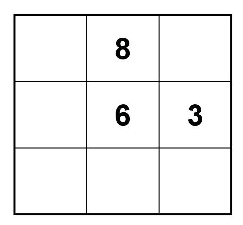
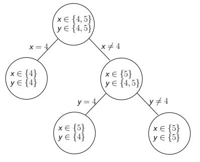
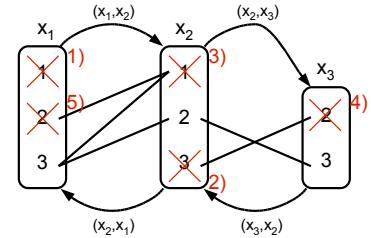
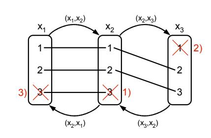
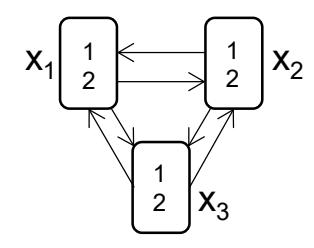
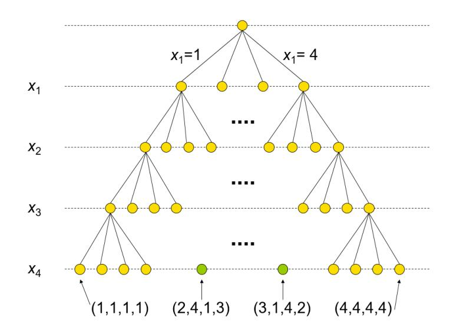
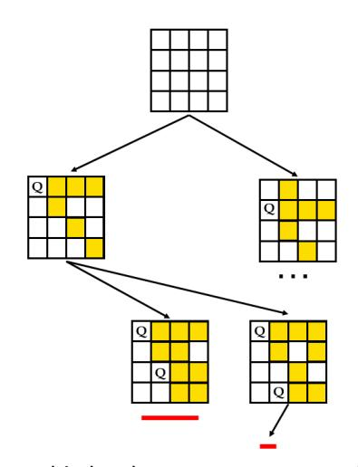
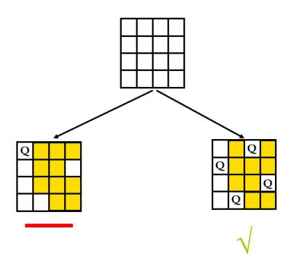
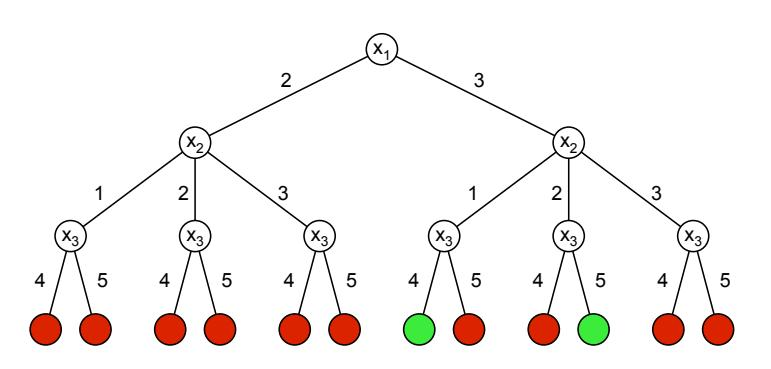
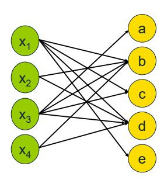

# Constraint Programming — Worked Examples

> *This page collects worked examples mined from the lecture slides. Solutions are synthesised by Claude from the slides' stated algorithms — verify against the originals before relying on them for an exam.*

### Sudoku — Propagation in the Lower-Left Block

> *Worked example identified and solved by Claude from the lecture slides — verify against the originals before relying on it for an exam.*

**Problem.** The lower-left $3\times3$ block of the Sudoku contains the three filled cells $\{3,6,8\}$ and six blank cells. Apply Sudoku's "every value $1{-}9$ appears at most once in a block" constraint to reduce the domains of the six blank cells. Then extend the propagation along the rows and columns crossing those blank cells.

**Approach.** This is constraint propagation (also called filtering / pruning). The constraint "all digits in a block are different" is equivalent to $\text{alldifferent}(x_i)$ over the nine cells of the block. Removing the already-used digits $3,6,8$ from the domains of all blank cells in the block is exactly the standard alldifferent propagation: a value taken by an instantiated variable cannot appear in any other variable of the same alldifferent. The same rule is then propagated to the rows and columns the blank cells lie in.

**Solution.**

1. Initial domains of every blank cell: $D=\{1,2,3,4,5,6,7,8,9\}$.
2. Apply the block alldifferent: remove $\{3,6,8\}$ from every blank cell of the block. The block now looks like

    | $\{1,2,4,5,7,9\}$ | $8$ | $\{1,2,4,5,7,9\}$ |
    |---|---|---|
    | $\{1,2,4,5,7,9\}$ | $6$ | $3$ |
    | $\{1,2,4,5,7,9\}$ | $\{1,2,4,5,7,9\}$ | $\{1,2,4,5,7,9\}$ |

3. Propagate along each of the three rows and three columns intersecting the block. For each blank cell, intersect its domain with $\{1,\ldots,9\}\setminus\{\text{values already used in that row/column}\}$. For example the top-left cell of the block lies in row 7 (which already has $8,4,1$) and in column 1 (which already has $2,6$), so its domain shrinks to $\{1,2,4,5,7,9\}\cap\overline{\{8,4,1\}}\cap\overline{\{2,6\}}=\{5,7,9\}$.
4. Iterate the propagation across rows, columns, and blocks until a fixed point is reached.

**Answer.** After the single-block propagation, every blank cell in the lower-left block has domain $\{1,2,4,5,7,9\}$. Iterated row/column/block propagation continues to shrink these domains; in many easy Sudokus this process alone determines the unique solution.

**Pitfalls / insight.** Propagation alone is not search: it just removes values that cannot participate in any solution given the current constraints. In hard Sudokus the propagation reaches a fixed point with non-singleton domains, and a search step (e.g. branching on a cell with the smallest domain) is required. The Sudoku model is naturally expressed using $27$ alldifferent global constraints (9 rows + 9 columns + 9 boxes), which is far more efficient than enumerating all $\binom{9}{2}=36$ pairwise inequalities per group.

---

### Propagation + Search on $x\ge y,\ y>3$

> *Worked example identified and solved by Claude from the lecture slides — verify against the originals before relying on it for an exam.*

**Problem.** Solve the CSP

$$x\in\{3,4,5\},\quad y\in\{3,4,5\},\quad x\ge y,\quad y>3.$$

Use propagation first; then create subproblems by branching.

**Approach.** Combine constraint propagation with a binary-choice search. The unary constraint $y>3$ is propagated first because it touches only one variable; then $x\ge y$ is propagated against the reduced $D_y$. When propagation reaches a fixed point with non-singleton domains, branch on a variable and re-propagate inside each branch.

**Solution.**

1. Initial state: $D_x=\{3,4,5\},\ D_y=\{3,4,5\}$.
2. Propagate $y>3$: remove $3$ from $D_y$, giving $D_x=\{3,4,5\},\ D_y=\{4,5\}$.
3. Propagate $x\ge y$: for $x=3$ there is no $y\in\{4,5\}$ with $3\ge y$, so remove $3$ from $D_x$. State: $D_x=\{4,5\},\ D_y=\{4,5\}$.
4. Propagation has reached a fixed point but the domain product still contains the infeasible pair $(x=4,y=5)$. Branch on $x$ using binary choice.
5. **Branch $x=4$.** Propagate $x\ge y$: $y\le 4$, so $D_y=\{4\}$. Both domains singletons, solution $(x,y)=(4,4)$.
6. **Branch $x\neq 4$**, i.e. $x=5$. Domains: $D_x=\{5\},\ D_y=\{4,5\}$. Propagation does not reduce further. Branch on $y$.

    - **Sub-branch $y=4$:** solution $(x,y)=(5,4)$.
    - **Sub-branch $y\neq 4$**, i.e. $y=5$: solution $(x,y)=(5,5)$.

**Answer.** Three feasible solutions: $(4,4),\ (5,4),\ (5,5)$.

**Pitfalls / insight.** Propagation alone left the infeasible tuple $(4,5)$ in the Cartesian product; only the search ruled it out. The branching constraints used here ($x=4$ vs. $x\neq 4$, then $y=4$ vs. $y\neq 4$) are mutually exclusive and exhaustive — the requirement for a sound branching strategy. Note that the propagator for $x\ge y$ can only deduce $x\ge\min D_y$ and $y\le\max D_x$; it cannot detect the infeasibility of one specific pair without further branching.

---

### REVISE Procedure on $x_1>x_2,\ x_2\neq x_3,\ x_2+x_3>4$

> *Worked example identified and solved by Claude from the lecture slides — verify against the originals before relying on it for an exam.*

**Problem.** CSP with

$$x_1\in\{1,2,3\},\ x_2\in\{1,2,3\},\ x_3\in\{2,3\},\qquad x_1>x_2,\ x_2\neq x_3,\ x_2+x_3>4.$$

Apply the REVISE procedure on every arc of the constraint graph; iterate until all arcs are arc consistent.

**Approach.** Arc consistency. The arcs are $(x_1,x_2),(x_2,x_1)$ from $x_1>x_2$ and $(x_2,x_3),(x_3,x_2)$ from $x_2\neq x_3$ and $x_2+x_3>4$ (the latter two constraints share the same pair of variables, so they share arcs). `REVISE(D_i,D_j)` deletes any $a\in D_i$ for which no $b\in D_j$ satisfies the binary constraints between $x_i$ and $x_j$.

**Solution.**

1. **Revise $(x_1,x_2)$** (constraint $x_1>x_2$). Test each $a\in D_1=\{1,2,3\}$: for $a=1$ no $b\in\{1,2,3\}$ has $1>b$, delete $1$; $a=2$ keeps witness $b=1$; $a=3$ keeps $b=1$. New $D_1=\{2,3\}$.
2. **Revise $(x_2,x_1)$** (same constraint, oriented the other way: $x_2<x_1$). For $a=1$: $b=2$ works. For $a=2$: $b=3$ works. For $a=3$: no $b\in\{2,3\}$ has $3<b$, delete $3$. New $D_2=\{1,2\}$.
3. **Revise $(x_2,x_3)$** (constraints $x_2\neq x_3$ and $x_2+x_3>4$). For $a=1$: need $b\in\{2,3\},\ b\neq 1,\ 1+b>4$; no such $b$, delete $1$. For $a=2$: need $b\neq 2,\ 2+b>4$, witness $b=3$. New $D_2=\{2\}$.
4. **Revise $(x_3,x_2)$.** For $a=2$: need $b\in\{2\},\ b\neq 2,\ b+2>4$; impossible, delete $2$. For $a=3$: $b=2$ satisfies $b\neq 3$ and $2+3>4$. New $D_3=\{3\}$.

    After this first pass: $D_1=\{2,3\},\ D_2=\{2\},\ D_3=\{3\}$. Several arcs that were previously AC are now non-AC because the domains shrank — the slide table marks $(x_1,x_2)$ as non-AC at this point.

5. **Iterate.** Revise $(x_1,x_2)$ again: with $D_2=\{2\}$, the value $a=2\in D_1$ has no $b\in D_2$ with $2>b$, delete $2$. New $D_1=\{3\}$.
6. Recheck all arcs: $(x_1,x_2),(x_2,x_1),(x_2,x_3),(x_3,x_2)$ are all AC.

**Answer.** Arc-consistent domains: $D_1=\{3\},\ D_2=\{2\},\ D_3=\{3\}$. This is in fact the unique solution.

**Pitfalls / insight.** REVISE is asymmetric: revising $(x_i,x_j)$ tightens $D_i$ only; the symmetric arc $(x_j,x_i)$ may still need to be revised separately. After a domain shrinks, every arc into that variable can become non-AC again, so we must re-queue affected arcs — this is exactly what AC-3 automates. Brute re-checking all arcs (as done above) wastes work; AC-3 only re-queues arcs whose target domain just changed.

---

### AC-3 Iteration on $x_1=x_2,\ x_2+1=x_3$

> *Worked example identified and solved by Claude from the lecture slides — verify against the originals before relying on it for an exam.*

**Problem.** CSP

$$x_1\in\{1,2,3\},\ x_2\in\{1,2,3\},\ x_3\in\{1,2,3\},\qquad x_1=x_2,\ x_2+1=x_3.$$

Run AC-3 to a fixed point. Initialise the queue $Q$ with all arcs of the constraint graph.

**Approach.** AC-3 keeps a queue $Q$ of arcs to revise. Pop arc $(x_k,x_m)$, call `REVISE(D_k,D_m)`. If $D_k$ changed, re-enqueue every arc $(x_i,x_k)$ with $i\neq m$ (since shrinking $D_k$ can only break arc consistency of arcs pointing *into* $x_k$). Stop when $Q$ is empty (success) or some domain becomes empty (failure).

**Solution.**

Initial $Q=\big((x_1,x_2),(x_2,x_1),(x_2,x_3),(x_3,x_2)\big)$ and domains $D_1=D_2=D_3=\{1,2,3\}$.

1. **Revise $(x_1,x_2)$**, constraint $x_1=x_2$. Every $a\in D_1$ has matching $b=a\in D_2$. No deletion. $Q=\big((x_2,x_1),(x_2,x_3),(x_3,x_2)\big)$.
2. **Revise $(x_2,x_1)$**, same constraint. No deletion. $Q=\big((x_2,x_3),(x_3,x_2)\big)$.
3. **Revise $(x_2,x_3)$**, constraint $x_2+1=x_3$. For $a=1$: need $b=2\in D_3$, ok. For $a=2$: need $b=3\in D_3$, ok. For $a=3$: need $b=4\notin D_3$, **delete $3$**. New $D_2=\{1,2\}$. Re-enqueue arcs into $x_2$ except $(x_3,x_2)$ (the arc just revised) — that is $(x_1,x_2)$. $Q=\big((x_3,x_2),(x_1,x_2)\big)$.
4. **Revise $(x_3,x_2)$**, constraint $x_3=x_2+1$. For $a=1$: need $b=0\notin D_2$, **delete $1$**. For $a=2$: $b=1\in D_2$, ok. For $a=3$: $b=2\in D_2$, ok. New $D_3=\{2,3\}$. Re-enqueue arcs into $x_3$ except $(x_2,x_3)$ — none (only $x_2$ connects to $x_3$ in this CSP). $Q=\big((x_1,x_2)\big)$.
5. **Revise $(x_1,x_2)$**. For $a=3\in D_1$: need $b=3\in D_2=\{1,2\}$, fail, **delete $3$**. New $D_1=\{1,2\}$. Re-enqueue arcs into $x_1$ except $(x_2,x_1)$ — none. $Q=\emptyset$.

**Answer.** Arc-consistent fixed point: $D_1=\{1,2\},\ D_2=\{1,2\},\ D_3=\{2,3\}$. Feasible solutions are $(1,1,2)$ and $(2,2,3)$ (AC alone does not pick a unique one, but search has only these two leaves).

**Pitfalls / insight.** The "re-enqueue" rule "$(x_i,x_k)$ such that $i\neq m$" is what saves AC-3 from re-doing work it just finished. The arc $(x_m,x_k)$ is *not* affected when $D_k$ shrinks, because the consistency of $(x_m,x_k)$ depends on $D_m$ being supported by $D_k$ — removing values from $D_k$ can only break arcs *into* $x_k$, not the arc $(x_m,x_k)$ which has just been revised in the opposite direction. AC-3 has worst-case complexity $O(ed^3)$ where $e$ is the number of arcs and $d$ the maximum domain size.

---

### AC is not Complete — Triangle with $x_i\neq x_j$

> *Worked example identified and solved by Claude from the lecture slides — verify against the originals before relying on it for an exam.*

**Problem.** Show that the CSP

$$x_1\in\{1,2\},\ x_2\in\{1,2\},\ x_3\in\{1,2\},\qquad x_1\neq x_2,\ x_1\neq x_3,\ x_2\neq x_3$$

is arc consistent but has no solution.

**Approach.** Check AC arc by arc on the binary constraint graph (a triangle); then show that any candidate assignment violates some constraint. This is the classic "2-colour a triangle" infeasibility.

**Solution.**

1. **AC check.** Take arc $(x_1,x_2)$: for $a=1\in D_1$, witness $b=2\in D_2$ satisfies $1\neq 2$; for $a=2\in D_1$, witness $b=1$. Hence $(x_1,x_2)$ is AC. By symmetry every one of the six arcs of the triangle is AC. So the CSP is arc consistent.
2. **Feasibility check.** Suppose a solution exists. Two of the three variables among $\{x_1,x_2,x_3\}$ must take the same value (pigeonhole on a 2-element codomain). That pair violates its inequality constraint. Contradiction.

**Answer.** No solution exists, even though the CSP is AC. AC is therefore not a complete decision procedure.

**Pitfalls / insight.** AC only checks pairs of variables. The infeasibility here is a property of a length-2 path $x_1,x_2,x_3$: for $x_1=1,x_3=2$ (which is fine w.r.t. $x_1\neq x_3$) there is no $x_2$ satisfying both $x_1\neq x_2$ and $x_2\neq x_3$. Path consistency (PC) would detect this. The example also illustrates why we still need backtracking search after propagation reaches a fixed point.

---

### PC is not Complete — $K_4$ with $x_i\neq x_j$

> *Worked example identified and solved by Claude from the lecture slides — verify against the originals before relying on it for an exam.*

**Problem.** Show that

$$x_1,x_2,x_3,x_4\in\{1,2,3\},\qquad x_i\neq x_j\ \forall i\neq j$$

is path consistent but has no solution. As a witness, the slides remark that the path $(x_1,x_2,x_3,x_4)$ with values $(1,2,1,3)$ is "path consistent" because only consecutive-neighbour constraints along the path are required.

**Approach.** PC requires that for any pair $(a,b)\in D_1\times D_m$ consistent w.r.t. the direct constraint, *some* assignment of intermediate variables satisfies the binary constraints between neighbours along the path. Feasibility, by contrast, requires *all* pairwise constraints, not just along the path.

**Solution.**

1. **PC check.** For any pair $a\in D_i, b\in D_j$ with $a\neq b$ (the only constraint), and any third variable $x_k$, we can choose $c\in\{1,2,3\}\setminus\{a,b\}$ — this third value exists because the domain has size $3$ and $a\neq b$ uses only $2$ values. Hence every length-2 path is PC. Since PC of all length-2 paths implies PC of the whole CSP, the CSP is PC.
2. **Feasibility check.** Any solution would be a proper colouring of $K_4$ with $3$ colours. $K_4$ has chromatic number $4$, so no such colouring exists. Hence the CSP is infeasible.

**Answer.** The CSP is PC but infeasible. PC is therefore strictly stronger than AC but still not complete.

**Pitfalls / insight.** The slide's witness path $(1,2,1,3)$ for $(x_1,x_2,x_3,x_4)$ satisfies *only* the neighbour-along-the-path constraints $x_1\neq x_2,\ x_2\neq x_3,\ x_3\neq x_4$. It violates $x_1\neq x_3$ — and that is exactly the point: PC asks for a witness obeying neighbour edges, not all edges, so a PC witness is allowed to violate "chord" constraints. The take-away on cost: PC removes more inconsistencies than AC but its strength/efficiency ratio is much worse, which is why most solvers stop at AC/GAC.

---

### GAC for $x_1+x_2\le x_3$

> *Worked example identified and solved by Claude from the lecture slides — verify against the originals before relying on it for an exam.*

**Problem.** For the constraint $x_1+x_2\le x_3$ with domains $x_1,x_2,x_3\in\{1,2,3\}$, classify each value of $x_3$ as GAC or non-GAC. Then show that with $x_3\in\{2,3\}$ the variable $x_3$ is GAC but $x_1,x_2$ are not. Finally show that with $x_1,x_2\in\{1,2\},\ x_3\in\{2,3\}$ the whole constraint becomes GAC.

**Approach.** A value $a\in D_i$ is GAC w.r.t. constraint $C_j$ iff there exist values in the other variables' domains making $C_j$ hold together with $x_i=a$. A variable is GAC iff every value in its domain is GAC. The constraint is GAC iff every variable is GAC.

**Solution.**

1. **Test $x_3$ with all domains $\{1,2,3\}$.** For $x_3=1$ we need $x_1+x_2\le 1$ with $x_1,x_2\ge 1$, impossible; so $x_3=1$ is **non-GAC**. For $x_3=2$ pick $x_1=x_2=1$, $1+1\le 2$; GAC. For $x_3=3$ pick $x_1=1,x_2=2$ (or $1,1$); GAC.
2. **Now set $D_3=\{2,3\}$.** Every value of $D_3$ has a supporting tuple (see step 1), so $x_3$ is GAC. Test $x_1=3$: we need $x_2\in\{1,2,3\}, x_3\in\{2,3\}$ with $3+x_2\le x_3$, requiring $x_3\ge 4$, impossible — $x_1=3$ is non-GAC. By symmetry $x_2=3$ is non-GAC. So $x_1,x_2$ are **not GAC**, $x_3$ is GAC.
3. **Shrink further: $D_1=D_2=\{1,2\},\ D_3=\{2,3\}$.** Check $x_1=2$: need $x_2\ge 1,\ x_3\ge 2+x_2$; pick $x_2=1,x_3=3$, works. $x_1=1$: pick $x_2=1,x_3=2$. So $x_1$ is GAC; by symmetry $x_2$ is GAC. $x_3=2$: pick $x_1=x_2=1$. $x_3=3$: pick $x_1=1,x_2=2$. All variables GAC, so the constraint is **GAC**.

**Answer.** With initial domains all $\{1,2,3\}$, value $x_3=1$ is non-GAC. Reducing $D_3$ to $\{2,3\}$ makes $x_3$ GAC but leaves $x_1,x_2$ non-GAC at value $3$. Reducing $D_1,D_2$ to $\{1,2\}$ as well makes the whole constraint GAC.

**Pitfalls / insight.** GAC is the natural generalisation of AC to constraints of arity $>2$. Enforcing GAC means iteratively pruning every value with no support in the other variables' current domains. For arbitrary table constraints, deciding GAC is polynomial; for some constraints (e.g. arithmetic with multiplication, certain structured constraints) it is NP-hard, which is why solvers often settle for weaker bounds consistency.

---

### BC vs. GAC for $x_1=2x_2+x_3$

> *Worked example identified and solved by Claude from the lecture slides — verify against the originals before relying on it for an exam.*

**Problem.** For the constraint $x_1=2x_2+x_3$ with $x_1\in\{1,2,3\},\ x_2\in\{0,1\},\ x_3\in\{1\}$, decide whether $x_1$ is BC and whether it is GAC. Then for $x_1\in\{1,2,3\},\ x_2\in\{0,2\},\ x_3\in\{0,1\}$ decide BZC vs. BC.

**Approach.** $x_i$ is BC w.r.t. $C_j$ iff both bounds $\min D_i$ and $\max D_i$ are GAC. $x_i$ is GAC iff *every* value of $D_i$ is GAC. BZC weakens BC by treating each other domain as the integer interval $[\min D_k, \max D_k]$ instead of the actual (possibly sparse) set.

**Solution.**

1. **First instance**, $x_1\in\{1,2,3\},\ x_2\in\{0,1\},\ x_3\in\{1\}$. The bounds of $x_1$ are $1$ and $3$.

    - $x_1=1$: need $1=2x_2+1$, i.e. $x_2=0\in D_2$. Supported.
    - $x_1=3$: need $3=2x_2+1$, i.e. $x_2=1\in D_2$. Supported.

    So $x_1$ is **BC**. But the interior value $x_1=2$ would need $2=2x_2+1$, i.e. $x_2=1/2\notin\mathbb{Z}$, no support. Therefore $x_1$ is **not GAC** (value $2$ is non-GAC).

2. **Second instance**, $x_1\in\{1,2,3\},\ x_2\in\{0,2\},\ x_3\in\{0,1\}$.

    - **BZC check on $x_1$.** Replace $D_2$ by the integer interval $[0,2]$ and $D_3$ by $[0,1]$. $x_1=1$ supported by $x_2=0,x_3=1$. $x_1=3$ supported by $x_2=1,x_3=1$ (with $x_2$ taken from the interval, not the sparse set). Hence $x_1$ is **BZC**.
    - **BC check on $x_1$.** Now require support in the *true* domains. $x_1=3$ needs $3=2x_2+x_3$ with $x_2\in\{0,2\},\ x_3\in\{0,1\}$: $x_2=0\Rightarrow x_3=3\notin D_3$; $x_2=2\Rightarrow x_3=-1\notin D_3$. No support. $x_1=3$ is non-BC. Therefore $x_1$ is **not BC**.

**Answer.** Instance 1: $x_1$ is BC but not GAC (interior value $2$ fails). Instance 2: $x_1$ is BZC but not BC at the upper bound $3$.

**Pitfalls / insight.** Bounds consistency is cheap because it only inspects two values per variable, but it can be silently weaker than GAC when domains have "holes". BZC is even cheaper because it pretends the other variables' domains are dense intervals — fine when domains really are intervals, dangerous otherwise. The Schulte/van Beek slides motivate this hierarchy: GAC $\ge$ BC $\ge$ BZC in terms of pruning strength, and the reverse order in terms of speed.

---

### 4-Queens — Constraint Model and Three Search Strategies

> *Worked example identified and solved by Claude from the lecture slides — verify against the originals before relying on it for an exam.*

**Problem.** Place $4$ queens on a $4\times 4$ board so that no pair attacks each other. Variables $x_i$ for $i=1,\ldots,4$ where $x_i$ is the row of the queen in column $i$, all $D_i=\{1,2,3,4\}$. Constraints:

$$
\begin{array}{cc}
 x_1\neq x_2\ \wedge\ |x_1-x_2|\neq 1 & x_2\neq x_3\ \wedge\ |x_2-x_3|\neq 1 \\
 x_1\neq x_3\ \wedge\ |x_1-x_3|\neq 2 & x_2\neq x_4\ \wedge\ |x_2-x_4|\neq 2 \\
 x_1\neq x_4\ \wedge\ |x_1-x_4|\neq 3 & x_3\neq x_4\ \wedge\ |x_3-x_4|\neq 1 \\
\end{array}
$$

Trace search using **(a) chronological backtracking**, **(b) forward checking**, and **(c) maintaining arc consistency** with enumeration on $x_i$ in order $x_1,x_2,x_3,x_4$, trying values $1,2,3,4$ in turn.

**Approach.** All three are depth-first backtracking variants. They differ in how much propagation they perform at each node.

- **Chronological backtracking:** check a constraint only when *all* of its variables are instantiated; backtrack on the latest decision.
- **Forward checking (FC):** for every constraint with exactly one uninstantiated variable, remove from that variable's domain values that conflict with the current partial assignment. Backtrack if a domain empties.
- **Maintaining arc consistency (MAC):** after each assignment, run full AC-3 (here GAC) over the remaining variables.

**Solution.**

1. **Chronological backtracking.** Branch $x_1=1$, $x_2=1$ — only now check $x_1\neq x_2$: violated. Try $x_2=2$ — check $x_1\neq x_2$ ok, but $|x_1-x_2|=1$, violated. $x_2=3$ — both pairwise constraints with $x_1$ ok. Continue $x_3=1$: violates $x_1\neq x_3$. $x_3=2$: violates $|x_2-x_3|=1$. $x_3=3$: violates $x_2\neq x_3$. $x_3=4$: violates $|x_2-x_3|=1$. Backtrack to $x_2$. $x_2=4$: $|x_1-x_2|=3\neq 1$ ok, $x_1\neq x_2$ ok. $x_3=1$: violates $x_1=x_3$. $x_3=2$: violates $|x_2-x_3|=2$ ok actually, check $|x_2-x_3|=2\neq 1$ ok and $x_2\neq x_3$ ok and check $x_1$: $x_1\neq x_3$ ok, $|x_1-x_3|=1\neq 2$ ok. Continue $x_4=1$: $x_1=x_4$ violation. $x_4=2$: $x_3=x_4$ violation. $x_4=3$: $|x_2-x_4|=1\neq 2$ ok, $|x_3-x_4|=1$ violation. $x_4=4$: $x_2=x_4$ violation. Backtrack. Eventually a deeper branch from $x_1=2$ succeeds.
2. **Forward checking from $x_1=1$.** Reduce all domains of uninstantiated variables to remove cells attacked by $(1,1)$: $D_2$ loses rows $1$ (same row) and $2$ ($|1-1|=1$ wait — that's columns $1,2$ so $|x_1-x_2|=1\Leftrightarrow|1-x_2|=1$, so $x_2\in\{2\}$ is forbidden; also $x_2\neq 1$). $D_2$ shrinks from $\{1,2,3,4\}$ to $\{3,4\}$. $D_3$: $x_3\neq 1$ and $|x_3-1|\neq 2$, so $x_3\neq 3$; $D_3=\{2,4\}$. $D_4$: $x_4\neq 1$ and $|x_4-1|\neq 3$, so $x_4\neq 4$; $D_4=\{2,3\}$. Try $x_2=3$: FC against $x_3,x_4$. $D_3$: also need $x_3\neq 3$ and $|x_3-3|\neq 1$, so $x_3\notin\{2,3,4\}$; intersect with $\{2,4\}$ gives $D_3=\emptyset$. Backtrack. Try $x_2=4$: $D_3$ adds $x_3\neq 4,\ |x_3-4|\neq 1$ i.e. $x_3\neq 3$; intersect with $\{2,4\}$ gives $D_3=\{2\}$. $D_4$ adds $x_4\neq 4,\ |x_4-4|\neq 2$ i.e. $x_4\neq 2$; intersect with $\{2,3\}$ gives $D_4=\{3\}$. Try $x_3=2$: FC on $D_4$: $x_4\neq 2,\ |x_4-2|\neq 1$ i.e. $x_4\neq 1,3$; intersect with $\{3\}$ gives $D_4=\emptyset$. Backtrack. The slide notes "on the next level: $x_3=2$ and $D_4$ is empty" — matches. Backtrack out of $x_1=1$.
3. **MAC from $x_1=1$.** Run AC over the *entire* constraint graph after each assignment. After $x_1=1$ propagation already empties $D_3$ further: AC discovers that the remaining domains $D_2=\{3,4\},\ D_3=\{2,4\},\ D_4=\{2,3\}$ have no consistent extension. Concretely, take arc $(x_3,x_4)$ with constraints $x_3\neq x_4,\ |x_3-x_4|\neq 1$. For $x_3=2$: support requires $x_4\in\{2,3\}\setminus\{2,1,3\}=\emptyset$, delete $2$. For $x_3=4$: support requires $x_4\in\{2,3\}\setminus\{4,3,5\}=\{2\}$, keep. So $D_3=\{4\}$. Now revise $(x_2,x_3)$: $x_2=3$ needs $x_3\neq 3,\ |x_3-3|\neq 1$ with $D_3=\{4\}$; $|4-3|=1$, fail, delete $3$. $D_2=\{4\}$. Now $x_2=x_3=4$ violates $x_2\neq x_3$ — revise $(x_2,x_3)$: $x_2=4$ requires $x_3\in\{4\}\setminus\{4,3,5\}=\emptyset$, delete $4$. $D_2=\emptyset$, fail. So MAC detects infeasibility of the $x_1=1$ subtree *without* trying $x_2$ values. Backtrack to $x_1=2$: $D_2=\{4\},\ D_3=\{1\},\ D_4=\{3\}$ after propagation — a singleton, so MAC finds the solution $(x_1,x_2,x_3,x_4)=(2,4,1,3)$ at the second top-level vertex.

**Answer.** Both solutions to 4-queens are $(2,4,1,3)$ and its mirror $(3,1,4,2)$. Chronological backtracking explores hundreds of partial assignments; FC trims most dead ends one level early; MAC discovers infeasibility of the $x_1=1$ subtree before any $x_2$ branch and reaches the first solution at the *second* top-level node.

**Pitfalls / insight.** The progression naive $\to$ FC $\to$ MAC shows the **propagation-search trade-off**: more propagation per node = fewer nodes but higher per-node cost. FC only looks at constraints with exactly one uninstantiated variable, while MAC looks at the whole sub-CSP. On 4-queens the trade clearly favours MAC; on instances with cheap constraints and tight domains, FC may be competitive. The model itself is interesting: encoding "no two queens in the same row" via $x_i\neq x_j$ instead of putting a row-Boolean per cell collapses the variable count from $16$ to $4$ and lets us use alldifferent on $(x_1,x_2,x_3,x_4)$ in stronger solvers.

---

### Simple Equation and Inequality with GAC

> *Worked example identified and solved by Claude from the lecture slides — verify against the originals before relying on it for an exam.*

**Problem.** Solve

$$x_1\in\{2,3\},\ x_2\in\{1,2,3\},\ x_3\in\{4,5\},\qquad x_1>x_2,\ x_1+x_2=x_3.$$

Use MAC (GAC after each branching) and enumeration on $x_1$ then $x_2$.

**Approach.** GAC of $x_1>x_2$ and GAC of $x_1+x_2=x_3$, alternated with enumeration branching.

**Solution.**

1. **Initial GAC.**

    - GAC on $x_1>x_2$: for $x_1=2$ we need $x_2<2$, i.e. $x_2\in\{1\}$, supported. For $x_1=3$ we need $x_2\in\{1,2\}$, supported. For $x_2=3$ we'd need $x_1>3$, but $\max D_1=3$, so **delete $3$ from $D_2$**. $D_2=\{1,2\}$.
    - GAC on $x_1+x_2=x_3$ with $D_1=\{2,3\},\ D_2=\{1,2\},\ D_3=\{4,5\}$: $x_1+x_2$ ranges over $\{3,4,5\}$. Value $x_3=4$ supported by e.g. $(2,2)$ or $(3,1)$; $x_3=5$ by $(3,2)$. $x_1=2$ needs $x_3-x_2=2$ with $(x_2,x_3)\in\{(1,?),(2,?)\}$; need $x_3=2+x_2\in\{3,4\}\cap\{4,5\}=\{4\}$, supported by $(x_2,x_3)=(2,4)$. $x_1=3$ supported by $(1,4)$ or $(2,5)$. All variables GAC. State after initial propagation: $D_1=\{2,3\},\ D_2=\{1,2\},\ D_3=\{4,5\}$.

2. **Branch $x_1=2$, propagate.**

    - $x_1>x_2$: $x_2<2$, so $D_2=\{1\}$.
    - $x_1+x_2=x_3$: $2+1=x_3=3$, but $3\notin D_3=\{4,5\}$. $D_3=\emptyset$ — **fail**. Backtrack.

3. **Branch $x_1=3$, propagate.**

    - $x_1>x_2$: $x_2<3$, so $D_2=\{1,2\}$ (no change).
    - $x_1+x_2=x_3$: $x_3=3+x_2\in\{4,5\}\cap\{4,5\}=\{4,5\}$ — supported by both $x_2$ values. No reduction beyond the bounds check; $D_3$ stays $\{4,5\}$ but every value of $D_3$ is supported by a unique $x_2$. State: $D_1=\{3\},\ D_2=\{1,2\},\ D_3=\{4,5\}$.

4. **Sub-branch $x_2=1$**, propagate.

    - $x_1+x_2=x_3$: $x_3=3+1=4$, so $D_3=\{4\}$.
    - $x_1>x_2$: $3>1$ ok.

    Solution found: $(x_1,x_2,x_3)=(3,1,4)$.

5. **Sub-branch $x_2=2$**, propagate.

    - $x_1+x_2=x_3$: $x_3=3+2=5$, so $D_3=\{5\}$.
    - $x_1>x_2$: $3>2$ ok.

    Solution found: $(x_1,x_2,x_3)=(3,2,5)$.

**Answer.** Two feasible solutions: $(3,1,4)$ and $(3,2,5)$. The branch $x_1=2$ is pruned at propagation time without any further search.

**Pitfalls / insight.** GAC on the equality $x_1+x_2=x_3$ is essentially a 3-way support check: each domain value must have at least one consistent pair in the other two domains. When two of the three variables are instantiated, the equation reduces to a pure assignment (no search needed). This is why MAC + enumeration on $x_1,x_2$ found both solutions with no backtracking after the initial $x_1=2$ failure. Compare with the enumerated search tree (slide ): the two green leaves are exactly these two solutions; the other twelve leaves of the unpruned tree are immediately rejected by propagation.

---

### Alldifferent — Bipartite-Matching Propagation

> *Worked example identified and solved by Claude from the lecture slides — verify against the originals before relying on it for an exam.*

**Problem.** Apply the global constraint $\text{alldifferent}(x_1,x_2,x_3,x_4)$ with

$$D_1=\{b,c,d,e\},\ D_2=\{b,d\},\ D_3=\{a,b,c,d\},\ D_4=\{b,d\}.$$

Find an assignment of all four variables to distinct values from their domains.

**Approach.** The propagator behind $\text{alldifferent}$ models the variable–value relation as a bipartite graph (variables on one side, values on the other; edges = "value is in the variable's domain") and looks for a **perfect matching** on the variable side. If one exists, GAC additionally removes any edge that does not belong to any maximum matching (Régin's algorithm). The slide's example only asks for a feasible assignment, i.e. a perfect matching.

**Solution.**

1. Build the bipartite graph. Edges: $x_1\to\{b,c,d,e\}$, $x_2\to\{b,d\}$, $x_3\to\{a,b,c,d\}$, $x_4\to\{b,d\}$.
2. Pre-propagation observation. The two variables $x_2$ and $x_4$ both have the same 2-element domain $\{b,d\}$. By a Hall-set argument any feasible matching must use $\{b,d\}$ entirely on $\{x_2,x_4\}$. Hence $b$ and $d$ can be removed from $D_1$ and $D_3$ once stronger propagation runs: $D_1'=\{c,e\},\ D_3'=\{a,c\}$.
3. Pick a matching. Match $x_2=b$. Then $x_4$ must take $d$, so $x_4=d$. Match $x_1$ to a value in $D_1'=\{c,e\}$ — say $x_1=e$. The remaining $x_3$ must take a value from $D_3'\setminus\{\text{used}\}=\{a,c\}$; pick $x_3=c$.
4. Verify: $(x_1,x_2,x_3,x_4)=(e,b,c,d)$ are all distinct. Done.

**Answer.** $x_1=e,\ x_2=b,\ x_3=c,\ x_4=d$ (this is the solution stated by the slides).

**Pitfalls / insight.** A naive encoding by $\binom{4}{2}=6$ inequalities $x_i\neq x_j$ enforces only AC, which is too weak — it would fail to spot the "Hall set" $\{x_2,x_4\}\to\{b,d\}$ that forces $b,d$ out of $D_1,D_3$. The matching-based propagator achieves GAC in polynomial time and is the canonical reason "global constraints" exist: capturing structure once and exploiting it with a tailored algorithm beats decomposing into many small constraints. Régin's GAC algorithm runs in $O(\sqrt{n}\cdot m)$ where $n$ is the number of variables and $m$ the number of edges.

