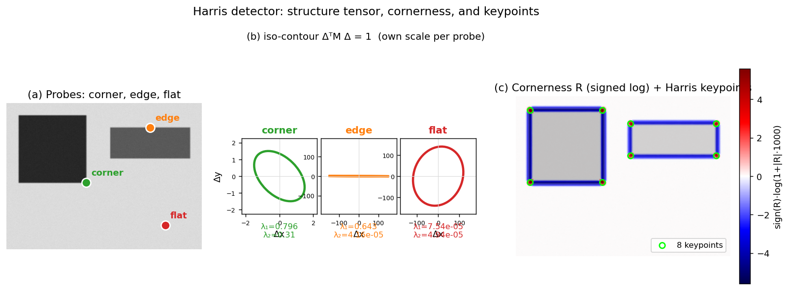

> **Source question (Q2):** Harris interest points - definition, algorithm for detection, parameters. Explain the motivation behind the definition. Describe the effects of the parameters on the number of detected points. To which transformation (geometric/photometric) is this detector invariant?

## Harris Interest Points: Definition, Algorithm, Parameters, and Invariance

The **Harris corner detector** is a foundational technique for finding stable, repeatable interest points in an image. It belongs to the class of **corner detectors**—methods that identify locations where the image intensity changes significantly in more than one direction. Such points are highly discriminative and can be reliably re-detected under moderate viewpoint and illumination changes, making them essential building blocks for wide-baseline matching, tracking, and 3D reconstruction.

### Motivation: From Moravec to Harris

The core idea dates back to Moravec’s detector: a point is a good feature if a small window centred on it produces a large change in intensity when shifted in any direction. Moravec measured this change by the sum of squared differences (SSD) between the original window and the shifted window, for a discrete set of shifts (typically the eight neighbours). A point was considered a corner if the minimum SSD over all shifts was locally maximal.

Moravec’s approach had several shortcomings:

- The response is anisotropic because only a finite set of discrete shifts is tested.
- The window is binary and rectangular, making the response sensitive to noise and edge orientation.
- The detector is not rotationally invariant.

Harris and Stephens addressed these limitations by using an **analytic expansion** of the image function and a **smooth, circular Gaussian window**. This yields a mathematically elegant formulation that is rotationally invariant, computationally efficient, and more robust.

### Definition: The Second-Moment Matrix and Cornerness Response

Let $I(x,y)$ be the image intensity. For a small shift $(\Delta x, \Delta y)$, the change in appearance of a window $W$ centred at $(x,y)$ can be approximated by a first-order Taylor expansion:

$$
I(x + \Delta x, y + \Delta y) \approx I(x,y) + I_x(x,y)\,\Delta x + I_y(x,y)\,\Delta y,
$$

where $I_x = \partial I / \partial x$ and $I_y = \partial I / \partial y$ are the image gradients. The weighted sum of squared differences over the window then becomes

$$
E(\Delta x, \Delta y) = \sum_{(x,y)\in W} w(x,y)\,\bigl( I_x\Delta x + I_y\Delta y \bigr)^2,
$$

where $w(x,y)$ is a Gaussian weighting function that gives more importance to the centre of the window. This can be rewritten in matrix form:

$$
E(\Delta x, \Delta y) \approx
\begin{bmatrix} \Delta x & \Delta y \end{bmatrix}
M
\begin{bmatrix} \Delta x \\ \Delta y \end{bmatrix},
$$

with the **second-moment matrix** (also called the auto-correlation matrix or structure tensor)

$$
M = \sum_{(x,y)\in W} w(x,y)
\begin{bmatrix}
I_x^2 & I_x I_y \\[2pt]
I_x I_y & I_y^2
\end{bmatrix}.
$$

$M$ is a $2\times2$ symmetric, positive semi-definite matrix. Its eigenvalues $\lambda_1, \lambda_2$ ($\lambda_1 \ge \lambda_2 \ge 0$) encode the local image structure:

- **Both eigenvalues large** $\Rightarrow$ a **corner** (significant intensity change in all directions).
- **One large, one small** $\Rightarrow$ an **edge** (change only along the edge normal).
- **Both small** $\Rightarrow$ a **flat** region (little change anywhere).

Instead of explicitly computing the eigenvalues, Harris proposed a single **cornerness response**:

$$
R = \det(M) - k \, (\operatorname{trace} M)^2
   = \lambda_1\lambda_2 - k\,(\lambda_1 + \lambda_2)^2,
$$

where $k$ is an empirical constant, typically $k \in [0.04, 0.06]$. This function is large and positive for corners, negative with large magnitude for edges, and small in absolute value for flat regions. The iso-contours of $E(\Delta x, \Delta y)$ form an ellipse whose shape is determined by the eigenvalues of $M$; the cornerness $R$ depends only on these eigenvalues, making the detector **rotationally invariant**.

The figure below illustrates this on a synthetic image. Panel (a) marks three probe locations: a **corner** of the dark square, a horizontal **edge** of the lighter rectangle, and a **flat** region. Panel (b) draws the iso-contour $\Delta^{\top} M \Delta = 1$ at each probe (each on its own scale): the corner gives a small, nearly circular ellipse (both eigenvalues large), the edge a hugely elongated ellipse (one eigenvalue large, one tiny), and the flat region a vast ellipse (both eigenvalues $\approx 0$). Panel (c) shows the cornerness $R$ and the eight keypoints surviving threshold + non-maximum suppression — all sit on true corners, none on the edges.

### Algorithm for Detection

The Harris detector proceeds in four main steps:

1. **Compute image gradients** $I_x, I_y$ at each pixel. This is typically done by convolving the image with Gaussian derivative filters (or, equivalently, by applying a small Gaussian blur followed by finite differences, e.g., Sobel operators). The scale of the derivative filter (often denoted $\sigma_D$) controls the amount of smoothing before differentiation.

2. **Form the products** $I_x^2$, $I_y^2$, and $I_x I_y$ at every pixel.

3. **Integrate over a Gaussian window** $W$ of size (integration scale) $\sigma_I$:
   $$
   A = \sum_W w\, I_x^2,\qquad
   B = \sum_W w\, I_x I_y,\qquad
   C = \sum_W w\, I_y^2.
   $$
   This yields the entries of $M = \begin{bmatrix} A & B \\ B & C \end{bmatrix}$.

4. **Compute the cornerness response** $R = AC - B^2 - k\,(A+C)^2$.

5. **Threshold** $R$: keep only pixels where $R > T$, with $T$ a user-defined threshold.

6. **Non-maximum suppression (NMS)**: in a local neighbourhood (typically $3\times3$ or $5\times5$), retain only the pixel with the maximum $R$ value. This ensures that a single, well-localised point is returned per corner.

The output is a set of **Harris interest points**, each defined by its image coordinates $(x,y)$.

### Parameters and Their Effect on the Number of Detected Points

The Harris detector has several parameters that directly influence how many points are detected and their spatial distribution:

- **Threshold $T$ on $R$.** This is the primary control for the number of points. A higher $T$ retains only the strongest corners, yielding fewer but more reliable points. A lower $T$ admits weaker corners and even some edge-like or noisy regions, increasing the count but potentially reducing repeatability. The absolute value of $R$ depends on image contrast, so $T$ must be tuned for the application or adapted based on image statistics.

- **Derivative scale $\sigma_D$.** This is the standard deviation of the Gaussian used to smooth the image before gradient computation. A small $\sigma_D$ (e.g., 0.5–1.0 pixels) preserves fine details and detects many small-scale corners, but is sensitive to noise. A larger $\sigma_D$ suppresses noise and fine texture, leading to fewer, more stable points at coarser scales. In practice, $\sigma_D$ is often kept small (just enough to avoid aliasing from the pixel grid) and the integration scale handles the rest.

- **Integration scale $\sigma_I$ (window size).** This is the standard deviation of the Gaussian weighting window $w(x,y)$ used to accumulate the products $I_x^2$, etc. A small $\sigma_I$ (e.g., 1–2 pixels) makes the detector very local, responding to fine corners and producing many points, but it is more susceptible to noise and localisation errors. A large $\sigma_I$ averages over a bigger area, smoothing the response map and merging nearby corners; it detects fewer, more stable points that correspond to larger-scale structures. The integration scale effectively determines the characteristic size of the features being detected.

- **Non-maximum suppression radius.** The size of the neighbourhood over which local maxima are selected. A larger radius (e.g., $5\times5$ instead of $3\times3$) suppresses more points, leaving only the strongest corner in a wider area. This reduces the total count and avoids clusters of detections around the same physical corner.

In summary, increasing $T$, $\sigma_D$, $\sigma_I$, or the NMS radius all tend to **decrease** the number of detected points, while also improving their stability and reducing noise. The interplay of these parameters allows the user to trade off between quantity and quality of interest points for a given task.

### Invariance Properties

The Harris detector is designed to be invariant (or partially invariant) to a specific set of geometric and photometric transformations:

- **Rotation invariance.** Because the eigenvalues of $M$ are invariant under rotation of the image coordinates, the cornerness $R$ is unchanged when the image is rotated. The detector therefore finds the same physical corners regardless of the in-plane orientation. This is a major improvement over Moravec’s original discrete-shift formulation.

- **Intensity shift invariance.** The detector uses only image derivatives, so adding a constant offset to the image ($I \rightarrow I + b$) leaves $I_x, I_y$ unchanged. Consequently, $R$ is fully invariant to additive intensity changes.

- **Partial intensity scale invariance.** Multiplying the image by a constant factor ($I \rightarrow aI$) scales the gradients by $a$, and therefore $R$ by $a^2$. While the absolute value of $R$ changes, the *ordering* of cornerness responses across the image is preserved. In practice, this means that a fixed threshold $T$ will not work across images with different contrast, but if the threshold is adapted (e.g., as a fraction of the maximum $R$), the set of detected points remains stable. The detector is thus said to be *partially invariant* to multiplicative intensity changes.

- **Not scale invariant.** The Harris detector operates at a single, fixed scale (determined by $\sigma_D$ and $\sigma_I$). A corner at one image scale may become an edge or a flat region when the image is zoomed in or out. Therefore, the standard Harris detector is **not scale invariant**. This limitation motivated the development of scale-invariant detectors (e.g., Harris-Laplacian, DoG/SIFT) that search for extrema in both spatial location and scale.

- **Not affine invariant.** Under significant perspective distortion, a circular window in one image may map to an elliptical region in another. The standard Harris detector assumes a similarity (rotation + uniform scale) model and does not compensate for non-uniform scaling or shear. Affine-invariant extensions (Harris-Affine) iteratively adapt the window shape to achieve full affine covariance.

These invariance properties make the Harris detector a robust and efficient choice for applications where the viewpoint change is moderate and the scale does not vary dramatically. Its mathematical simplicity and strong theoretical foundation have ensured its enduring influence, both as a stand-alone detector and as a component in more advanced pipelines (e.g., ORB-SLAM uses a Harris cornerness measure for non-maximum suppression on FAST keypoints).

---

### Self-Test

1. The cornerness response $R = \det(M) - k\,(\operatorname{trace} M)^2$ avoids computing eigenvalues explicitly — why does this still correctly distinguish corners from edges and flat regions, and what role does $k$ play in that separation?
2. If you increase the integration scale $\sigma_I$ substantially while keeping the threshold $T$ fixed, how would you expect the number and spatial distribution of detected points to change, and why?
3. Two images show the same scene: one taken head-on, one with a 30° out-of-plane tilt. The Harris detector finds roughly the same corners in both. Now suppose the camera zooms out by a factor of 2 instead — would you expect the same corners to be detected? Why or why not?
4. Harris is invariant to additive intensity changes but only partially invariant to multiplicative ones. In a practical matching pipeline, what consequence does this have when comparing detections across images with different exposures, and how might you compensate?

### Answer Key

1. The cornerness $R$ is a function solely of the eigenvalues $\lambda_1, \lambda_2$ of $M$: $R = \lambda_1\lambda_2 - k(\lambda_1+\lambda_2)^2$. For a corner both eigenvalues are large, so $\det(M)$ dominates and $R > 0$; for an edge one eigenvalue is near zero, making $\det(M) \approx 0$ while $(\operatorname{trace} M)^2$ is large, giving $R < 0$; for a flat region both eigenvalues are small and $R \approx 0$. The constant $k$ (typically $0.04$–$0.06$) controls how aggressively the trace term penalises edge-like configurations, tuning the boundary between "corner" and "edge" responses.

2. A larger $\sigma_I$ averages the gradient products $I_x^2$, $I_xI_y$, $I_y^2$ over a wider spatial region, which smooths the response map and merges nearby corners into a single broader peak. With $T$ fixed, the absolute magnitude of $R$ changes (larger windows can lower peak values in weakly textured regions), so fewer pixels exceed the threshold and the surviving points are sparser and correspond to larger-scale structures. The spatial distribution shifts toward well-separated detections on prominent corners, while small or densely clustered corners are suppressed.

3. For the 30° tilt, Harris finds roughly the same corners because it is rotationally invariant and tolerates moderate perspective distortion. Zooming out by a factor of 2 changes the image scale: a corner that spans several pixels at the original resolution may appear as a single pixel or a smooth region at half resolution, altering the gradient structure seen by the fixed $\sigma_D$ and $\sigma_I$. Because Harris is **not scale invariant**, the same physical corners are not guaranteed to be detected after a zoom change; scale-invariant detectors such as Harris-Laplacian or SIFT-DoG are needed to handle this.

4. A multiplicative exposure change ($I \rightarrow aI$) scales $R$ by $a^2$, so a fixed threshold $T$ will detect many more points in the brighter image and far fewer in the darker one, causing inconsistent detections across views. In a matching pipeline this means keypoint sets may differ substantially between frames with different exposures, reducing the number of valid correspondences. Compensation strategies include adapting the threshold as a fraction of the image's maximum (or percentile) $R$ value, normalising image contrast before detection (e.g., histogram equalisation or local normalisation), or using a descriptor that is itself contrast-normalised (e.g., SIFT normalises the gradient histogram to unit length).