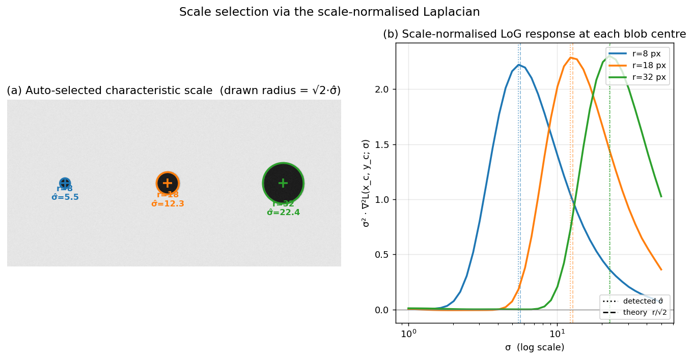

## Selection of Interest Point Scale Using the Laplacian

A fundamental limitation of early corner detectors such as Harris is their lack of **scale invariance**: a corner at one image resolution may appear as an edge or a flat region when the image is zoomed. To achieve scale-invariant detection, each interest point must be assigned a **characteristic scale**—the size of the local image structure that is most stable and repeatable across different views. The Laplacian of Gaussian (LoG) provides a principled mechanism for selecting this scale automatically and independently in each image.

### 1. The Concept of Characteristic Scale

The key idea is to treat the interest point not as a single pixel but as a **region** (typically a circle) whose radius is proportional to the scale $\sigma$. If we can find a function $F(x, y; \sigma)$ that attains a local extremum over both spatial location and scale, then the $\sigma$ at which the extremum occurs is covariant with the image scale. That is, if the image is scaled by a factor $s$, the extremum will shift to $s\sigma$, and the same physical region will be detected in both images.

For this to work, the function $F$ must be **scale-covariant**: its response to a given image structure should peak when the observation scale $\sigma$ matches the intrinsic scale of that structure. The Laplacian of Gaussian is one such function—it responds strongly to **blob-like** structures (regions of rapid intensity change that are roughly circular) and achieves its maximum when the zero-crossing of the Laplacian aligns with the boundary of the blob.

### 2. The Laplacian of Gaussian as a Scale-Selection Kernel

The Laplacian operator $\nabla^2$ measures the second spatial derivative of the image. Applied directly to a noisy image, it is highly sensitive to fine texture. To analyse structures at a given scale, the image is first smoothed with a Gaussian kernel $G(x, y; \sigma) = \frac{1}{2\pi\sigma^2} e^{-(x^2+y^2)/(2\sigma^2)}$. The **Laplacian of Gaussian** (LoG) is then the convolution of the image $I(x,y)$ with the Laplacian of the Gaussian:

$$
\nabla^2 L(x, y; \sigma) = \nabla^2 \bigl( G(x,y;\sigma) * I(x,y) \bigr) = \bigl( \nabla^2 G(x,y;\sigma) \bigr) * I(x,y),
$$

where

$$
\nabla^2 G(x,y;\sigma) = \frac{\partial^2 G}{\partial x^2} + \frac{\partial^2 G}{\partial y^2} = \frac{1}{\pi\sigma^4} \left( \frac{x^2+y^2}{2\sigma^2} - 1 \right) e^{-(x^2+y^2)/(2\sigma^2)}.
$$

The LoG kernel has a characteristic **Mexican-hat** shape: a positive central peak surrounded by a negative ring. When convolved with a bright circular blob on a dark background, the response is maximal at the centre of the blob when the scale $\sigma$ of the Gaussian matches the radius of the blob. If $\sigma$ is too small, the kernel sees only the flat interior; if $\sigma$ is too large, the blob is smoothed away. Thus, the LoG naturally acts as a **matched filter** for blobs of size proportional to $\sigma$.

### 3. Scale Normalisation

A critical detail is that the amplitude of the LoG response decays as $\sigma$ increases, because the Gaussian smoothing reduces the overall intensity variations. To make the response comparable across scales, the LoG must be **scale-normalised**. The correct normalisation factor for the Laplacian in $D$ dimensions is $\sigma^2$ (for 2D images, $\sigma^2$). The scale-normalised Laplacian is therefore

$$
\text{LoG}_{\text{norm}}(x, y; \sigma) = \sigma^2 \, \bigl| \nabla^2 L(x, y; \sigma) \bigr|.
$$

Multiplying by $\sigma^2$ compensates for the amplitude decay and ensures that a blob of fixed intensity will produce the same maximum response regardless of the scale at which it is observed. This property is essential for detecting extrema in the scale dimension.

### 4. Algorithm for Scale Selection

The scale-selection algorithm using the Laplacian proceeds in the following steps:

1. **Build a scale-space representation.**  
   Convolve the input image with a family of Gaussian kernels of increasing standard deviation $\sigma_1, \sigma_2, \dots, \sigma_n$. The sequence of smoothed images $L(x,y;\sigma_i)$ forms a **Gaussian scale space**. Typically, the scales are chosen in a geometric progression, e.g., $\sigma_i = \sigma_0 \, k^i$ with $k \approx 1.2\text{–}1.4$, covering a range that spans the expected sizes of image structures.

2. **Compute the scale-normalised Laplacian response.**  
   For each scale $\sigma_i$, compute the Laplacian of the smoothed image and multiply by $\sigma_i^2$:
   $$
   F(x, y; \sigma_i) = \sigma_i^2 \, \bigl| \nabla^2 L(x, y; \sigma_i) \bigr|.
   $$
   This yields a 3D volume of responses indexed by $(x, y, \sigma_i)$.

3. **Detect local extrema in space and scale.**  
   A point $(x, y, \sigma_i)$ is selected as a candidate scale if its response $F$ is a local maximum (or minimum, depending on the sign convention) in a $3 \times 3 \times 3$ neighbourhood—i.e., greater than all 26 neighbours in the $(x, y, \sigma)$ volume. This ensures that the point is both a spatial extremum and a scale extremum.

4. **Sub-scale refinement (optional but recommended).**  
   To obtain a more accurate scale estimate, a 1D quadratic (or a 3D quadratic in $(x,y,\sigma)$) can be fitted to the response values around the discrete extremum. The peak of the fitted polynomial gives a continuous scale value $\hat{\sigma}$ that is not restricted to the sampled $\sigma_i$.

5. **Output the characteristic scale.**  
   The refined $\hat{\sigma}$ is assigned to the interest point as its **characteristic scale**. The corresponding spatial location $(x,y)$ defines the centre of a circular region of radius proportional to $\hat{\sigma}$ (often $r = c \cdot \hat{\sigma}$, with $c \approx 3\text{–}5$ to encompass the full blob structure).

The algorithm is run independently on each image. Because the scale-normalised LoG is covariant with image scaling, the same physical blob will produce an extremum at a scale $\hat{\sigma}$ that is proportional to the true size of the blob in that image. Thus, the detected scales in two images of the same scene will be related by the same factor as the image scaling.

The figure below makes the mechanism concrete. Panel (a) shows three dark disks of radii $r \in \{8, 18, 32\}$ px; circles drawn at radius $\sqrt{2}\,\hat\sigma$ — where $\hat\sigma$ is the scale that maximises the scale-normalised LoG at the blob centre — sit on the true blob boundaries. Panel (b) plots the response $\sigma^2 \nabla^2 L(x_c, y_c; \sigma)$ as a function of $\sigma$ for each blob: each curve has a single clear peak, and the dotted (detected $\hat\sigma$) and dashed ($r/\sqrt{2}$, theory) markers nearly coincide ($\hat\sigma = 5.5,\ 12.3,\ 22.4$ vs. expected $5.66,\ 12.73,\ 22.63$). Larger blobs peak at larger $\sigma$, confirming that the location of the LoG extremum is covariant with the structure size.

### 5. Practical Considerations and Variants

- **Difference of Gaussians (DoG).**  
  Computing the full LoG at many scales can be expensive. The DoG, defined as
  $$
  \text{DoG}(x,y;\sigma) = G(x,y;k\sigma) - G(x,y;\sigma),
  $$
  provides an efficient approximation of the scale-normalised Laplacian up to a constant factor:
  $$
  \sigma^2 \nabla^2 G \approx \frac{1}{k-1} \bigl( G(k\sigma) - G(\sigma) \bigr).
  $$
  The SIFT detector exploits this relationship by searching for extrema of the DoG in a scale-space pyramid, which is computationally much cheaper than explicit LoG filtering.

- **Combined detectors: Harris-Laplacian.**  
  The Laplacian can be used solely for scale selection, while a different operator (e.g., the Harris cornerness measure) handles spatial localisation. In the **Harris-Laplacian** detector, candidate locations are first found as spatial maxima of the Harris response at a fixed initial scale. Then, for each candidate, the scale-normalised Laplacian is evaluated over a range of scales, and the scale that maximises the Laplacian is selected. This decouples spatial and scale detection, often improving repeatability.

- **Blob vs. corner scale.**  
  The Laplacian is inherently a **blob detector**—it responds best to circular, symmetric intensity changes. For corner-like structures, the determinant of the Hessian (DoH) or the Laplacian may still be used, but the scale selection is less sharp. In practice, the Laplacian (or its DoG approximation) has proven highly effective for a wide variety of natural image structures.

### 6. Summary

Scale selection using the Laplacian is a cornerstone of scale-invariant feature detection. The algorithm consists of:

- Constructing a Gaussian scale space.
- Computing the scale-normalised Laplacian response at each scale.
- Finding local extrema in the $(x, y, \sigma)$ volume.
- Assigning the extremum’s scale as the characteristic scale of the interest point.

This method, either directly or via the DoG approximation, underpins many widely used detectors (SIFT, Harris-Laplacian, Hessian-Laplacian) and enables the reliable matching of image regions across large changes in viewpoint and resolution.

---

### Self-Test

1. The scale-normalised LoG multiplies the raw response by $\sigma^2$. Why is this normalisation necessary, and what would go wrong if you compared raw LoG responses across scales without it?
2. The DoG approximates the scale-normalised Laplacian. Under what circumstances might this approximation break down, and how does the choice of the ratio $k$ affect the quality of the approximation?
3. Harris-Laplacian decouples spatial localisation from scale selection. Why might running Harris at a fixed initial scale before applying the Laplacian be preferable to using the Laplacian alone for both tasks?
4. Consider a textured image region where many overlapping blob-like structures exist at similar scales. How would this affect the scale-selection extremum, and when would the Laplacian-based method fail to assign a meaningful characteristic scale?

### Answer Key

1. Without scale normalisation, the amplitude of the raw LoG response decays as $\sigma$ increases because Gaussian smoothing suppresses intensity variations at larger scales. Comparing raw responses across scales would therefore systematically favour small-$\sigma$ detections, and scale-space extrema would always cluster at the finest scales rather than at the scale matching the true blob size. Multiplying by $\sigma^2$ compensates for this decay so that a blob of fixed intensity produces the same peak response regardless of the scale at which it is observed.

2. The DoG approximation $G(k\sigma) - G(\sigma) \approx (k-1)\,\sigma^2 \nabla^2 G$ is a first-order finite difference in log-scale, so it degrades when $k$ is large (coarse sampling introduces discretisation error) or very close to 1 (the difference becomes numerically unstable and the pyramid requires too many levels). In practice $k \approx 1.2$–$1.4$ balances approximation accuracy against computational cost; for highly elongated or irregular structures the isotropic Laplacian is already a poor model, and the DoG inherits those limitations regardless of $k$.

3. The Laplacian is a blob detector that responds best to circular, symmetric structures; it is less reliable at precisely localising corners or saddle points spatially. Harris, by contrast, uses the second-moment matrix to identify locations with large intensity curvature in all directions, giving sharper spatial localisation. Decoupling the tasks lets each operator do what it does best: Harris finds the where, and the Laplacian then finds the scale, typically improving repeatability compared to using the LoG alone for both.

4. When many overlapping blobs of similar size coexist, their individual LoG responses superpose and the $\sigma$-response curve may show a broad, flat plateau rather than a sharp peak, making the extremum ill-defined or sensitive to noise. The method fails to assign a meaningful characteristic scale whenever the response has no clear local maximum in the $(x, y, \sigma)$ volume—this happens in highly repetitive textures where the concept of a single dominant scale does not hold, and the detected $\hat{\sigma}$ would be unstable across small image perturbations.