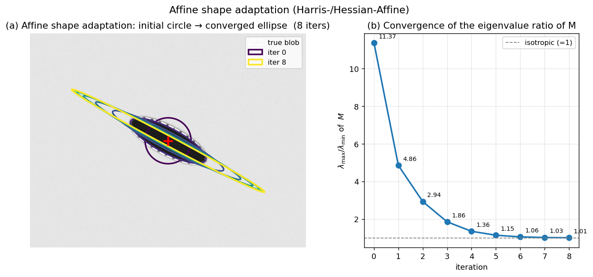

## Generalising Harris/Hessian Detectors to Affine Invariance

The standard Harris and Hessian detectors, even when augmented with scale selection (e.g., Harris-Laplacian, Hessian-Laplacian), provide only **similarity invariance** – they model the local image transformation as a rotation and uniform scaling. Under wide-baseline conditions, however, a circular region in one image may project to an elongated ellipse in the other due to perspective foreshortening. To achieve reliable matching across such viewpoints, the detector must be **affine covariant**: the detected region should transform according to the local affine map between the two images. The generalisation of the Harris/Hessian detector to full affine invariance is accomplished through an iterative process called **affine shape adaptation**.

### 1. Why Affine Adaptation Is Necessary

Recall that the second-moment matrix (auto-correlation matrix) of image gradients over a window $W$ is defined as

$$
M = \sum_{(x,y)\in W} w(x,y)
\begin{bmatrix}
I_x^2 & I_x I_y \\[2pt]
I_x I_y & I_y^2
\end{bmatrix},
$$

where $I_x, I_y$ are the image derivatives and $w$ is a Gaussian weighting function. The eigenvalues $\lambda_1, \lambda_2$ of $M$ characterise the local intensity structure: both large indicates a corner, one large and one small an edge, both small a flat region. Geometrically, the iso-contours of the quadratic form $[\Delta x\;\Delta y]\,M\,[\Delta x\;\Delta y]^\top = \text{const}$ are ellipses whose shape mirrors the local image texture. If the image patch undergoes an affine transformation, the corresponding second-moment matrix transforms in a covariant manner. This property is the key to estimating the local affine shape.

A detector is affine covariant if, when the image is deformed by an affine map $\mathbf{A}$, the detected region transforms as $\mathbf{A}$ as well. The standard Harris/Hessian detectors are not affine covariant because they assume a circular integration window. Affine adaptation iteratively deforms the window until the second-moment matrix becomes isotropic (equal eigenvalues), at which point the region is an affine-normalised patch.

### 2. The Affine Shape Adaptation Algorithm

The generalisation of a scale-invariant Harris or Hessian detector to affine invariance proceeds in the following steps. The same iterative refinement is applied to both detectors; the only difference lies in the initial spatial localisation (Harris cornerness vs. determinant of Hessian).

#### Step 1: Initial Scale-Invariant Detection

First, a **scale-invariant** version of the chosen detector is run to obtain an initial set of keypoints. For the Harris, this is the **Harris-Laplacian** detector: candidate locations are found as spatial maxima of the Harris cornerness $R$ at a fixed initial scale, and then the characteristic scale $\sigma_I$ is selected as the local extremum of the scale-normalised Laplacian $\sigma^2|\nabla^2 L|$ over scale. For the Hessian, the **Hessian-Laplacian** detector uses the determinant of the Hessian for spatial localisation and the Laplacian for scale selection. The output is a set of circular regions, each defined by a centre $(x,y)$ and a radius proportional to the detected scale $\sigma_I$.

#### Step 2: Compute the Second-Moment Matrix in the Current Region

For each initial region, an elliptical window is placed according to the current estimate of the affine shape. In the first iteration, the shape is a circle of radius $c\cdot\sigma_I$. The second-moment matrix $M$ is computed over this window using the image gradients:

$$
M = \begin{bmatrix}
\sum_W w\, I_x^2 & \sum_W w\, I_x I_y \\[4pt]
\sum_W w\, I_x I_y & \sum_W w\, I_y^2
\end{bmatrix}.
$$

The matrix $M$ is symmetric and positive semi-definite. Its eigenvectors point along the principal directions of the local gradient distribution, and the square roots of its eigenvalues are inversely proportional to the lengths of the axes of the ellipse that best describes the local affine shape.

#### Step 3: Estimate the Affine Shape and Normalise

From $M$, we derive a transformation that maps the current elliptical region to a circle. Let the eigenvalue decomposition of $M$ be

$$
M = V \Lambda V^\top, \quad \Lambda = \operatorname{diag}(\lambda_1, \lambda_2),
$$

with $\lambda_1 \ge \lambda_2 > 0$. The matrix $M^{-1/2} = V \Lambda^{-1/2} V^\top$ defines an affine transformation that, when applied to the image coordinates, normalises the region such that the second-moment matrix of the transformed patch becomes (approximately) the identity. In practice, a square-root decomposition such as the Cholesky factorisation of $M$ is often used to obtain the normalising transformation $\mathbf{T} = M^{-1/2}$.

The image patch is then warped by $\mathbf{T}$ to a canonical, isotropic frame. This step compensates for the non-uniform scaling and shear of the original patch.

#### Step 4: Re-detect the Interest Point in the Normalised Frame

In the normalised patch, the interest point is re-detected. For the Harris-Affine detector, the Harris cornerness $R$ is recomputed in the normalised frame, and the spatial location is refined (e.g., by taking the local maximum of $R$). For the Hessian-Affine detector, the determinant of the Hessian is used. Additionally, the integration scale $\sigma_I$ may be re-estimated (e.g., by searching for a local extremum of the Laplacian in the normalised frame) to update the scale.

#### Step 5: Update the Affine Shape and Iterate

The refined location and scale from the normalised frame are mapped back to the original image coordinates, yielding an updated elliptical region. The second-moment matrix is recomputed over this new region. The process is repeated: compute $M$, normalise, re-detect, update. The iteration continues until the eigenvalues of $M$ become sufficiently equal, i.e., the ratio $\lambda_1 / \lambda_2$ falls below a threshold (typically close to 1). At convergence, the region is **isotropic** – the second-moment matrix is a scalar multiple of the identity – meaning that the local image structure has been fully affine-normalised.

The final affine-covariant region is the concatenation of all transformations applied during the iterations. It is represented as an ellipse in the original image, defined by the centre $(x,y)$ and the affine shape matrix $M^{-1/2}$ (or equivalently, the ellipse parameters).

The figure below shows the iteration on a strongly anisotropic synthetic blob (white dashed ellipse, aspect ratio ≈ 3:1, rotated by 28°). Panel (a) overlays the integration window at every iteration, colour-coded from dark (initial isotropic circle) to bright (converged ellipse): the shape gradually elongates and rotates to align with the true blob. Panel (b) tracks $\lambda_{\max}/\lambda_{\min}$ of $M$, which collapses from $13.27$ to $1.01$ in 8 iterations — meaning $M$ has effectively become a scalar multiple of the identity, the defining isotropy criterion.

### 3. Mathematical Insight: Why This Works

The second-moment matrix $M$ computed over an affine-transformed patch $\tilde{I}(\tilde{\mathbf{x}}) = I(\mathbf{A}\tilde{\mathbf{x}})$ is related to the original $M$ by

$$
\tilde{M} = \mathbf{A}^{-\top} M \mathbf{A}^{-1}.
$$

If we choose a normalising transformation $\mathbf{T}$ such that $\tilde{M} = \mathbf{I}$ (the identity), then $\mathbf{T}^{-\top} M \mathbf{T}^{-1} = \mathbf{I}$, which implies $M = \mathbf{T}^\top \mathbf{T}$. The matrix $\mathbf{T}$ that achieves this is exactly $M^{-1/2}$. Thus, the iterative process converges to a fixed point where the normalised patch has an isotropic second-moment matrix, and the composition of all normalising transformations gives the affine map between the original image and the canonical frame. This map is covariant with the local affine distortion between different views of the same surface patch.

### 4. Practical Considerations

- **Initialisation:** The algorithm requires a reasonable initial scale and location. The scale-invariant Harris-Laplacian or Hessian-Laplacian detectors provide this. Without a good initialisation, the iteration may converge to a different local structure or fail to converge.
- **Convergence:** Typically 3–5 iterations suffice. The process is monitored by the eigenvalue ratio of $M$.
- **Integration scale vs. derivative scale:** The second-moment matrix is computed using a Gaussian window whose size (integration scale) is proportional to the current region scale. The derivative scale (smoothing before gradient computation) is usually set to a fraction of the integration scale.
- **Affine vs. similarity:** The output is an oriented ellipse, which provides a full affine frame. This can be further decomposed into a similarity frame (centre, scale, orientation) plus an affine shape component, which is useful for descriptor extraction (e.g., SIFT descriptors computed after affine normalisation).

### 5. Summary of the Generalisation Steps

1. **Detect** initial scale-invariant keypoints using Harris-Laplacian or Hessian-Laplacian (provides centre and scale).
2. **Compute** the second-moment matrix $M$ over the current elliptical region.
3. **Normalise** the region to a circle using the transformation $\mathbf{T} = M^{-1/2}$.
4. **Re-detect** the keypoint location and scale in the normalised frame.
5. **Update** the region shape and repeat from step 2 until $M$ becomes isotropic (eigenvalues equal).
6. **Output** the final affine-covariant ellipse as the distinguished region.

This iterative shape adaptation transforms the originally similarity-invariant Harris/Hessian detector into a fully affine-invariant detector, capable of finding repeatable correspondences even under significant perspective distortions. The resulting **Harris-Affine** and **Hessian-Affine** detectors have been foundational in wide-baseline matching and 3D reconstruction pipelines.

---

### Self-Test

1. The isotropy criterion requires $\lambda_1 / \lambda_2 \approx 1$ at convergence. Why is an isotropic $M$ the correct stopping condition — what does it mean geometrically about the relationship between the normalised patch and the original scene patch?
2. Affine shape adaptation is initialised with a scale-invariant detector, but it does not require a Harris or Hessian detector specifically. What properties must the initial detector have for the adaptation to converge to a meaningful ellipse, and what would go wrong if you initialised on an edge point instead of a corner?
3. The normalising transformation $\mathbf{T} = M^{-1/2}$ is applied at each iteration rather than composing a single large transform after all iterations. How does this iterative application affect stability and accuracy compared to estimating the full affine warp in one shot from the initial $M$?
4. Consider a scene patch that is genuinely isotropic (e.g., a circular blob viewed fronto-parallel). If a strong out-of-plane rotation is applied so that the blob projects to a thin ellipse with aspect ratio $\gg 1$, under what conditions might the affine adaptation fail to recover the correct ellipse, and what failure mode would you expect to observe?

### Answer Key

1. When $M$ is isotropic ($\lambda_1 / \lambda_2 \approx 1$, i.e., $M \approx c\mathbf{I}$), the iso-contours of the quadratic form $[\Delta x\;\Delta y]\,M\,[\Delta x\;\Delta y]^\top = \text{const}$ are circles rather than ellipses, meaning the local gradient distribution is uniform in all directions. Geometrically, this means the normalising transformation $\mathbf{T} = M^{-1/2}$ has mapped the affinely distorted scene patch into a canonical frame where the patch appears as it would fronto-parallel — the iteration has found the transformation that compensates for the perspective foreshortening. Stopping at this fixed point ensures that the accumulated transformation $\mathbf{T}$ is a valid estimate of the local affine warp between the two views.

2. The initial detector must localise a point where the second-moment matrix has two well-separated, positive eigenvalues (a corner-like structure), since this ensures $M$ is well-conditioned and $M^{-1/2}$ is numerically stable. An edge point has one large and one near-zero eigenvalue ($\lambda_2 \approx 0$), making $M$ nearly singular; the normalising transform $M^{-1/2}$ would involve dividing by $\sqrt{\lambda_2} \approx 0$, causing an unbounded stretch along the edge direction, and the iteration would diverge or produce a degenerate ellipse rather than converging to a meaningful affine region.

3. Estimating the full affine warp in one shot from the initial $M$ is prone to large errors because the initial circular window samples a mixture of image structure from outside the true region, making the first $M$ a poor estimate of the local affine geometry. Iterating allows each step to refine the sampling window based on a progressively better shape estimate, so errors are corrected incrementally; as noted in the text, convergence typically requires only 3–5 iterations, and the eigenvalue ratio $\lambda_{\max}/\lambda_{\min}$ collapses rapidly (e.g., from $13.27$ to $1.01$ in 8 iterations in the synthetic example). The iterative scheme is therefore more stable and accurate, particularly when the initial affine distortion is large.

4. The adaptation is likely to fail when the projected ellipse has a very high aspect ratio (e.g., $\gg 3{:}1$) because the thin ellipse may no longer contain enough image structure — the narrow axis of the region may span fewer than a few pixels, making gradient estimates unreliable and $M$ ill-conditioned. A secondary failure mode arises if the initial scale-invariant detector (Harris-Laplacian or Hessian-Laplacian) fails to fire at all on the thin ellipse, since a severely foreshortened blob may no longer produce a local extremum in the Harris cornerness or Hessian determinant. The expected failure observation would be either non-convergence (the eigenvalue ratio stays large) or convergence to a spurious nearby structure, producing an ellipse that does not correspond to the original scene patch.