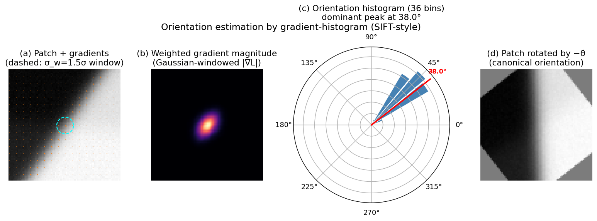

> **Source question (Q5):** Describe ways of local feature orientation estimation

## Local Feature Orientation Estimation

A local feature detected at a particular location and scale still lacks one essential degree of freedom: **rotation**. Two images of the same physical surface patch may be rotated relative to each other, and a descriptor computed on the raw patch would not match. To achieve **rotation invariance**, the patch must first be brought into a canonical orientation. This step is part of building a **similarity frame** – a coordinate system defined by centre $(x,y)$, scale $\sigma$, and orientation $\theta$ – that normalises the patch before description.

The task of orientation estimation is to assign one or more dominant orientations to each detected region, such that the same physical structure receives the same canonical orientation regardless of the image rotation. This section describes the classical gradient‑histogram method (used in SIFT and many other detectors) and briefly introduces learned alternatives.

### 1. The Need for a Canonical Orientation

A local feature detector (e.g., Harris‑Laplacian, Hessian‑Laplacian, DoG) provides a location $(x,y)$ and a characteristic scale $\sigma$. The region is typically a circle of radius proportional to $\sigma$. If we simply extract a descriptor from this circle, the descriptor will change when the image is rotated. To remove this dependency, we estimate a **dominant orientation** $\theta$ from the image content inside the region, rotate the patch by $-\theta$, and then compute the descriptor. The resulting descriptor is rotation‑invariant because the same dominant orientation will be found in both images (up to the relative rotation between the views).

### 2. Classical Approach: Gradient Orientation Histogram (SIFT)

The most widely used orientation assignment method is the one introduced by Lowe for SIFT. It operates on the scale‑space image $L(x,y;\sigma)$ at the detected scale $\sigma$. The steps are:

1. **Compute gradient magnitude and orientation** for every pixel in a circular neighbourhood around the keypoint. The radius of the neighbourhood is typically $3 \times 1.5\,\sigma$ (or a similar multiple). The gradient is computed from the smoothed image $L$ using finite differences:

   $$
   m(x,y) = \sqrt{ L_x(x,y)^2 + L_y(x,y)^2 },
   $$
   $$
   \theta(x,y) = \operatorname{atan2}\!\bigl(L_y(x,y),\, L_x(x,y)\bigr).
   $$

2. **Weight the contributions.** Each pixel’s gradient magnitude is weighted by a Gaussian window centred at the keypoint, with standard deviation equal to $1.5\,\sigma$. This gives more importance to gradients near the centre and makes the orientation estimate more stable.

3. **Build an orientation histogram.** The weighted gradient magnitudes are accumulated into a histogram of $36$ bins covering $360^\circ$ (each bin $10^\circ$). The histogram is formed by adding each pixel’s weighted magnitude to the bin corresponding to its gradient orientation. To avoid boundary effects, the magnitude is distributed (interpolated) between the two nearest bins.

4. **Detect peaks.** The histogram is smoothed (e.g., by a small moving average) to reduce noise. The highest peak is taken as the **dominant orientation**. Additionally, any other peak that is at least $80\%$ of the maximum is used to create an additional keypoint with that orientation. This handles cases where the local structure has multiple strong directions (e.g., a corner of a checkerboard), improving repeatability.

5. **Refine the orientation.** A parabola is fitted to the three histogram values around each peak to obtain a continuous orientation estimate with sub‑bin accuracy.

The result is one or more similarity frames $(x,y,\sigma,\theta_i)$. The patch is then rotated by $-\theta_i$ before descriptor extraction, making the descriptor invariant to in‑plane rotation.

This method is robust to illumination changes (because it uses gradient directions, not raw intensities) and to moderate affine distortions (because the histogram aggregates information over a neighbourhood). It is the de‑facto standard for hand‑crafted features and is used in SIFT, SURF, and many variants.

The figure below walks through the SIFT-style procedure on a synthetic patch with a single dominant edge at $35°$. Panel (a) overlays the gradient field and the Gaussian integration window of radius $1.5\sigma$ on the patch; panel (b) shows the weighted magnitude map (only pixels near the centre, where the edge dominates, contribute); panel (c) is the smoothed 36-bin orientation histogram in polar form with the parabolic-refined peak marked at $38.0°$ (within one bin of the true $35°$); panel (d) shows the patch warped by $-\hat\theta$, in which the edge has been brought to a canonical orientation. A second peak at $\ge 80\%$ of the dominant — if present — would yield an additional similarity frame at the same location.

### 3. Alternative: Intensity Centroid (FAST / ORB)

For real‑time applications, computing a full gradient histogram can be too expensive. The ORB detector (based on FAST corners) uses a much faster **intensity centroid** method. The orientation is defined as the direction from the corner’s centre to the centroid of the image intensities inside a circular patch:

$$
\theta = \operatorname{atan2}\!\left( \sum_{x,y} y\,I(x,y),\; \sum_{x,y} x\,I(x,y) \right),
$$

where the sums are taken over a circular region around the keypoint, and $I(x,y)$ is the (possibly smoothed) intensity. This measure is very fast to compute using integral images and provides a reasonable orientation estimate for blob‑like and corner‑like structures. It is, however, less accurate than the gradient‑histogram method and can be sensitive to noise and illumination changes.

### 4. Learned Orientation Estimation: OriNet

Modern learned local features often replace the hand‑crafted orientation assignment with a small neural network. **OriNet**, shown in the lecture, is a lightweight CNN that takes a patch as input and directly regresses the canonical orientation. The network is trained on image patches with known relative rotations, learning to predict an orientation that maximises descriptor similarity after rotation. Such learned estimators can be more robust to complex intensity variations and can be jointly optimised with the descriptor. The lecture slides illustrate OriNet producing consistent upright patches even for challenging textures.

### 5. Summary

Orientation estimation is a critical step that turns a scale‑invariant region into a fully similarity‑invariant frame. The classical gradient‑histogram method (SIFT) remains the most common: it computes a weighted histogram of gradient directions, selects dominant peaks, and assigns one or more canonical orientations. Faster alternatives like the intensity centroid (ORB) trade some accuracy for speed, while learned methods (OriNet) offer state‑of‑the‑art robustness. In all cases, the assigned orientation is used to rotate the patch to a canonical pose, enabling the subsequent descriptor to be rotation‑invariant and thus repeatable across wide‑baseline views.

---

### Self-Test

1. SIFT weights gradient contributions by a Gaussian window centred at the keypoint. Why is this weighting important, and what could go wrong if a uniform (box) window were used instead?
2. The intensity centroid method (ORB) estimates orientation using $\theta = \operatorname{atan2}(\sum y\,I, \sum x\,I)$. Under what imaging conditions would this approach produce unreliable or completely wrong orientation estimates?
3. SIFT allows multiple keypoints at the same location when a secondary histogram peak exceeds 80% of the dominant peak. How does this trade off descriptor repeatability against the total number of keypoints, and when might you want to disable this behaviour?
4. OriNet is trained to regress orientations that maximise descriptor similarity after rotation, rather than to match a ground-truth orientation label. Why is this objective better suited to the downstream matching task than supervising with explicit angle targets?

### Answer Key

1. The Gaussian weighting gives more importance to gradients near the keypoint centre, making the orientation estimate stable and less sensitive to outlier gradients at the patch boundary that may belong to unrelated structures. With a uniform box window, pixels at the periphery of the neighbourhood — which may lie on different surfaces or edges — would contribute equally to the histogram, causing the dominant peak to shift unpredictably and reducing repeatability across views.

2. The intensity centroid computes the first moment of raw intensities $\sum x\,I(x,y)$ and $\sum y\,I(x,y)$, so it relies on an asymmetric intensity distribution to define a direction. If the patch has a nearly uniform intensity (low contrast region) or is approximately radially symmetric (e.g., a circular blob), the centroid coincides with the geometric centre and $\theta$ becomes numerically unstable or arbitrary. Similarly, a global illumination change (e.g., additive bias) shifts all intensities equally and can rotate the centroid direction, making the method sensitive to illumination compared to the gradient-based SIFT approach.

3. Adding secondary keypoints at peaks $\geq 80\%$ of the dominant improves repeatability at locations with genuinely ambiguous orientation (e.g., a checkerboard corner), because at least one assigned orientation is likely to match the counterpart in the other image. The trade-off is that the total number of keypoints — and therefore descriptor comparisons — can increase significantly, adding computational cost and potentially introducing more false matches; in applications where efficiency or a strict keypoint budget matters, disabling this multi-orientation behaviour reduces the keypoint count at the cost of lower repeatability on rotationally ambiguous structures.

4. The canonical orientation is only meaningful insofar as it leads to a descriptor that matches across views; there is no single "correct" angle label for a patch because any consistent orientation convention works as long as both images agree. Supervising with explicit ground-truth angles would force the network to replicate a specific convention (e.g., SIFT's gradient-histogram peak), potentially losing orientations that are easier for the descriptor to exploit. Training with the descriptor-similarity objective allows OriNet and the descriptor to co-adapt, finding an orientation assignment that is jointly optimal for matching even on textures where hand-crafted conventions produce poorly matched descriptors.