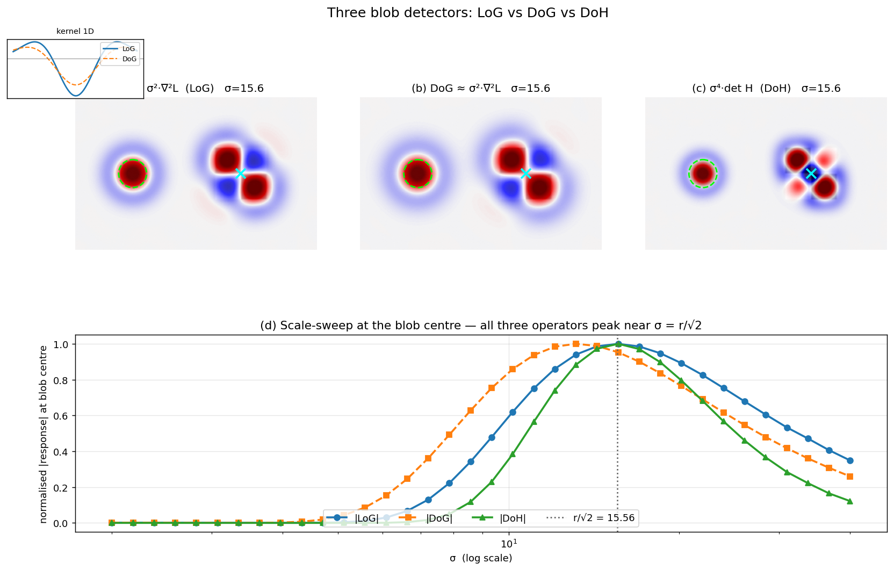

## Hessian and Difference-of-Gaussian Interest Points

The previous sections introduced the Laplacian of Gaussian (LoG) as a scale-selection mechanism and described how to build scale-invariant detectors by searching for extrema of the scale-normalised LoG in scale space. In practice, two other operators are widely used for detecting blob-like interest points with automatic scale selection: the **determinant of the Hessian (DoH)** and the **Difference of Gaussians (DoG)**. Both are closely related to the LoG, but each offers distinct computational or theoretical advantages. This section defines these two interest point detectors, explains their relationship to the Laplacian, and summarises their key properties.

### 1. The Hessian Detector (Determinant of the Hessian)

The Hessian matrix of a 2D image $L(x,y;\sigma)$ (smoothed by a Gaussian of standard deviation $\sigma$) is the matrix of second-order partial derivatives:

$$
H(x,y;\sigma) =
\begin{bmatrix}
L_{xx}(x,y;\sigma) & L_{xy}(x,y;\sigma) \\[4pt]
L_{xy}(x,y;\sigma) & L_{yy}(x,y;\sigma)
\end{bmatrix},
$$

where $L_{xx} = \frac{\partial^2 L}{\partial x^2}$, $L_{yy} = \frac{\partial^2 L}{\partial y^2}$, and $L_{xy} = \frac{\partial^2 L}{\partial x \partial y}$. The Hessian is symmetric but, unlike the second-moment matrix $M$ used in the Harris detector, it is **not** positive semi-definite. Its determinant,

$$
\det H = L_{xx} L_{yy} - L_{xy}^2,
$$

provides a strong response to **blob-like structures**. Specifically:

- $\det H > 0$ indicates a bright blob on a dark background or a dark blob on a bright background (both eigenvalues have the same sign).
- $\det H < 0$ corresponds to a saddle point (eigenvalues of opposite sign), which typically occurs near edges or junctions.

Because $\det H$ is formed from second derivatives, it is **rotation invariant** – rotating the image merely rotates the Hessian, leaving its determinant unchanged.

#### 1.1 Scale Normalisation

As with the Laplacian, the amplitude of $\det H$ decays as the smoothing scale $\sigma$ increases. To enable comparison across scales, the determinant must be **scale-normalised**. For a second-order differential operator in 2D, the correct normalisation factor is $\sigma^4$ (each derivative contributes a factor of $\sigma$, and we have two derivatives in each term). The scale-normalised determinant of the Hessian is therefore

$$
\text{DoH}_{\text{norm}}(x,y;\sigma) = \sigma^4 \, \bigl| \det H(x,y;\sigma) \bigr|.
$$

Multiplying by $\sigma^4$ compensates for the amplitude decay and makes the response of a blob of fixed intensity independent of the observation scale.

#### 1.2 Scale-Space Extrema Detection

To detect interest points with automatic scale selection, the normalised determinant of the Hessian is computed at a set of scales $\sigma_1, \dots, \sigma_n$ (typically arranged in a geometric progression). Local extrema of $\text{DoH}_{\text{norm}}$ are then sought in the 3D $(x,y,\sigma)$ volume. A point is selected if its response is a maximum (or minimum) relative to its 26 neighbours in space and scale. This yields a set of **blob-like regions**, each with a centre $(x,y)$ and a characteristic scale $\hat{\sigma}$.

This detector is often called the **Hessian–Hessian** detector (when both spatial localisation and scale selection are performed with the Hessian) or, when combined with the Laplacian for scale selection, the **Hessian–Laplacian** detector. The latter uses the determinant of the Hessian for spatial localisation and the scale-normalised Laplacian for scale selection, combining the strengths of both operators.

#### 1.3 Properties of the Hessian Detector

- **Blob detection:** The determinant of the Hessian responds strongly to circular, symmetric intensity changes (blobs). It is less effective for pure corners, where the second-moment matrix (Harris) is preferable.
- **Rotation invariance:** $\det H$ is invariant to image rotation.
- **Scale invariance:** Achieved by searching for extrema of the scale-normalised response over a Gaussian scale space.
- **Sensitivity to noise:** Second derivatives amplify high-frequency noise. In practice, the image is first smoothed with a Gaussian of an appropriate derivative scale (usually a fraction of the integration scale $\sigma$), and the derivatives are computed either analytically via Gaussian derivatives or by finite differences on the smoothed image.
- **Computational cost:** Computing the full Hessian at every scale can be expensive. However, the Hessian detector can be accelerated using integral images and box-filter approximations, as done in the SURF detector.

### 2. The Difference of Gaussians (DoG)

The **Difference of Gaussians** is an efficient approximation of the scale-normalised Laplacian of Gaussian. It is defined as the difference between two Gaussian-smoothed images at nearby scales:

$$
\text{DoG}(x,y;\sigma) = L(x,y;k\sigma) - L(x,y;\sigma) = \bigl( G(x,y;k\sigma) - G(x,y;\sigma) \bigr) * I(x,y),
$$

where $k > 1$ is a constant multiplicative factor (typically $k \approx 1.2$–$1.6$). The DoG operator approximates the Laplacian up to a constant factor:

$$
\sigma^2 \nabla^2 G \;\approx\; \frac{1}{k-1} \bigl( G(k\sigma) - G(\sigma) \bigr).
$$

This relationship can be derived from the heat diffusion equation: the derivative of the Gaussian with respect to $\sigma$ satisfies $\sigma \nabla^2 G = \frac{\partial G}{\partial \sigma}$, and the finite difference $\frac{G(k\sigma)-G(\sigma)}{k\sigma - \sigma}$ approximates $\frac{\partial G}{\partial \sigma}$. Rearranging yields the above proportionality. Consequently, the DoG response is a close approximation of the scale-normalised Laplacian, inheriting its blob-detection and scale-selection properties.

#### 2.1 Efficient Computation in a Scale-Space Pyramid

The principal advantage of the DoG is its computational efficiency. To build a scale-space representation, the image is repeatedly smoothed with a Gaussian of increasing $\sigma$. Subtracting adjacent smoothed images yields the DoG at negligible extra cost. In the classic SIFT detector, the scale space is organised into **octaves** (pyramid levels), where each octave is a set of progressively blurred images. Within an octave, the DoG images are formed by subtracting neighbouring scales. The octave is then downsampled by a factor of 2, and the process is repeated. This pyramid structure drastically reduces the number of expensive convolutions.

#### 2.2 DoG Extrema as Interest Points

Interest points are detected as local extrema of the DoG in the $(x,y,\sigma)$ volume. A pixel is compared with its 8 spatial neighbours in the same DoG image and with the 9 neighbours in the scale above and the 9 neighbours in the scale below (26 neighbours in total). If it is a maximum or minimum, it is selected as a candidate keypoint. Sub-pixel and sub-scale refinement is then performed by fitting a 3D quadratic to the DoG values around the extremum, yielding accurate location and scale estimates.

The DoG detector is the core of the **SIFT** (Scale-Invariant Feature Transform) feature detector. It produces a set of similarity-covariant regions (centre, scale) that are then assigned a dominant orientation and described by the SIFT descriptor.

#### 2.3 Properties of the DoG Detector

- **Blob detection:** Because the DoG approximates the LoG, it responds primarily to blob-like structures. It is the de facto standard for scale-invariant blob detection.
- **Rotation invariance:** The DoG operator is isotropic (the Gaussian is circularly symmetric), so the detector is rotation invariant.
- **Scale invariance:** Achieved by detecting extrema in the scale-space pyramid. The detected scale $\hat{\sigma}$ is covariant with image scaling.
- **Computational efficiency:** The DoG is extremely fast to compute once the Gaussian pyramid has been built. This efficiency made real-time, large-scale matching feasible and contributed to the widespread adoption of SIFT.
- **Approximation quality:** The DoG is a close but not exact approximation of the scale-normalised Laplacian. For $k$ close to 1, the approximation error is small, but a very small $k$ requires more scales per octave, increasing memory and computation. Typical values ($k = \sqrt{2}$ or $2^{1/3}$) provide a good trade-off.

The figure below compares the three operators on a test image containing a dark disk of radius $r = 22$ px (green dashed circle) and a saddle-shaped XOR pattern (cyan cross). The top row shows the spatial response of $\sigma^2\nabla^2 L$, the DoG approximation, and $\sigma^4 \det H$ at $\sigma = r/\sqrt{2}$; the LoG and DoG maps are almost indistinguishable (their 1D kernel profiles, inset top-left, nearly coincide), while the DoH response on the saddle is markedly weaker because $\det H < 0$ there (eigenvalues of $H$ have opposite signs). The bottom row sweeps $\sigma$ at the blob centre — all three curves peak near the theoretical $r/\sqrt{2} = 15.56$ (LoG $= 15.60$, DoG $= 13.15$, DoH $= 15.60$), with the DoG slightly biased because it is an approximation rather than exact.

### 3. Relationship Between Hessian, DoG, and Laplacian

All three operators – Laplacian, determinant of Hessian, and Difference of Gaussians – are **blob detectors** that can be used for scale-invariant interest point detection. Their relationships can be summarised as follows:

- The **Laplacian** $\nabla^2 L$ is the trace of the Hessian ($L_{xx} + L_{yy}$). It responds maximally when the scale of the Gaussian matches the size of a blob.
- The **determinant of the Hessian** $\det H = L_{xx}L_{yy} - L_{xy}^2$ is a different combination of second derivatives. It also peaks on blobs but has a slightly different selectivity: it penalises elongated structures more strongly than the Laplacian, making it somewhat more selective for circular blobs.
- The **Difference of Gaussians** is a direct approximation of the scale-normalised Laplacian, obtained by subtracting two nearby scales in the Gaussian pyramid. It inherits the Laplacian’s blob-detection properties while being computationally cheaper.

In practice, the choice among these operators depends on the application. The DoG (SIFT) is the most widely used because of its excellent balance of speed and repeatability. The Hessian (often in its fast box-filter approximation, SURF) is also popular. Both can be combined with the Harris cornerness measure to create hybrid detectors (Harris-Laplacian, Hessian-Laplacian) that exploit the strengths of corner and blob detection.

### 4. Summary

- The **Hessian detector** uses the determinant of the Hessian matrix, scale-normalised by $\sigma^4$, to detect blob-like interest points in scale space. It is rotation invariant and, when extrema are sought over scale, scale invariant. It responds to circular intensity changes and can be used for both spatial localisation and scale selection.
- The **Difference of Gaussians** is an efficient approximation of the scale-normalised Laplacian, formed by subtracting adjacent scales in a Gaussian pyramid. It is the core of the SIFT detector and provides fast, repeatable, scale-invariant blob detection.
- Both operators are isotropic, rotation invariant, and achieve scale invariance through local extremum search in a 3D $(x,y,\sigma)$ volume. They are fundamental building blocks of modern local feature pipelines, enabling reliable matching across wide changes in viewpoint, scale, and illumination.

---

### Self-Test

1. The DoG approximates the scale-normalised LoG, yet all three operators (LoG, DoG, DoH) respond strongly to blobs — why does $\det H$ still penalise elongated structures more than the Laplacian, even though both use the same second derivatives?
2. If you increase the multiplicative factor $k$ (the ratio between adjacent scales) in the DoG pyramid, how does this affect the quality of the LoG approximation and what practical trade-off does it introduce?
3. A scene contains a repeating grid of small dark squares on a white background. Under what conditions would the DoH detector fail to reliably localise interest points at the corners of those squares, and which detector would be more appropriate?
4. The Hessian-Laplacian detector uses $\det H$ for spatial localisation and the scale-normalised LoG for scale selection. Why might this combination outperform using either operator alone for both tasks?

### Answer Key

1. The Laplacian is the **trace** of the Hessian ($L_{xx} + L_{yy}$), which measures the average curvature in all directions and responds even when curvature is strong in only one direction (i.e., ridges or edges). The determinant $\det H = L_{xx}L_{yy} - L_{xy}^2$ requires both eigenvalues to be large and of the same sign; when the structure is elongated, one eigenvalue is much smaller than the other, strongly suppressing $\det H$ while leaving the trace (LoG) relatively high. This is why the text notes that the DoH response on the saddle-shaped XOR pattern is "markedly weaker" — $\det H < 0$ there — making it more selective for truly circular blobs.

2. Increasing $k$ makes the finite difference $G(k\sigma) - G(\sigma)$ a coarser approximation of $\frac{\partial G}{\partial \sigma}$, increasing the proportionality error relative to the scale-normalised LoG (the text states that "for $k$ close to 1, the approximation error is small"). The practical trade-off is that a larger $k$ means fewer scales are needed per octave, reducing memory and computation, but at the cost of scale-selection accuracy; the detected scale $\hat{\sigma}$ can be more biased relative to the true blob size, as seen in the figure where the DoG peak ($\sigma \approx 13.15$) is already slightly off the theoretical value even at a moderate $k$.

3. The corners of the squares are saddle-like junctions where the Hessian eigenvalues have opposite signs, giving $\det H < 0$; the text explicitly states that $\det H < 0$ "corresponds to a saddle point" and "typically occurs near edges or junctions," so the DoH would yield negative (suppressed) responses exactly at corners. The Harris corner detector — which uses the second-moment matrix $M$ rather than the Hessian — is described in the text as preferable "for pure corners," since $M$ is positive semi-definite and its determinant remains positive at corners where intensity changes occur in two directions.

4. The determinant of the Hessian provides sharper spatial localisation on blobs because it penalises asymmetric structures and has a tighter spatial footprint, while the scale-normalised LoG (as the exact operator rather than the DoG approximation) gives a more accurate and unbiased scale-space peak, as illustrated by the figure where the LoG peak ($\sigma = 15.60$) matches the theoretical value $r/\sqrt{2} = 15.56$ more closely than the DoH spatial peak alone would in noisy conditions. Combining them lets each operator do what it does best: $\det H$ localises the point in $(x,y)$ with high precision, and the LoG selects the true characteristic scale $\hat{\sigma}$, producing detections that are both spatially accurate and correctly scaled.