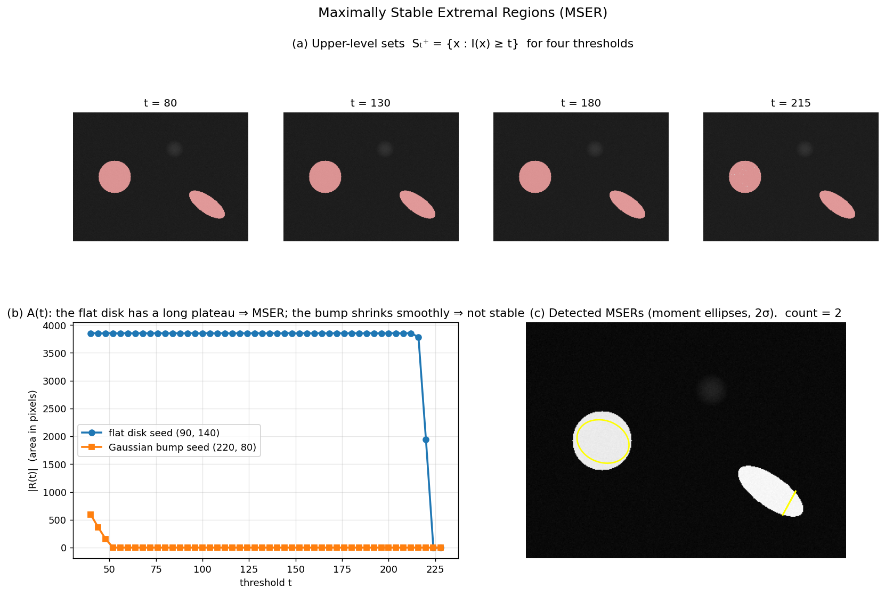

## Maximally Stable Extremal Regions (MSER)

The detectors discussed so far – Harris, Hessian, DoG – are **point‑based**: they locate a centre and a scale, then grow a circular or elliptical region around it. A fundamentally different philosophy is to treat the image as a set of nested level sets and to detect **regions directly** as connected components of thresholded images. The **Maximally Stable Extremal Region (MSER)** detector, introduced by Matas et al., follows this second path. It produces regions that are **affine covariant**, robust to monotonic illumination changes, and complementary to corner/blob detectors. MSERs have been a cornerstone of wide‑baseline matching, particularly for scenes with homogeneous intensity structures (e.g., buildings, text, graffiti).

### 1. Extremal Regions

Let $I: \mathbb{D} \subset \mathbb{Z}^2 \to \mathbb{R}$ be a discrete image. For a given threshold $t$, the **upper level set** is

$$
S_t^+ = \{\, \mathbf{x} \in \mathbb{D} \mid I(\mathbf{x}) \ge t \,\}.
$$

A connected component of $S_t^+$ is called an **extremal region** (or, more precisely, a **maximally connected component** of the threshold set). Analogously, lower level sets $S_t^- = \{\mathbf{x} \mid I(\mathbf{x}) \le t\}$ define extremal regions for dark‑on‑bright structures. The collection of all extremal regions obtained by varying $t$ over the full intensity range forms a tree (the **component tree**), because regions are nested: if $t_1 > t_2$, then $S_{t_1}^+ \subseteq S_{t_2}^+$, so every region at a higher threshold is contained in a region at a lower threshold.

Key properties of extremal regions:

- **Invariance to monotonic intensity transformations.** If the image undergoes a strictly monotonic remapping $I' = f(I)$, the ordering of pixel intensities is preserved. Consequently, the set of extremal regions is unchanged – only the threshold values at which they appear are shifted. This makes MSER inherently robust to changes in illumination, contrast, and gamma correction.
- **Affine covariance.** Under an affine transformation of the image plane, connected components remain connected, and the nesting structure is preserved. The area of a region scales by the determinant of the affine map. Therefore, the extremal regions themselves are affine‑covariant sets. In practice, the discrete grid introduces small deviations, but the covariance holds well for moderate affine distortions.
- **Nested hierarchy.** The component tree provides a multi‑scale representation of the image without any explicit scale parameter. Large regions correspond to coarse structures; small regions to fine details.

### 2. Maximally Stable Criterion

Not all extremal regions are equally useful. A region that barely changes its shape over a wide range of thresholds is more likely to correspond to a stable physical structure, while a region that appears and disappears abruptly is likely due to noise or texture. The **maximally stable** criterion formalises this intuition.

Consider an extremal region $R_t$ obtained at threshold $t$. As $t$ is varied by a small amount $\Delta$, the region evolves into $R_{t+\Delta}$ (for positive $\Delta$, the region shrinks; for negative $\Delta$, it grows). The **stability** of $R_t$ is measured by the relative rate of change of its area:

$$
s(t) = \frac{|R_{t-\Delta} \setminus R_{t+\Delta}|}{|R_t|},
$$

or, more commonly, by the derivative of the area function $A(t) = |R_t|$:

$$
s(t) = \frac{A(t+\Delta) - A(t-\Delta)}{A(t)}.
$$

A region is declared **maximally stable** if $s(t)$ attains a local minimum at its threshold. In other words, the region’s area remains nearly constant over a range of thresholds, indicating a stable intensity plateau or valley.

The MSER detector selects those extremal regions that are local minima of the stability measure, subject to additional constraints on minimum/maximum size, acceptable aspect ratio, and margin (to avoid regions touching the image border).

### 3. Detection Algorithm

The MSER detection algorithm is remarkably efficient, running in near‑linear time in the number of pixels. The core idea is to process pixels in sorted order of intensity and maintain connected components using a union‑find (disjoint‑set) data structure.

#### Step 1: Sort pixels by intensity

All $N$ pixels are sorted into ascending (or descending) order of their intensity values. This step costs $O(N \log N)$ if a comparison‑based sort is used, or $O(N)$ if the intensity range is small (e.g., 8‑bit images) via bucket sort.

#### Step 2: Process pixels and grow components

Pixels are added one by one in the sorted order. When a pixel is added, it initially forms a new component. If any of its 4‑ (or 8‑) neighbours have already been added, the components are merged using union‑find. The area of each component is tracked as the number of pixels it contains.

As the threshold increases (processing from low to high intensities for dark‑on‑bright regions), components appear, grow, merge, and eventually disappear. The algorithm records the **history** of each component: the threshold at which it was created, the thresholds at which it merged with others, and its area at every step.

#### Step 3: Compute stability and select MSERs

From the component history, the area function $A(t)$ for each component is known. The stability measure is evaluated by looking at the variation of area over a small intensity interval $\Delta$ (typically a few grey levels). Components whose relative area change is a local minimum and that satisfy size and shape constraints are retained as MSERs.

To detect both bright and dark regions, the algorithm is run twice: once on the original image (for dark‑on‑bright) and once on the inverted image (for bright‑on‑dark).

#### Step 4: Ellipse fitting (optional)

The detected MSERs are sets of pixels of arbitrary shape. For compatibility with standard descriptor pipelines (e.g., SIFT), each region is approximated by an ellipse. The ellipse parameters are obtained by computing the first‑ and second‑order geometric moments of the region’s characteristic function:

$$
\mu_{pq} = \sum_{(x,y)\in R} x^p y^q.
$$

The centre is $(\mu_{10}/\mu_{00},\,\mu_{01}/\mu_{00})$, and the covariance matrix

$$
\Sigma = \begin{bmatrix}
\mu_{20}/\mu_{00} - \bar{x}^2 & \mu_{11}/\mu_{00} - \bar{x}\bar{y} \\[4pt]
\mu_{11}/\mu_{00} - \bar{x}\bar{y} & \mu_{02}/\mu_{00} - \bar{y}^2
\end{bmatrix}
$$

defines the ellipse axes (via its eigenvectors) and their lengths (proportional to the square roots of its eigenvalues). This ellipse is an affine‑covariant representation of the region and can be used directly for affine normalisation and descriptor extraction.

The figure below illustrates the MSER concept on a synthetic image containing a flat bright disk (sharp boundary), a soft Gaussian bump (no plateau), and an oriented bright ellipse. Panel (a) overlays the upper-level set $S_t^+$ at four thresholds: the disk and ellipse retain their full area until the threshold approaches their plateau intensity, then collapse abruptly; the Gaussian bump shrinks gradually. Panel (b) plots $A(t)$ for the two seed regions — the disk's area is essentially flat over a wide range of $t$, producing a local minimum of the stability measure (MSER), while the bump's area shrinks smoothly and never becomes stable. Panel (c) shows the two MSERs returned by OpenCV's detector, each approximated by its second-moment ellipse — the affine-covariant representation that downstream descriptor pipelines consume.

### 4. Properties of MSER

- **Affine covariance.** The nested extremal regions and the stability measure are preserved under affine transformations (up to discretisation effects). The ellipse fitted to an MSER transforms covariantly with the affine map, making MSER a true affine‑covariant region detector.
- **Illumination invariance.** Because only the ordering of intensities matters, MSER is completely invariant to any monotonic remapping of the intensity values. This is a stronger property than the additive/multiplicative invariance of gradient‑based detectors.
- **Multi‑scale character.** The component tree naturally captures structures at all scales without the need to build a scale‑space pyramid. Large, stable regions correspond to coarse structures; small, stable regions to fine details.
- **Complementarity to corner/blob detectors.** MSER excels on images with homogeneous, well‑defined regions (e.g., buildings, text, printed patterns), while Harris/Hessian/DoG detectors perform better on textured, corner‑rich scenes. In practice, combining MSER with a point‑based detector improves overall repeatability.
- **Efficiency.** The union‑find algorithm runs in $O(N \alpha(N))$ time, where $\alpha$ is the inverse Ackermann function, making it essentially linear in the number of pixels after sorting. This is significantly faster than building a full scale‑space pyramid and computing derivatives at every scale.
- **Robustness to noise.** The stability criterion naturally suppresses regions caused by noise, because noisy intensity fluctuations produce components whose area changes rapidly with threshold.

### 5. Summary

Maximally Stable Extremal Regions (MSER) are connected components of thresholded images that exhibit minimal area variation over a range of thresholds. They are detected by an efficient union‑find algorithm that processes pixels in sorted intensity order, tracks component areas, and selects local minima of a stability measure. MSERs are affine‑covariant, invariant to monotonic intensity changes, and provide a complementary set of distinguished regions to gradient‑based detectors. Their output – either as pixel sets or as fitted ellipses – can be directly fed into the same descriptor and matching pipelines used for SIFT, SURF, or other local features, making them a versatile tool in wide‑baseline matching, 3D reconstruction, and image retrieval.

---

### Self-Test

1. A Gaussian blob has no sharp intensity boundary, so its area $A(t)$ decreases smoothly as $t$ increases. Why would MSER fail to detect it, and what image structure would MSER detect reliably instead?
2. MSER claims invariance to monotonic intensity transformations, whereas Harris and DoG do not. What fundamental difference in how each detector uses pixel values explains this gap?
3. If you increase the stability parameter $\Delta$ (the interval over which area change is measured), how does this affect the number and character of detected MSERs — would you expect more or fewer regions, and would they tend to be larger or smaller?
4. Consider a scene photographed under strong cast shadows that create sharp intensity edges crossing through a uniform painted wall. Would MSER more likely produce false detections from the shadow boundaries or miss the wall region entirely? Explain your reasoning.

### Answer Key

1. MSER requires the area function $A(t)$ to have a local minimum of the stability measure $s(t) = (A(t+\Delta) - A(t-\Delta))/A(t)$; a Gaussian blob's area shrinks smoothly with no plateau, so $s(t)$ never attains a local minimum. MSER reliably detects regions with flat, homogeneous interiors bounded by sharp intensity edges — such as the painted disk or oriented ellipse described in Section 2 — where $A(t)$ remains nearly constant over a wide threshold range before collapsing abruptly.

2. Harris and DoG compute gradients or Laplacians, which depend on the absolute magnitude of intensity differences; a monotonic remap $I' = f(I)$ alters those magnitudes and thus changes detector responses. MSER, by contrast, only tracks connected components of level sets defined by intensity ordering, and a strictly monotonic remap preserves the ordering of all pixel values exactly — so the component tree structure, and therefore the set of extremal regions, is unchanged (Section 1, "Invariance to monotonic intensity transformations").

3. Increasing $\Delta$ widens the interval over which area change is measured, making the stability criterion more demanding: only regions whose area is stable across a broader intensity range will survive as local minima of $s(t)$. The result is fewer detected MSERs, and they tend to be larger, since bigger homogeneous regions maintain stable areas over wider threshold intervals more easily than small, delicate structures.

4. MSER would more likely produce false detections from the shadow boundaries rather than miss the wall entirely. The uniform painted wall is precisely the kind of flat, high-area extremal region MSER is designed to detect, so its connected component would appear stable over a wide threshold range. The sharp shadow edges, however, subdivide what was a single uniform region into separate components at the threshold where shadow and lit areas diverge — each sub-region may still exhibit sufficient stability to be detected, yielding additional (potentially spurious) regions along the shadow boundary.