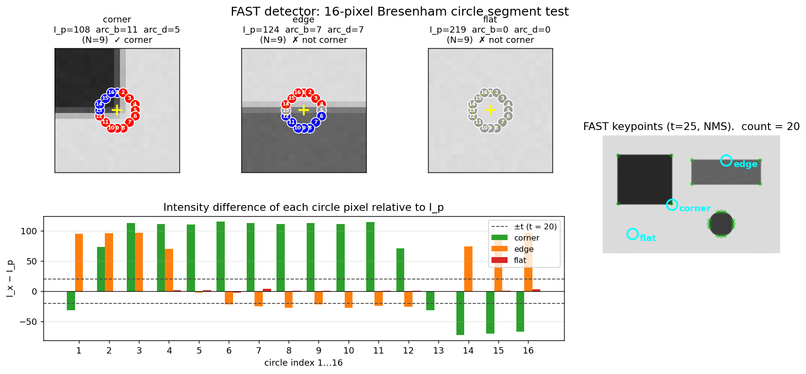

> **Source question (Q8):** The FAST interest point detector

## The FAST Interest Point Detector

The detectors discussed so far – Harris, Hessian, DoG – rely on image derivatives and, in the case of scale‑invariant methods, on scale‑space pyramids. While they provide high repeatability and well‑localised features, their computational cost can be prohibitive for real‑time applications such as visual SLAM or augmented reality. The **Features from Accelerated Segment Test (FAST)** detector, introduced by Rosten and Drummond, takes a radically different approach: it defines a corner as a pixel whose intensity differs sufficiently from a contiguous set of pixels on a surrounding circle. This simple, intensity‑comparison‑based test can be executed extremely quickly, making FAST the backbone of many real‑time systems, most notably the ORB feature.

### 1. Motivation and Design Philosophy

The Harris detector computes a cornerness response from the second‑moment matrix of image gradients, requiring Gaussian smoothing, gradient computation, and a local maximum search. Even a well‑optimised Harris implementation runs in tens of milliseconds per frame, which is too slow for frame‑rate processing on embedded platforms. FAST was designed to answer a single question: *can we decide whether a pixel is a corner by looking only at a sparse set of intensity comparisons?* The answer is yes, and the resulting detector is orders of magnitude faster than gradient‑based alternatives while retaining surprisingly good repeatability for corner‑like structures.

### 2. The Segment Test Criterion

Consider a candidate pixel $p$ with intensity $I_p$. A circle of 16 pixels is defined around $p$, typically with a radius of 3 pixels (Bresenham circle). The 16 pixels on the circumference are indexed $1 \dots 16$ in clockwise order. The **segment test** classifies $p$ as a corner if there exists a contiguous arc of at least $N$ pixels on the circle that are all **brighter** than $I_p + t$ or all **darker** than $I_p - t$, where $t$ is a user‑defined intensity threshold.

Formally, let $S$ be the set of pixels on the circle. $p$ is a corner if

$$
\exists \text{ a contiguous segment of length } \ge N \text{ such that } \forall x \in \text{segment},\; I_x > I_p + t
$$

or

$$
\forall x \in \text{segment},\; I_x < I_p - t.
$$

The original FAST uses $N = 12$, which requires a contiguous arc of three‑quarters of the circle. This high threshold suppresses most responses on edges and flat regions, leaving only strong corner‑like points. Variants with $N = 9$ are also common and provide a denser set of features.

The segment test is a direct generalisation of the earlier **SUSAN** (Smallest Univalue Segment Assimilating Nucleus) principle, but the use of a circular neighbourhood and the contiguous‑arc condition makes it both simpler and faster.

The figure below illustrates the segment test on three probes. The top row zooms in on each probe (yellow cross = centre $p$); the 16 Bresenham-circle pixels are coloured **red** if $I_x > I_p + t$, **blue** if $I_x < I_p - t$, **grey** otherwise. The corner probe contains a contiguous run of 11 red pixels — long enough to pass FAST-9 — while the edge probe has 7 red and 7 blue pixels that alternate across the gradient and so no arc reaches $N$. The flat probe has no pixels outside the threshold band at all. The bar chart shows the raw intensity differences $I_x - I_p$ for the 16 circle pixels of each probe relative to the threshold band $\pm t = \pm 20$. The right panel runs OpenCV's FAST detector on the full image and finds 20 keypoints, all at the sharp corners of the dark square and disk boundary — never on edges or flat areas.

### 3. High‑Speed Test and Rapid Rejection

Evaluating the full segment test for every pixel would still be expensive. FAST accelerates the decision by a **rapid rejection** strategy that exploits the required arc length. For $N = 12$, any arc of 12 contiguous pixels must contain pixels 1, 5, 9, and 13 (the four compass‑point pixels). Therefore, a pixel can be rejected immediately unless at least three of these four pixels are all brighter than $I_p + t$ or all darker than $I_p - t$. The test proceeds as follows:

1. Compare $I_1$ and $I_9$ with $I_p \pm t$. If neither is sufficiently brighter or darker, reject $p$.
2. Compare $I_5$ and $I_{13}$. If the condition is not met by at least three of the four, reject $p$.
3. Only if the rapid test passes, examine the remaining pixels on the circle to verify that a contiguous arc of length $\ge 12$ exists.

This cascaded decision tree eliminates the vast majority of non‑corner pixels after only a few comparisons. For $N = 9$, a similar rapid test can be designed using pixels 1, 9, 5, and 13, but the rejection criterion is slightly weaker.

### 4. Non‑Maximal Suppression

Like the Harris detector, FAST tends to produce clustered responses around strong corners. To obtain well‑localised, spatially distinct features, a **non‑maximal suppression (NMS)** step is applied. FAST defines a cornerness score $V$ for each detected point, which can be computed as the sum of absolute differences between the pixels on the contiguous arc and the centre pixel (or, more efficiently, the maximum threshold $t$ for which the segment test still passes). The score is:

$$
V = \max\left( \sum_{x \in \text{arc}} |I_x - I_p| - t,\; 0 \right)
$$

or, in the original implementation, simply the maximum $t$ that still satisfies the segment test. A local maximum of $V$ over a $3 \times 3$ (or larger) neighbourhood is retained; all other detections are suppressed. This yields a single, sharply localised corner per image structure.

Interestingly, the ORB feature (which builds on FAST) uses the **Harris cornerness measure** for non‑maximal suppression instead of the FAST score, because the Harris response provides better localisation and repeatability. The FAST detector is used only to propose candidate locations; the final selection and ranking are done with the Harris $R$ function.

### 5. Weaknesses and Limitations

Despite its speed, FAST has several inherent limitations:

- **No scale invariance.** FAST operates on a single, fixed radius (3 pixels). It cannot adapt to the characteristic scale of a structure. A corner that appears sharp at one resolution may be completely missed if the image is scaled. This is the same problem that motivated the development of scale‑invariant detectors (Laplacian, DoG, Hessian). In practice, FAST is used in systems that either assume a known scale (e.g., SLAM with a fixed‑resolution camera) or build a scale‑space pyramid and run FAST at each level (as done in ORB, where the scale is selected by the maximum FAST response across scales).

- **No orientation estimation.** The raw FAST detector provides only a location $(x,y)$. To build a similarity frame, an orientation must be assigned separately. ORB solves this by computing the **intensity centroid** (see the earlier section on orientation estimation) of a circular patch around the FAST point, yielding a rotation angle $\theta$.

- **Sensitivity to threshold $t$.** The choice of $t$ directly controls the number of detected corners. A low $t$ produces many features (including weak ones), while a high $t$ yields only the strongest corners. In ORB, an adaptive threshold is used to target a desired number of features (e.g., 1000).

- **Discrete nature.** The segment test is based on hard intensity comparisons, making it somewhat sensitive to noise and illumination changes. A small amount of Gaussian smoothing is usually applied beforehand to improve stability.

- **Corner model.** FAST detects corners as points where a contiguous arc of pixels differs from the centre. This model captures many but not all corner‑like structures; it can also fire on small blobs and textured edges. The subsequent Harris‑based NMS in ORB helps filter out unstable responses.

### 6. Computational Performance

The primary reason for FAST’s widespread adoption is its speed. The slide material reports timing results on a Pentium III 850 MHz processor for a PAL video field ($768 \times 288$ pixels). FAST‑9 with non‑maximal suppression runs in approximately **1.33 ms**, corresponding to about **6.7% of the 40 ms frame budget** (25 fps). In contrast, the Harris detector takes **24 ms** (120% of the budget), and the DoG detector takes **60 ms** (301%). On modern hardware, FAST easily runs at hundreds of frames per second, leaving ample time for descriptor computation, matching, and geometric verification.

This efficiency comes from three factors: (1) the segment test uses only integer comparisons, (2) the rapid rejection cascade eliminates most pixels early, and (3) the circular neighbourhood can be accessed with simple indexing. There is no need for Gaussian filtering, gradient computation, or floating‑point arithmetic.

### 7. FAST in the ORB Feature

FAST is the detector component of **ORB** (Oriented FAST and Rotated BRIEF), one of the most popular real‑time local features. The ORB pipeline enhances FAST in several ways to make it scale‑ and rotation‑invariant:

1. **Scale selection:** FAST is run on each level of a Gaussian scale‑space pyramid. The scale at which the FAST response is maximal is assigned to the keypoint.
2. **Orientation assignment:** The intensity centroid method computes a dominant orientation $\theta$ for a circular patch around the keypoint.
3. **Non‑maximal suppression with Harris:** Instead of the FAST score, the Harris cornerness $R$ is computed at each candidate location, and NMS is performed on $R$. This improves repeatability and localisation.
4. **Descriptor:** The oriented patch is then described by a binary descriptor (rBRIEF), which is extremely fast to compute and match.

The resulting ORB feature achieves a good balance of speed, repeatability, and discriminability, making it the standard choice for real‑time SLAM systems (e.g., ORB‑SLAM2) and embedded vision applications.

### 8. Summary

The FAST detector is a high‑speed corner detector based on a simple segment test: a pixel is a corner if a contiguous arc of at least $N$ (typically 12) pixels on a surrounding circle are all brighter or all darker than the centre by a threshold $t$. A rapid rejection cascade using four compass‑point pixels makes the test extremely efficient. Non‑maximal suppression removes clustered responses, and the resulting features can be augmented with scale and orientation to form a complete similarity‑covariant region, as done in ORB. While FAST lacks scale and rotation invariance on its own, its unparalleled speed makes it the detector of choice for real‑time applications where these invariances can be added through a scale‑space pyramid and intensity‑centroid orientation assignment.

---

### Self-Test

1. FAST-12 requires an arc of at least 12 contiguous pixels, while FAST-9 requires only 9. How does reducing $N$ from 12 to 9 affect the trade-off between detection density, false positive rate, and the effectiveness of the rapid rejection cascade?
2. The ORB pipeline uses the Harris cornerness measure $R$ for non-maximal suppression instead of the native FAST score $V$. Why might Harris-based NMS produce better-localised and more repeatable keypoints than suppressing on $V$ directly?
3. FAST operates at a fixed circle radius of 3 pixels and produces no scale estimate on its own. In what scenario would running FAST on a scale-space pyramid still fail to detect a corner that a DoG or Hessian-based detector would reliably find?
4. A FAST detector is applied to a heavily textured surface (e.g., a fabric pattern with many small, periodic intensity variations). Why might it produce a large number of detections that are nevertheless poor for matching, and what property of the segment test makes it susceptible to this failure mode?

### Answer Key

1. Reducing $N$ from 12 to 9 yields a denser set of features because the contiguous-arc requirement is less strict, so more pixel structures satisfy the criterion — including weaker, edge-like points that FAST-12 would reject. This raises the false positive rate since edges and textured regions are more likely to produce a 9-pixel arc. The rapid rejection cascade also becomes weaker: for FAST-12, any valid arc must include all four compass-point pixels (1, 5, 9, 13), enabling tight rejection after just a few comparisons, whereas FAST-9 only requires a slightly weaker subset condition, so more candidates survive the early filter.

2. The native FAST score $V$ measures the total absolute deviation of arc pixels from the centre, which reflects arc strength but not geometric localisation — two nearby detections on the same corner can have similar $V$ values and both survive suppression. The Harris cornerness $R$ is derived from the second-moment matrix of image gradients and is peaked at the precise junction of two edges, making it much more sharply localised in 2D. As the text notes, ORB uses FAST only to propose candidates and then ranks them by $R$, which provides better repeatability across viewpoint and lighting changes because $R$ is sensitive to the full gradient structure rather than a single intensity comparison.

3. FAST on a pyramid detects a corner as the scale at which the FAST response is maximal across levels; however, if the corner's supporting structure is very large or blob-like (e.g., a wide, smoothly-rounded junction), the contiguous-arc segment test on a fixed 3-pixel radius may never fire strongly at any pyramid level. DoG and Hessian-based detectors find extrema across continuous scale-space and are designed to localise blob-like structures by matching the filter scale to the structure's characteristic scale $\sigma$; FAST's binary intensity-comparison model has no such scale-matching mechanism, so broadly curved or blob-type corners can be systematically missed.

4. On a periodic texture, many pixels sit at local intensity boundaries where a contiguous arc of 9–12 circle pixels may all be brighter or darker than the centre purely due to the repeating pattern, triggering many FAST detections. These points are poor for matching because they are not geometrically unique — the same segment-test configuration repeats across the pattern at regular intervals, so descriptor distances between true and false matches become similar. The segment test's susceptibility arises from its local, intensity-only criterion: it has no notion of geometric uniqueness or the surrounding context needed to distinguish one periodic texture element from another.