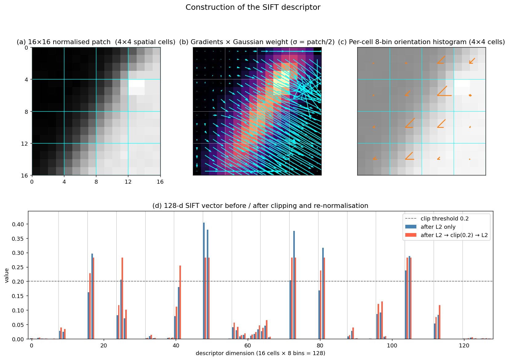

> **Source question (Q9):** The SIFT descriptor. Describe the algorithm and its properties.

## The SIFT Descriptor

The Scale-Invariant Feature Transform (SIFT), introduced by David Lowe, is arguably the most influential local feature in the history of computer vision. While the term “SIFT” often refers to the entire pipeline – detector, orientation assignment, and descriptor – the **SIFT descriptor** is the component that encodes the appearance of a local image region into a compact, highly discriminative vector. This section describes the SIFT descriptor algorithm in detail, explains the design choices behind each step, and summarises its key properties. The preceding sections have already covered the Difference-of-Gaussians (DoG) detector and the orientation assignment procedure; here we assume that a similarity‑covariant region (centre, scale, orientation) has already been established, and we focus exclusively on how the descriptor is built from that normalised patch.

### 1. From a Detected Region to a Normalised Patch

Before the descriptor can be computed, the image patch must be brought into a canonical reference frame. The SIFT detector provides:

- a **location** $(x,y)$ in the image,
- a **characteristic scale** $\sigma$ (the standard deviation of the Gaussian at which the DoG extremum was found),
- a **dominant orientation** $\theta$, obtained from the peak of a gradient orientation histogram computed in a circular neighbourhood of radius proportional to $\sigma$.

Using these three parameters, a square patch of size $(k\sigma \times k\sigma)$ centred at $(x,y)$ is extracted and rotated by $-\theta$ so that the dominant gradient direction points to the right. The patch is then resampled to a fixed size (typically $16 \times 16$ pixels after appropriate smoothing to avoid aliasing). This normalisation removes the effects of translation, uniform scaling, and in‑plane rotation, leaving only the local intensity pattern to be described.

### 2. Gradient Computation and Weighting

Inside the normalised $16 \times 16$ patch, the image gradient is computed at each pixel. The gradient magnitude $m(u,v)$ and orientation $\phi(u,v)$ are obtained from finite differences (or, equivalently, by convolution with Gaussian derivative kernels):

$$
m(u,v) = \sqrt{ \bigl( \tfrac{\partial I}{\partial u} \bigr)^2 + \bigl( \tfrac{\partial I}{\partial v} \bigr)^2 }, \qquad
\phi(u,v) = \text{atan2}\!\left( \tfrac{\partial I}{\partial v}, \tfrac{\partial I}{\partial u} \right).
$$

To reduce the influence of pixels far from the centre and to give more weight to the region’s core, each gradient magnitude is multiplied by a **Gaussian weighting function** centred on the patch. The standard deviation of this weighting Gaussian is typically set to half the patch width (i.e., $8$ pixels for a $16 \times 16$ patch). This soft windowing makes the descriptor less sensitive to small shifts in the patch boundary and to clutter near the edges.

### 3. Spatial Pooling with Orientation Histograms

The weighted gradients are then aggregated into a grid of **orientation histograms**. The $16 \times 16$ patch is divided into $4 \times 4$ non‑overlapping spatial cells, each covering $4 \times 4$ pixels. For every cell, an orientation histogram with $8$ bins is constructed. The bins cover the full $360^\circ$ range in $45^\circ$ increments (0°, 45°, …, 315°). Each gradient sample contributes to the histogram of its own cell, and its contribution is distributed between the two nearest orientation bins using **trilinear interpolation** (in spatial $u$, $v$ and orientation $\phi$) to avoid boundary effects. The interpolation ensures that the descriptor varies smoothly as the patch content shifts slightly.

The resulting structure is a $4 \times 4 \times 8 = 128$‑dimensional vector. Conceptually, this is a 3D histogram: two spatial dimensions and one orientation dimension. The coarse spatial binning ($4 \times 4$ cells) provides tolerance to small local deformations and affine distortions, while the fine orientation quantisation (8 bins) captures the local edge and gradient structure with sufficient detail.

### 4. Normalisation and Post‑Processing

The raw 128‑element vector is then normalised to enhance invariance to illumination changes:

1. **L2 normalisation:** The vector is divided by its Euclidean norm, making it unit length. This provides invariance to multiplicative intensity changes (contrast).
2. **Clipping:** To reduce the influence of very large gradient magnitudes (e.g., from specular highlights or non‑linear illumination effects), all entries are capped at a threshold (typically $0.2$). The vector is then re‑normalised to unit length. This step makes the descriptor robust to non‑linear illumination changes and saturation.
3. **Final re‑normalisation:** After clipping, the vector is again L2‑normalised.

The resulting 128‑dimensional floating‑point vector is the SIFT descriptor. A common variant, **RootSIFT**, simply takes the square root of each element after L1 normalisation (or equivalently, applies a Hellinger kernel), which has been shown to improve performance with Euclidean distance.

The figure below walks through the construction of a SIFT descriptor on a $16 \times 16$ patch containing a diagonal step edge plus a small bright dot. Panel (a) marks the $4 \times 4$ spatial cells (cyan grid). Panel (b) shows the gradient field at every pixel, modulated by the Gaussian weight ($\sigma = 8$): contributions are concentrated near the patch centre, and the edge dominates the magnitude map. Panel (c) draws the 8-bin orientation histogram of each cell as an 8-spoke star — the spoke lengths encode bin counts, so cells crossed by the edge show a single long spoke along the edge normal. Panel (d) is the resulting 128-d vector before (blue) and after (red) the L2 → clip(0.2) → L2 sequence: 9 of 128 entries were saturated at $0.2$, which suppresses single dominant gradients before the final unit-norm vector is produced.

### 5. Algorithm Summary

To summarise, the SIFT descriptor is computed as follows:

1. Extract a $16 \times 16$ patch around the keypoint, aligned with the assigned scale and rotated by the dominant orientation.
2. Compute gradient magnitude and orientation at each pixel.
3. Apply a Gaussian weighting centred on the patch.
4. For each of the $4 \times 4$ spatial cells, accumulate an 8‑bin orientation histogram, using trilinear interpolation to distribute each gradient sample into adjacent spatial and orientation bins.
5. Concatenate the $16$ histograms to form a 128‑dimensional vector.
6. L2‑normalise, clip entries at $0.2$, and re‑normalise.

### 6. Properties of the SIFT Descriptor

The SIFT descriptor owes its enduring popularity to a carefully balanced set of properties:

- **Invariance to similarity transformations.** The explicit normalisation of location, scale, and rotation makes the descriptor invariant to translation, uniform scaling, and in‑plane rotation. The descriptor itself only sees a canonical patch.
- **Robustness to moderate affine distortions.** The $4 \times 4$ spatial pooling and the soft Gaussian weighting provide tolerance to small changes in viewpoint (up to about 30–40° of out‑of‑plane rotation). The descriptor is not fully affine‑invariant, but it degrades gracefully.
- **Illumination invariance.** The use of gradient orientations (rather than raw intensities) makes the descriptor insensitive to additive intensity shifts. The L2 normalisation and clipping provide invariance to multiplicative contrast changes and robustness to non‑linear illumination effects.
- **Discriminative power.** The 128‑dimensional histogram captures the distribution of local edge orientations with sufficient spatial resolution to distinguish thousands of different local patterns. The descriptor is highly distinctive, enabling reliable matching even in cluttered scenes.
- **Tolerance to small localisation errors.** The spatial binning and trilinear interpolation mean that a keypoint localised a fraction of a pixel away from its true position still produces a very similar descriptor. This is crucial because the detector’s sub‑pixel refinement is never perfect.
- **Computational efficiency.** Although more expensive than binary descriptors, SIFT can be computed in real time on modern hardware. The use of gradient histograms and simple normalisation avoids costly operations. Approximate nearest‑neighbour libraries (e.g., FLANN, FAISS) can match SIFT descriptors efficiently using Euclidean distance.
- **Matching with the ratio test.** SIFT descriptors are typically matched by finding the nearest neighbour in descriptor space and accepting the match only if the distance to the second‑nearest neighbour is significantly larger (the “ratio test”). This simple criterion effectively suppresses ambiguous matches caused by repetitive textures or background clutter.
- **Limitations.** The descriptor is not fully affine‑invariant; for large viewpoint changes, an affine‑covariant region detector (e.g., Hessian‑Affine, MSER) should be used to supply the patch. The descriptor also assumes locally planar, Lambertian surfaces, and its performance degrades under extreme illumination changes or non‑rigid deformations. Finally, the 128‑dimensional float vector is relatively large compared to binary descriptors (e.g., ORB’s 256‑bit rBRIEF), which can be a concern for memory‑constrained applications.

### 7. The SIFT Descriptor in Context

The SIFT descriptor is the final link in a chain that begins with the DoG detector and orientation assignment. Together, they form a complete similarity‑covariant feature that has been the gold standard for wide‑baseline matching, 3D reconstruction, image retrieval, and panorama stitching for over two decades. Its design principles – gradient orientation histograms, spatial pooling, and careful normalisation – have inspired a whole family of descriptors (GLOH, DAISY, HoG, and even early CNN‑based descriptors). Understanding the SIFT descriptor is therefore not only a matter of historical importance but also a foundation for grasping more recent learned local features.

---

### Self-Test

1. The SIFT descriptor uses gradient **orientations** rather than raw pixel intensities. Why does this design choice provide robustness to certain illumination changes, and which type of illumination change is it still sensitive to?
2. If you reduced the spatial grid from $4 \times 4$ cells to $2 \times 2$ cells (keeping the patch size and 8 orientation bins), how would this trade-off affect the descriptor's discriminative power versus its tolerance to local geometric distortions?
3. The clipping threshold of $0.2$ is applied before the final re-normalisation. When would a local patch cause many descriptor entries to be clipped, and what does this reveal about the underlying image structure?
4. SIFT achieves rotation invariance by aligning the patch to a dominant orientation before computing the descriptor, whereas some modern learned descriptors achieve rotation invariance differently. Under what conditions might the dominant-orientation approach fail even for moderate rotations?

### Answer Key

1. Using gradient orientations rather than raw intensities provides invariance to **additive** illumination shifts (e.g., a uniform change in brightness), because gradients measure differences between neighbouring pixels and a global offset cancels out. The L2 normalisation and clipping further handle **multiplicative** contrast changes. However, the descriptor is still sensitive to illumination changes that alter the relative contrast across the patch non-uniformly (e.g., spatially varying lighting or specular highlights), since these can change which orientation bin dominates in a cell.

2. Reducing the grid to $2 \times 2$ cells (keeping 8 bins) yields a $2 \times 2 \times 8 = 32$-dimensional descriptor. Each cell now covers a much larger region ($8 \times 8$ pixels), so the histogram pools gradients from a coarser spatial area, increasing tolerance to local geometric distortions but substantially reducing discriminative power — many distinct local patterns that differ in spatial layout will produce the same coarse descriptor. The original $4 \times 4$ grid strikes a deliberate balance: fine enough to capture spatial structure, coarse enough to absorb small deformations.

3. Many entries are clipped when a cell contains a very dominant gradient direction with high magnitude — for example, a sharp, high-contrast edge running through the cell. In such cases, one or two orientation bins accumulate very large counts, pushing those entries well above $0.2$ after initial L2 normalisation. As noted in Section 4, clipping suppresses the influence of specular highlights and non-linear illumination effects; a patch where 9 of 128 entries are saturated (as illustrated in the figure) typically contains a strong step edge concentrated in a few cells.

4. The dominant-orientation approach fails when the local neighbourhood does not have a single, well-defined dominant orientation — i.e., when the gradient orientation histogram is **isotropic** (e.g., over a blob or a uniform region) or **multi-modal** (e.g., a corner or a texture with multiple strong orientations). In such cases, small perturbations or noise can cause the assigned dominant orientation to jump between peaks, producing inconsistent patch alignment and poor repeatability even for moderate in-plane rotations.