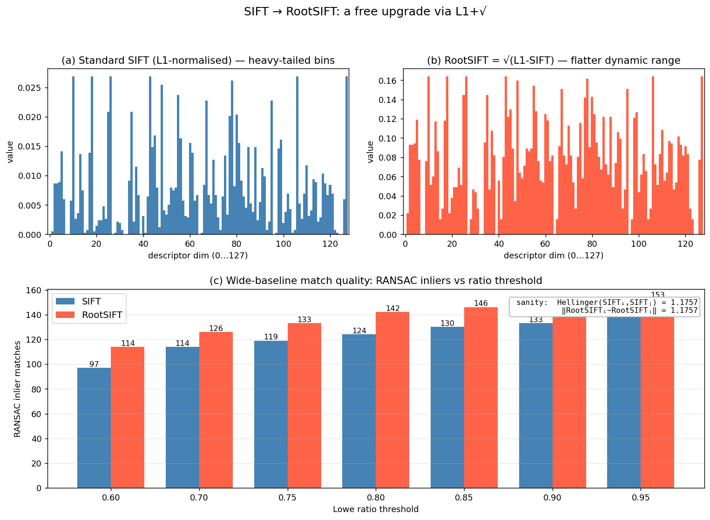

## RootSIFT Descriptor

The SIFT descriptor, described in the previous section, produces a 128‑dimensional floating‑point vector that is L2‑normalised, clipped, and re‑normalised. This vector is typically compared using Euclidean distance. **RootSIFT** is a simple yet surprisingly effective modification of the SIFT descriptor that replaces the Euclidean distance with the **Hellinger distance** (also known as the Bhattacharyya distance for histograms) by applying an element‑wise square root to the normalised descriptor. The resulting descriptor is still a 128‑dimensional vector, but the Euclidean distance between two RootSIFT vectors is equivalent to the Hellinger distance between the original SIFT vectors. Empirically, RootSIFT consistently improves matching performance, often at negligible computational cost.

### 1. Motivation: Why the Square Root?

The standard SIFT descriptor is a histogram of gradient orientations. Histograms are naturally compared with information‑theoretic measures such as the $\chi^2$ distance or the Hellinger kernel. The Hellinger kernel for two $L^1$‑normalised histograms $x$ and $y$ is defined as

$$
H(x, y) = \sum_{i=1}^{d} \sqrt{x_i \, y_i},
$$

and the corresponding Hellinger distance is

$$
D_H(x, y) = \sqrt{2 - 2 H(x, y)} = \sqrt{\sum_{i=1}^{d} \left( \sqrt{x_i} - \sqrt{y_i} \right)^2}.
$$

Notice that the Hellinger distance between $x$ and $y$ is exactly the Euclidean distance between the element‑wise square roots of $x$ and $y$. Therefore, if we take the SIFT vector, $L^1$‑normalise it (so that its entries sum to 1), and then take the square root of each entry, the Euclidean distance between two such transformed vectors equals the Hellinger distance between the original $L^1$‑normalised histograms.

The Hellinger distance has several attractive properties for histogram comparison:

- It is a proper metric for probability distributions.
- It is less sensitive to small bin fluctuations than Euclidean distance on raw histograms.
- It down‑weights large bin values, reducing the influence of dominant gradient orientations that may arise from non‑Lambertian effects or clutter.

RootSIFT exploits this equivalence to obtain the benefits of the Hellinger kernel without changing the matching pipeline: after the square‑root transformation, standard Euclidean nearest‑neighbour search can be used.

### 2. The RootSIFT Algorithm

The RootSIFT descriptor is obtained from the standard SIFT descriptor through a simple post‑processing sequence. The steps are:

1. **Compute the standard SIFT descriptor.** Follow the usual SIFT pipeline: extract a $16 \times 16$ patch aligned with the keypoint’s scale and orientation, compute gradient magnitudes and orientations, build the $4 \times 4 \times 8$ histogram with trilinear interpolation, and form the 128‑dimensional vector $v$.

2. **$L^1$ normalisation.** Divide the vector by the sum of its entries (or, equivalently, by its $L^1$ norm) so that the resulting vector $u$ has non‑negative entries that sum to 1:

   $$
   u_i = \frac{v_i}{\sum_{j=1}^{128} v_j}, \qquad i = 1, \dots, 128.
   $$

   This step turns the descriptor into a discrete probability distribution over the 128 bins. (The original SIFT uses $L^2$ normalisation; here $L^1$ is used because the Hellinger kernel is defined for $L^1$‑normalised histograms.)

3. **Square root.** Take the square root of every element:

   $$
   w_i = \sqrt{u_i}, \qquad i = 1, \dots, 128.
   $$

   The resulting vector $w$ is the RootSIFT descriptor. It is still 128‑dimensional, non‑negative, and its Euclidean norm is $\sqrt{\sum_i u_i} = 1$ (since $\sum_i u_i = 1$), but this is incidental.

4. **Optional $L^2$ normalisation.** Some implementations subsequently $L^2$‑normalise $w$ to unit length, which makes the Euclidean distance equivalent to the cosine distance between the square‑rooted vectors. This step is not strictly necessary for the Hellinger equivalence, but it can be convenient when using libraries that expect unit‑norm vectors. The matching performance is essentially unchanged.

The entire transformation is deterministic, parameter‑free, and computationally trivial – it adds only a few floating‑point operations per descriptor.

### 3. Equivalence to the Hellinger Kernel

To see the equivalence formally, let $x$ and $y$ be two $L^1$‑normalised SIFT descriptors (step 2 above). Their RootSIFT descriptors are $\sqrt{x}$ and $\sqrt{y}$, where the square root is applied element‑wise. The squared Euclidean distance between the RootSIFT vectors is

$$
\|\sqrt{x} - \sqrt{y}\|_2^2 = \sum_{i=1}^{128} \left( \sqrt{x_i} - \sqrt{y_i} \right)^2
= \sum_i x_i + \sum_i y_i - 2 \sum_i \sqrt{x_i y_i}
= 2 - 2 \sum_i \sqrt{x_i y_i},
$$

because $\sum_i x_i = \sum_i y_i = 1$. The term $\sum_i \sqrt{x_i y_i}$ is exactly the Hellinger kernel $H(x,y)$, so the Euclidean distance between RootSIFT vectors is $\sqrt{2 - 2 H(x,y)}$, which is the Hellinger distance. Thus, matching RootSIFT descriptors with Euclidean distance is equivalent to matching the original $L^1$‑normalised SIFT descriptors with the Hellinger distance.

The figure below makes both halves of the story concrete. Panels (a) and (b) show the same descriptor before and after the $L^1 + \sqrt{\cdot}$ transformation: the standard SIFT histogram has a heavy tail (a few dominant bins after L1 normalisation), while RootSIFT compresses the dynamic range — small bins matter more relative to large ones. The annotation in panel (c) verifies the math: for two arbitrary descriptors $i, j$ from the test image, the Hellinger distance computed directly on $L^1$-normalised SIFT histograms equals $1.1757$, and the Euclidean distance on the RootSIFT pair equals the same $1.1757$. Panel (c) itself runs the full wide-baseline matching pipeline (KNN + Lowe ratio + RANSAC) and counts inliers — at every ratio threshold RootSIFT yields more correct matches than SIFT (e.g. $+17$ at $r = 0.6$, $+18$ at $r = 0.8$), all from a 4-line post-processing change.

### 4. Practical Considerations and Performance

RootSIFT is often described as a “free” improvement: it requires no change to the detector, orientation assignment, or descriptor extraction code except for the final normalisation and square root. All the invariance properties of SIFT – to similarity transformations, moderate affine distortions, and illumination changes – are preserved, because the square‑root operation is a monotonic remapping of the already normalised histogram bins.

In practice, RootSIFT consistently improves the mean Average Precision (mAP) in image retrieval and the number of correct matches in wide‑baseline stereo, especially when combined with the **ratio test** for matching. The improvement is most pronounced when the descriptor is used with Euclidean distance; if a different metric (e.g., $\chi^2$) is employed, the square‑root step may be redundant.

The slide material mentions RootSIFT as one of the “improvements” over the original SIFT, alongside GLOH, HoG, and DAISY. Its simplicity and effectiveness have made it a standard baseline in local feature evaluation, and it is implemented in popular libraries such as VLFeat, OpenCV, and Kornia.

### 5. Summary

RootSIFT is a variant of the SIFT descriptor that applies $L^1$ normalisation followed by an element‑wise square root. This transformation makes the Euclidean distance between descriptors equivalent to the Hellinger distance between the original $L^1$‑normalised histograms, which is a more natural metric for comparing gradient orientation histograms. The algorithm adds negligible computational cost, preserves all the invariance properties of SIFT, and consistently improves matching and retrieval performance. It is a textbook example of how a simple, theoretically motivated post‑processing step can yield a significant practical gain.

---

### Self-Test

1. The square-root step in RootSIFT compresses large histogram bins relative to small ones — why does this compression specifically help with matching under non-Lambertian lighting or cluttered scenes?
2. RootSIFT uses $L^1$ normalisation before taking the square root, whereas standard SIFT uses $L^2$ normalisation. What goes wrong mathematically if you apply the square root directly to the $L^2$-normalised SIFT vector and then compare with Euclidean distance?
3. If two keypoints share an identical dominant gradient orientation but differ only in how energy is distributed across minor bins, would RootSIFT or standard SIFT assign them a smaller distance, and why?
4. RootSIFT is described as preserving all invariance properties of SIFT — under what realistic imaging condition could the square-root transformation actually hurt matching performance compared to standard SIFT?

### Answer Key

1. Non-Lambertian surfaces and clutter tend to produce dominant gradient orientations whose bin values are disproportionately large relative to the true texture content. As stated in Section 1, the square root "down-weights large bin values, reducing the influence of dominant gradient orientations," so the Hellinger metric redistributes discriminative power more evenly across all bins. This makes the descriptor less likely to be driven almost entirely by a single spurious peak and more likely to capture the broader histogram shape.

2. The Hellinger kernel $H(x,y) = \sum_i \sqrt{x_i y_i}$ is defined for $L^1$-normalised histograms whose entries sum to 1. If the vector is instead $L^2$-normalised, then $\sum_i u_i \neq 1$ in general, so the algebraic identity $\sum_i x_i + \sum_i y_i - 2\sum_i\sqrt{x_i y_i} = 2 - 2H(x,y)$ no longer holds. The resulting Euclidean distance on the square-rooted $L^2$-normalised vectors would not equal the Hellinger distance, breaking the theoretical motivation for the transformation.

3. RootSIFT would assign them a smaller distance. The square-root compression (Section 1) down-weights the already-large dominant bin that the two descriptors share, while amplifying the relative contribution of the minor bins. Standard SIFT with $L^2$ normalisation leaves the dominant bin large, so differences in minor bins matter proportionally less; after compression in RootSIFT, energy in minor bins is comparatively boosted, making two descriptors that agree on the dominant peak but differ slightly elsewhere appear more similar than they would under Euclidean distance on the raw histogram.

4. The square-root transformation could hurt performance when the descriptor is used with a metric other than Euclidean distance, as noted in Section 4: "if a different metric (e.g., $\chi^2$) is employed, the square-root step may be redundant" or even counterproductive. More concretely, in scenes with highly textured, Lambertian surfaces where a single dominant gradient orientation is genuinely discriminative, compressing that dominant bin reduces its distinguishing power, potentially causing two visually different patches to be matched incorrectly because their minor bin differences no longer outweigh the shared dominant peak.