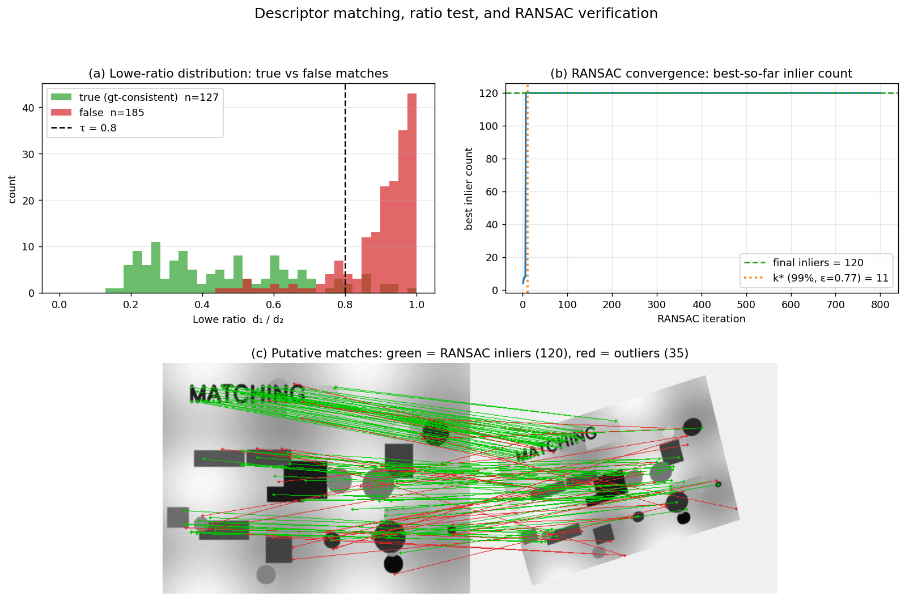

> **Source question (Q12):** How are local descriptors matched? What are the ways of filtering out unreliable correspondences?

## Matching Local Descriptors and Filtering Unreliable Correspondences

Once local features have been detected and described – whether by SIFT, RootSIFT, ORB, or a learned alternative – the next step is to establish correspondences between two (or more) images. This process, often called **matching**, is followed by a series of **filtering** steps that discard unreliable matches. The goal is to obtain a set of geometrically consistent, high‑confidence correspondences that can be used for camera pose estimation, 3D reconstruction, or image retrieval. This section describes the standard matching pipeline, the classic ratio test and cross‑check, and the central role of robust geometric verification, in particular the RANSAC family of algorithms.

### 1. Descriptor Matching

Given two sets of descriptors, $\mathcal{D}_1 = \{\mathbf{d}_1^1, \dots, \mathbf{d}_1^{N_1}\}$ from image $I_1$ and $\mathcal{D}_2 = \{\mathbf{d}_2^1, \dots, \mathbf{d}_2^{N_2}\}$ from image $I_2$, the matching problem consists of finding for each descriptor in $I_1$ its most similar counterpart in $I_2$. The similarity is measured by a distance in the descriptor space:

- **Euclidean ($L_2$) distance** for floating‑point descriptors (SIFT, RootSIFT, etc.):
  $$d(\mathbf{d}_1, \mathbf{d}_2) = \|\mathbf{d}_1 - \mathbf{d}_2\|_2.$$
- **Hamming distance** for binary descriptors (ORB, BRISK, FREAK, etc.): the number of bits that differ between the two binary strings.

A naïve brute‑force search over all $N_1 \times N_2$ pairs is computationally expensive for large $N$. In practice, **approximate nearest neighbour (ANN)** libraries such as **FLANN** (Fast Library for Approximate Nearest Neighbours) or **FAISS** are used to accelerate the search, often by constructing k‑d trees or inverted indices. For binary descriptors, brute‑force Hamming distance is already very fast on modern CPUs (single XOR + POPCNT instruction), so ANN is less critical.

### 2. First‑Level Outlier Rejection: The Ratio Test and Cross‑Check

The nearest neighbour in descriptor space is not always a correct match. Repetitive textures, background clutter, and non‑discriminative patches can produce ambiguous matches. Two simple, yet highly effective, heuristics are applied immediately after the nearest‑neighbour search.

#### 2.1 Lowe’s Ratio Test

For a descriptor $\mathbf{d}_1^i$ in $I_1$, let $\mathbf{d}_2^{j}$ be its nearest neighbour in $I_2$ with distance $d_1$, and let $\mathbf{d}_2^{k}$ be the second‑nearest neighbour with distance $d_2$. The **ratio test** (D. Lowe, 2004) accepts the match only if

$$
\frac{d_1}{d_2} < \tau,
$$

where $\tau$ is a threshold, typically $0.8$ for SIFT. The intuition is that a true match should be significantly closer than the closest false match; if the two distances are similar, the match is ambiguous and likely incorrect. This simple criterion eliminates a large fraction of false positives while retaining most true matches. The ratio test is a standard component of the SIFT matching pipeline and is equally effective for other float descriptors.

#### 2.2 Mutual Nearest Neighbour (Cross‑Check)

Another common filter is the **cross‑check** (or mutual consistency test): a match $(\mathbf{d}_1^i, \mathbf{d}_2^j)$ is kept only if $\mathbf{d}_2^j$ is the nearest neighbour of $\mathbf{d}_1^i$ **and** $\mathbf{d}_1^i$ is the nearest neighbour of $\mathbf{d}_2^j$. This symmetric constraint discards many one‑way matches that are often outliers. Cross‑checking is particularly useful when the ratio test is not applied (e.g., for binary descriptors) or as an additional safety net.

After these appearance‑based filters, the set of **putative correspondences** still typically contains a substantial number of outliers (mismatches). The next stage uses geometric constraints to separate inliers from outliers.

The figure below puts the full pipeline on synthetic wide-baseline data with known ground truth. Panel (a) plots the histogram of Lowe ratios $d_1/d_2$ for every nearest-neighbour match, separated into ground-truth-consistent (green) and inconsistent (red) using the known homography: true matches cluster at low ratios while false matches pile up near 1.0, and the conventional $\tau = 0.8$ cut cleanly separates the two populations. Panel (b) tracks a hand-rolled 4-point homography RANSAC: the best-so-far inlier count saturates almost immediately, and reaches the theoretical $k^* = \lceil \log(1-\eta)/\log(1 - \varepsilon^m)\rceil = 11$ iterations (for $\eta = 0.99,\ m = 4,\ \hat\varepsilon = 0.77$) well within the iteration budget. Panel (c) draws the resulting correspondences across the image pair — green lines are the 120 RANSAC inliers (all geometrically consistent), red lines are the 35 outliers (random directions, not on the underlying homography).

### 3. Geometric Verification with Robust Estimation

The key observation is that correct correspondences between two images of the same scene must satisfy a **geometric constraint** imposed by the camera motion and the scene structure. For a general rigid scene, the corresponding points $\mathbf{x}_1 \leftrightarrow \mathbf{x}_2$ (in homogeneous coordinates) satisfy the **epipolar constraint**:

$$
\mathbf{x}_2^\top \mathsf{F} \mathbf{x}_1 = 0,
$$

where $\mathsf{F}$ is the $3 \times 3$ fundamental matrix (or $\mathsf{E}$, the essential matrix, for calibrated cameras). For planar scenes or pure rotation, a **homography** $\mathsf{H}$ relates the points: $\mathbf{x}_2 \sim \mathsf{H} \mathbf{x}_1$.

Because the set of putative correspondences is contaminated by outliers, the geometric model cannot be estimated by standard least squares. Instead, a robust estimator is employed. The most widely used is **RANSAC** (RANdom SAmple Consensus).

#### 3.1 The RANSAC Algorithm

RANSAC, introduced by Fischler and Bolles (1981), is an iterative hypothesise‑and‑verify framework that estimates a model from data containing a large fraction of outliers. The algorithm is general; here we describe it for the case of epipolar geometry estimation from point correspondences.

**Input:** a set of $N$ putative correspondences $\mathcal{X} = \{(\mathbf{x}_1^i, \mathbf{x}_2^i)\}_{i=1}^N$, a model estimation function $\theta = \text{estimate}(S)$ that computes model parameters from a minimal sample $S$ (e.g., 7 or 8 correspondences for $\mathsf{F}$), a distance function $f(\mathbf{x}, \theta)$ that measures the error of a correspondence with respect to the model (e.g., Sampson distance), an inlier threshold $\sigma$, and a desired confidence $\eta$.

**Output:** the model $\theta^*$ with the largest consensus set (inliers).

The standard RANSAC loop:

1. **Initialisation:** iteration counter $k \leftarrow 0$, best cost $J^* \leftarrow \infty$.
2. **Repeat:**
   - Randomly select a minimal sample $S \subset \mathcal{X}$ of size $m$.
   - Estimate model parameters $\theta = \text{estimate}(S)$.
   - Evaluate the support of $\theta$: for every correspondence, compute the error and count the number of inliers $J(\theta) = \sum_{i} f(\mathbf{x}^i, \theta)$, where $f(\mathbf{x}, \theta) = 0$ if error $\le \sigma$, else $1$.
   - If $J(\theta) < J^*$ (i.e., more inliers), update $\theta^* \leftarrow \theta$, $J^* \leftarrow J(\theta)$.
   - Increment $k$.
3. **Until** the probability that a better model exists falls below $1-\eta$. This probability is computed from the current best inlier count $Q = N - J^*$, the sample size $m$, and the number of iterations $k$:
   $$P(\text{better exists}) = \left(1 - \left(\frac{Q}{N}\right)^m\right)^k.$$
   The loop stops when this probability drops below $1-\eta$ (e.g., $\eta = 0.95$ or $0.99$).
4. **Optional final step:** re‑estimate the model from all inliers of the best hypothesis using a non‑minimal solver (e.g., the 8‑point algorithm on all inliers) to improve accuracy.

After RANSAC, the correspondences that are consistent with the estimated model (the inliers) are retained; all others are discarded as outliers. This geometric verification step is the most powerful filter for unreliable correspondences.

#### 3.2 Why RANSAC Works and Its Limitations

RANSAC’s strength lies in its ability to tolerate a very high outlier ratio – even above 50 % – provided that the inlier ratio $\varepsilon = Q/N$ is not too small. The expected number of iterations required to sample at least one all‑inlier minimal set with confidence $\eta$ is

$$
k = \frac{\log(1-\eta)}{\log(1 - \varepsilon^m)}.
$$

For example, with $m=7$ (7‑point algorithm for $\mathsf{F}$) and $\varepsilon = 0.3$, about $k \approx 1100$ iterations are needed for $\eta = 0.95$. The computational cost is dominated by the verification step, which evaluates all $N$ correspondences for each hypothesis.

However, standard RANSAC has several practical drawbacks:

- **Noise sensitivity:** Not every all‑inlier sample yields a model that attracts the full inlier set, because the minimal sample may be ill‑conditioned or noisy. This leads to many more iterations than theoretically predicted.
- **Speed:** The verification of all $N$ points for every hypothesis is expensive when $N$ is large.
- **Degeneracy:** If the data contain a dominant degenerate configuration (e.g., all points lie on a plane while the true motion is non‑planar), RANSAC may converge to a model that explains the degenerate set but is globally wrong.

A rich family of RANSAC variants has been developed to address these issues, many of which are covered in the course material.

#### 3.3 RANSAC Variants for Faster and More Reliable Filtering

**LO‑RANSAC (Locally Optimized RANSAC).**  
It was observed that even an all‑inlier minimal sample often produces a model that does not attract all inliers due to noise. LO‑RANSAC applies a local optimisation step to the best‑so‑far model: it takes the current inlier set, draws additional minimal samples from it, estimates new models, and keeps the one with the largest support. This simple extension makes the number of iterations match the theoretical prediction almost exactly, dramatically reducing the total runtime and improving accuracy. The local optimisation is executed only $\log(k)$ times, so its overhead is negligible.

**R‑RANSAC (Randomised RANSAC).**  
To speed up verification, R‑RANSAC introduces a pre‑verification step. Before evaluating all $N$ points, a small random subset of $d \ll N$ points is tested. If any of these $d$ points is inconsistent with the model, the hypothesis is immediately rejected. Only if all $d$ points are inliers does the full verification proceed. The parameter $d$ can be optimised to minimise the expected number of point evaluations. This simple idea yields a speed‑up of up to an order of magnitude.

**WaldSAC (SPRT‑based RANSAC).**  
WaldSAC replaces the fixed‑length pre‑verification with a **Sequential Probability Ratio Test (SPRT)**. The test sequentially evaluates points and updates a likelihood ratio $\lambda_j$ that compares the probability of the observations under the hypothesis that the model is “good” (all‑inlier sample) versus “bad” (contaminated sample). As soon as $\lambda_j$ exceeds a threshold $A$, the model is rejected. The SPRT is optimal in the sense that it minimises the average number of verifications for a given probability of falsely rejecting a good model. WaldSAC adapts the threshold $A$ automatically from the estimated inlier ratio $\varepsilon$ and the probability $\delta$ that a point is consistent with a random bad model. It achieves significant speed‑ups, especially when the inlier ratio is low.

**PROSAC (PROgressive SAmple Consensus).**  
Not all correspondences are equally reliable. PROSAC exploits a prior ranking of the correspondences, e.g., by the ratio test score or descriptor distance. It draws samples progressively from the top‑ranked subset, gradually expanding the pool. Because inliers tend to be highly ranked, PROSAC finds a good model much earlier than uniform sampling, reducing the number of iterations.

**GC‑RANSAC (Graph‑Cut RANSAC).**  
GC‑RANSAC replaces the simple inlier‑counting cost function with a spatial coherence term. It uses a graph‑cut algorithm to separate inliers from outliers while encouraging spatial smoothness of the inlier mask. This local optimisation step, applied whenever a new best model is found, recovers the full inlier set even from a contaminated minimal sample. GC‑RANSAC is currently one of the most robust and accurate variants, often achieving state‑of‑the‑art results in challenging wide‑baseline matching.

**DEGENSAC.**  
To handle degenerate configurations (e.g., a dominant plane), DEGENSAC explicitly detects when the data support a degenerate model (homography) and, if necessary, switches to a non‑degenerate model (fundamental matrix). It requires no prior knowledge of the scene and prevents RANSAC from locking onto a wrong but highly supported degenerate solution.

All these variants share the same core principle: they use a hypothesised geometric model to partition the putative correspondences into inliers and outliers. The inliers are the final, reliable correspondences that are passed to subsequent stages (pose estimation, triangulation, etc.).

#### 3.4 Geometric Models in Practice

The choice of geometric model depends on the application:

- **Epipolar geometry (fundamental matrix $\mathsf{F}$ or essential matrix $\mathsf{E}$):** used for general 3D scenes and uncalibrated or calibrated cameras. The minimal sample size is 7 or 8 correspondences.
- **Homography ($\mathsf{H}$):** used when the scene is planar or the camera undergoes pure rotation. Minimal sample size is 4 correspondences.
- **Affine transformation:** sometimes used for local affine‑covariant regions; minimal sample size is 3 correspondences.

In a typical wide‑baseline stereo pipeline, both a homography and a fundamental matrix are estimated in parallel, and the model with the larger inlier set (after appropriate degeneracy tests) is selected.

### 4. Learned Matching and Outlier Rejection

The classical pipeline – nearest neighbour search, ratio test, RANSAC – is being increasingly challenged by end‑to‑end learned approaches that jointly perform matching and outlier rejection.

**SuperGlue** (Sarlin et al., CVPR 2020) is a prominent example. It takes two sets of local features (keypoint positions and descriptors) and processes them with a graph neural network that uses self‑ and cross‑attention to capture intra‑ and inter‑image context. The network outputs a soft partial assignment matrix, which is then converted into hard matches by solving an optimal transport problem. SuperGlue implicitly learns to reject outliers: points that have no reliable counterpart are assigned to a “dustbin” class. The entire pipeline is differentiable and trained end‑to‑end on pairs of images with known ground‑truth correspondences. SuperGlue dramatically outperforms the classical ratio‑test + RANSAC combination, especially in challenging conditions with large viewpoint and illumination changes.

Other learned matchers, such as **LightGlue** (a faster, lightweight version of SuperGlue) and **RoMa** (which operates on dense features and predicts pixel‑wise warps), follow a similar philosophy: they replace the handcrafted matching and filtering stages with a single neural network that outputs a set of high‑confidence correspondences, often without any explicit geometric model estimation. These methods are now state‑of‑the‑art in image matching benchmarks.

### 5. Summary

Matching local descriptors and filtering out unreliable correspondences is a multi‑stage process:

1. **Descriptor matching:** Nearest neighbour search in descriptor space, accelerated by ANN libraries.
2. **Appearance‑based filtering:** The ratio test and mutual nearest neighbour check remove ambiguous matches.
3. **Geometric verification:** A robust estimator, typically RANSAC or one of its many variants, fits a geometric model (fundamental matrix, homography) to the putative correspondences and retains only the inliers. This step exploits the fact that true matches must satisfy the epipolar or planar constraint.
4. **Learned alternatives:** Modern deep networks (SuperGlue, LightGlue, RoMa) integrate matching and outlier rejection into a single, context‑aware module, often outperforming the classical pipeline.

The combination of these techniques ensures that the final set of correspondences is both precise and reliable, forming the foundation for accurate 3D reconstruction, camera localisation, and image retrieval.

---

### Self-Test

1. Lowe's ratio test uses the ratio $d_1/d_2$ rather than the raw distance $d_1$ to accept a match — why is comparing against the second-nearest neighbour more informative than using an absolute distance threshold?
2. RANSAC and LO-RANSAC both iterate until confidence $\eta$ is reached, yet LO-RANSAC typically needs far fewer iterations in practice. What is the underlying reason for this gap, and what does it imply about the quality of minimal-sample estimates under noise?
3. PROSAC exploits a prior ranking of correspondences (e.g., by ratio-test score) to sample progressively, whereas standard RANSAC samples uniformly. Under what conditions would PROSAC offer little or no advantage over plain RANSAC?
4. SuperGlue replaces the ratio test and RANSAC with a single graph neural network. Does this mean geometric constraints (like the epipolar constraint) are no longer relevant, or are they still being exploited — just differently? Explain.

### Answer Key

1. An absolute threshold on $d_1$ alone would need to be tuned per descriptor type and scale, and it fails when a region is non-distinctive: even if the nearest neighbour is "close," it may be no closer than dozens of equally plausible candidates. By forming the ratio $d_1/d_2$, we test whether the best match is *uniquely* better than the next best; a small ratio means the nearest neighbour stands out, while a ratio near 1 signals ambiguity regardless of absolute scale. This makes the criterion descriptor-agnostic and far more robust to repetitive texture and background clutter, which is exactly why Lowe's $\tau = 0.8$ generalises across scenes without per-dataset tuning.

2. Standard RANSAC's theoretical iteration count $k = \log(1-\eta)/\log(1-\varepsilon^m)$ assumes that every all-inlier minimal sample yields a model that attracts the full inlier set — but under measurement noise a minimal sample can be ill-conditioned, producing a model that misclassifies many true inliers. LO-RANSAC closes this gap by running a local optimisation on the current inlier set whenever a new best hypothesis is found: it re-estimates from larger, better-conditioned samples drawn within the inlier set, recovering the full consensus. This means each "good" hypothesis is exploited to its maximum potential, so the observed iteration count matches the theoretical prediction, and fewer total hypotheses must be generated.

3. PROSAC exploits the assumption that high-quality (low ratio-test score) correspondences are enriched in inliers. If this ranking is uninformative — e.g., when the ratio test scores are uniformly distributed or when the true inlier ratio is already very high so that even random samples almost always contain all inliers — PROSAC's progressive sampling offers no advantage over uniform sampling. Similarly, in extremely wide-baseline or cross-domain matching scenarios where descriptor similarity is a poor predictor of geometric correctness, the ranking degenerates and PROSAC reduces to standard RANSAC.

4. Geometric constraints are still implicitly exploited by SuperGlue, just encoded in learned parameters rather than an explicit algebraic model. During training on image pairs with known ground-truth correspondences (which are derived from scenes obeying epipolar geometry), the graph neural network learns attention patterns that encode geometric compatibility — points whose relative positions are consistent with a valid camera geometry receive higher attention weights. The "dustbin" rejection also implicitly penalises geometrically inconsistent assignments. The key difference is that these constraints are soft and data-driven rather than hard algebraic equalities, which allows the network to handle noise and partial violations more gracefully than a threshold-based RANSAC inlier count.