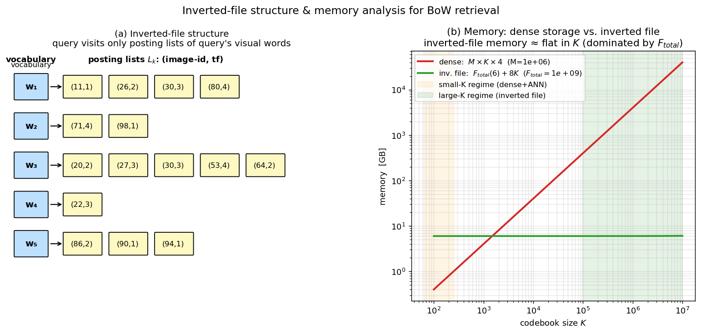

## Inverted-File Structure for BoW Retrieval: Usage, Trade-offs, and Memory Analysis

The Bag-of-Words (BoW) representation, as described in the previous section, maps each image to a $K$-dimensional histogram of visual word occurrences. Retrieval is performed by computing the similarity between the query histogram and every database histogram, typically via a dot product after inverse document frequency (idf) weighting. A naïve implementation that loops over all $M$ database images and computes the full dot product has time complexity $O(M \cdot K)$, which is prohibitive for large collections. The **inverted file** (also called an inverted index) is the standard data structure that exploits the sparsity of BoW histograms to accelerate retrieval and reduce memory footprint. This section explains the inverted-file structure, its use in BoW retrieval, the conditions under which it is preferable to storing dense BoW vectors, and the factors that determine memory consumption in both regimes.

### 1. The Inverted-File Structure

An inverted file inverts the natural image‑centric organisation of the data. Instead of storing, for each image, the list of visual words it contains (a “forward index”), we store, for each visual word, the list of images that contain that word. Formally, for a codebook of $K$ visual words, the inverted file consists of $K$ **posting lists** $L_1, \dots, L_K$. Each posting list $L_k$ contains entries for every database image $a$ in which visual word $k$ appears at least once. A typical entry stores:

- **Image identifier** $\text{id}(a)$ – an integer uniquely identifying the database image.
- **Term frequency** $h_{a,k}$ – the number of local descriptors in image $a$ that were assigned to word $k$.
- Optionally, a **pre‑computed weight** such as $w_k \cdot h_{a,k}$ or $w_k^2 \cdot h_{a,k}$ to speed up the dot‑product accumulation.

The posting lists are usually sorted by image identifier to allow efficient merging, and an auxiliary array stores the starting position and length of each list for fast access.

The figure below pairs a schematic of the inverted file with the memory analysis. Panel (a) sketches the structure: for each vocabulary word $w_k$, a posting list of `(image-id, tf)` entries — only the words that occur in the query are touched during retrieval, so total work scales with the sum of the touched list lengths, not with $M\cdot K$. Panel (b) plots the memory of dense storage ($M\times K\times 4$ bytes) versus the inverted file ($F_{\text{total}}\cdot (\text{id}+\text{tf}) + O(K)$) as the codebook size $K$ varies. Dense storage grows linearly with $K$ and becomes infeasible for instance-retrieval-sized codebooks ($K\!\sim\!10^6$), while inverted-file memory is essentially flat in $K$ because it depends on the total number of local features in the dataset, not on the vocabulary size.

### 2. Retrieval with an Inverted File

Given a query image represented by its idf‑weighted BoW vector $\tilde{\mathbf{h}}_q$ (with non‑zero entries only for the visual words present in the query), retrieval proceeds as follows:

1. **Initialisation.** Create an accumulator $S[a]$ for every database image $a$, initially set to zero.
2. **Accumulation.** For each visual word $k$ with $\tilde{h}_{q,k} > 0$:
   - Retrieve the posting list $L_k$.
   - For each entry $(\text{id}(a), h_{a,k})$ in $L_k$, add the contribution $w_k^2 \, \tilde{h}_{q,k} \, h_{a,k}$ to $S[a]$. (If the posting list already stores a pre‑weighted value, the multiplication is even simpler.)
3. **Ranking.** After processing all query words, the accumulators $S[a]$ hold the exact dot‑product similarity between the query and each database image. The images are sorted by decreasing $S[a]$ to produce the final ranking.

This procedure visits **only the posting lists of the visual words that appear in the query**. The query time is therefore proportional to the sum of the lengths of those lists, i.e., $O\!\left(\sum_{k: \tilde{h}_{q,k}>0} |L_k|\right)$. In a typical large‑codebook setting, the query contains a few hundred visual words, and each posting list is short (especially for rare words with high idf), making retrieval extremely fast – often sub‑linear in the total number of database images.

### 3. When to Use an Inverted File vs. Storing Dense BoW Vectors

The decision between using an inverted file and storing the original (dense) BoW vectors directly hinges on the **codebook size $K$** and the resulting **sparsity** of the histograms.

- **Small codebook (e.g., $K = 128$).** The quantisation is coarse; almost every image contains a large fraction of the vocabulary. The BoW histograms are **dense** (few zero entries). Storing the full $K$-dimensional vector for each image is compact: memory is $M \times K \times \text{sizeof(element)}$. Retrieval can be performed by brute‑force dot products or, more efficiently, by approximate nearest neighbour (ANN) methods such as product quantisation, locality‑sensitive hashing, or graph‑based search. An inverted file would be counter‑productive here because the posting lists would be nearly as long as the whole database for every word, offering no speed advantage and incurring the overhead of the index structure.

- **Very large codebook (e.g., $K = 10^6$).** The quantisation is fine; each image activates only a tiny subset of the vocabulary. The BoW histograms are **highly sparse** (typically a few hundred non‑zero entries per image). Storing the full $K$-dimensional vector for every image would require $M \times 10^6$ floating‑point numbers, which is prohibitive for large $M$. The inverted file, on the other hand, stores only the non‑zero entries – one posting per (image, word) occurrence. Its memory is proportional to the total number of local features across the whole dataset, which is independent of $K$ (see Section 4). Retrieval is fast because only the short posting lists of the query’s words are accessed. Therefore, **the inverted file is the method of choice for instance‑level retrieval with large codebooks**, where sparsity is high and discriminative power is needed.

In summary: **use dense vectors (and ANN) for small codebooks; use an inverted file for large codebooks.** The slide material explicitly contrasts these two regimes: small codebooks yield dense representations compatible with ANN, while very large codebooks yield sparse representations that exploit inverted files.

### 4. Memory Requirements with an Inverted File

When an inverted file is used, the memory footprint is dominated by the posting lists. The factors that determine the total memory are:

- **Total number of local features across all database images, $F_{\text{total}}$.** Every local descriptor extracted from every database image generates exactly one posting (it is assigned to exactly one visual word). Thus the total number of postings is $F_{\text{total}} = \sum_{a=1}^{M} N_a$, where $N_a$ is the number of features in image $a$. This is the primary factor.
- **Size of an image identifier.** To uniquely address $M$ images, the identifier requires $\lceil \log_2 M \rceil$ bits; in practice, a 4‑byte integer is typical for collections up to $2^{32}$ images.
- **Size of the term frequency (or weight).** The term frequency $h_{a,k}$ can be stored as a 2‑byte integer (or even 1 byte if features per image per word are limited). If a pre‑computed weight is stored instead, it may require a 4‑byte float.
- **Codebook size $K$ (overhead).** The inverted file must maintain an array of $K$ pointers (or offsets) to the start of each posting list, plus the list lengths. This overhead is $O(K \cdot \text{pointer\_size})$, which is negligible compared to the postings when $K \ll F_{\text{total}}$, but can become noticeable for extremely large codebooks (e.g., $K = 10^6$ with 8‑byte pointers adds ~8 MB, still small relative to typical datasets).
- **IDF weights.** A single array of $K$ floating‑point idf values is stored once, requiring $K \cdot 4$ bytes – again negligible.

Thus the approximate memory for the inverted file is:

$$
\text{Memory}_{\text{IF}} \approx F_{\text{total}} \times \big( \text{sizeof}(\text{image\_id}) + \text{sizeof}(\text{tf}) \big) + O(K).
$$

Crucially, this memory does **not** depend directly on the codebook size $K$ (except for the small index overhead). It depends on the total number of local features, which is a property of the image collection and the feature detector settings. For a fixed dataset, increasing $K$ does not change $F_{\text{total}}$; it merely redistributes the same number of postings across more (and shorter) lists.

### 5. Memory Requirements Without an Inverted File (Dense Storage)

When the BoW vectors are stored directly as dense $K$-dimensional vectors (the typical approach for small codebooks), the memory is:

$$
\text{Memory}_{\text{dense}} = M \times K \times \text{sizeof}(\text{element}),
$$

where $\text{sizeof}(\text{element})$ is typically 4 bytes (float32) for idf‑weighted or normalised histograms. The factors are:

- **Number of images $M$.** Linear scaling.
- **Codebook size $K$.** Linear scaling – this is the critical difference from the inverted file. For $K = 10^6$ and $M = 10^6$, dense storage would require $10^{12}$ floats (4 TB), which is infeasible.
- **Precision of the stored values.** Using float16 instead of float32 halves the memory, but the $M \times K$ product remains the dominant factor.

If dimensionality reduction (e.g., PCA) is applied to the BoW vectors, the effective $K$ is reduced, and dense storage becomes more practical. However, for instance‑level retrieval, the high discriminative power of a large codebook is usually desired, making the inverted file the only viable option.

### 6. Summary

The **inverted file** is a data structure that organises the BoW representation by visual word, storing for each word a list of images that contain it. Retrieval is performed by accumulating similarity scores using only the posting lists of the query’s visual words, yielding sub‑linear query time. It is the preferred approach when the codebook is **large** (e.g., $10^6$ words) and the BoW histograms are **sparse**, because storing dense $K$-dimensional vectors would be prohibitively memory‑intensive. Memory with an inverted file scales with the **total number of local features** in the dataset, independent of $K$, while memory without an inverted file scales with $M \times K$. The choice between the two is therefore dictated by the codebook size and the resulting sparsity of the representation.

---

### Self-Test

1. If you double the codebook size $K$ while keeping the image database and feature detector fixed, how does the total memory used by an inverted file change, and why?
2. An inverted file retrieval is described as "sub-linear in $M$" — under what conditions could it degrade toward $O(M)$ complexity, and what property of the data would cause this?
3. Why is an inverted file a poor choice for a small codebook (e.g., $K = 128$) compared to dense storage with ANN search, even though both can answer the same retrieval query?
4. Suppose a query image shares many common visual words (low idf) with nearly every database image. How does this affect retrieval quality and speed, and how does idf weighting partially mitigate this?

### Answer Key

1. Doubling $K$ has negligible effect on inverted-file memory. As stated in Section 4, $\text{Memory}_{\text{IF}} \approx F_{\text{total}} \times (\text{sizeof}(\text{image\_id}) + \text{sizeof}(\text{tf})) + O(K)$, and $F_{\text{total}}$ is fixed by the dataset and feature detector. The only change is the small $O(K)$ index overhead (pointer array and idf weights), which for $K = 2 \times 10^6$ adds roughly tens of megabytes — negligible relative to the postings for large collections.

2. Retrieval degrades toward $O(M)$ when the posting lists of the query's visual words are each nearly as long as the full database — i.e., when almost every image contains every query word. This occurs with a **small or coarse codebook** where most descriptors map to the same few words, making posting lists of length $\approx M$. In that regime the inverted file provides no selectivity benefit and the accumulation step touches essentially all $M$ images, matching the naïve brute-force cost.

3. With $K = 128$, BoW histograms are dense (most words appear in most images), so posting lists have length $\approx M$ and the inverted-file index overhead buys no speed-up while adding structural complexity. Dense storage costs only $M \times 128 \times 4$ bytes, which is compact and amenable to highly optimised ANN methods (product quantisation, LSH, graph search) that leverage vector structure. The inverted file is therefore strictly inferior: slower, more complex, and with no memory advantage.

4. Common visual words (low idf) appear in nearly every database image, so their posting lists span $\approx M$ entries. This degrades both **retrieval quality** — the similarity scores become dominated by uninformative words, making it harder to distinguish the true matches — and **speed**, because those long posting lists must all be traversed. IDF weighting assigns low weight $w_k = \log(M / |L_k|)$ to frequent words, so their contributions $w_k^2 \tilde{h}_{q,k} h_{a,k}$ to the accumulator are suppressed relative to rare, discriminative words. However, the speed issue is only partially mitigated: idf reduces the numerical contribution but the posting list still has to be read; using a **query expansion filter** or skipping words below an idf threshold are additional strategies to avoid scanning long common-word lists.