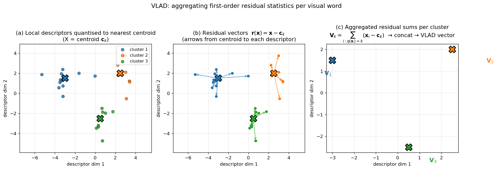

> **Source question (Q17):** How is the VLAD descriptor computed and how does it differ from BoW?

## Vector of Locally Aggregated Descriptors (VLAD)

The Bag-of-Words (BoW) model, described in previous sections, represents an image by a histogram of visual word occurrences. Each local descriptor contributes a binary vote: 1 if it falls into a given visual word, 0 otherwise. The **Vector of Locally Aggregated Descriptors (VLAD)** extends this idea by accumulating **residual vectors** – the difference between each local descriptor and its assigned visual word – thereby capturing first‑order statistics of the descriptor distribution within each cluster. This yields a more discriminative representation while retaining a compact, dense vector form that is compatible with approximate nearest neighbour search.

### 1. VLAD Computation

The computation of a VLAD descriptor proceeds in four steps: codebook construction, local descriptor assignment, residual accumulation, and normalisation.

#### 1.1 Codebook

As in BoW, a visual codebook $\mathcal{C} = \{\mathbf{c}_1, \dots, \mathbf{c}_K\}$ is obtained by clustering a large set of local descriptors (e.g., SIFT) using **k‑means**. However, VLAD typically uses a **small codebook** – $K$ is on the order of 64 to 256 – in contrast to the very large codebooks ($10^5$–$10^6$) used for instance‑level BoW retrieval. The small $K$ ensures that the final VLAD vector has manageable dimensionality ($d \cdot K$, where $d$ is the dimension of the local descriptors) and is dense enough for efficient similarity computation.

#### 1.2 Descriptor Assignment

For an image $I$, a set of $N$ local descriptors $\{\mathbf{x}_1, \dots, \mathbf{x}_N\}$ is extracted. Each descriptor $\mathbf{x}_i$ is assigned to its nearest visual word:

$$
q(\mathbf{x}_i) = \arg\min_{k} \|\mathbf{x}_i - \mathbf{c}_k\|_2.
$$

The assignment is **hard**, exactly as in BoW. No soft assignment is used in the standard VLAD formulation.

#### 1.3 Residual Accumulation

Instead of incrementing a histogram bin by 1, VLAD accumulates the **residual vector** $\mathbf{r}(\mathbf{x}_i) = \mathbf{x}_i - \mathbf{c}_{q(\mathbf{x}_i)}$ into the sub‑vector corresponding to the assigned visual word. Formally, the VLAD descriptor $\mathbf{V} \in \mathbb{R}^{dK}$ is the concatenation of $K$ sub‑vectors $\mathbf{V}_k \in \mathbb{R}^d$:

$$
\mathbf{V}_k = \sum_{i: q(\mathbf{x}_i)=k} \big( \mathbf{x}_i - \mathbf{c}_k \big), \qquad k = 1, \dots, K.
$$

If a visual word is not present in the image, its sub‑vector $\mathbf{V}_k$ remains the zero vector.

This can be expressed in terms of a **local embedding** $\Phi(\mathbf{x})$. For BoW, the embedding is a one‑hot vector: $\Phi_{\text{BoW}}(\mathbf{x}) = [0, \dots, 1, \dots, 0]^\top$ with a 1 at the index of the assigned word. For VLAD, the embedding is a sparse vector of size $dK$ where only the $q(\mathbf{x})$-th block of $d$ dimensions is non‑zero and contains the residual $\mathbf{r}(\mathbf{x})$:

$$
\Phi_{\text{VLAD}}(\mathbf{x}) = \big[ \mathbf{0}^\top, \dots, \mathbf{r}(\mathbf{x})^\top, \dots, \mathbf{0}^\top \big]^\top.
$$

The global VLAD descriptor is then the sum of the local embeddings over all features in the image:

$$
\mathbf{V} = \sum_{i=1}^{N} \Phi_{\text{VLAD}}(\mathbf{x}_i).
$$

The figure below visualises the three stages of VLAD construction on a 2‑D toy example with $K = 3$ visual words. Panel (a) shows the local descriptors hard‑assigned to the nearest centroid $\mathbf{c}_k$ (X markers); panel (b) draws the residual vectors $\mathbf{r}(\mathbf{x}) = \mathbf{x} - \mathbf{c}_k$ from each centroid to the descriptors that fell into its cluster; panel (c) shows the per‑cluster residual sums $\mathbf{V}_k$, which are then concatenated into the final $dK$‑dimensional VLAD vector. The contrast with BoW is direct: BoW would record only the counts {7, 9, 11}, whereas VLAD additionally stores the *direction and magnitude of deviation* from each centroid — the source of its much higher discriminative power per visual word.

#### 1.4 Normalisation

Raw VLAD vectors are dominated by clusters that contain many features (e.g., background patches). Several normalisation steps are applied to improve performance:

1. **Residual normalisation.** Each residual vector $\mathbf{x}_i - \mathbf{c}_k$ is $L_2$‑normalised before accumulation. This makes the contribution of each feature depend only on the *direction* of the residual, not its magnitude, which is beneficial because the magnitude is influenced by contrast and other nuisance factors. This variant is sometimes called **L2‑normalised VLAD**.

2. **Intra‑normalisation.** After aggregation, each sub‑vector $\mathbf{V}_k$ is independently $L_2$‑normalised. This step, introduced by Arandjelović and Zisserman, prevents visual words that appear many times (e.g., from repetitive textures) from dominating the overall descriptor. It effectively balances the contribution of each visual word.

3. **Global $L_2$ normalisation.** Finally, the entire VLAD vector (after concatenation and intra‑normalisation) is $L_2$‑normalised to unit length, making the descriptor invariant to the number of features in the image and enabling the use of dot‑product (cosine) similarity.

### 2. Similarity Computation

Given two images $A$ and $B$ with VLAD descriptors $\mathbf{V}_A$ and $\mathbf{V}_B$ (after normalisation), their similarity is measured by the dot product:

$$
s(A, B) = \mathbf{V}_A^\top \mathbf{V}_B.
$$

Because the VLAD vector is dense (or nearly dense) and of moderate dimensionality ($dK$, e.g., $128 \times 128 = 16\,384$), this dot product can be computed efficiently. For large databases, the dimensionality is often reduced via PCA and the resulting compact vectors are indexed with approximate nearest neighbour (ANN) methods such as product quantisation or graph‑based search.

It is instructive to view the dot product from a **voting perspective**. Expanding the dot product of the aggregated descriptors reveals that it is equivalent to summing local similarity scores over all pairs of local features that are assigned to the same visual word:

$$
\mathbf{V}_A^\top \mathbf{V}_B = \sum_{k=1}^{K} \sum_{\substack{i: q(\mathbf{x}_i)=k \\ j: q(\mathbf{y}_j)=k}} \mathbf{r}(\mathbf{x}_i)^\top \mathbf{r}(\mathbf{y}_j).
$$

Thus, VLAD replaces the binary vote of BoW (1 if same word, 0 otherwise) with a **fine‑grained vote** equal to the dot product of the residual vectors. This vote captures how similar two descriptors are *within* the same cluster, providing a much richer measure of correspondence than simple co‑occurrence.

### 3. Differences from Bag-of-Words

The table below summarises the key differences between VLAD and the classical BoW model.

| Aspect | BoW | VLAD |
|--------|-----|------|
| **Local vote** | Binary (1 if same word, else 0) | Dot product of residuals $\mathbf{r}(\mathbf{x})^\top \mathbf{r}(\mathbf{y})$ |
| **Information captured** | 0‑order statistics (counts) | 1‑order statistics (mean of descriptors per cluster) |
| **Codebook size** | Very large ($10^5$–$10^6$) for instance search | Small (64–256) |
| **Descriptor dimensionality** | $K$ (sparse) | $d \cdot K$ (dense) |
| **Sparsity** | Highly sparse; inverted file used | Dense; compatible with ANN after PCA |
| **Memory footprint** | Proportional to total number of features | Proportional to $d \cdot K$ per image (compact after reduction) |
| **Retrieval mechanism** | Inverted file, sub‑linear in database size | Brute‑force dot product or ANN |
| **Discriminative power** | High with large $K$, but limited by hard quantisation | Higher than BoW for a given $K$ due to residual information |
| **Typical use case** | Instance‑level retrieval with large databases | Instance‑level retrieval with moderate database size or as a compact global descriptor |

In essence, BoW counts *which* visual words appear, while VLAD records *how far and in which direction* each local descriptor deviates from its assigned word. This additional geometric information makes VLAD significantly more discriminative for the same codebook size. However, the dense, higher‑dimensional nature of VLAD makes it less suited to the inverted‑file indexing that BoW exploits for web‑scale search. Instead, VLAD is typically combined with dimensionality reduction (PCA) and ANN methods to achieve a favourable trade‑off between memory, speed, and accuracy.

### 4. Relation to Other Aggregation Methods

VLAD belongs to a family of local descriptor aggregation techniques. The **Fisher Vector** (FV) can be seen as a probabilistic generalisation: it uses a Gaussian Mixture Model instead of k‑means, performs soft assignment, and accumulates residuals normalised by the cluster covariance. FV captures both first‑ and second‑order statistics, yielding even higher performance at the cost of larger descriptor size. The **Selective Match Kernel (SMK)** also uses residual‑based votes but applies a non‑linearity (e.g., power‑law scaling) to the local similarity and does not aggregate into a single global vector; it therefore retains the inverted‑file compatibility of BoW while approaching the discriminative power of VLAD.

### 5. Summary

The VLAD descriptor is computed by:

1. Quantising local descriptors with a **small k‑means codebook**.
2. Accumulating **residual vectors** $\mathbf{x} - \mathbf{c}_{q(\mathbf{x})}$ into the sub‑vector of the assigned visual word.
3. Applying **intra‑normalisation** (per‑word $L_2$) and **global $L_2$ normalisation**.

It differs from BoW in that it replaces binary word‑occurrence votes with fine‑grained residual dot products, capturing first‑order statistics of the local descriptor distribution. This yields a dense, compact representation that, after dimensionality reduction, enables fast and accurate image retrieval via approximate nearest neighbour search.

---

### Self-Test

1. VLAD uses a much smaller codebook ($K \approx 64$–$256$) than BoW ($K \approx 10^5$–$10^6$), yet achieves higher discriminative power per visual word — why does accumulating residuals make a small codebook sufficient?
2. Intra-normalisation $L_2$-normalises each sub-vector $\mathbf{V}_k$ independently before global normalisation. Under what kind of scene or image content would skipping intra-normalisation most severely hurt retrieval performance, and why?
3. How does the Fisher Vector differ from VLAD in terms of assignment strategy and the order of statistics captured, and what practical cost does that extra expressiveness incur?
4. If two images share many local descriptors that are assigned to the same visual word but whose residuals point in opposite directions within the cluster, how does VLAD's fine-grained vote $\mathbf{r}(\mathbf{x}_i)^\top \mathbf{r}(\mathbf{y}_j)$ handle this, and what does that imply about when VLAD could give a misleadingly low similarity score?

### Answer Key

1. Binary BoW votes discard all information about *where* within a cluster a descriptor lands, so a large $K$ is needed to make clusters tight enough for identity to be informative. By accumulating the residual $\mathbf{x}_i - \mathbf{c}_k$, VLAD records the first-order statistics of the descriptor distribution within each cluster, capturing the direction and magnitude of deviation from the centroid. This means even a coarse cluster (large Voronoi cell) conveys rich information through its aggregated residuals, so discriminative power is maintained without needing $K$ to be enormous.

2. Skipping intra-normalisation hurts most in images with **repetitive or homogeneous textures** (e.g., brick walls, grass, water), where a single visual word accumulates a very large number of similar descriptors. Because $\mathbf{V}_k = \sum_{i:q(\mathbf{x}_i)=k}(\mathbf{x}_i - \mathbf{c}_k)$, a heavily populated word produces a sub-vector with large $L_2$ norm that dominates the global vector after concatenation. Intra-normalisation removes this imbalance by giving each word equal weight; without it, common background patterns overwhelm the distinctive content and degrade retrieval.

3. The Fisher Vector (FV) replaces k-means with a **Gaussian Mixture Model** and uses **soft assignment**, weighting each descriptor's contribution to every cluster by the posterior probability $p(k|\mathbf{x})$. While VLAD captures only first-order statistics (mean residuals), FV also captures **second-order statistics** (variance of residuals per cluster), making it strictly more expressive. The practical cost is a descriptor roughly twice the size of VLAD's (since both gradient components are stored), higher computational cost at encoding time, and the need to estimate full GMM parameters including covariances.

4. When residuals $\mathbf{r}(\mathbf{x}_i)$ and $\mathbf{r}(\mathbf{y}_j)$ point in opposite directions their dot product is **negative**, reducing $\mathbf{V}_A^\top \mathbf{V}_B$ even though the features were assigned to the same word. This implies VLAD can give a misleadingly low similarity score when two images contain descriptors from the same cluster that are scattered in opposite directions — for instance, because of a viewpoint change that systematically flips the residual direction, or because the cluster is large and descriptors sample it from different sides. In such cases, VLAD's fine-grained vote is actually a better reflection of true dissimilarity than BoW's binary vote, though it may under-estimate similarity when the geometric mismatch is a nuisance rather than a meaningful difference.