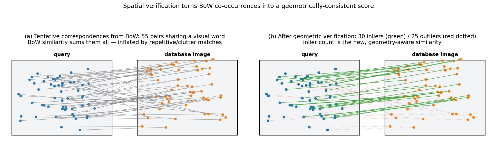

## Spatial Verification for Retrieval Refinement

The Bag-of-Words (BoW) model, described in previous sections, ranks database images by the similarity of their visual word histograms. While efficient and scalable, this ranking is based purely on the statistics of local descriptor quantisation and ignores the spatial arrangement of the corresponding features. **Spatial verification** is a post‑processing step that re‑ranks a shortlist of top‑retrieved images by enforcing geometric consistency among the local feature matches. This section explains how tentative correspondences are obtained from the BoW representation, how spatial verification uses them to estimate a geometric transformation and count inliers, and why the resulting inlier count is a more reliable similarity measure than the raw BoW score.

### 1. Tentative Correspondences from BoW

In the BoW framework, each local feature is assigned to a single visual word. When two images share a visual word, every pair of features – one from the query, one from the database image – that were assigned to that word forms a **tentative correspondence**. Formally, for a query image with feature set $\mathcal{X}$ and a database image with feature set $\mathcal{Y}$, the set of tentative correspondences is

$$
\mathcal{C} = \big\{ ( \mathbf{x}, \mathbf{y} ) \;\big|\; q(\mathbf{x}) = q(\mathbf{y}) \big\},
$$

where $q(\cdot)$ denotes the visual word assignment. Each correspondence carries the geometric information of the underlying local feature: its image position $(x,y)$ and, critically, its **local shape** $A$ (e.g., scale and rotation for a similarity‑covariant detector, or an affine shape matrix for an affine‑covariant detector). Thus a correspondence is fully described by the tuple $(A, x, y) \leftrightarrow (A', x', y')$.

These tentative correspondences are a by‑product of the inverted‑file retrieval process. When the query’s posting lists are traversed, the system can record not only the image identifiers but also the specific feature indices and their geometric attributes. The BoW similarity score counts how many such correspondences exist (weighted by idf), but it does not check whether they are mutually consistent in terms of image geometry.

### 2. Spatial Verification via Inlier Counting

Spatial verification tests whether a large subset of the tentative correspondences can be explained by a single, global geometric transformation between the two images. The underlying assumption is that if the query and the database image depict the same object or scene from different viewpoints, the true matches will obey a coherent mapping (e.g., a similarity or affine transformation), while false matches – caused by visual word aliasing or background clutter – will be scattered randomly.

The verification procedure follows a RANSAC‑like paradigm, but the course material presents an efficient, deterministic variant that exploits the fact that a single correspondence is sufficient to hypothesise a transformation when the local features are covariant.

#### 2.1 Transformation Hypothesis from a Single Correspondence

A local feature detector that provides scale and rotation (or an affine shape) defines a mapping from a canonical patch to the image. For a similarity‑covariant feature, the shape $A$ encodes a $2 \times 2$ matrix representing the scaling and rotation that bring a unit circle to the detected region. For an affine‑covariant feature, $A$ is a $2 \times 2$ affine matrix. Given a tentative correspondence $(A, x, y) \leftrightarrow (A', x', y')$, the transformation that maps points from the query image to the database image can be estimated directly as

$$
F = A' \, A^{-1},
$$

where $F$ is a $3 \times 3$ homogeneous matrix representing either a similarity (4 degrees of freedom) or an affine (6 degrees of freedom) transformation, depending on the nature of $A$. This is possible because the local shape provides the rotation, scale, and (in the affine case) skew – exactly the parameters needed to align the two local patches. Thus, **a single correspondence fully defines the hypothesis**, eliminating the need to sample multiple correspondences and the associated randomness of conventional RANSAC.

#### 2.2 Inlier Counting

Once a hypothesis $F$ is formed, every other tentative correspondence is tested for consistency. A correspondence $(x, y) \leftrightarrow (x', y')$ is deemed an **inlier** if the projection of the query point under $F$ falls within a threshold $\tau$ of the database point:

$$
\| \pi\!\big(F \cdot [x, y, 1]^\top\big) - (x', y') \| < \tau,
$$

where $\pi$ denotes the dehomogenisation $(u, v, w) \mapsto (u/w, v/w)$. The threshold $\tau$ is typically a few pixels, reflecting the localisation accuracy of the feature detector.

The process is repeated for every tentative correspondence: each correspondence in turn provides a hypothesis $F$, and the number of inliers is counted. The hypothesis with the largest inlier set is retained. Because the number of tentative correspondences is usually a few hundred, this exhaustive search is fast, especially when applied only to the top‑ranked images from the BoW stage.

#### 2.3 Similarity Measure

The **image‑to‑image similarity** after spatial verification is simply the **number of inliers** (or, equivalently, the inlier ratio). The final ranking of the shortlisted images is based on this inlier count, often combined with the original BoW score or used as a standalone re‑ranking criterion.

The figure shows the effect on a synthetic image pair. Panel (a) plots all tentative correspondences obtained from the BoW step — a mix of geometrically-consistent matches (inliers obeying a single similarity transform between the two views) and random correspondences from clutter and visual-word aliasing. The raw BoW score sums them all and is therefore inflated. Panel (b) shows the result after geometric verification: only the matches that agree with the hypothesised transform within a reprojection threshold $\tau$ are kept (green); the rest are rejected (red dotted). The retained inlier count is the new, geometry-aware similarity used for the final ranking.

### 3. Why Spatial Verification Improves Retrieval

The BoW similarity is a sum of weighted co‑occurrences of visual words. It is a global statistic that can be inflated by several phenomena that do not indicate true visual correspondence:

- **Repetitive textures or patterns.** A building with many identical windows will generate many visual word matches between two images of the same building, even if the viewpoints are completely different and the matches are spatially inconsistent.
- **Background clutter.** Features from irrelevant background regions may accidentally share visual words with the query object, contributing to the BoW score.
- **Visual word aliasing.** Due to quantisation, two features that are not truly similar may be assigned to the same visual word, creating false correspondences.

Spatial verification overcomes these limitations by requiring that the matches agree with a single geometric transformation. This has several benefits:

- **Geometric consistency filters false matches.** Only correspondences that fit the estimated transformation are counted; random or inconsistent matches are discarded. The inlier count is therefore a much stronger indicator that the same object is present under a valid viewpoint change.
- **Robustness to occlusion and clutter.** As long as a sufficient number of true matches survive to define the transformation, the inlier count reflects the extent of the visible object region, while BoW similarity can be dominated by clutter.
- **Discriminative power.** Two images of different objects that happen to have similar visual word distributions (e.g., two textured façades) will yield very few inliers because no single transformation can align their features. The inlier count will be low, correctly demoting them in the ranking.
- **Provides a verifiable geometric relation.** The inlier set itself can be used for subsequent tasks such as accurate localisation, homography estimation, or 3D reconstruction.

In practice, spatial verification is applied as a **re‑ranking step**: the BoW inverted file quickly produces a shortlist of (say) the top 100–1000 candidates, and spatial verification refines their order using the inlier count. This two‑stage approach retains the speed of BoW while dramatically improving precision, especially for instance‑level retrieval where geometric consistency is a strong cue.

### 4. Summary

Spatial verification improves retrieval performance by enforcing geometric consistency among the tentative correspondences obtained from the BoW representation. Tentative correspondences are simply pairs of local features assigned to the same visual word. A geometric transformation (similarity or affine) is hypothesised from a single correspondence using the local feature shape, and the number of inliers – correspondences that agree with that transformation – is counted. The inlier count serves as the new similarity measure. This is superior to the raw BoW similarity because it filters out false matches that lack spatial coherence, making the ranking far more robust to repetitive textures, background clutter, and visual word aliasing. The method is efficient when applied to a shortlist of top BoW candidates, combining the scalability of inverted files with the discriminative power of geometric verification.

---

### Self-Test

1. Spatial verification hypothesises a transformation $F = A' A^{-1}$ from a **single** correspondence, whereas standard RANSAC needs a minimal sample of multiple points — why does having the local feature shape $A$ make one correspondence sufficient?
2. A query image shows a highly repetitive brick wall, and the top BoW result is a different wall with very similar texture but a different layout. How would spatial verification behave in this case, and why?
3. If you increase the inlier threshold $\tau$ significantly, how would that affect the balance between correctly verified true matches and incorrectly accepted false matches, and what downstream effect would this have on retrieval precision?
4. Spatial verification is applied only to a shortlist rather than the entire database — under what retrieval conditions could this two-stage strategy fail to surface a correct match, even if it would have received a high inlier count?

### Answer Key

1. A local feature shape matrix $A$ encodes the full similarity or affine transformation (scale, rotation, and optionally skew) that maps a canonical unit patch to the detected region in the image. Given a correspondence $(A, x, y) \leftrightarrow (A', x', y')$, the relative transformation is determined directly as $F = A' A^{-1}$, which already specifies all degrees of freedom of the model (4 for similarity, 6 for affine). Standard RANSAC needs multiple points precisely because it works with point coordinates alone, which provide only 2 constraints each, so a minimal sample of 2–3 points is needed to solve for the transformation parameters.

2. Spatial verification would likely assign a low inlier count to this result and demote it in the re-ranking. Although the two walls share many visual words (inflating the BoW score), the matched features will not be consistent with any single geometric transformation $F$ because the brick layout differs — the correspondences will be spatially scattered and fail the inlier threshold $\tau$. This is precisely the "repetitive textures" failure mode described in Section 3, which spatial verification is designed to overcome.

3. Increasing $\tau$ relaxes the geometric consistency criterion, so more correspondences — including spatially inconsistent false matches — pass the inlier test. True inliers that were previously borderline (due to detector localisation noise or slight model mismatch) are correctly recovered, improving recall of genuine matches; however, false matches from background clutter or visual word aliasing are also accepted, reducing precision. The net downstream effect is a less discriminative inlier count that blurs the ranking boundary between correct and incorrect retrievals, ultimately degrading retrieval precision.

4. The two-stage strategy can fail when the correct match has a low BoW similarity score and therefore does not appear in the shortlist at all, even though it would have yielded many geometric inliers. This can happen when the query and correct database image share few visual words — for example due to large viewpoint change that causes very different feature sets to be activated, significant illumination change that shifts descriptor values across quantisation boundaries, or heavy occlusion reducing the number of visible features. If the correct image ranks outside the top-$k$ candidates selected for spatial verification, no amount of inlier counting can recover it.