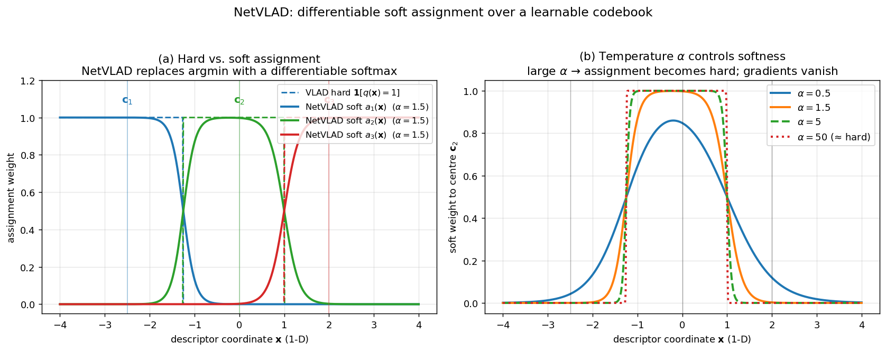

## NetVLAD: A Learnable VLAD Layer

The previous section described how mapping images to a global descriptor vector enables efficient and scalable retrieval. Among the many architectures for producing such a descriptor, **NetVLAD** occupies a special place: it takes the classical VLAD (Vector of Locally Aggregated Descriptors) aggregation scheme and makes it **fully differentiable**, allowing the entire pipeline – from local features to the final global descriptor – to be trained end‑to‑end with a retrieval‑oriented loss. This section explains how NetVLAD works and highlights the key differences from the original, hand‑crafted VLAD.

### 1. Recap of VLAD

VLAD aggregates a set of local descriptors $\{\mathbf{x}_i\}_{i=1}^N$, $\mathbf{x}_i \in \mathbb{R}^D$, into a single global vector. It relies on a pre‑computed visual codebook $\{\mathbf{c}_k\}_{k=1}^K$ (e.g., obtained by $k$‑means clustering of training descriptors). Each local descriptor is assigned to its nearest visual word:

$$
q(\mathbf{x}_i) = \arg\min_k \|\mathbf{x}_i - \mathbf{c}_k\|.
$$

For every visual word $k$, the **residuals** $\mathbf{x}_i - \mathbf{c}_k$ of all descriptors assigned to that word are summed:

$$
\mathbf{v}_k = \sum_{i:\, q(\mathbf{x}_i)=k} (\mathbf{x}_i - \mathbf{c}_k).
$$

The VLAD descriptor is the concatenation of these per‑word residual sums, typically followed by intra‑normalisation (L2‑normalising each $\mathbf{v}_k$) and a global L2 normalisation. The similarity between two VLAD descriptors $\mathbf{V}$ and $\mathbf{V}'$ is computed as a dot product, which can be decomposed into a sum over visual words of the dot products of the corresponding residual sums. Crucially, only descriptors assigned to the **same** visual word contribute to the similarity; descriptors assigned to different words give zero contribution. This hard assignment makes VLAD non‑differentiable with respect to the local descriptors and the codebook, preventing end‑to‑end learning.

### 2. How NetVLAD Works

NetVLAD replaces the hard assignment of VLAD with a **soft assignment** to all visual words, and it treats the codebook as a **learnable parameter matrix**. The local descriptors are typically the dense feature maps of a convolutional neural network (CNN), so the whole system is a differentiable function from the input image to a global descriptor.

#### 2.1 Soft Assignment

For each local descriptor $\mathbf{x}_i$ and each visual word $k$, NetVLAD computes an assignment weight $a_k(\mathbf{x}_i)$ that reflects how strongly $\mathbf{x}_i$ belongs to word $k$. A common choice is a softmax over the negative distances (or, equivalently, over the dot products if the descriptors and centroids are L2‑normalised):

$$
a_k(\mathbf{x}_i) = \frac{\exp\!\big(-\alpha \|\mathbf{x}_i - \mathbf{c}_k\|^2\big)}{\sum_{j=1}^K \exp\!\big(-\alpha \|\mathbf{x}_i - \mathbf{c}_j\|^2\big)},
$$

where $\alpha > 0$ is a temperature parameter that controls the softness of the assignment (as $\alpha \to \infty$, the assignment becomes hard). The weights are non‑negative and sum to one for each descriptor.

The figure visualises the difference and the role of $\alpha$ on a 1‑D toy with three centroids. Panel (a) overlays VLAD's hard assignment (dashed step functions taking value 1 in the Voronoi cell of each centroid) with NetVLAD's soft assignment at $\alpha = 1.5$: every descriptor contributes to every centroid with a softmax weight that decays smoothly with distance. Panel (b) sweeps $\alpha$ for the weight onto the middle centroid: small $\alpha$ gives broad, gentle assignment (rich but blurry); large $\alpha$ (≥ 50) recovers nearly hard assignment — but at that point the softmax gradient is sharply peaked, so non-nearest centroids receive almost no gradient and the network loses the very signal that makes end-to-end training work.

#### 2.2 Aggregation

The per‑word residual sum is now computed as a **weighted sum** over all local descriptors:

$$
\mathbf{v}_k = \sum_{i=1}^N a_k(\mathbf{x}_i) \, (\mathbf{x}_i - \mathbf{c}_k).
$$

Because the assignment is soft, every descriptor contributes to every visual word, but with a weight that decays with distance. The final NetVLAD descriptor is the concatenation $\mathbf{V} = [\mathbf{v}_1^\top, \dots, \mathbf{v}_K^\top]^\top$, followed by intra‑normalisation and global L2 normalisation, exactly as in VLAD.

#### 2.3 End‑to‑End Training

The centroids $\mathbf{c}_k$ are now parameters of the network, initialised randomly or by clustering, and updated by gradient descent together with the CNN weights. The soft assignment function is differentiable, so gradients flow from the retrieval loss (e.g., contrastive, triplet, or listwise loss) back to both the local descriptors and the codebook. This allows the network to learn a codebook and local features that are jointly optimised for the retrieval task, rather than being fixed after an unrelated clustering step.

### 3. Differences Between NetVLAD and VLAD

The table below summarises the principal differences.

| Aspect | VLAD | NetVLAD |
|--------|------|---------|
| **Assignment** | Hard: each descriptor assigned to the single nearest visual word. | Soft: each descriptor contributes to all visual words with a weight given by a softmax over distances. |
| **Codebook** | Fixed, pre‑computed by $k$‑means on a separate set of local descriptors. | Learnable parameter matrix, jointly optimised with the CNN during training. |
| **Gradient flow** | Non‑differentiable; cannot be trained end‑to‑end with a retrieval loss. | Fully differentiable; gradients flow through the soft assignment to both the local descriptors and the centroids. |
| **Local descriptors** | Typically hand‑crafted (e.g., SIFT) or pre‑trained CNN features used as fixed extractors. | Dense deep descriptors from a CNN that is fine‑tuned for the retrieval task. |
| **Training** | Aggregation step is hand‑crafted; no learning of the aggregation itself. | End‑to‑end learning with a metric learning loss, allowing the aggregation to adapt to the data and task. |
| **Performance** | Good, but limited by the fixed codebook and features. | Significantly better, as shown by the accuracy improvements on standard benchmarks (e.g., San Francisco, Tokyo 24/7) when using learned attention and NetVLAD. |

### 4. Why the Soft Assignment Matters

The soft assignment is not merely a smooth approximation of the hard assignment; it fundamentally changes the learning dynamics. With hard assignment, a descriptor can only influence the centroid it is assigned to, and the assignment itself is a discrete operation that blocks gradients. In NetVLAD, every descriptor influences every centroid, and the strength of that influence depends on the distance. This provides a rich training signal: the network can adjust centroids to better capture the distribution of descriptors, and it can shape the local descriptors so that they align well with the learned vocabulary. Moreover, the soft assignment allows the similarity between two NetVLAD descriptors to be interpreted as a weighted cross‑matching of all local descriptors, not just those that fall into the same hard cluster. This often leads to more robust matching, especially when the visual vocabulary is small or the descriptors are ambiguous.

### 5. Summary

NetVLAD is a deep learning extension of VLAD that makes the aggregation layer differentiable by replacing hard assignment with a softmax‑based soft assignment and by treating the codebook as a learnable parameter. This enables end‑to‑end training of the entire image‑to‑descriptor pipeline with a retrieval loss, resulting in a global descriptor that is jointly optimised for the task. The key differences from classical VLAD are the soft assignment, the learnable codebook, and the ability to back‑propagate gradients, which together yield substantial improvements in retrieval accuracy.

---

### Self-Test

1. In NetVLAD, the temperature parameter $\alpha$ controls the softness of assignment — why might using a very large $\alpha$ be problematic during training even though it approximates the original VLAD's hard assignment?
2. Classical VLAD similarity can be decomposed into a sum of dot products of residual vectors for descriptors sharing the same visual word. How does the soft assignment in NetVLAD change this interpretation, and what does it imply for matching between ambiguous or repetitive scene regions?
3. If you doubled the number of visual words $K$ in NetVLAD (with all else equal), what effects would you expect on the descriptor dimensionality, retrieval accuracy, and risk of overfitting?
4. Under what scene or dataset conditions would you expect NetVLAD's advantage over classical VLAD to shrink — that is, when might a fixed, hand-crafted codebook perform nearly as well as a learned one?

### Answer Key

1. A very large $\alpha$ makes the softmax assignment approach a hard $\arg\min$, which is nearly non-differentiable: the gradient of the softmax with respect to the distances becomes extremely peaked, sending near-zero gradient to all but the closest centroid. This causes the "vanishing gradient" problem for all non-nearest centroids, effectively blocking the rich training signal that soft assignment is meant to provide. The network can no longer adjust centroids or local descriptors based on their proximity to multiple visual words simultaneously.

2. With soft assignment, the NetVLAD similarity between two images decomposes into a weighted cross-matching of **all** pairs of local descriptors, where each pair's contribution is scaled by the product of their soft assignment weights to each visual word $k$. Unlike classical VLAD — where only descriptors sharing the same hard cluster contribute — this means even descriptors assigned to different dominant words can influence the similarity score if they have overlapping soft weights. For ambiguous or repetitive scene regions (where descriptors sit near cluster boundaries), this richer cross-matching tends to produce more robust similarity estimates because the descriptor is not forced into a single, potentially incorrect bin.

3. Doubling $K$ increases the descriptor dimensionality from $K \cdot D$ to $2K \cdot D$, raising storage and comparison cost proportionally. Retrieval accuracy may improve up to a point because a finer vocabulary can capture more distinctive local patterns, but beyond a certain $K$ gains plateau and the risk of overfitting grows: with more centroids there are fewer descriptors per cluster on average, making each $\mathbf{v}_k$ noisier and the learned vocabulary harder to generalise from limited training data.

4. NetVLAD's advantage tends to shrink when the training and test domains are very similar to the domain on which the hand-crafted features (e.g., SIFT) and $k$-means codebook were built, or when the dataset is large and visually diverse enough that a rich $k$-means vocabulary already covers the descriptor space well. Additionally, in scenarios with abundant, generic visual variation (e.g., many texture classes evenly distributed), a fixed codebook trained on a similarly broad corpus can approximate the learned one closely, leaving little room for end-to-end optimisation to gain further.