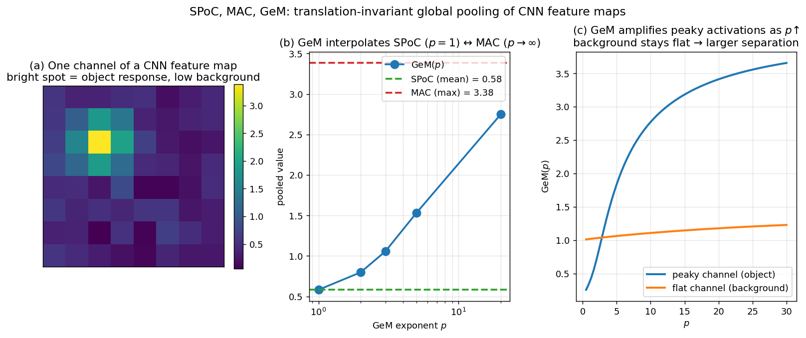

> **Source question (Q23):** How are global image descriptors obtained using CNNs and SPoC, MAC, GeM? What is the relation between GeM and the others? Which of these representations are translation invariant and why? Describe one CNN architecture for extracting global descriptors that is not translation invariant? Why isn't it?

## Global Image Descriptors from CNNs: SPoC, MAC, GeM, and Translation Invariance

The previous sections introduced the idea of mapping a whole image to a single global descriptor vector for efficient retrieval. In this section we examine **how** such a descriptor is obtained from a convolutional neural network (CNN), focusing on three classic pooling strategies – SPoC, MAC, and GeM – and their relationship. We then discuss which of these representations are translation invariant and why, and finally describe a CNN architecture that is **not** translation invariant.

### 1. From Activation Tensor to Global Descriptor

A fully convolutional network (FCN) takes an image of arbitrary size and produces a 3D activation tensor $\mathbfcal{X} \in \mathbb{R}^{W \times H \times D}$. This tensor can be interpreted as a dense set of $D$-dimensional local descriptors, one at each spatial location $(i,j)$. To obtain a single global descriptor $\mathbf{X} \in \mathbb{R}^D$, we must **aggregate** these $W \times H$ local vectors into one. The aggregation function determines the geometric properties of the final representation.

### 2. SPoC – Sum Pooling of Convolutions

The simplest aggregation is **global sum pooling**, yielding the **SPoC descriptor** (Sum‑Pooled Convolutional features). For each channel $d = 1,\dots,D$, we sum the activations over all spatial positions:

$$
X_d = \sum_{i=1}^{W} \sum_{j=1}^{H} \mathcal{X}_{i,j,d}.
$$

The resulting vector $\mathbf{X} = [X_1, \dots, X_D]^\top$ is then $\ell_2$‑normalised. Because summation discards the spatial arrangement of the activations, SPoC is **translation invariant**: shifting the input image simply permutes the summands, leaving the total unchanged. Despite its simplicity, SPoC works remarkably well, as the discriminative power of deep CNN activations already provides a strong signal.

### 3. MAC – Maximum Activation of Convolutions

Instead of summing, **global max pooling** takes the maximum activation of each channel across all spatial locations, producing the **MAC descriptor** (Maximum Activation of Convolutions):

$$
X_d = \max_{i,j} \, \mathcal{X}_{i,j,d}.
$$

Each dimension of the MAC descriptor corresponds to the strongest response of a particular feature‑map channel, and therefore implicitly corresponds to a specific image region – the receptive field that triggered that maximum. When two MAC descriptors are compared via dot product, the similarity can be interpreted as a soft, implicit matching of corresponding regions, as illustrated in the slides. Like SPoC, MAC is **translation invariant** because the maximum over a set does not depend on the absolute positions of the elements.

### 4. GeM – Generalised Mean Pooling

**Generalised mean (GeM) pooling** unifies and generalises sum and max pooling. For each channel $d$, the GeM descriptor is computed as

$$
X_d = \left( \frac{1}{WH} \sum_{i=1}^{W} \sum_{j=1}^{H} \mathcal{X}_{i,j,d}^{\,p} \right)^{\!1/p},
$$

where $p > 0$ is a parameter that controls the pooling behaviour:

- As $p \to \infty$, GeM approaches **max pooling** (MAC).
- For $p = 1$, GeM becomes **average pooling**, which is equivalent to SPoC up to a constant factor (the factor $1/WH$ is absorbed by the subsequent $\ell_2$ normalisation).

The parameter $p$ can be fixed a priori or **learned** during training, allowing the network to interpolate between the two extremes and adapt the aggregation to the task. GeM is also **translation invariant** because the generalised mean is a symmetric function of the spatial positions.

### 5. Relation Between GeM, SPoC, and MAC

The relationship can be summarised as follows: **GeM is a continuous family of pooling operations that contains SPoC (average pooling) and MAC (max pooling) as special cases.** By choosing $p=1$ we recover the behaviour of SPoC; by letting $p \to \infty$ we recover MAC. In practice, a learned $p$ often lies between 1 and 3, giving a descriptor that balances the region‑specificity of max pooling with the holistic averaging of sum pooling. This flexibility is one reason why GeM consistently outperforms both SPoC and MAC on standard benchmarks (e.g., R‑Oxford with 1M distractors).

The figure illustrates the relationship. Panel (a) shows one channel of a synthetic feature map: a bright object peak on a noisy background. Panel (b) plots the GeM-pooled value as $p$ varies, with the SPoC (mean) and MAC (max) values drawn as horizontal lines — the GeM curve smoothly interpolates from SPoC at $p=1$ towards MAC as $p \to \infty$. Panel (c) compares GeM on two different channels: a *peaky* channel (with one large activation, e.g., a strong object response) and a *flat* channel (uniform background). As $p$ grows, the peaky channel's pooled value grows much faster than the flat channel's — the separation between object and background responses widens, which is why a learned $p \in [1, 3]$ typically beats both SPoC and MAC.

### 6. Translation Invariance of SPoC, MAC, and GeM

All three pooling methods – SPoC, MAC, and GeM – are **translation invariant**. The reason is that each aggregates information over the entire spatial domain using a symmetric function (sum, max, or generalised mean) that does not depend on the absolute coordinates $(i,j)$. If an object in the image is translated, the set of local descriptor values remains the same (up to boundary effects), only their positions change. Since the aggregation ignores positions, the global descriptor stays identical. This property is highly desirable for instance‑level retrieval, where the object of interest may appear anywhere in the frame.

### 7. A CNN Architecture That Is Not Translation Invariant: Flatten + FC Layer

Not all CNN‑based global descriptors are translation invariant. A straightforward alternative to spatial pooling is to **flatten** the $W \times H \times D$ activation tensor into a long vector and pass it through one or more **fully connected (FC) layers**:

$$
\mathbf{X} = \mathbf{W} \, \text{vec}(\mathbfcal{X}) + \mathbf{b},
$$

where $\text{vec}(\mathbfcal{X})$ stacks all spatial locations in a fixed, predefined order (e.g., row‑major). The weight matrix $\mathbf{W}$ has a separate set of parameters for each spatial position.

This representation is **translation variant** because the flattened vector explicitly encodes the spatial layout: if the input image is translated, the activation pattern shifts to different positions in the tensor, and the entries of $\text{vec}(\mathbfcal{X})$ are permuted. Since $\mathbf{W}$ is not constrained to be equivariant to such permutations, the output descriptor $\mathbf{X}$ changes. In other words, the FC layer learns to associate specific weights with specific absolute locations, so the descriptor depends on *where* features appear, not just *what* features appear.

While this architecture can be useful for tasks where absolute position matters (e.g., scene classification with a fixed viewpoint), it is generally unsuitable for instance‑level retrieval, where objects may be framed differently. The translation invariance of pooling‑based descriptors is one of their key advantages.

### 8. Summary

- **SPoC** (sum pooling) and **MAC** (max pooling) are simple, translation‑invariant global descriptors obtained by aggregating a CNN’s activation tensor over all spatial positions.
- **GeM** (generalised mean pooling) interpolates between the two via a parameter $p$, with $p=1$ giving average pooling (equivalent to SPoC) and $p \to \infty$ giving max pooling (MAC). GeM can be learned end‑to‑end.
- All three are **translation invariant** because they use symmetric aggregation functions that discard spatial coordinates.
- In contrast, a **flatten + FC layer** architecture is **translation variant** because the fully connected layer ties weights to absolute spatial positions, making the descriptor sensitive to shifts of the input.

---

### Self-Test

1. SPoC and MAC are both translation invariant, yet they perform differently in practice. What geometric property of an object's appearance does MAC capture that SPoC misses, and why does this affect retrieval quality?
2. GeM with a learned $p$ often converges to values between 1 and 3. What would it mean for retrieval if $p$ were forced to be very large (e.g., $p = 100$), and under what conditions might that be harmful?
3. A flatten + FC descriptor is translation variant, but a CNN with spatial pooling is not — even though both process the same convolutional features. Explain precisely *where* in the architecture translation variance is introduced in the FC case.
4. Suppose you are retrieving images of a small landmark that appears at varying scales and positions within a cluttered scene. Which of SPoC, MAC, or GeM would you expect to be most robust, and why might the answer change if the landmark always appears centered and at a fixed scale?

### Answer Key

1. MAC selects the **maximum** activation per channel, which corresponds to the single most-responsive spatial location — implicitly capturing the most salient region of the object. SPoC sums all activations, so its descriptor is dominated by the aggregate response across the whole image including background clutter. This means MAC can implicitly match the most discriminative local features between two images (as illustrated by the dot-product interpretation in the text), while SPoC conflates landmark evidence with irrelevant scene context, hurting retrieval precision.

2. As $p \to \infty$, GeM approaches pure max pooling (MAC), so forcing $p = 100$ would make the descriptor nearly identical to MAC — retaining only the single strongest activation per channel. This could be harmful when the object of interest is small or when multiple channel responses together form the discriminative signal, since all but the peak activation is discarded; background clutter with a slightly higher response in any channel can hijack the descriptor entirely.

3. Translation variance is introduced at the **flattening step**, where the 3D tensor $\mathcal{X} \in \mathbb{R}^{W \times H \times D}$ is linearised into $\text{vec}(\mathcal{X})$ in a fixed spatial order (e.g., row-major). The subsequent fully connected weight matrix $\mathbf{W}$ then assigns a distinct set of weights to each absolute position in that fixed ordering. When the input shifts, activations move to different indices in $\text{vec}(\mathcal{X})$, so they are multiplied by different weights and the output changes — unlike pooling, which sums or maximises over all positions and ignores their coordinates.

4. **GeM** (or MAC) would likely be most robust for a landmark at varying scales and positions, because max-like pooling focuses on the strongest channel responses regardless of where they occur, making the descriptor less sensitive to the landmark's exact location within the frame. If the landmark is always centered and at a fixed scale, the absolute spatial layout becomes informative rather than a nuisance, so even a higher-$p$ GeM or a translation-variant architecture could perform well — and SPoC's holistic average might actually be competitive since background activations are more predictable and consistent across queries.