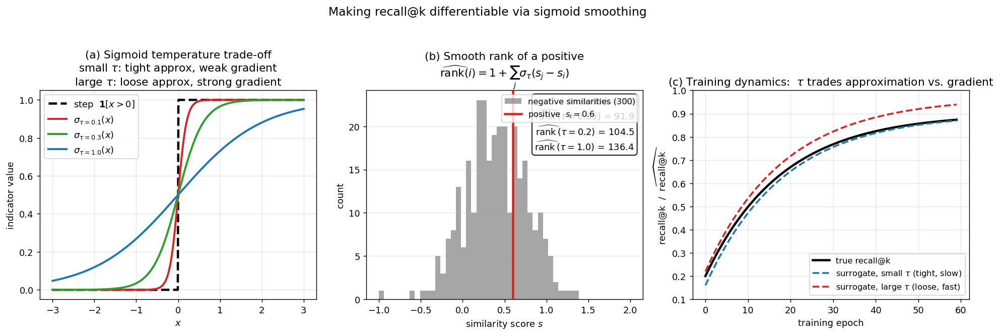

## Making Recall@k Differentiable: The Recall Surrogate Loss

The previous sections introduced contrastive and triplet losses, which optimise pairwise or triplet relationships. While effective, these losses do not directly optimise the retrieval metrics used at evaluation time, such as **recall@k**. Recall@k measures the fraction of relevant items that appear among the top‑$k$ retrieved results for a query. Because it depends on a discrete ranking operation and a hard step function, recall@k is non‑differentiable and cannot be used as a loss in gradient‑based training. This section explains how to construct a **differentiable surrogate** for recall@k, turning the evaluation metric itself into a trainable loss.

### 1. Recall@k as a Function of Similarities

Let a query $q$ have a set of relevant (positive) documents $\mathcal{P}$ and a set of non‑relevant (negative) documents $\mathcal{N}$. For each item $i$, we have a similarity score $s_i$ (e.g., the dot product between $\ell_2$‑normalised global descriptors). The items are ranked by decreasing $s_i$. The recall@k for query $q$ is

$$
\text{recall@k} = \frac{1}{|\mathcal{P}|} \sum_{i \in \mathcal{P}} \mathbf{1}\bigl[\,\text{rank}(i) \le k\,\bigr],
$$

where $\mathbf{1}[\cdot]$ is the indicator function and $\text{rank}(i)$ is the position of item $i$ in the sorted list. The rank can be expressed by counting how many negatives are ranked above $i$ (assuming no ties and that all positives are distinct):

$$
\text{rank}(i) = 1 + \sum_{j \in \mathcal{N}} \mathbf{1}\bigl[\,s_j > s_i\,\bigr].
$$

Both the indicator $\mathbf{1}[s_j > s_i]$ and the top‑$k$ indicator $\mathbf{1}[\text{rank}(i) \le k]$ are step functions, which have zero gradient almost everywhere and are discontinuous. This makes recall@k impossible to optimise directly with gradient descent.

### 2. Smoothing the Step Function

The key idea is to replace every hard step function with a smooth, differentiable approximation – typically a **sigmoid** function. For a threshold at zero, the step function $\mathbf{1}[x > 0]$ is approximated by

$$
\sigma_\tau(x) = \frac{1}{1 + \exp(-x/\tau)},
$$

where $\tau > 0$ is a temperature parameter controlling the sharpness of the approximation. As $\tau \to 0$, $\sigma_\tau(x)$ approaches the step function; larger $\tau$ yields a softer, more gradual transition. This trade‑off is illustrated in the slides: a sharper sigmoid approximates the metric more faithfully but provides weaker gradients, while a softer sigmoid gives stronger gradients but a looser approximation.

### 3. Smooth Rank and Smooth Top‑k Indicator

Using the sigmoid, we define a **smooth rank** for a positive item $i$:

$$
\widehat{\text{rank}}(i) = 1 + \sum_{j \in \mathcal{N}} \sigma_\tau\bigl(s_j - s_i\bigr).
$$

Each negative $j$ contributes a value between 0 and 1 depending on how much its similarity exceeds $s_i$. If $s_j \gg s_i$, the contribution is close to 1; if $s_j \ll s_i$, it is close to 0. The smooth rank is a real‑valued, differentiable approximation of the true integer rank.

Next, we need to check whether this smooth rank is at most $k$. We apply a second sigmoid centred at $k$:

$$
\mathbf{1}\bigl[\,\text{rank}(i) \le k\,\bigr] \;\approx\; \sigma_{\tau'}\!\bigl(k - \widehat{\text{rank}}(i)\bigr),
$$

where $\tau'$ is another temperature parameter (often set equal to $\tau$). This function approaches 1 when $\widehat{\text{rank}}(i) \ll k$ and 0 when $\widehat{\text{rank}}(i) \gg k$, with a smooth transition around $k$.

The figure shows the construction and its trade-offs. Panel (a) plots the hard step function $\mathbf{1}[x>0]$ together with three sigmoid approximations: small $\tau$ (red) tracks the step tightly but has near-zero gradient almost everywhere; large $\tau$ (blue) is smooth and differentiable but a much looser approximation. Panel (b) shows the smooth rank in action: a histogram of negative similarities with one positive marked in red, and the smooth-rank estimate for several $\tau$ — small $\tau$ recovers the true integer rank, large $\tau$ underestimates it. Panel (c) sketches the training dynamics: true recall@k climbs over epochs while a small-$\tau$ surrogate tracks it tightly but trains slowly, and a large-$\tau$ surrogate overestimates recall but provides stronger gradients — the practical reason for annealing $\tau$ from large to small during training.

### 4. Recall@k Surrogate and Loss

The **differentiable recall@k surrogate** for a single query is then

$$
\widehat{\text{recall@k}} = \frac{1}{|\mathcal{P}|} \sum_{i \in \mathcal{P}} \sigma_{\tau'}\!\bigl(k - \widehat{\text{rank}}(i)\bigr).
$$

This value is in $(0,1)$ and is fully differentiable with respect to the similarity scores $s_i$, and therefore with respect to the network parameters. To convert it into a loss that we minimise, we take the negative of the surrogate (or $1 - \widehat{\text{recall@k}}$), summed or averaged over all queries in the batch:

$$
\mathcal{L}_{\text{recall}} = \frac{1}{|\mathcal{Q}|} \sum_{q \in \mathcal{Q}} \Bigl(1 - \widehat{\text{recall@k}}_q\Bigr).
$$

Minimising this loss directly encourages the network to push as many positives as possible into the top‑$k$ positions, exactly the objective of the evaluation metric.

### 5. Practical Considerations: Temperature and Batch Size

The temperature $\tau$ controls the **approximation–gradient trade‑off**. A small $\tau$ makes the surrogate very close to the true recall@k, but the gradients become sparse and concentrated near the decision boundaries, which can hamper optimisation. A larger $\tau$ provides smoother gradients but a looser approximation. In practice, $\tau$ is treated as a hyper‑parameter or is gradually annealed during training.

A more critical requirement is **large batch size**. The smooth rank of a positive depends on the sum over *all* negatives. If the batch contains only a small subset of the training negatives, the rank estimate is noisy and may not reflect the true global ranking. Moreover, recall@k is sensitive to the hardest negatives – those that are most likely to appear in the top‑$k$ – and a small batch is unlikely to contain enough of them. The slides emphasise that *“large batch size is essential to optimize recall”* and describe a **three‑step implementation trick** that decouples the forward pass, the loss computation, and the backward pass to allow a much larger effective batch size without exceeding GPU memory. With this trick, the recall surrogate loss achieves **46.1% mAP on R‑Oxford‑Hard** and **63.9% on R‑Paris‑Hard**, outperforming a contrastive loss baseline (44.3% and 61.5%, respectively) when using the same GeM descriptor.

### 6. Summary

- **Recall@k** is a standard retrieval metric, but its dependence on discrete ranking and step functions makes it non‑differentiable.
- A **differentiable surrogate** is obtained by replacing every indicator function with a sigmoid: first to approximate the rank of each positive, then to check whether that rank is within $k$.
- The resulting **recall surrogate loss** ($1 - \widehat{\text{recall@k}}$) directly optimises the evaluation metric and can be trained end‑to‑end.
- The **temperature** of the sigmoid balances approximation accuracy against gradient strength.
- **Large batch sizes** are essential for reliable rank estimation and for exposing the network to hard negatives; implementation tricks can overcome memory limitations.
- This approach belongs to the family of **listwise losses** that optimise a smoothed version of the retrieval metric, yielding state‑of‑the‑art results on standard benchmarks.

---

### Self-Test

1. The smooth rank $\widehat{\text{rank}}(i)$ sums sigmoid contributions from all negatives. Why does this sum still underestimate the true rank when the temperature $\tau$ is large, and what consequence does that have for the surrogate recall value?
2. How does the recall surrogate loss differ fundamentally from a triplet loss in *what* it optimises — and why might the surrogate still underperform true recall@k even when minimised perfectly?
3. If you halve the batch size during training with the recall surrogate loss, which negatives are most likely to go missing, and why does their absence disproportionately hurt the quality of the gradient signal?
4. Suppose two models achieve the same $\widehat{\text{recall@k}}$ on the training set but one uses a very small $\tau$ and the other a very large $\tau$. Which model's surrogate is a better proxy for true recall@k, and which is likely to have trained more stably? Justify the trade-off.

### Answer Key

1. When $\tau$ is large, each sigmoid $\sigma_\tau(s_j - s_i)$ is far from the hard step function and outputs values significantly below 1 even when $s_j \gg s_i$, so the sum underestimates how many negatives truly outrank positive $i$. This means $\widehat{\text{rank}}(i)$ is smaller than the true rank, which in turn causes $\sigma_{\tau'}(k - \widehat{\text{rank}}(i))$ to be inflated — the surrogate recall appears higher than the true recall@k, giving an overly optimistic training signal.

2. Triplet loss optimises local pairwise margin constraints between one positive and one (or a few) negatives, without any reference to the global ranking or the cutoff $k$. The recall surrogate loss, by contrast, directly optimises a smoothed approximation of the fraction of positives in the top‑$k$, making it a **listwise** objective. Even when $\mathcal{L}_{\text{recall}}$ is minimised perfectly, the surrogate can differ from true recall@k because the sigmoid approximations introduce systematic bias (especially at large $\tau$), so a model can achieve a low surrogate loss while still not placing every positive within the true top‑$k$.

3. Halving the batch size disproportionately removes **hard negatives** — items with high similarity to the query that are most likely to appear near the top of the ranking. Hard negatives are rare relative to the full database, so a smaller batch samples fewer of them by chance. Their absence means $\widehat{\text{rank}}(i)$ is systematically underestimated (fewer terms in the sum), and the gradient of the loss with respect to borderline positives — those just outside or inside the top‑$k$ — becomes weak or misleading, since those gradients depend on the presence of negatives scored close to $s_i$.

4. The model trained with a very small $\tau$ has a surrogate that closely approximates the true recall@k (as $\tau \to 0$ the sigmoid converges to the step function), making it a **better proxy** for the evaluation metric. However, small $\tau$ yields sparse, near-zero gradients almost everywhere except right at the decision boundary, which makes optimisation unstable or slow. The model trained with large $\tau$ produces smoother, stronger gradients and is likely to have **trained more stably**, but its surrogate is a looser approximation of true recall@k. In practice $\tau$ is treated as a hyper-parameter or annealed from large to small to get stable training early and a tight metric approximation later.