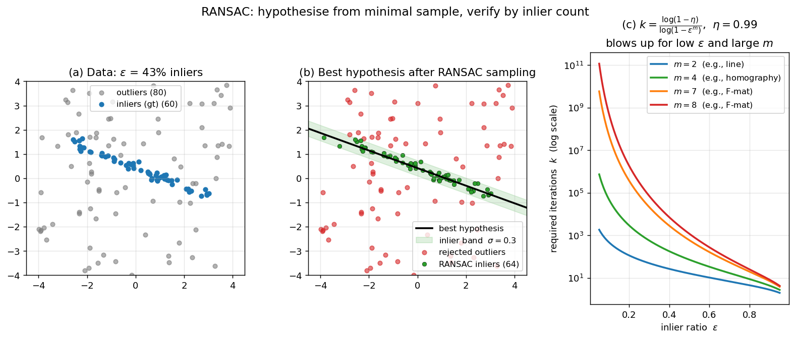

> **Source question (Q27):** Describe the RANSAC algorithm, its properties, advantages and disadvantages. Which parameters it has?

## RANSAC: Random Sample Consensus

Many computer vision tasks require estimating the parameters of a geometric model from a set of noisy measurements – for example, fitting a line to edge points, computing an epipolar geometry from tentative correspondences, or finding a plane in a 3D point cloud. In realistic data, a large fraction of the measurements are **outliers** that do not conform to the model at all. Standard least‑squares fitting is catastrophically sensitive to even a single gross outlier. **RANSAC** (RANdom SAmple Consensus) is a robust estimation paradigm that can tolerate extreme outlier ratios and has become one of the most widely used algorithms in computer vision.

### 1. Problem Setting

We are given a set of $N$ data points $\mathcal{X} = \{\mathbf{x}_i\}_{i=1}^N$. A model is defined by a parameter vector $\theta$. For each point $\mathbf{x}$ we can compute a distance $d(\mathbf{x},\theta)$ to the model. A point is considered an **inlier** if $d(\mathbf{x},\theta) \le \sigma$, where $\sigma$ is a user‑supplied **inlier threshold**; otherwise it is an **outlier**. The goal is to find the model $\theta^*$ that minimises the cost

$$
J(\theta) = \sum_{\mathbf{x}\in\mathcal{X}} f(\mathbf{x},\theta),\qquad
f(\mathbf{x},\theta) = \begin{cases}
0 & \text{if } d(\mathbf{x},\theta) \le \sigma,\\
1 & \text{otherwise}.
\end{cases}
$$

In other words, we seek the model that is consistent with the largest number of points – the model with the **maximum consensus set**. The cost function is non‑convex and the optimisation is combinatorial, so an exhaustive search over all possible minimal subsets is infeasible.

### 2. The RANSAC Algorithm

RANSAC tackles the problem by repeatedly hypothesising models from small random subsets and verifying them against all data. The core loop is:

1. **Sample** – draw a random subset $S \subset \mathcal{X}$ of size $m$, where $m$ is the minimum number of points needed to define the model (e.g., $m=2$ for a line, $m=7$ for the fundamental matrix).
2. **Estimate** – compute model parameters $\theta = e(S)$ from the sample.
3. **Verify** – evaluate the support of $\theta$ by counting how many points in $\mathcal{X}$ satisfy $d(\mathbf{x},\theta) \le \sigma$. Let $J(\theta)$ be the number of outliers (or, equivalently, the number of inliers).
4. **Update** – if $J(\theta)$ is smaller than the best cost $J^*$ seen so far, store $\theta^* \leftarrow \theta$, $J^* \leftarrow J(\theta)$, and recompute the number of iterations $k$ that are still needed (see below).
5. **Terminate** – stop when the probability that a better model exists falls below $1-\eta$, where $\eta$ is the desired confidence.

After the loop, the final model is often re‑estimated from all inliers of the best hypothesis using a standard (non‑robust) method, e.g., least squares, to improve accuracy. This final step is called **local optimisation** in the LO‑RANSAC variant, but even the basic RANSAC typically refines the model on the consensus set.

The algorithm is inherently non‑deterministic: the random sampling may or may not hit an all‑inlier subset. The termination criterion provides a probabilistic guarantee that a correct model has been found with confidence $\eta$.

### 3. Parameters

RANSAC has three explicit parameters:

- **Sample size $m$** – the minimal number of points required to instantiate the model. It is determined by the model (e.g., 2 for a line, 3 for an affine transformation, 7 for the fundamental matrix). Using the minimal sample size maximises the probability of drawing an uncontaminated sample.
- **Inlier threshold $\sigma$** – the maximum distance for a point to be considered consistent with the model. It should reflect the expected measurement noise. Setting $\sigma$ too large risks labelling outliers as inliers; too small may reject valid inliers.
- **Confidence $\eta$** – the desired probability that the true model is found. Typical values are $0.95$, $0.99$, or $0.999$. Higher confidence requires more iterations.

The **number of iterations $k$** is not a fixed parameter but is derived from the other quantities and from the inlier ratio $\varepsilon$ of the best model found so far. If $Q$ is the number of inliers of the current best hypothesis, the inlier ratio is estimated as $\varepsilon = Q/N$. The probability that a single random sample of size $m$ consists entirely of inliers is $\varepsilon^m$. The probability that none of $k$ samples is all‑inlier is $(1-\varepsilon^m)^k$. To achieve confidence $\eta$, we need

$$
(1-\varepsilon^m)^k < 1-\eta \quad\Longrightarrow\quad
k \ge \frac{\log(1-\eta)}{\log(1-\varepsilon^m)}.
$$

Every time a better model is found, $\varepsilon$ is updated and $k$ is recomputed. This adaptive scheme ensures that the algorithm runs just long enough to satisfy the confidence requirement without needing to know the true inlier ratio in advance.

The figure brings these three pieces together on a 2-D line-fitting example. Panel (a) shows the raw data: ~43% of points are inliers lying near a true line, the rest are outliers scattered uniformly. Panel (b) shows the best hypothesis returned by RANSAC after 500 random 2-point samples: the green band has width $\pm\sigma$, and only the points falling inside it count as inliers — least-squares fit to those inliers would now give an accurate final line. Panel (c) plots the required iterations $k$ for confidence $\eta = 0.99$ as a function of the inlier ratio $\varepsilon$ for several minimal sample sizes $m$; the explosion as $\varepsilon \to 0$ or $m$ grows is exactly why RANSAC is fast for low-dimensional models (line: $m=2$) but can be slow for the fundamental matrix ($m=7$).

### 4. Properties and Probabilistic Guarantee

- **Robustness to outliers** – RANSAC can handle arbitrarily high outlier fractions, as long as the inlier ratio $\varepsilon$ is not zero. The required number of iterations grows polynomially with $1/\varepsilon$, so the method remains practical even when inliers are a minority (e.g., 10–20%).
- **Probabilistic guarantee** – with the adaptive termination rule, the probability that the algorithm returns the true model (or one with at least as many inliers) is at least $\eta$. This guarantee holds regardless of the distribution of outliers, provided the inlier noise is bounded by $\sigma$.
- **Simplicity** – the algorithm is easy to implement and makes only mild assumptions: the model can be estimated from $m$ points, and the inlier threshold $\sigma$ is known.
- **Non‑determinism** – different runs may yield slightly different results because of the random sampling. The confidence $\eta$ controls the chance of failure.
- **Time complexity** – each iteration evaluates all $N$ points, so the total time is $O(k \cdot N \cdot t_M)$, where $t_M$ is the cost of evaluating one point against the model. The number of iterations $k$ depends on $\varepsilon$ and $m$; the table in the slides shows that for low inlier ratios and large $m$, $k$ can become enormous, making RANSAC slow.

### 5. Advantages and Disadvantages

**Advantages**

- Extremely popular and widely applicable (geometry estimation, motion segmentation, object detection, etc.).
- Does not require the percentage of inliers to be known or limited – it works for any $\varepsilon > 0$.
- Provides a probabilistic guarantee on the correctness of the solution.
- Mild assumptions: only the inlier threshold $\sigma$ and the model’s minimal sample size $m$ need to be specified.

**Disadvantages**

- **Slow when the inlier ratio is low.** The number of required iterations grows quickly as $\varepsilon$ decreases, especially for models with large $m$.
- **Sensitivity to the threshold $\sigma$.** An inappropriate $\sigma$ can cause the algorithm to miss the true model or to accept a false one. Variants such as MSAC, MLESAC, or MAGSAC address this by using softer cost functions or by estimating $\sigma$ automatically.
- **Noisy inliers degrade performance.** Even an all‑inlier sample may produce a poor model if the inliers are noisy or poorly conditioned. This is why RANSAC often takes longer than the theoretical prediction – not every uncontaminated sample yields a hypothesis that attracts the full consensus set. LO‑RANSAC and other local‑optimisation schemes mitigate this problem.
- **Degeneracy.** When the data contain a dominant degenerate configuration (e.g., all points lie on a plane while trying to estimate epipolar geometry), RANSAC may converge to the degenerate model. The DEGENSAC variant explicitly handles such cases.

In summary, RANSAC is a foundational robust estimator that trades exhaustive search for randomised sampling, offering a practical and theoretically grounded solution to model fitting in the presence of massive outliers. Its many variants (R‑RANSAC, PROSAC, WaldSAC, LO‑RANSAC, GC‑RANSAC) improve speed, accuracy, and robustness while retaining the core random‑sampling philosophy.

---

### Self-Test

1. The required number of iterations $k$ is recomputed every time a better model is found. Why does this adaptive strategy make RANSAC more efficient than fixing $k$ in advance, and what assumption about the data does the update rely on?
2. RANSAC uses the minimal sample size $m$ rather than a larger subset. Why is using the smallest possible sample preferable, and in what situation could using a larger sample actually be beneficial?
3. Suppose you apply RANSAC to estimate a homography ($m = 4$) in a scene where only 10% of correspondences are inliers. How does this outlier ratio affect the number of required iterations compared to a scene with 50% inliers, and what practical consequence does this have?
4. A colleague proposes replacing the hard inlier/outlier threshold $\sigma$ with a smooth cost that penalises large residuals gradually (as in MSAC). Under what conditions does the hard threshold of standard RANSAC perform poorly, and why does a soft cost help in those cases?

### Answer Key

1. When a better hypothesis is found, the estimated inlier ratio $\varepsilon = Q/N$ increases, which reduces the required $k = \log(1-\eta)/\log(1-\varepsilon^m)$. This means the algorithm can terminate earlier than a fixed-$k$ schedule would allow, since the early rounds often find progressively better models that tighten the bound. The update relies on the assumption that the current best inlier ratio is a good lower-bound estimate of the true inlier ratio, so the remaining iterations are sufficient to guarantee confidence $\eta$.

2. Using the minimal sample size $m$ maximises the probability $\varepsilon^m$ that a random draw is all-inlier, since each additional point multiplies by $\varepsilon < 1$ and thus shrinks that probability. A larger sample could be beneficial when the inliers are very noisy and a larger, overdetermined system yields a more stable model estimate — essentially trading fewer clean samples for better-conditioned individual fits, as done in approaches like LO-RANSAC's local refinement step.

3. With 10% inliers ($\varepsilon = 0.1$) and $m = 4$, the probability of a clean sample is $\varepsilon^m = 0.0001$, requiring $k \approx \log(1-\eta)/\log(1-0.0001) \approx 46{,}000$ iterations at $\eta = 0.99$. By contrast, with 50% inliers ($\varepsilon = 0.5$), the same $\eta$ needs only $k \approx 17$ iterations. The practical consequence is that RANSAC becomes extremely slow — or even infeasible — when inlier ratios are very low, motivating guided sampling strategies like PROSAC that prefer higher-quality correspondences.

4. The hard threshold performs poorly when the true noise is heteroscedastic or when $\sigma$ is mis-set: too large a $\sigma$ accepts outliers that slightly violate the model, inflating the consensus set with false inliers; too small a $\sigma$ rejects valid noisy inliers, causing the algorithm to miss the true model. A soft cost like MSAC penalises residuals continuously (truncated quadratic), so borderline points contribute partial evidence rather than being arbitrarily accepted or rejected, making the score more discriminative and less sensitive to the exact choice of threshold.