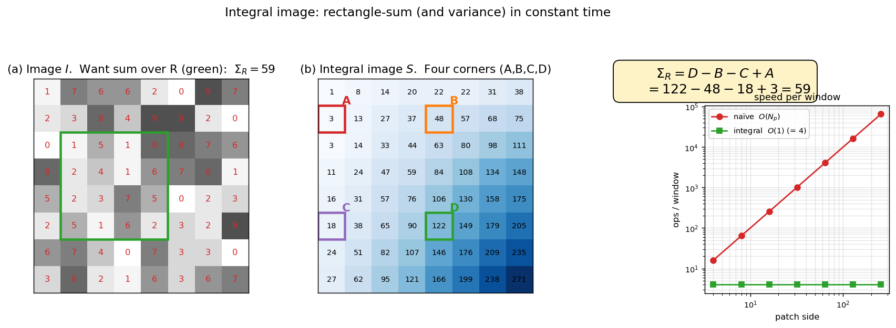

> **Source question (Q29):** Describe how to use an integral image for computing the sum of the intensity and the intensity variance for a rectangular region.

## Integral Images for Fast Computation of Sum and Variance in Rectangular Regions

The TLD detector’s first cascade stage – the variance filter – must evaluate the intensity variance of thousands of image patches per frame. Computing the variance naïvely for every window would be prohibitively slow. The solution is the **integral image** (also called a summed‑area table), a data structure that allows the sum of pixel values inside any axis‑aligned rectangle to be computed in constant time, independent of the rectangle’s size. By maintaining two integral images – one for the original intensities and one for the squared intensities – both the mean and the variance of a patch can be obtained with just a handful of arithmetic operations. This section explains the construction of integral images and derives the formulas for computing the sum of intensities and the intensity variance over a rectangular region.

### 1. Integral Image Definition

Let $I$ be a grayscale image of size $W \times H$, with pixel values $I(x,y)$ where $x \in [0, W-1]$ and $y \in [0, H-1]$ (using zero‑based indexing). The **integral image** $S$ is an array of the same dimensions, defined such that each element $S(x,y)$ stores the sum of all pixel values in the rectangular region from the origin $(0,0)$ to $(x,y)$:

$$
S(x,y) = \sum_{i=0}^{x} \sum_{j=0}^{y} I(i,j).
$$

The integral image can be built in a single pass over the original image using the recurrence

$$
S(x,y) = I(x,y) + S(x-1,y) + S(x,y-1) - S(x-1,y-1),
$$

with the convention that $S(-1,\cdot) = S(\cdot,-1) = 0$. This construction takes $O(W \cdot H)$ time, which is negligible compared to the cost of scanning thousands of windows.

### 2. Computing the Sum of Intensities in a Rectangle

Consider an arbitrary rectangular region $R$ defined by its top‑left corner $(x_1, y_1)$ and bottom‑right corner $(x_2, y_2)$, with $0 \le x_1 \le x_2 < W$ and $0 \le y_1 \le y_2 < H$. The sum of pixel intensities inside $R$ is

$$
\Sigma_R = \sum_{x=x_1}^{x_2} \sum_{y=y_1}^{y_2} I(x,y).
$$

Using the integral image, this sum can be obtained with four look‑ups and three arithmetic operations:

$$
\boxed{\Sigma_R = S(x_2, y_2) - S(x_1-1, y_2) - S(x_2, y_1-1) + S(x_1-1, y_1-1)}.
$$

The geometric intuition is straightforward: $S(x_2,y_2)$ is the sum of the whole rectangle from the origin to $(x_2,y_2)$. Subtracting $S(x_1-1,y_2)$ removes the region to the left of $R$, and subtracting $S(x_2,y_1-1)$ removes the region above $R$. The top‑left corner region $S(x_1-1,y_1-1)$ has been subtracted twice, so it is added back once. When $x_1 = 0$ or $y_1 = 0$, the terms with index $-1$ are treated as zero.

The figure illustrates the four-lookup trick on an 8×8 image. Panel (a) shows the raw image $I$ with the target rectangle $R$ (green) for which we want $\Sigma_R$. Panel (b) shows the integral image $S$ with the four corner cells coloured (A, B, C, D) — only these four entries need to be read to compute $\Sigma_R = D - B - C + A$. Panel (c) writes out the inclusion–exclusion formula with the numerical values from this example, and the inset plots the per-window cost vs. patch side: naïve summation grows as $O(N_p)$ with patch area, while the integral-image lookup stays at exactly 4 operations regardless of size — the constant-time property that makes Stage 1 of TLD's cascade essentially free.

### 3. Computing the Sum of Squared Intensities

The variance of a patch requires not only the sum of intensities but also the sum of **squared** intensities. To obtain this efficiently, we construct a second integral image $S_2$ from the squared pixel values:

$$
S_2(x,y) = \sum_{i=0}^{x} \sum_{j=0}^{y} I(i,j)^2.
$$

The construction follows the same recurrence, with $I(x,y)^2$ in place of $I(x,y)$. The sum of squared intensities over the same rectangle $R$ is then

$$
\boxed{\Sigma_{R^2} = S_2(x_2, y_2) - S_2(x_1-1, y_2) - S_2(x_2, y_1-1) + S_2(x_1-1, y_1-1)}.
$$

### 4. Computing the Variance

Let $N = (x_2 - x_1 + 1) \times (y_2 - y_1 + 1)$ be the number of pixels in the rectangle. The mean intensity $\mu_R$ and the mean of squared intensities are

$$
\mu_R = \frac{\Sigma_R}{N}, \qquad
\overline{I^2}_R = \frac{\Sigma_{R^2}}{N}.
$$

The variance of the pixel intensities inside $R$ is then

$$
\operatorname{Var}[R] = \overline{I^2}_R - \mu_R^2
= \frac{\Sigma_{R^2}}{N} - \left(\frac{\Sigma_R}{N}\right)^2.
$$

Because $\Sigma_R$ and $\Sigma_{R^2}$ are obtained in constant time via the integral images, the variance of any rectangular patch can be computed with a fixed, small number of operations – independent of the patch size. This is the key to the extreme speed of the variance filter in TLD.

### 5. Application in TLD’s Variance Filter

In the TLD detector, every candidate window is normalised to a fixed $15 \times 15$ pixel patch. Before any expensive classification, the variance of the patch is computed using the two integral images of the original (pre‑normalisation) image region. If the variance falls below a threshold learned from the initial positive examples, the patch is immediately rejected as background. Because the integral images are built once per frame and the variance computation requires only a few array accesses and arithmetic operations, this filter can discard roughly **50% of all windows** with negligible overhead, dramatically reducing the load on the subsequent, more expensive cascade stages.

In summary, integral images provide a constant‑time mechanism for computing sums over rectangular regions. By maintaining one integral image for intensities and another for squared intensities, both the sum and the variance of any patch can be evaluated extremely quickly – a crucial enabler for real‑time sliding‑window detection.

---

### Self-Test

1. The variance formula $\operatorname{Var}[R] = \overline{I^2}_R - \mu_R^2$ relies on the identity $\mathbb{E}[X^2] - \mathbb{E}[X]^2$. Why does this algebraic form make the integral image approach viable, whereas the definition $\mathbb{E}[(X - \mu)^2]$ would not benefit from it in the same way?
2. The variance filter threshold is learned from initial positive examples. What could go wrong if the target object being tracked happens to have very low texture (e.g., a plain white mug), and how might this affect the cascade?
3. Both integral images $S$ and $S_2$ require $O(W \cdot H)$ time and memory to build once per frame. How does this upfront cost compare to the alternative of computing variance naïvely for each of the $K$ candidate windows, and at what point (in terms of $K$ and patch size) does the integral image approach become advantageous?
4. The four-lookup formula $\Sigma_R = S(x_2,y_2) - S(x_1-1,y_2) - S(x_2,y_1-1) + S(x_1-1,y_1-1)$ is an instance of inclusion-exclusion. If instead of a rectangle you needed the sum over an L-shaped region, could you still use integral images, and if so, how?

### Answer Key

1. The form $\overline{I^2}_R - \mu_R^2$ decomposes into two independent quantities — $\Sigma_{R^2}/N$ and $(\Sigma_R/N)^2$ — each of which can be pre-computed via an integral image and retrieved in constant time. The definition $\mathbb{E}[(X-\mu)^2]$ requires first knowing $\mu$, then computing per-pixel deviations $(I(x,y)-\mu)^2$, which depend on the specific patch and cannot be accumulated into a patch-independent integral image; this forces a linear scan over all $N$ pixels for every candidate window.
2. A plain, low-texture object has inherently low pixel-intensity variance. If the learned threshold is set from such positive examples, it will be very small, causing the variance filter to pass almost all candidate windows (since nearly everything exceeds a near-zero threshold), negating most of the ~50% rejection benefit described in the text. Alternatively, if positive examples include some textured patches alongside the low-texture target, the threshold may be set too high, causing the filter to erroneously reject the true target and break tracking.
3. Building both $S$ and $S_2$ costs $O(W \cdot H)$ time and memory, done once per frame. Naïve variance computation per window costs $O(N_p)$ per window (where $N_p$ is the patch pixel count), totalling $O(K \cdot N_p)$ for $K$ windows. The integral image approach is advantageous when $K \cdot N_p \gg W \cdot H$; since TLD scans thousands of windows (large $K$) and patches have non-trivial size $N_p$, the constant-time-per-window benefit far outweighs the single $O(W \cdot H)$ build cost.
4. Yes — an L-shaped region can always be decomposed into two (or more) non-overlapping axis-aligned rectangles, and the sum over each rectangle is retrieved in four look-ups via the integral image as described. The total sum over the L-shape is then the sum of the individual rectangular sums, requiring at most $2 \times 4 = 8$ integral image look-ups plus a few additions, still in constant time regardless of region size.