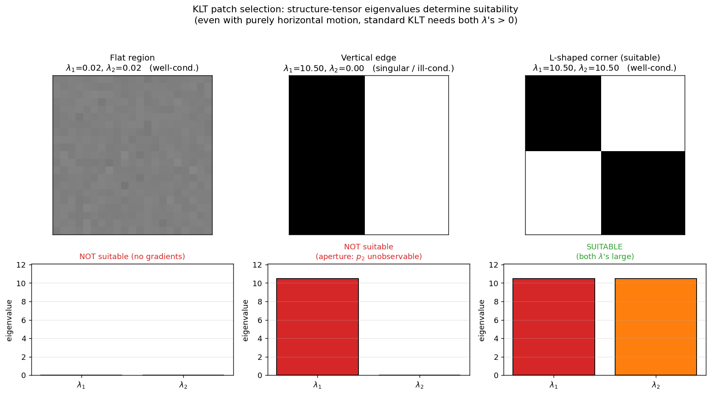

## Image Patch Selection for KLT Tracking Under Horizontal Camera Motion

The Kanade–Lucas–Tomasi (KLT) tracker estimates the parameters of a geometric transformation that best align a template image $T$ with an input image $I$. In its simplest and most common form, the transformation is a pure translation $\mathbf{p} = (p_1, p_2)^\top$, and the alignment is found by minimising the sum of squared differences (SSD) over a region of interest (ROI). The minimisation is performed iteratively by linearising the image intensity function and solving a least‑squares problem at each step. The stability and accuracy of this solution depend critically on the image content inside the ROI. This section explains what properties an image patch must possess to be suitable for KLT tracking, particularly when the camera motion is known to be purely horizontal, and provides a concrete example of a well‑suited patch.

### 1. The Least‑Squares Problem and the Structure Tensor

For a pure translation, the warp is $\mathbf{W}(\mathbf{x};\mathbf{p}) = \mathbf{x} + \mathbf{p}$. The KLT algorithm linearises $I(\mathbf{W}(\mathbf{x};\mathbf{p}))$ around the current estimate $\mathbf{p}_0$:

$$
I(\mathbf{x} + \mathbf{p}_0 + \Delta\mathbf{p}) \approx I(\mathbf{x} + \mathbf{p}_0) + \nabla I(\mathbf{x} + \mathbf{p}_0)^\top \Delta\mathbf{p},
$$

where $\nabla I = (\partial I/\partial x,\; \partial I/\partial y)^\top$ is the image gradient. Substituting this into the SSD cost and solving for the optimal parameter update $\Delta\mathbf{p}^*$ yields the normal equations

$$
\mathbf{H}\,\Delta\mathbf{p}^* = \sum_{\mathbf{x}\in\text{ROI}} \nabla I(\mathbf{x}+\mathbf{p}_0)\;\bigl[T(\mathbf{x}) - I(\mathbf{x}+\mathbf{p}_0)\bigr],
$$

with the $2\times 2$ matrix

$$
\mathbf{H} = \sum_{\mathbf{x}\in\text{ROI}} \nabla I(\mathbf{x}+\mathbf{p}_0)\;\nabla I(\mathbf{x}+\mathbf{p}_0)^\top
= \begin{bmatrix}
\sum I_x^2 & \sum I_x I_y \\[2pt]
\sum I_x I_y & \sum I_y^2
\end{bmatrix}.
$$

This matrix is the **structure tensor** (also called the second‑moment matrix) of the image gradients inside the patch. The update is $\Delta\mathbf{p}^* = \mathbf{H}^{-1} \sum \nabla I\,(T-I)$, so the solution exists and is numerically stable only if $\mathbf{H}$ is **invertible and well‑conditioned**.

### 2. The Aperture Problem and the Need for Corners

The structure tensor $\mathbf{H}$ is exactly the same matrix that appears in the Harris corner detector. Its eigenvalues $\lambda_1, \lambda_2$ characterise the local image structure:

- **Flat region:** $\lambda_1 \approx \lambda_2 \approx 0$. No reliable gradient information; tracking fails.
- **Edge:** one eigenvalue large, the other very small. The gradient is strong in only one direction (perpendicular to the edge). Motion parallel to the edge produces almost no change in appearance, so the displacement component along the edge cannot be recovered – this is the **aperture problem**.
- **Corner:** both eigenvalues are large and of similar magnitude. Gradients exist in at least two significantly different directions, constraining the displacement in all directions.

For the standard KLT tracker that estimates a full 2D translation, the ROI **must contain a corner** (or a texture with gradients in at least two distinct orientations). Only then is $\mathbf{H}$ well‑conditioned and the 2D displacement uniquely determined.

### 3. The Special Case of Purely Horizontal Motion

The question asks: *for a static scene and a camera that moves only horizontally, what patch is useful?* At first glance, one might think that a **vertical edge** (strong $I_x$, negligible $I_y$) would suffice, because horizontal motion causes the edge to shift and produces a measurable change in intensity. Indeed, if we *knew* that the vertical displacement is exactly zero and we constrained the motion model to 1D (estimating only $p_1$), a vertical edge would be perfectly adequate.

However, the standard KLT tracker does **not** incorporate such a prior – it always solves for a 2D translation. With a pure vertical edge, the structure tensor becomes

$$
\mathbf{H} = \begin{bmatrix} \sum I_x^2 & 0 \\ 0 & 0 \end{bmatrix},
$$

which is singular. The vertical displacement $p_2$ is unobservable, and the normal equations cannot be solved for a unique 2D update. Even if the true motion is purely horizontal, noise and numerical errors will introduce a small vertical component that the tracker cannot correct, leading to drift or failure.

Therefore, even when the camera motion is known to be horizontal, the **safest and most robust choice** for the standard KLT tracker is still a patch that contains a **corner** – i.e., significant gradients in both the horizontal and vertical directions. The corner provides a well‑conditioned $\mathbf{H}$ and allows the tracker to maintain lock on the patch regardless of small unintended vertical perturbations or inaccuracies in the motion model.

The figure shows three concrete 21×21 patches with their structure tensors evaluated. The flat patch has both eigenvalues $\approx 0$ — no gradient information at all, so $\mathbf{H}$ is the zero matrix. The vertical edge has one large and one zero eigenvalue — the rank-1 structure tensor described above; the vertical displacement component is unobservable. Only the L-shaped corner produces two large, well-separated eigenvalues, giving a well-conditioned $\mathbf{H}$ where the 2-D translation is fully recoverable — this is the only patch that the standard KLT tracker can lock onto reliably, even under purely horizontal motion.



### 4. Drawing a Suitable Image Patch

A suitable patch for KLT tracking under horizontal camera motion can be visualised as follows:

```
+-------------------+
|                   |
|     ████          |
|     ████          |
|     ████          |
|                   |
|          ████     |
|          ████     |
|          ████     |
|                   |
+-------------------+
```

**Description:** The patch contains two bright rectangular blocks on a dark background, arranged to form an **L‑shaped corner** (or equivalently, a checkerboard corner). The horizontal and vertical edges of the blocks create strong intensity gradients in both the $x$ and $y$ directions. Specifically:

- The vertical edges (boundaries between the bright blocks and the dark background along the left/right sides) produce large $I_x$ components, which are essential for measuring horizontal displacement.
- The horizontal edges (top/bottom boundaries) produce large $I_y$ components, which stabilise the vertical degree of freedom and ensure $\mathbf{H}$ is invertible.

Any patch with similar 2D texture – a corner of a window, a spot of high‑contrast texture, a cross, or a blob with non‑uniform structure – would be equally appropriate.

### 5. Summary of Required Patch Properties

To be suitable for KLT tracking (even with purely horizontal motion), an image patch should possess the following properties:

1. **High contrast:** The intensity variations must be large enough that image gradients are not dominated by sensor noise. This ensures that the structure tensor captures reliable information.
2. **Gradients in at least two distinct directions:** The patch must contain a corner or rich texture, so that both eigenvalues of $\mathbf{H}$ are large and the matrix is well‑conditioned. This avoids the aperture problem and makes the 2D translation fully observable.
3. **Sufficient spatial extent:** The patch must be large enough to contain the corner structure, but small enough to satisfy the local linearity assumption of the Taylor expansion. In practice, patches of $15\times 15$ to $31\times 31$ pixels are common.
4. **Temporal stability:** The appearance of the patch should not change drastically due to illumination variations, occlusion, or out‑of‑plane rotation. The KLT tracker assumes brightness constancy between frames.

In conclusion, while a vertical edge might theoretically suffice for 1D horizontal tracking, the standard KLT algorithm requires a **corner‑like patch** with gradients in both $x$ and $y$ directions to produce a well‑posed least‑squares problem and robust tracking performance.

---

### Self-Test

1. A patch consisting of a single vertical edge has $\mathbf{H}$ with one zero eigenvalue. Why does this cause the KLT tracker to fail even when the true camera motion is known to be purely horizontal?
2. How does the role of $\mathbf{H}$'s eigenvalues in KLT patch selection relate to the Harris corner detector's criterion for declaring a point a "corner" versus an "edge"?
3. Suppose you relax the warp model to estimate only 1D horizontal displacement $p_1$. Under this constraint, would a vertical edge patch now be sufficient, and what risk does this introduce when applied to real video sequences?
4. If you gradually increase the size of the KLT patch ROI, how does this affect the conditioning of $\mathbf{H}$ and the validity of the local linearisation assumption, and where is the trade-off?

### Answer Key

1. The standard KLT tracker always solves for a full 2D translation $\mathbf{p} = (p_1, p_2)^\top$, regardless of any prior knowledge about the motion. With a pure vertical edge, $\mathbf{H}$ becomes singular (one eigenvalue is zero), meaning the vertical displacement $p_2$ is unobservable and the normal equations have no unique solution. Even if the true motion is purely horizontal, noise and numerical errors introduce small vertical components that the tracker cannot correct, leading to drift or failure.

2. Both KLT patch selection and the Harris corner detector rely on the same structure tensor $\mathbf{H}$ and its eigenvalues $\lambda_1, \lambda_2$. In Harris, a point is declared a corner when both $\lambda_1$ and $\lambda_2$ are large, indicating gradients in at least two distinct directions; an edge has one large and one near-zero eigenvalue. For KLT, a well-conditioned $\mathbf{H}$ (both eigenvalues large) is precisely the same corner condition, because it ensures the 2D displacement is uniquely and stably recoverable — the two criteria are mathematically equivalent.

3. Yes, under a 1D horizontal-only model the relevant system reduces to $(\sum I_x^2)\,\Delta p_1 = \sum I_x(T - I)$, which is well-posed whenever $\sum I_x^2 > 0$, so a vertical edge patch is sufficient in theory. The risk in practice is that real video sequences rarely have perfectly horizontal camera motion — slight vertical jitter, lens distortion, or scene depth variation will introduce vertical drift that the constrained 1D model cannot detect or correct, causing the tracker to lose the patch over time.

4. Increasing the ROI accumulates more gradient terms in $\mathbf{H}$, generally increasing both eigenvalues and improving conditioning, since there is a greater chance of capturing gradients in multiple directions. However, a larger patch covers more of the scene, making the local linearisation (first-order Taylor approximation) less valid: the image warp is no longer well approximated by a single translation across the whole region, especially near depth discontinuities or under out-of-plane rotation. The trade-off is therefore between a well-conditioned $\mathbf{H}$ (favoured by larger patches) and the accuracy of the linear motion model (favoured by smaller patches), with typical practice settling on patches of $15\times15$ to $31\times31$ pixels.