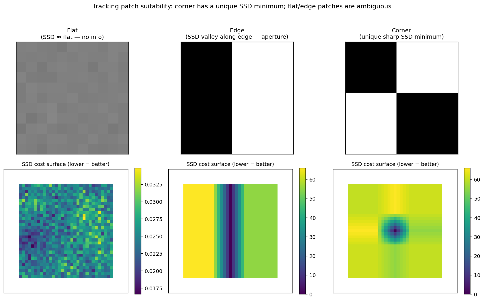

## Which Image Patches Are Suitable for Tracking? Why? Which Patches Are Not Suitable?

The KLT tracker estimates the parameters of a geometric transformation – most commonly a 2D translation – that best align a template patch $T$ with an input image $I$. The estimation is performed by iteratively solving a linearised least‑squares problem. As derived in the earlier section on patch selection for horizontal motion, the stability and uniqueness of the solution depend entirely on the **structure tensor**

$$
\mathbf{H} = \sum_{\mathbf{x}\in\text{ROI}} \nabla I(\mathbf{x})\;\nabla I(\mathbf{x})^\top
= \begin{bmatrix}
\sum I_x^2 & \sum I_x I_y \\[2pt]
\sum I_x I_y & \sum I_y^2
\end{bmatrix},
$$

which aggregates the image gradients inside the region of interest (ROI). The parameter update requires solving $\mathbf{H}\,\Delta\mathbf{p}^* = \mathbf{b}$, so $\mathbf{H}$ must be **invertible and well‑conditioned**. This mathematical requirement directly translates into the visual properties that a patch must – and must not – possess.

### 1. Suitable Patches: Corners and Textured Regions

A patch is suitable for KLT tracking if it produces a structure tensor with **two large, well‑separated eigenvalues**. This condition is met by image regions that contain **intensity variations in at least two significantly different directions** – in practice, corners, junctions, or richly textured areas.

- **Corners** (e.g., an L‑shaped corner, a checkerboard intersection, a window corner) generate strong gradients in both the horizontal and vertical directions. Consequently, both $\sum I_x^2$ and $\sum I_y^2$ are large, and the off‑diagonal term $\sum I_x I_y$ is non‑zero, ensuring that $\mathbf{H}$ is far from singular. The two large eigenvalues mean that the displacement can be recovered accurately in any direction.
- **Textured regions** (e.g., wood grain, gravel, fabric patterns) contain gradients at many orientations. Even if no single dominant corner exists, the aggregate gradient distribution yields a well‑conditioned $\mathbf{H}$.

In addition to the structural requirement, a suitable patch must have **high contrast**. If the intensity variations are small, the gradient magnitudes will be comparable to sensor noise, and the structure tensor will be dominated by noise rather than by the underlying image signal. This leads to an ill‑conditioned or even singular $\mathbf{H}$ in practice, causing the tracker to drift or fail.

Finally, the patch must be **spatially localised** enough that the first‑order Taylor approximation of the image intensity holds over the expected range of displacements. In the standard KLT framework, this is satisfied by patches of moderate size (typically $15\times 15$ to $31\times 31$ pixels) that do not contain large perspective distortions or non‑rigid deformations. The multi‑resolution extension of KLT relaxes the small‑displacement requirement by first tracking on a coarse scale, but the fundamental need for a corner‑like structure remains unchanged.

### 2. Unsuitable Patches: Flat Regions and Edges

Patches that lead to a singular or extremely ill‑conditioned $\mathbf{H}$ are unsuitable for tracking. There are two classic failure cases, both manifestations of the **aperture problem**.

#### Flat Regions

A completely uniform patch (e.g., a clear sky, a blank wall) has $\nabla I \approx \mathbf{0}$ everywhere. The structure tensor is the zero matrix, with both eigenvalues equal to zero. No displacement information can be extracted, and the tracker has no ability to lock onto the patch. Even a small amount of noise cannot provide a reliable gradient direction.

#### Edges (Straight Lines)

An ideal step edge – for instance, a vertical edge where intensity changes only in the $x$‑direction – produces gradients that are all parallel. The structure tensor becomes

$$
\mathbf{H} = \begin{bmatrix} \sum I_x^2 & 0 \\ 0 & 0 \end{bmatrix},
$$

which has one large eigenvalue and one zero eigenvalue. The component of motion **parallel** to the edge (vertical motion for a vertical edge) causes no change in the image appearance and is therefore unobservable. The normal equations are singular, and the tracker cannot determine the full 2D displacement. In practice, the tracker may estimate a displacement only in the direction perpendicular to the edge, leading to drift along the edge direction. This is the aperture problem: through a small aperture, a moving edge appears ambiguous.

Even if the true motion is constrained (e.g., purely horizontal for a vertical edge), the standard KLT tracker solves for a full 2D translation and requires an invertible $\mathbf{H}$. Therefore, a pure edge is **not suitable** unless the motion model is explicitly reduced to 1D – which is not the case in the general KLT formulation.

#### Periodic Patterns

Although not as catastrophic as a flat region or a single edge, highly periodic textures (e.g., a checkerboard with a period smaller than the expected displacement) can also cause problems. The SSD cost function may have multiple local minima, and the tracker can converge to an incorrect, aliased displacement. While the structure tensor may be well‑conditioned, the lack of a unique global minimum makes such patches unreliable for tracking without additional constraints.

The figure makes the structure-tensor argument concrete by computing the actual SSD landscape for each kind of patch. The top row shows three test patches (flat / vertical edge / L-corner); the bottom row shows the corresponding SSD cost surface obtained by sliding the patch over a larger version of the same structure. The flat patch produces a nearly constant SSD — no minimum to lock onto. The edge patch produces a long valley along the edge direction (the aperture problem) — minimisation can jump anywhere along the valley. Only the corner produces a single sharp, isolated SSD minimum, which is what KLT's Gauss–Newton iterations need to converge reliably.

### 3. Summary of Patch Suitability

| Suitable | Not Suitable |
|----------|--------------|
| Corners (L‑junctions, T‑junctions, crossings) | Flat regions (no texture) |
| Rich, high‑contrast texture with multiple orientations | Straight edges (aperture problem) |
| Patches with gradients in at least two distinct directions | Periodic patterns (multiple minima) |
| Sufficient contrast to overcome sensor noise | Low‑contrast patches (noise‑dominated) |

In essence, the KLT tracker requires a patch that acts as a **2D landmark**: it must constrain the motion in both the $x$ and $y$ directions simultaneously. This is exactly the same requirement that the Harris corner detector formalises, and it is why the KLT tracker is often described as a “corner tracker.” The multi‑resolution pyramid extends the capture range but does not alter the fundamental need for a well‑conditioned structure tensor.

---

### Self-Test

1. The KLT tracker is often called a "corner tracker," yet it can also work on richly textured patches with no visible corner. Why does texture without a corner still produce a well-conditioned $\mathbf{H}$, and what is the common underlying geometric property shared with corners?
2. A straight edge has one large eigenvalue and one near-zero eigenvalue in $\mathbf{H}$. How would the tracker's estimated displacement behave over time if applied to such a patch, and why is this a problem even when the true scene motion is small?
3. If you increase the patch size used to compute $\mathbf{H}$, under what conditions does this improve tracking robustness, and when could it actually hurt performance?
4. A periodic checkerboard pattern may have a well-conditioned $\mathbf{H}$, yet still fail as a tracking patch. How does this failure mode differ fundamentally from the aperture problem seen with straight edges?

### Answer Key

1. A richly textured patch accumulates gradients at many orientations across its ROI, so even without a single sharp corner the aggregate structure tensor $\mathbf{H}$ ends up with two large eigenvalues. The shared geometric property is that intensity varies significantly in at least two linearly independent directions — corners achieve this locally at a single point, while texture achieves it collectively across the patch.

2. The near-zero eigenvalue means the normal equations are singular (or nearly so) along the edge direction, so the tracker cannot recover the displacement component parallel to the edge. Over time the estimated position drifts along the edge even if the true motion is small or zero, because any residual noise or slight appearance change is attributed to motion along the unconstrained direction — this is the aperture problem causing unbounded drift.

3. A larger patch averages gradients over more pixels, reducing noise and making $\mathbf{H}$ better conditioned in regions with sparse texture — improving robustness there. However, a larger patch is more likely to straddle multiple moving objects or regions with strong perspective distortion, violating the first-order Taylor approximation that KLT relies on, which can degrade or destabilise tracking.

4. With a periodic pattern, $\mathbf{H}$ is well-conditioned — gradients exist in two directions — so the aperture problem (a rank-deficient $\mathbf{H}$) does not arise. The failure instead comes from the SSD cost surface having multiple equally valid local minima separated by the pattern period; the iterative solver may converge to a wrong minimum, producing an aliased displacement. In contrast, the aperture problem is a structural ambiguity in $\mathbf{H}$ itself, whereas the periodic-pattern failure is a global non-uniqueness of the cost function that a well-conditioned local solve cannot detect.