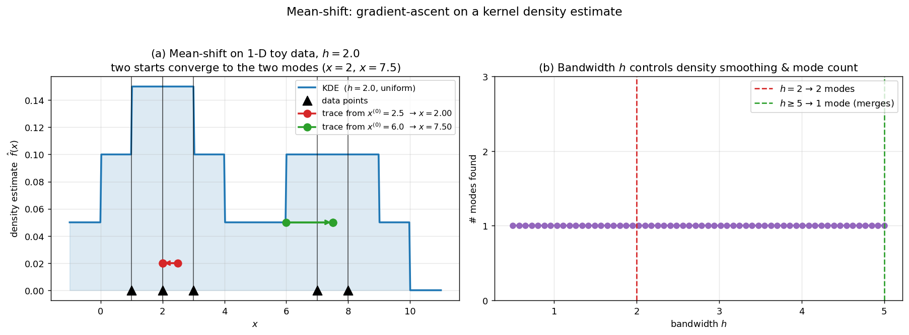

## Mean-Shift Algorithm: Principles and 1D Example

The mean-shift algorithm is a versatile non‑parametric technique for locating the modes (local maxima) of a density function given only discrete samples from that density. In computer vision, it has been applied to clustering, image segmentation, and – most notably for this course – real‑time visual object tracking. Unlike the KLT tracker, which aligns a template by minimising the sum of squared differences, or correlation filter trackers, which learn a discriminative classifier, the mean‑shift tracker is a **generative** method that seeks the region of an image whose appearance (typically encoded by a colour histogram) best matches a target model. The core of the tracker is the mean‑shift procedure itself, which iteratively shifts a window towards the nearest mode of a similarity surface. This section explains the underlying principles of mean‑shift and walks through a concrete 1D calculation.

### 1. Kernel Density Estimation and the Mean‑Shift Vector

Mean‑shift is rooted in **kernel density estimation (KDE)**. Given a set of $n$ data points $\{\mathbf{x}_i\}_{i=1}^n$ in a $d$‑dimensional space, the density at any point $\mathbf{x}$ can be estimated by placing a kernel $K(\mathbf{x})$ on each data point and summing their contributions:

$$
\hat{f}(\mathbf{x}) = \frac{1}{n h^d} \sum_{i=1}^{n} K\!\left(\frac{\mathbf{x} - \mathbf{x}_i}{h}\right),
$$

where $h$ is the **bandwidth** (smoothing parameter) and $K(\mathbf{x})$ is a radially symmetric kernel, often the Epanechnikov or Gaussian kernel. The goal of mean‑shift is to find the modes of $\hat{f}(\mathbf{x})$ without explicitly evaluating the density everywhere.

To do this, we consider the **gradient** of the density estimate. For a kernel that is a function of the squared distance, $K(\mathbf{x}) = k(\|\mathbf{x}\|^2)$, the gradient can be written as

$$
\nabla \hat{f}(\mathbf{x}) = \frac{2}{n h^{d+2}} \sum_{i=1}^{n} (\mathbf{x}_i - \mathbf{x})\, k'\!\left(\left\|\frac{\mathbf{x} - \mathbf{x}_i}{h}\right\|^2\right).
$$

Let $g(r) = -k'(r)$. Then $g$ defines a new kernel $G(\mathbf{x}) = g(\|\mathbf{x}\|^2)$. Substituting and rearranging yields

$$
\nabla \hat{f}(\mathbf{x}) = \frac{2}{n h^{d+2}} \left[ \sum_{i=1}^{n} g\!\left(\left\|\frac{\mathbf{x} - \mathbf{x}_i}{h}\right\|^2\right) \right] \left[ \frac{\sum_{i=1}^{n} \mathbf{x}_i\, g\!\left(\left\|\frac{\mathbf{x} - \mathbf{x}_i}{h}\right\|^2\right)}{\sum_{i=1}^{n} g\!\left(\left\|\frac{\mathbf{x} - \mathbf{x}_i}{h}\right\|^2\right)} - \mathbf{x} \right].
$$

The first bracket is proportional to the density estimate using kernel $G$. The second bracket is the **mean‑shift vector**:

$$
\mathbf{m}_G(\mathbf{x}) = \frac{\sum_{i=1}^{n} \mathbf{x}_i\, g\!\left(\left\|\frac{\mathbf{x} - \mathbf{x}_i}{h}\right\|^2\right)}{\sum_{i=1}^{n} g\!\left(\left\|\frac{\mathbf{x} - \mathbf{x}_i}{h}\right\|^2\right)} - \mathbf{x}.
$$

This vector points from the current location $\mathbf{x}$ towards the **weighted mean** of the data points within the kernel’s support. Crucially, it is proportional to the normalised gradient of the density estimate:

$$
\mathbf{m}_G(\mathbf{x}) \propto \frac{\nabla \hat{f}(\mathbf{x})}{\hat{f}_G(\mathbf{x})},
$$

so moving along $\mathbf{m}_G(\mathbf{x})$ is equivalent to performing **gradient ascent** on the density with an adaptive step size. The mean‑shift procedure simply sets $\mathbf{x} \leftarrow \mathbf{x} + \mathbf{m}_G(\mathbf{x})$ and repeats until convergence, i.e., until the shift is smaller than a threshold.

### 2. The Mean‑Shift Algorithm Step by Step

For a given set of data points and a starting location $\mathbf{x}^{(0)}$:

1. **Choose a kernel** $G$ and a bandwidth $h$. A common choice is the uniform kernel (a flat window) or the Gaussian kernel.
2. **Compute the weighted mean** of all data points that fall within distance $h$ from the current location $\mathbf{x}^{(t)}$:

   $$
   \boldsymbol{\mu}^{(t)} = \frac{\sum_{i=1}^{n} \mathbf{x}_i\, g\!\left(\left\|\frac{\mathbf{x}^{(t)} - \mathbf{x}_i}{h}\right\|^2\right)}{\sum_{i=1}^{n} g\!\left(\left\|\frac{\mathbf{x}^{(t)} - \mathbf{x}_i}{h}\right\|^2\right)}.
   $$

3. **Shift** the window centre to the new location: $\mathbf{x}^{(t+1)} = \boldsymbol{\mu}^{(t)}$.
4. **Repeat** steps 2–3 until $\|\mathbf{x}^{(t+1)} - \mathbf{x}^{(t)}\| < \varepsilon$.

The algorithm is guaranteed to converge to a point where the gradient of the density estimate is zero (a mode), provided the kernel $G$ is non‑negative and non‑increasing. In practice, convergence is fast, often within a handful of iterations.

### 3. Simulated 1D Calculation

To make the procedure concrete, consider a 1D dataset consisting of five points: $\{x_i\} = \{1.0,\; 2.0,\; 3.0,\; 7.0,\; 8.0\}$. We will use a **uniform kernel** with bandwidth $h = 2.0$, i.e., the window is an interval of radius $2$ around the current centre. The kernel weight $g(r)$ is $1$ if $|r| \le 1$ (i.e., distance $\le h$) and $0$ otherwise. The weighted mean reduces to the ordinary arithmetic mean of all points inside the window.

Let the starting location be $x^{(0)} = 2.5$.

#### Iteration 1

- Current centre: $x = 2.5$.
- Window: $[2.5 - 2.0,\; 2.5 + 2.0] = [0.5,\; 4.5]$.
- Points inside: $1.0,\; 2.0,\; 3.0$ (points $7.0$ and $8.0$ are outside).
- Mean of inside points: $\mu = \frac{1.0 + 2.0 + 3.0}{3} = 2.0$.
- New centre: $x^{(1)} = 2.0$.

#### Iteration 2

- Current centre: $x = 2.0$.
- Window: $[0.0,\; 4.0]$.
- Points inside: $1.0,\; 2.0,\; 3.0$ (same three).
- Mean: $\mu = 2.0$.
- Shift is zero $\Rightarrow$ converged.

The algorithm has converged to $x = 2.0$, which is the mode of the local cluster $\{1,2,3\}$.

Now start from a different initial point, $x^{(0)} = 6.0$.

#### Iteration 1

- Window: $[4.0,\; 8.0]$.
- Points inside: $7.0,\; 8.0$ (and possibly $3.0$? $3.0$ is at distance $3.0 > 2.0$, so no).
- Mean: $\mu = \frac{7.0 + 8.0}{2} = 7.5$.
- New centre: $x^{(1)} = 7.5$.

#### Iteration 2

- Window: $[5.5,\; 9.5]$.
- Points inside: $7.0,\; 8.0$.
- Mean: $7.5$ again $\Rightarrow$ converged to $7.5$, the centre of the second cluster.

This simple example illustrates how mean‑shift climbs the density gradient to find the nearest mode. The bandwidth $h$ controls the scale of the analysis: a larger $h$ would merge the two clusters into one, while a smaller $h$ might create a separate mode for each point.

The figure visualises the iteration trace and the bandwidth effect. Panel (a) shows the kernel-density estimate of the five points with $h=2$ as the blue curve, with the data points as black triangles. Two starting positions ($x^{(0)}=2.5$ and $x^{(0)}=6.0$) launch trajectories that walk uphill on the density and converge to the two modes ($x=2$ and $x=7.5$) respectively — each arrow shows the first iteration's shift. Panel (b) plots the number of modes found as $h$ varies: with the small-$h$ regime the two clusters are resolved separately, while for $h \gtrsim 5$ the kernel windows are wide enough that both clusters merge into a single mode — illustrating the bandwidth–scale trade-off that controls how mean-shift "sees" the density.

### 4. Mean‑Shift in Visual Object Tracking

In tracking, the “data points” are not raw pixel coordinates but the pixels of an image, weighted by how well their appearance matches a target model. The classic mean‑shift tracker (Comaniciu et al., 2003) represents the target by a colour histogram (e.g., in RGB or HSV space) and the candidate region by another histogram. The similarity between the target model $\hat{\mathbf{q}}$ and the candidate $\hat{\mathbf{p}}(\mathbf{y})$ at location $\mathbf{y}$ is measured by the **Bhattacharyya coefficient**:

$$
\rho[\hat{\mathbf{p}}(\mathbf{y}), \hat{\mathbf{q}}] = \sum_{u=1}^{m} \sqrt{\hat{p}_u(\mathbf{y})\,\hat{q}_u}.
$$

Maximising this coefficient is equivalent to finding the mode of a density constructed from the pixel locations, where each pixel $i$ is weighted by

$$
w_i = \sum_{u=1}^{m} \sqrt{\frac{\hat{q}_u}{\hat{p}_u(\hat{\mathbf{y}}_0)}}\; \delta[b(\mathbf{x}_i) - u],
$$

with $b(\mathbf{x}_i)$ the bin index of the pixel’s colour and $\hat{\mathbf{y}}_0$ the current location. The mean‑shift vector computed with these weights points towards the region where the candidate histogram better matches the target model. The tracker iteratively shifts the window, recomputes the histogram and weights, and converges to the local maximum of the similarity surface. This is exactly the same mean‑shift procedure, but applied to a **weighted back‑projection image** rather than raw spatial coordinates.

The mean‑shift tracker is computationally efficient, requires no offline training, and can handle non‑rigid objects and partial occlusions. However, it assumes that the target’s colour distribution remains relatively stable and that the target does not undergo large displacements between frames (the basin of attraction is limited by the kernel bandwidth). These limitations motivated the development of more robust trackers, including the correlation filter methods discussed earlier.

### 5. Summary

- **Principle:** Mean‑shift is a gradient‑ascent method on a kernel density estimate. It iteratively moves a window to the weighted mean of the data points within it, converging to a local mode.
- **Key components:** A kernel $G$ (often uniform or Gaussian), a bandwidth $h$, and a set of data points (or weighted pixels).
- **1D behaviour:** Starting from an initial guess, the window centre shifts towards the nearest cluster centre. The bandwidth determines the scale at which modes are resolved.
- **Tracking application:** The same iterative procedure is applied to a similarity surface derived from colour histograms, enabling real‑time, non‑parametric object localisation.

The mean‑shift algorithm’s elegance lies in its simplicity: it requires no parametric model of the density, no learning phase, and only a handful of iterations per frame. Its limitations – sensitivity to bandwidth selection, inability to handle rapid motion, and reliance on colour – have been addressed by later methods, but it remains a foundational technique in computer vision.

---

### Self-Test

1. Why is the mean-shift vector $\mathbf{m}_G(\mathbf{x})$ proportional to the gradient of the density estimate, and what does this guarantee about the direction each iteration moves?
2. In the 1D example with bandwidth $h = 2.0$, the two clusters $\{1,2,3\}$ and $\{7,8\}$ are found as separate modes. If you increase the bandwidth to $h = 5.0$, what would you expect to happen to the number of modes, and why?
3. The mean-shift tracker uses pixel weights $w_i$ derived from the Bhattacharyya coefficient rather than uniform weights. How does this weighting change the behaviour of the shifting window compared to a plain spatial mean-shift on pixel coordinates?
4. Under what conditions would the mean-shift tracker fail to relocate a target that has moved significantly between two consecutive frames, and how does this failure relate to the choice of kernel bandwidth $h$?

### Answer Key

1. As derived in Section 1, $\mathbf{m}_G(\mathbf{x}) \propto \nabla \hat{f}(\mathbf{x}) / \hat{f}_G(\mathbf{x})$, so the mean-shift vector is a rescaled version of the density gradient at the current location. This guarantees that each iteration moves the window strictly uphill on the density surface (in the direction of increasing $\hat{f}$), and the process terminates only at a stationary point — a local mode — where the gradient (and thus the shift) is zero.

2. With $h = 5.0$, the window centred anywhere between the two clusters would reach both $\{1,2,3\}$ and $\{7,8\}$, causing their contributions to blend into a single weighted mean somewhere in between. The two separate modes would likely merge into one, because the larger bandwidth smooths the density estimate over a wider region, obscuring fine-scale cluster structure. As noted in Section 3, "a larger $h$ would merge the two clusters into one."

3. Uniform spatial mean-shift treats all pixels equally and simply finds the centroid of the window, regardless of appearance. By contrast, the tracker weights each pixel $w_i$ according to how well its colour bin matches the target histogram (via the Bhattacharyya-derived term $\sqrt{\hat{q}_u / \hat{p}_u}$), so pixels with colours that are rare in the candidate but common in the target pull the window more strongly. This steers the shift towards image regions whose colour distribution resembles the target model rather than towards a geometric centre.

4. The mean-shift tracker converges to the nearest local maximum of the similarity surface within the kernel's basin of attraction, whose radius is roughly proportional to $h$. If the target moves by more than $\sim h$ pixels between frames, the initial window position may lie outside the basin of attraction of the correct mode and will instead converge to a nearby spurious mode or background region. Increasing $h$ widens the basin but also reduces localisation precision and blends more background into the histogram, so there is a fundamental trade-off between robustness to large displacements and accuracy.