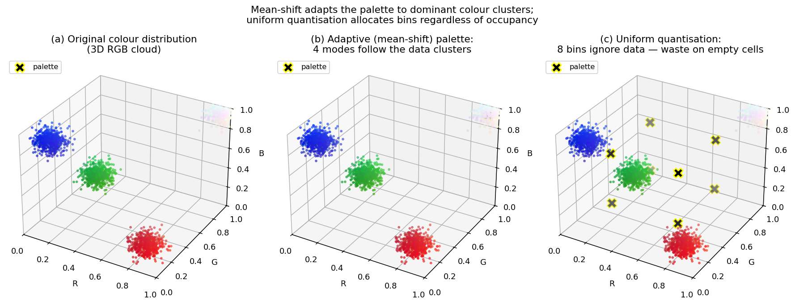

> **Source question (Q34):** Mean-shift algorithm. Color pixels [R,G,B] represented in 3D space. How can you reduce the color-space into 256 color-space?

## Reducing the 3D RGB Colour Space to 256 Colours with Mean‑Shift

The mean‑shift algorithm, introduced in the previous section as a mode‑seeking procedure on a kernel density estimate, can be applied directly to the **colour distribution** of an image. In a typical 24‑bit RGB image, each pixel is a point in a 3‑dimensional space $\mathbf{x}_i = (R_i, G_i, B_i)^\top$, yielding up to $256^3 \approx 16.7$ million possible colours. Many computer vision tasks – including the mean‑shift tracker’s histogram representation – benefit from a drastically reduced colour palette, often to just 256 distinct colours. This section explains how the mean‑shift algorithm itself can be used to perform such **colour space reduction** (colour quantization) by clustering the 3D colour points.

### 1. Mean‑Shift Clustering in the Colour Domain

The core idea is to treat the set of all pixel colours in an image (or a video frame) as independent samples drawn from an unknown probability density function in $\mathbb{R}^3$. The mean‑shift procedure can then locate the **modes** (local maxima) of this density. Each mode corresponds to a representative colour that summarises a cluster of similar colours.

The procedure for colour space reduction is as follows:

1. **Collect colour samples:** Take every pixel’s $[R,G,B]$ value as a 3‑D data point. To keep the computation tractable, one may work with a random subset or with the full set of pixels.
2. **Choose a kernel and bandwidth:** A common choice is a radially symmetric kernel (e.g., a Gaussian or an Epanechnikov kernel) with a single bandwidth parameter $h$ that defines the radius of influence in colour space. The bandwidth controls the coarseness of the quantization: a larger $h$ merges more colours, yielding fewer clusters.
3. **Run mean‑shift on each point:** For each colour point $\mathbf{x}$, initialise $\mathbf{y}^{(0)} = \mathbf{x}$ and iterate
   $$
   \mathbf{y}^{(t+1)} = \frac{\sum_{i=1}^{n} \mathbf{x}_i\, g\!\left(\left\|\frac{\mathbf{y}^{(t)} - \mathbf{x}_i}{h}\right\|^2\right)}{\sum_{i=1}^{n} g\!\left(\left\|\frac{\mathbf{y}^{(t)} - \mathbf{x}_i}{h}\right\|^2\right)},
   $$
   until convergence. The point of convergence $\mathbf{y}_{\text{mode}}$ is the mode associated with $\mathbf{x}$.
4. **Group points by mode:** All colour points that converge to the same mode (within a small tolerance) form a cluster. The number of distinct modes is the number of colours in the reduced palette.
5. **Replace pixel colours:** Each pixel’s original colour is replaced by the colour of its mode (the cluster centre). The image now contains only as many distinct colours as there are modes.

This process is known as **mean‑shift filtering** when applied to every pixel of an image, and it simultaneously reduces the colour space while preserving edges in the spatial domain when the spatial coordinates are also included (see Comaniciu & Meer, 2002). For pure colour space reduction, only the 3‑D colour coordinates are used.

### 2. Achieving Exactly 256 Colours

The number of modes found by mean‑shift is not directly specified by the user; it emerges from the data and the chosen bandwidth $h$. To obtain a palette of **exactly 256 colours**, one can employ one of the following strategies:

- **Bandwidth tuning:** Run the mean‑shift clustering several times with different values of $h$ until the number of distinct modes is as close as possible to 256. Because the number of modes is a non‑increasing function of $h$, a simple binary search over $h$ quickly finds a suitable bandwidth.
- **Post‑clustering merging:** Choose a bandwidth that yields slightly more than 256 modes, then hierarchically merge the closest modes (e.g., by Euclidean distance in RGB space) until exactly 256 remain. This guarantees an exact count while keeping the mean‑shift step efficient.
- **Uniform quantization followed by mean‑shift:** First reduce the colour space to a larger but manageable number of bins (e.g., $32\times32\times32 = 32\,768$) by uniform quantization, then run mean‑shift on the bin centres weighted by their pixel counts. This accelerates the computation and still yields a data‑driven palette.

In the context of the **mean‑shift tracker**, the colour histogram is typically built by a fixed uniform quantization (for example, $8\times8\times4 = 256$ bins by using 8 bins for R, 8 for G, and 4 for B). This is a simpler, non‑adaptive reduction that guarantees exactly 256 bins and is computationally trivial. However, the question explicitly asks how to reduce the colour space *using the mean‑shift algorithm*, so the adaptive clustering approach described above is the intended answer.

The figure shows the comparison in 3-D RGB space on a synthetic image with four dominant colour clusters. Panel (a) is the raw colour cloud; panels (b) and (c) overlay the resulting palette as black X markers. The adaptive mean-shift palette (b) places centres directly inside the data clusters, so each palette entry summarises many pixels accurately. The uniform $2\times2\times2$ palette (c) spaces 8 centres on a fixed grid regardless of occupancy — several centres land in empty regions of RGB space, wasting representational capacity, while a single coarse cell may have to represent a large data cluster.

### 3. Summary

- The mean‑shift algorithm can be applied to the 3‑D $[R,G,B]$ colour points of an image to find the modes of the colour density.
- Each mode becomes a representative colour; replacing every pixel’s colour with its mode reduces the colour space to the number of modes found.
- The bandwidth $h$ controls the number of modes. By tuning $h$ or by post‑processing, one can obtain a palette of exactly 256 colours.
- This adaptive quantization preserves the dominant colours of the image and is a natural extension of the mean‑shift procedure from the spatial domain to the colour domain.

---

### Self-Test

1. If you increase the bandwidth $h$ significantly, what happens to the number of modes found, and why does this make intuitive sense in terms of the underlying density estimate?
2. Mean-shift colour quantization and uniform quantization (e.g., $8\times8\times4$ bins) both yield 256 colours — in what types of images would mean-shift produce a noticeably better result, and when might it offer little advantage?
3. Mean-shift is guaranteed to converge to a mode, but not to the *global* mode. How could this property cause problems when the goal is to reduce an image to exactly 256 representative colours?
4. If the spatial coordinates $(x, y)$ of each pixel are concatenated with its colour $(R, G, B)$ before running mean-shift, how does this change what the algorithm segments compared to operating on colour alone?

### Answer Key

1. Increasing $h$ broadens each kernel's radius of influence, causing more colour points to be pulled toward the same weighted mean and merging what were previously distinct modes. Intuitively, a larger bandwidth smooths the estimated density more aggressively, flattening smaller peaks so that only the tallest, most widely separated colour clusters survive as modes. The number of modes therefore decreases monotonically as $h$ grows, until in the extreme all points collapse to a single mode.

2. Mean-shift adapts the palette to the actual colour distribution, so it performs noticeably better in images that have a small number of dominant, well-separated colour clusters (e.g., portraits, logos, or synthetically generated scenes) where the palette should concentrate bins around those clusters rather than wasting them on empty regions of colour space. Uniform quantization ($8\times8\times4$) allocates bins evenly regardless of occupancy, so it wastes representational capacity on rare or absent colours. In natural photographs with broadly and smoothly distributed colours, both methods perform similarly because neither has a strong cluster structure to exploit.

3. Because mean-shift converges to a *local* mode, two colour points that are close together in the colour space may converge to different nearby local maxima, fragmenting what should be a single cluster into multiple modes. This can produce more than the desired 256 modes even for a bandwidth that would yield fewer modes if the density were smoother, requiring additional post-processing (merging or re-running with a larger $h$) to hit exactly 256. In the worst case, many tiny spurious modes arise from noise or near-duplicate colours, inflating the palette count unpredictably.

4. Concatenating spatial coordinates $(x, y)$ with colour $(R, G, B)$ turns each data point into a 5-D vector, so mean-shift now seeks modes in a joint spatial-colour density. The algorithm then groups pixels that are both spatially close *and* colour-similar, effectively performing **image segmentation** into compact, homogeneous regions rather than pure colour clustering. This is the basis of the Comaniciu & Meer (2002) mean-shift filtering approach mentioned in the text: edges are preserved because spatially separated regions with coincidentally similar colours are no longer merged, but the result depends on the relative scaling of spatial versus colour bandwidths.