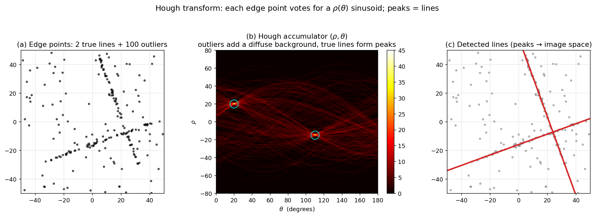

> **Source question (Q37):** Describe the Hough transformation algorithm for detection of parametrized structure (line, circle, …). Discuss the properties of the algorithm (time and memory requirements, parameters).

## The Hough Transform for Detecting Parametrized Structures

The Hough transform is a classical computer vision technique for detecting instances of parametric shapes – lines, circles, ellipses, and more – in images. Unlike the RANSAC algorithm discussed earlier, which relies on random sampling and hypothesis verification, the Hough transform is a **voting‑based** method that maps each image feature (typically an edge point) into a parameter space. Peaks in this parameter space correspond to the parameters of the shape instances present in the image. This section describes the algorithm, its common parametrizations, and its computational properties.

### 1. Core Idea: From Image Space to Parameter Space

Consider a shape defined by a parameter vector $\boldsymbol{\theta}$. For a line, $\boldsymbol{\theta}$ might be the slope and intercept; for a circle, the centre coordinates and radius. A single image point $(x,y)$ that lies on the shape constrains the possible parameters. If we treat $(x,y)$ as fixed and allow $\boldsymbol{\theta}$ to vary, the set of all parameters consistent with that point forms a **curve or surface** in the parameter space. When many image points belong to the same shape instance, their corresponding curves in parameter space will intersect at a common point – the true parameter vector of that shape. The Hough transform implements this idea by discretizing the parameter space into an **accumulator array** and letting each image point “vote” for all parameter combinations that could have generated it. The accumulator cells with the highest vote counts indicate the detected shapes.

### 2. Line Detection

#### 2.1 Slope‑Intercept Parametrization and Its Problem

A straight line can be written as $y = a x + b$, with parameters $(a,b)$. An edge point $(x_i, y_i)$ votes for all lines passing through it, i.e., all $(a,b)$ satisfying $b = -x_i a + y_i$. In the $(a,b)$ parameter space, this is a straight line. The intersection of many such lines gives the $(a,b)$ of the image line.

The difficulty is that the slope $a$ is unbounded (vertical lines have $a \to \infty$), making the parameter space infinite. Therefore, the **polar (normal) parametrization** is universally preferred.

#### 2.2 Polar Parametrization

A line is represented by two parameters: the perpendicular distance from the origin $\rho \in \mathbb{R}$ and the angle of the normal $\theta \in [0, \pi)$:

$$
\rho = x \cos\theta + y \sin\theta.
$$

An image point $(x_i, y_i)$ now votes for a **sinusoidal curve** in the $(\rho,\theta)$ space:

$$
\rho(\theta) = x_i \cos\theta + y_i \sin\theta.
$$

The accumulator is a 2D array quantizing $\rho$ and $\theta$. For each edge point, the algorithm steps through all $\theta$ values, computes the corresponding $\rho$, and increments the appropriate accumulator cell. After processing all edge points, local maxima in the accumulator correspond to lines in the image.

The figure shows the complete pipeline on synthetic data with two true lines plus 100 outlier edge points. Panel (a) plots the raw edge map; the two lines are visible but heavily contaminated. Panel (b) is the $(\rho, \theta)$ accumulator: the outliers produce a diffuse background of low-value cells, while the two true lines each generate a sharp bright peak — exactly what the voting mechanism is designed to produce. Panel (c) overlays the lines reconstructed from the two highest peaks back on the edge map; both true lines are recovered despite the outliers. This robustness to outliers is the Hough transform's headline property: noise spreads across the accumulator while signal concentrates.

### 3. Circle Detection

A circle is parametrized by its centre $(a,b)$ and radius $r$. An edge point $(x_i, y_i)$ with known gradient direction can vote in different ways:

- **Fixed radius:** If $r$ is known, each point votes for a circle of radius $r$ in the $(a,b)$ plane. The centre is constrained to lie on a circle of radius $r$ around $(x_i, y_i)$, so the voting pattern is a circle in the accumulator. This is a 2D accumulator.
- **Unknown radius:** The parameter space becomes 3D: $(a,b,r)$. Each edge point votes for a **cone** in this 3D space (all centres and radii that could produce a circle passing through the point). The accumulator is 3D, and peaks indicate both centre and radius.

If the edge orientation $\phi$ is available, the centre is constrained to lie along the line in the direction of the gradient, reducing the voting to a line (or a 2D surface in the 3D case) and significantly lowering the computational cost.

### 4. Generalized Hough Transform

For arbitrary shapes that cannot be expressed with a simple parametric equation, the **Generalized Hough Transform** (GHT) uses a lookup table (the *R‑table*) that encodes the shape’s boundary relative to a reference point. For each edge point with a given orientation, the table provides a set of displacement vectors to the reference point. The accumulator then stores votes for the reference point location (and possibly scale and rotation). This extends the Hough framework to any shape defined by a template.

### 5. Algorithm Summary

1. **Edge detection:** Extract edge points (and optionally gradient directions) from the image using an edge detector (e.g., Canny).
2. **Accumulator initialization:** Discretize the parameter space into bins of size $\Delta\theta_1 \times \Delta\theta_2 \times \dots$ and set all counts to zero.
3. **Voting:** For each edge point $(x,y)$:
   - For each discrete value of the free parameter(s) (e.g., $\theta$ for lines), compute the remaining parameter(s) (e.g., $\rho$) using the shape equation.
   - Increment the accumulator cell corresponding to the computed parameter vector.
4. **Peak detection:** Find local maxima in the accumulator that exceed a predefined threshold. These maxima give the parameters of the detected shape instances.
5. **Post‑processing:** Optionally, refine the parameters by fitting the shape to the inlier edge points, and remove duplicate detections.

### 6. Properties of the Algorithm

#### 6.1 Time Complexity

The time complexity depends on:
- $N$: the number of edge points.
- $D$: the dimensionality of the parameter space (the number of free parameters).
- $Q$: the number of quantization steps along each dimension that must be iterated during voting.

For line detection with the polar parametrization, the algorithm loops over $N$ points and $K_\theta$ discrete angles, computing $\rho$ and incrementing the accumulator. The complexity is $\mathcal{O}(N \cdot K_\theta)$. For a circle with unknown radius, it becomes $\mathcal{O}(N \cdot K_a \cdot K_b \cdot K_r)$ if no gradient information is used, or $\mathcal{O}(N \cdot K_r)$ if gradient direction reduces the centre search to a line. In general, the time grows **exponentially with the number of free parameters** unless constraints (like edge orientation) are exploited. This is the primary limitation of the basic Hough transform for high‑dimensional shapes.

#### 6.2 Memory Requirements

The accumulator array size is the product of the quantization steps along each parameter dimension. For a line detector with $K_\theta = 180$ and $K_\rho$ equal to the diagonal of the image (e.g., 1000), the accumulator requires $180 \times 1000$ cells – modest. For a 3D circle accumulator with $100$ steps per dimension, the array has $10^6$ cells, still manageable. However, for more complex shapes (e.g., ellipses with 5 parameters), the memory can become prohibitive. This is often addressed by **coarse‑to‑fine** strategies, **hierarchical** accumulators, or by using the **Randomized Hough Transform**, which samples minimal subsets of points and votes only for the exact parameters computed from the subset, avoiding a full accumulator.

#### 6.3 Parameters

The Hough transform has several critical parameters that influence its performance:

- **Quantization step sizes** ($\Delta\rho$, $\Delta\theta$, etc.): Too coarse a quantization merges distinct shapes; too fine a quantization increases memory and time, and spreads votes so thinly that peaks become difficult to detect. The step size should be chosen based on the expected noise level and the required precision.
- **Peak detection threshold:** Determines the minimum number of votes required to declare a shape instance. A low threshold yields many false positives; a high threshold misses weak instances. It is often set relative to the expected number of edge points on the shape.
- **Edge detection thresholds:** The quality of the input edge map strongly affects the Hough transform. Noisy edges produce spurious votes; missing edges reduce the peak height.
- **Number of edge points $N$:** Using all edge points can be slow. Many implementations subsample edges or use only points with strong gradient magnitude.

#### 6.4 Robustness and Limitations

- **Robustness to noise and occlusions:** Because each edge point votes independently, the Hough transform is highly robust to random noise and partial occlusions. As long as a sufficient fraction of the shape’s boundary points are detected, the corresponding accumulator peak remains strong.
- **Sensitivity to parameter quantization:** The discrete nature of the accumulator means that the true parameters may lie between bins, spreading the peak and reducing the signal‑to‑noise ratio. This is mitigated by smoothing the accumulator or by using soft voting (e.g., casting votes into neighbouring bins with a weighted kernel).
- **Curse of dimensionality:** The basic Hough transform becomes impractical for shapes with more than 3 or 4 parameters due to the exponential growth of the accumulator. Variants such as the **Probabilistic Hough Transform** (which votes using only a random subset of edge points and then verifies line segments) and the **Randomized Hough Transform** (which maps minimal point sets directly to parameter points) are designed to overcome this limitation.
- **Detection of multiple instances:** The accumulator naturally handles multiple instances of the same shape class, as each instance produces its own peak. Care must be taken to suppress the votes of points already assigned to a detected instance to avoid detecting the same shape multiple times.

### 7. Summary

The Hough transform converts the problem of detecting parametric shapes into a peak‑finding problem in a discretized parameter space. It is conceptually simple, robust to noise and occlusion, and naturally handles multiple instances. Its main drawbacks are the computational and memory costs that grow rapidly with the dimensionality of the parameter space, and the need to carefully tune quantization parameters. These limitations have motivated a family of efficient variants (probabilistic, randomized, hierarchical) that retain the voting principle while dramatically reducing resource requirements.

---

### Self-Test

1. The polar parametrization $\rho = x\cos\theta + y\sin\theta$ is preferred over the slope-intercept form $y = ax + b$ for line detection. Why does the slope-intercept form break down, and how does the polar form resolve this?
2. When detecting circles with an unknown radius, knowing the edge gradient direction at each point reduces the complexity from $\mathcal{O}(N \cdot K_a \cdot K_b \cdot K_r)$ to $\mathcal{O}(N \cdot K_r)$. Explain geometrically why gradient direction eliminates the need to search over the centre coordinates $(a, b)$.
3. How does the Hough transform compare to RANSAC in terms of robustness to noise and handling of multiple shape instances — under what scenario would you prefer one over the other?
4. If you make the accumulator quantization step $\Delta\theta$ very fine (small), what happens to peak detectability, and why might a coarser bin actually perform better in the presence of noisy edge points?

### Answer Key

1. The slope-intercept form breaks down because vertical lines have slope $a \to \infty$, making the parameter space unbounded and impossible to discretize finitely. The polar form $\rho = x\cos\theta + y\sin\theta$ resolves this by representing every line — including vertical ones — with the finite, bounded parameters $\rho \in \mathbb{R}$ and $\theta \in [0, \pi)$, keeping the accumulator array well-defined and finite.

2. The gradient at an edge point is perpendicular to the shape boundary, so for a circle it points directly toward the centre. This means the centre $(a, b)$ must lie along the ray from $(x_i, y_i)$ in the gradient direction $\phi$, collapsing the 2D centre search to a 1D line. The algorithm only needs to vote along that ray at each candidate radius $r$, eliminating the independent search over both $a$ and $b$ and reducing complexity to $\mathcal{O}(N \cdot K_r)$.

3. The Hough transform is more robust to noise because each edge point votes independently and spurious points only contribute diffuse background counts that rarely overwhelm a true peak; it also detects multiple instances naturally since each produces a separate peak in the accumulator. RANSAC, by contrast, iteratively fits a single model and is better suited to finding one dominant structure quickly with low computational overhead, making it preferable when only one instance is expected or the parameter space is too high-dimensional for a practical accumulator. In scenes with many overlapping shape instances and heavy noise, the Hough transform is generally preferred; for a single, well-defined structure with many inliers, RANSAC is faster and simpler.

4. A very fine $\Delta\theta$ spreads the votes from edge points that belong to the same true line across many neighbouring bins, since small positional noise in the detected edge shifts $\rho(\theta)$ by a small but bin-crossing amount; the resulting peak becomes shallow and hard to distinguish from background noise. A coarser bin pools votes from slightly mislocated edge points into the same cell, producing a taller, more concentrated peak — at the cost of reduced parameter precision — which is easier to threshold and detect reliably in the presence of noise.