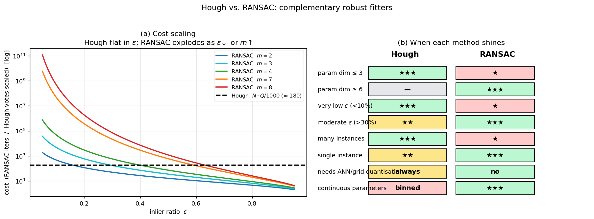

## Comparing the Hough Transform with RANSAC

The Hough transform and RANSAC (RANdom SAmple Consensus) are two foundational paradigms for robust model fitting in the presence of outliers. Both aim to recover the parameters of a geometric model from noisy, cluttered data, but they adopt fundamentally different strategies. The Hough transform, described in detail in the previous section, is a **voting‑based** method that accumulates evidence in a discretized parameter space. RANSAC, introduced by Fischler and Bolles, is a **hypothesize‑and‑test** method that repeatedly draws minimal random samples, instantiates model hypotheses, and verifies them against the full dataset. This section compares the two approaches along the dimensions of algorithmic structure, computational complexity, robustness, handling of multiple instances, and practical applicability, drawing on the RANSAC framework presented in the course slides.

### 1. Core Algorithmic Philosophy

**Hough transform.** Each data point (e.g., an edge pixel) votes for all parameter vectors that could have generated it. The parameter space is discretized into an accumulator array. After all points have voted, local maxima in the accumulator correspond to the model instances present in the data. The method is inherently **global**: every point contributes to the final answer simultaneously, and the detection of multiple instances is a natural by‑product of peak detection.

**RANSAC.** The algorithm iterates the following steps:
1. **Sample** a minimal subset $S$ of $m$ data points (e.g., $m=2$ for a line, $m=4$ for a homography).
2. **Estimate** model parameters $\boldsymbol{\theta} = \theta(S)$ from the sample.
3. **Verify** the hypothesis by evaluating a cost function over all $N$ data points. The standard cost function counts the number of inliers, i.e., points whose distance to the model is below a threshold $\sigma$:
   $$ J(\boldsymbol{\theta}) = \sum_{\mathbf{x} \in \mathcal{X}} f(\mathbf{x}, \boldsymbol{\theta}), \quad
      f(\mathbf{x}, \boldsymbol{\theta}) = \begin{cases} 0 & \text{if } d(\mathbf{x}, \boldsymbol{\theta}) \le \sigma \\ 1 & \text{otherwise.} \end{cases} $$
4. Keep the model with the smallest $J$ (largest support). Terminate when the probability of missing a better solution falls below $1-\eta$, where $\eta$ is the desired confidence. The required number of iterations $k$ is
   $$ k = \frac{\log(1-\eta)}{\log(1-\varepsilon^m)}, $$
   with $\varepsilon$ being the inlier ratio.

RANSAC is a **local** method in the sense that each hypothesis is generated from a tiny subset of the data and then tested globally. It explicitly classifies points as inliers or outliers for each candidate model.

### 2. Parameter Space and Dimensionality

The Hough transform explicitly discretizes the parameter space. Its memory and time complexity grow exponentially with the number of free parameters (the “curse of dimensionality”). For a line (2 parameters) the accumulator is a 2D array; for a circle with unknown radius (3 parameters) it is a 3D array; for more complex models it quickly becomes impractical. Clever parametrizations and the use of gradient direction can reduce the effective dimensionality, but the fundamental limitation remains.

RANSAC does **not** discretize the parameter space. It generates hypotheses directly from minimal samples, so the parameter values are real numbers (subject to numerical precision). The complexity of RANSAC depends on the size of the minimal sample $m$ and the inlier ratio $\varepsilon$, not on the resolution of a parameter grid. This makes RANSAC particularly attractive for high‑dimensional models such as homographies ($m=4$, 8 parameters), fundamental matrices ($m=7$ or $8$), or trifocal tensors, where building an accumulator would be impossible.

### 3. Computational Cost

**Hough transform.** The time complexity is $\mathcal{O}(N \cdot Q)$, where $N$ is the number of data points and $Q$ is the number of parameter bins that a single point can influence. For a line detector with $K_\theta$ angular bins, $Q = K_\theta$; for a circle with gradient direction, $Q = K_r$. The cost is independent of the inlier ratio and scales linearly with the number of points. It can be very fast for low‑dimensional shapes, even when the inlier ratio is extremely low.

**RANSAC.** The time complexity is $\mathcal{O}(k \cdot (t_M + N))$, where $k$ is the number of iterations and $t_M$ is the time to generate a model from a sample. The number of iterations $k$ grows as $\varepsilon^{-m}$ for small $\varepsilon$. Therefore, RANSAC becomes slow when the inlier ratio is low and the minimal sample size $m$ is large. For example, fitting a line ($m=2$) with 10% inliers requires about $k = \log(1-0.99)/\log(1-0.1^2) \approx 460$ iterations (for $\eta=0.99$). Fitting a homography ($m=4$) with 30% inliers requires roughly $k \approx 570$ iterations. The verification step touches all $N$ points, so the total number of point evaluations is $k \cdot N$. Variants such as Randomized RANSAC (R‑RANSAC) and WaldSAC reduce the average verification cost by pre‑verifying on a small subset $d \ll N$ before full evaluation, bringing the effective cost closer to $\mathcal{O}(k \cdot d + \text{good models} \cdot N)$.

In summary, Hough is often faster for low‑dimensional models with many outliers, while RANSAC (especially with optimizations) is the method of choice for high‑dimensional models with a moderate inlier ratio.

### 4. Robustness to Outliers and Noise

Both methods are designed to be robust to outliers, but their failure modes differ.

- **Hough transform:** Outliers cast votes that are distributed quasi‑uniformly across the accumulator, creating a background noise floor. As long as the true model generates a peak above this floor, it can be detected. The method is highly robust to random clutter and partial occlusion. However, the discrete binning can cause peak spreading, and the choice of quantization step is critical: too coarse merges distinct models, too fine weakens the peak. No explicit inlier/outlier threshold is required during voting, but a threshold is needed for peak detection.

- **RANSAC:** The inlier threshold $\sigma$ explicitly separates inliers from outliers. The algorithm is robust as long as the threshold is set appropriately and the inlier ratio is not pathologically low. RANSAC can fail if the noise level is underestimated (causing true inliers to be rejected) or if degenerate configurations exist (e.g., a dominant plane in epipolar geometry estimation). The DEGENSAC variant addresses degeneracies. RANSAC also suffers from the fact that not every all‑inlier sample produces a model that explains all inliers well, due to noise and poor conditioning. This is mitigated by local optimization (LO‑RANSAC), which refines the best‑so‑far model using its inlier set.

### 5. Handling Multiple Instances

**Hough transform** naturally handles multiple instances of the same model class. Each instance produces a separate peak in the accumulator. After detecting one peak, its votes can be suppressed, and the next peak can be found without re‑running the entire algorithm. This makes it well‑suited for the Single Class Multiple Instance (SCMI) problem.

**Basic RANSAC** is designed for the Single Class Single Instance (SCSI) problem: it finds the model with the largest support. To detect multiple instances, one typically employs **sequential RANSAC**: find the dominant instance, remove its inliers from the dataset, and run RANSAC again on the remaining points. This multiplies the computational cost by the number of instances. Extensions exist that handle multiple instances more efficiently, but the core algorithm is inherently single‑instance.

### 6. Model Accuracy

- **Hough transform:** The accuracy of the estimated parameters is limited by the bin size. Sub‑bin accuracy can be obtained by interpolating the accumulator peak or by a final least‑squares fit to the inlier points, but the initial estimate is quantized.

- **RANSAC:** The model is estimated from a minimal sample, which is sensitive to noise. The final step of standard RANSAC re‑estimates the model from all inliers (e.g., by least squares), yielding high accuracy. LO‑RANSAC further improves accuracy by applying iterative local optimization to the best hypotheses, often converging to the optimal solution even when the initial minimal sample is slightly contaminated.

### 7. Generality and Ease of Use

**Hough transform** requires a parametric model for which a point can be mapped to a curve or surface in parameter space. This is straightforward for lines, circles, and a few other shapes, but becomes cumbersome for more complex models. The Generalized Hough Transform extends the idea to arbitrary shapes via a lookup table, but at the cost of storing and matching a template.

**RANSAC** is extremely general. Any model for which one can (a) estimate parameters from a minimal set of data points and (b) compute a distance from a point to the model can be plugged into the RANSAC framework. This includes homographies, fundamental matrices, camera pose, 3D plane fitting, and many others. The algorithm makes no assumptions about the distribution of outliers, only that the inlier ratio $\varepsilon$ is known or can be estimated, and that the noise threshold $\sigma$ can be specified.

The figure makes the cost and capability trade-offs visual. Panel (a) plots RANSAC's required iterations $k$ against the inlier ratio $\varepsilon$ for several minimal-sample sizes $m$ (line: $m=2$; affine: $m=3$; homography: $m=4$; fundamental matrix: $m=7,8$), with the Hough transform's cost shown as a flat dashed line. Hough's cost is essentially independent of $\varepsilon$ — the curves cross, showing why Hough is preferable at low inlier ratios and small $m$, while RANSAC dominates at moderate $\varepsilon$ and high $m$. Panel (b) is a feature matrix summarising when each method shines: Hough wins on low-dim parameters, very low inlier ratios, and multiple instances; RANSAC wins on high-dim continuous parameters and single dominant structures.

### 8. Summary Table

| Aspect | Hough Transform | RANSAC |
|--------|----------------|--------|
| **Strategy** | Voting in discretized parameter space | Random sampling + hypothesis verification |
| **Parameter space** | Explicitly discretized; suffers from curse of dimensionality | Continuous; dimensionality affects sample size $m$ |
| **Time complexity** | $\mathcal{O}(N \cdot Q)$ | $\mathcal{O}(k \cdot N)$, $k \propto \varepsilon^{-m}$ |
| **Memory** | Accumulator array (size grows exponentially with dim.) | $\mathcal{O}(1)$ beyond data storage |
| **Robustness to outliers** | Excellent; outliers add background noise | Excellent, provided $\sigma$ and $\varepsilon$ are reasonable |
| **Multiple instances** | Natural via multiple peaks | Sequential removal and re‑run |
| **Accuracy** | Limited by bin size; refinement possible | High, especially with final LS and LO |
| **Degeneracy handling** | Peak spreading, merging | DEGENSAC for degenerate configurations |
| **Generality** | Best for simple parametric shapes; GHT for templates | Very general; any model with minimal solver + distance |
| **Key variants** | Probabilistic HT, Randomized HT, hierarchical accumulators | LO‑RANSAC, R‑RANSAC, WaldSAC, PROSAC, GC‑RANSAC |

### 9. Practical Guidance

- Use the **Hough transform** when the model has few parameters (2–3), the number of data points is large, and the inlier ratio may be very low. Classic examples are line and circle detection in edge maps.
- Use **RANSAC** when the model is high‑dimensional, the inlier ratio is not extremely low, and a reliable distance threshold $\sigma$ can be set. It is the standard tool for geometric computer vision problems such as homography and epipolar geometry estimation.
- The two are not mutually exclusive. In some pipelines, a Hough transform provides an initial guess, and RANSAC (or a robust least‑squares fit) refines it. Conversely, RANSAC can be used to find a model, and a Hough‑like accumulator can help visualize or verify the solution.

Understanding the complementary strengths and weaknesses of these two paradigms is essential for choosing the right robust fitting tool in any computer vision application.

---

### Self-Test

1. Both Hough and RANSAC are robust to outliers, but through very different mechanisms — why does the Hough transform remain stable even when the inlier ratio $\varepsilon$ is extremely small, while RANSAC's number of required iterations $k = \frac{\log(1-\eta)}{\log(1-\varepsilon^m)}$ blows up in the same scenario?
2. If you need to detect all lane markings (multiple parallel lines) in a road image, which method would you prefer and why? Consider what changes are needed in the other method to achieve the same goal.
3. Suppose you are fitting a homography ($m=4$) and you halve the inlier ratio $\varepsilon$ (e.g., from 0.4 to 0.2) — roughly how does the required number of RANSAC iterations change, and what does this imply about using the Hough transform as an alternative here?
4. RANSAC can fail silently when degenerate configurations appear in the minimal sample (e.g., all four points lying on a plane when estimating a fundamental matrix). Under what analogous conditions might the Hough transform produce a misleading peak, and how would you diagnose it?

### Answer Key

1. The Hough transform is inherently global: every edge point votes simultaneously, so even a tiny inlier fraction $\varepsilon$ still produces a coherent peak at the correct parameter cell, while outliers spread their votes quasi-uniformly across the accumulator as background noise. RANSAC, by contrast, must draw a sample composed entirely of inliers before generating a correct hypothesis; the probability of doing so is $\varepsilon^m$, which becomes vanishingly small as $\varepsilon \to 0$ or $m$ grows, driving $k$ toward infinity. In other words, Hough does not rely on any single sample being "clean," whereas RANSAC's correctness guarantee fundamentally depends on the chance of obtaining a pure inlier sample.

2. The Hough transform is the natural choice for detecting multiple parallel lane markings, because multiple model instances each produce a separate peak in the $(\rho, \theta)$ accumulator and can be found simultaneously by peak detection. To achieve the same result with RANSAC one would need sequential RANSAC — find the dominant line, remove its inliers, and repeat — which multiplies computation by the number of instances and risks losing evidence for weaker lines after each removal round.

3. Halving $\varepsilon$ from 0.4 to 0.2 changes $\varepsilon^m$ from $0.4^4 \approx 0.026$ to $0.2^4 \approx 0.0016$, roughly a 16-fold decrease, so $k \propto \varepsilon^{-m}$ increases by approximately $16\times$ (e.g., from ~570 to ~9000 iterations for $\eta=0.99$). Using the Hough transform as an alternative is not practical here: a homography has 8 free parameters, requiring at minimum an 8-dimensional accumulator, which is completely intractable due to the curse of dimensionality described in Section 2.

4. The Hough transform can produce a misleading peak when many outlier points happen to be geometrically co-consistent — for example, a dense cluster of edge pixels that are not part of any intended structure but collectively vote for the same $(\rho, \theta)$ cell, or when quantization bins are too coarse and merge votes from two nearby but distinct lines into one inflated peak. You can diagnose this by back-projecting the winning parameter cell to image space and visually inspecting which points it explains, or by checking whether the inlier set forms a spatially coherent structure (rather than scattered votes that merely coincide in the accumulator).