# **Estimation, Filtering, and Detection**

### **Vladimír Havlena**
**vladimir.havlena@cvut.cz**

*EFD Lecture Notes, September 2024*

Welcome to the study guide for **Estimation, Filtering, and Detection (EFD)**. This course is designed to provide a rigorous mathematical foundation for extracting meaningful information from uncertain data. In the realm of control theory and signal processing, we rarely have direct access to the internal variables of a system. Instead, we must rely on noisy measurements and mathematical models to infer the "truth."

This guide explores the methodologies used to estimate hidden parameters, filter noise from dynamic states, and detect structural changes or faults within a system. We will move from classical statistical foundations to the unifying framework of Bayesian inference, eventually covering advanced topics like Gaussian Processes and Monte Carlo methods.

---

## Outline

The following sections form the core of our study. Each chapter builds upon the previous one, transitioning from static estimation to dynamic state tracking and complex non-linear approximations.

1.  **[About this course](#page-2-0)**  
    An introduction to the course philosophy, prerequisites, and the distinction between system identification (parameters) and state estimation (states).
    
2.  **[Statistics, estimation methods](#page-6-0)**  
    A review of the statistical bedrock required for estimation, including probability distributions, moments, and the properties of estimators such as bias, consistency, and efficiency.

3.  **[Bayesian method](#page-34-0)**  
    The conceptual heart of the course. We treat unknown quantities as random variables and use Bayes' Rule to update our beliefs based on new evidence, moving from prior to posterior distributions.

4.  **[Parameter estimation](#page-47-0)**  
    Focuses on identifying the constant or slowly varying coefficients of a system (e.g., in ARX or ARMAX models). We will cover Least Squares, Maximum Likelihood, and recursive identification techniques.

5.  **[Kalman filter](#page-104-0)**  
    The optimal recursive estimator for the state of a linear dynamic system subjected to Gaussian noise. This section covers the derivation, implementation, and various extensions of the Kalman Filter.

6.  **[Change detection](#page-131-0)**  
    Techniques for monitoring systems in real-time to identify abrupt changes in behavior, such as sensor failures, actuator faults, or structural shifts in the underlying process.

7.  **[Monte Carlo implementation of Bayesian methods](#page-158-0)**  
    When systems are highly non-linear or non-Gaussian, analytical solutions often fail. Here we explore numerical methods, including Particle Filtering, to approximate the Bayesian posterior.

8.  **[Gaussian process regression](#page-181-0)**  
    A non-parametric approach to regression and estimation. Instead of assuming a fixed functional form, we define a prior over functions, allowing for flexible and powerful modeling of complex data patterns.

<!-- SECTION DELIMITER -->

# <span id="page-2-0"></span>**1. About this course**

Welcome to the course on **Estimation, Filtering, and Detection (EFD)**. This course is designed to provide a rigorous mathematical foundation and practical engineering tools for extracting meaningful information from uncertain data. In the modern engineering landscape, we rarely have direct access to the internal variables of a system; instead, we must rely on noisy measurements and imperfect models.

This course bridges the gap between theoretical probability and real-world application. We will explore how to reconstruct the "hidden" state of a system, identify unknown parameters, and detect structural changes or faults within dynamic processes.

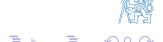

The core philosophy of this course is rooted in the **Bayesian framework**, which treats all unknown quantities as random variables. By combining prior knowledge with incoming observational data, we can systematically update our beliefs about a system. Whether you are working on autonomous navigation, industrial process control, or financial modeling, the principles of optimal estimation—such as the Kalman Filter and Monte Carlo methods—form the essential toolkit for handling stochasticity and noise.

<!-- SECTION DELIMITER -->

# EFD course approach

The core objective of the Estimation, Filtering, and Detection (EFD) course is the **extraction of information about "hidden" variables** within stochastic dynamic systems. In real-world engineering, we rarely have direct access to the internal variables or the exact parameters governing a system's behavior. Instead, we must infer these values from noisy measurements and incomplete data.

### **System Parameters**

When we focus on the underlying constants or slowly varying properties of a system, we are dealing with **System Identification**. This typically involves Input/Output (I/O) models such as ARX (Auto-Regressive with Exogenous variables) or ARMAX models.

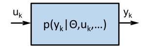

The process of identification is broken down into several critical steps:
*   **Structure Determination:** Selecting the mathematical form of the model (e.g., the order of the differential or difference equations).
*   **Parameter Estimation:** Calculating the numerical values of the coefficients within that structure.
*   **Algorithm Selection:** Choosing between **batch algorithms** (processing all data at once) or **recursive algorithms** (updating estimates as new data arrives in real-time).

### **System State**

While parameters define the "rules" of the system, the **System State** represents the internal variables that change over time (e.g., position, velocity, or temperature). These are modeled using **state-space representations**.

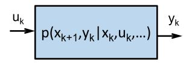

State estimation is categorized based on the relationship between the time of the estimate and the time of the available measurements:
*   **Filtering:** Estimating the current state based on measurements up to the present time.
*   **Prediction:** Estimating a future state based on current and past data.
*   **Smoothing:** Estimating a past state using data collected after that point in time (non-real-time).

### **Unifying Framework: The Bayesian Approach**

This course utilizes the **Bayesian method** as a rigorous mathematical framework to unify parameter estimation, state estimation, and detection. The fundamental shift is moving from a likelihood—the probability of observing data given a parameter—to a posterior distribution—the probability of the parameter given the observed data.

The general transformation is expressed as:
$$p(y|\theta, \ldots) \Rightarrow p(\theta|y, \ldots)$$

This logic applies across all domains of the course:
*   **For Parameters ($\theta$):** $p(y|\theta,\ldots) \Rightarrow p(\theta|y,\ldots)$
*   **For States ($x$):** $p(y|x,\ldots) \Rightarrow p(x|y,\ldots)$
*   **For Models/Modes ($m$):** $p(y|m,\ldots) \Rightarrow p(m|y,\ldots)$

### **System Mode**

In many complex scenarios, a system may operate in different "modes" (e.g., a sensor failure, a change in flight regime, or a mechanical break). This is handled by a **bank of multiple models**, where each model represents a different operating condition.

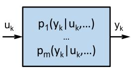

**Fault Detection and Isolation (FDI)** relies on:
*   **System Mode Probability:** Calculating which model currently best explains the observed data.
*   **Mode Switching:** Modeling the transitions between modes as a **Hidden Markov Process**.

The Bayesian inference for detection is represented as:
$$p(y|m, \ldots) \Rightarrow p(m|y, \ldots)$$


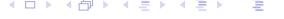

<!-- SECTION DELIMITER -->

# Course info (i)

To ensure success in the **Estimation, Filtering, and Detection (EFD)** course, students should be aware of the following academic requirements and the structure of the seminar sessions.

#### **Prerequisites**

The curriculum is designed for graduate-level students. To follow the mathematical derivations and implement the algorithms effectively, the following background is required:

1.  **Linear Systems and Control Theory**: A solid foundation in state-space representations, stability analysis, and transfer functions.
2.  **Probability, Statistics, and Optimization**: Familiarity with random variables, probability density functions (PDFs), statistical inference, and basic cost-function optimization.
3.  **Mathematical and Engineering Competency**: The ability to use mathematics as a functional tool to formulate, model, and solve complex engineering problems.
4.  **MATLAB Proficiency**: Working knowledge of MATLAB is essential for numerical simulations, algorithm development, and completing homework assignments.

#### **Seminar Structure and Requirements**

The seminars serve as the practical bridge between theoretical derivations and real-world applications. They consist of the following components:

*   **Practical Application**: We will apply theoretical concepts to selected examples using both traditional whiteboard derivations and MATLAB simulations.
*   **Homework Assignments**: There are three primary homework assignments throughout the semester. To encourage excellence, **5 bonus points** are awarded for the best solution presented in class.
*   **Mid-year Test**: A mid-term assessment will be conducted to evaluate the understanding of the core concepts covered in the first half of the course.
*   **Support Materials**: Students have access to a comprehensive repository of support materials, including:
    *   **MS Teams**: For communication and document sharing.
    *   **Doodle**: For scheduling and coordination.
    *   **Lecture Recordings**: Archives of previous lectures are available for review and self-paced study.

<!-- SECTION DELIMITER -->

# Course info (ii)

### **Course Evaluation and Grading Criteria**

The final grade for this course is determined by a composite score across several components, each designed to test different aspects of your understanding—from theoretical foundations to practical implementation. Each component is graded out of a maximum of 100 points.

1.  **Seminar (40% of final grade):**
    The seminar component focuses on continuous assessment throughout the semester. This includes the **mid-year test**, performance in **three major assignments**, and potential **bonus points** for exceptional contributions or solutions. 
    *   *Requirement:* A minimum of 50 points in this category is required to receive credit.
2.  **Written Test (30% of final grade):**
    This is a closed-book examination consisting of 10 standard questions and 2 advanced questions. No external references or aids are permitted.
    *   *Requirement:* A minimum of 50 points is required to pass the course.
3.  **Complex Example (30% of final grade):**
    This component involves solving a more sophisticated problem that mirrors real-world engineering challenges. Unlike the written test, references and course materials are permitted for this section.
4.  **Oral Exam:**
    The oral examination serves two primary purposes:
    *   **Clarification:** To resolve indeterminate cases where a student is on the border between two grades.
    *   **Advanced Assessment:** For candidates aiming for an "A" grade, the oral exam will cover supplementary reading materials highlighted in the lecture slides.

---

### **Recommended Reading**

To succeed in this course, students are encouraged to consult the following literature, which covers the spectrum of optimal estimation, system identification, and Bayesian methods.

1.  **F. L. Lewis, L. Xie and D. Popa:** *Optimal and Robust Estimation: With an Introduction to Stochastic Control Theory*. CRC Press, 2005. (Excellent for foundational stochastic control).
2.  **V. Havlena a J. Štecha:** *Moderní teorie řízení*. Nakladatelství ČVUT, Praha, 1999. (A core reference for control theory in Czech).
3.  **D. Simon:** *Optimal State Estimation*. John Wiley & Sons, Inc., New Jersey, 2006. (Highly practical and widely used for Kalman filtering).
4.  **S. Särkkä:** *Bayesian Filtering and Smoothing*. Cambridge University Press, Cambridge, 2013. (Modern perspective on recursive Bayesian estimation).
5.  **B. P. Gibbs:** *Advanced Kalman Filtering, Least Squares and Modeling: A Practical Handbook*. John Wiley & Sons, Inc., New Jersey, 2011.
6.  **B. D. O. Anderson and S. B. Moore:** *Optimal Filtering*. Prentice Hall, USA, 2005. (A classic text on the theory of filtering).
7.  **L. Ljung:** *System Identification Theory for the User*. Prentice Hall, USA, 1999. (The definitive guide to system identification).
8.  **C. E. Rasmussen and C. K. I. Williams:** *Gaussian Processes for Machine Learning*. MIT Press, 2006. (Essential for understanding non-parametric Bayesian modeling).

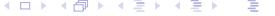

<!-- SECTION DELIMITER -->

# <span id="page-6-0"></span>**2. Statistics, estimation methods**

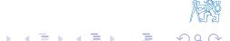

### Statistics

In the study of control theory and estimation, we must first establish a rigorous understanding of statistics. This field provides the mathematical foundation for interpreting signals, identifying system parameters, and estimating hidden states in the presence of noise.

### **Meaning of the term "statistics"**

The term "statistics" is used in two primary contexts within engineering and mathematics:

1.  **As a Field of Science:** It refers to the study of **inference**—the systematic process of drawing meaningful conclusions from data that are subject to uncertainty or random variations. In this sense, it is the framework we use to move from observations to knowledge.
2.  **As a Mathematical Quantity:** A "statistic" is any function of observed data $x$ that is independent of the unknown parameter $\theta$. For example, the sample mean is a statistic because it is calculated directly from the data without needing to know the true underlying mean of the population.

#### **Statistical model**

A statistical model is a formal assumption about the population from which data is drawn. It is typically expressed as a **sampling probability density function (PDF)**, denoted as $p_{\theta}(x)$. 

Developing a robust model requires more than just observing data; it necessitates a deep understanding of the underlying **first principles** and causal relations of the system. It is critical to distinguish between mere correlation (two variables moving together) and causation (one variable influencing another), as only causal models provide reliable predictive power in control systems.

#### **Random sample**

A random sample is a set of $n$ representative data items selected from a statistical population. Mathematically, we represent this as:

$$X_i \sim p_{\theta}(x) \rightarrow \{X_1, \dots, X_n\}$$

Where:
*   $n$ is the **size of the sample**.
*   $\theta$ is the **parameter** of interest (which may be unknown and is what we aim to estimate).

In most standard estimation problems, we assume that $X_i$ are **i.i.d. random variables** (independent and identically distributed). This means each observation is collected under the same conditions and the outcome of one observation does not influence another.

#### **Estimate**

An **estimate** is a specific type of statistic used to infer the value of an unknown parameter (such as the population mean $\mu$ or variance $\sigma^2$). Because an estimate is a function of random data, the estimate itself is a random variable with its own distribution. To be considered "good" or "useful," an estimate should ideally possess the following three properties:

*   **Unbiased:** The expected value of the estimate is equal to the true parameter value. On average, the estimate is correct.
*   **Consistent:** As the sample size $n$ increases, the estimate converges in probability to the true parameter value. Essentially, more data leads to more certainty.
*   **Efficient:** Among all possible unbiased estimates, an efficient estimate has the minimum possible variance. It achieves the **Cramer-Rao lower bound**, meaning it extracts the maximum possible information from the available data.

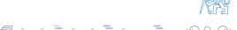

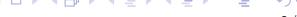

<!-- SECTION DELIMITER -->

# Some well-known statistics

In the study of estimation and control, we often rely on fundamental statistical measures to characterize data and system behavior. This section explores the properties of the most common statistics derived from a set of observations.

### **Assumptions**

To analyze the properties of these statistics, we establish a standard framework:
- Let $X_i$ be a sequence of **i.i.d.** (independent and identically distributed) random variables.
- Each variable has a defined mean $\mathcal{E}\{X_i\} = \mu$ and a variance $\operatorname{cov}\{X_i\} = \sigma^2$.

When considering the sum of these variables, the linearity of the expectation operator and the independence of the variables allow us to derive the following:

$$\mathcal{E}\left\{\sum_{i=1}^{n} X_{i}\right\} = n\mu$$

$$\operatorname{cov}\left\{\sum_{i=1}^{n} X_{i}\right\} = \mathcal{E}\left\{\left(\sum_{i=1}^{n} X_{i} - n\mu\right)^{2}\right\} = \mathcal{E}\left\{\sum_{i=1}^{n} (X_{i} - \mu)^{2}\right\} = n\sigma^2$$

These results show that while the expected value scales linearly with the number of samples $n$, the total variance also scales linearly with $n$, which has significant implications for the precision of our estimates.

### **Statistics**

#### **Sample Mean**
The sample mean (also known as the sample average or arithmetic average) is the most common estimator for the population mean $\mu$. It is defined as:

$$\bar{X} = \frac{1}{n} \sum_{i=1}^{n} X_{i}$$

**Expectation of the Sample Mean:**
The sample mean is an **unbiased** estimator of $\mu$, as its expected value is exactly equal to the parameter it intends to estimate:

$$\mathcal{E}\left\{\bar{X}\right\} = \mathcal{E}\left\{\frac{1}{n} \sum_{i=1}^{n} X_{i}\right\} = \frac{1}{n} \sum_{i=1}^{n} \mu = \mu$$

**Variance of the Sample Mean:**
The variance (or covariance in the scalar case) of the sample mean quantifies the uncertainty of our estimate. As the sample size $n$ increases, the variance decreases, indicating that the estimate becomes more "concentrated" around the true mean:

$$\operatorname{cov}\left\{\bar{X}\right\} = \mathcal{E}\left\{\left(\frac{1}{n} \sum_{i=1}^{n} X_{i} - \mu\right)^{2}\right\} = \frac{1}{n^{2}} \sum_{i=1}^{n} \sigma^{2} = \frac{\sigma^{2}}{n}$$

*(Note: In the original derivation provided, the result $\frac{\sigma^2}{n^2}$ is a common typo; the correct scaling for the variance of the mean is $\sigma^2/n$.)*


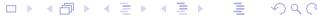

2

<!-- SECTION DELIMITER -->

# Some well-known statistics (2)

In statistical estimation, we distinguish between the theoretical parameters of a population and the statistics calculated from a finite sample. Two of the most critical statistics are those used to estimate the variance ($\sigma^2$) of a distribution.

### Sample Moments and Variance

#### Sample 2nd Central Moment
The sample second central moment, denoted as $C_2$, is a measure of the spread of the data around the sample mean $\bar{X}$. It is defined as:

$$C_2 = \frac{1}{n} \sum_{i=1}^{n} (X_i - \bar{X})^2$$

While intuitive, $C_2$ is a **biased estimate** of the true population variance $\sigma^2$. Specifically, its expected value is:
$$\mathcal{E}\left\{C_2\right\} = \frac{n-1}{n} \sigma^2$$
As $n \to \infty$, the bias disappears, making it asymptotically unbiased.

#### Sample Variance
To obtain an **unbiased estimate** of the population variance $\sigma^2$, we use the sample variance $s^2$. This version applies Bessel's correction by dividing by $n-1$ instead of $n$:

$$s^{2} = \frac{1}{n-1} \sum_{i=1}^{n} (X_{i} - \bar{X})^{2}$$

The expected value of this statistic is exactly the population variance:
$$\mathcal{E}\left\{s^{2}\right\} = \sigma^{2}$$

#### Useful Identity
A helpful algebraic identity for deriving these properties relates the deviations from the sample mean to the deviations from the true population mean $\mu$:

$$\sum_{i=1}^{n} (X_i - \bar{X})^2 = \sum_{i=1}^{n} (X_i - \mu)^2 - n(\bar{X} - \mu)^2$$

This is analogous to the **Huygens-Steiner parallel axis theorem** in classical mechanics, where $\bar{X}$ represents the center of gravity of the data points.

---

### Normal (Gaussian) Distribution

The Normal distribution is the cornerstone of classical control theory and estimation due to its unique mathematical properties.

#### Normal Probability Density Function (PDF)
If a random variable $X_i$ follows a normal distribution with mean $\mu$ and variance $\sigma^2$, its PDF is given by:

$$X_i \sim \mathcal{N}\left(\mu, \sigma^2\right) \quad \rightarrow \quad p(x) = \frac{1}{\sqrt{2\pi} \, \sigma} \, e^{-\frac{(x-\mu)^2}{2\sigma^2}}$$

The distribution is entirely characterized by its first two moments: the mean $\mu$ (location) and the variance $\sigma^2$ (scale).

#### Why is it so frequently used?
1.  **Mathematical Convenience**: The Gaussian distribution is closed under linear operations. For example, the sum of independent Gaussian variables is also Gaussian:
    $$\sum_{i=1}^{n} X_{i} \sim \mathcal{N}\left(n\mu, n\sigma^{2}\right)$$
    The sample mean likewise follows a Gaussian distribution:
    $$\bar{X} \sim \mathcal{N}\left(\mu, \sigma^{2}/n\right)$$

2.  **Foundation for Other Distributions**: Many other important statistical distributions are derived from Gaussian variables. For instance, if $X_i$ are independent standard normal variables $\mathcal{N}(0,1)$, the sum of their squares follows a **Chi-square distribution** with $n$ degrees of freedom:
    $$X_i \sim \mathcal{N}(0,1) \rightarrow \sum_{i=1}^{n} X_i^2 \sim \chi_n^2(x) = \frac{1}{2^{\frac{n}{2}} \Gamma(\frac{n}{2})} x^{\frac{n}{2}-1} e^{-\frac{x}{2}}$$
    Other derived distributions include the Student's T-distribution and the Fisher F-distribution, which are essential for hypothesis testing.


<!-- SECTION DELIMITER -->

# Normal (Gaussian) distribution (2)

The Normal distribution is the cornerstone of classical estimation theory. Its prevalence in both natural phenomena and engineering applications is not accidental; it is supported by empirical observation and rigorous mathematical theory.

### Why is the Normal Distribution Ubiquitous?
*   **Empirical Evidence:** Many physical processes, measurement errors, and biological traits naturally follow a "bell curve" distribution.
*   **Central Limit Theorem (CLT):** This is the primary theoretical justification. It states that the sum of many independent random variables tends toward a Normal distribution, regardless of the original distribution of the individual variables.

---

### The Central Limit Theorem (CLT)

The CLT explains why the Gaussian distribution appears so frequently in systems where multiple small, independent effects contribute to a final observed outcome.

#### **Theorem (Lindeberg/Lévy) – Continuous Random Variables**
Let $\{X_1, X_2, \dots, X_n\}$ be a sequence of independent and identically distributed (i.i.d.) random variables with a finite mean $E\{X_i\} = \mu$ and a finite variance $\text{cov}\{X_i\} = \sigma^2$. 

As the sample size $n$ increases ($n \to \infty$), the normalized sum $Y_n$ converges in distribution to a standard normal distribution:
$$Y_n = \frac{1}{\sqrt{n}} \sum_{i=1}^n \frac{X_i - \mu}{\sigma} \rightarrow \mathcal{N}(0,1)$$

Alternatively, the sum of these variables converges to a normal distribution scaled by the number of samples:
$$\sum_{i=1}^n X_i \rightarrow \mathcal{N}\left(n\mu, n\sigma^2\right)$$

#### **Theorem (Moivre/Laplace) – Discrete Random Variables**
This is a special case of the CLT applied to Bernoulli trials (discrete outcomes). Let $\{X_1, X_2, \dots, X_n\}$ be i.i.d. random variables following an alternative (Bernoulli) distribution where:
*   $P\{X_i = 1\} = q$ (Success)
*   $P\{X_i = 0\} = 1 - q$ (Failure)
*   $E\{X_i\} = q$
*   $\text{cov}\{X_i\} = q(1 - q)$

As $n \to \infty$, the standardized sum $Y_n$ converges to:
$$Y_n = \frac{1}{\sqrt{n}} \sum_{i=1}^n \frac{X_i - q}{\sqrt{q(1-q)}} \rightarrow \mathcal{N}(0,1)$$

Or, expressed as the sum of successes:
$$\sum_{i=1}^n X_i \rightarrow \mathcal{N}\left( nq, nq(1-q) \right)$$

This theorem justifies using the Normal distribution to approximate the Binomial distribution when the number of trials is large.

<!-- SECTION DELIMITER -->

# Normal (Gaussian) distribution (3)

### The Maximum Entropy Principle

In estimation and information theory, the **Entropy** $H(x)$ serves as a quantitative measure of the uncertainty or "randomness" associated with a given probability density function (p.d.f.) $f(x)$. It is defined as:

$$H(x) = -\int f(x) \ln f(x) \, dx$$

The **Maximum Entropy Principle** states that if we only know certain moments of a distribution (such as the mean or variance), the most "honest" p.d.f. to assume is the one that maximizes entropy. This distribution contains the minimum amount of "added" or subjective information beyond the given constraints.

For a set of given moment constraints $\mathcal{E}\{g_i(x)\} = \int g_i(x)f(x)dx$ for $i = 1, \ldots, n$, the p.d.f. that maximizes entropy takes the exponential form:

$$f(x) = K \exp \left(-\sum_{i=1}^{n} \lambda_i g_i(x)\right)$$

#### Example: Why the Normal Distribution?
The Gaussian distribution is the maximum entropy distribution for a specified mean and variance.
*   **Case 1:** If we only know the second raw moment $\mathcal{E}\{x^{2}\} = M_{2}$, the maximum entropy p.d.f. is $f(x) = K e^{-\lambda_{1}x^{2}}$, which is a zero-mean Normal distribution $\mathcal{N}(0, M_{2})$.
*   **Case 2:** If we know the variance (second central moment) $\mathcal{E}\{(x - \mu)^{2}\} = C_{2}$, the resulting p.d.f. is $f(x) = K e^{-\lambda_{1}(x - \mu)^{2}}$, which is the general Normal distribution $\mathcal{N}(\mu, C_{2})$.


---

### Multivariable Gaussian Bell Function

When dealing with a vector of random variables $X \in \mathbb{R}^n$, the multivariable normal p.d.f. is defined by the mean vector $\hat{x}$ and the covariance matrix $P$:

$$p(x) = \frac{1}{(2\pi)^{n/2} \sqrt{\det P}} \exp\left\{-\frac{1}{2}(x-\hat{x})^T P^{-1}(x-\hat{x})\right\}$$

#### The Covariance Ellipsoid
The surfaces of constant probability density are defined by the quadratic form in the exponent. We define the **covariance ellipsoid** $E_{\alpha}$ as the set:

$$E_{\alpha} = \left\{ x \mid (x - \hat{x})^{T} P^{-1} (x - \hat{x}) \leq \alpha \right\}$$

The scalar random variable $y = (x-\hat{x})^T P^{-1}(x-\hat{x})$ follows a **Chi-square distribution** with $n$ degrees of freedom ($\chi_n^2$). 

**Proof Sketch:**
1. Transform the variable: Let $y = P^{-1/2}(x - \hat{x})$. Since $x$ is Gaussian, $y$ is also Gaussian.
2. Calculate the covariance of $y$:
   $$\text{cov}\{y\} = \mathcal{E} \left\{ P^{-1/2} (x - \hat{x}) (x - \hat{x})^T P^{-T/2} \right\} = P^{-1/2} P P^{-1/2} = I_n$$
3. Thus, $y \sim \mathcal{N}(0, I_n)$, meaning $y$ consists of independent standard normal variables.
4. The sum of squares $y^T y = \sum_{i=1}^n y_i^2$ by definition follows the $\chi_n^2$ distribution.

#### Probability Content
The probability that a realization of the random vector $x$ falls within the ellipsoid $E_{\alpha}$ is given by the cumulative distribution function (CDF) of the Chi-square distribution:

$$Pr\left\{x\in E_{\alpha}\right\} = F_{\chi_{n}^{2}}(\alpha)$$

For the specific case of $n=2$ (bivariate Gaussian), the $\chi_2^2$ p.d.f. simplifies to an exponential form:
$$\chi_2^2(y) = \frac{1}{2} e^{-\frac{y}{2}}$$

<span style="display:block;text-align:center;">
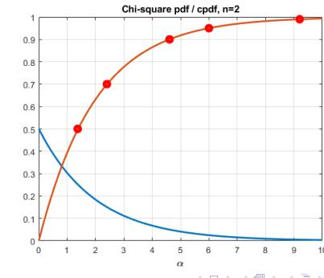


</span>

<!-- SECTION DELIMITER -->

# Multivariable Gaussian bell function (2)

In the multivariate case, the Gaussian distribution is not just a "bell curve" but a "bell surface" in higher dimensions. Understanding the geometry of this distribution is critical for estimation and control tasks.

### Covariance Ellipsoid Shape

The level sets (contours of constant probability density) of a multivariate normal distribution form ellipsoids. For a given threshold $\alpha$, the covariance ellipsoid $E_\alpha$ is defined by:

*   **Center:** The ellipsoid is centered at the mean vector $\hat{x}$.
*   **Semi-axes Size and Direction:** The geometry of the ellipsoid is governed by the spectral decomposition of the covariance matrix $P$.
    *   The **directions** of the semi-axes are given by the unit eigenvectors $v_i$ of $P$.
    *   The **lengths** of the semi-axes are proportional to $\sqrt{\alpha \lambda_i}$, where $\lambda_i$ are the corresponding eigenvalues.

#### **Example: Visualizing Correlation**

1.  **Uncorrelated Noise Data:**
    Consider a zero-mean process $\hat{x} = [0, 0]^T$ with identity covariance:
    $$P = \begin{bmatrix} 1 & 0 \\ 0 & 1 \end{bmatrix}, \ \lambda = \begin{bmatrix} 1.0 \\ 1.0 \end{bmatrix}, \ V = \begin{bmatrix} 1.0 & 0.0 \\ 0.0 & 1.0 \end{bmatrix}$$
    Because the eigenvalues are equal and the off-diagonal elements are zero, the contours are perfect circles (or spheres in 3D), indicating no correlation between variables.
    

2.  **Correlated Noise Data:**
    Consider a zero-mean process $\hat{x} = [0, 0]^T$ where variables influence each other:
    $$P = \begin{bmatrix} 2 & 1 \\ 1 & 1 \end{bmatrix}, \ \lambda = \begin{bmatrix} 2.6 \\ 0.4 \end{bmatrix}, \ V = \begin{bmatrix} 0.8 & 0.5 \\ 0.5 & -0.8 \end{bmatrix}$$
    Here, the unequal eigenvalues stretch the circle into an ellipse. The eigenvectors show that the principal axis of uncertainty is rotated, reflecting the correlation between the components of $x$.
    


---

### Mean Square Estimate (MSE)

The Mean Square (MS) estimation problem is a fundamental pillar of estimation theory, aiming to find an estimate that minimizes the expected squared error.

#### **MS Problem Formulation**
*   **Objective:** Find an optimal estimator function $\hat{x}_{MS}(y)$.
*   **Variables:** Let $x$ be the hidden random vector to be estimated and $y$ be the vector of observable data.
*   **Information:** We assume knowledge of the joint probability density function $p(x, y)$.
*   **Criterion:** Minimize the Mean Square Error (MSE) $J_{MS}$:
    $$J_{MS} = \int \int (x - \hat{x}_{MS}(y))^{T} (x - \hat{x}_{MS}(y)) p(x, y) \, dx \, dy$$

#### **Minimization Strategy**
To solve this, we use the property of conditional probability $p(x, y) = p(x|y) p(y)$:
$$J_{MS} = \int \left[ \int (x - \hat{x}_{MS}(y))^T (x - \hat{x}_{MS}(y)) p(x|y) \, dx \right] p(y) \, dy$$

Since the marginal density $p(y)$ is always non-negative, minimizing the total integral $J_{MS}$ is equivalent to minimizing the inner integral for every possible realization of $y$:
$$J'_{MS}(y) = \int (x - \hat{x}_{MS}(y))^T (x - \hat{x}_{MS}(y)) p(x|y) \, dx$$

This inner integral represents the conditional mean square error. As we will see in the following section, the solution to this minimization is the **conditional mean**, $\mathcal{E}\{x|y\}$.


<!-- SECTION DELIMITER -->

# Mean Square Estimate (2)

In the previous section, we formulated the Mean Square (MS) estimation problem by minimizing the expected value of the squared error. We determined that to find the optimal estimate $\hat{x}_{\text{MS}}(y)$, it is sufficient to minimize the inner integral of the cost function for every observed value $y$.

### Minimizing the Inner Integral

The inner integral of the MS criterion, denoted as $J_{\text{MS}}'(y)$, represents the conditional mean square error. By expanding the quadratic term $(x - \hat{x}_{\text{MS}})^T(x - \hat{x}_{\text{MS}})$, we obtain:

$$J_{\mathsf{MS}}'(y) = \mathcal{E}\left\{\boldsymbol{x}^T\boldsymbol{x}|\boldsymbol{y}\right\} - \mathcal{E}\left\{\boldsymbol{x}|\boldsymbol{y}\right\}^T\hat{\boldsymbol{x}}_{\mathsf{MS}}(y) - \hat{\boldsymbol{x}}_{\mathsf{MS}}^T(y)\mathcal{E}\left\{\boldsymbol{x}|\boldsymbol{y}\right\} + \hat{\boldsymbol{x}}_{\mathsf{MS}}^T(y)\hat{\boldsymbol{x}}_{\mathsf{MS}}(y)$$

To find the stationary point, we take the partial derivative with respect to the estimate $\hat{\mathbf{x}}_{\text{MS}}(y)$ and set it to zero:

$$\frac{\partial J_{\rm MS}'}{\partial \hat{\mathbf{x}}_{\rm MS}(y)} = -2\mathcal{E}\left\{x|y\right\} + 2\hat{\mathbf{x}}_{\rm MS}(y) = 0 \quad \rightarrow \quad \hat{\mathbf{x}}_{\rm MS}(y) = \mathcal{E}\left\{x|y\right\}$$

**Conclusion:** The optimal Mean Square estimate is simply the **conditional mean value** of the hidden state $x$ given the observed data $y$.

### Measure of Quality: Estimation Error Covariance

The performance of the MS estimator is characterized by the estimation error $\tilde{\mathbf{x}}(y) = \mathbf{x} - \hat{\mathbf{x}}_{\text{MS}}(y)$. Since the estimate is the conditional mean, the expected error is zero ($\mathcal{E}\{\tilde{\mathbf{x}}\} = 0$). The quality is quantified by the error covariance matrix:

$$P_{\tilde{\mathbf{x}}_{\mathsf{MS}}} = \mathcal{E}\left\{\tilde{\mathbf{x}}(y)\tilde{\mathbf{x}}^{\mathsf{T}}(y)\right\}$$

This can be expressed by integrating over the joint distribution:
$$P_{\tilde{x}_{\mathsf{MS}}} = \int \int \tilde{x}(y) \tilde{x}^{\mathsf{T}}(y) p(x|y) \ dx \ p(y) \ dy = \int P_{x|y}(y) p(y) \ dy = P_{x|y}$$

Where:
- $P_{x|y}(y)$ is the covariance matrix of the estimation error for a specific observation $y$.
- $P_{x|y}$ is the mean covariance matrix, which represents the average uncertainty across all possible observations.

The original scalar criterion function $J_{\text{MS}}$ is equivalent to the trace of this error covariance matrix:
$$J_{\mathsf{MS}} = \mathcal{E}\left\{\tilde{x}^{\mathsf{T}}\tilde{x}\right\} = \mathcal{E}\left\{\mathsf{tr}\;\tilde{x}^{\mathsf{T}}\tilde{x}\right\} = \mathcal{E}\left\{\mathsf{tr}\;\tilde{x}\tilde{x}^{\mathsf{T}}\right\} = \mathsf{tr}\;P_{\tilde{x}_{\mathsf{MS}}}$$


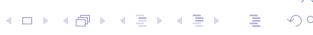

---

### Orthogonality Principle

The orthogonality principle is a fundamental concept in estimation theory. Two random variables are considered **orthogonal** if their inner product's expectation is zero:
$$\mathcal{E}\left\{x^{T}y\right\} = \int\int x^{T}y \ p(x,y) \ dxdy = 0$$

**The Principle for MS Estimation:**
The estimation error $(x - \mathcal{E}\{x|y\})$ is orthogonal to any function $g(y)$ of the observed data. Mathematically:
$$\mathcal{E}\left\{g(y)^{T}\left(x-\mathcal{E}\left\{x|y\right\}\right)\right\}=0$$

**Key Implications:**
1. The MS error is orthogonal to all possible functions (linear or non-linear) of the observed data.
2. The MS estimate is the "best" possible estimate in terms of the Euclidean norm:
   $$\mathcal{E}\{\|x - \mathcal{E}\{x|y\}\|\} \le \mathcal{E}\{\|x - g(y)\|\}$$
   where $\|x\| = \sqrt{x^T x}$.


---

### Linear Mean Square Estimate

While the MS estimate (conditional mean) is theoretically optimal, it has practical drawbacks:
- It requires full knowledge of the joint probability density function $p(x, y)$, which is often unknown.
- Calculating the conditional mean can be analytically or computationally intractable for complex distributions.

#### LMS Problem Formulation
To overcome these issues, we restrict the estimator to be a **linear function** of the observed data:
$$\hat{x}_{\mathsf{LMS}}(y) = Ay + b$$

**Requirements and Goals:**
- **Information:** We only require the first and second moments (means and covariances) of $x$ and $y$, rather than the full p.d.f.
- **Optimality Criterion:** Minimize the Linear Mean Square (LMS) error:
$$J_{\text{LMS}} = \int \int \left(x - \hat{x}_{\text{LMS}}(y)\right)^{T} \left(x - \hat{x}_{\text{LMS}}(y)\right) p(x, y) \ dx \ dy$$

<!-- SECTION DELIMITER -->

# Linear Mean Square Estimate (2)

#### **LMS Criterion Minimization**

To find the optimal linear estimator, we must minimize the Mean Square Error (MSE) criterion $J_{LMS}$ with respect to the matrix $A$ and the vector $b$.

▶ **Properties of the Trace Operator**
The cost function can be expressed using the trace operator, which simplifies the differentiation of scalar quadratic forms involving vectors:
$$J_{LMS} = \mathcal{E}\left\{ (x - Ay - b)^{T} (x - Ay - b) \right\} = \text{tr } \mathcal{E}\left\{ (x - Ay - b) (x - Ay - b)^{T} \right\}$$

By expanding the quadratic term and taking the expectation, we obtain:
$$= \text{tr } \left[ P_{xx} + A(P_{yy} + \mu_{y}\mu_{y}^{T})A^{T} + (b - \mu_{x})(b - \mu_{x})^{T} + 2A\mu_{y}(b - \mu_{x})^{T} - 2AP_{yx} \right]$$

*Helpful hint:* To simplify the derivation, represent the random variables as the sum of their mean and zero-mean deviation, e.g., $x = \mu_x + \tilde{x}$ and $y = \mu_y + \tilde{y}$.

▶ **Formulas from Matrix Analysis**
To find the stationary points, we utilize standard matrix calculus identities:
$$\frac{\partial}{\partial Y} \operatorname{tr}(XYZ) = X^T Z^T, \qquad \frac{\partial}{\partial X} \operatorname{tr}(XYX^T) = 2XY$$

▶ **Stationary Point Conditions**
Setting the partial derivatives of $J_{LMS}$ with respect to $A$ and $b$ to zero provides the necessary conditions for a minimum:
$$\frac{\partial}{\partial A}J_{LMS} = 2A(P_{yy} + \mu_y \mu_y^T) + 2(b - \mu_x)\mu_y^T - 2P_{xy} = 0$$
$$\frac{\partial}{\partial b}J_{LMS} = 2(b - \mu_x) + 2A\mu_y = 0$$

▶ **Resulting Estimate**
Solving the system of equations above (assuming the covariance matrix $P_{yy}$ is positive definite and thus invertible), we arrive at the optimal parameters:
$$A = P_{xy}P_{yy}^{-1}, \qquad b = \mu_x - P_{xy}P_{yy}^{-1}\mu_y$$

This result is significant because the optimal linear estimate **depends only on the first and second moments** (means and covariances) of the distribution, rather than the full probability density function.

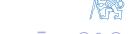

<!-- SECTION DELIMITER -->

# Linear Mean Square Estimate (3)

#### **Interpretation of the LMS Formula**
The Linear Mean Square (LMS) estimate can be viewed as the prior mean $\mu_x$ adjusted by a correction term. This correction is proportional to the innovation (the difference between the observed data $y$ and its expected value $\mu_y$).

$$\hat{x}_{\mathsf{LMS}}(y) = \mu_{\mathsf{x}} + P_{\mathsf{x}\mathsf{y}}P_{\mathsf{y}\mathsf{y}}^{-1}\left(y - \mu_{\mathsf{y}}\right)$$

Alternatively, we can express this in terms of the deviation from the mean:
$$\hat{x}_{\mathsf{LMS}}(y) - \mu_{\mathsf{x}} = P_{\mathsf{x}\mathsf{y}}P_{\mathsf{y}\mathsf{y}}^{-1}\left(y - \mu_{\mathsf{y}}\right)$$

The term $P_{xy}P_{yy}^{-1}$ acts as a **correction gain** (often referred to as the gain matrix), which determines how much the observation $y$ should influence the estimate of $x$ based on the cross-covariance between them.

### **LMS Error Covariance**
A critical property of the LMS estimate is that the error covariance matrix $P_{\tilde{x}_{LMS}}$ is independent of the actual realized value of the data $y$. It depends only on the prior second-order moments of the joint distribution.

The error is defined as $\tilde{x} = x - \hat{x}_{LMS}(y)$. Substituting the LMS formula:
$$P_{\tilde{x}_{LMS}} = \mathcal{E}\left\{ (x - \hat{x}_{LMS}(y)) (x - \hat{x}_{LMS}(y))^{T} \right\}$$
$$= \mathcal{E}\left\{ \left( (x - \mu_{x}) - P_{xy}P_{yy}^{-1}(y - \mu_{y}) \right) \left( (x - \mu_{x}) - P_{xy}P_{yy}^{-1}(y - \mu_{y}) \right)^{T} \right\}$$

Expanding this expectation and simplifying yields the Schur complement of $P_{yy}$ in the joint covariance matrix:
$$P_{\tilde{x}_{LMS}} = P_{xx} - P_{xy}P_{yy}^{-1}P_{yx}$$

#### **Orthogonality Principle for LMS Estimate**
In the context of linear estimation, the orthogonality principle states that the estimation error is orthogonal to any **linear** function of the observed data, $g(y) = Ay + b$. This implies that the error contains no linear information that could be further extracted from $y$.

Specifically, the error is orthogonal to a constant (ensuring the estimate is unbiased):
$$\operatorname{tr} \mathcal{E} \left\{ 1 \times \left( x - \hat{x}_{\mathsf{LMS}}(y) \right)^T \right\} = 0$$

And the error is orthogonal to the data $y$ itself:
$$\operatorname{tr} \mathcal{E} \left\{ y \left( x - \hat{x}_{\mathsf{LMS}}(y) \right)^T \right\} = 0$$


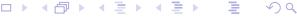

---

### MS and LMS Estimate for Normally Distributed Variables

When the variables $x$ and $y$ are jointly Gaussian (normally distributed), the relationship between the MS and LMS estimates becomes particularly elegant.

**Joint Normal p.d.f.**
Consider $y$ and $x$ as vectors with $n_y$ and $n_x$ elements respectively:
$$p\left(\begin{bmatrix} y \\ x \end{bmatrix}\right) = \mathcal{N}\left(\begin{bmatrix} \mu_y \\ \mu_x \end{bmatrix}; \begin{bmatrix} P_{yy} & P_{yx} \\ P_{xy} & P_{xx} \end{bmatrix}\right)$$

The full probability density function is given by:
$$p\left(\begin{bmatrix} y \\ x \end{bmatrix}\right) = (2\pi)^{-\frac{n_y+n_x}{2}} \det \begin{bmatrix} P_{yy} & P_{yx} \\ P_{xy} & P_{xx} \end{bmatrix}^{-\frac{1}{2}} \exp \left\{-\frac{1}{2} \begin{bmatrix} y - \mu_y \\ x - \mu_x \end{bmatrix}^T \begin{bmatrix} P_{yy} & P_{yx} \\ P_{xy} & P_{xx} \end{bmatrix}^{-1} \begin{bmatrix} y - \mu_y \\ x - \mu_x \end{bmatrix}\right\}$$

### Conditional p.d.f.
Using the chain rule $p(x, y) = p(y) p(x|y)$, we can factor the joint Gaussian distribution into the marginal distribution of $y$ and the conditional distribution of $x$ given $y$:
$$p\left(\begin{bmatrix} y \\ x \end{bmatrix}\right) = \mathcal{N}(y; \mu_y, P_{yy}) \times \mathcal{N}(x; \mu_{x|y}, P_{x|y})$$

Where the conditional parameters are:
$$\mu_{x|y} = \mu_x + P_{xy}P_{yy}^{-1}(y - \mu_y), \qquad P_{x|y} = P_{xx} - P_{xy}P_{yy}^{-1}P_{yx}$$

**Conclusion:** For Gaussian distributions, the conditional mean (the MS estimate) is a linear function of the data. Therefore, the optimal Mean Square estimate and the optimal Linear Mean Square estimate are identical:
$$\hat{x}_{\mathsf{MS}}(y) = \hat{x}_{\mathsf{LMS}}(y)$$


#### **How to Factorize the Joint p.d.f.?**
To derive the conditional distribution, we factor the joint covariance matrix using a triangular transformation:
$$\begin{bmatrix} P_{yy} & P_{yx} \\ P_{xy} & P_{xx} \end{bmatrix} \begin{bmatrix} I & -P_{yy}^{-1}P_{yx} \\ 0 & I \end{bmatrix} = \begin{bmatrix} P_{yy} & 0 \\ P_{xy} & P_{xx} - P_{xy}P_{yy}^{-1}P_{yx} \end{bmatrix}$$

Because the transformation matrix has a unit determinant, the joint determinant factors as:
$$\det \begin{bmatrix} P_{yy} & P_{yx} \\ P_{xy} & P_{xx} \end{bmatrix} = \det (P_{yy}) \det (P_{xx} - P_{xy}P_{yy}^{-1}P_{yx})$$

The inverse of the joint covariance matrix can also be partitioned:
$$\begin{bmatrix} P_{yy} & P_{yx} \\ P_{xy} & P_{xx} \end{bmatrix}^{-1} = \begin{bmatrix} P_{yy}^{-1} + P_{yy}^{-1} P_{yx} P_{x|y}^{-1} P_{xy} P_{yy}^{-1} & -P_{yy}^{-1} P_{yx} P_{x|y}^{-1} \\ -P_{x|y}^{-1} P_{xy} P_{yy}^{-1} & P_{x|y}^{-1} \end{bmatrix}$$

This allows us to factor the quadratic form in the exponent:
$$\begin{bmatrix} y - \mu_y \\ x - \mu_x \end{bmatrix}^T \begin{bmatrix} P_{yy} & P_{yx} \\ P_{xy} & P_{xx} \end{bmatrix}^{-1} \begin{bmatrix} y - \mu_y \\ x - \mu_x \end{bmatrix} = (y - \mu_y)^T P_{yy}^{-1} (y - \mu_y) + (x - \mu_{x|y})^T P_{x|y}^{-1} (x - \mu_{x|y})$$

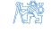

---

### Maximum Likelihood Estimate

### **Classical (Frequentist) Approach**
In the frequentist framework, the parameter $x$ is treated as a **deterministic but unknown constant**, rather than a random variable. Consequently, there is no prior distribution $p(x)$, and the conditional probability $p(x|y)$ is not defined in the Bayesian sense. Instead, we rely on the probability of the observed data given the parameter:
$$y \sim p(y|x)$$

#### **Likelihood Function**
The likelihood function $l(x|y)$ is simply the conditional p.d.f. $p(y|x)$ viewed as a function of the unknown parameter $x$ for a fixed set of observed data $y$:
$$l(x|y) = p(y|x)$$

### **Maximum Likelihood (ML) Estimate**
The goal of ML estimation is to find the value of $x$ that makes the observed data $y$ "most likely":
$$\hat{x}_{\mathsf{ML}}(y) = \arg\max_{x} l(x|y)$$

Since the natural logarithm is a monotonically increasing function, maximizing the likelihood is equivalent to maximizing the **log-likelihood**. The estimate is found by solving the likelihood equation:
$$\left. \frac{\partial \ln l(x|y)}{\partial x} \right|_{x = \hat{x}_{\text{ML}}} = 0$$


<!-- SECTION DELIMITER -->

# Maximum Likelihood Estimate – example

To better understand the application of the Maximum Likelihood (ML) method, let us consider a classic problem in estimation theory: estimating a constant parameter from noisy measurements.

### **Example: Repeated Measurement with Gaussian Noise**

Consider a scenario where we observe a vector of measurements $\mathbf{y}$ related to an unknown deterministic parameter $\mathbf{x}$ through a linear model:
$$\mathbf{y} = \mathbf{C}\mathbf{x} + \mathbf{e}$$
In this model, $\mathbf{C}$ is a known observation matrix and $\mathbf{e}$ represents the measurement noise. We assume the noise follows a zero-mean Gaussian distribution with a known covariance matrix $\mathbf{R}$:
$$p_e(\mathbf{e}) = (2\pi)^{-n_y/2} |\mathbf{R}|^{-1/2} \exp\left\{-\frac{1}{2}\mathbf{e}^T\mathbf{R}^{-1}\mathbf{e}\right\}$$

#### **1. Deriving the Conditional Density**
For a fixed (given) value of $\mathbf{x}$, the measurement $\mathbf{y}$ is simply a linear transformation of the random variable $\mathbf{e}$. Using the transformation theorem for random variables:
$$\mathbf{y} = \mathbf{Ie} + \mathbf{Cx} \implies \mathbf{e} = \mathbf{y} - \mathbf{Cx}$$
Since the Jacobian of this transformation is the identity matrix, the conditional probability density $p(\mathbf{y}|\mathbf{x})$ is equivalent to the noise density shifted by the mean $\mathbf{Cx}$:
$$p(\mathbf{y}|\mathbf{x}) = p_e(\mathbf{y} - \mathbf{Cx})$$

#### **2. The Likelihood Function**
The likelihood function $l(\mathbf{x}|\mathbf{y})$ is defined as the conditional density $p(\mathbf{y}|\mathbf{x})$ viewed as a function of the unknown parameter $\mathbf{x}$:
$$l(\mathbf{x}|\mathbf{y}) = (2\pi)^{-n_y/2} |\mathbf{R}|^{-1/2} \exp\left\{-\frac{1}{2}(\mathbf{y} - \mathbf{Cx})^T \mathbf{R}^{-1}(\mathbf{y} - \mathbf{Cx})\right\}$$

#### **3. Log-Likelihood and Optimization**
To find the maximum, it is mathematically convenient to work with the natural logarithm of the likelihood (the log-likelihood), as the logarithm is a monotonic function and does not change the location of the maximum:
$$\ln l(\mathbf{x}|\mathbf{y}) = -\frac{1}{2}(\mathbf{y} - \mathbf{Cx})^{T}\mathbf{R}^{-1}(\mathbf{y} - \mathbf{Cx}) - \frac{n_{y}}{2}\ln(2\pi) - \frac{1}{2}\ln|\mathbf{R}|$$
To find the stationary point, we take the partial derivative with respect to $\mathbf{x}$ and set it to zero. This is known as the **likelihood equation**:
$$\frac{\partial \ln l(\mathbf{x}|\mathbf{y})}{\partial \mathbf{x}} = \mathbf{C}^{T} \mathbf{R}^{-1} (\mathbf{y} - \mathbf{Cx}) = 0$$

Solving this equation yields the ML estimate. Note that for Gaussian noise, maximizing the likelihood is equivalent to minimizing the weighted squared error $(\mathbf{y} - \mathbf{Cx})^T \mathbf{R}^{-1}(\mathbf{y} - \mathbf{Cx})$, which is the basis for the Weighted Least Squares method.


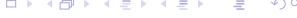

<!-- SECTION DELIMITER -->

# Maximum Likelihood Estimate – example (2)

#### Resulting ML estimate
In a well-designed experiment, the observation matrix $C$ has full rank, ensuring that the system is observable and a unique solution exists. Under the assumption of Gaussian noise, the Maximum Likelihood (ML) estimate is given by the weighted least squares solution:

$$\hat{\mathbf{x}}_{\mathsf{ML}} = \left( C^{\mathsf{T}} R^{-1} C \right)^{-1} C^{\mathsf{T}} R^{-1} \mathbf{y}$$

#### Model of $n$ independent samples with various precision
Consider a scalar parameter $x$ observed through $n$ independent measurements, where each measurement $y_i$ has a different noise variance $\sigma_i^2$. This is modeled as:

$$C = \begin{bmatrix} 1 \\ \vdots \\ 1 \end{bmatrix}, \quad e \sim \mathcal{N} \left( \begin{bmatrix} 0 \\ \vdots \\ 0 \end{bmatrix}, \begin{bmatrix} \sigma_1^2 & & 0 \\ & \ddots & \\ 0 & & \sigma_n^2 \end{bmatrix} \right)$$

▶ **ML estimate – weighted average**
The ML estimate for this case simplifies to a weighted average, where the weights are inversely proportional to the variances (precisions $1/\sigma_i^2$):

$$\hat{x}_{\mathsf{ML}} = \frac{\frac{y_1}{\sigma_1^2} + \dots + \frac{y_n}{\sigma_n^2}}{\frac{1}{\sigma_1^2} + \dots + \frac{1}{\sigma_n^2}}$$

▶ **For samples with equal precision – arithmetic average**
If all measurements have the same variance ($\sigma_1^2 = \dots = \sigma_n^2$), the weights cancel out, and the ML estimate becomes the standard arithmetic mean:

$$\hat{x}_{ML} = \frac{y_1 + \dots + y_n}{n} = \bar{y}$$


### Properties of ML estimate

#### Linear measurement model
Given the model $y = Cx + e$, we can evaluate the statistical properties of the ML estimator.

**1. Unbiasedness**
An estimator is unbiased if its expected value equals the true parameter value. For the linear ML estimate:
$$\mathcal{E}\left\{\hat{\mathbf{x}}_{\mathsf{ML}}|\mathbf{x}\right\} = \mathcal{E}\left\{\left.\left(\mathbf{C}^{\mathsf{T}}\mathbf{R}^{-1}\mathbf{C}\right)^{-1}\mathbf{C}^{\mathsf{T}}\mathbf{R}^{-1}(\mathbf{C}\mathbf{x} + \mathbf{e})\right|\mathbf{x}\right\} = \mathbf{x}$$
Since $\mathcal{E}\{e\} = 0$, the term involving noise vanishes, proving the ML estimate is unbiased.

**2. Estimation error covariance matrix**
The covariance matrix $P_{\tilde{\mathbf{x}}_{\mathsf{ML}}}$ represents the uncertainty of our estimate:
$$P_{\tilde{\mathbf{x}}_{\mathsf{ML}}} = \mathcal{E}\left\{ \left( \mathbf{x} - \hat{\mathbf{x}}_{\mathsf{ML}} \right) \left( \mathbf{x} - \hat{\mathbf{x}}_{\mathsf{ML}} \right)^{T} \middle| \mathbf{x} \right\} = \mathcal{E}\left\{ \tilde{\mathbf{x}}_{\mathsf{ML}} \tilde{\mathbf{x}}_{\mathsf{ML}}^{T} \middle| \mathbf{x} \right\}$$
Substituting the error expression and simplifying:
$$= \left( C^{T} R^{-1} C \right)^{-1} C^{T} R^{-1} \mathcal{E}\left\{ e e^{T} \middle| \mathbf{x} \right\} R^{-1} C \left( C^{T} R^{-1} C \right)^{-1} = \left( C^{T} R^{-1} C \right)^{-1}$$

#### Theorem (Cramér–Rao)
The Cramér–Rao bound provides a lower limit on the variance of any unbiased estimator. Let $\hat{x}(y)$ be an unbiased estimate of parameter $x$. Then the covariance matrix is bounded by the inverse of the **Fisher Information Matrix** $F(x)$:
$$P_{\tilde{x}} \geq F^{-1}(x)$$

The Fisher Information Matrix is defined as:
$$F(x) = \mathcal{E}\left\{ \left( \frac{\partial \ln I(x|y)}{\partial x} \right) \left( \frac{\partial \ln I(x|y)}{\partial x} \right)^T \right\} = -\mathcal{E}\left\{ \frac{\partial^2 \ln I(x|y)}{\partial x^2} \right\}$$
Equality (efficiency) applies if and only if the score function is linear in the estimation error: $\frac{\partial \ln I(x|y)}{\partial x} = k(x)(x - \hat{x})$.

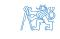


#### **Proof: Estimate is unbiased**
By the definition of unbiasedness:
$$\mathcal{E}\left\{\hat{x}(y) - x \mid x\right\} = \int (\hat{x}(y) - x) \, p(y \mid x) dy = 0$$

Taking the derivative with respect to $x$:
$$\frac{\partial}{\partial x} \int (\hat{x}(y) - x) \, p(y|x) dy = -\int p(y|x) dy + \int (\hat{x}(y) - x) \, \frac{\partial p(y|x)}{\partial x} \, dy = 0$$
The first term $\int p(y|x)dy = 1$. Using the log-derivative identity $\frac{\partial p}{\partial x} = p \frac{\partial \ln p}{\partial x}$, we obtain:
$$\int (\hat{x}(y) - x) \frac{\partial \ln I(x|y)}{\partial x} p(y|x) dy = 1$$

Applying the **Schwarz inequality** $\mathcal{E}\{f(y)g(y)\}^2 \leq \mathcal{E}\{f^2(y)\}\mathcal{E}\{g^2(y)\}$ to this result yields:
$$\int (\hat{x}(y)-x)^2 \, p(y|x) \, dy \times \int \left\{ \frac{\partial \ln I(x|y)}{\partial x} \right\}^2 p(y|x) \, dy = \sigma_{\tilde{x}}^2 \, F(x) \ge 1$$

**Interpretation:** The Fisher Information represents the "sharpness" or mean curvature of the log-likelihood function. A more curved likelihood function implies more information and thus a lower possible estimation error variance.


<!-- SECTION DELIMITER -->

# Properties of ML estimate (2)

In the frequentist framework, the Maximum Likelihood (ML) estimate possesses several desirable asymptotic and finite-sample properties. Two of the most critical properties are efficiency and consistency.

### **Efficiency and the Cramér-Rao Bound**
An estimate is said to be **efficient** if its error covariance reaches the theoretical lower bound defined by the inverse of the Fisher Information Matrix.
*   **Efficiency**: $P_{\tilde{x}} = F^{-1}$
    
This implies that no other unbiased estimator can have a lower variance than the ML estimate in these conditions.

### **Consistency**
An estimate is **consistent** if it converges in probability to the true value of the parameter as the number of observations $n$ increases to infinity.
*   **Consistency**: $P(\|x - \hat{x}(y_1, \dots, y_n)\| > \varepsilon) \to 0 \text{ for } n \to \infty$

---

### **Example: Repeated Measurement with Gaussian Noise (contd.)**

To illustrate these properties, we return to the linear measurement model with Gaussian noise.

#### **1. Calculating the Fisher Information Matrix**
Recall the log-likelihood function for the Gaussian case:
$$\ln I(x|y) = -\frac{1}{2}(y - Cx)^{T}R^{-1}(y - Cx) - \frac{n_{y}}{2}\ln(2\pi) - \frac{1}{2}\ln|R|$$

To find the Fisher Information, we examine the sensitivity of the log-likelihood with respect to the parameter $x$. The first derivative (the score function) is:
$$\frac{\partial \ln I(x|y)}{\partial x} = C^{T}R^{-1}(y - Cx)$$

The second derivative (the Hessian) represents the curvature of the log-likelihood:
$$\frac{\partial^{2}\ln I(x|y)}{\partial x^{2}} = -C^{T}R^{-1}C$$

The Fisher Information Matrix $F$ is defined as the negative expectation of the Hessian. Since the Hessian here is deterministic (independent of $y$), we have:
$$F = -\mathcal{E}\left\{ \frac{\partial^2 \ln I(x|y)}{\partial x^2} \right\} = C^T R^{-1} C$$

**Conclusion 1:** Since we previously derived that the ML error covariance is $P_{\tilde{x}_{ML}} = (C^T R^{-1} C)^{-1}$, it follows that $P_{\tilde{x}_{ML}} = F^{-1}$. Therefore, the ML estimate for this linear Gaussian model is **efficient**.

#### **2. Analyzing Convergence**
Consider a scalar case where we take $n$ independent measurements with variances $\sigma_i^2$. The total Fisher Information is the sum of the individual precisions:
$$F = P_{\tilde{\mathbf{x}}_{\mathsf{ML}}}^{-1} = \boldsymbol{C}^T \boldsymbol{R}^{-1} \boldsymbol{C} = \sum_{i=1}^{n} \frac{1}{\sigma_i^2}$$

As $n \to \infty$, provided the sum of precisions diverges (i.e., the measurements are not becoming infinitely noisy), the information $F$ grows to infinity.
$$\text{Therefore: } P_{\tilde{\mathbf{x}}_{\mathsf{ML}}} = \frac{1}{F} \to 0$$

**Conclusion 2:** As the error covariance vanishes with increasing data, the estimate $\hat{x}_{ML}(y)$ converges to the true value, proving the estimate is **consistent**.

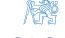


<!-- SECTION DELIMITER -->

# Comparison of MS and a ML estimate

In estimation theory, the **Minimum Square (MS)** and **Maximum Likelihood (ML)** estimators are two of the most fundamental tools. While they often yield similar results under Gaussian assumptions, they originate from different philosophical and mathematical frameworks.

#### **Linear Measurement Model**
Consider a standard linear measurement model where the observation $y$ is a linear combination of the unknown parameters $x$ and additive Gaussian noise $e$:
$$y = Cx + e, \quad e \sim \mathcal{N}(0, R)$$
Here, $C$ is the observation matrix and $R$ is the covariance matrix of the measurement noise.

---

#### **MS Estimate: Minimizing Parameter Error**
The Minimum Square (MS) estimator, often associated with Bayesian Minimum Mean Square Error (MMSE), focuses on minimizing the expected value of the squared error of the parameter itself.

*   **Objective**: Minimize the parameter error variance.
    $$J_{\mathsf{MS}} = \mathcal{E}\left\{ \left( x - \hat{x}_{\mathsf{MS}} \right)^{\mathsf{T}} \left( x - \hat{x}_{\mathsf{MS}} \right) \right\}$$
*   **Estimation Formula**:
    The MS estimate incorporates prior knowledge about $x$ (mean $\mu_x$ and covariance $P_{xx}$). The resulting posterior covariance $P_{\tilde{\mathbf{x}}_{\mathsf{MS}}}$ and the estimate $\hat{\mathbf{x}}_{\mathsf{MS}}$ are:
    $$P_{\tilde{\mathbf{x}}_{\mathsf{MS}}} = \left(P_{\mathsf{xx}}^{-1} + C^{\mathsf{T}} R^{-1} C\right)^{-1}$$
    $$\hat{\mathbf{x}}_{\mathsf{MS}} = \mu_{\mathsf{x}} + P_{\tilde{\mathbf{x}}_{\mathsf{MS}}} C^{\mathsf{T}} R^{-1} \left(y - C \mu_{\mathsf{x}}\right)$$

---

#### **ML Estimate: Minimizing Prediction Error**
The Maximum Likelihood (ML) estimator treats $x$ as a fixed but unknown constant. It seeks the value of $x$ that makes the observed data $y$ most probable.

*   **Objective**: Minimize the weighted prediction error (residual).
    $$J_{\mathsf{ML}} = \mathcal{E}\left\{ \left( y - C\hat{x}_{\mathsf{ML}} \right)^{\mathsf{T}} R^{-1} \left( y - C\hat{x}_{\mathsf{ML}} \right) \right\}$$
*   **Estimation Formula**:
    The ML estimate does not use prior information. Its covariance and state estimate are:
    $$P_{\tilde{\mathbf{x}}_{\mathsf{ML}}} = \left(C^{\mathsf{T}}R^{-1}C\right)^{-1}$$
    $$\hat{\mathbf{x}}_{\mathsf{ML}} = P_{\tilde{\mathbf{x}}_{\mathsf{ML}}}C^{\mathsf{T}}R^{-1}\mathbf{y}$$

#### **Relationship Between MS and ML**
The ML estimate can be viewed as a **limiting case of the MS estimate** when there is no prior information available (i.e., the prior uncertainty is infinite). Mathematically, this occurs when:
$$\mu_{\scriptscriptstyle \mathsf{X}} = 0, \quad P_{\scriptscriptstyle \mathsf{XX}}^{-1} = 0 \quad (\text{or } P_{\scriptscriptstyle \mathsf{XX}} \to \infty)$$

Conversely, the MS estimate can be interpreted as a **Regularized ML estimate**. By adding $P_{xx}^{-1}$ to the information matrix, we prevent numerical instability and incorporate prior beliefs:
$$P^{-1}_{\tilde{x}_{ML, reg}} = P^{-1}_{xx} + C^T R^{-1} C$$


---

#### **Deriving the MS Estimate Formulas**
To derive the MS covariance, we utilize the **Matrix Inversion Lemma (MIL)**:
$$(A + BCD)^{-1} = A^{-1} - A^{-1}B(C^{-1} + DA^{-1}B)^{-1}DA^{-1}$$

1.  **MS Covariance**:
    The posterior covariance can be expressed in terms of the prior $P_{xx}$ and the measurement update:
    $$P_{\tilde{x}_{MS}} = P_{xx} - P_{xy} P_{yy}^{-1} P_{yx} = P_{xx} - P_{xx} C^{T} (CP_{xx} C^{T} + R)^{-1} CP_{xx}$$
    Applying the MIL, this simplifies to the information form:
    $$P_{\tilde{x}_{MS}} = (P_{xx}^{-1} + C^{T} R^{-1} C)^{-1}$$

2.  **MS Mean**:
    The estimate is the prior mean adjusted by the innovation (the difference between actual and predicted measurements):
    $$\hat{x}_{MS} = \mu_{x} + P_{xy} P_{yy}^{-1} (y - \mu_{y}) = \mu_{x} + P_{xx} C^{T} (CP_{xx} C^{T} + R)^{-1} (y - C\mu_{x})$$
    Using the covariance relationship, this is often written as:
    $$\hat{x}_{MS} = \mu_{x} + P_{\tilde{x}_{MS}} C^{T} R^{-1} (y - C\mu_{x})$$

---

### Examples of ML estimates

#### **Alternative/Bernoulli Distribution**
Consider a coin-tossing experiment where we want to estimate the probability of success $\theta$.

*   **Model**: For a single trial $x \in \{0,1\}$, the probability mass function is:
    $$p(x|\theta) = \theta^{x}(1-\theta)^{1-x}$$
*   **Likelihood**: For $n$ independent trials, the joint likelihood is the product of individual probabilities:
    $$p_n(x|\theta) = \prod_{i=1}^n \theta^{x_i} (1-\theta)^{1-x_i}$$
*   **Log-Likelihood**:
    $$L_n(\theta) = \sum_{i=1}^n \{x_i \ln \theta + (1-x_i) \ln(1-\theta)\} = n\bar{X} \ln \theta + n(1-\bar{X}) \ln(1-\theta)$$
    where $\bar{X}$ is the sample average.
*   **Optimization**: Setting the derivative $\frac{dL_n(\theta)}{d\theta} = 0$ yields:
    $$\widehat{\theta}_{ML} = \bar{X}$$

**Conclusions**:
*   The ML estimate for a Bernoulli process is simply the **sample average**.
*   This estimate is computationally efficient and can be **updated recursively** as new data arrives.

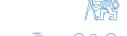

<!-- SECTION DELIMITER -->

# Examples of ML estimates (2)

#### Uniform Distribution
Consider a scenario where the data $x$ is drawn from a uniform distribution $U_{\theta}(x)$ centered at zero with an unknown boundary parameter $\theta$.

**Probability Density Function (PDF):**
The PDF for a single observation is defined as:
$$p(x|\theta) = \begin{cases} \frac{1}{2\theta} & \text{for } x \in [-\theta, \theta] \\ 0 & \text{otherwise} \end{cases}$$

**Likelihood Function:**
For $n$ independent and identically distributed (i.i.d.) observations $x_1, \dots, x_n$, the joint likelihood is the product of individual densities:
$$l_n(\theta) = p_n(x|\theta) = \left(\frac{1}{2\theta}\right)^n$$
This expression holds true only if **all** observed samples fall within the range $[-\theta, \theta]$. If even one sample $|x_i| > \theta$, the likelihood drops to zero.

**Conclusions:**
To maximize the likelihood $l_n(\theta)$, we need to choose the smallest possible $\theta$ that still satisfies the condition $|x_i| \leq \theta$ for all $i$.
*   **ML Estimate:** The estimate is defined by the maximum absolute value in the sample set:
    $$\widehat{\theta}_{\text{ML}} = \max_{i} |x_i|$$
*   **Recursive Update:** This estimate is easily updated as new data arrives: $\widehat{\theta}_{n} = \max(|\widehat{\theta}_{n-1}|, |x_n|)$.

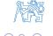

---

### Examples of ML estimates (3)

#### Cauchy Distribution
The Cauchy distribution is a symmetric distribution similar in shape to the Normal distribution but with "heavy tails." It is frequently used in robustness analysis because it is more likely to produce extreme outliers than a Gaussian model.

**Probability Density Function:**
The PDF for a single observation with location parameter $\theta$ is:
$$C_{\theta}(x) = \frac{1}{\pi \left(1 + (x - \theta)^2\right)}$$
For $n$ independent samples, the joint PDF is:
$$p_n(x|\theta) = \frac{1}{\pi^n} \prod_{i=1}^n \frac{1}{1+(x_i-\theta)^2}$$

**Log-Likelihood:**
To find the ML estimate, we take the natural logarithm to simplify the product into a sum:
$$L_n(\theta) = \ln p_n(x|\theta) = -n \ln \pi - \sum_{i=1}^n \ln \left(1 + (x_i - \theta)^2\right)$$
Maximizing $L_n(\theta)$ is equivalent to minimizing the summation term:
$$f(\theta) = \sum_{i=1}^n \ln \left(1 + (x_i - \theta)^2\right)$$

**Conclusions:**
*   **Numerical Solution:** Unlike the Gaussian case, the derivative of $f(\theta)$ results in a high-order polynomial. Consequently, there is no closed-form analytical solution; the estimate must be found using numerical optimization.
*   **Sufficient Statistics:** There are no "smaller" statistics (like the mean or variance) that can summarize the data. To compute the ML estimate, the entire raw dataset must be preserved.

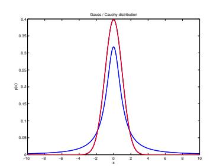
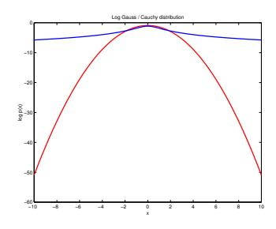


<!-- SECTION DELIMITER -->

# <span id="page-34-0"></span>**3. Bayesian method**

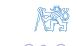

In the previous sections, we explored Maximum Likelihood (ML) estimation, which treats the parameter $\theta$ as a fixed but unknown constant. We now shift our perspective to **Bayesian Statistics**, a framework where parameters are treated as random variables. This allows us to quantify our uncertainty about the world using probability distributions.

### Classical vs. Bayesian Statistics

The distinction between these two schools of thought lies in the interpretation of probability and the nature of the parameters being estimated.

#### **Classical (Frequentist) Approach**
*   **Definition of Probability:** Probability is viewed as the long-run limit of the relative frequency of an event occurring over many repeated trials.
*   **Nature of Parameters:** Parameters are fixed, objective quantities. The "quality" of an estimate is judged by how it performs over an infinite data set (e.g., unbiasedness, consistency).
*   **Observer Independence:** The probability is an inherent property of the system, independent of the observer's prior knowledge.

#### **Bayesian Approach**
*   **Definition of Probability:** Probability density functions (p.d.f.) are used to describe two distinct concepts:
    *   **Randomness:** The "objective" variability found in a family of independent and identically distributed (i.i.d.) samples.
    *   **Uncertainty:** The "subjective" degree of belief regarding a single parameter's value.
*   **Rational Behavior:** Under uncertainty, the Bayesian framework posits that uncertainty follows the same mathematical structure as probability. It provides a formal tool for the **accumulation of information** as new data arrives.
*   **Finite Data Sets:** Unlike frequentist methods that often rely on asymptotic (infinite data) properties, Bayesian analysis is valid for any sample size, including very small data sets.

---

### Bayesian Inference

In Bayesian inference, we do not "estimate" a parameter in the sense of picking a single point; instead, we **calculate the posterior distribution**. This distribution represents our updated state of knowledge after observing data.

#### Elements of Bayes' Formula
The core of this method is the Bayes' formula, which relates the posterior probability to the likelihood and the prior:

$$p(\theta|y) = \frac{p(y|\theta) p(\theta)}{p(y)} = \frac{p(y|\theta) p(\theta)}{\int p(y|\theta) p(\theta) d\theta}$$

1.  **The Model (Likelihood):** $p(y|\theta)$ explains the observations $y_i$ based on the unknown parameter $\theta$. When viewed as a function of $\theta$ for a fixed $y$, it is called the **Likelihood** $l(\theta|y)$.
2.  **The Prior:** $p(\theta)$ is the subjective p.d.f. representing the statistician's knowledge before seeing the data.
3.  **The Posterior:** $p(\theta|y)$ is the updated knowledge.

#### Recursive Information Update
One of the most powerful features of Bayesian inference is its naturally recursive structure. As we receive a sequence of observations $y_1, y_2, \dots, y_n$, our knowledge is updated step-by-step:

$$p(\theta|y_1) \propto l(\theta|y_1)p(\theta)$$
$$p(\theta|y_1, y_2) \propto l(\theta|y_2)p(\theta|y_1)$$
$$\vdots$$
$$p(\theta|y_1, y_2, \dots, y_n) \propto l(\theta|y_n)p(\theta|y_1, y_2, \dots, y_{n-1})$$

**Key Conclusions:**
*   The **posterior p.d.f.** is always proportional to the **prior p.d.f.** multiplied by the **likelihood**.
*   The likelihood $l(\theta|y_i)$ captures **all information** about $\theta$ contained within the specific data point $y_i$.
*   The resulting p.d.f. effectively bridges the gap between the inherent randomness of observations and the subjective uncertainty of the parameter.

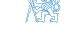

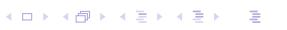

<!-- SECTION DELIMITER -->

# Bayesian Inference: The Unfair Coin Example

In Bayesian statistics, we treat parameters not as fixed unknown constants, but as random variables characterized by probability distributions. This example demonstrates how we update our belief about a parameter $\theta$ as we collect data from a series of Bernoulli trials (coin tosses).

#### **1. The Application of the Bayesian Formula**

Consider an experiment where the outcome $y$ is binary, $y \in \{0, 1\}$, representing a "tail" or a "head."

*   **The Model (Likelihood):** 
    The probability of observing a specific outcome $y$ given the parameter $\theta$ (the probability of heads) is defined by the Bernoulli distribution:
    $$P\{Y=1\} = \theta, \quad P\{Y=0\} = 1-\theta \implies p(y|\theta) = \theta^{y}(1-\theta)^{1-y}$$

*   **The Prior PDF:**
    Before observing any data, we assume a **non-informative prior**. If we have no reason to favor any specific value of $\theta$, we use a uniform distribution over the valid range $[0, 1]$:
    $$p(\theta) = 1 \quad \text{for } \theta \in [0, 1], \quad \text{otherwise } p(\theta) = 0$$

*   **The Recursive Update:**
    As we perform the $n$-th independent trial, we update our posterior distribution using Bayes' Rule. The posterior distribution after $n$ trials is proportional to the likelihood of the current observation multiplied by the previous posterior (which acts as the new prior):
    $$p(\theta|y_1,\dots,y_n) \propto \theta^{y_n} (1-\theta)^{1-y_n} p(\theta|y_1,\dots,y_{n-1})$$

#### **2. Evolution of the Posterior Distribution**

The following figures illustrate the evolution of the conditional probability density function (c.p.d.f.) for $\theta$ as the number of trials $n$ increases. In this simulation, the true underlying value is $\theta = 0.35$.


*Initial state: With $n=0$, the distribution is flat (Uniform prior).*


*Early trials ($n=1, 3, 5$): The distribution is wide, reflecting high uncertainty. The peak (mode) begins to shift toward the observed frequency of heads.*

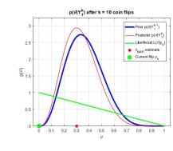
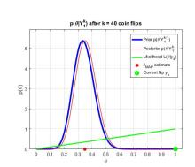
*Large sample sizes ($n=10, 40$): As more data is collected, the posterior distribution becomes narrower and taller. This indicates that our uncertainty is decreasing and the estimate is converging toward the true value of $0.35$.*

#### **3. Key Observations**

*   **Information Accumulation:** Each new data point $y_i$ "sharpens" the distribution. The variance of the posterior distribution decreases as $n \to \infty$.
*   **Dominance of Data:** While the prior reflects our initial guess, its influence diminishes as the number of observations increases. Eventually, the likelihood term dominates the posterior.
*   **Recursive Nature:** Bayesian inference is naturally suited for real-time estimation because the current posterior contains all the information from past data needed to process the next observation.


<!-- SECTION DELIMITER -->

# Bayesian Inference (2)

### Conjugated Priors
In Bayesian estimation, we leverage the naturally recursive character of the update rule:
$$p(\theta|y_1, y_2, \ldots, y_n) \propto l(\theta|y_n) p(\theta|y_1, y_2, \ldots, y_{n-1})$$

A **conjugated prior** is a specific choice of prior distribution such that the posterior distribution belongs to the same functional family as the prior. This property is highly desirable for several reasons:
*   **Analytic Invariance**: The mathematical form of the p.d.f. is preserved throughout the update process. For example, if we use a Normal prior with a Normal likelihood, the resulting posterior is also a Normal distribution.
*   **Computational Efficiency**: The **functional** recursion (updating the entire shape of the distribution) is reduced to a simple **algebraic** recursion on the parameters of the distribution (e.g., updating only the mean and covariance).

### The Chain Rule of Probability
The chain rule allows for the composition of uncertain information without requiring the assumption of independence between samples. This is particularly vital for time-dependent variables or dynamical systems:
$$\begin{aligned}
\rho(y_2, y_1) &= \rho(y_2|y_1) \rho(y_1) \\
\rho(y_3, y_2, y_1) &= \rho(y_3|y_2, y_1) \rho(y_2|y_1) \rho(y_1) \\
\rho(y_n, y_{n-1}, \dots, y_1) &= \prod_{k=2}^{n} \rho(y_k|y_{k-1}, \dots, y_1) \cdot \rho(y_1)
\end{aligned}$$


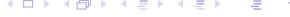

---

### Supplementary Reading: Selection of Prior p.d.f.
The core criticism of Bayesian statistics often centers on the subjectivity of the prior. However, several principles guide rational prior selection:

*   **Non-informative Priors**: These are "locally flat" relative to the likelihood function, representing a state of total ignorance.
*   **Principle of Stable Estimation**: As data accumulates, the information in the likelihood will eventually dominate the prior. If the prior continues to dominate after many samples, the experiment likely lacks sufficient informative power.
*   **Informative Priors**: These are used when prior knowledge exists (e.g., physical constraints). They can significantly improve transient properties, such as in parameter identification for adaptive control.

#### Jeffrey's Rule
To address the problem of parameterization (e.g., whether to estimate $\sigma$ or $\sigma^2$), Jeffrey proposed that the prior should be invariant to reparameterization. He suggested the prior p.d.f. be proportional to the square root of the **Fisher Information** $F(\theta)$:
$$p(\theta) \propto F(\theta)^{1/2} = \mathcal{E} \left\{ -\frac{\partial^2 \ln l(\theta|y)}{\partial \theta^2} \right\}^{1/2}$$
A prior is truly uniform only if the likelihood is "data translated" (its shape does not change with $\theta$, only its location).

### Example: Prior for a Scale Parameter
Assume we observe $y \sim \mathcal{N}(\mu, \sigma^2)$ where the mean $\mu$ is known, and we wish to estimate the scale parameter $\sigma$. The likelihood function is:
$$l(\sigma|\mu,y) \propto \sigma^{-n} e^{-\frac{ns^2}{2\sigma^2}}, \qquad s^2 = \frac{1}{n} \sum_{i=1}^{n} (y_i - \mu)^2$$
This likelihood is not "data translated" in $\sigma$. However, if we transform the coordinates to $\ln \sigma$, the likelihood $l(\ln \sigma | \mu, y)$ becomes data translated. Applying the transformation theorem:
$$p(\ln \sigma | \mu) \propto 1 \quad \to \quad p(\sigma | \mu) = p(\ln \sigma | \mu) \left| \frac{d \ln \sigma}{d\sigma} \right| \propto \sigma^{-1}$$
Thus, the non-informative prior for a scale parameter is $p(\sigma) \propto 1/\sigma$.


---

## Parameters of the Normal Distribution

### Estimation of $\mu$ for known $\sigma$
**Goal:** Determine the posterior $p(\mu| \sigma, y)$ given $n$ observations from $\mathcal{N}(\mu, \sigma^2)$.

1.  **Likelihood Function**: The joint probability of the data, centered around the sample average $\overline{y}$:
    $$l(\mu|\sigma,y) \propto \exp\left(-\frac{(\mu-\overline{y})^2}{2\sigma^2/n}\right)$$
2.  **Prior**: Using a non-informative prior $p(\mu|\sigma) \propto \text{const}$.
3.  **Posterior**: Multiplying the prior and likelihood yields a Normal distribution:
    $$p(\mu|\sigma,y) = \mathcal{N}\left(\overline{y}, \frac{\sigma^2}{n}\right)$$
This result aligns with classical statistics, where the sample average $\overline{y}$ is the best estimate of the mean, and its uncertainty decreases with $1/\sqrt{n}$.

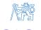

<!-- SECTION DELIMITER -->

# Parameters of normal distribution (2)

In this section, we extend the Bayesian framework to the case where both the mean $\mu$ and the standard deviation $\sigma$ of a normal distribution are unknown and must be estimated simultaneously.

### **Simultaneous estimate of $\mu$ and $\sigma$**

**Goal:** Our objective is to determine the joint posterior probability density function (p.d.f.) $p(\mu, \sigma | y)$ given a set of observations $y = [y_1, \dots, y_n]^T$.

#### **The Likelihood Function**
Assuming the data points $y_i$ are independent and identically distributed (i.i.d.) according to a normal distribution $\mathcal{N}(\mu, \sigma^2)$, the likelihood function is the product of the individual densities:

$$l(\mu, \sigma | y) = \prod_{i=1}^{n} \frac{1}{\sqrt{2\pi}\sigma} \exp\left(-\frac{(y_i - \mu)^2}{2\sigma^2}\right) \propto \sigma^{-n} \exp\left(-\frac{1}{2\sigma^2} \sum_{i=1}^{n} (y_i - \mu)^2\right)$$

To make this expression more manageable for Bayesian updating, we decompose the sum of squares in the exponent. By adding and subtracting the sample mean $\overline{y}$, we can rewrite the sum as:

$$\sum_{i=1}^{n} (y_i - \mu)^2 = \sum_{i=1}^{n} (y_i - \overline{y})^2 + n(\overline{y} - \mu)^2 = \nu s^2 + n(\overline{y} - \mu)^2$$

Here, we define the **sufficient statistics** that capture all the necessary information from the data:
*   **Sample Average:** $\overline{y} = \frac{1}{n} \sum_{i=1}^{n} y_i$
*   **Degrees of Freedom:** $\nu = n-1$
*   **Sample Variance:** $s^2 = \frac{1}{\nu} \sum_{i=1}^{n} (y_i - \overline{y})^2$

#### **Resulting Likelihood Form**
Substituting these statistics back into the likelihood expression, we obtain a form that clearly separates the influence of the mean and the variance:

$$l(\mu, \sigma | y) \propto \sigma^{-n} \exp\left(-\frac{1}{2} \frac{(\mu - \overline{y})^2}{\sigma^2/n} - \frac{\nu s^2}{2\sigma^2}\right)$$

This structure is particularly useful because the first term in the exponent resembles a normal distribution for $\mu$ (conditioned on $\sigma$), while the second term relates to the Inverse-Gamma distribution family for $\sigma^2$.

#### **Prior Selection**
To perform Bayesian inference without incorporating external subjective information, we use a **non-informative prior**. Following the logic of Jeffrey's rule for location and scale parameters:
*   For the location parameter $\mu$, we assume a flat prior: $p(\mu | \sigma) \propto \text{const}$.
*   For the scale parameter $\sigma$, we assume a prior proportional to its reciprocal: $p(\sigma) \propto \sigma^{-1}$.

Combining these, the joint prior is $p(\mu, \sigma) \propto \sigma^{-1}$. This choice ensures that the posterior is dominated by the data rather than the initial assumptions.

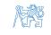

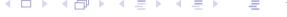

<!-- SECTION DELIMITER -->

# Parameters of normal distribution (3)

In the simultaneous estimation of the mean $\mu$ and standard deviation $\sigma$, the joint posterior probability density function (p.d.f.) captures the total uncertainty regarding both parameters after observing the data $y$.

### **The Joint Posterior P.D.F.**

By combining the likelihood function with the non-informative prior $p(\mu, \sigma) \propto \sigma^{-1}$, we arrive at the joint posterior distribution:

$$p(\mu, \sigma | y) = \left(\frac{n}{2\pi}\right)^{1/2} \frac{2}{\Gamma(\nu/2)} \left(\frac{\nu s^2}{2}\right)^{\nu/2} \sigma^{-(n+1)} \exp\left(-\frac{(\mu - \overline{y})^2}{2\sigma^2/n} - \frac{\nu s^2}{2\sigma^2}\right)$$

To ensure this is a valid p.d.f., it must integrate to 1. We can verify the normalization constants using the following standard integrals:
1.  **For the scale parameter ($\sigma$):** $\int_{0}^{\infty} x^{-(\nu+1)} e^{-a/x^{2}} dx = \frac{1}{2} a^{-\nu/2} \Gamma(\nu/2)$
2.  **For the location parameter ($\mu$):** $\int_{-\infty}^{\infty} e^{-\frac{1}{2\sigma^{2}}(x-\mu)^{2}} dx = \sqrt{2\pi}\sigma$

### **Factorization of the Posterior**

A powerful feature of Bayesian inference is the ability to decompose complex joint distributions into simpler components. The joint posterior can be factorized using the product rule:
$$p(\mu, \sigma | y) = p(\mu | \sigma, y) p(\sigma | y)$$

#### **1. Conditional p.d.f. for $\mu$**
If we assume the standard deviation $\sigma$ is known (or fixed), the distribution of the mean $\mu$ is Gaussian. It is centered at the sample average $\overline{y}$ with a variance scaled by the number of observations $n$:
$$p(\mu | \sigma, y) = (2\pi\sigma^2/n)^{-1/2} \exp\left(-\frac{(\mu - \overline{y})^2}{2\sigma^2/n}\right) = \mathcal{N}\left(\overline{y}, \frac{\sigma^2}{n}\right)$$

#### **2. Marginal p.d.f. for $\sigma$**
By integrating the joint p.d.f. over all possible values of $\mu$, we obtain the marginal distribution for $\sigma$. This represents our knowledge of the noise/scale parameter regardless of the specific value of the mean:
$$p(\sigma|y) = \frac{2}{\Gamma(\nu/2)} \left(\frac{\nu s^2}{2}\right)^{\nu/2} \sigma^{-(\nu+1)} \exp\left(-\frac{\nu s^2}{2\sigma^2}\right)$$
This result is related to the **Scaled Inverse Chi-Squared distribution**, specifically $\chi_{\nu}^2 \left(\frac{\nu s^2}{\sigma^2}\right)$. An important property of this distribution is that the expected value of the variance, given the data, is simply the sample variance: $E[\sigma^2 | y] = s^2$.

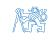

<!-- SECTION DELIMITER -->

# Parameters of normal distribution (3)

### **Marginal c.p.d.f. of** $\mu$ **for unknown** $\sigma$

In many practical scenarios, we are primarily interested in estimating the mean $\mu$, while the variance $\sigma^2$ is unknown. In Bayesian statistics, $\sigma$ is treated as a **nuisance parameter**—a variable that is necessary for the model but not the primary object of inference. To obtain the distribution of $\mu$ alone, we must "marginalize out" the uncertainty regarding $\sigma$.

The marginal posterior probability density function (p.d.f.) for $\mu$ is calculated by integrating the joint posterior $p(\mu, \sigma | y)$ over all possible values of $\sigma$:

$$p(\mu|y) = \int_0^\infty p(\mu|\sigma, y) p(\sigma|y) d\sigma$$

By substituting the normal conditional distribution for $\mu$ and the inverse-chi-squared marginal distribution for $\sigma$ (derived in the previous section) and applying the standard integral identities, we arrive at the normalized posterior for $\mu$:

#### **Normalized Posterior of** $\mu$

$$p(\mu|y) = \left(\frac{n}{\nu s^2}\right)^{1/2} \frac{\Gamma((\nu+1)/2)}{\Gamma(\nu/2)\Gamma(1/2)} \left[1 + \frac{n(\mu-\overline{y})^2}{\nu s^2}\right]^{-\frac{\nu+1}{2}}$$

This expression reveals that the uncertainty in $\mu$ follows a **Student t-distribution**. Specifically, the transformed variable $t$ follows a standard Student t-distribution with $\nu = n-1$ degrees of freedom:

$$t = \frac{\mu - \overline{y}}{s / \sqrt{n}} \sim \text{Student } t(\nu)$$

The p.d.f. of this $t$ variable is defined as:

$$p(t) = t\left(\overline{y}, s^2/n, \nu\right) = \left(\frac{1}{\nu}\right)^{1/2} \frac{\Gamma\left((\nu+1)/2\right)}{\Gamma(\nu/2)\Gamma(1/2)} \left[1 + \frac{t^2}{\nu}\right]^{-\frac{\nu+1}{2}}$$

### **Properties and Approximations**

The Student t-distribution is characterized by "heavier tails" than the normal distribution, reflecting the added uncertainty caused by not knowing the true variance $\sigma^2$. 

- **Convergence to Normal:** As the number of observations increases, our estimate of the variance becomes more precise. For large $\nu$ (typically $\nu > 10$), the Student t-distribution can be closely approximated by a normal distribution.
- **Mathematical Limit:** This relationship is rooted in the fundamental limit:
  $$e^{x} = \lim_{n \to \infty} \left( 1 + \frac{x}{n} \right)^{n}$$
  As $\nu \to \infty$, the term $[1 + \frac{t^2}{\nu}]^{-\frac{\nu+1}{2}}$ approaches the exponential form of the Gaussian kernel $e^{-t^2/2}$.


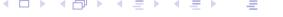

<!-- SECTION DELIMITER -->

# Sufficient statistics

In Bayesian estimation, we are often interested in how data informs our knowledge of unknown parameters. The concept of sufficient statistics allows us to compress large datasets into a small set of values without losing any information relevant to the estimation of those parameters.

#### **The Likelihood Principle**

The Likelihood Principle states that all the information about the unknown parameter $\theta$ contained within the data $y$ is provided by the likelihood function $l(\theta|y)$. In the Bayesian framework, the data affects the posterior distribution only through this likelihood:

$$p(\theta|y) \propto l(\theta|y) p(\theta)$$

This implies that if two different datasets yield proportional likelihood functions, they will result in the same posterior distribution for any given prior.

#### **Sufficient Statistics for the Normal Distribution**

When dealing with normally distributed data, we can identify specific summaries of the data that capture all necessary information for estimation.

1.  **Estimate of $\mu$ for a known $\sigma$:**
    If the variance $\sigma^2$ is known, the likelihood function for the mean $\mu$ is:
    $$l(\mu|\sigma,y) \propto \exp\left(-\frac{(\mu-\overline{y})^2}{2\sigma^2/n}\right)$$
    Here, the **sufficient statistics** for $\mu$ are the pair $\{\overline{y}, n\}$ (the sample mean and the number of observations). Any dataset with the same mean and size will result in the same estimate for $\mu$.

2.  **Simultaneous estimate of $\mu$ and $\sigma$:**
    When both parameters are unknown, the joint likelihood function is:
    $$l(\mu,\sigma|\,y) \propto \sigma^{-(n+1)} \exp\left(-\frac{(\mu-\overline{y})^2}{2\sigma^2/n} - \frac{(n-1)s^2}{2\sigma^2}\right)$$
    In this case, the **sufficient statistics** for the pair $\{\mu, \sigma\}$ are the triple $\{\overline{y}, s^2, n\}$, where $s^2$ is the sample variance.

**Key Properties:**
*   **Minimal Sufficient Statistic:** This is the statistic with the smallest possible dimension that still captures all information from the data.
*   **Finite Sufficient Statistics:** The existence of finite sufficient statistics is crucial for real-time estimation. It allows for the **accumulation of information** from an ever-growing stream of data within a limited memory space. This concept is mathematically analogous to the "state" of a dynamic system, where the current state summarizes all past inputs necessary to predict the future.

---

### Informative prior for $\sigma$

In many practical scenarios, we possess prior knowledge about the noise or variance of a system before observing new data. We can model this using an informative prior.

#### **A Thought Experiment**
Imagine we define our prior distribution $p(\sigma)$ based on a previous auxiliary dataset $y_a = [y_{a1}, \ldots, y_{a_{n_a}}]^T$. The posterior derived from that auxiliary data becomes our informative prior for the current experiment:

$$p(\sigma) = p(\sigma | y_a) \propto \sigma^{-(\nu_a + 1)} \exp\left(-\frac{\nu_a s_a^2}{2\sigma^2}\right)$$

#### **Updating with Actual Data**
When we combine this informative prior with new observed data $y$ (characterized by $\nu$ and $s^2$), the resulting posterior distribution for $\sigma$ maintains the same functional form:

$$p(\sigma|y) \propto \sigma^{-(\nu_a + \nu + 1)} \exp\left(-\frac{\nu_a s_a^2 + \nu s^2}{2\sigma^2}\right) = \sigma^{-(\overline{\nu} + 1)} \exp\left(-\frac{\overline{\nu} \, \overline{s}^2}{2\sigma^2}\right)$$

The updated parameters of the distribution are calculated as follows:
*   **Updated Degrees of Freedom:** $\overline{\nu} = \nu_a + \nu$
*   **Updated Combined Variance:** $\overline{\nu}\,\overline{s}^2 = \nu_a s_a^2 + \nu s^2$

Note that while the marginal distribution for $\sigma$ is updated, the functional form of the conditional distribution $p(\mu | \sigma, y)$ remains a normal distribution centered at the sample mean.

**Interpretation of Initial Statistics:**
*   $\nu_a$: Represents the **prior accuracy** or the "weight" given to prior knowledge, expressed in terms of an equivalent sample size.
*   $s_a^2$: Represents the **prior information** regarding the expected value of the variance $\sigma^2$.

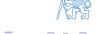

<!-- SECTION DELIMITER -->

# <span id="page-47-0"></span>**4. Parameter estimation**

In the previous sections, we explored the theoretical foundations of the normal distribution and the role of sufficient statistics. We now transition into the core of Bayesian inference: **Parameter Estimation**.

Parameter estimation is the process of using observed data to refine our knowledge of the internal constants (parameters) that govern a system's behavior. In a Bayesian framework, we do not treat parameters as fixed, unknown constants, but rather as random variables characterized by probability distributions.

### **The Estimation Workflow**

The estimation process typically follows a recursive or batch logic:
1.  **Prior Knowledge**: We begin with an initial belief about the parameters, represented by the prior distribution $p(\theta)$.
2.  **Data Collection**: We observe a set of measurements or data points $y$.
3.  **Likelihood Evaluation**: We determine how likely the observed data is, given specific parameter values, using the model $p(y|\theta)$.
4.  **Posterior Update**: Using Bayes' Rule, we combine the prior and the likelihood to form the posterior distribution $p(\theta|y)$, which represents our updated knowledge.


As we move forward into dynamic systems, this estimation process becomes the engine for **System Identification**. By continuously updating our parameter estimates as new inputs $u(t)$ and outputs $y(t)$ arrive, we can build adaptive models that "learn" the characteristics of a plant in real-time, providing the necessary information for optimal control laws.

<!-- SECTION DELIMITER -->

# <span id="page-47-0"></span>**4. Parameter estimation**


# Model of a dynamic system for control

In the context of control theory, the primary objective of system identification is to build a mathematical representation of a system that enables optimal or adaptive control. This process relies on observing the relationship between the system's inputs and outputs over time.

#### **Objective: System Identification for Optimal Control**
We aim to design a control law that minimizes a specific cost criterion based on the data observed up to the current time $t$. The data set available at time $t$, denoted as $\mathcal{D}^{t}$, consists of the history of all input variables $u$ and output variables $y$:

$$\mathcal{D}^{t} = \{u(0), y(0), \dots, u(t), y(t)\}$$

#### **Problem Formulation: The Optimal Control Law**
When designing a controller over a $T$-step future horizon, we seek to minimize an expected cost criterion $\mathcal{J}$. Because the future data $\mathcal{D}_{t+1}^{t+T}$ is unknown, we must evaluate the expectation of the cost function $J$ conditioned on our current knowledge $\mathcal{D}^{t}$:

$$\mathcal{J} = \mathcal{E}\left\{J\left(\mathcal{D}_{t+1}^{t+T}\right) \middle| \mathcal{D}^{t}\right\} = \int J\left(\mathcal{D}_{t+1}^{t+T}\right) \rho\left(\mathcal{D}_{t+1}^{t+T} \middle| \mathcal{D}^{t}\right) d\mathcal{D}_{t+1}^{t+T}$$

To solve this integral, we require the joint probability density function (p.d.f.) of all future inputs and outputs.

#### **Evaluating the Joint P.D.F. via the Chain Rule**
The joint p.d.f. $\rho\left(\mathcal{D}_{t+1}^{t+T} \middle| \mathcal{D}^{t}\right)$ can be decomposed using the chain rule of probability. This decomposition separates the system's behavior (the output given the input and history) from the controller's behavior (the input given the history):

$$
\begin{split} 
\rho\left( \left. \mathcal{D}_{t+1}^{t+T} \right| \mathcal{D}^{t} \right) &= \rho \left( y(t+T) | u(t+T), \mathcal{D}^{t+T-1} \right) \rho \left( u(t+T) | \mathcal{D}^{t+T-1} \right) \\ 
&\times \dots \\ 
&\times \rho \left( y(t+2) | u(t+2), \mathcal{D}^{t+1} \right) \rho \left( u(t+2) | \mathcal{D}^{t+1} \right) \\ 
&\times \rho \left( y(t+1) | u(t+1), \mathcal{D}^{t} \right) \rho \left( u(t+1) | \mathcal{D}^{t} \right) 
\end{split}
$$

In this product:
*   **$\rho(y(\cdot) | u(\cdot), \mathcal{D}^{(\cdot)})$**: Represents the **System Model**, describing how the system generates an output given the current input and past data.
*   **$\rho(u(\cdot) | \mathcal{D}^{(\cdot)})$**: Represents the **Control Law**, describing how the controller chooses an input based on the available history.

This probabilistic framework allows us to account for uncertainties in both the system dynamics and the future control actions when calculating the optimal control strategy.

<!-- SECTION DELIMITER -->

# Model of a Dynamic System for Control (2)

In the context of Bayesian system identification and adaptive control, we define the interaction between the controller and the plant using two fundamental sets of conditional probability density functions (c.p.d.f.).

1.  **Controlled System Model**: This is defined as the set of c.p.d.f. $p\left(y(t) \mid u(t), \mathcal{D}^{t-1}\right)$. It describes the probability of observing output $y(t)$ given the current input $u(t)$ and the historical data $\mathcal{D}^{t-1}$.
2.  **Control Law**: This is defined as the set of c.p.d.f. $p\left(u(t) \mid \mathcal{D}^{t-1}\right)$. It represents the strategy used by the controller to select the input $u(t)$ based solely on the available history.

### **Sampling Scheme and Causality**

The timing of information exchange is critical for maintaining causality in a closed-loop system. The information available at time $t$ determines the action taken, but there is an inherent information delay.


As illustrated in the diagrams above, the **system model acts as a predictor**. It attempts to forecast the system's future output by synthesizing the accumulated history of the process with the most recent control command.

---

### Model Structure and Parameters

When defining the predictor $p\left(y(t) \mid u(t), \mathcal{D}^{t-1}\right)$, we generally choose between two modeling philosophies:

*   **Non-parametric Models**: These are frequently used in Machine Learning (ML) and Artificial Intelligence (AI). They do not rely on a fixed set of parameters but rather on the data points themselves to define the mapping.
*   **Parametric Models**: These are preferred in classical system identification. By introducing a parameter vector $\theta$, we can compress the information from the data history into a finite set of values. This is computationally efficient and often aligns better with physical laws.

In the parametric framework, the predictor is calculated by marginalizing over the unknown parameters $\theta$:

$$p\left(y(t) \mid u(t), \mathcal{D}^{t-1}\right) = \int p\left(y(t) \mid u(t), \mathcal{D}^{t-1}, \theta\right) p\left(\theta \mid u(t), \mathcal{D}^{t-1}\right) d\theta$$

This integral highlights two distinct components of our knowledge:

1.  **Model Structure**: $p\left(y(t) \mid u(t), \mathcal{D}^{t-1}, \theta\right)$ defines how the output is generated if the parameters were known perfectly.
2.  **Knowledge of Parameters**: $p\left(\theta \mid u(t), \mathcal{D}^{t-1}\right)$ represents our current uncertainty regarding the true values of $\theta$, conditioned on the observed data and the current input.

<!-- SECTION DELIMITER -->

# **Update of parameter knowledge** based on new data $\{u(t), y(t)\}$

In the context of system identification and adaptive control, our knowledge of the system parameters $\theta$ is not static; it evolves as we collect more observations. This process is governed by Bayesian inference, where we update our prior beliefs about the parameters using new information from the input $u(t)$ and the resulting output $y(t)$.

The update rule is derived from Bayes' Theorem, expressing the posterior probability density function (p.d.f.) of the parameters given all data up to time $t$:

$$\rho\left(\theta \middle| \mathcal{D}^{t}\right) = \frac{\rho\left(y(t) \middle| u(t), \mathcal{D}^{t-1}, \theta\right) \rho\left(\theta \middle| u(t), \mathcal{D}^{t-1}\right)}{\rho\left(y(t) \middle| u(t), \mathcal{D}^{t-1}\right)}$$

Since the denominator $\rho(y(t) | u(t), \mathcal{D}^{t-1})$ acts as a normalizing constant (independent of $\theta$), we can express the relationship as a proportionality:

$$\rho\left(\theta \middle| \mathcal{D}^{t}\right) \propto \rho\left(y(t) \middle| u(t), \mathcal{D}^{t-1}, \theta\right) \rho\left(\theta \middle| \mathcal{D}^{t-1}\right)$$

### Components of the Update Equation

*   **Model Structure (Likelihood):** The term $\rho(y(t) | u(t), \mathcal{D}^{t-1}, \theta)$ represents the likelihood function. It defines how likely it is to observe the output $y(t)$ given the current input, the historical data, and a specific set of parameters $\theta$.
*   **Prior Knowledge:** The term $\rho(\theta | \mathcal{D}^{t-1})$ represents our knowledge of the parameters based on all information available up to the previous time step.

### The Natural Condition of Control Assumption
To simplify the recursive update, we typically employ the **Natural Condition of Control**. This assumption states that the choice of the current input $u(t)$ does not provide additional information about the internal parameters $\theta$ beyond what is already known from the past data $\mathcal{D}^{t-1}$. Mathematically, this is expressed as:

$$p\left(\theta \middle| u(t), \mathcal{D}^{t-1}\right) = p\left(\theta \middle| \mathcal{D}^{t-1}\right)$$

This assumption is crucial for separating the identification process (learning $\theta$) from the control synthesis process (choosing $u(t)$).


The figure above illustrates the recursive nature of this estimation: as the system operates in a closed loop, each new data pair $\{u(t), y(t)\}$ refines the parameter distribution, ideally leading to a reduction in uncertainty and more accurate future predictions.

<!-- SECTION DELIMITER -->

# Model structure and parameters (2)

In the context of system identification for adaptive control, we must define the relationship between the system parameters, the observed data, and the control actions. A fundamental concept in this framework is the "Natural Condition of Control."

#### **Natural Condition of Control**

The natural condition of control is a formal assumption regarding the independence of our parameter knowledge from the current control input. It is expressed mathematically as:

$$p\left(\theta \middle| u(t), \mathcal{D}^{t-1}\right) = p\left(\theta \middle| \mathcal{D}^{t-1}\right)$$

This identity states that the conditional probability density function (c.p.d.f.) of the parameters $\theta$, given the past data $\mathcal{D}^{t-1}$ and the current input $u(t)$, is identical to the c.p.d.f. based solely on the past data.

#### **Interpretation and Implications**

This condition carries significant weight in how we design and analyze adaptive controllers:

1.  **Independence of Parameter Knowledge**: The calculation or selection of the new input $u(t)$ does not provide additional information about the internal parameters $\theta$ of the system. 
    *   This is typically **valid** for an LQG (Linear Quadratic Gaussian) controller operating with incomplete state information, where the controller relies on the estimated state and parameters derived from past observations.
    *   This is generally **not true** for LQ control with complete state information if the control law is designed to be "dual"—meaning the control action is specifically chosen to excite the system to improve parameter estimation (probing).

2.  **Symmetry in Information**: The natural condition of control also implies that the control law does not depend on the true (unknown) parameters $\theta$ beyond what has already been learned from the data:
    $$p\left(u(t)\middle|\theta,\mathcal{D}^{t-1}\right)=p\left(u(t)\middle|\mathcal{D}^{t-1}\right)$$
    This suggests that the controller uses the available data $\mathcal{D}^{t-1}$ to form its strategy, and knowing $\theta$ directly (which is impossible in practice) would not change the distribution of the control law if the law is strictly based on the history of observations.

#### **Factorization of the Joint P.D.F.**

To understand the flow of information, we can look at two ways to factorize the joint probability density of the parameters and the current input:

$$\begin{split} \rho\left(\theta, u(t) \middle| \mathcal{D}^{t-1}\right) &= \rho\left(\theta \middle| u(t), \mathcal{D}^{t-1}\right) \rho\left(u(t) \middle| \mathcal{D}^{t-1}\right) \\ &= \rho\left(u(t) \middle| \theta, \mathcal{D}^{t-1}\right) \rho\left(\theta \middle| \mathcal{D}^{t-1}\right) \end{split}$$

Under the Natural Condition of Control, these factorizations simplify to:

$$\rho\left(\theta, u(t) \middle| \mathcal{D}^{t-1}\right) = \rho\left(\theta \middle| \mathcal{D}^{t-1}\right) \rho\left(u(t) \middle| \mathcal{D}^{t-1}\right)$$

This result confirms that, given the history $\mathcal{D}^{t-1}$, the current control input $u(t)$ and the parameters $\theta$ are conditionally independent. Consequently, all information relevant for the design of the control law is contained entirely within the observed data history $\mathcal{D}^{t-1}$.

<!-- SECTION DELIMITER -->

# Model structure and parameters (3)

In real-world control applications, systems are rarely perfectly stationary. Environmental changes, mechanical wear, or shifts in operating points mean that the parameters governing the system dynamics may evolve over time.

#### **Time-Varying Systems**

When the parameter vector $\theta$ is (slowly) time-varying, we denote it as $\theta(t)$. The predictive conditional probability density function (c.p.d.f.) must account for this uncertainty by integrating over the possible values of the current parameter state:

$$p\left(y(t) \mid u(t), \mathcal{D}^{t-1}\right) = \int p\left(y(t) \mid u(t), \mathcal{D}^{t-1}, \theta(t)\right) p\left(\theta(t) \mid u(t), \mathcal{D}^{t-1}\right) d\theta(t)$$

This formulation shows that the prediction of the output $y(t)$ depends on both the model structure (the first term in the integral) and our current estimate of the time-varying parameters (the second term).

---

#### **Update of Parameter c.p.d.f. in Two Steps**

To track time-varying parameters, we employ a recursive estimation strategy similar to the Kalman Filter, consisting of a **Data Update** and a **Time Update**.

**1. Data Update Step (Filtering)**
In this step, we incorporate the most recent observation $\{u(t), y(t)\}$ to refine our knowledge of the parameter $\theta(t)$. Using Bayes' formula:

$$\rho\left(\theta(t) \mid \mathcal{D}^{t-1}\right) \to \rho\left(\theta(t) \mid \mathcal{D}^{t}\right)$$

The posterior distribution is proportional to the product of the likelihood and the prior:
$$\rho\left(\theta(t) \mid \mathcal{D}^{t}\right) \propto \rho\left(y(t) \mid u(t), \mathcal{D}^{t-1}, \theta(t)\right) \rho\left(\theta(t) \mid \mathcal{D}^{t-1}\right)$$

**2. Time Update Step (Prediction)**
This step projects our parameter knowledge forward to the next time step $t+1$. It accounts for the fact that the parameters may have changed between observations:

$$p\left(\theta(t+1) \mid \mathcal{D}^t\right) = \int p\left(\theta(t+1) \mid \theta(t), \mathcal{D}^t\right) p\left(\theta(t) \mid \mathcal{D}^t\right) d\theta(t)$$

#### **Parameter Development Model**
In many practical scenarios, the exact physical law governing how $\theta(t)$ changes (the transition model $p(\theta(t+1) \mid \theta(t), \mathcal{D}^t)$) is unknown. In such cases, we replace the formal transition model with **heuristics**, such as **exponential forgetting**. This technique gives more weight to recent data and allows the estimator to "forget" obsolete information, effectively widening the distribution $p(\theta(t+1) \mid \mathcal{D}^t)$ to account for increased uncertainty.


<!-- SECTION DELIMITER -->

# Frequently used structures of input-output models

In system identification and control, we often represent physical processes using mathematical structures that relate observed inputs $u(t)$ and outputs $y(t)$. These models must account for both the deterministic dynamics of the system and the stochastic nature of noise.

#### **The Data Generator**

The most fundamental representation of a linear stochastic system is the state-space model. This serves as the "true" mechanism generating the observed data:

$$x(t+1) = Ax(t) + Bu(t) + v(t)$$
$$y(t) = Cx(t) + Du(t) + e(t)$$

In this formulation, $v(t)$ represents process noise (disturbances affecting the internal state) and $e(t)$ represents measurement noise. We assume these are white noise sequences with a joint covariance matrix:

$$\mathcal{E}\left\{\begin{bmatrix} v(t)\\ e(t) \end{bmatrix} \begin{bmatrix} v(t)\\ e(t) \end{bmatrix}^T\right\} = \begin{bmatrix} Q & 0\\ 0 & R \end{bmatrix}$$

#### **Output Data Properties**

From the state-space equations, we can derive the properties of the output data in the frequency domain (using the $z$-transform) or the time domain (using the delay operator $d = z^{-1}$).

1.  **Deterministic Part**: The input-output transfer function $G(z)$ describes how the input $u(t)$ affects the output $y(t)$:
    $$G(z) = C(zI - A)^{-1}B + D$$

2.  **Stochastic Part**: The noise characteristics are captured by the power spectral density $S_{yy}(z)$. Through spectral factorization, this can be represented by a noise-shaping filter $H(z)$:
    $$S_{yy}(z) = C(zI - A)^{-1}Q(z^{-1}I - A)^{-T}C^{T} + R = H(z)\Sigma_{e}H^{T}(z^{-1})$$

3.  **Generic I/O Description**: Combining these, any data generated by a linear system can be described by:
    $$y(t) = G(d)u(t) + H(d)e(t)$$

#### **Pulse Response Matrices**

The transfer functions $G(d)$ and $H(d)$ can be expanded into power series of the delay operator $d$, representing the system's pulse responses:

*   **Deterministic Transfer Function**: $G(d) = G_0 + G_1 d + G_2 d^2 + \cdots$
*   **Noise Shaping Filter**: $H(d) = I + H_1 d + H_2 d^2 + \cdots$

Note that $H(d)$ is typically **monic** (its first term is the identity matrix $I$), implying that the current noise $e(t)$ affects the current output $y(t)$ directly with a weight of unity.

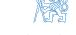


<!-- SECTION DELIMITER -->

# Frequently used structures of input-output models (2)

To design an effective controller, we require a **system model for control** that provides a predictive conditional probability density function (c.p.d.f.) $p(y(t) | u(t), \mathcal{D}^{t-1}, \theta)$. This model allows us to anticipate future outputs based on current inputs and historical data.

### **Equivalent "Data Generator" and "Predictor"**

The relationship between the physical data generator and the mathematical predictor is established through the properties of the noise shaping filter $H(d)$.

*   **Spectral Factorization**: By performing spectral factorization on the output power spectral density $S_{yy}(z)$, we can ensure that $H(d)$ is **stable** and **minimum phase**. This property is crucial because it guarantees that the inverse filter $H^{-1}(d)$ is also stable, allowing us to reconstruct the noise sequence from observed data.
*   **Noise Reconstruction**: If the model parameters $\theta$ are known, the white noise sequence $e(t)$ can be recovered from the input-output data:
    $$e(t) = H^{-1}(d) \Big( y(t) - G(d)u(t) \Big)$$

### **Output Prediction**
To predict the output $y(t)$, we decompose the system equation to separate the "past" information from the "new" stochastic innovation:

$$y(t) = G(d)u(t) + (H(d) - I)e(t) + e(t)$$

This can be rewritten in the form of a predictor plus an error term:
$$y(t) = \hat{y}(t | \mathcal{D}^{t-1}, u(t), \theta) + e(t)$$

In this formulation:
1.  The term $\hat{y}(t | \mathcal{D}^{t-1}, u(t), \theta)$ represents the **optimal prediction**.
2.  The term $(H(d) - I)e(t)$ depends strictly on past data $\mathcal{D}^{t-1}$ because $H(d)$ is monic (its first term is $I$), meaning $H(d)-I$ starts with a delay:
    $$(H(d) - I)e(t) = H_1e(t-1) + H_2e(t-2) + \cdots$$

For brevity, we often use the simplified notation:
$$\hat{y}(t | \mathcal{D}^{t-1}, u(t), \theta) = \hat{y}(t | t-1, u(t))$$

<span style="display:block; text-align:center;">

</span>

<span style="display:block; text-align:center;">

</span>

<!-- SECTION DELIMITER -->

# Frequently used structures of input-output models (3)

In the previous sections, we established that the noise sequence $e(t)$ can be recovered from observed data if the noise-shaping filter $H(d)$ is stable and minimum phase. We now extend this to derive the formal predictor equations used in control and estimation.

#### **The Predictor Equation**

The goal of a predictor is to determine the mean value of the output $y(t)$ given all information up to the previous time step $\mathcal{D}^{t-1}$ and the current input $u(t)$. This predicted mean value depends fundamentally on the noise properties of the system.

The general form of the predictor is given by:
$$\hat{y}(t|t-1, u(t)) = H^{-1}(d)G(d)u(t) + \left(I - H^{-1}(d)\right)y(t)$$

To understand the relationship between the **predictor dynamics** and the **data generator dynamics**, we can substitute the data generator equation $y(t) = G(d)u(t) + H(d)e(t)$ into the predictor formula:

$$\begin{aligned} \hat{y}(t|t-1, u(t)) &= H^{-1}(d)G(d)u(t) + (I-H^{-1}(d))(G(d)u(t) + H(d)e(t)) \\ &= G(d)u(t) + (H(d)-I)e(t) \end{aligned}$$

This derivation confirms that the prediction consists of the deterministic response to the input $u(t)$ plus a weighted sum of past noise terms (since $H(d)$ is monic, $H(d)-I$ contains only terms with delays $d, d^2, \dots$).

#### **Probabilistic Description**

From a probabilistic perspective, the actual output $y(t)$ is the sum of our best prediction and a stochastic innovation term $e(t)$:

$$y(t) = \hat{y}(t|t-1, u(t)) + e(t), \quad e(t) \sim p_e(\cdot)$$

Because $\hat{y}$ is a deterministic function of past data and the current input, the conditional probability density function (c.p.d.f.) of the output is simply a shifted version of the noise distribution. By applying the transformation of random variables, we obtain:

$$p(y(t)|u(t), \mathcal{D}^{t-1}, \theta) = p_{e}\left(y(t) - \hat{y}\left(t|t-1, u(t)\right)\right)$$

This result is powerful: it implies that if the noise $e(t)$ is Gaussian, the predictive distribution of the output is also Gaussian, centered at $\hat{y}$ with a variance equal to the noise variance $\sigma_e^2$. This forms the basis for Maximum Likelihood and Bayesian estimation methods.

<!-- SECTION DELIMITER -->

# ARX Model

### **The ARX Model Structure**
The **ARX model** (Auto-Regressive model with eXternal input) is one of the most fundamental structures in system identification. It describes a system using a linear difference equation combined with a stochastic noise term $e(t)$, typically assumed to be white noise with zero mean and variance $\sigma_e^2$.

The general form of the difference equation is:
$$y(t) + a_1 y(t-1) + \dots + a_{n_a} y(t-n_a) = b_0 u(t) + b_1 u(t-1) + \dots + b_{n_b} u(t-n_b) + e(t)$$

This is often referred to as an **equation error model** because the noise term $e(t)$ enters the equation directly as a residual error in the difference relationship.

#### **Polynomial Representation**
Using the delay operator $d$ (where $d \cdot y(t) = y(t-1)$), we can define the following polynomials:
*   $a(d) = 1 + a_1 d + \dots + a_{n_a} d^{n_a}$
*   $b(d) = b_0 + b_1 d + \dots + b_{n_b} d^{n_b}$

Here, $n_a$ and $n_b$ are the **structural parameters** (orders) of the model. The model can then be written compactly as:
$$a(d)y(t) = b(d)u(t) + e(t)$$

#### **Fractional Form and Transfer Functions**
By rearranging the equation, we obtain the fractional form:
$$y(t) = \frac{b(d)}{a(d)} u(t) + \frac{1}{a(d)} e(t)$$
In this structure:
*   The **deterministic transfer function** $G(d) = \frac{b(d)}{a(d)}$ can be chosen to represent the system dynamics.
*   The **noise shaping filter** $H(d) = \frac{1}{a(d)}$ is defined implicitly by the denominator of the deterministic part. This coupling is a limitation of ARX, as the noise and system dynamics share the same poles.


---

### **ARX Predictor**

To use the model for control or estimation, we derive the **one-step-ahead predictor**. Starting from the generic predictor form:
$$\hat{y}(t|t-1, u(t)) = H^{-1}(d)G(d)u(t) + \left(I - H^{-1}(d)\right)y(t)$$

Substituting $G(d) = \frac{b(d)}{a(d)}$ and $H(d) = \frac{1}{a(d)}$, we get:
$$\hat{y}(t|t-1,u(t)) = (1-a(d)) y(t) + b(d) u(t)$$
Expanding the polynomials, the prediction becomes a weighted sum of past observations and current/past inputs:
$$\hat{y}(t|t-1,u(t)) = -\sum_{i=1}^{n_a} a_i y(t-i) + \sum_{i=0}^{n_b} b_i u(t-i)$$

#### **Linear Regression Form**
The predictor can be written as a scalar product of a **parameter vector** $\theta$ and a **data vector (regressor)** $z(t)$:
*   $\theta = [a_1, a_2, \dots, a_{n_a}, b_0, b_1, \dots, b_{n_b}]^T$
*   $z(t) = [-y(t-1), -y(t-2), \dots, -y(t-n_a), u(t), u(t-1), \dots, u(t-n_b)]^T$

The predicted output is thus a **linear function of the parameters**:
$$\hat{y}(t|t-1) = z^{T}(t)\theta$$

Because of this linearity, ARX parameters can be estimated efficiently using **linear regression** (Least Squares). If the noise is Gaussian $e(t) \sim \mathcal{N}(0, \sigma_e^2)$, the conditional probability density of the output is:
$$p(y(t)|u(t),\mathcal{D}^{t-1},\theta) = \mathcal{N}\left(z^T(t)\theta, \sigma_e^2\right)$$


---

### **ARMAX Model**

The **ARMAX model** (Auto-Regressive Moving Average model with eXternal input) extends ARX by providing a more flexible description of the stochastic part using a **Moving Average (MA)** process for the noise.

The difference equation is:
$$y(t) + a_1 y(t-1) + \dots + a_{n_a} y(t-n_a) = b_0 u(t) + \dots + b_{n_b} u(t-n_b) + e(t) + c_1 e(t-1) + \dots + c_{n_c} e(t-n_c)$$

#### **Polynomial and Fractional Form**
Defining the monic polynomial $c(d) = 1 + c_1 d + \dots + c_{n_c} d^{n_c}$, the model is:
$$a(d)y(t) = b(d)u(t) + c(d)e(t) \quad \implies \quad y(t) = \frac{b(d)}{a(d)} u(t) + \frac{c(d)}{a(d)} e(t)$$
Unlike ARX, ARMAX allows for **independent properties** of the deterministic part $G(d)$ and the stochastic part $H(d) = \frac{c(d)}{a(d)}$, thanks to the additional $c(d)$ polynomial.

#### **ARMAX Predictor**
Using the generic predictor formula, the ARMAX predictor is:
$$\hat{y}(t|t-1) = \left(1 - a(d)\right)y(t) + b(d)u(t) + \left(c(d) - 1\right)\left(y(t) - \hat{y}(t|t-1)\right)$$
Note that the prediction now depends on previous **prediction errors** $\varepsilon(t-i) = y(t-i) - \hat{y}(t-i|t-i-1)$.


---

### **ARMAX Estimation and State-Space Equivalence**

#### **Pseudolinear Regression**
In ARMAX, the regressor $z(t)$ includes past prediction errors:
$$z(t) = [-y(t-1), \dots, -y(t-n_a), u(t), \dots, u(t-n_b), \varepsilon(t-1|t-2), \dots, \varepsilon(t-n_c|t-n_c-1)]^T$$
Since $\varepsilon$ depends on the parameters $\theta$, the prediction $\hat{y}(t|t-1) = z^T(t, \theta)\theta$ is **not a linear function of the parameters**. This requires **pseudolinear regression** or iterative optimization.

#### **State-Space Equivalence**
An ARMAX model can be represented in **observer canonical form**. By defining states to represent delayed terms, we can map the difference equation into:
$$x(t+1) = Ax(t) + Bu(t) + Ke(t)$$
$$y(t) = Cx(t) + Du(t) + e(t)$$
This highlights that ARMAX is essentially a state-space model where the noise enters through a specific gain $K$ (the Kalman gain in steady state).


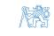

---

### **Output Error (OE) Model**

The **OE model** assumes that the stochastic component is simply measurement noise $e(t)$ added to the "true" output $x(t)$ of a deterministic system:
$$x(t) = \frac{b(d)}{a(d)} u(t), \quad y(t) = x(t) + e(t)$$
This results in $H(d) = 1$. The predictor is purely a simulation of the deterministic system:
$$\hat{y}(t|t-1) = \frac{b(d)}{a(d)} u(t) = b(d)u(t) + (1 - a(d))\hat{y}(t|t-1)$$
Like ARMAX, the OE predictor is non-linear in parameters because the regressor $z(t)$ contains past **predicted** values $\hat{y}$ rather than past **observed** values $y$.

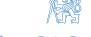

---

### **Incremental Models**

In many industrial applications, disturbances are not white noise but rather piecewise constant. This is modeled by assuming the noise is a **random walk**: $v(t) = v(t-1) + e(t)$.
By differencing the ARX equation, we obtain the **incremental model**:
$$\Delta y(t) + a_1 \Delta y(t-1) + \dots = b_0 \Delta u(t) + b_1 \Delta u(t-1) + \dots + e(t)$$
where $\Delta y(t) = y(t) - y(t-1)$. These models are crucial for control because they naturally lead to **integral action**, allowing the controller to compensate for constant load disturbances.

---

### **The Least Squares Method**

The history of parameter estimation is rooted in the **Least Squares (LS)** method, first applied by Gauss in 1795 to predict the orbit of Ceres. The goal is to minimize the sum of squared residuals:
$$V(\theta) = \sum e_k^2$$
In the context of system identification, this provides the foundation for batch processing of data to find the optimal $\theta$ that fits the observed input-output behavior.


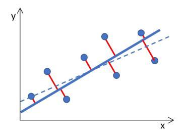

<!-- SECTION DELIMITER -->

# ARX model estimation (batch data processing)

In system identification, **batch processing** refers to the estimation of model parameters using a fixed, pre-collected set of data. This is in contrast to recursive estimation, where parameters are updated as each new data point arrives. For the ARX (Auto-Regressive with eXternal input) model, batch estimation typically relies on the Least Squares (LS) framework.

### **Batch Data Representation**

We begin with a set of observed data collected over a time horizon $T$:
$$\mathcal{D}_1^T = \{u(1), y(1), \dots, u(T), y(T)\}$$
*Note: Initial conditions (data prior to $t=1$) are required to populate the first few regressors but are generally treated as fixed constants in this notation.*

The ARX model assumes that the current output $y(t)$ is a linear combination of past outputs, current/past inputs, and a stochastic noise term:
$$y(t) = z^{T}(t)\theta + e(t), \quad e(t) \sim \mathcal{N}(0, \sigma_e^2), \quad \theta \in \mathcal{R}^n$$

Where:
*   $z(t)$ is the **regressor vector** containing past data.
*   $\theta$ is the **parameter vector** to be estimated.
*   $e(t)$ is the **equation error**, assumed here to be Gaussian white noise.

### **Compact Matrix Notation**

To solve for $\theta$ using the entire batch of data simultaneously, we stack the individual observations into a matrix-vector form:
$$Y = Z\theta + E$$

This compact notation is defined as follows:

1.  **Output Vector ($Y$):** A $T \times 1$ vector containing all observed outputs.
    $$Y = [y(1), y(2), \dots, y(T)]^T$$

2.  **Regressor (Data) Matrix ($Z$):** A $T \times n$ matrix where each row corresponds to the regressor vector at a specific time step.
    $$Z = \begin{bmatrix} z^T(1) \\ z^T(2) \\ \vdots \\ z^T(T) \end{bmatrix}$$
    In an ARX context, this matrix contains the lagged values of $y$ and $u$. Because it contains lagged outputs, $Z$ is often referred to as the "design matrix."

3.  **Prediction Error Vector ($E$):** A $T \times 1$ vector of the latent noise terms or residuals.
    $$E = [e(1), e(2), \dots, e(T)]^T$$

By formulating the problem this way, the task of parameter estimation becomes a search for the vector $\theta$ that best explains the observed $Y$ given the data $Z$, typically by minimizing the norm of the error vector $E$.

<!-- SECTION DELIMITER -->

# ARX model estimation (batch data processing) (2)

In the context of system identification, the Bayesian approach allows us to treat the model parameters as random variables. By combining prior knowledge with the observed data, we can derive the posterior distribution of the parameters.

#### **Bayesian estimate**

The starting point for the estimation is the **Likelihood function**. Given the ARX model structure $Y = Z\theta + E$ and assuming the noise $e(t)$ follows a Gaussian distribution $\mathcal{N}(0, \sigma_e^2)$, the likelihood of observing the data $Y$ for a given set of parameters $\theta$ and noise standard deviation $\sigma_e$ is:

$$l(\theta, \sigma_e | Y) \propto \sigma_e^{-T} \exp \left(-\frac{1}{2\sigma_e^2} (Y - Z\theta)^T (Y - Z\theta)\right)$$

where $T$ is the number of observations.

#### **Rearranging the Quadratic Form**
To find the most likely parameters, we decompose the quadratic term in the exponent. This algebraic manipulation separates the error into a part that depends on the parameter estimate and a part that represents the minimum achievable residual:

$$(Y-Z\theta)^T(Y-Z\theta) = (Y-\hat{Y})^T(Y-\hat{Y}) + (\theta-\hat{\theta})^TZ^TZ(\theta-\hat{\theta})$$

From this decomposition, we identify two critical components:

1.  **Parameter Estimate ($\hat{\theta}$):** The value that minimizes the quadratic form is the standard Least Squares solution:
    $$\hat{\theta} = (Z^T Z)^{-1} Z^T Y = P_{\theta} Z^T Y$$
    Here, $P_{\theta} = (Z^T Z)^{-1}$ is often related to the covariance of the estimate.

2.  **Output Prediction ($\hat{Y}$):** The predicted output vector based on the estimated parameters:
    $$\hat{Y} = Z\hat{\theta}$$

#### **Residual Sum of Squares and Degrees of Freedom**
The quality of the fit is measured by the variance of the residuals. We define the estimated noise variance $s^2$ as:

$$s^2 = \frac{1}{\nu} (Y - \hat{Y})^T (Y - \hat{Y}), \qquad \nu = T - n$$

where $\nu$ represents the **degrees of freedom**, calculated as the number of observations $T$ minus the number of estimated parameters $n$.

#### **Posterior Distribution**
By applying Bayes' rule with a non-informative (flat) prior, we obtain the **Posterior conditional probability density function (c.p.d.f.)** for the parameters $\theta$ and the noise standard deviation $\sigma_e$:

$$p(\theta, \sigma_e | \mathcal{D}^T) \propto \sigma_e^{-(T+1)} \exp\left(-\frac{\nu s^2}{2\sigma_e^2} - \frac{1}{2\sigma_e^2}(\theta - \hat{\theta})^T P_\theta^{-1}(\theta - \hat{\theta})\right)$$

This joint distribution provides a complete probabilistic description of our uncertainty regarding the model. The first term in the exponent relates to the noise variance (leading to an Inverse-Gamma or Chi-squared type distribution), while the second term shows that, for a fixed $\sigma_e$, the parameters $\theta$ follow a Gaussian distribution centered at $\hat{\theta}$.


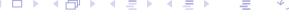

<!-- SECTION DELIMITER -->

# ARX model estimation (batch data processing) (3)

In the Bayesian framework, the joint posterior distribution of the parameters $\theta$ and the noise standard deviation $\sigma_e$ provides a complete statistical description of our uncertainty after observing the data $\mathcal{D}^T$. By analyzing this joint distribution, we can derive specific conditional and marginal distributions.

### Conditional Distribution of Parameters $\theta$

If the noise standard deviation $\sigma_e$ is assumed to be known, the conditional posterior probability density function (c.p.d.f.) of the parameter vector $\theta$ follows a **Multivariate Normal Distribution**.

$$p(\theta | \sigma_e, \mathcal{D}^T) = (\sqrt{2\pi}\sigma_e)^{-n} |P_\theta|^{-1/2} \exp\left(-\frac{1}{2\sigma_e^2} (\theta - \hat{\theta})^T P_\theta^{-1} (\theta - \hat{\theta})\right)$$

This is compactly expressed as:
$$p(\theta | \sigma_e, \mathcal{D}^T) = \mathcal{N}(\hat{\theta}, \sigma_e^2 P_\theta)$$

Where:
*   $\hat{\theta}$ is the mean (and mode) of the distribution, representing our best estimate.
*   $\sigma_e^2 P_\theta$ is the covariance matrix, where $P_\theta = (Z^T Z)^{-1}$ scales the uncertainty based on the information content of the regressor matrix $Z$.

### Posterior Distribution of Noise $\sigma_e$

The uncertainty regarding the noise level itself is captured by the marginal distribution of $\sigma_e$. This follows a specialized form related to the **$\chi$ (Chi) distribution** (specifically, an Inverse-Gamma type distribution for the variance).

$$p(\sigma_{e}|\ \mathcal{D}^{T}) = \frac{2}{\Gamma(\nu/2)} \left(\frac{\nu s^{2}}{2}\right)^{\nu/2} \sigma_{e}^{-(\nu+1)} \exp\left(-\frac{\nu s^{2}}{2\sigma_{e}^{2}}\right)$$

This can be mapped to the Chi-squared distribution:
$$p(\sigma_e | \mathcal{D}^T) = \chi_{\nu}^2 \left( \frac{\nu s^2}{2\sigma_e^2} \right)$$

The expected value for the noise variance, given the data, is represented by the sample residual variance:
$$\mathcal{E}\left\{\sigma_e^2|\mathcal{D}^T\right\} = s^2$$

### Marginal Distribution of Parameters $\theta$

In practice, $\sigma_e$ is rarely known. To find the distribution of $\theta$ independent of $\sigma_e$, we integrate (average) the joint distribution over all possible values of $\sigma_e$. This results in an **$n$-dimensional Student t-distribution** with $\nu = T - n$ degrees of freedom.

$$p(\theta | \mathcal{D}^T) \propto \left[ 1 + \frac{(\theta - \hat{\theta})^T P_{\theta}^{-1} (\theta - \hat{\theta})}{\nu s^2} \right]^{-(\nu + n)/2} = t_n \left( \hat{\theta}, s^2 P_{\theta}, \nu \right)$$

**Key Takeaway:** The Student t-distribution has "heavier tails" than the Normal distribution. This reflects the increased uncertainty in our parameter estimates because we are estimating the noise variance $s^2$ from the same finite data set used to estimate $\theta$. As the number of data points $T$ increases (and thus $\nu \to \infty$), this distribution converges to the Normal distribution.

<span style="display:block; text-align:center;">

</span>

<!-- SECTION DELIMITER -->

# ARX model estimation (batch data processing) (4)

In the evaluation of the AutoRegressive with eXogenous input (ARX) model, a critical consideration is whether the resulting parameter estimates are biased. The statistical properties of the estimate $\hat{\theta}$ depend heavily on the relationship between the regressor matrix $Z$ and the noise vector $E$.

#### Bias of ARX model parameter estimate

To determine if the estimate is unbiased, we examine the expected value of the Least Squares estimator $\hat{\theta} = (Z^T Z)^{-1} Z^T Y$. Substituting the system equation $Y = Z\theta + E$ into the estimator formula, we obtain:

$$\mathcal{E}\left\{\hat{\theta}\middle|\theta\right\} = \mathcal{E}\left\{(Z^TZ)^{-1}Z^T(Z\theta + E)\middle|\theta\right\} = \theta + \mathcal{E}\left\{(Z^TZ)^{-1}Z^TE\right\}$$

The estimate is considered **unbiased** if $\mathcal{E}\left\{(Z^TZ)^{-1}Z^TE\right\} = 0$. This condition is satisfied if the data matrix $Z$ is not correlated with the noise vector $E$.

**1. Finite Impulse Response (FIR) Models**
For an FIR model, the output is defined solely by past inputs and the current noise:
$$y(t) = \sum_{i=1}^{n_b} b_i u(t-i) + e(t)$$
In this case, the regressor vector $z(t)$ contains only input values $u(t-i)$. Since the inputs are typically assumed to be independent of the measurement noise $e(t)$, the regressor matrix $Z$ and the noise vector $E$ are uncorrelated. Consequently, the FIR model provides an **unbiased** estimate of $\theta$.

**2. General ARX Models**
In a general ARX model, the regressor vector $z(t)$ includes lagged versions of the output $y(t-1), y(t-2), \dots$. Because the output $y$ is itself a function of past noise terms, the data matrix $Z$ inevitably contains elements that are correlated with the noise vector $E$. Specifically:
$$\mathcal{E}\left\{ \left(Z^{T}Z\right)^{-1}Z^{T}E\right\} \neq 0$$
This correlation introduces a bias in finite samples. While the ARX estimate is often **consistent** (meaning the bias vanishes as the number of observations $T \to \infty$ under certain conditions), it is technically biased for small or batch data sets because the regressors are not strictly exogenous.

<!-- SECTION DELIMITER -->

# ARX model estimation - order selection

In the practical application of system identification, selecting the appropriate model order is a critical step. A model with too few parameters (underfitting) will fail to capture the system dynamics, while a model with too many parameters (overfitting) may model the stochastic noise rather than the underlying process.

To illustrate the challenges of order selection, consider a numerical example involving a 4th-order data generator.

### **Example: 4th-Order ARX System**

We define a ground-truth system with an ARX structure and a known noise variance $\sigma_e^2 = 0.25 \times 10^{-4}$. The system is characterized by the following polynomials in the delay operator $d$:

**Autoregressive (AR) Polynomial:**
The denominator polynomial $a(d)$ is constructed from four repeated poles at $0.8$, resulting in a 4th-order lag:
$$a(d) = (1 - 0.8d)^4 = 1 - 3.2d + 3.84d^2 - 2.05d^3 + 0.41d^4$$

**Exogenous (X) Polynomial:**
The numerator polynomial $b(d)$ defines the gain and zeros of the input-output relationship:
$$b(d) = 10^{-2} \times (3.2d + 4.8d^2 + 4.8d^3 + 3.2d^4)$$

In this configuration, the true order of the system is $n=4$. When performing estimation on data generated by this process, we must evaluate how different assumed orders (e.g., $n=2$ vs. $n=4$ vs. $n=6$) affect the accuracy of the parameter estimates and the resulting model behavior.


The figure above illustrates the simulated response of this 4th-order system. In the following sections, we will explore quantitative criteria—such as the Akaike Information Criterion (AIC) and residual analysis—to determine how to recover this "true" order from observed data.

<!-- SECTION DELIMITER -->

# ARX model estimation - order selection (2)

In the process of system identification, selecting the appropriate model order is a critical step. If the order is too low (underfitting), the model will fail to capture the underlying dynamics of the system. If the order is too high (overfitting), the model will begin to fit the stochastic noise in the data, leading to poor generalization on new datasets.

### **How to evaluate resulting model quality?**

To determine the optimal order for an ARX model, we utilize several statistical metrics that balance the fit of the model against its complexity.

#### 1. Residual Sum of Squares and Estimated Noise Variance
The most fundamental measure of fit is the residual sum of squares. Once the parameter estimate $\hat{\theta}$ is obtained, we can calculate the estimated noise variance, $s^2$. This value represents the portion of the output signal that the model cannot explain.

$$\sigma_e^2 \approx s^2 = \frac{1}{T-n} \left( Y - Z\hat{\theta} \right)^T \left( Y - Z\hat{\theta} \right)$$

Where:
*   $T$ is the number of data samples.
*   $n$ is the number of estimated parameters (model order).
*   $Y$ is the vector of observed outputs.
*   $Z\hat{\theta}$ represents the predicted outputs based on the estimated parameters.

As the model order $n$ increases, the residual variance $s^2$ typically decreases. However, a decreasing $s^2$ does not always mean a better model, as it may indicate overfitting.

#### 2. Akaike Information Criterion (AIC)
To prevent overfitting, we use the **Akaike Information Criterion (AIC)**. The AIC introduces a penalty term that increases with the number of parameters, effectively "penalizing" model complexity. The goal is to find the model order that minimizes the AIC value.

$$AIC = T\log(s^2) + 2n$$

In this formula:
*   $T\log(s^2)$ represents the log-likelihood of the model (how well the model fits the data).
*   $2n$ is the penalty term for the number of parameters $n$.

By minimizing the AIC, we seek a balance where the model is complex enough to capture the system dynamics but simple enough to remain robust.

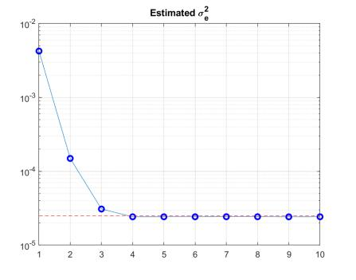

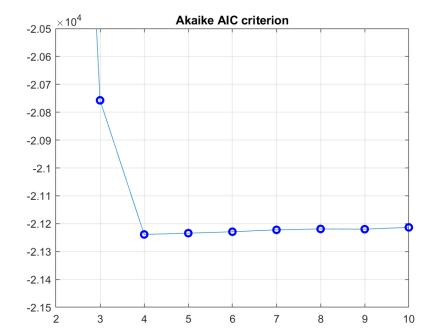

The figures above illustrate the trade-off between the fit (residual error) and the model order. Typically, you will observe that while the error $s^2$ continues to drop as the order increases, the AIC curve will reach a minimum and then begin to rise, indicating the point where additional parameters no longer provide a statistically significant improvement in model quality.

<!-- SECTION DELIMITER -->

# ARX model estimation - order selection (3)

### **How to evaluate resulting model quality (contd.)?**

Beyond the Akaike Information Criterion (AIC) and the residual sum of squares, several statistical tools allow us to assess whether a chosen model order is appropriate or if the model is capturing the underlying system dynamics effectively.

#### **1. Prediction Error Covariance Function**
One of the primary indicators of a "good" model is that the residuals (prediction errors) should behave like white noise. If the model has captured all the systematic information in the data, the remaining error $e(t)$ should be uncorrelated with its own past values. We evaluate this using the autocovariance function of the residuals:

$$R_{e,e}(k) = \mathcal{E}\left\{e(t)e(t+k)\right\} \approx \frac{1}{T-k}\sum_{t=1}^{T-k}e(t)e(t+k)$$

Where:
*   **$T$** is the total number of data points.
*   **$k$** is the lag (typically $k < K \ll T$).
*   If $R_{e,e}(k)$ is significantly non-zero for $k > 0$, it suggests that the model order is too low (underfitting), as there is still predictable structure left in the residuals.

#### **2. Parameter Significance and Confidence Intervals**
We must also determine if the estimated parameters $\hat{\theta}_i$ are statistically significant or if they are essentially zero (meaning the corresponding regressor does not contribute to the model). This is done by analyzing the parameter covariance matrix.

*   **Information Matrix:** $P_{\theta} = (Z^T Z)^{-1}$ reflects the geometry of the data.
*   **Scaled Covariance:** $P_{\theta \mid \sigma^2} = \sigma^2 (Z^T Z)^{-1}$ provides the theoretical variance of the estimates.
*   **Estimated Variance:** In practice, we use the estimated noise variance $s^2$ to approximate the variance of individual parameters:
    $$\text{cov } \{\theta_i\} \approx s^2 P_{\theta i, i}$$
    where $P_{\theta i, i}$ is the $i$-th diagonal element of $(Z^T Z)^{-1}$. If the estimate $\hat{\theta}_i$ is small relative to its standard deviation $\sqrt{\text{cov}\{\theta_i\}}$, the parameter may be redundant.

#### **3. Comparison: 2nd Order vs. 6th Order Models**
Comparing models of different complexities helps visualize the trade-off between bias and variance. A 2nd-order model might be too simple to capture the system's peaks (high bias), while a 6th-order model might begin to fit the noise (high variance/overfitting).

The following figures illustrate these diagnostic comparisons, including residual analysis and pole-zero maps for different model orders:

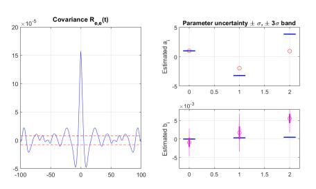


By examining the residual plots and the parameter significance, we can identify the "elbow" point where increasing the model order no longer yields a significant improvement in the residual white-noise properties, indicating the optimal order.

<!-- SECTION DELIMITER -->

# ARX model estimation - order selection (4)

### **Textbook example results**

In this section, we examine the practical application of order selection criteria using a controlled "textbook" scenario. In such examples, the true system structure is known, allowing us to validate how effectively our estimation tools—such as the **Akaike Information Criterion (AIC)** and **Residual Variance ($s^2$)**—identify the correct model order.

The data generator used for this demonstration follows a pure ARX (Auto-Regressive with eXogenous input) structure. Because the underlying system matches the model structure being tested, we expect the statistical metrics to behave predictably as the assumed model order $n$ increases.

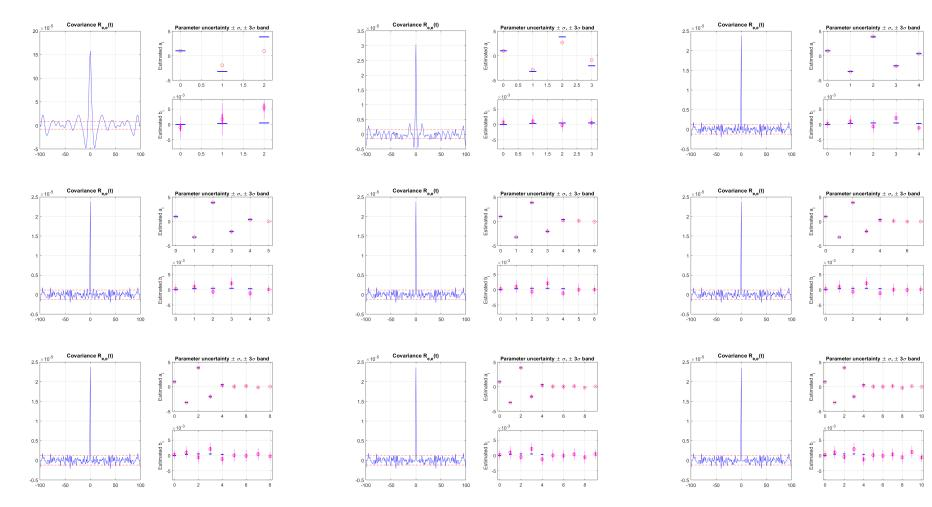

The figure above illustrates the typical behavior of the selection criteria:
1.  **Estimated Noise Variance ($s^2$):** As the model order increases, the residual sum of squares generally decreases. However, once the true order is reached, the decrease in $s^2$ becomes marginal, as the model begins to fit the stochastic noise rather than the underlying system dynamics.
2.  **AIC Curve:** The AIC introduces a penalty term $2n$ for model complexity. In this textbook case, the AIC curve typically shows a distinct minimum at the true order of the system. This "elbow" or minimum point provides a clear, objective justification for selecting a specific order, balancing the trade-off between bias (underfitting) and variance (overfitting).


The secondary visualization provides a comparison of the estimated parameters against the true coefficients of the data generator. In a textbook ARX example, when the correct order is selected, the parameter estimates $\hat{\theta}$ should converge closely to the true values, and the prediction errors should resemble white noise with a variance approximately equal to $\sigma_e^2$. 

These results confirm that for systems where the ARX assumption holds, the combination of residual analysis and information criteria provides a robust framework for system identification.

<!-- SECTION DELIMITER -->

# ARX model estimation - order selection (5)

### **More realistic example results**

In practical system identification, the true system rarely belongs to the exact model class being estimated. To demonstrate the robustness and limitations of ARX estimation, we consider a more realistic scenario where the data generator follows an **ARMAX** (Auto-Regressive Moving-Average with Exogenous inputs) structure.

Unlike the pure ARX model, which assumes the noise is white, the ARMAX model accounts for colored noise by including a moving-average component $C(d)$. In this specific example, the noise filter is defined as:
$$c(d) = 1 + d + d^2$$
where $d$ represents the delay operator. This implies that the current noise contribution is a weighted sum of the current and past two white noise terms, introducing significant correlation in the residuals.

When we fit an ARX model to data generated by an ARMAX process, we are dealing with **model plant mismatch**. Because the ARX structure lacks the $C(d)$ polynomial, the estimator must compensate for the colored noise by increasing the order of the $A(d)$ and $B(d)$ polynomials. This example serves to illustrate how order selection criteria (like AIC or residual analysis) behave when the "true" model is more complex than the structure we are assuming.

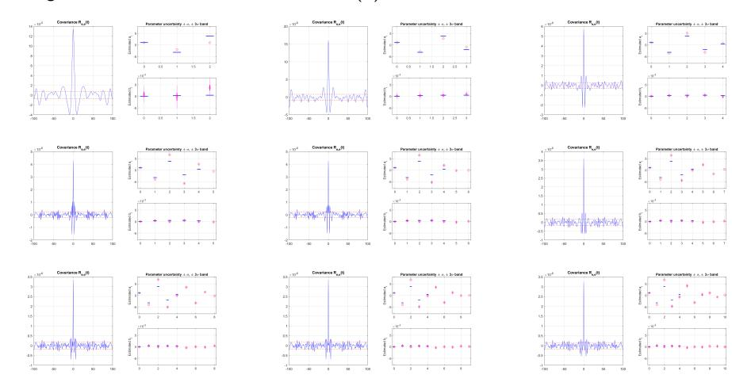

The figure above displays the results of this estimation. Key observations typically include:
*   **Bias in Parameters**: Due to the unmodeled noise dynamics, the estimates for the system's physical parameters may exhibit bias if the model order is too low.
*   **Residual Correlation**: The residuals of a low-order ARX fit will not be white, as they still contain the dynamics of the $C(d)$ polynomial.
*   **Order Inflation**: To achieve a "white" residual, the selection criteria may suggest a much higher model order than the physical system actually possesses, effectively using the AR (Auto-Regressive) part to approximate the MA (Moving-Average) noise component.

<!-- SECTION DELIMITER -->

# ARX Model Estimation (Recursive Data Processing)

In many real-time control and monitoring applications, it is impractical to wait for a full batch of data to arrive before estimating model parameters. Instead, we use **Recursive Least Squares (RLS)** or Bayesian recursive estimation. This approach updates our knowledge of the parameters $\theta$ and the noise variance $\sigma_e^2$ as each new data point $(y(t), u(t))$ becomes available.

### **The Conjugated Prior Distribution**

To perform recursive estimation in a Bayesian framework, we utilize a **conjugated prior distribution**. A prior is "conjugated" if the posterior distribution belongs to the same functional family as the prior. For the ARX model, the joint conditional probability density function (c.p.d.f.) of the parameters follows a Normal-Inverse-Gamma structure:

$$\rho\left(\theta, \sigma_{e} | \mathcal{D}^{t}\right) = \rho\left(\theta | \sigma_{e}, \mathcal{D}^{t}\right) \times \rho\left(\sigma_{e} | \mathcal{D}^{t}\right) = \mathcal{N}(\hat{\theta}(t), \sigma_{e}^{2} P(t)) \times \chi_{\nu(t)}^{2}\left(\frac{\nu(t) s^{2}(t)}{2\sigma_{e}^{2}}\right)$$

Where:
*   $\hat{\theta}(t)$ is the point estimate of the parameters at time $t$.
*   $P(t)$ is the normalized covariance matrix.
*   $s^2(t)$ is the estimate of the noise variance $\sigma_e^2$.
*   $\nu(t)$ represents the degrees of freedom (effectively the count of data samples processed).

### **The Data Update Step**

The transition from the previous estimate at time $t-1$ to the new estimate at time $t$ is governed by the Bayes formula. The posterior is proportional to the product of the likelihood of the new observation and the prior distribution:

$$p\left(\theta, \sigma_{e} | \mathcal{D}^{t}\right) \propto p\left(y(t) | \theta, \sigma_{e}, u(t), \mathcal{D}^{t-1}\right) p\left(\theta, \sigma_{e} | \mathcal{D}^{t-1}\right)$$

#### **Resulting Recursive Formulas**
By processing the algebra of the Bayesian update, we derive the following recursions for the model statistics:

1.  **Parameter Estimate Update:**
    $$\hat{\theta}(t) = \hat{\theta}(t-1) + \frac{P(t-1)z(t)}{1+\zeta(t)} \varepsilon(t|t-1)$$
2.  **Covariance Matrix Update:**
    $$P(t) = P(t-1) - \frac{P(t-1)z(t)z^{T}(t)P(t-1)}{1+\zeta(t)}$$
3.  **Residual Sum of Squares Update:**
    $$\nu(t)s^{2}(t) = \nu(t-1)s^{2}(t-1) + \frac{\varepsilon^{2}(t|t-1)}{1+\zeta(t)}$$
4.  **Degrees of Freedom Update:**
    $$\nu(t) = \nu(t-1) + 1$$

#### **Auxiliary Variables**
To simplify the calculation, we define the **prediction error** and the **normalized regressor norm**:
*   **Prediction Error:** $\varepsilon(t|t-1) = y(t) - z^{\mathsf{T}}(t)\hat{\theta}(t-1)$
*   **Scalar Gain Factor:** $\zeta(t) = z^{\mathsf{T}}(t)P(t-1)z(t)$

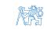

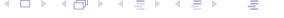

---

### **Mathematical Derivation of the Update**

The core of the recursive algorithm lies in the application of the Bayes formula to the likelihood function.

#### **The Likelihood Function**
The model assumes that the output $y(t)$ is normally distributed around the predicted value $z^T(t)\theta$ with variance $\sigma_e^2$:
$$\rho\left(y(t)|\theta,\sigma_e,u(t),\mathcal{D}^{t-1}\right) = \mathcal{N}(z^T(t)\theta,\sigma_e^2) \propto \sigma_e^{-1} \exp\left(-\frac{1}{2\sigma_e^2}(y(t)-z^T(t)\theta)^2\right)$$

#### **Application of Bayes Formula**
By substituting the likelihood and the prior into the Bayes relation, we obtain the functional form of the posterior:

$$\begin{split} \rho\left(\theta,\sigma_{e}|\mathcal{D}^{t}\right) &\propto \sigma_{e}^{-1}e^{-\frac{1}{2\sigma_{e}^{2}}(y(t)-z^{T}(t)\theta)^{T}(y(t)-z^{T}(t)\theta)} \\ &\times \sigma_{e}^{-\nu(t-1)} e^{-\frac{\nu(t-1)s^{2}(t-1)}{2\sigma_{e}^{2}}} \\ &\times \sigma_{e}^{-n}e^{-\frac{1}{2\sigma_{e}^{2}}(\theta-\hat{\theta}(t-1))^{T}P(t-1)^{-1}(\theta-\hat{\theta}(t-1))} \end{split}$$

By comparing the exponents of the left-hand side (the desired form at time $t$) and the right-hand side (the product of the likelihood and the prior at $t-1$), we can extract the algebraic recursions for the statistics $\hat{\theta}(t)$, $P(t)$, and $s^2(t)$.


<!-- SECTION DELIMITER -->

# Supplementary reading

## ARX model estimation (recursive data processing) (2)

In the Bayesian framework for recursive estimation, we update our knowledge of the parameters as each new data point arrives. By applying the Bayes formula and focusing on the exponents of the probability density functions, we can derive the recursive update laws for our statistics.

### Comparison of Parameter Functions

To find the update for the parameter vector $\theta$, we equate the terms in the exponent of the posterior distribution at time $t$ with the sum of the log-likelihood of the new observation and the prior distribution from time $t-1$. This leads to the following identity:

$$\begin{split} \nu(t) \, s^2(t) + \left(\theta - \hat{\theta}(t)\right)^T & P(t)^{-1} \left(\theta - \hat{\theta}(t)\right) = \\ & = \quad \nu(t-1) \, s^2(t-1) + \left(y(t) - z^T(t)\theta\right)^2 + \left(\theta - \hat{\theta}(t-1)\right)^T & P(t-1)^{-1} \left(\theta - \hat{\theta}(t-1)\right) \end{split}$$

This equation balances the residual sum of squares and the weighted quadratic distance of the parameters from their estimates.

### Updating the Normalized Covariance Matrix

The precision matrix (the inverse of the normalized covariance matrix $P$) is updated by adding the outer product of the current regressor vector $z(t)$:

$$P(t)^{-1} = P(t-1)^{-1} + z(t)z^{T}(t)$$

To avoid the computationally expensive operation of matrix inversion at every time step, we utilize the **Matrix Inversion Lemma (MIL)**, also known as the Woodbury matrix identity:

$$(A + BCD)^{-1} = A^{-1} - A^{-1}B(C^{-1} + DA^{-1}B)^{-1}DA^{-1}$$

By substituting $A = P(t-1)^{-1}$, $B = z(t)$, $C = 1$, and $D = z^T(t)$, we obtain the recursive formula for $P(t)$:

$$P(t) = P(t-1) - \frac{P(t-1)z(t)z^{T}(t)P(t-1)}{1 + z^{T}(t)P(t-1)z(t)}$$

This allows us to update the covariance matrix using only matrix-vector multiplications and scalar division.

### Updating the Parameter Mean Value

The estimate of the parameter vector $\hat{\theta}(t)$ is updated by correcting the previous estimate $\hat{\theta}(t-1)$ with the new information contained in the prediction error $(y(t) - z^{T}(t)\hat{\theta}(t-1))$. The update can be expressed in two equivalent forms:

$$\hat{\theta}(t) = \hat{\theta}(t-1) + P(t)z(t)(y(t) - z^{T}(t)\hat{\theta}(t-1))$$

By substituting the MIL expression for $P(t)$, we arrive at the standard Recursive Least Squares (RLS) update form:

$$\hat{\theta}(t) = \hat{\theta}(t-1) + \frac{P(t-1)z(t)}{1 + z^{T}(t)P(t-1)z(t)} (y(t) - z^{T}(t)\hat{\theta}(t-1))$$

Here, the term $\frac{P(t-1)z(t)}{1 + z^{T}(t)P(t-1)z(t)}$ acts as the estimator gain, determining how much the new prediction error influences the updated parameter estimate.


<!-- SECTION DELIMITER -->

# Supplementary reading

## ARX model estimation (recursive data processing) (3)

In the previous sections, we derived the recursive updates for the parameter vector $\hat{\theta}(t)$ and the normalized covariance matrix $P(t)$. To complete the Bayesian estimation framework, we must also update our knowledge regarding the noise variance $\sigma_e^2$.

### Updating Noise Statistics

By comparing the functions of the noise variance $\sigma_e$ in the posterior distribution, we derive the recursions for the degrees of freedom and the residual sum of squares.

*   **Degrees of Freedom ($\nu$):**
    The parameter $\nu(t)$ represents the "strength" of our evidence or the number of effective data samples processed. With each new observation, the degrees of freedom increase linearly:
    $$\nu(t) = \nu(t-1) + 1$$

*   **Residual Sum of Squares ($s^2$):**
    The point estimate of the noise variance, $s^2(t)$, is updated by incorporating the new prediction error. The update formula is:
    $$\nu(t)s^{2}(t) = \nu(t-1)s^{2}(t-1) + \frac{\varepsilon^{2}(t|t-1)}{1+z^{T}(t)P(t-1)z(t)}$$
    Here, $\varepsilon(t|t-1) = y(t) - z^T(t)\hat{\theta}(t-1)$ is the innovation (prediction error). The denominator $1+z^{T}(t)P(t-1)z(t)$ acts as a scaling factor that accounts for the uncertainty in the current parameter estimates.

**Note on Prediction Error Variance:**
It is useful to compare the update term with the expected value of the squared prediction error. Given the noise variance $\sigma_e^2$, the variance of the innovation is:
$$\mathcal{E}\left\{\left.\varepsilon^{2}(t|t-1)\right|\,\sigma_{e}\right\}=\sigma_{e}^{2}\left(1+z^{T}(t)P(t-1)z(t)\right)$$
This shows that the innovation variance is composed of the inherent system noise $\sigma_e^2$ and the additional uncertainty stemming from the estimation error of $\theta$.

### Initialization of Recursions

To begin the recursive process at $t=0$, we must define the prior hyperparameters. These reflect our initial knowledge (or lack thereof) before any data is observed:

*   **$s^2(0)$**: The prior estimate of the noise variance $\sigma_e^2$.
*   **$\nu(0)$**: The weight assigned to the prior variance, often interpreted as the size of a "virtual" auxiliary data sample.
*   **$\hat{\theta}(0)$**: The initial guess for the system parameters.
*   **$P(0)$**: The prior estimate of the parameter covariance matrix (normalized by $s^2(0)$). A large $P(0)$ (e.g., $10^3 I$) indicates high uncertainty, effectively making the estimator rely more on incoming data.

### The Stationary Assumption

In this standard ARX recursive formulation, we assume a **constant parameter model**:
$$\theta(t) = \theta = \text{constant}$$
Because the parameters are assumed not to change over time, a **Time Update Step** (common in Kalman Filtering) is not needed. We only perform the **Data Update Step** to refine our estimate of the fixed unknown constants.

<!-- SECTION DELIMITER -->

# ARX model estimation - recursive algorithm convergence

In the study of system identification, it is crucial to understand how recursive algorithms behave as more data becomes available. The recursive ARX (Auto-Regressive with Exogenous terms) estimation is not merely a heuristic; it is a mathematically rigorous way to update our knowledge of the system parameters.

#### **Batch vs. Recursive Results**
One of the most important properties of the recursive least squares (RLS) and Bayesian recursive estimation is that the **terminal values** of the recursive processing are mathematically equivalent to the results obtained from **batch processing**. 

If you have a fixed dataset $\mathcal{D}^T = \{y(t), u(t)\}_{t=1}^T$, the point estimate $\hat{\theta}(T)$ and the covariance matrix $P(T)$ calculated step-by-step will be identical to the estimates calculated by processing all $T$ samples at once, provided the initial conditions are consistent. This equivalence ensures that we do not lose any statistical information by choosing the computationally efficient recursive approach over the memory-intensive batch approach.

#### **Impact of Excitation**
The convergence of the parameter estimates $\hat{\theta}(t)$ to their true values depends heavily on the "richness" of the input signal, known as **Persistence of Excitation**.
- If the input $u(t)$ is sufficiently exciting, the information matrix $P(t)^{-1}$ grows with time, causing the normalized covariance matrix $P(t)$ to shrink toward zero.
- As $P(t) \to 0$, the uncertainty in our estimates vanishes, and the parameters converge to the true system values.
- If the system is poorly excited (e.g., the input is constant or zero), certain directions in the parameter space will remain uncertain, and $P(t)$ will not decrease in those directions.

#### **Uncertainty of $a_i$ vs. $b_i$ Parameters**
In an ARX model, we estimate two sets of parameters:
1.  **$a_i$ parameters**: These relate to the auto-regressive part (past outputs $y(t-i)$).
2.  **$b_i$ parameters**: These relate to the exogenous part (past inputs $u(t-i)$).

The rate of convergence and the final uncertainty levels often differ between these two sets. The uncertainty of $b_i$ is directly controlled by the experimental design (the choice of input $u(t)$). In contrast, the uncertainty of $a_i$ depends on the closed-loop behavior and the noise characteristics, as $y(t)$ is a stochastic process driven by both the input and the noise $e(t)$.

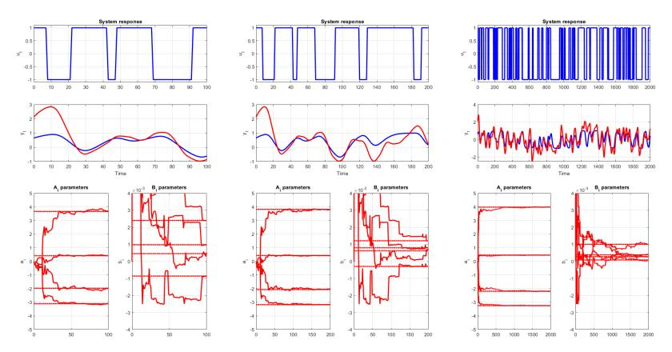

<span id="_page_78_Figure_5"></span>
*The figure above typically illustrates the convergence of parameter estimates over time. Notice how the estimates stabilize as the number of samples increases, and the confidence intervals (derived from $P(t)$) narrow, representing the reduction in parameter uncertainty.*

<!-- SECTION DELIMITER -->

# ARX model – tracking of time-varying parameters

In many practical control applications, the assumption that system parameters are constant over time is unrealistic. Systems may undergo changes due to wear and tear, varying environmental conditions, or shifts in operating points. To account for this, we transition from static parameters $\theta$ and $\sigma_e$ to time-varying notations $\theta(t)$ and $\sigma_e(t)$.

### **Slowly time-varying parameters**

When parameters change slowly relative to the sampling rate, we can adapt the recursive estimation framework to "track" these changes. This process is fundamentally divided into a **Data Update** step (incorporating new information) and a **Time Update** step (modeling how parameters evolve between samples).

#### **Data Update Step**
The data update is based on Bayes' rule. The posterior distribution of the parameters at time $t$, given all data up to that point $\mathcal{D}^t$, is proportional to the likelihood of the current observation $y(t)$ multiplied by the prior distribution (which is the prediction from the previous step):

$$\rho\left(\theta(t), \sigma_e(t)|\mathcal{D}^t\right) \propto \rho\left(y(t)|\theta(t), \sigma_e(t), u(t), \mathcal{D}^{t-1}\right) \rho\left(\theta(t), \sigma_e(t)|\mathcal{D}^{t-1}\right)$$

In this recursive framework, our knowledge of the system is encapsulated in four primary statistics that evolve from their predicted values (denoted by $t|t-1$) to their updated values (denoted by $t|t$):
$$\hat{\theta}(t|t-1), P(t|t-1), s^2(t|t-1), \nu(t|t-1) \rightarrow \hat{\theta}(t|t), P(t|t), s^2(t|t), \nu(t|t)$$

#### **Resulting Formulas for Statistics**
The recursive update equations for the ARX model parameters are derived as follows:

1.  **Mean Parameter Estimate:**
    $$\hat{\theta}(t|t) = \hat{\theta}(t|t-1) + \frac{P(t|t-1)z(t)}{1+\zeta(t|t-1)} \varepsilon(t|t-1)$$
    The new estimate is the old estimate plus a correction term weighted by the Kalman-like gain.

2.  **Normalized Covariance Matrix:**
    $$P(t|t) = P(t|t-1) - \frac{P(t|t-1)z(t)z^{T}(t)P(t|t-1)}{1+\zeta(t|t-1)}$$
    This update reduces the uncertainty in the parameter estimates as more data is processed.

3.  **Residual Sum of Squares and Degrees of Freedom:**
    $$\nu(t|t)s^{2}(t|t) = \nu(t|t-1)s^{2}(t|t-1) + \frac{\varepsilon^{2}(t|t-1)}{1+\zeta(t|t-1)}$$
    $$\nu(t|t) = \nu(t|t-1) + 1$$
    The degrees of freedom $\nu$ increment with every new data point, while the weighted residual variance $s^2$ is updated based on the prediction error.

#### **Auxiliary Variables**
To simplify the notation, we define the **prediction error** $\varepsilon$ and the **normalized regressor norm** $\zeta$:
*   **Prediction Error:** $\varepsilon(t|t-1) = y(t) - z^{T}(t)\hat{\theta}(t|t-1)$
    (The difference between the actual observed output and the output predicted by the previous model).
*   **Regressor Norm:** $\zeta(t|t-1) = z^{T}(t)P(t|t-1)z(t)$
    (A measure of the "informativeness" or "strength" of the current regressor $z(t)$ relative to the current parameter uncertainty).


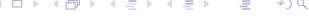

The figures above illustrate the dynamic nature of the estimation. As new data arrives, the probability density functions (PDFs) for the parameters shift and sharpen, allowing the model to converge toward the true (though potentially moving) parameter values.

<!-- SECTION DELIMITER -->

# ARX model – tracking of time-varying parameters (2)

In practical applications, system parameters are rarely truly constant. To track changes over time, we must define how the parameters evolve between observations.

### Time Update Step (The Naive Model)
The simplest assumption for parameter evolution is the **naive model** (or random walk with zero variance), which assumes the parameters do not change from one time step to the next:

$$\theta(t+1) \approx \theta(t)$$

Under this assumption, the predicted statistics for the next time step remain identical to the current filtered estimates:

$$\hat{\theta}(t+1|t) = \hat{\theta}(t|t), \quad P(t+1|t) = P(t|t)$$

### Parameter Tracking and the Kalman Gain
The ability of the recursive algorithm to adapt to new data is governed by the **Kalman gain**, $K(t)$. This gain determines how much the prediction error $\varepsilon$ influences the parameter update:

$$K(t) = \frac{P(t|t-1)z(t)}{1+\zeta(t|t-1)}$$

The gain is directly proportional to the normalized parameter covariance matrix $P(t|t-1)$. If the covariance is "large," the model is uncertain and places high weight on new data. If the covariance is "small," the model is confident in its current estimate and largely ignores new data.

### The Problem of Diminishing Excitation
For the estimator to remain "alert" and capable of tracking changes, the system must satisfy a **sufficient excitation condition**. This requires the information matrix (the inverse of the covariance matrix) to increase over time:

$$P(t|t-1)^{-1} = \sum_{\tau=1}^{t-1} z(\tau)z^{T}(\tau) > \alpha t I$$

As more data is collected ($t \to \infty$), the information matrix grows linearly with time. Consequently, the covariance matrix $P$ is upper-limited and vanishes toward zero:

$$P(t|t-1) < \frac{1}{\alpha t}I$$

**Conclusion:** In the naive model, as $t$ increases, $P(t|t-1) \to 0$. This causes the Kalman gain $K(t)$ to diminish to zero. Eventually, the algorithm "shuts down" its learning mechanism and becomes unable to track any subsequent parameter drifts. This is why the naive model is insufficient for time-varying systems.


<!-- SECTION DELIMITER -->

# ARX model – tracking of time-varying parameters (3)

In practical applications, system parameters are rarely constant. To track changes in the system dynamics over time, we must move beyond the "naive" recursive model (where parameters are assumed static) and introduce a mechanism that allows the model to adapt.

### Time Update – Conceptual Solution

The transition from the estimate at time $t$ to the prediction at time $t+1$ is governed by the **time update step**. Conceptually, this is solved using the Chapman-Kolmogorov equation, which propagates the posterior probability density function (p.d.f.) through a parameter development model:

$$p\left( \theta(t+1)|\mathcal{D}^t \right) = \int p\left( \theta(t+1)|\theta(t),\mathcal{D}^t \right) \; p\left( \theta(t)|\mathcal{D}^t \right) \; d \theta(t)$$

Here, the conditional p.d.f. $p\left(\theta(t+1)|\theta(t),\mathcal{D}^t\right)$ defines how we expect the parameters to evolve (e.g., as a random walk). The result of this convolution integral is typically an **increase in parameter uncertainty**, as we are essentially "blurring" our current knowledge to account for potential drift.

---

### Linear Forgetting

One specific way to model this parameter evolution is through **Linear Forgetting**, which assumes the parameters follow a random walk process.

#### Model of Parameter Drift
We assume the parameter vector $\theta$ changes by adding a zero-mean Gaussian noise term $\nu(t)$:

$$\theta(t+1) = \theta(t) + \nu(t), \qquad \nu(t) \sim \mathcal{N}\left(0; \sigma_e^2 V(t)\right)$$

#### Time Update of the Covariance Matrix
Under this model, the mean estimate remains the same, but the uncertainty (covariance) increases additively:

$$P(t+1|t) = P(t|t) + V(t)$$

**Key Characteristics:**
- **Directional Tracking:** If we have prior knowledge about which parameters are likely to change (or in which directions), we can incorporate this into the matrix $V(t)$.
- **Limitations:** This basic linear forgetting model typically assumes a constant noise variance $\sigma_e^2$; it does not inherently account for time-varying noise in the observation process.

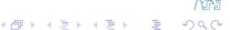

*The figure above illustrates the conceptual widening of the probability distribution during the time update, reflecting the loss of information as we project the estimate into the future.*

<!-- SECTION DELIMITER -->

# ARX model – tracking of time-varying parameters (4)

In the previous sections, we explored how a naive model fails to track parameters because the influence of new data diminishes over time. To maintain the estimator's sensitivity, we must introduce a mechanism to "forget" old information.

### **Exponential Forgetting**

Exponential forgetting is a technique that directly increases the uncertainty of both the parameter vector $\theta$ and the noise variance $\sigma_e^2$. This is achieved by flattening the posterior probability density function (pdf) from the previous step.

The conceptual time update step is defined as:
$$p\left( \theta(t+1)|\mathcal{D}^t \right) \propto p^\varphi\left( \theta(t)|\mathcal{D}^t \right), \qquad \varphi \in (0,\,1]$$

Where $\varphi$ is the **forgetting factor**. When $\varphi = 1$, we retain all information (standard RLS). When $\varphi < 1$, the exponentiation "spreads" the distribution, representing a loss of information.

#### **Resulting Statistics**
Applying this operation to the Gaussian-Inverse-Gamma distribution results in the following updates for the statistics:

1.  **Covariance Matrix:** $P(t+1|t) = \frac{1}{\varphi}P(t|t)$
    *   Since $\frac{1}{\varphi} \geq 1$, the uncertainty in $\theta$ increases by a multiplicative factor.
2.  **Parameter Estimate:** $\hat{\theta}(t+1|t) = \hat{\theta}(t|t)$
    *   The point estimate remains the same; only the confidence in it decreases.
3.  **Degrees of Freedom:** $\nu(t+1|t) + n + 1 = \varphi (\nu(t|t) + n + 1)$
    *   The "effective" number of observations is reduced.
4.  **Residual Sum of Squares:** $\nu(t+1|t)s^{2}(t+1|t) = \varphi \nu(t|t)s^{2}(t|t)$

#### **Properties and Selection of $\varphi$**
The forgetting factor determines the "memory" of the estimator. We can define an **effective sample size** ($t_{eff}$), which represents the length of the sliding data window the algorithm considers:
$$t_{eff} = \varphi(t_{eff} + 1) \implies t_{eff} = \frac{1}{1-\varphi}$$

*   **Example:** If $\varphi = 0.99$, the estimator effectively uses the last 100 data points.
*   **Trade-off:** A smaller $\varphi$ allows for faster tracking of rapidly changing parameters but makes the estimates more sensitive to noise (higher variance).


---

#### **Exponential Forgetting Formulas**

To derive the specific updates, we look at the conceptual solution for the joint time-update of parameters and noise variance:

$$p\left( \theta(t+1), \sigma_{\text{e}}(t+1)|\mathcal{D}^{t} \right) \propto \left. \rho^{\varphi}\left( \theta(t), \sigma_{\text{e}}(t)|\mathcal{D}^{t} \right) \right|_{\theta(t) = \theta(t+1), \ \sigma_{\text{e}}(t) = \sigma_{\text{e}}(t+1)}$$

By substituting the functional form of the Normal-Inverse-Gamma distribution, we compare the terms on both sides of the proportionality:

$$\sigma_e^{-(\nu(t+1|t)+1)}(t+1) e^{-\frac{\nu(t+1|t)s^2(t+1|t)}{2\sigma_e^2(t+1)}} \times \sigma_e^{-n}(t+1)e^{-\frac{1}{2\sigma_e^2(t+1)}}(\theta(t+1)-\hat{\theta}(t+1|t))^T P(t+1|t)^{-1}(\theta(t+1)-\hat{\theta}(t+1|t))$$
$$\propto \sigma_e^{-(\nu(t|t)+1)\varphi}(t+1) e^{-\frac{\nu(t|t)s^2(t|t)\varphi}{2\sigma_e^2(t+1)}} \times \sigma_e^{-n\varphi}(t+1)e^{-\frac{1}{2\sigma_e^2(t+1)}}(\theta(t+1)-\hat{\theta}(t|t))^T P(t|t)^{-1}\varphi(\theta(t+1)-\hat{\theta}(t|t))$$

By matching the quadratic forms in the exponents, we can extract the update for the inverse covariance matrix:
$$\theta^{T}(t+1) P(t+1|t)^{-1} \theta(t+1) = \theta^{T}(t+1) P(t|t)^{-1} \varphi \theta(t+1)$$
This confirms that $P(t+1|t)^{-1} = \varphi P(t|t)^{-1}$, or equivalently, $P(t+1|t) = \frac{1}{\varphi}P(t|t)$.

<!-- SECTION DELIMITER -->

# ARX Model with Forgetting: Combined Time-Update and Data-Update Step

When implementing recursive estimation for time-varying systems, it is often convenient to combine the **time-update** (which accounts for parameter drift/uncertainty increase) and the **data-update** (which incorporates new measurements) into a single step. However, one must be cautious with time indices to distinguish between predicted (a priori) and filtered (a posteriori) estimates.

### Combined Recursion for Predicted Values
These formulas update the prediction at the next time step $t+1$ based on information available at time $t$.

$$
\hat{\theta}(t+1|t) = \hat{\theta}(t|t-1) + \frac{P(t|t-1)z(t)}{1+\zeta(t|t-1)} \varepsilon(t|t-1)
$$
$$
P(t+1|t) = \frac{1}{\varphi} \left( P(t|t-1) - \frac{P(t|t-1)z(t)z^{T}(t)P(t|t-1)}{1+\zeta(t|t-1)} \right)
$$

### Combined Recursion for Filtered Values
These formulas provide the current estimate $\hat{\theta}(t|t)$ by updating the previous filtered estimate from $t-1$. Note the inclusion of the forgetting factor $\varphi$ within the denominator of the gain.

$$
\hat{\theta}(t|t) = \hat{\theta}(t-1|t-1) + \frac{P(t-1|t-1)z(t)}{\varphi + z^{T}(t)P(t-1|t-1)z(t)} \varepsilon(t|t-1)
$$
$$
P(t|t) = \frac{1}{\varphi} \left( P(t-1|t-1) - \frac{P(t-1|t-1)z(t)z^{T}(t)P(t-1|t-1)}{\varphi + z^{T}(t)P(t-1|t-1)z(t)} \right)
$$

#### Key Definitions
*   **Normalized Innovation Variance:** $\zeta(t|t-1) = z^{T}(t)P(t|t-1)z(t)$
*   **Posterior Variance Projection:** $\zeta(t|t) = z^{T}(t)P(t|t)z(t)$
*   **Prediction Error (Innovation):** $\varepsilon(t|t-1) = y(t) - z^{T}(t)\hat{\theta}(t|t-1)$
*   **Filtering Error:** $\varepsilon(t|t) = y(t) - z^{T}(t)\hat{\theta}(t|t)$


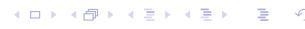

---

### Problems with Parameter Tracking

While exponential forgetting allows the model to adapt to changes, it introduces specific numerical and structural risks:

#### 1. Poor System Excitation
If the input signal does not sufficiently "excite" the system (e.g., in closed-loop control where the input is linearly dependent on the output), the regressor $z(t)$ may lack information in certain directions.
*   **Covariance Wind-up:** Information subject to forgetting is not replaced by new data. This leads to the unlimited growth of eigenvalues in the covariance matrix $P$ in "unexcited" directions, making the estimator extremely sensitive to noise.

#### 2. Possible Solutions
*   **Optimal Experiment Design:** Using external excitation signals to ensure the regressor spans the parameter space.
*   **Varying Forgetting Factor:** Adjusting $\varphi$ dynamically. For example, Fortesque (1981) proposed keeping the "information content" constant:
    $$\varphi(t) = 1 - \alpha \frac{\varepsilon^2(t|t-1)}{1 + \zeta(t|t-1)}$$
*   **Restricted Forgetting:** A concept introduced by Kulhavý (1987) where forgetting is applied only to the directions in the parameter space where new information is actually being received.

---

## Restricted Forgetting

Restricted forgetting aims to prevent covariance wind-up by only increasing uncertainty in directions where the data update has recently reduced it.

#### **Data Update Analysis**
To understand restricted forgetting, we analyze how the covariance matrix $P$ changes during a standard update:
1.  **Parameter Uncertainty:** Defined as $\tilde{\theta}(t|t-1) = \theta(t) - \hat{\theta}(t|t-1)$.
2.  **Directional Uncertainty:** The uncertainty of a scalar product $x^T\theta$ is given by $x^T P x$.
3.  **Covariance Update:** 
    $$P(t|t) = P(t|t-1) - \frac{P(t|t-1)z(t)z^{T}(t)P(t|t-1)}{1 + \zeta(t|t-1)}$$

*   **In the direction of the regressor $z(t)$:** The uncertainty is reduced by the factor $1/(1 + \zeta(t|t-1))$.
*   **In orthogonal directions $x(t) \perp_P z(t)$:** Where $x^T(t)P(t|t-1)z(t) = 0$, the uncertainty remains unchanged: $x^T(t)P(t|t)x(t) = x^T(t)P(t|t-1)x(t)$.


---

### Restricted Forgetting (2): Time Update

In the time update step, we apply a selective uncertainty increase. We only allow the parameters to "drift" in the direction of the current regressor $z(t)$.

**1. Direction of Regressor $z(t)$:**
We follow a drift model where the variance increases by $\zeta_{\nu}(t)$:
$$z^{T}(t)P(t+1|t)z(t) = \zeta(t|t) + \zeta_{\nu}(t)$$
where $\zeta_{\nu}(t) = z^{T}(t)V(t)z(t)$.

**2. Orthogonal Directions:**
We ensure no uncertainty increase: $x^{T}(t)P(t+1|t)x(t) = x^{T}(t)P(t|t)x(t)$.

**3. Restricted Drift Covariance Matrix:**
This selective increase is achieved by constructing the drift covariance matrix $V(t|t)$ as:
$$V(t|t) = \frac{\zeta_{\nu}(t)}{\zeta^{2}(t|t)} P(t|t) z(t) z^{T}(t) P(t|t)$$

**Validation:**
*   Multiplying by $z^T$ and $z$ yields exactly $\zeta_{\nu}(t)$.
*   Multiplying by an orthogonal vector $x^T$ (where $x^T P z = 0$) yields $0$, confirming that uncertainty is preserved in all other directions.


<!-- SECTION DELIMITER -->

# Restricted Forgetting

In the context of tracking time-varying parameters in ARX models, standard exponential forgetting can lead to "covariance wind-up" if the system is not sufficiently excited. Restricted forgetting addresses this by selectively increasing uncertainty only in directions where new information is being received.

### **Restricted Linear Forgetting**

To implement restricted forgetting, we first recall the relationship for the Kalman gain $K(t)$, which relates the prior covariance $P(t|t-1)$ to the posterior covariance $P(t|t)$:

$$P(t|t)z(t) = \frac{P(t|t-1)z(t)}{1+\zeta(t|t-1)} = K(t)$$

Here, $\zeta(t|t-1) = z^T(t)P(t|t-1)z(t)$ represents the prior uncertainty in the direction of the regressor $z(t)$. In the restricted linear forgetting (LF) framework, the drift covariance matrix $V(t|t)$ is constructed to act only in the direction of the Kalman gain:

$$V(t|t) = P(t|t)z(t) \frac{\zeta_{\nu}(t)}{\zeta^{2}(t|t)} z^{T}(t)P(t|t) = K(t)\frac{\zeta_{\nu}(t)}{\zeta^{2}(t|t)}K^{T}(t)$$

This ensures that parameter drift is only modeled in the subspace spanned by the current data, preventing the uncontrolled growth of uncertainty in unexcited directions.

### **Restricted Exponential Forgetting**

We can derive a restricted version of exponential forgetting (EF) by finding an equivalent parameter drift model. For standard EF, the drift is implicitly $V(t) = \frac{1-\varphi}{\varphi} P(t|t)$, which implies a directional uncertainty increase of:

$$\zeta_{\nu}(t) = \frac{1-\varphi}{\varphi} \zeta(t|t)$$

By substituting this specific $\zeta_{\nu}(t)$ into the restricted drift formula, we obtain the restricted drift covariance matrix for exponential forgetting:

$$V(t|t) = K(t) \frac{\frac{1-\varphi}{\varphi}\zeta(t|t)}{\zeta^2(t|t)} K^{T}(t) = K(t) \frac{1-\varphi}{\varphi\zeta(t|t)} K^{T}(t)$$


### **Combined Update Step**

The time-update and data-update steps can be merged into a single recursive formula for the covariance matrix. This combined step is expressed as:

$$P(t+1|t) = P(t|t-1) - \frac{P(t|t-1)z(t)z^{T}(t)P(t|t-1)}{\alpha(t)^{-1} + \zeta(t|t-1)}$$

where the scalar $\alpha(t)$ determines the nature of the update:

$$\alpha(t) = \frac{\varphi(1+\zeta(t|t-1))-1}{\zeta(t|t-1)}$$

Using the Matrix Inversion Lemma (MIL), we can see that $\alpha(t)$ acts as the weight of the $z(t)z^T(t)$ dyad in the information matrix update:

$$P(t+1|t)^{-1} = P(t|t-1)^{-1} + \alpha(t)z(t)z^{T}(t)$$

*   **Uncertainty Increase:** If $\varphi < \frac{1}{1+\zeta}$, then $\alpha(t) < 0$, and the update increases uncertainty (forgetting).
*   **Uncertainty Reduction:** If $\varphi > \frac{1}{1+\zeta}$, then $\alpha(t) > 0$, and the update reduces uncertainty (learning).

This approach limits forgetting to a single direction. We can define an equivalent directional forgetting factor:
$$\varphi(t|t) = \frac{\zeta(t|t)}{\zeta(t|t) + \zeta_{\nu}(t)}$$
This factor is derived from the LF model but can also be applied to the statistics of the noise variance $\sigma_e^2$.


## Numerical Implementation of Bayesian Estimation Algorithms

To ensure numerical stability (e.g., maintaining positive definiteness of covariance matrices), Bayesian algorithms often use factorized forms.

### **Conditioning for Gaussian Variables**

Consider a joint Gaussian distribution for the output $y$ and parameters $x$:

$$\rho\left(\left[\begin{array}{c}\mathbf{y}\\\mathbf{x}\end{array}\right]\right) = \mathcal{N}\left(\left[\begin{array}{c}\mu_{y}\\\mu_{x}\end{array}\right]; \left[\begin{array}{c}P_{yy} & P_{yx}\\P_{xy} & P_{xx}\end{array}\right]\right)$$

We perform an **LD-factorization** on the joint covariance matrix:

$$\begin{bmatrix} P_{yy} & P_{yx} \\ P_{xy} & P_{xx} \end{bmatrix} = \begin{bmatrix} L_y & 0 \\ K & L_{x|y} \end{bmatrix} \begin{bmatrix} D_y & 0 \\ 0 & D_{x|y} \end{bmatrix} \begin{bmatrix} L_y^T & K^T \\ 0 & L_{x|y}^T \end{bmatrix}$$

Where $L$ matrices are monic lower triangular and $D$ matrices are diagonal. The conditional mean $\mu_{x|y}$ and covariance $P_{x|y}$ are then given by:

$$\mu_{x|y} = \mu_x + P_{xy}P_{yy}^{-1}(y - \mu_y)$$
$$P_{x|y} = P_{xx} - P_{xy}P_{yy}^{-1}P_{yx}$$

By substituting the LD factors:
*   $P_{yy} = L_y D_y L_y^T$
*   $P_{xy} = K D_y L_y^T$
*   $P_{xx} = K D_y K^T + L_{x|y} D_{x|y} L_{x|y}^T$

This factorization allows for efficient and robust computation of the Kalman update.


<!-- SECTION DELIMITER -->

# Numerical implementation of bayesian estimation algorithms (2)

#### Conditioning for Gaussian variables – Results

When performing Bayesian estimation, we often need to derive the conditional distribution of parameters given new data. For Gaussian variables, the $LD$-factorization of the joint covariance matrix provides a numerically robust way to extract both marginal and conditional statistics.

Starting with the joint $LD$-factors:
$$\left| \left[ \begin{array}{c} d_y \\ d_{x|y} \end{array} \right]; \left[ \begin{array}{cc} L_y^T & K^T \\ 0 & L_{x|y}^T \end{array} \right] \right|$$

We can identify the following components:

*   **Factors of the marginal covariance matrix $P_y$:**
    The uncertainty regarding the output $y$ (before observing its actual value) is captured by:
    $$P_{y} = L_{y}D_{y}L_{y}^{T} = \left| d_{y}; L_{y}^{T} \right|$$

*   **Factors of the conditional covariance matrix $P_{x|y}$:**
    After observing $y$, the remaining uncertainty in $x$ (the parameters) is represented by the conditional covariance. The $LD$-factors are directly available from the lower block of the joint factorization:
    $$P_{x|y} = L_{x|y} D_{x|y} L_{x|y}^T = |d_{x|y}; L_{x|y}^T|$$

*   **Conditioned Mean $\mu_{x|y}$:**
    The updated estimate (mean) of $x$ given the observation $y$ is calculated as:
    $$\mu_{x|y} = \mu_x + KL_y^{-1}\varepsilon$$
    where $\varepsilon = y - \mu_y$ represents the **prediction error** or innovation.

#### Practical Implementation Notes

In the **scalar case** (where $y$ is a single measurement), the term $L_y$ simplifies to $1$. Consequently, the term $KL_y^{-1}$ simplifies directly to $K$, which corresponds to the **Kalman Gain**. 

The primary advantage of this approach is numerical stability. Rather than performing a full $LD$-factorization at every time step—which is computationally expensive—we implement a **direct update of the $LD$-factors**. This ensures that the covariance matrix remains positive-definite even in the presence of round-off errors, a common failure point in standard Kalman Filter implementations.


<!-- SECTION DELIMITER -->

# Numerical implementation of bayesian estimation algorithms (3)

In practical control and estimation applications, maintaining numerical stability is paramount. Standard Kalman filter updates for the covariance matrix $P$ can become numerically unstable, potentially leading to non-positive definite matrices due to rounding errors. To mitigate this, we use the **LD-factorization** (also known as $LDL^T$ decomposition), where the covariance matrix is represented by a monic lower triangular matrix $L$ and a diagonal matrix $D$ with non-negative entries.

#### Linear regression with LD-factorized covariance matrix

The goal is to perform the Bayesian update directly on the factors of the covariance matrix.

**1. Algorithm Input:**
We start with the factorized prior covariance matrix at time $t$ given data up to $t-1$:
$$P(t|t-1) = L(t|t-1)D(t|t-1)L^{T}(t|t-1) = \left| d(t|t-1); L^{T}(t|t-1) \right|$$
Here, $d(t|t-1)$ represents the vector of diagonal elements of $D$.

**2. Joint Covariance Construction:**
To update our estimate based on a new observation $y(t) = z^{T}(t)\theta(t) + e(t)$, we consider the joint covariance matrix of the output $y(t)$ and the parameter vector $\theta(t)$. This joint structure can be represented in factorized form as:
$$\left| \begin{bmatrix} 1 \\ d(t|t-1) \end{bmatrix}; \begin{bmatrix} 1 & 0 \cdots 0 \\ L^{T}(t|t-1)z(t) & L^{T}(t|t-1) \end{bmatrix} \right|$$
*Exercise: Verify this by multiplying out the factors to show it reconstructs the joint covariance matrix.*

**3. Factor Transformation:**
The matrix above is not yet in the standard lower-triangular form required for the posterior factors. We apply a transformation—typically a **dyadic reduction algorithm** (such as the Bierman or Thornton updates)—to zero out the elements in the first row (except for the diagonal). This process effectively "pushes" the information from the observation into the parameter covariance.

$$\begin{bmatrix} 1 & 0 & 0 & \cdots & 0 & 0 \\ x & 1 & x & \cdots & x & x \\ x & 0 & 1 & \cdots & x & x \\ \vdots & & & \ddots & & \\ x & & & & 1 & x \\ x & & & & & 1 \end{bmatrix} \longrightarrow \begin{bmatrix} 1 & x & x & \cdots & x & x \\ 0 & 1 & x & \cdots & x & x \\ 0 & & 1 & \cdots & x & x \\ \vdots & & & \ddots & & \\ \vdots & & & \ddots & & \\ 0 & & & & & 1 & x \\ \vdots & & & & \ddots & \\ 0 & & & & & & 1 \end{bmatrix}$$

**4. Algorithm Output:**
After the transformation, we obtain the LD-factors of the joint distribution:
$$\left| \begin{bmatrix} d_{y}(t) \\ d(t|t) \end{bmatrix}; \begin{bmatrix} 1 & k^{T}(t) \\ 0 & L^{T}(t|t) \end{bmatrix} \right|$$

From this result, we can directly extract:
*   **$k(t)$**: The Kalman gain vector used to update the parameter mean.
*   **$d_{y}(t) = 1 + \zeta(t|t-1)$**: The normalized output variance (innovation covariance).
*   **$d(t|t), L(t|t)$**: The LD-factors of the posterior parameter covariance matrix $P(t|t)$.


<!-- SECTION DELIMITER -->

# Numerical implementation of bayesian estimation algorithms (4)

In the practical implementation of Bayesian estimation, especially for real-time applications, we focus on updating the statistics of the parameter distribution as new data arrives. This process is divided into the **Data Update**, where we incorporate new observations, and the **Time Update**, where we account for parameter evolution or uncertainty growth over time.

#### **Data update step**

The data update incorporates the information from the current measurement $y(t)$ to refine our parameter estimates.

*   **Parameter Covariance Factors**:
    To ensure numerical stability and maintain the positive-definiteness of the covariance matrix, we store and update the LD-factors rather than the full matrix $P(t|t)$.
    $$P(t|t) = L(t|t)D(t|t)L^T(t|t) = |d(t|t); L^T(t|t)|$$
    where $L$ is a monic lower triangular matrix and $D$ is a diagonal matrix of weights $d$.

*   **Parameter Mean Value**:
    The point estimate of the parameters, $\hat{\theta}$, is updated using the innovation $\varepsilon(t|t-1)$ and the Kalman gain $k(t)$ derived from the LD-factorization process.
    $$\hat{\theta}(t|t) = \hat{\theta}(t|t-1) + k(t)\varepsilon(t|t-1)$$

*   **Degrees of Freedom and Residuals**:
    The scalar statistics related to the noise variance estimation are also updated. The number of degrees of freedom $\nu$ increases by one with each new data point:
    $$\nu(t|t) = \nu(t|t-1) + 1$$
    The sum of residual squares is updated by adding the weighted squared innovation:
    $$\nu(t|t)s^{2}(t|t) = \nu(t|t-1)s^{2}(t|t-1) + \frac{\varepsilon^{2}(t|t-1)}{d_{y}(t)}$$
    where $d_y(t)$ represents the normalized output variance.

### **Time update step – exponential forgetting**

When parameters are expected to vary over time, we use a forgetting factor $\varphi \in (0, 1]$ to reduce the weight of older data, effectively increasing the uncertainty of our current estimate.

*   **Covariance Matrix**:
    In standard exponential forgetting, the entire covariance matrix is scaled, which corresponds to a direct scaling of the diagonal $D$ factors:
    $$P(t+1|t) = \frac{1}{\varphi}P(t|t) \qquad \rightarrow \qquad d(t+1|t) = \frac{1}{\varphi}d(t|t)$$

*   **Other Statistics**:
    The parameter mean is assumed to remain constant during the time update (random walk model with zero mean drift):
    $$\hat{\theta}(t+1|t) = \hat{\theta}(t|t)$$
    The statistics governing the noise variance are also scaled by $\varphi$. This prevents the degrees of freedom from growing to infinity, allowing the estimator to remain "alert" to changes in noise characteristics:
    $$\nu(t+1|t) + n + 1 = \varphi(\nu(t|t) + n + 1)$$
    $$\nu(t+1|t)s^{2}(t+1|t) = \varphi(\nu(t|t)s^{2}(t|t))$$


<!-- SECTION DELIMITER -->

# Numerical implementation of bayesian estimation algorithms (5)

In practical recursive estimation, we must account for the fact that system parameters may change over time. This requires a "Time Update" step to increase the uncertainty (covariance) of our estimates. When using LD-factorization, we must perform these updates directly on the factors to maintain numerical stability.

#### Time Update – Linear Forgetting (Random Walk)

Linear forgetting, also known as a random walk model, assumes that the parameters $\theta$ evolve according to $\theta(t+1) = \theta(t) + v(t)$, where $v(t)$ is process noise. The covariance update is additive:

$$P(t+1|t) = P(t|t) + V(t)$$

where $V(t)$ is the covariance of the parameter drift, represented in factorized form as $V(t) = | d_v(t); L_v^T(t) |$. 

To find the new factors $| d(t+1|t); L^{T}(t+1|t) |$, we must combine the existing factors and the noise factors:

$$\left| d(t+1|t); L^{T}(t+1|t) \right| = \left| \begin{bmatrix} d(t|t) \\ d_{v}(t) \end{bmatrix}; \begin{bmatrix} L^{T}(t|t) \\ L^{T}_{v}(t) \end{bmatrix} \right|$$

**Note:** Restoring the triangularity of the resulting $L$ matrix represents a significant computational burden compared to exponential forgetting, as it requires processing an augmented matrix.

### Time Update – Restricted Forgetting

Restricted forgetting methods are designed to prevent "covariance wind-up"—a phenomenon where the covariance grows unbounded in the absence of informative data (lack of excitation).

**1. Restricted Exponential Forgetting**
This method applies exponential forgetting only to the information actually updated by the current data. The update for the LD-factors is structured as follows:

$$\left| d(t+1|t); L^T(t+1|t) \right| = \left| \begin{bmatrix} d(t|t) \\ \dfrac{(1-\varphi)d_y}{\varphi(d_y-1)} \end{bmatrix}; \begin{bmatrix} L^T(t|t) \\ k^T(t) \end{bmatrix} \right|$$

**2. Restricted Linear Forgetting**
Similar to the linear update but scaled by the normalized output variance $d_y$ to ensure the update is proportional to the innovation:

$$\left| d(t+1|t); L^T(t+1|t) \right| = \left| \left[ \begin{array}{c} d(t|t) \\ \frac{\zeta_{\nu}(t)d_y^2}{(d_{\nu}-1)^2} \end{array} \right] ; \left[ \begin{array}{c} L^T(t|t) \\ k^T(t) \end{array} \right] \right|$$

These formulations allow for a **Rank-1 update**, which is significantly more numerically efficient than a full matrix addition. By appending a row to the $L^T$ matrix and an element to the $d$ vector, we can use algorithms like dyadic reduction to return the system to its standard triangular form.


<!-- SECTION DELIMITER -->

# Numerical implementation of bayesian estimation algorithms (6)

### **Dyadic reduction algorithm**

The dyadic reduction algorithm is a fundamental numerical tool used to maintain the triangular structure of factorized matrices during covariance updates. In Bayesian estimation, we often represent the covariance matrix $P$ in its $LD L^T$ form to ensure numerical stability and positive definiteness.

*   **Input:** A factorized covariance matrix $R = MDM^T$.
*   **Objective:** If $M$ is an extended monic lower triangular matrix (e.g., resulting from a rank-1 update or data update), we need to recover the standard triangular form while preserving the equality.
*   **Core Concept:** The algorithm operates on the sum of two dyads. Let $m_i$ and $m_j$ be monic vectors (vectors where the first non-zero element is 1).

Consider the sum of two dyads:
$$Q_{i,j} = m_i d_i m_i^T + m_j d_j m_j^T$$

The structure of the vectors is defined as:
$$m_i^T = [0, \dots, 0, 1, m_{i,i+1}, \dots, m_{i,n}]$$
$$m_j^T = [0, \dots, 0, m_{j,i}, m_{j,i+1}, \dots, m_{j,n}]$$

Note that $m_j$ has a non-zero element $m_{j,i}$ at the $i$-th position, which violates the strict lower triangular structure if we consider $m_j$ as a column of a triangular matrix.

#### **The Algorithm Steps**
The goal is to transform these into new dyads $\tilde{m}_i$ and $\tilde{m}_j$ such that the $i$-th element of the second vector becomes zero ($\tilde{m}_{j,i} = 0$), effectively "triangularizing" the pair:

$$Q_{i,j} = \tilde{m}_i \tilde{d}_i \tilde{m}_i^\mathsf{T} + \tilde{m}_j \tilde{d}_j \tilde{m}_j^\mathsf{T}$$

The updated vectors maintain the following structure:
$$\tilde{m}_{i}^{T} = [0, \dots, 0, 1, \tilde{m}_{i,i+1}, \dots, \tilde{m}_{i,n}]$$
$$\tilde{m}_{j}^{T} = [0, \dots, 0, 0, \tilde{m}_{j,i+1}, \dots, \tilde{m}_{j,n}]$$

The transformation parameters are calculated as follows:

1.  **Update the first diagonal element:**
    $$\tilde{d}_{i} = d_{i} + m_{j,i}^{2} d_{j}$$
2.  **Update the second diagonal element:**
    $$\tilde{d}_{j} = (d_{j} \cdot d_{i}) / \tilde{d}_{i}$$
3.  **Calculate the weight factor $\mu$:**
    $$\mu = (d_{j} \cdot m_{j,i}) / \tilde{d}_{i}$$
4.  **Update the vectors:**
    $$\tilde{m}_{j} = m_{j} - m_{j,i} m_{i}$$
    $$\tilde{m}_{i} = m_{i} + \mu \tilde{m}_{j}$$

This sequence of operations allows for the recursive update of the $L$ and $D$ factors. By applying this dyadic reduction systematically across the rows and columns of the factorized matrix, we can perform complex updates (like adding a new observation or incorporating process noise) while keeping the matrix in a computationally efficient and stable triangular form.


<!-- SECTION DELIMITER -->

# Numerical implementation of bayesian estimation algorithms (7)

### MATLAB function LDFIL

The following MATLAB function, `ldfil`, provides a robust implementation of the ARX (Auto-Regressive with Exogenous variables) identification algorithm. It utilizes the **LD factorization** of the covariance matrix to ensure numerical stability, preventing the covariance matrix from losing its positive-definite property due to rounding errors.

```matlab
function [stheta_out, ssigma_out, k, eps, dy] ...
         = ldfil(stheta, ssigma, data, phi)
% =========================================================
% LDFIL - ARX identification with LD factorized covariance
% =========================================================
% stheta = [theta, d, L^T] : Parameter estimates and factors
% ssigma = [nu, nus2]      : Degrees of freedom and residual sum
% data   = [z^T, y]        : Regressor vector and current output
% phi    = forgetting coefficient (exponential forgetting)
% =========================================================

% Unpack input dimensions and vectors
n = length(data) - 1;
z = data(1:n)';
y = data(n+1);
theta = stheta(:,1);
dth = stheta(:,2);
ltht = stheta(:,3:n+2);

% Validate and bound the forgetting factor
if nargin < 4,
  phi = 1;
else
  phi = min(phi,1);
  phi = max(phi,.01);
end

% Update covariance structure
% Construct the extended M and D matrices for the dyadic reduction
m = [1, zeros(1,n); ltht*z, ltht ];
d = [1; dth ];

% Perform Dyadic Reduction (dydr) for i=1
% This loop transforms the factors to maintain triangularity
for j = n+1:-1:2,
  mji = m(j,1);
  di = d(1) + mji*mji*d(j);
  mu = mji*d(j)/di;
  d(j) = d(j)*d(1)/di;
  d(1) = di;
  m(j,:) = m(j,:) - mji*m(1,:);
  m(1,:) = m(1,:) + mu*m(j,:);
end

% Decompose the results back into standard statistics
dy = d(1);                         % Output variance factor
dth = d(2:n+1)/phi;                % Updated parameter variance factors
ltht = m(2:n+1,2:n+1);             % Updated L factor
k = m(1,2:n+1)';                   % Gain vector

% Update parameter mean (theta)
eps = y - z'*theta;                % Prediction error
theta = theta + k*eps;             % Parameter update
stheta_out = [theta, dth, ltht];

% Update noise statistics (sigma)
if ~isempty(ssigma)
  nu = ssigma(1);
  nus2 = ssigma(2);
  nu = phi*(nu+1);                 % Update degrees of freedom
  nus2 = phi*(nus2 + eps*eps/dy);  % Update sum of squares
  ssigma_out = [nu, nus2];
else
  ssigma_out = [];
end
```

*Note: This implementation uses exponential forgetting. To adapt this function for **restricted linear** or **restricted exponential** forgetting, the update logic for $d(t+1|t)$ and $L(t+1|t)$ must be modified to incorporate the specific rank-1 update rules discussed in previous sections.*


---

### Convergence of the Least-Square method

The convergence of the Recursive Least Squares (RLS) estimator is a critical property for ensuring that the identified parameters eventually reach their "true" values.

#### Convergence vs. Experiment Design
Consider a data generator defined by:
$$y(t) = z^{T}(t)\theta^{*}$$
where $\theta^{*}$ represents the true parameter vector. If the system is not perfectly described by this structure, the "true" value is not well-defined.

The parameter error is defined as $\tilde{\theta}(t) = \theta^* - \hat{\theta}(t)$. We say the estimator converges if $\tilde{\theta}(t) \longrightarrow 0$ as $t \to \infty$. This convergence is guaranteed under the **Sufficient Excitation** condition:
$$\sum_{\tau=1}^t z(\tau) z^{T}(\tau) > \alpha I t$$
This condition implies that the input signals must be "rich" enough to excite all modes of the system, ensuring the information matrix is non-singular and grows linearly with time.

*   **Experiment Design:** To ensure high-quality data, one should test the eigenvalues of the information matrix $\sum_{\tau=1}^{t} z(\tau)z^{T}(\tau)$.
*   **Tracking Time-Varying Parameters:** For systems where parameters drift, we require **Persistent Excitation**, meaning the signal must be sufficiently exciting within every finite time window $T_p$:
    $$\alpha_1 I > \sum_{\tau=t}^{t+T_p} z(\tau) z^{T}(\tau) > \alpha_2 I$$


---

### Stability of Parameter Error (Lyapunov Method)

We can analyze the stability of the estimation process by treating the parameter error $\tilde{\theta}(t)$ as the state of a dynamic system.

**1. Error Dynamics:**
During the data update step, the error evolves as:
$$\tilde{\theta}(t) = \left(I - \frac{P(t-1)z(t)z^T(t)}{1+\zeta(t)}\right)\tilde{\theta}(t-1)$$
By substituting the identity $I - \frac{P(t-1)zz^T}{1+\zeta} = P(t)P^{-1}(t-1)$, we obtain the simplified linear dynamics:
$$\tilde{\theta}(t) = P(t)P^{-1}(t-1)\tilde{\theta}(t-1)$$

**2. Lyapunov Function Candidate:**
To prove stability, we define a Lyapunov function using the positive definite precision matrix $P^{-1}(t)$:
$$V(t) = \tilde{\theta}^{T}(t)P^{-1}(t)\tilde{\theta}(t)$$

**3. Stability Conclusion:**
It can be shown that this Lyapunov function is non-increasing ($\Delta V(t) \leq 0$). This implies that the parameter error is **Lyapunov-stable**, meaning the error will not grow over time, and under conditions of sufficient excitation, it will converge to zero.

<!-- SECTION DELIMITER -->

# Supplementary reading

### Convergence of the Least-Squares method (2)

To analyze the convergence of the parameter error $\tilde{\theta}(t) = \theta^* - \hat{\theta}(t)$, we utilize the Lyapunov stability theory. By examining the behavior of a scalar energy-like function, we can determine if the estimation error diminishes over time.

#### Increment of the Lyapunov function
We define the Lyapunov function using the positive definite precision matrix $P^{-1}(t)$:
$$V(t) = \tilde{\theta}^{T}(t)P^{-1}(t)\tilde{\theta}(t)$$

The change in this function between two consecutive time steps, $\Delta V(t)$, is derived as follows:
$$\Delta V(t) = \tilde{\theta}^{T}(t)P^{-1}(t)\tilde{\theta}(t) - \tilde{\theta}^{T}(t-1)P^{-1}(t-1)\tilde{\theta}(t-1)$$

Substituting the error dynamics $\tilde{\theta}(t) = P(t)P^{-1}(t-1)\tilde{\theta}(t-1)$, we obtain:
$$\Delta V(t) = \tilde{\theta}^{T}(t)P^{-1}(t)\left(P(t)P^{-1}(t-1)\tilde{\theta}(t-1)\right) - \tilde{\theta}^{T}(t-1)P^{-1}(t-1)\tilde{\theta}(t-1)$$
$$\Delta V(t) = \tilde{\theta}^{T}(t)P^{-1}(t-1)\tilde{\theta}(t-1) - \tilde{\theta}^{T}(t-1)P^{-1}(t-1)\tilde{\theta}(t-1)$$
$$\Delta V(t) = \left(\tilde{\theta}(t) - \tilde{\theta}(t-1)\right)^{T}P^{-1}(t-1)\tilde{\theta}(t-1)$$

By further substituting the relationship $\tilde{\theta}(t) - \tilde{\theta}(t-1) = \left(P(t)P^{-1}(t-1) - I\right)\tilde{\theta}(t-1)$, the formula becomes:
$$\Delta V(t) = \tilde{\theta}^{T}(t-1) \left( P^{-1}(t-1)P(t) - I \right) P^{-1}(t-1)\tilde{\theta}(t-1)$$

Using the Riccati-like update for the covariance matrix $P(t) = P(t-1) - \frac{P(t-1)z(t)z^{T}(t)P(t-1)}{1+\zeta(t)}$, we arrive at the final expression:
$$\Delta V(t) = -\tilde{\theta}^{T}(t-1) \frac{z(t)z^{T}(t)}{1+\zeta(t)} \tilde{\theta}(t-1)$$

**Conclusion:** Since the term is a negative quadratic form, the Lyapunov function is non-increasing:
$$\Delta V(t) \leq 0$$


### Conditions for Parameter Convergence
While $\Delta V(t) \leq 0$ ensures stability (the error does not grow), it does not guarantee that the error converges to zero. For convergence, we look at the relationship between the Lyapunov function and the norm of the parameter error:

$$V(t) = \| \tilde{\theta}(t) \|_{P^{-1}(t)}^{2} \geq \lambda_{\min} \left( P^{-1}(t) \right) \| \tilde{\theta}(t) \|^2$$

#### Minimum eigenvalue of the precision matrix
The precision matrix (inverse covariance) evolves as:
$$P^{-1}(t) = P^{-1}(t-1) + z(t)z^T(t)$$
This implies that $\lambda_{\min}(P^{-1}(t)) \geq \lambda_{\min}(P^{-1}(t-1))$, meaning the "information" in the system is non-decreasing.

#### Sufficient Excitation
If the system satisfies the **sufficient excitation condition**, the minimum eigenvalue grows indefinitely:
$$\lim_{t \to \infty} \lambda_{\min} \left( P^{-1}(t) \right) = \lim_{t \to \infty} \lambda_{\min} \left( \sum_{\tau=1}^t z(\tau) z^T(\tau) \right) = \infty$$

Under this condition, since $V(t)$ is bounded (non-increasing from a finite initial value), the only way for the inequality to hold is for the parameter error to vanish:
$$\lambda_{\min}\left(P^{-1}(t)\right) \| \tilde{\theta}(t) \|^2 \leq V(t) < \infty \quad \longrightarrow \quad \lim_{t \to \infty} \tilde{\theta}(t) = 0$$

<!-- SECTION DELIMITER -->

# Incorporation of prior information

In Bayesian estimation, the initialization of an algorithm is not merely a formality but an opportunity to embed existing physical knowledge or engineering intuition into the model. This section explores how prior information can be mathematically structured to improve the convergence and robustness of estimation algorithms.

### **What information can be provided during algorithm initialization?**

When initializing the estimator, we define the prior conditional probability density functions (c.p.d.f.) for the parameters $\theta$ and the noise variance $\sigma_e^2$. Based on the data $\mathcal{D}^t$ available at time $t=0$, we typically assume:

*   **Parameter Distribution**: The parameters follow a Normal distribution conditioned on the noise variance:
    $$p(\theta | \sigma_e, \mathcal{D}^t) = \mathcal{N}(\widehat{\theta}, \sigma_e^2 P)$$
*   **Noise Variance Distribution**: The noise variance follows an Inverse-Gamma distribution (often represented via a Chi-squared form):
    $$p(\sigma_e | \mathcal{D}^t) = \chi_{\nu}^2 \left( \frac{\nu s^2}{2\sigma_e^2} \right)$$
*   **Noise Variance Estimate**: The expected value of the noise variance given the prior data is:
    $$\mathcal{E}\left\{\sigma_e^2|\mathcal{D}^t\right\} = s^2$$

#### **Confidence intervals for $\theta$**
If an engineer knows that a parameter $\theta_i$ must reside within a specific physical range, this can be translated into a prior mean and covariance. Assume the parameter is bounded by:
$$\theta_i^L \leq \theta_i \leq \theta_i^H$$
This interval translates to a **prior mean value**:
$$\hat{\theta}_i(1|0) = \frac{\theta_i^H + \theta_i^L}{2}$$
And the **prior covariance matrix diagonal elements** are determined by setting the interval to represent a specific confidence level (e.g., $\pm \alpha \sigma_{\theta}$, where $\alpha = 2 \dots 3$):
$$s^{2}(1|0)P_{ii}(1|0) = \left(\frac{\theta_{i}^{H} - \theta_{i}^{L}}{2\alpha}\right)^{2}$$


---

### **Parameter drift covariance "shaping"**

In non-stationary systems, parameters may change over time. This "drift" is often modeled using linear forgetting, which updates the covariance matrix as:
$$P(t+1|t) = P(t|t) + V(t)$$
where $V(t)$ is the drift covariance matrix. We can "shape" $V$ to allow for more uncertainty in specific directions while remaining confident in others.

*   **Directional Uncertainty**: Define a "significant" direction vector $l$. We want the variance in direction $l$ to be $\sigma_1$ ($l^T V l = \sigma_1 l^T l$) and the variance in all orthogonal directions $x \perp l$ to be $\sigma_0$ ($x^T V x = \sigma_0 x^T x$).
*   **Covariance Construction**: This property is satisfied by the drift covariance matrix:
    $$V = \sigma_1 \frac{ll^T}{l^T l} + \sigma_0 \left( I - \frac{ll^T}{l^T l} \right)$$
*   **Applications**: This is particularly useful for systems with a fixed steady-state gain but time-varying transport delays, or when certain physical constraints must be maintained during tracking.

---

### **Smooth impulse response**

When identifying a system's impulse response using a model of the form:
$$y(t) = \sum_{i=0}^{N} g_i u(t-i) + e(t)$$
we often expect the coefficients $g_i$ to change "smoothly" rather than abruptly. We can translate this "smoothness" into prior information on the parameter error $\tilde{g}_i = g_i - \hat{g}_i(1|0)$.

A smoothness constraint can be expressed by penalizing the second difference:
$$\Delta^2 \tilde{g}_i = \tilde{g}_{i+2} - 2\tilde{g}_{i+1} + \tilde{g}_i \quad \to \quad 0$$
In matrix notation, this becomes:
$$\Delta^2 \tilde{\mathbf{g}} = \begin{bmatrix} 1 & & & & \\ -2 & 1 & & & \\ 1 & -2 & 1 & & \\ & \ddots & \ddots & \ddots & \\ & & 1 & -2 & 1 \end{bmatrix} \begin{bmatrix} \tilde{g}_0 \\ \tilde{g}_1 \\ \vdots \\ \tilde{g}_N \end{bmatrix} = D \tilde{\mathbf{g}}$$

To initialize the covariance matrix $P(1|0)$, we assume the covariance of the second differences is small:
$$\operatorname{cov}\left\{\Delta^2 \tilde{\mathbf{g}} \mid \mathbf{0} \right\} = DPD^T \approx \sigma_{\mathbf{g}}^2 \mathbf{I}, \qquad \sigma_{\mathbf{g}} \to 0$$
Solving for $P(1|0)$ yields:
$$P(1|0) = \sigma_{g}^2 D^{-1} D^{-T}$$

**Further improvement**: One can implement a "decreasing curvature" constraint where the expected variance $\sigma_{g_i}^2$ decreases as $i$ increases, reflecting the natural decay of an impulse response.


<!-- SECTION DELIMITER -->

# <span id="page-104-0"></span>**5. Kalman filter**

The Kalman filter is the optimal recursive estimator for the state of a linear dynamic system perturbed by Gaussian noise. While the Least Squares method focuses on estimating constant or slowly varying parameters, the Kalman filter is designed to track the internal states of a system in real-time by balancing the uncertainty of the system dynamics with the uncertainty of noisy measurements.


### Linear stochastic system

#### State-space model
A discrete-time linear stochastic system is typically represented by two equations: the state transition equation (describing how the state evolves over time) and the observation equation (describing how the state relates to the measured output).

$$x(t+1) = Ax(t) + Bu(t) + v(t)$$
$$y(t) = Cx(t) + Du(t) + e(t)$$

Where:
*   $x(t)$ is the state vector.
*   $u(t)$ is the deterministic input.
*   $v(t)$ is the **process noise**, representing modeling errors or unmeasured disturbances.
*   $e(t)$ is the **measurement noise**, representing sensor inaccuracies.

The stochastic properties of the noise are defined by their mean and covariance:
$$\mathcal{E}\left\{ \begin{bmatrix} v(t) \\ e(t) \end{bmatrix} \right\} = 0, \quad \mathcal{E}\left\{ \begin{bmatrix} v(t_1) \\ e(t_1) \end{bmatrix}, \begin{bmatrix} v(t_2) \\ e(t_2) \end{bmatrix}^T \right\} = \begin{bmatrix} Q & S \\ S^T & R \end{bmatrix} \delta(t_1 - t_2)$$

Here, $\delta(t_1-t_2)$ is the **Kronecker delta**, implying that the noise is "white" (uncorrelated over time). $Q$ is the process noise covariance, $R$ is the measurement noise covariance, and $S$ represents the cross-covariance between process and measurement noise.

### Time evolution of state and output

To understand how uncertainty propagates through the system, we examine the mean and covariance of the state and output.

**Mean values:**
The expected values follow the deterministic part of the state-space equations:
$$\hat{x}(t+1) = A\hat{x}(t) + Bu(t)$$
$$\hat{y}(t) = C\hat{x}(t) + Du(t)$$

**Covariance matrices:**
The joint covariance of the next state and the current output is given by:
$$\operatorname{cov}\left\{\begin{bmatrix}x(t+1)\\y(t)\end{bmatrix}\right\} = \begin{bmatrix}AP_{x}(t)A^{T} + Q & AP_{x}(t)C^{T} + S\\CP_{x}(t)A^{T} + S^{T} & CP_{x}(t)C^{T} + R\end{bmatrix}$$

**Derivation Hint:**
To derive these, define the error dynamics where $\tilde{x}(t)=x(t)-\hat{x}(t)$ and $\tilde{y}(t)=y(t)-\hat{y}(t)$. Substituting these into the system equations yields:
$$\tilde{x}(t+1) = A\tilde{x}(t)+v(t)$$
$$\tilde{y}(t) = C\tilde{x}(t)+e(t)$$
The covariance is then calculated as $\mathcal{E}\{\tilde{x}\tilde{x}^T\}$.


### Linear stochastic system (2)

If the system matrix $A$ is stable (all eigenvalues inside the unit circle), the state covariance $P_x(t)$ will eventually converge to a constant **steady-state covariance** $P_X$.

$$P_{\scriptscriptstyle X} = \lim_{t \to \infty} P_{\scriptscriptstyle X}(t)$$

This steady-state solution satisfies the **Discrete Algebraic Lyapunov Equation**:
$$P_{x} = AP_{x}A^{T} + Q$$

**Interpretation of the Lyapunov equation:**
1.  **Stability Test:** For a deterministic system, the existence of a positive definite $P_x$ for a given $Q$ proves stability ($AP_xA^T - P_x = -Q$).
2.  **Stochastic Equilibrium:** In a stochastic context, it represents the balance where the "thinning" of uncertainty by the stable dynamics $A$ exactly offsets the "injection" of new uncertainty by the process noise $Q$.

#### Sampling of continuous-time linear stochastic system
In many practical applications, the physical process is continuous, but measurements are taken at discrete intervals $T_s$.

**Continuous-time dynamics:**
$$dx_c(\tau) = A_c x_c(\tau) d\tau + B_c u_c(\tau) d\tau + dv_c(\tau)$$
$$y_c(kT_s) = C_c x_c(kT_s) + e_c(kT_s)$$

Here, $dv_c(\tau)$ represents the increment of a **Wiener process** (Brownian motion). Its stochastic properties are defined as:
$$\mathcal{E}\left\{dv_{c}(\tau)\right\} = 0, \qquad \mathcal{E}\left\{dv_{c}(\tau) \ dv_{c}^{T}(\tau)\right\} = Q_{c}d\tau$$

When discretizing this system, the resulting discrete-time noise covariance $Q$ is not simply $Q_c$, but an integral that accounts for how the noise is filtered by the system dynamics over the sampling period.


<!-- SECTION DELIMITER -->

# Linear stochastic system (3)

### **Asynchronous sampling scheme**

In practical control systems, sampling may not always be perfectly synchronized. We consider a relative delay $\varepsilon = (T_s - T_c) / T_s$, where $T_s$ is the sampling period and $T_c$ relates to the continuous-time dynamics (as discussed in the sampling schemes of Chapter 4).

#### **Deterministic part of the model**
The discrete-time state-space matrices $(A, B, C, D)$ are derived from their continuous-time counterparts $(A_c, B_c, C_c)$ as follows:

$$A = e^{A_c T_s}, \qquad B = \int_0^{T_s} e^{A_c \nu} d\nu B_c$$

$$C = C_c e^{A_c \varepsilon T_s}, \qquad D = C_c \int_0^{\varepsilon T_s} e^{A_c \nu} d\nu B_c$$

#### **Stochastic part of the model**
The discretization of continuous-time white noise results in discrete-time noise processes. A critical observation here is that for $\varepsilon > 0$, the process noise and measurement noise become correlated ($S \neq 0$):

$$Q = \int_0^{T_s} e^{A_c \nu} Q_c e^{A_c^T \nu} d\nu$$

$$S = \int_0^{\varepsilon T_s} e^{A_c \nu} Q_c e^{A_c^T \nu} C_c^T d\nu$$

$$R = \int_0^{\varepsilon T_s} C_c e^{A_c \nu} Q_c e^{A_c^T \nu} C_c^T d\nu + R_c$$


---

### Kalman filter – conceptual solution

The Kalman filter provides an optimal estimate of the system state by combining a model-based prediction with real-time measurement data.

#### **System state estimate based on input and output data**
*   **Deterministic approach:** Uses a state observer where the error dynamics are governed by the matrix $(A - KC)$.
*   **Stochastic approach:** The Kalman filter treats the state as a random variable, where the estimate is defined by the conditional probability density function (c.p.d.f.) $p(x(t) | \mathcal{D}^t)$.

#### **State of stochastic system – probabilistic definition**
The system state $x(t)$ is a sufficient statistic; it contains all information from the past required to predict the future. This is expressed through the Markov property:
$$\rho(x(t+1), y(t) \mid x(t), u(t), \mathcal{D}^{t-1}) = \rho(x(t+1), y(t) \mid x(t), u(t))$$

1.  **Output equation (Marginal p.d.f.):**
    $$p(y(t)|x(t), u(t)) = \int p(x(t+1), y(t)|x(t), u(t)) dx(t+1)$$
2.  **State transition equation (Conditioned p.d.f.):**
    $$p(x(t+1)|x(t), u(t), y(t)) = \frac{p(x(t+1), y(t)|x(t), u(t))}{p(y(t)|x(t), u(t))}$$


---

### Kalman filter – conceptual solution (2)

#### **Model of a dynamic system - review**
The single-step predictor for the output $y(t)$ is calculated by marginalizing over the state $x(t)$:
$$\begin{split} \rho(y(t)|\,u(t), \mathcal{D}^{t-1}) &= \int \rho(y(t)\,|\,x(t), u(t), \mathcal{D}^{t-1})\,\rho(x(t)\,|\,u(t), \mathcal{D}^{t-1})\,dx(t) \\ &= \int \rho(y(t)|\,x(t), u(t))\rho(x(t)\,|\,\mathcal{D}^{t-1})\,dx(t) \end{split}$$

**Natural Condition of Control (N.C.C.):**
We assume $p(x(t) \mid \mathcal{D}^{t-1}, u(t)) = p(x(t) \mid \mathcal{D}^{t-1})$, meaning the choice of current input $u(t)$ does not provide additional information about the *current* state $x(t)$. This assumption is violated if the controller has access to more information than the filter (e.g., direct state feedback $u(t) = -k^T x(t)$).


---

### Kalman filter – conceptual solution (3)

#### **State estimate development (uncorrelated noise)**
The estimation process follows a recursive two-step cycle:

1.  **Data-update (Filtration) step:**
    Updates the prior estimate $p(x(t) | \mathcal{D}^{t-1})$ using the new measurement $y(t)$. Using Bayes' rule and the N.C.C.:
    $$\rho(x(t) \mid \mathcal{D}^{t}) \propto \rho(y(t) \mid x(t), u(t)) \rho(x(t) \mid \mathcal{D}^{t-1})$$

2.  **Time-update (Prediction) step:**
    Projects the current estimate forward in time using the state transition model:
    $$p(x(t+1) \mid \mathcal{D}^{t}) = \int p(x(t+1) \mid x(t), u(t), y(t)) p(x(t) \mid \mathcal{D}^{t}) dx(t)$$


---

### Kalman filter algorithm

#### **Assumption**
We assume process noise $v(t)$ and measurement noise $e(t)$ are uncorrelated ($S=0$), allowing the data-update and time-update steps to be derived independently.

#### **Data-update step**
We consider the joint c.p.d.f. of the state and output. Under Gaussian assumptions:
$$\rho\left(\begin{bmatrix}x(t)\\y(t)\end{bmatrix}\middle|\mathcal{D}^{t-1}\right) = \mathcal{N}\left(\begin{bmatrix}\hat{x}(t|t-1)\\\hat{y}(t|t-1)\end{bmatrix};\begin{bmatrix}P(t|t-1)&P(t|t-1)C^T\\CP(t|t-1)&CP(t|t-1)C^T+R\end{bmatrix}\right)$$

The updated mean (state estimate) and covariance are found using the properties of conditional Gaussians:
*   **Updated State:** $\hat{x}(t|t) = \hat{x}(t|t-1) + L(t)(y(t) - C\hat{x}(t|t-1) - Du(t))$
*   **Kalman Gain:** $L(t) = P(t|t-1)C^{T} (CP(t|t-1)C^{T} + R)^{-1}$
*   **Updated Covariance:** $P(t|t) = P(t|t-1) - P(t|t-1)C^{T} (CP(t|t-1)C^{T} + R)^{-1} CP(t|t-1)$


<!-- SECTION DELIMITER -->

# Kalman filter algorithm (2)

The Kalman filter operates through a recursive cycle of two main stages: the **Time-update** (prediction) and the **Data-update** (correction). While the data-update incorporates new measurements, the time-update projects the current state estimate forward in time using the system dynamics.

#### **Time-update step**

In this step, we project the state and the uncertainty (covariance) from time $t$ to $t+1$ based on our knowledge of the system physics, before the next measurement $y(t+1)$ is actually recorded.

▶ **Conditional mean – prediction**
The predicted state $\hat{x}(t+1|t)$ is calculated by applying the state transition matrix $A$ to the previous corrected estimate and adding the effect of the known control input $u(t)$:
$$\hat{x}(t+1|t) = A\hat{x}(t|t) + Bu(t)$$

▶ **Conditional covariance matrix – prediction**
The uncertainty grows during the prediction step because of the process noise $Q$. The predicted covariance $P(t+1|t)$ is:
$$P(t+1|t) = AP(t|t)A^{T} + Q$$

#### **Combined data-update and time-update step**

For implementation efficiency, these two steps can be merged into a single recursive equation that updates the prediction for the next step directly from the current prediction and the new measurement.

▶ **Conditional mean**
By substituting the data-update equation into the time-update, we obtain the one-step ahead predictor:
$$\begin{aligned} \hat{x}(t+1|t) &= A(\hat{x}(t|t-1) + L(t)(y(t) - C\hat{x}(t|t-1) - Du(t))) + Bu(t) \\ &= (A - AL(t)C)\hat{x}(t|t-1) + (B - AL(t)D)u(t) + AL(t)y(t) \end{aligned}$$

▶ **Conditional covariance matrix**
Similarly, the covariance update can be expressed in a single step. Under the assumption that process and measurement noise are uncorrelated ($S=0$), this results in the standard discrete-time **Riccati equation**:
$$P(t+1|t) = AP(t|t-1)A^{T} - AP(t|t-1)C^{T} \left(CP(t|t-1)C^{T} + R\right)^{-1}CP(t|t-1)A^{T} + Q$$


---

### Supplementary reading: Kalman filter with correlated noise

In many practical scenarios, such as systems with high-frequency sampling or shared sensors, the assumption that process noise $v(t)$ and measurement noise $e(t)$ are independent ($S=0$) does not hold.

### **Assumption**
- The process and measurement noises are correlated: $\mathcal{E}\{v(t)e^T(t)\} = S \neq 0$.
- In this case, the data-update and time-update steps become coupled and cannot be performed independently in their standard form.

#### **Update algorithm 1 – Recovering separated steps**
We can "de-correlate" the system by transforming the equations. We use the fact that if $y(t)$ is known, it provides information about the measurement noise $e(t)$, which in turn provides information about the process noise $v(t)$ due to their correlation.

The conditioned process noise properties, given the measurement, are:
$$\hat{v}(t|t) = SR^{-1} \Big( y(t) - Cx(t) - Du(t) \Big)$$
$$Q(t|t) = Q - SR^{-1}S^{T}$$


▶ **De-correlated state transition equation**
We define a new system where the noise $v'(t)$ is uncorrelated with $e(t)$:
$$x(t+1) = A'x(t) + B'u(t) + SR^{-1}y(t) + v'(t)$$
where:
$$A' = A - SR^{-1}C, \quad B' = B - SR^{-1}D$$

The resulting noise covariance matrix is now block-diagonal, allowing for standard filtering techniques:
$$\mathcal{E}\left\{ \left[ \begin{array}{c} v'(t) \\ e(t) \end{array} \right] \cdot \left[ \begin{array}{c} v'(t) \\ e(t) \end{array} \right]^T \right\} = \left[ \begin{array}{cc} Q - SR^{-1}S^T & 0 \\ 0 & R \end{array} \right] = \left[ \begin{array}{cc} Q' & 0 \\ 0 & R \end{array} \right]$$

#### **Update algorithm 2 - Combined Bayesian solution**
Alternatively, we can derive the filter directly from the joint conditional probability density function (c.p.d.f.) of the state and output.

▶ **Joint c.p.d.f. of state $x(t+1)$ and output $y(t)$**
$$\rho\bigg(\begin{bmatrix} x(t+1) \\ y(t) \end{bmatrix} \bigg| \, \mathcal{D}^{t-1} \bigg) = \mathcal{N}\bigg(\begin{bmatrix} \hat{x}(t+1|t-1) \\ \hat{y}(t|t-1) \end{bmatrix}; \begin{bmatrix} AP(t|t-1)A^T + Q & AP(t|t-1)C^T + S \\ CP(t|t-1)A^T + S^T & CP(t|t-1)C^T + R \end{bmatrix} \bigg)$$

Using the properties of conditional Gaussian distributions, the updated mean and covariance are:
$$\hat{x}(t+1|t) = A\hat{x}(t|t-1) + Bu(t) + K(t)(y(t) - C\hat{x}(t|t-1) - Du(t))$$
$$K(t) = (AP(t|t-1)C^{T} + S)(CP(t|t-1)C^{T} + R)^{-1}$$
$$P(t+1|t) = AP(t|t-1)A^{T} - (AP(t|t-1)C^{T} + S)(CP(t|t-1)C^{T} + R)^{-1}(CP(t|t-1)A^{T} + S^{T}) + Q$$


---

### Stochastic properties of Kalman filter

The Kalman filter is the optimal estimator in the sense that it minimizes the mean square error. This optimality leads to specific stochastic properties in the resulting residuals.

#### **Stochastic properties not affected by deterministic input**
For a linear system, the deterministic control input $u(t)$ shifts the mean but does not change the covariance or the whiteness of the error. We analyze the **prediction error sequence** (also known as the innovation):
$$\varepsilon(t|t-1) = y(t) - \hat{y}(t|t-1)$$

By the **orthogonality principle**, the optimal estimate ensures that the prediction error is orthogonal to all past data. This implies:
1. The error has zero mean: $\mathcal{E}\{\varepsilon(t|t-1)\} = 0$.
2. The error is uncorrelated with past outputs: $\mathcal{E}\{\varepsilon(t|t-1)y^T(t-\tau)\} = 0$.
3. The error sequence is **white noise**: $\mathcal{E}\{\varepsilon^T(t|t-1)\varepsilon(t-\tau|t-\tau-1)\} = 0$ for $\tau \neq 0$.

**Conclusion:** If the Kalman filter is correctly tuned to the system's true $A, C, Q, R$ matrices, the innovation sequence $\varepsilon(t|t-1)$ must be white. This can be validated in practice using the sample autocovariance function:
$$R_{\varepsilon\varepsilon}(\tau) = \frac{1}{T-\tau} \sum_{t=\tau}^{T} \varepsilon(t|t-1) \varepsilon^{T}(t-\tau|t-\tau-1)$$


<!-- SECTION DELIMITER -->

# Stochastic properties of Kalman filter (2)

#### **Prediction error – innovation**

The prediction error, often denoted as $\varepsilon(t|t-1)$, represents the difference between the actual observed output and the output predicted by the filter based on information up to the previous time step. Mathematically, it is defined as:

$$\varepsilon(t|t-1) = y(t) - \hat{y}(t|t-1) = Cx(t) + e(t) - C\hat{x}(t|t-1) = C\tilde{x}(t|t-1) + e(t)$$

where $\tilde{x}(t|t-1)$ is the state estimation error. Because the filter is still converging, the variance of this error is time-varying. It only reaches a steady state once the state error covariance $P(t|t-1)$ converges to its steady-state value $P$. The conditional covariance of the innovation is given by:

$$\mathcal{E}\left\{\varepsilon(t|t-1)\varepsilon^{T}(t|t-1)\middle|\mathcal{D}^{t-1}\right\} = CP(t|t-1)C^{T} + R$$

#### **Kalman filter and innovation**

The Kalman filter can be viewed through two dual perspectives regarding signal processing:

1.  **As a noise shaping filter**: In this view, the filter takes the white noise innovation sequence $\varepsilon(t|t-1)$ and "shapes" it through the system dynamics to reconstruct the output $y(t)$, which is a random process with a specific spectral density $S_{yy}(z)$.
    $$\hat{x}(t+1|t) = A\hat{x}(t|t-1) + L(t)\varepsilon(t|t-1)$$
    $$y(t) = C\hat{x}(t|t-1) + \varepsilon(t|t-1)$$

2.  **As a whitening filter**: Conversely, the filter can be seen as a system that takes the correlated output signal $y(t)$ and extracts the "new" information, resulting in the white noise innovation sequence $\varepsilon(t|t-1)$.
    $$\hat{x}(t+1|t) = (A-L(t)C)\hat{x}(t|t-1)+L(t)y(t)$$
    $$\varepsilon(t|t-1) = y(t) - C\hat{x}(t|t-1)$$


## Kalman filter for coloured noise

#### **Terminology**
The term "coloured noise" is an analogy to optics. While **white noise** contains all frequencies with uniform power (like white light), **coloured noise** has a non-uniform power spectrum, meaning certain frequencies are more dominant than others.

### **Kalman filter for coloured process noise**

When the process noise $v(t)$ is not white, we cannot apply the standard Kalman filter directly. Instead, we model the coloured noise as the output of a **noise shaping filter** driven by a white noise source $v'(t)$.

**Process model with coloured noise:**
$$x(t+1) = Ax(t) + Bu(t) + v(t)$$
$$y(t) = Cx(t) + Du(t) + e(t)$$

**Noise shaping filter dynamics:**
$$x_{\nu}(t+1) = A_{\nu}x_{\nu}(t) + B_{\nu}v'(t)$$
$$v(t) = C_{\nu}x_{\nu}(t) + D_{\nu}v'(t)$$

The power spectrum density of the resulting coloured noise is:
$$S_{vv}(z) = \left(C_v(zI - A_v)^{-1}B_v + D_v\right)\left(C_v(z^{-1}I - A_v)^{-1}B_v + D_v\right)^T$$

#### **Augmented state space model**
To solve this, we augment the original state $x(t)$ with the noise filter state $x_\nu(t)$. This creates a larger system where the inputs are once again white noise, allowing us to use the standard Kalman filter derivation:

$$\begin{bmatrix} x(t+1) \\ x_{v}(t+1) \\ y(t) \end{bmatrix} = \begin{bmatrix} A & C_{v} \\ 0 & A_{v} \\ C & 0 \end{bmatrix} \begin{bmatrix} x(t) \\ x_{v}(t) \end{bmatrix} + \begin{bmatrix} B \\ 0 \\ D \end{bmatrix} u(t) + \begin{bmatrix} D_{v} \\ B_{v} \\ 0 \end{bmatrix} v'(t) + \begin{bmatrix} 0 \\ 0 \\ I \end{bmatrix} e(t)$$

By estimating this augmented state, the filter simultaneously estimates the system state and the underlying "state" of the noise process.


<!-- SECTION DELIMITER -->

# Kalman filter for coloured noise (2)

In many practical applications, the assumption that measurement noise is "white" (uncorrelated in time) is violated. When the measurement noise exhibits spectral characteristics—meaning it is "coloured"—we must adapt the Kalman filter to maintain optimality.

#### **Kalman filter for coloured measurement noise**

Consider a standard linear stochastic process model where the measurement noise $e(t)$ is not white:

$$x(t+1) = Ax(t) + Bu(t) + v(t)$$
$$y(t) = Cx(t) + Du(t) + e(t)$$

To handle the coloured noise $e(t)$, we model it as the output of a **noise shaping filter** driven by a white noise source $e'(t)$. This allows us to describe the noise dynamics within a state-space framework:

$$x_e(t+1) = A_e x_e(t) + B_e e'(t)$$
$$e(t) = C_e x_e(t) + D_e e'(t)$$

The frequency characteristics of this noise are defined by its power spectrum density $S_{ee}(z)$:

$$S_{ee}(z) = \left(C_e(zI - A_e)^{-1}B_e + D_e\right)\left(C_e(z^{-1}I - A_e)^{-1}B_e + D_e\right)^T$$

#### **Augmented state space model**

To apply the standard Kalman filter equations, we augment the original system state $x(t)$ with the noise filter state $x_e(t)$. This results in a new, higher-dimensional system where the driving noise sources are white:

$$\begin{bmatrix} x(t+1) \\ x_e(t+1) \\ y(t) \end{bmatrix} = \begin{bmatrix} A & 0 \\ 0 & A_e \\ C & C_e \end{bmatrix} \begin{bmatrix} x(t) \\ x_e(t) \end{bmatrix} + \begin{bmatrix} B \\ 0 \\ D \end{bmatrix} u(t) + \begin{bmatrix} I & 0 \\ 0 & B_e \\ 0 & D_e \end{bmatrix} \begin{bmatrix} v(t) \\ e'(t) \end{bmatrix}$$

By defining the augmented state vector $x_{aug} = [x^T, x_e^T]^T$, we can proceed with the standard filter derivation. Note that in this formulation, the process noise and measurement noise in the augmented system may become correlated if $D_e \neq 0$, requiring the use of the correlated noise version of the Kalman filter equations.

#### **Key Considerations**

*   **Combined Noise Modeling**: If both process noise and measurement noise are coloured, the two augmentation methods (from this and the previous section) are combined. The state vector is expanded to include both $x_v$ and $x_e$.
*   **Engineering Perspective**: From a frequency-domain viewpoint, modeling coloured noise effectively modifies the frequency response of the Kalman filter. The transfer function from the output $y$ to the state estimate $\hat{x}$ is adjusted to "de-emphasize" frequency bands where the measurement noise power is high.


<!-- SECTION DELIMITER -->

# Continuous-time Kalman filter with discrete output measurement

In many practical engineering applications, the physical system evolves continuously in time, while the sensors provide measurements only at specific discrete intervals. To handle this, we utilize a hybrid approach: a continuous-time model for the state evolution (time-update) and a discrete-time model for the measurement incorporation (data-update).

#### **Continuous-time stochastic system**

In continuous time, we must be careful with how we define noise. Strictly speaking, **continuous-time white noise does not exist** in a physical sense because it would require infinite power (having a constant spectral density across all frequencies to infinity). Instead, we describe the system using stochastic differential equations (SDEs).

**State development**
The evolution of the state $x(\tau)$ is modeled as:
$$dx(\tau) = A_c x(\tau) d\tau + B_c u(\tau) d\tau + dw(\tau)$$

Here, the uncertainty is represented by $dw(\tau)$, which is the increment of a **Wiener process** (Brownian motion). The stochastic properties of these increments are defined as:
- $\mathcal{E}\{dw(\tau)\} = 0$ (Zero mean)
- $\mathcal{E}\{dw(\tau) dw^{T}(\tau)\} = Q d\tau$ (Covariance proportional to the infinitesimal time step)

Note that the expectation operator changes the order of the infinitesimally small terms, allowing us to treat the variance as a rate $Q$ over the interval $d\tau$.

**Mean value dynamics**
To find the expected trajectory of the state (the prediction), we take the expectation of the SDE. Since the noise increment has a zero mean, the dynamics of the conditional mean $\hat{x}(\tau)$ follow:
$$d\hat{x}(\tau) = A_c\hat{x}(\tau)d\tau + B_cu(\tau)d\tau$$
Dividing by $d\tau$, we obtain the standard ordinary differential equation (ODE) for the state estimate:
$$\frac{d\hat{x}(\tau)}{d\tau} = A_c\hat{x}(\tau) + B_cu(\tau)$$

**Estimation error dynamics**
The estimation error is defined as $\tilde{x}(\tau) = x(\tau) - \hat{x}(\tau)$. By subtracting the mean dynamics from the state development equation, we find that the error evolves according to the system matrix and the process noise:
$$d\tilde{x}(\tau) = A_c\tilde{x}(\tau)d\tau + dw(\tau)$$


This formulation allows us to propagate the state estimate and its uncertainty (covariance) between measurement samples by solving these differential equations. In the next section, we will derive how the covariance matrix $P(\tau)$ evolves over time.

<!-- SECTION DELIMITER -->

# Continuous-time Kalman filter with discrete output measurement (2)

In many practical engineering applications, the physical system evolves continuously in time, while measurements are acquired at discrete intervals (e.g., via a digital sensor). This requires a hybrid approach to the Kalman filter.

#### **Covariance Matrix Dynamics**

To derive the evolution of the estimation error covariance $P(\tau)$ in continuous time, we examine the error dynamics over an infinitesimal time step $d\tau$. The state error at time $\tau + d\tau$ is given by:

$$P(\tau + d\tau) = \mathcal{E}\left\{\tilde{x}(\tau + d\tau)\tilde{x}^{T}(\tau + d\tau)\right\}$$

Substituting the error dynamics $d\tilde{x}(\tau) = A\tilde{x}(\tau)d\tau + dw(\tau)$, we expand the product:

$$= \mathcal{E}\left\{\left(\tilde{x}(\tau) + A\tilde{x}(\tau)d\tau + dw(\tau)\right)\left(\tilde{x}(\tau) + A\tilde{x}(\tau)d\tau + dw(\tau)\right)^{T}\right\}$$

Expanding this expression and keeping terms up to first order (noting that $\mathcal{E}\{dw dw^T\} = Qd\tau$ and that $\tilde{x}$ and $dw$ are uncorrelated):

$$= P(\tau) + AP(\tau)d\tau + P(\tau)A^{T}d\tau + Qd\tau + AP(\tau)A^{T}(d\tau)^{2}$$

By taking the limit as $d\tau \to 0$, the higher-order term $(d\tau)^2$ vanishes, resulting in the **Continuous-time Lyapunov Equation** for the covariance evolution:

$$\frac{dP(\tau)}{d\tau} = \lim_{d\tau \to 0} \frac{P(\tau + d\tau) - P(\tau)}{d\tau} = AP(\tau) + P(\tau)A^{T} + Q$$

#### **Kalman Filter Steps**

The hybrid Kalman filter alternates between continuous integration (Time-update) and discrete jumps (Data-update).

▶ **Data-update (Correction Step)**
When a discrete measurement $y(k)$ becomes available at time $t = kT_s$, we perform a standard discrete-time Kalman update. The predicted values are taken from the end of the continuous integration:

$$\hat{x}(k+1|k) = \hat{x}(\tau)|_{\tau = (k+1)T_S}, \qquad P(k+1|k) = P(\tau)|_{\tau = (k+1)T_S}$$

The update is based on the discrete-time observation model:

$$y(k) = C_c x(k) + e(k), \qquad x(k) = x(\tau)|_{\tau = kT_s}$$

▶ **Time-update (Prediction Step)**
Between measurements, the filter propagates the state estimate and covariance by solving the continuous-time differential equations. The initial conditions for this integration are the "filtered" estimates from the previous data-update:

$$\hat{x}(\tau)|_{\tau=kT_s} = \hat{x}(k|k), \qquad P(\tau)|_{\tau=kT_s} = P(k|k)$$

The state estimate evolves according to the system dynamics $\dot{\hat{x}} = A_c\hat{x} + B_cu$, while the covariance evolves according to the Lyapunov equation derived above.


<!-- SECTION DELIMITER -->


<!-- SECTION DELIMITER -->

# Kalman smoother (Rauch-Tung-Striebel)

The Kalman filter is inherently a recursive algorithm that provides the best estimate of the current state based on past and present measurements (filtering). However, in many applications—such as post-processing experimental data or trajectory reconstruction—we have access to the entire dataset $\mathcal{D}^{T_f}$ up to a final time $T_f$. The **Kalman Smoother**, specifically the Rauch-Tung-Striebel (RTS) form, allows us to improve the estimates of past states by incorporating "future" information through a backward pass.

### **Transform functional recursion to parametric recursion**

To implement the smoother, we first perform a standard forward pass using the Kalman filter to generate and store the necessary statistics.

#### **Statistics from the forward run of the Kalman filter**
During the forward pass, for each time step $t$, we compute and store:
*   **Data update step (Filtering):** The conditional probability density function (c.p.d.f.) of the state given all data up to time $t$.
    $$p(x(t)|\mathcal{D}^t) = \mathcal{N}(\hat{x}(t|t), P(t|t))$$
*   **Time-update step (Prediction):** The predictive c.p.d.f. for the next state given data up to time $t$.
    $$p(x(t+1)|\mathcal{D}^t) = \mathcal{N}(\hat{x}(t+1|t), P(t+1|t))$$

#### **Backward (smoothing) run of the Kalman filter**
Once the forward pass reaches the final time $T_f$, we begin the backward recursion. We initialize the smoother with the final filtered state: $\hat{x}(T_f|T_f)$ and $P(T_f|T_f)$.

*   **Smoothing step:** We seek the c.p.d.f. of the state at time $t$ given the full dataset $\mathcal{D}^{T_f}$.
    $$p(x(t)|\mathcal{D}^{T_f}) = \mathcal{N}(\hat{x}(t|T_f), P(t|T_f))$$

*   **Kalman gain (Smoothing Gain):**
    The smoothing gain $F(t)$ determines how much the "future" residual (the difference between the smoothed future state and the predicted future state) should correct the current filtered estimate.
    $$F(t) = P(t|t)A^{T}P^{-1}(t+1|t)$$

*   **State update:**
    The smoothed state estimate is calculated by adjusting the filtered estimate $\hat{x}(t|t)$ using the smoothing gain and the information from the next smoothed time step.
    $$\hat{x}(t|T_f) = \hat{x}(t|t) + F(t)(\hat{x}(t+1|T_f) - \hat{x}(t+1|t))$$

*   **Covariance update:**
    The uncertainty is similarly reduced by incorporating the future information.
    $$P(t|T_f) = P(t|t) - F(t) \Big( P(t+1|t) - P(t+1|T_f) \Big) F^{T}(t)$$

**Key Insight:** The backward run does not require the raw measurement data $y(t)$ again. It relies entirely on the statistics (means and covariances) saved during the forward Kalman filter pass!


<!-- SECTION DELIMITER -->

# State estimation for non-linear stochastic systems

In real-world engineering applications, systems are rarely perfectly linear. To apply Kalman filtering techniques to non-linear systems, we must employ approximation methods. This section explores how to handle non-linearity using Taylor series expansions and the resulting Extended Kalman Filter (EKF) and Unscented Kalman Filter (UKF).

### **Taylor series expansion for random variables**

When a random variable $x$ undergoes a non-linear transformation, its resulting distribution is generally no longer Gaussian. However, we can approximate the moments (mean and covariance) of the transformed variable.

Consider a normal random variable $x \sim \mathcal{N}(\hat{x}, P_x)$ transformed by a non-linear mapping:
$$y = g(x)$$

We can approximate $y$ by expanding $g(x)$ in a Taylor series around the mean $\hat{x}$, where $\tilde{x} = x - \hat{x}$:
$$y = g(x) = g(\hat{x} + \tilde{x}) \approx g(\hat{x}) + \frac{\partial g}{\partial x}^T \tilde{x} + \frac{1}{2} \sum_{i} \tilde{x}^T \frac{\partial^2 g_i}{\partial x^2} \tilde{x} e_i + \cdots$$

#### **Linear Approximation (1st Order)**
By taking the expectation of the first-order expansion, we derive the linear approximations used in the standard EKF:
*   **Mean:** $\mathcal{E} \{ y \} \approx \mathcal{E} \left\{ g(\hat{x}) + \frac{\partial g}{\partial x}^T \tilde{x} \right\} = g(\hat{x})$
*   **Covariance:** $\operatorname{cov} \{ y \} \approx \mathcal{E} \left\{ \left(\frac{\partial g}{\partial x}^T \tilde{x}\right) \left(\tilde{x}^T \frac{\partial g}{\partial x}\right) \right\} = \frac{\partial g}{\partial x}^T P_x \frac{\partial g}{\partial x}$

#### **Second-order Approximation (Scalar Case)**
For higher accuracy, the second-order term accounts for the "bias" introduced by curvature:
$$\mathcal{E}\left\{y\right\} \approx g\left(\hat{x}\right) + \frac{1}{2}\frac{\partial^{2}g}{\partial x^{2}}P_{x}$$


---

### **Extended Kalman Filter (EKF)**

The EKF applies the linear approximation locally at each time step. Consider a non-linear discrete-time stochastic system:
$$x(t+1) = f(x(t), u(t), v(t)), \quad \text{cov} \{v(t)\} = Q$$
$$y(t) = g(x(t), u(t), e(t)), \quad \text{cov} \{e(t)\} = R$$

#### **EKF Data Update Step**
Given the predicted state $\hat{x}(t|t-1)$ and covariance $P(t|t-1)$, we linearize the measurement equation $g(\cdot)$ around the best available estimate:
$$y(t) \approx g(\hat{x}(t|t-1), u(t), 0) + C(t)(x(t)-\hat{x}(t|t-1)) + \Gamma_e(t)e(t)$$

The Jacobian matrices are defined as:
$$C(t) = \left. \frac{\partial g}{\partial x} \right|_{\hat{x}(t|t-1), u(t), 0}, \qquad \Gamma_e(t) = \left. \frac{\partial g}{\partial e} \right|_{\hat{x}(t|t-1), u(t), 0}$$

**Kalman Gain Calculation:**
$$L(t) = P(t|t-1)C^{T}(t) \left(C(t)P(t|t-1)C^{T}(t) + \Gamma_{e}(t)R\Gamma_{e}^{T}(t)\right)^{-1}$$

**State and Covariance Update:**
$$\hat{x}(t|t) = \hat{x}(t|t-1) + L(t)(y(t) - g(\hat{x}(t|t-1), u(t), 0))$$
$$P(t|t) = P(t|t-1) - L(t) \left( C(t)P(t|t-1)C^{T}(t) + \Gamma_{e}(t)R\Gamma_{e}^{T}(t) \right) L^{T}(t)$$

#### **EKF Time-Update Step**
We project the state forward by linearizing the transition function $f(\cdot)$ around the filtered estimate $\hat{x}(t|t)$:
$$A(t) = \left. \frac{\partial f}{\partial x} \right|_{\hat{x}(t|t), u(t), 0}, \qquad \Gamma_v(t) = \left. \frac{\partial f}{\partial v} \right|_{\hat{x}(t|t), u(t), 0}$$

**Mean and Covariance Projection:**
$$\hat{x}(t+1|t) = f\left(\hat{x}(t|t), u(t), 0\right)$$
$$P(t+1|t) = A(t)P(t|t)A^{T}(t) + \Gamma_{v}(t)Q\Gamma_{v}^{T}(t)$$


---

### **Iterated EKF (IEKF)**

The IEKF improves the data update step by iteratively re-linearizing the measurement equation. This is essentially a Gauss-Newton optimization to find the Maximum A Posteriori (MAP) estimate.

**Iteration Process:**
1.  Initialize $\hat{x}^{(0)}(t) = \hat{x}(t|t-1)$.
2.  Calculate Jacobian $G^{(i)}(t)$ and Gain $K^{(i)}(t)$ at the current iteration $\hat{x}^{(i)}(t)$.
3.  Update the estimate $\hat{x}^{(i+1)}(t)$ until convergence.
4.  Set $\hat{x}(t|t) = \hat{x}^{(final)}(t)$ and update $P(t|t)$.


---

### **Unscented Kalman Filter (UKF)**

The UKF addresses the flaws of linearization by using the **Unscented Transformation**. Instead of approximating the non-linear function, it approximates the probability distribution using a minimal set of chosen sample points, called **sigma-points**.

#### **Sigma-Point Definition**
For a state vector of dimension $n_x$, we generate $2n_x + 1$ sigma-points:
*   **Mean point:** $x_0 = \hat{x}$ with weight $w_0 = \frac{k}{n_x + k}$
*   **Spread points:** $x_i = \hat{x} \pm S_i$ with weights $w_i = \frac{1}{2(n_x + k)}$

Where $S_i$ are columns of the matrix square root (Cholesky factor) of $(n_x + k)P_{xx}$. The parameter $k$ scales the distance of points from the mean.

#### **UKF Data-Update Step**
The sigma-points are propagated through the non-linear measurement function $y_i(t) = g(x_i^\sigma)$. The predicted measurement $\hat{y}^A(t)$ and the cross-covariance $P_{xy}^A(t)$ are then calculated via weighted sums:
$$\hat{y}^{A}(t) = \sum w_{i}y_{i}(t)$$
$$P_{yy}^{A}(t) = \sum w_{i} (y_{i} - \hat{y}^{A}) (y_{i} - \hat{y}^{A})^{T} + R$$
$$P_{xy}^{A}(t) = \sum w_{i} (x_{i}^{\sigma} - \hat{x}) (y_{i} - \hat{y}^{A})^{T}$$

The update then follows the standard Linear Minimum Square (LMS) logic:
$$\hat{x}(t|t) = \hat{x} + P_{xy}P_{yy}^{-1}(y - \hat{y})$$


<!-- SECTION DELIMITER -->

# Unscented Kalman filter (3)

#### **Time-update step**

The time-update (or prediction) step in the Unscented Kalman filter (UKF) propagates the state estimate and its uncertainty from the current time $t$ to the next time step $t+1$. Unlike the Extended Kalman Filter (EKF), which linearizes the system dynamics using a Jacobian, the UKF uses the Unscented Transformation to handle the non-linearities directly.

For a given set of filtered values:
$$\hat{x}(t|t), \quad P(t|t)$$

And a non-linear state transition equation with additive noise:
$$x(t+1) = f(x(t)) + v(t), \quad \text{cov} \{v(t)\} = Q$$

The required moments of the predictive distribution are approximated by propagating the $\sigma$–points through the non-linear function $f(\cdot)$. Let $x_i^{\sigma}(t|t)$ be the sigma points generated from the filtered state $\hat{x}(t|t)$ and covariance $P(t|t)$. Each point is transformed as follows:

$$x_i(t+1) = f\left(x_i^{\sigma}(t|t)\right), \quad i = 0, \ldots, 2n_x$$

#### **Resulting formulas**

The predicted mean $\hat{x}^A(t+1)$ and the predicted covariance $P^A(t+1)$ are calculated by taking the weighted average of the transformed sigma points:

$$\hat{x}^A(t+1) = \sum_{i=0}^{2n_X} w_i x_i(t+1)$$

$$P^{A}(t+1) = \sum_{i=0}^{2n_{X}} w_{i} \left(x_{i}(t+1) - \hat{x}^{A}(t+1)\right) \left(x_{i}(t+1) - \hat{x}^{A}(t+1)\right)^{T} + Q$$

Note that the process noise covariance $Q$ is added at the end of the covariance calculation, assuming the noise is additive. These values then serve as the prior for the subsequent data update step:

$$\hat{x}(t+1|t) \approx \hat{x}^A(t+1), \quad P(t+1|t) \approx P^A(t+1)$$

This approach captures the mean and covariance accurately to the second order of the Taylor series expansion, providing better performance than the EKF for highly non-linear systems.


<!-- SECTION DELIMITER -->

# <span id="page-131-0"></span>**6. Change detection**

Change detection is a critical field in control theory and signal processing focused on identifying transitions in the underlying properties of a stochastic process. In real-world systems, these changes often correspond to physical shifts, such as a component wearing out, a sensor failing, or an environment shifting.


## Change vs. fault and failure

While the terms "change," "fault," and "failure" are often used interchangeably in casual conversation, they have precise definitions within technical and engineering contexts.

### **Specific technical terminology**

#### Statistical analysis
From a mathematical perspective, **change detection** is the process of identifying that the probability distribution of a stochastic process has changed. This is typically handled through rigorous **statistical hypothesis testing**, where we compare the likelihood of data belonging to a "pre-change" distribution versus a "post-change" distribution.

#### Engineering applications
In engineering, these concepts are categorized by their physical implications and the system's response to them:

*   **Fault**: A physical defect or abnormality at the component level (e.g., a cracked gear or a shorted resistor). A fault does not necessarily stop the system from working immediately, but it may lead to a failure.
*   **Failure**: The inability of a system or component to perform its required function. This is a system-level event where performance requirements are no longer met.
*   **Fault Detection**: The process of identifying that a fault has occurred within the system.
*   **Fault Isolation**: The subsequent step of pinpointing the exact location or type of the fault (e.g., determining which specific sensor is providing biased data).
*   **Fault Tolerance**: The inherent ability of a system to continue performing its intended function even after a specific fault has occurred, often through robust control laws.
*   **Fault Recovery**: The active process of replacing or bypassing a faulty component during system operation, often utilizing hardware or analytical redundancy.
*   **Failure Recovery**: A more complex restoration process required after a system has already crashed or ceased to function, aimed at returning the system to an operational state.

<!-- SECTION DELIMITER -->

# Adaptation vs. change detection methods

In the context of system monitoring and control, we distinguish between two primary ways a system's behavior can evolve over time. The choice of monitoring method depends heavily on the expected velocity of the change:

*   **Slow parameter drift:** When system characteristics change gradually (e.g., due to mechanical wear or environmental shifts), we typically use **parameter estimation** with **forgetting factors**. This allows the model to "adapt" continuously to the new dynamics.
*   **Abrupt changes:** When a change occurs suddenly (e.g., a sensor failure or a structural break), adaptation is often too slow. In these cases, we employ **change detection and isolation** methods to identify the exact moment and nature of the jump.

### **On-line change detection**

On-line detection is performed in real-time as data arrives. We observe a sequence of data items:
$$y(t) \sim p_{\theta}(y(t)|y(t-1),\ldots,y(1))$$

The fundamental challenge is that the **time of change ($t_0$)** is unknown. The system is characterized by:
*   For $t \leq t_0$: The parameter is $\theta = \theta^0$ (the nominal state).
*   For $t > t_0$: The parameter shifts to $\theta = \theta^1$ (the changed state).

The objective is an optimization problem: we aim to **minimize the "delay"** in detection for a given, acceptable **false alarm rate**.

### **Off-line change detection**

In off-line detection, we analyze a fixed, finite sample of data $\{y(1), \dots, y(N)\}$. We test two competing hypotheses:

*   **$H_0$ (Null Hypothesis):** No change occurred. The distribution remains constant for the entire sample:
    $$p_{\theta}(y(t)|y(t-1),\ldots,y(1)) = p_{\theta_0}(y(t)|y(t-1),\ldots,y(1)) \quad \text{for } t=1,\ldots,N$$

*   **$H_1$ (Alternative Hypothesis):** A change occurred at some time $t_0$ (where $1 \leq t_0 \leq N-1$):
    $$\begin{array}{lcl} \rho_{\theta}(y(t)|y(t-1),\ldots,y(1)) & = & \rho_{\theta_0}(y(t)|y(t-1),\ldots,y(1)) & \text{for } t=1,\ldots,t_0 \\ \rho_{\theta}(y(t)|y(t-1),\ldots,y(1)) & = & \rho_{\theta_1}(y(t)|y(t-1),\ldots,y(1)) & \text{for } t=t_0+1,\ldots,N \end{array}$$


### Statistical hypothesis testing

A statistical hypothesis is an assumption regarding the probability distribution of observed data. These are categorized as:

1.  **Non-parametric:** Assumptions about the *type* of distribution (e.g., testing if data is Gaussian vs. Cauchy).
2.  **Parametric:** Assumptions about the *value* of a parameter (e.g., $\mu, \sigma^2$) for a known distribution.
    *   **Simple hypothesis:** The parameter is completely specified (e.g., $\mu = 0$).
    *   **Composite hypothesis:** The parameter lies within a range or set (e.g., $\mu > 0$).

### Statistical test - decision function

A statistical test is a decision rule that maps an observed sample $\mathcal{Y}^N = \{y(1), \ldots, y(N)\}$ to one of the hypotheses.

*   **$H_0$ (Null hypothesis):** Usually represents the "status quo" or "no change."
*   **$H_1$ (Alternative hypothesis):** Represents the "change occurred" state.

The goal is to use a **test statistic** to determine if $H_0$ should be invalidated. We define a **critical function** $g: \Omega^N \to \{0,1\}$ that partitions the sample space $\Omega^N$ into two disjunctive regions:

$$\begin{array}{rcl} \Omega^N &=& \Omega_0^N \cup \Omega_1^N, \quad \text{where } \Omega_0^N \cap \Omega_1^N = \emptyset \\ \\ g(\mathcal{Y}^N) &=& 0 \quad \text{for } \mathcal{Y}^N \in \Omega_0^N \text{ (Accept } H_0) \\ \\ g(\mathcal{Y}^N) &=& 1 \quad \text{for } \mathcal{Y}^N \in \Omega_1^N \text{ (Reject } H_0 \text{ in favor of } H_1) \end{array}$$

The region $\Omega_1^N$ is known as the **critical region** of the test.


<!-- SECTION DELIMITER -->

# Statistical hypothesis testing (2)

#### **Quality of the Test**

The performance of a statistical test is evaluated by its ability to correctly distinguish between the null hypothesis $H_0$ and the alternative hypothesis $H_1$. This performance is quantified by two types of probabilities:

▶ **Significance level ($\alpha$)**: This is the probability of incorrectly rejecting $H_0$ when it is actually true. In engineering and statistics, this is known as a **Type I error** or the **false positive rate**.
$$\alpha = P\left\{\mathcal{Y}^N \in \Omega_1^N | H_0 \right\} = P\left\{g(\mathcal{Y}^N) \neq 0 | H_0 \right\}$$

▶ **Test power ($1 - \beta$)**: This represents the probability of correctly rejecting $H_0$ when $H_1$ is true. Conversely, $\beta$ is the probability of failing to reject $H_0$ when $H_1$ is true, known as a **Type II error** or the **false negative rate**.
$$\beta = P\left\{\mathcal{Y}^N \in \Omega_0^N | H_1 \right\} = P\left\{g(\mathcal{Y}^N) \neq 1 | H_1 \right\}$$

#### **Example: Change of the Mean Value**

Consider a scenario where we observe a single sample $y$ and must decide between two hypotheses regarding its distribution. Both distributions are Gaussian with the same variance but different means:

$$H_0: y \sim \mathcal{N}(0, 0.1), \qquad H_1: y \sim \mathcal{N}(1, 0.1)$$

In this case, the decision involves setting a threshold. If the observed $y$ exceeds the threshold, we reject $H_0$. The overlap between the two probability density functions (PDFs) illustrates the trade-off: decreasing the threshold increases the test power ($1-\beta$) but also increases the significance level ($\alpha$), leading to more false alarms.


The figures above visualize the distribution of the test statistic under both hypotheses. The critical region $\Omega_1^N$ is typically defined where the likelihood of $H_1$ is significantly higher than $H_0$.


<!-- SECTION DELIMITER -->

# Statistical hypothesis testing (3)

#### Test optimization criteria

In change detection, the performance of a statistical test is defined by the trade-off between the probability of a false alarm ($\alpha$) and the probability of a missed detection ($\beta$). These errors are functions of the chosen critical function $g$:

$$\alpha = \alpha(g) \ge 0, \quad \beta = \beta(g) \ge 0$$

Depending on the application requirements, different criteria can be used to optimize the decision rule.

### Most powerful test $g_{MP}^*$
The goal of the Most Powerful (MP) test is to maximize the detection capability for a strictly controlled false alarm rate.
- **Procedure**: Select a fixed significance level $\alpha_0$ (typically between $0.01$ and $0.05$).
- **Optimization**: Minimize the Type II error (thereby maximizing the test power, $1-\beta$) subject to the constraint that the Type I error does not exceed $\alpha_0$.
$$g_{MP}^* = \arg\min_{g} \beta(g) \quad \text{subject to} \quad \alpha(g) = \alpha_0$$

### Bayesian test $g_B^*$
The Bayesian approach treats the hypotheses as random variables with known prior probabilities $P\{H_0\}$ and $P\{H_1\}$.
- **Optimization**: Minimize the total weighted probability of error.
$$w(g) = P\{g(\mathcal{Y}^N) \neq 0 | H_0\} P\{H_0\} + P\{g(\mathcal{Y}^N) \neq 1 | H_1\} P\{H_1\} = \alpha(g)P\{H_0\} + \beta(g)P\{H_1\}$$
$$g_B^* = \arg\min_{g} w(g)$$
This framework can be extended to a **minimum loss test**, where specific costs (weights) are assigned to false positives versus false negatives.

### Minimax test $g_{MinMax}^*$
When prior probabilities are unknown, the Minimax criterion is used to protect against the worst-case scenario by minimizing the maximum possible error.
$$g_{\textit{MinMax}}^* = \arg\min_{g} \max\{\alpha(g), \beta(g)\}$$


### Likelihood ratio methods: simple hypothesis

#### **Neyman-Pearson lemma (1933)**
The Neyman-Pearson lemma provides the fundamental basis for the Most Powerful test. For two simple hypotheses $H_0$ and $H_1$ with probability distributions $p_0(\mathcal{Y}^N)$ and $p_1(\mathcal{Y}^N)$, the optimal test is a Likelihood Ratio (LR) test. There exists a constant $\lambda_\alpha$ such that:

- $g(\mathcal{Y}^N)=1$ (reject $H_0$) if $\frac{p_1(\mathcal{Y}^N)}{p_0(\mathcal{Y}^N)} \geq \lambda_\alpha$
- $g(\mathcal{Y}^N)=0$ (accept $H_0$) if $\frac{p_1(\mathcal{Y}^N)}{p_0(\mathcal{Y}^N)} < \lambda_\alpha$

Where $\lambda_\alpha$ is chosen such that the expected value of the decision (the probability of rejection under $H_0$) equals the significance level: $\mathcal{E}\{g(\mathcal{Y}^N)|H_0\} = \alpha$.

#### **Likelihood Ratio Test (LR) implementation**
For a sequence of $N$ independent samples, the likelihood ratio can be decomposed into a product of individual ratios. To simplify computation and avoid numerical underflow, we typically use the **Log-Likelihood Ratio (LLR)**:

$$\ln \frac{p_{1}(\mathcal{Y}^{N})}{p_{0}(\mathcal{Y}^{N})} = \sum_{k=1}^{N} \ln \frac{p_{1}(y(k))}{p_{0}(y(k))} = \sum_{k=1}^{N} s(y(k))$$

This allows for a recursive update of the sufficient statistic $S_k$:
$$S_k = S_{k-1} + s(y(k))$$
The decision rule then becomes: $S_N \geq \ln \lambda_{\alpha}$.


### Likelihood ratio methods: composite hypothesis

#### **Generalized Neyman-Pearson lemma**
In many practical cases, the parameters $\theta$ are not fixed but belong to sets $\Theta_0$ and $\Theta_1$. The Generalized Likelihood Ratio (GLR) test uses the supremum of the likelihoods over these sets:

$$\hat{g}(\mathcal{Y}^N) = 1 \quad \text{if} \quad \frac{\sup_{\theta \in \Theta_1} p_{\theta}(\mathcal{Y}^N)}{\sup_{\theta \in \Theta_0} p_{\theta}(\mathcal{Y}^N)} \geq \lambda_{\alpha}$$

#### **Generalized Likelihood Ratio Test (GLR) implementation**
The GLR test effectively replaces the unknown parameters with their Maximum Likelihood (ML) estimates:
$$\hat{\theta}_0 = \arg \sup_{\theta \in \Theta_0} p(\mathcal{Y}^N|\theta), \qquad \hat{\theta}_1 = \arg \sup_{\theta \in \Theta_1} p(\mathcal{Y}^N|\theta)$$
The test is then performed as a standard LR test using these estimates:
$$\hat{g}(\mathcal{Y}^N) = 1 \text{ for } \frac{p_{\hat{\theta}_1}(\mathcal{Y}^N)}{p_{\hat{\theta}_0}(\mathcal{Y}^N)} \geq \lambda_{\alpha}$$


## Sequential likelihood ratio method

#### **Classical vs. Sequential Approach**
While the classical LR test uses a fixed sample size $N$, the **Sequential Likelihood Ratio (SLR) test** (developed by Wald in 1945) allows the number of observations to vary, making a decision as soon as enough evidence is accumulated.

### **Sequential Likelihood Ratio (SLR) test – Wald (1945)**
The statistics are updated recursively:
$$S_k = S_{k-1} + \ln \frac{p_1(y(k))}{p_0(y(k))}$$

The decision scheme involves two thresholds, $a$ and $b$:
1.  **Accept $H_1$**: if $S_k \ge b$
2.  **Accept $H_0$**: if $S_k \le a$
3.  **Continue**: if $a < S_k < b$ (accumulate more data)

The thresholds are approximated based on the desired error rates $\alpha$ and $\beta$:
$$a \approx \ln \frac{\beta}{1-\alpha}, \qquad b \approx \ln \frac{1-\beta}{\alpha}$$
This approach is highly efficient as it minimizes the average number of samples required to reach a decision.


### Detection algorithms based on LR test

#### Objectives and Assumptions
We aim to develop "on-line" recursive algorithms to detect a single abrupt change in the parameter $\theta$ of a stochastic process.
- **Assumption**: $\theta = \theta_0$ for $t \le t_0$ and $\theta = \theta_1$ for $t > t_0$, where $t_0$ is the unknown change time.
- **Statistic**: The core of these algorithms is the log-likelihood ratio $s(y) = \ln \frac{p_{\theta_1}(y)}{p_{\theta_0}(y)}$.

**Key Property**:
- Under $H_0$, $\mathcal{E}\{s(y)|\theta_0\} < 0$ (the cumulative sum drifts downward).
- Under $H_1$, $\mathcal{E}\{s(y)|\theta_1\} > 0$ (the cumulative sum drifts upward).
The detection of a change is essentially the detection of this change in the sign of the mean of the increments $s(y)$.

<!-- SECTION DELIMITER -->

# Properties of Statistics $s(y)$ and $S_N(\mathcal{Y}^N)$

To effectively detect changes in a system, we must understand the behavior of the log-likelihood ratio (LR) statistics. This section explores the properties of the incremental statistic $s(y)$ and the cumulative statistic $S_N$ through the lens of a classic change-of-mean problem.

#### Example: Change of Mean Value
Consider a sequence of independent normal variables with a known variance $\sigma^2$. We wish to detect a change in the mean parameter $\mu$. The two hypotheses are defined by the following probability density functions:

$$p(y|\mu_0) = \frac{1}{\sqrt{2\pi}\sigma}e^{-\frac{(y-\mu_0)^2}{2\sigma^2}}, \qquad p(y|\mu_1) = \frac{1}{\sqrt{2\pi}\sigma}e^{-\frac{(y-\mu_1)^2}{2\sigma^2}}$$

The log-likelihood for a single observation $y$ given a mean $\mu$ is:
$$\ln l(\mu|y) = -\ln \sigma - \frac{1}{2} \ln 2\pi - \frac{(y-\mu)^2}{2\sigma^2}$$

The incremental statistic $s(y)$, which represents the log-likelihood ratio between the alternative hypothesis ($H_1$) and the null hypothesis ($H_0$), is derived as:
$$s(y) = \ln \frac{l(\mu_1|y)}{l(\mu_0|y)} = -\frac{(y-\mu_1)^2}{2\sigma^2} + \frac{(y-\mu_0)^2}{2\sigma^2} = \frac{\mu_1 - \mu_0}{\sigma^2} \left(y - \frac{\mu_0 + \mu_1}{2}\right)$$

##### Statistical Properties of $s(y)$
The effectiveness of the test depends on the expected value of $s(y)$ under different conditions:
*   **Under $H_0$ ($\mu = \mu_0$):**
    $$\mathcal{E}\{s(y)|\mu = \mu_0\} = \frac{\mu_1 - \mu_0}{\sigma^2} \left(\mu_0 - \frac{\mu_0 + \mu_1}{2}\right) = -\frac{(\mu_1 - \mu_0)^2}{2\sigma^2} < 0$$
*   **Under $H_1$ ($\mu = \mu_1$):**
    $$\mathcal{E}\{s(y)|\mu = \mu_1\} = \frac{\mu_1 - \mu_0}{\sigma^2} \left(\mu_1 - \frac{\mu_0 + \mu_1}{2}\right) = \frac{(\mu_1 - \mu_0)^2}{2\sigma^2} > 0$$

The difference in these expectations is proportional to the **Signal-to-Noise Ratio (SNR)**, defined here by the squared difference of the means relative to the variance.


#### Properties of Statistics $s(y)$ and $S_N(\mathcal{Y}^N)$ (continued)

##### Variance of $s(y)$
To understand the spread of the statistic, we calculate the variance (covariance in the scalar case). Let $\tilde{y}$ be the zero-mean noise component. The deviation of the statistic $\tilde{s}(y)$ from its mean is:
$$\tilde{s}(y) = \frac{\mu_1 - \mu_0}{\sigma^2} \tilde{y}$$
Thus, the variance is:
$$\text{var} \{s(y)|\mu = \mu_i\} = \frac{(\mu_1 - \mu_0)^2}{\sigma^4} \text{var} \{y\} = \frac{(\mu_1 - \mu_0)^2}{\sigma^2}$$

##### Properties of the Cumulative Statistic $S_N$
For a sequence of $N$ independent samples, the cumulative log-likelihood ratio $S_N(\mathcal{Y}^N) = \sum_{k=1}^N s(y(k))$ exhibits the following properties:
*   **Mean:** $\mathcal{E}\{S_N|\mu=\mu_i\} = N \cdot \mathcal{E}\{s(y)|\mu=\mu_i\}$
*   **Variance:** $\text{var}\{S_N|\mu=\mu_i\} = N \cdot \text{var}\{s(y)|\mu=\mu_i\}$

**Key Observations:**
1.  The **mean difference** between hypotheses grows linearly with $N$.
2.  The **standard deviation** (the "scale" of uncertainty) grows with $\sqrt{N}$.
3.  As the sample size $N$ increases, the separation between the distributions of $S_N$ under $H_0$ and $H_1$ becomes more distinct, leading to better discrimination and a reduced false alarm rate.


#### Visualizing $S_N$ Statistics for Change of Mean

The following figures illustrate how the cumulative statistic $S_N$ behaves over time under different Signal-to-Noise Ratios.

**Case 1: High Signal-to-Noise Ratio ($\frac{\Delta\mu}{\sigma} = 1$)**
When the change is large relative to the noise, $S_N$ diverges quickly after the change point, making detection straightforward with low delay.


**Case 2: Low Signal-to-Noise Ratio ($\frac{\Delta\mu}{\sigma} = 0.5$)**
When the change is subtle, the drift in $S_N$ is slower and more obscured by stochastic fluctuations. This requires more samples (larger $N$) to reach a confident decision, increasing the detection delay.


<!-- SECTION DELIMITER -->

# Detection algorithms (1)

In practical control and monitoring systems, we often need to implement "on-line" recursive algorithms that can detect changes in real-time. While the standard Likelihood Ratio (LR) test provides a foundation, specific windowing or weighting techniques are used to balance detection speed against noise sensitivity.

### **GMA algorithm** (Geometric Moving Average)

The Geometric Moving Average (GMA) algorithm, also known as an Exponentially Weighted Moving Average (EWMA), is designed to give more importance to recent observations while gradually "forgetting" older data. This is particularly useful for detecting shifts in non-stationary environments.

*   **Exponentially weighted data**: The influence of a specific sample $s_{k-i}$ decays exponentially as time progresses, governed by the forgetting factor $\varphi \in [0, 1)$.
*   **Cumulative statistic**: The statistic $S_k$ is calculated as a weighted sum of all past log-likelihood ratios:
    $$S_k = (1 - \varphi) \sum_{i=0}^{\infty} \varphi^{i} s_{k-i}$$
    This can be efficiently implemented using a first-order recursive filter:
    $$S_k = \varphi S_{k-1} + (1 - \varphi) s_k$$
    where $s_k$ is the current log-likelihood ratio $\ln \frac{p(y_k|\theta_1)}{p(y_k|\theta_0)}$.

*   **Critical function**: The decision rule is based on comparing the smoothed statistic against a threshold $\lambda$:
    $$g_k = 1 \text{ for } S_k \geq \lambda, \qquad g_k = 0 \text{ for } S_k < \lambda$$

### **FMA algorithm** (Finite Moving Average)

The Finite Moving Average (FMA) algorithm uses a "sliding window" approach. It considers only the most recent $N$ samples, completely discarding any information older than the window length.

*   **Finite window based data**: This method ensures that the statistic does not have "infinite memory," making it robust against very old outliers or biases.
*   **Cumulative statistics**: The statistic is the sum of the log-likelihood ratios within the window:
    $$S_k = \sum_{i=0}^{N-1} s_{k-i}$$
    To avoid re-summing the entire window at every step, it is updated recursively by adding the newest sample and subtracting the oldest:
    $$S_k = S_{k-1} + s_k - s_{k-N}$$

*   **Critical function**: Similar to the GMA, a detection is triggered when the sum exceeds the threshold:
    $$g_k = 1 \text{ for } S_k \geq \lambda, \qquad g_k = 0 \text{ for } S_k < \lambda$$


**Comparison Note**: While the FMA provides a sharp cutoff of old data, the GMA is often preferred in embedded systems due to its lower memory requirements (it only needs to store $S_{k-1}$, whereas FMA must store a buffer of $N$ previous samples).

<!-- SECTION DELIMITER -->

# Detection algorithms (2)

### **CUSUM algorithm** (Cumulative Sum)

The Cumulative Sum (CUSUM) algorithm is a powerful technique for detecting changes in the parameters of a stochastic process. It is particularly effective at identifying a shift from a known baseline state ($\theta_0$) to an alternative state ($\theta_1$).

Recall the fundamental properties of the log-likelihood ratio statistic $s_k$:
$$\mathcal{E}\left\{s_k|\theta=\theta_0\right\}<0,\qquad \mathcal{E}\left\{s_k|\theta=\theta_1\right\}>0$$

Under the null hypothesis ($H_0$), the cumulative statistic $S_k = \sum_{i=1}^k s_i$ exhibits a negative drift, meaning it decreases over time. When a change occurs ($H_1$), the drift becomes positive, and the statistic begins to increase.

#### **The Decision Logic**
To detect the change, we focus on the growth of the statistic relative to its historical minimum. We define the running minimum as:
$$m_k = \min_{i=0,\ldots,k} S_i$$

The detection is based on the difference between the current cumulative sum and this minimum. The critical function is defined as:
- $g_k = 1$ (Change detected) if $S_k - m_k \ge \lambda$
- $g_k = 0$ (No change) if $S_k - m_k < \lambda$

This approach uses an **adaptive thresholding** mechanism. By measuring the "rise from the bottom," the algorithm ensures that the detection delay remains relatively independent of how long the process has been running in the $H_0$ state.

#### **CUSUM interpreted as a repeated SLR test**
The CUSUM method can be viewed as a sequence of Sequential Likelihood Ratio (SLR) tests. If the statistic $S_k$ drops too low (e.g., $S_k < -\epsilon$), it indicates that the evidence for $H_1$ is non-existent, and we restart the cycle.

In the limit where the lower boundary $\epsilon \to 0$, the statistics update can be simplified. We prevent the cumulative sum from becoming negative, effectively "resetting" the search for a change whenever the evidence points strongly toward $H_0$:
- $S_k = S_{k-1} + s_k$ if $S_{k-1} + s_k > 0$
- $S_k = 0$ if $S_{k-1} + s_k \le 0$

This is expressed in the following **compact notation**:
$$S_k = \left(S_{k-1} + s_k\right)^+$$
where $(x)^+ = \max(0, x)$.


*The figures above illustrate the behavior of the CUSUM statistic. The first plot shows the raw log-likelihood ratio with negative drift, while the second plot demonstrates the rectified CUSUM statistic $S_k$ rising toward the threshold $\lambda$ once a change in the mean occurs.*

<!-- SECTION DELIMITER -->

# Detection algorithms (3)

### **Example: CUSUM $S_k$ statistics for change of mean value**

The Cumulative Sum (CUSUM) algorithm is particularly effective at detecting small, persistent shifts in the mean of a process. Unlike simple thresholding, it integrates information over time, making it sensitive to sustained changes while remaining robust against transient noise.

▶ **Signal/noise ratio analysis**
The following figures illustrate the performance of the CUSUM statistic under varying signal-to-noise conditions. As the ratio $\frac{\Delta \mu}{\sigma}$ increases, the drift in the cumulative sum becomes more pronounced, allowing for faster detection with a lower probability of false alarms.


---

### Change detection in state-space model

In many engineering applications, the system dynamics are not constant but switch between different regimes (e.g., normal operation vs. failure mode). To detect these changes, we utilize a framework that combines continuous state estimation with discrete mode detection.

#### Hidden Markov model (HMM)

A Hidden Markov Model in this context represents a system where the underlying "state" consists of both a continuous vector $x(t)$ and a discrete operating mode $m(t)$.

*   **Continuous State Dynamics**: The system follows a Markov process where the future state depends only on the current state.
    $$p(x(t+1)|x(t),x(t-1),...,x(1)) = p(x(t+1)|x(t))$$

*   **Multiple Operating Modes**: The system can operate in one of $M$ possible modes, denoted as $m(t) \in \{1, \dots, M\}$. Each mode $i$ defines a specific set of transition and observation probabilities:
    $$p_i(x(t+1), y(t)|x(t), u(t)) = p(x(t+1), y(t)|x(t), u(t), m(t) = i)$$

*   **The "Hidden" Nature**: In an HMM, the sequence of observations $\{y(1), y(2), \dots, y(t)\}$ is available, but the actual state $x(t)$ and the active mode $m(t)$ are hidden. We must infer them based on the data.
    *   The observations $y(t)$ are conditionally dependent on the associated Markov chains of both the continuous state $\{x(t)\}$ and the discrete mode $\{m(t)\}$.

The following diagrams visualize the dependency structure and the probabilistic flow within a switching state-space system:


<!-- SECTION DELIMITER -->

# Change detection in state-space model (2)

In complex dynamical systems, the system behavior often shifts between different regimes or "modes." To model these transitions mathematically, we treat the active mode as a stochastic process.

#### Active mode dynamics

The active mode $m(t)$ is modeled as a Markov process with a discrete state space $m(t) \in \{1, \dots, M\}$. The evolution of these modes over time is governed by transition probabilities, which define the likelihood of moving from one mode to another.

The transition probability from mode $i$ at time $t$ to mode $j$ at time $t+1$ is defined as:
$$\pi_{i,j}(t) = P\left\{m(t+1)=j\mid m(t)=i\right\}$$

For a **stationary Markov process**, these probabilities remain constant over time, allowing us to represent the system using a constant transition matrix $\Pi$. The probability distribution across all possible modes at time $t$ is represented by the vector:
$$P_m(t) = (P\{m(t) = 1\}, \dots, P\{m(t) = N\})^T$$

The distribution evolves according to the following time update and reaches a stationary distribution proportional to the left eigenvector associated with the eigenvalue $\lambda_\Pi=1$:
$$P_m(t+1) = \Pi^T P_m(t), \qquad P_m^T(\infty) = P_m^T(\infty) \Pi$$

**Example: Transition Matrix and Weighted Graph Representation**
Consider a three-mode system with the transition matrix $\Pi$:
$$\Pi = \begin{pmatrix} 0.6 & 0.3 & 0.1 \\ 0.0 & 0.4 & 0.6 \\ 0.4 & 0.2 & 0.4 \end{pmatrix}$$
Starting from an initial state where the system is certainly in Mode 1 ($P_m(0) = [1, 0, 0]^T$), the distribution converges over time toward a steady-state equilibrium:
- $P_m(1) = (0.600, 0.300, 0.100)^T$
- $P_m(2) = (0.400, 0.320, 0.270)^T$
- $P_m(\infty) = (0.353, 0.294, 0.353)^T$


---

### Use of bank of models

When the system mode is hidden, we employ a "bank" of filters or models running in parallel, each corresponding to a specific hypothesis about the current mode $m(t)$.

#### Multiple models of state-transition
These models account for changes in the internal dynamics of the system or changes in external disturbances (often used in unknown input observers):
$$p_i(x(t+1)|x(t), u(t), y(t)) = p(x(t+1)|x(t), u(t), y(t), m(t) = i)$$

#### Multiple models of output measurement
These models are designed to detect issues related to the observation process, such as:
- **Sensor faults:** Increased noise levels or constant biases.
- **Communication loss:** "Frozen" sensors where the output remains static.
- **Range limitations:** Clipping or saturation of sensor data.

The measurement model for mode $i$ is expressed as:
$$p_i(y(t)|x(t), u(t)) = p(y(t)|x(t), u(t), m(t) = i)$$

#### Markov model of transitions (Problem Formulations)
Depending on how the transitions between models are handled, we categorize the detection problem into three main structures:

1.  **Parallel models:** Used for **structure selection**. Each model may have a completely different state representation or mathematical structure.
2.  **Alternative models:** Used for **change/fault detection**. These share a consistent structure and state representation. They can model reversible changes (switching back and forth) or irreversible changes (permanent faults).
3.  **Interacting models:** Used for **dimensionality reduction** in hybrid systems. These maintain a consistent structure but allow for complex interactions between modes while keeping computational complexity fixed.


<!-- SECTION DELIMITER -->

# HMM probability evaluation

In the context of Hidden Markov Models (HMM) for change detection, we often utilize a **bank of filters** to evaluate the likelihood of different system modes. This section focuses on the evaluation of probabilities when multiple models are running in parallel.

#### **Parallel Models**

When we assume the system operates in one of $M$ possible modes and does not switch between them during the observation period (or we are testing which model best fits the data), we use parallel filtering.

1.  **Initialization**:
    We begin by assigning prior probabilities to each model in the set. If no prior information is available, we typically assume a uniform distribution:
    $$P_{m_i}(0) \approx 1/M, \qquad i=1,\ldots,M$$

2.  **Data Update Step**:
    As new data $\mathcal{D}^t = \{y(t), u(t), \mathcal{D}^{t-1}\}$ arrives, we update the posterior probability of each mode $m(t)$ using Bayes' rule. The posterior is proportional to the product of the predictive likelihood of the current observation and the previous belief:
    $$P(m(t)|\mathcal{D}^t) \propto p(y(t)|\mathcal{D}^{t-1}, u(t), m(t)) P(m(t)|\mathcal{D}^{t-1})$$

3.  **Predictive Likelihood of Output**:
    The term $p(y(t)|\mathcal{D}^{t-1}, u(t), m(t))$ represents how well the $i$-th model predicts the current measurement $y(t)$. This is calculated by marginalizing over the hidden state $x(t)$:
    $$p(y(t)|\mathcal{D}^{t-1}, u(t), m(t)) = \int p(y(t)|x(t), u(t), m(t)) \ p(x(t)|\mathcal{D}^{t-1}, m(t)) \ dx$$

#### **Implementation via Kalman Filtering**

In a linear Gaussian framework, each mode $i$ is represented by a specific state-space realization $(A_i, B_i, C_i, D_i)$ and noise covariances $(Q_i, R_i)$. The components of the integral above are defined as follows:

*   **Measurement Model**: The likelihood of the observation given the state for mode $i$:
    $$p(y(t)|x(t),u(t),m(t)=i) = p_i(y(t)|x(t),u(t)) = \mathcal{N}(C_i\hat{x}_i(t|t-1) + D_iu(t), C_iP_i(t|t-1)C_i^T + R_i)$$
    This corresponds to the innovation covariance in a Kalman Filter.

*   **State Estimate**: The predicted state distribution based on previous data for mode $i$:
    $$p(x(t)|\mathcal{D}^{t-1}, m(t)=i) = p_i(x(t)|\mathcal{D}^{t-1}) = \mathcal{N}(\hat{x}_i(t|t-1), P_i(t|t-1))$$

By monitoring the residuals (innovations) of each Kalman filter in the bank, we can dynamically update the probability that a specific model $m_i$ is the "active" mode. A model that consistently produces small residuals relative to its predicted covariance will see its posterior probability $P(m(t)|\mathcal{D}^t)$ increase.


<!-- SECTION DELIMITER -->

# HMM probability evaluation (2)

In the context of Hidden Markov Models (HMM) for state-space systems, we often encounter scenarios where we must evaluate the likelihood of different operating modes. This section focuses on the **Parallel Model** configuration, where we assume that once the system starts in a specific mode, it remains in that mode without switching.

### Time-Update Step for Parallel Models

The time-update step for the mode probability $P(m(t)|\mathcal{D}^{t-1})$ is simplified when we assume there is no switching or interaction between the models. In this case, the transition is deterministic with respect to the identity of the mode.

Mathematically, the transition probability is defined by the Kronecker delta function $\delta(i, j)$:

$$P\{m(t) = i \mid m(t-1) = j, \mathcal{D}^{t-1}\} = \delta(i, j), \quad i, j = 1, \dots, M$$

Where:
- $\delta(i, j) = 1$ if $i = j$
- $\delta(i, j) = 0$ if $i \neq j$

This implies that the probability of being in mode $i$ at time $t$ is purely dependent on the probability of having been in mode $i$ at the previous time step, effectively treating each model as an independent hypothesis about the system's behavior.

### Complexity and Implementation

The parallel model approach is characterized by several key architectural features:

*   **Bank of Kalman Filters:** The system runs $M$ Kalman filters simultaneously in parallel. Each filter is tuned to the dynamics and measurement characteristics of a specific mode $m_i$.
*   **No Information Exchange:** Because the modes are assumed to be independent (no switching), there is no "mixing" of state estimates or covariances between the filters. Each filter evolves based solely on its own model and the incoming data stream $\mathcal{D}^t$.
*   **Structural Flexibility:** One of the primary advantages of this approach is that the state vectors $x(t)$ and the model structures (e.g., the dimensionality of the state space or the definition of the physics) do not need to be consistent across different modes. For example, Mode 1 could be a first-order kinematic model, while Mode 2 could be a complex high-order dynamic model.


The figure above illustrates the parallel architecture where the input $u(t)$ and output $y(t)$ are fed into multiple independent estimators, each producing its own residual and likelihood for mode evaluation.

#### Summary of the Parallel Architecture
In this framework, we are essentially performing **Model Selection**. We monitor the innovations (residuals) of each Kalman filter; the filter that produces the smallest, most white residuals will see its posterior mode probability $P(m(t)|\mathcal{D}^t)$ increase over time, while the probabilities for mismatched models will decay.


<!-- SECTION DELIMITER -->

# HMM probability evaluation (3)

#### Alternative Models and Decision Latency

In many practical change detection scenarios, a change in the system's internal dynamics—such as a component failure or a shift in operating mode—may not be immediately apparent in the current output measurement $y(t)$. To improve the reliability of the detection, we often employ **Alternative Models** that utilize a Bayesian approach to update the mode probability based on a window of "future" data.

Specifically, we aim to update the probability:
$$P\left(m(t) \mid \mathcal{D}^t\right)$$
by incorporating a subsequent data set (relative to the decision time $t$) defined as:
$$\mathcal{D}_{t+1}^{t+d} = \{u(t+1), y(t+1), \dots, u(t+d), y(t+d)\}$$
where $d$ represents the decision delay or look-ahead horizon.

The final decision regarding the system state at time $t$ is then based on the **posterior probability**:
$$P\left(m(t) \mid \mathcal{D}^{t+d}\right)$$
This approach allows the estimator to "wait and see" how the system evolves, as the evidence of a mode transition often accumulates in the residuals of the Kalman filters over several time steps.

#### Key Characteristics of Alternative Models

1.  **Bayesian Update**: We treat the mode $m(t)$ as a random variable and use Bayes' rule to refine its distribution as more evidence (measurements) becomes available.
2.  **Decision Delay**: By introducing a delay $d$, we trade off real-time responsiveness for increased detection accuracy. This is particularly useful when different modes have similar output signatures in the short term but diverge over time.
3.  **Observability of Changes**: This formulation acknowledges that changes in system dynamics are often latent and may only become "visible" in the output $y$ after the system's state $x$ has been driven by the new dynamics for several samples.

<span style="display:block; height: 2em;"></span>

$$\begin{array}{cccccccccccccccccccccccccccccccccccc}$$

<!-- SECTION DELIMITER -->

# HMM probability evaluation (4)

In complex Hidden Markov Models (HMM), a single measurement at time $t$ may not provide sufficient information to distinguish between different system modes. To improve detection accuracy, we can utilize a "look-ahead" strategy that incorporates future data before making a definitive decision about the system state at time $t$.

### **Accumulation of information from "future" data**

To handle uncertainty in mode transitions, we construct a **trajectory tree** of alternative mode sequences. Instead of evaluating a single mode $m(t)$, we consider a sequence of modes over a window of length $k$:

$$\mathcal{M}^{k}(t) = \{m(t), m(t+1), \ldots, m(t+k)\}$$

In this framework, $k$ represents the **decision delay** or the depth of the tree. By waiting for $k$ additional observations, we can more reliably identify which trajectory the system is following. We evaluate the posterior probabilities $P(\mathcal{M}^{k}(t) | \mathcal{D}^{t+k})$ for all possible mode trajectories within the tree.

#### **Data-update step**

The update process follows Bayes' rule to incorporate the latest measurement $y(t+k)$ into the trajectory probability. The posterior probability is proportional to the likelihood of the new observation given the trajectory, multiplied by our prior belief:

$$P\left(\mathcal{M}^{k}(t) \middle| \mathcal{D}^{t+k}\right) \propto p\left(y(t+k) \middle| \mathcal{D}^{t+k-1}, u(t+k), \mathcal{M}^{k}(t)\right) \times P\left(\mathcal{M}^{k}(t) \middle| \mathcal{D}^{t+k-1}\right)$$

#### **Predictive c.p.d.f. of output**

The likelihood term, or the predictive conditional probability density function (c.p.d.f.) of the output, is calculated by marginalizing over the state $x(t+k)$:

$$p\left(y(t+k)\middle|\mathcal{D}^{t+k-1},u(t+k),\mathcal{M}^{k}(t)\right) = \int p\left(y(t+k)|x(t+k),u(t+k),m(t+k)\right) \times p\left(x(t+k)\middle|\mathcal{D}^{t+k-1},\mathcal{M}^{k-1}(t)\right) dx(t+k)$$

This calculation relies on a **bank of Kalman filters** running in parallel, where each filter corresponds to a specific path (mode trajectory) in the tree. Each filter provides a state estimate and covariance:

$$p\left(x(t+k)\left|\mathcal{D}^{t+k-1},\mathcal{M}^{k-1}(t)\right.\right)=\mathcal{N}\left(\hat{x}\left(t+k|t+k-1,\mathcal{M}^{k-1}(t)\right); P\left(t+k|t+k-1,\mathcal{M}^{k-1}(t)\right)\right)$$

As the tree grows, each branch represents a unique hypothesis of how the system dynamics have evolved, allowing for a robust, albeit computationally intensive, evaluation of the most likely system mode.


<!-- SECTION DELIMITER -->

# HMM probability evaluation (5)

In the context of Hidden Markov Models (HMM) with multiple potential system modes, we must account for how mode trajectories evolve over time and how we can detect the currently active mode using a window of "future" data to improve decision reliability.

### **Time-Update Step**

The time-update step involves propagating the probability of a specific mode trajectory $\mathcal{M}^{k}(t)$ forward in time. By applying the **Markov property**, we assume that the probability of the next mode $m(t+k+1)$ depends only on the current mode $m(t+k)$ and is independent of the past trajectory or historical data $\mathcal{D}^{t+k}$ once the current mode is known.

The joint probability of the extended trajectory $\mathcal{M}^{k+1}(t)$ is calculated as:

$$P\left(\mathcal{M}^{k+1}(t)\middle|\mathcal{D}^{t+k}\right) = P\left(m(t+k+1)\middle|m(t+k)\right)P\left(\mathcal{M}^{k}(t)\middle|\mathcal{D}^{t+k}\right)$$

This recursive structure allows us to build a tree of possible mode sequences, where each transition is weighted by the known mode transition probabilities.

#### **Active Mode Detection**
To determine which mode was active at time $t$ given a look-ahead window of depth $d$, we calculate the **posterior marginal probability**. This is achieved by summing (marginalizing) the probabilities of all possible branches in the trajectory tree that stem from the root mode $m(t)$:

$$P\left(m(t)|\mathcal{D}^{t+d}\right) = \sum_{m(t+1),\dots,m(t+d)} P\left(\mathcal{M}^d(t)|\mathcal{D}^{t+d}\right)$$

#### **Properties and Challenges**
*   **Consistency:** This approach requires a consistent state representation across all modes to allow for meaningful comparisons.
*   **Complexity:** The primary drawback is the **exponential growth** of the trajectory tree ($M^d$ branches). To maintain real-time performance, pruning techniques (discarding low-probability branches) are often required.
*   **Prior Information:** Complexity can be mitigated by incorporating constraints, such as distinguishing between reversible and irreversible mode changes.
*   **Decision Latency:** There is an inherent trade-off between the tree depth $d$ (accuracy) and the delay in decision-making.


---

### Interacting Multiple Models (IMM)

The Interacting Multiple Models (IMM) algorithm provides a computationally efficient alternative to the growing tree approach by mixing the estimates of parallel filters at each time step.

#### **Data Update Step**
For each mode $i$, we update the mode probability and the state estimate using the current observation $y(t)$:

1.  **Mode Probability Update:**
    $$P(m(t)=i | \mathcal{D}^{t}) \propto p(y(t) | \mathcal{D}^{t-1}, u(t), m(t)=i) P(m(t)=i | \mathcal{D}^{t-1})$$
2.  **State Estimate Update:**
    The posterior state density for each mode is approximated as a Gaussian distribution:
    $$p_{i}(x(t) | \mathcal{D}^{t}) \approx \mathcal{N}(\hat{x}_{i}(t|t); P_{i}(t|t))$$

### **Model Mixing**
The core innovation of IMM is the mixing step, which occurs before the next prediction cycle. This allows the filters to "exchange" information based on the likelihood of transitioning between modes.

*   **Transition Probabilities:** We define $\pi_{i|j} = P\{m(t) = i|m(t-1) = j\}$ as the probability of switching from mode $j$ to mode $i$.
*   **Mixed Mode Probability:** The predicted probability for mode $i$ considering all possible previous modes $j$:
    $$\bar{P}\left(m(t)=i\,\Big|\,\mathcal{D}^{t}\right)=\sum_{j=1}^{M}\pi_{i\,|j}\,P\left(m(t)=j\,\Big|\,\mathcal{D}^{t}\right)$$
*   **Mixed State Estimate:** We compute a conditional mixing probability $\rho_{i|j}(t)$, which represents the probability that the system was in mode $j$ at $t-1$ given it is in mode $i$ at $t$:
    $$\rho_{i|j}(t) = \frac{\pi_{i|j} P(m(t-1)=j|\mathcal{D}^{t-1})}{\sum_k \pi_{i|k} P(m(t-1)=k|\mathcal{D}^{t-1})}$$
    The mixed initial condition for the filter of mode $i$ is then:
    $$\bar{p}_i(x(t)|\mathcal{D}^t) = \sum_{j=1}^M \rho_{i|j}(t) p_j(x(t)|\mathcal{D}^t)$$


<!-- SECTION DELIMITER -->

# Interacting Multiple Models (2)


In the Interacting Multiple Model (IMM) framework, we face a challenge: as time progresses, the number of possible mode histories grows exponentially. To maintain a computationally feasible filter, we must approximate the Gaussian mixture resulting from the different mode hypotheses into a single representative Gaussian distribution for each mode.

#### Mixture Approximation

The goal is to approximate the mixture distribution $\bar{p}_i(\cdot|\cdot)$—which is a weighted sum of Gaussians from all possible previous modes $j$ transitioning into current mode $i$—by a single normal distribution.

$$ \bar{p}_i \Big( x(t) \, \Big| \, \mathcal{D}^t \, \Big) \approx \mathcal{N} \left( \bar{\mathbf{x}}_i(t|t); \bar{P}_i(t|t) \right) \approx \sum_{j=1}^M \rho_{i|j}(t) \; \mathcal{N} \left( \hat{\mathbf{x}}_j(t|t); P_j(t|t) \right) $$

To perform this approximation, we use **moment matching**, where we calculate the mean and covariance of the combined mixture.

**Fitting the Mean:**
The mixed mean for mode $i$ is the weighted average of the state estimates from all filters $j$ at the previous step:
$$\bar{x}_i(t|t) = \sum_{j=1}^M \rho_{i|j}(t) \; \hat{x}_j(t|t)$$

**Fitting the Covariance:**
The mixed covariance must account for both the individual filter covariances $P_j$ and the "spread" or "dispersion" caused by the differences between the individual means $\hat{x}_j$ and the new mixed mean $\bar{x}_i$:
$$\bar{P}_i(t|t) = \sum_{j=1}^M \rho_{i|j}(t) \left( P_j(t|t) + (\hat{x}_j(t|t) - \bar{x}_i(t|t)) \; (\hat{x}_j(t|t) - \bar{x}_i(t|t))^T \right)$$


### Interacting Multiple Models (3)

### Time Update Step

Once the models are mixed, we proceed with the standard prediction step of the filtering cycle.

**Mode Probability Prediction:**
The predicted probability of being in mode $i$ at the next time step is derived from the mixed mode probability:
$$P(m(t+1)=i \mid \mathcal{D}^t) = \bar{P}(m(t)=i \mid \mathcal{D}^t)$$

**State Prediction:**
The time update for the approximated state estimates is performed for each individual mode $i$. This involves propagating the mixed Gaussian through the system dynamics associated with that specific mode:
$$\begin{array}{lcl} \rho_i\Big(x(t+1)\Big|\mathcal{D}^t\Big) & = & \int \rho_i\Big(x(t+1)\Big|x(t),u(t)\Big) \; \bar{\rho}_i\Big(x(t)\Big|\mathcal{D}^{t}\Big) dx(t) \\ & \approx & \mathcal{N}\Big(\hat{x}_i(t+1|t);P_i(t+1|t)\Big) \end{array}$$

#### **Properties of the IMM Algorithm**

*   **Consistent State Representation**: Unlike simpler switching filters, the IMM maintains a consistent state estimate across all modes by interacting (mixing) them at each step.
*   **Fixed Complexity**: By collapsing the mixture of Gaussians back into a single Gaussian per mode at every iteration, the IMM avoids the exponential complexity growth seen in HMM decision trees.
*   **Superior Tracking**: It is widely considered one of the most effective algorithms for tracking maneuvering targets where the system dynamics change abruptly between several discrete models.

<!-- SECTION DELIMITER -->

# <span id="page-158-0"></span>**7. Monte Carlo implementation of bayesian methods**

In many practical control and estimation problems, the analytical solutions provided by the Kalman Filter or simple Hidden Markov Models are insufficient, particularly when dealing with non-Gaussian noise or highly non-linear dynamics. Monte Carlo methods provide a powerful numerical framework for implementing Bayesian inference by representing probability distributions as sets of discrete samples.


### Optimal decision problem

The core of Bayesian estimation is the **Optimal Decision Problem**. We seek a decision $d$ (such as a state estimate or a control action) that minimizes the expected cost based on our current knowledge of the system.

#### Decision based on observed data $y$
The optimal decision $d^*(y)$ is found by minimizing the expected loss over the posterior distribution of the unknown parameters $\theta$:

$$d^*(y) = \arg\min_{d} \int L(\theta, d) p(\theta|y) \ d\theta$$

Where:
*   **Utility/Loss Function**: We define a function $U(\theta, d)$ to maximize utility or $L(\theta, d)$ to minimize loss. This function quantifies the "cost" of making decision $d$ when the true state is $\theta$.
*   **Decision $d$**: The variable to be optimized (e.g., the estimated state $\hat{x}$).
*   **Posterior Distribution $p(\theta|y)$**: This represents our updated information about the unknown parameter $\theta$ after observing data $y$.

#### Example: Minimum Square (MS) Estimation
In parameter estimation, if we choose the decision $d$ to be our estimate $\hat{\theta}$ and use a quadratic loss function $L(\theta, \hat{\theta}) = (\theta - \hat{\theta})^2$, the optimization becomes:

$$\hat{\theta}^*(y) = \arg\min_{\hat{\theta}} \int (\theta - \hat{\theta})^2 p(\theta|y) \ d\theta = \mathcal{E}\{\theta|y\}$$

This result shows that for a Mean Square Error (MSE) criterion, the optimal Bayesian estimate is simply the **conditional expectation** (the mean) of the posterior distribution.

#### Where are the problems?
While the theory is straightforward, two major computational hurdles arise in practice:

1.  **Calculation of the posterior c.p.d.f.**: Using Bayes' formula, we know that:
    $$p(\theta|y) \propto p(y|\theta) p(\theta)$$
    To make this a valid probability density, we must calculate the normalization constant (the evidence):
    $$p(\theta|y) = \frac{p(y|\theta)p(\theta)}{\int p(y|\theta)p(\theta)d\theta}$$
2.  **Multivariate Integration**: When the dimension of $\theta$ exceeds 3 or 4, standard numerical integration (quadrature) becomes computationally prohibitive due to the "curse of dimensionality."

#### The Monte Carlo Solution
To overcome these integration challenges, we represent the continuous conditional probability density function (c.p.d.f.) by a discrete set of random samples (particles):
$$y_i \sim p(y|\mathcal{D}), \quad i = 1, \dots, N$$
By using a sufficiently large number of samples $N$, we can approximate complex integrals as simple empirical averages, allowing us to handle non-linearities and non-Gaussianities that would otherwise be intractable.


<!-- SECTION DELIMITER -->

# Non-parametric estimate of p.d.f.

In Bayesian estimation, we often encounter situations where the posterior probability density function (p.d.f.) does not follow a standard parametric form (like a Gaussian distribution). In such cases, we rely on non-parametric methods to represent and estimate the underlying distribution directly from a set of observed data samples.

### **Empirical p.d.f.**

The most fundamental way to represent a distribution from data is through the empirical p.d.f. Given a sample set $\mathcal{Y}^n = \{y_1, \dots, y_n\}$, we assume that the probability mass is concentrated entirely at the locations of the observed samples.

▶ **Definition**: The empirical p.d.f. $r_n(y)$ is defined using the Dirac delta function $\delta(y)$, which represents an idealized point mass:
$$r_n(y) = \frac{1}{n} \sum_{i=1}^n \delta(y-y_i)$$
Here, each observation contributes a weight of $1/n$ to the total probability density.

▶ **Recursive Update**: To handle streaming data efficiently without recomputing the entire sum, the empirical p.d.f. can be updated recursively as new samples arrive:
$$r_n(y) = \frac{n-1}{n} r_{n-1}(y) + \frac{1}{n} \delta(y - y_n)$$
This formulation shows that the new estimate is a weighted average of the previous estimate and the newest observation.

▶ **Multivariable Case**: In higher dimensions, the empirical distribution is often visualized as a "scatter plot," where the density of points in a specific region of the state space indicates the local probability mass.

---

### **Histogram**

While the empirical p.d.f. is mathematically useful, it is often too "spiky" for practical visualization or decision-making. The histogram provides a smoother, discretized approximation by grouping data into intervals.

▶ **Binning Process**: 
1. We divide the range of the data sample $\mathcal{Y}^n = \{y_1, \dots, y_n\}$ into $m$ disjoint bins (intervals), each with a fixed width $h$.
2. We define an **indicator (membership) function** $I_j(y)$ to determine if a point belongs to a specific bin:
   $$I_j(y) = \begin{cases} 1 & \text{if } y \text{ is in the } j\text{-th bin} \\ 0 & \text{otherwise} \end{cases}$$

▶ **Histogram Definition**: 
The histogram $h_n(y)$ is calculated by counting how many samples fall into each bin and normalizing the result so that the total area under the histogram equals one:
$$h_n(y) = \frac{1}{nh} \sum_{i=1}^n \sum_{j=1}^m I_j(y_i)$$
In this equation, $n$ is the total number of samples and $h$ is the bin width. The term $1/nh$ ensures that the resulting function is a valid probability density.


The choice of the bin width $h$ is critical:
*   If $h$ is **too small**, the histogram becomes jagged and overfits the noise in the sample (high variance).
*   If $h$ is **too large**, the histogram becomes too smooth and loses the underlying structure of the distribution (high bias).

<!-- SECTION DELIMITER -->

# Non-parametric estimate of p.d.f. (2)

In practical estimation, we often encounter data where the underlying distribution is unknown or too complex to be modeled by standard parametric families (like the Gaussian distribution). In such cases, we rely on non-parametric methods to estimate the probability density function (p.d.f.) directly from the observed data.

### Histogram normalization

The histogram is the most fundamental non-parametric tool. Given a sample set $\mathcal{Y}^n = \{y_1, \dots, y_n\}$, we divide the range of data into $m$ bins, each of width $h$. To ensure the histogram serves as a valid statistical tool, several normalization schemes are used, often corresponding to standard software implementations like those found in MATLAB.

#### 1. Bin Counts and Probabilities
For each bin $j$, we define:
*   **Bin count** $n_b(j)$: The number of observations falling into the $j$-th bin.
*   **Bin probability** $p_b(j) = \frac{n_b(j)}{n}$: The relative frequency of observations in that bin.

#### 2. Normalization Types
Depending on the objective, the histogram can be scaled in different ways:

*   **Normalized Count (Matlab 'count'):**
    The sum of the heights of all bins equals the total number of samples (or is normalized to 1 in some contexts to show proportions).
    $$\sum_{j=1}^m n_b(j) = n$$

*   **Normalized Probability (Matlab 'prob'):**
    The sum of the bin probabilities is normalized to unity. This represents the discrete probability mass function.
    $$\sum_{j=1}^{m} p_b(j) = 1$$

*   **Probability Density Function (Matlab 'pdf'):**
    To approximate a continuous p.d.f., the area under the histogram must equal 1. This requires dividing the bin probability by the bin width $h$.
    $$\int_{-\infty}^{\infty} h_n(y) dy \approx \sum_{j=1}^{m} h \cdot \left(\frac{p_b(j)}{h}\right) = 1$$
    Here, $h_n(y) = \frac{p_b(j)}{h}$ for $y$ in bin $j$.

*   **Cumulative Representations:**
    *   **Normalized Cumulative Count (Matlab 'cumcount'):** A running sum of the counts.
    *   **Cumulative Probability Function (Matlab 'cdf'):** An empirical approximation of the Cumulative Distribution Function (CDF), where the value at bin $k$ is $\sum_{j=1}^k p_b(j)$.


#### Visualizing the Estimates
The following figures illustrate the transition from raw data samples to a structured histogram and finally to a cumulative distribution. The choice of bin width $h$ is critical: if $h$ is too small, the estimate is too noisy (overfitting); if $h$ is too large, important features of the distribution are smoothed out (underfitting).


<!-- SECTION DELIMITER -->

# Non-parametric estimate of p.d.f. (3)

While histograms provide a basic visualization of data distribution, they are sensitive to bin placement and suffer from discontinuities. A more sophisticated approach is the **Kernel Density Estimate (KDE)**, which provides a smooth, continuous approximation of the underlying probability density function.

#### Kernel estimate

The kernel density estimator for a sample of $n$ observations $\{y_1, \dots, y_n\}$ is defined as:

$$k_{n,h}(y) = \frac{1}{nh} \sum_{i=1}^{n} K\left(\frac{y-y_i}{h}\right)$$

In this formulation, $K(\cdot)$ is the **kernel function**—a symmetric function that integrates to one—and $h$ is the **bandwidth** (or smoothing parameter). Effectively, the KDE places a small "bump" of probability mass (the kernel) at each data point $y_i$ and sums them to create a global estimate.

**Frequently used kernels:**
*   **Normal (Gaussian) kernel:** $K(y) = \frac{1}{\sqrt{2\pi}} \exp\left(-y^2/2\right)$. This is the most common choice due to its smooth analytical properties.
*   **Tukey (Biweight) kernel:** $K(y) = \frac{15}{16} (1 - y^2)^2$ for $|y| \le 1$, and $0$ otherwise. This kernel has finite support, meaning it only considers data points within a specific distance.

#### Bandwidth Selection: The Smoothing Tradeoff

The choice of the kernel width $h$ is critical. A small $h$ leads to an "undersmoothed" estimate with high variance (showing spurious peaks), while a large $h$ leads to an "oversmoothed" estimate with high bias (obscuring the true structure of the data).

**Globally optimal width:**
If the true underlying density $p(y)$ were known, the optimal bandwidth $h$ that minimizes the Mean Integrated Square Error (MISE) is given by:

$$h = \left[ \frac{\int K^2(y) \ dy}{\int y^2 K^2(y) \ dy} \right]^{1/5} \left[ n \int \left(\frac{d^2 p(y)}{d y^2}\right)^2 \ dy \right]^{-1/5}$$

**Practical Implementation:**
1.  **Iterative Approach:** Since $p(y)$ is unknown, we can start with an initial guess $h^{(i)}$, estimate the density $k_{n,h^{(i)}}(y)$, use that estimate to calculate a refined $h^{(i+1)}$, and repeat until convergence:
    $$h^{(i)} \rightarrow p(y) \approx k_{n,h^{(i)}}(y) \rightarrow h^{(i+1)} \rightarrow p(y) \approx k_{n,h^{(i+1)}}(y) \dots$$
2.  **Variable Bandwidth (k-Nearest Neighbor):** Instead of a global $h$, we can use a local approximation where the bandwidth depends on the distance to the $k$-th nearest neighbor, $d_k(y)$. This allows for more smoothing in sparse regions and less smoothing in dense regions:
    $$k_n(y) = \sum_{i=1}^n \frac{K\left(\frac{y-y_i}{d_k(y)}\right)}{nd_k(y)}$$


<!-- SECTION DELIMITER -->

# Non-parametric estimate of p.d.f. (4)

#### Kernel width for normally distributed data

In kernel density estimation (KDE), the selection of the bandwidth $h$ is critical. A bandwidth that is too small leads to an undersmoothed estimate with high variance (showing spurious artifacts), while a bandwidth that is too large leads to an oversmoothed estimate that masks the underlying structure of the data.

When the underlying distribution $p(y)$ is known, we can derive an **optimal kernel width** that minimizes the Mean Integrated Square Error (MISE). The general theoretical formula for the optimal bandwidth is:

$$h = \left[ \frac{\int K^2(y) \ dy}{\int y^2 K^2(y) \ dy} \right]^{1/5} \left[ n \int \left( \frac{d^2 p(y)}{d \ y^2} \right)^2 \ dy \right]^{-1/5}$$

For the specific case where the data is assumed to be normally distributed, $y \sim \mathcal{N}(\mu, \sigma^2)$, and a Gaussian kernel is used, this expression simplifies significantly. This is often referred to as **Silverman's Rule of Thumb**:

$$h \approx 1.06 \ \sigma n^{-1/5}$$

where:
*   $\sigma$ is the standard deviation of the samples.
*   $n$ is the total number of observations in the sample set $\mathcal{Y}^n$.

#### Practical Example: Small Sample Size
Consider a kernel estimate based on a small sample of $n=20$ observations drawn from a standard normal distribution $\mathcal{N}(0,1)$. Applying the rule of thumb:

$$h \approx 1.06 \cdot (1) \cdot (20)^{-1/5} \approx 0.58\,\sigma$$

This bandwidth provides a balance between capturing the bell-shaped curve of the normal distribution and responding to the specific data points provided in the sample.


*Figure 5: Comparison of different bandwidths on a sample set, illustrating the effect of smoothing.*


*Figure 6: The resulting kernel density estimate versus the true underlying Gaussian distribution.*


*Note: In practice, if $\sigma$ is unknown, it is often estimated using the sample standard deviation or the interquartile range (IQR) to make the bandwidth selection robust to outliers.*

<!-- SECTION DELIMITER -->

# Generators of (pseudo)random numbers

In control theory and estimation, particularly when dealing with Monte Carlo simulations or stochastic filtering (like Particle Filters), the ability to generate random variables is fundamental. Since digital computers are deterministic, we generate **pseudorandom numbers**—sequences that appear random but are produced by a deterministic algorithm.

### Uniform distribution $u \sim U(0,1)$

The foundation of all random number generation is the uniform distribution on the interval $[0, 1]$. Most other distributions (Normal, Exponential, etc.) are derived by transforming a uniform source.

#### The Linear Congruential Method
One of the most common algorithms for generating pseudorandom numbers is the **congruence method**. This method relies on modular arithmetic to produce a sequence of integers that cycle through a very large range.

1.  **Select a Seed**: Choose an initial value $x_0$. In modern systems, this is often a 32-bit unsigned integer (`UINT32`).
2.  **Iterate**: Generate the next integer in the sequence using the linear equation:
    $$x_i = (a x_{i-1} + c) \mod M$$
    In the specific example provided (a common implementation):
    $$x_i = (69069 x_{i-1} + 1) \mod 2^{32}$$
    Here, $a=69069$ is the multiplier, $c=1$ is the increment, and $M=2^{32}$ is the modulus.
3.  **Normalize**: To obtain a value $u_i$ in the range $[0, 1]$, divide the integer by the modulus:
    $$u_i = 2^{-32}x_i$$

#### Verification of Randomness
To ensure a generator is suitable for estimation tasks, it must be tested for two primary qualities:
*   **Distribution**: Does the histogram of $u_i$ look flat across the interval $[0, 1]$?
*   **Independence**: Are subsequent samples uncorrelated? This is verified by checking the **covariance function**. For a truly random sequence, the covariance should be zero for all lags $k \neq 0$.

The following figures illustrate the testing of the Matlab `rand()` implementation, showing its distribution and the resulting covariance function to ensure there are no hidden periodicities or patterns.

<span style="display:block;text-align:center;">

</span>

<span style="display:block;text-align:center;">

</span>

<!-- SECTION DELIMITER -->

# Generators of (pseudo)random numbers (2)

While uniform random number generators serve as the foundation for stochastic simulations, many applications in control theory and estimation require samples from a **Normal (Gaussian) distribution**, $\mathcal{N}(0,1)$. Since the inverse cumulative distribution function of a Gaussian does not have a closed-form expression, we employ specific transformation techniques.

### The Box-Muller Method

The Box-Muller transform is an efficient algorithm used to generate pairs of independent, standard normally distributed random numbers from a source of uniformly distributed numbers.

1.  **Generate Uniform Samples**: Obtain two independent samples $u_1, u_2$ from a uniform distribution $U(0, 1)$.
2.  **Transformation**: Calculate two independent samples $x_1, x_2 \sim \mathcal{N}(0, 1)$ using the following polar coordinate transformation:
    $$x_1 = \sqrt{-2 \ln u_1} \cos(2\pi u_2)$$
    $$x_2 = \sqrt{-2 \ln u_1} \sin(2\pi u_2)$$

This method is mathematically exact; if $u_1$ and $u_2$ are truly uniform and independent, $x_1$ and $x_2$ will be perfectly Gaussian.

### Application of the Central Limit Theorem (CLT)

An alternative approach relies on the **Central Limit Theorem**, which states that the sum of a large number of independent and identically distributed (i.i.d.) random variables tends toward a normal distribution, regardless of the original distribution.

For a set of i.i.d. samples $x_i$ with mean $\mu$ and variance $\sigma^2$, the normalized sum $y_n$ converges to a standard normal distribution:
$$y_n = \frac{\sum_{i=1}^n x_i - n\mu}{\sigma\sqrt{n}} \longrightarrow \mathcal{N}(0,1)$$

#### Practical Implementation: The $n=12$ Rule
A common "quick" approximation uses $n=12$ samples from a uniform distribution $u \sim U(0,1)$. For a uniform distribution on $[0,1]$, the mean is $\mu = \frac{1}{2}$ and the variance is $\sigma^2 = \frac{1}{12}$. Substituting these into the CLT formula:

$$y_{12} = \frac{\sum_{i=1}^{12} x_i - 12 \left(\frac{1}{2}\right)}{\sqrt{\frac{1}{12}} \sqrt{12}} = \sum_{i=1}^{12} x_i - 6 \longrightarrow \mathcal{N}(0,1)$$

**Characteristics of the CLT Approximation:**
*   **Simplicity**: The formula is extremely simple to implement, requiring only 12 additions and one subtraction.
*   **Finite Support**: Unlike a true Gaussian distribution, this approximation has truncated tails. Since the maximum value of $\sum x_i$ is 12 and the minimum is 0, the resulting $y_{12}$ is strictly bounded within $[-6, 6]$.
*   **Accuracy**: While the tails are missing, the probability of a true standard normal variable exceeding $|y| > 6$ is less than $10^{-8}$, making this approximation sufficient for many practical engineering applications.


<!-- SECTION DELIMITER -->

# Generators of (pseudo)random numbers (3)

In many control and estimation problems, we require random samples from a specific, often non-standard, probability distribution. While most software environments provide generators for uniform and normal distributions, we must employ specific mathematical techniques to generate samples for a **General Distribution**.

#### Transformation by Inverse of Cumulative Distribution Function (CDF)

The most fundamental method for generating a random variable $x$ with a desired probability density function (p.d.f.) $f(x)$ is the **Inverse Transform Sampling** method. This method relies on the cumulative distribution function $F(x) = \int_{-\infty}^x f(t) dt$.

The algorithm is as follows:
1.  Generate a sample $u$ from a standard uniform distribution, $u \sim U(0,1)$, where $u \in [0,1]$.
2.  Compute the desired sample by applying the inverse CDF: $x = F^{-1}(u)$.

### Proof:
To prove that $x = F^{-1}(u)$ follows the distribution $f(x)$, let $g(u) = F^{-1}(u)$. Consequently, the inverse mapping is $g^{-1}(x) = F(x)$. Using the rule for the transformation of random variables:

$$p_x(x) = p_u(F(x)) \left| \frac{d F(x)}{d x} \right|$$

Since $u \sim U(0,1)$, its density $p_u$ is equal to $1$ for all values in the range $[0,1]$. Furthermore, the derivative of the CDF $F(x)$ is by definition the p.d.f. $f(x)$. Thus:
$$p_x(x) = 1 \cdot f(x) = f(x)$$

#### Theorem: Transformation of a Random Variable

This general theorem allows us to determine the p.d.f. of a random variable $y$ that is a function of another random variable $x$.

Let $x$ be a random variable with p.d.f. $p_x(x)$, and let $y = g(x)$ be a monotonic function of $x$. The p.d.f. of $y$, denoted $p_y(y)$, is given by:

$$p_{y}(y) = p_{x}(g^{-1}(y)) \left| \frac{dg^{-1}(y)}{dy} \right|$$

**Proof:**
Consider the case where $g(x)$ is a strictly increasing function (a decreasing function would simply result in a sign change, which is handled by the absolute value in the final formula). We start with the Cumulative Distribution Function of $y$:

$$P_y(y) = \Pr\{Y \le y\} = \Pr\{g(X) \le y\}$$

Applying the inverse function $g^{-1}$ to both sides of the inequality:
$$P_y(y) = \Pr\{X \le g^{-1}(y)\} = P_x\left(g^{-1}(y)\right)$$

To find the probability density function $p_y(y)$, we take the derivative of the CDF with respect to $y$ using the chain rule:

$$p_{y}(y) = \frac{d P_{y}(y)}{dy} = \frac{d P_{x}(g^{-1}(y))}{dy} = p_{x}(g^{-1}(y)) \frac{dg^{-1}(y)}{dy}$$

This theorem is a cornerstone of estimation theory, particularly when propagating uncertainty through non-linear system dynamics or measurement equations.


<!-- SECTION DELIMITER -->

# Generators of (pseudo)random numbers (4)

### Resampling Methods

In many practical control and estimation problems, we need to generate samples from a target probability density function (p.d.f.) $f(x)$ that is difficult to sample from directly. However, we may have access to a simpler "proposal" distribution $g(x)$ from which we can easily generate samples. Resampling methods allow us to transform samples from $g(x)$ into samples that effectively represent $f(x)$.

*   **Available sample:** $x_i \sim g(x)$ (the proposal distribution).
*   **Required sample:** $x_i \sim \frac{f(x)}{\int f(x) dx}$, where $f(x) \geq 0$ is the target distribution (not necessarily normalized).

### Accept-Reject Algorithm

The Accept-Reject algorithm is a fundamental technique for generating samples from a target distribution $f(x)$ by using a proposal distribution $g(x)$ and a scaling constant $M$.

**Assumption:** There exists a finite constant $M$ such that $\frac{f(x)}{g(x)} \leq M$ for all $x$ in the support of $f$. This ensures that the "envelope" $M \cdot g(x)$ always stays above $f(x)$.

**The Algorithm:**
1.  Generate a candidate sample $x$ from the proposal distribution $g(x)$.
2.  Generate a uniform random variable $u \sim U(0, 1)$.
3.  **Acceptance Criterion:** If $u \leq \frac{f(x)}{M \cdot g(x)}$, accept the sample and set $y_i = x$. Otherwise, reject $x$ and return to step (1).

#### Example: Sampling a Gaussian from a Uniform Distribution
*   **Available:** Samples $x_i \sim U(-1.5, 1.5)$.
*   **Target:** $f(x) = \exp(-x^2/2)$ (unnormalized Gaussian).
*   **Constant:** By analysis, $f(x)/g(x) \leq 3$ (setting $M=3$).
*   **Result:** Samples are accepted if $u \leq \frac{f(x)}{3 \cdot g(x)}$, effectively "carving" the Gaussian shape out of the uniform distribution.


---

### Numerical Integration

#### Monte Carlo Quadrature - Direct Sampling
Monte Carlo integration allows us to approximate complex integrals (often representing expected values) by using random samples. To calculate the mean value of a function $f(\theta)$ where $\theta$ follows the distribution $p(\theta)$:

$$I_N(f) = \mathcal{E}\{f\} = \int f(\theta) p(\theta) d\theta$$

By using an empirical p.d.f. (representing the distribution as a sum of Dirac deltas at sample points $\theta_i$) and applying the "sifting property" of the Dirac delta, we arrive at the sample mean:

$$\hat{I}_N(f) = \frac{1}{N} \sum_{i=1}^N f(\theta_i)$$

#### Example: Estimation of $\pi$
We can estimate the value of $\pi$ by integrating the area of a unit circle. Specifically, $\pi$ can be expressed as:
$$\pi = 4 \int_0^1 \sqrt{1 - x^2} \ p(x) dx \approx \frac{4}{N} \sum_{i=1}^N \sqrt{1 - x_i^2}$$
where $x_i$ are samples drawn from a uniform distribution $U(0,1)$.


---

## Numerical Integration (2)

### Monte Carlo Quadrature – Weighted Sampling
In many cases, we cannot sample from the target distribution $p(\theta)$ directly, or $p(\theta)$ is not efficient for integration. Instead, we sample from an importance distribution $q(\theta)$ and correct the discrepancy using **importance weights**.

**Weight Definition:**
$$w_i = \frac{p(\theta_i)}{q(\theta_i)} \geq 0$$
This assumes that the support of $q(\theta)$ covers the support of $p(\theta)$ (i.e., $q(\theta) > 0$ whenever $p(\theta) > 0$).

**The Weighted Integral:**
$$I_N(f) = \int f(\theta)p(\theta)d\theta = \int f(\theta) \frac{p(\theta)}{q(\theta)} q(\theta)d\theta = \int f(\theta) w(\theta) q(\theta)d\theta$$

Using the empirical p.d.f. of the samples drawn from $q(\cdot)$, the estimate becomes:
$$\hat{I}_{N}(f) = \frac{1}{N} \sum_{i=1}^{N} w(\theta_{i})f(\theta_{i})$$

This approach is the foundation for **Importance Sampling**, which is widely used in particle filtering and Bayesian estimation when the posterior distribution is analytically intractable.


<!-- SECTION DELIMITER -->

# Numerical integration (3)

### **Example: Posterior mean (importance sampling)**

In Bayesian estimation, we often need to compute the posterior mean of a function $f(\theta)$. When the posterior distribution $p(\theta|y)$ is complex, we can use **Importance Sampling**. This technique allows us to estimate properties of a target distribution by using samples generated from a different, simpler distribution (the proposal or prior distribution).

To calculate the posterior mean using samples $\theta_i$ drawn from the prior distribution $p(\theta)$, we use the following derivation:

$$\hat{I}_{N}(f) = \mathcal{E}\left\{f(\theta)|y\right\} = \int f(\theta)p(\theta|y) \ d\theta = \int f(\theta) \frac{p(\theta|y)}{p(\theta)} \ p(\theta) \ d\theta \approx \frac{1}{N} \sum_{i=1}^{N} w_{i} \ f(\theta_{i})$$

#### Deriving the Weights
The ratio between the posterior and the prior can be simplified using Bayes' rule. We define the unnormalized weights $\omega_i$ based on the likelihood:

$$w_i = \frac{p(\theta_i|y)}{p(\theta_i)} = \frac{p(y|\theta_i)}{p(y)}$$

Since the evidence $p(y)$ is often unknown or difficult to calculate, we normalize the estimate by expressing $p(y)$ as an integral over the parameter space:

$$\hat{I}_{N}(f) = \int f(\theta) \frac{p(y|\theta)}{p(y)} p(\theta) d\theta = \frac{\int f(\theta)p(y|\theta)p(\theta) d\theta}{p(y)} = \frac{\int f(\theta)p(y|\theta)p(\theta) d\theta}{\int p(y|\theta)p(\theta) d\theta}$$

By applying the Monte Carlo approximation to both the numerator and the denominator, the constant $1/N$ cancels out:

$$\hat{I}_{N}(f) = \frac{\frac{1}{N} \sum_{i=1}^{N} \omega_{i}f(\theta_{i})}{\frac{1}{N} \sum_{i=1}^{N} \omega_{i}} = \sum_{i=1}^{N} w_{i}f(\theta_{i})$$

#### Resulting weights: Normalized Likelihood (Importance Function)
The final normalized weights $w_i$ represent the relative "importance" of each sample. They are calculated by dividing the likelihood of each sample by the sum of the likelihoods of all samples:

$$w_i = \frac{\omega_i}{\sum_{j=1}^N \omega_j} = \frac{p(y|\theta_i)}{\sum_j p(y|\theta_j)}$$

In this framework, the **samples** $\theta^i$ are provided by the prior $p(\theta)$, while the **weights** are determined by the likelihood $p(y|\theta)$. This effectively "shifts" the prior samples to represent the posterior distribution.


<!-- SECTION DELIMITER -->

# Recursive Bayesian Update

### **Weighted Bootstrap Method**

The weighted bootstrap method is a resampling technique used to approximate a target distribution $f(x)$ when we only have access to samples from a proposal distribution $g(x)$. This is particularly useful in Bayesian estimation when the posterior distribution is difficult to sample from directly.

**Algorithm Steps:**
1.  **Initial Sampling:** Obtain a set of $N$ samples $x_i$ from the available proposal distribution $g(x)$, where $i = 1, \dots, N$.
2.  **Weight Calculation:** For each sample, calculate the importance weight $w_i = \frac{f(x_i)}{g(x_i)}$. This weight represents how well the sample from $g(x)$ represents the target distribution $f(x)$.
3.  **Normalization:** Normalize the weights so they sum to unity: $q_i = \frac{w_i}{\sum_{j=1}^N w_j}$.
4.  **Resampling:** Generate a new set of samples by drawing from the discrete distribution defined by the pairs $\{x_i, q_i\}$. The resulting empirical distribution is:
    $$\hat{r}_N(x) = \sum_{i=1}^N q_i \delta(x - x_i)$$

**Application to Bayesian Updates:**
In a Bayesian context, if we assume a uniform prior $p(x_i) = g(x_i) = 1/N$, and our target is the posterior, the likelihood $p(y|x_i)$ effectively becomes our target function $f(x_i)$. Sampling from the normalized likelihood (the importance function) allows us to update our belief about the state $x$ based on new data $y$.


<span style="display:block; text-align:center;">*Visual representation of the resampling process.*</span>


---

### Recursive Bayesian Update (2)

#### Kalman Filter Implementation by Weighted Bootstrap (2-Step Algorithm)
For non-linear state-space models with arbitrary noise distributions, the Particle Filter (a Sequential Monte Carlo method) implements the Bayesian recursion using the weighted bootstrap.

**Model Definition:**
- **State Equation:** $x(k+1) = f(x(k), u(k), v(k))$, where $v(k) \sim p_v(\cdot)$
- **Measurement Equation:** $y(k) = g(x(k), u(k), e(k))$, where $e(k) \sim p_e(\cdot)$

**1. Initialization:**
Set $k = 0$ and draw $N$ initial samples (particles) from the initial state distribution: $x_i \sim p(x(0)|\mathcal{D}^0)$.

**2. Time-Update Step (Prediction):**
- Sample process noise: $v_i(k) \sim p_v(v(k))$ for $i = 1, \dots, N$.
- Propagate each particle through the system dynamics:
  $$x_i(k+1|k) = f(x_i(k|k), u(k), v_i(k))$$
  This represents the predicted distribution $p(x(k+1)|\mathcal{D}^k)$.

**3. Data-Update Step (Correction):**
- Increment time $k = k + 1$ and receive the new measurement $y(k)$.
- Evaluate the likelihood $w_i = p(y(k)|x_i(k|k-1), u(k))$ for every particle.
- Normalize the weights: $q_i = \frac{w_i}{\sum_{j=1}^N w_j}$.
- **Resample:** Draw $N$ new samples from the set $\{x_i(k|k-1)\}$ with probabilities $q_i$ to obtain the filtered particles $x_i(k|k)$.


---

### Recursive Bayesian Update (3)

#### Kalman Filter Implementation by Weighted Bootstrap (1-Step Algorithm)
The time and data updates can be combined into a single recursive loop to improve computational efficiency.

**Combined Algorithm:**
1.  **Observe:** Get the current measurement $y(k)$.
2.  **Weight:** Evaluate and normalize the likelihoods of the existing particles:
    $$q_i = \frac{p(y(k)|x_i(k|k-1), u(k))}{\sum_{j=1}^{N} p(y(k)|x_j(k|k-1), u(k))}$$
3.  **Resample & Propagate:** 
    - Select a particle $x_j$ from the discrete distribution defined by weights $q$.
    - Draw a noise sample $v_i \sim p_v(v(k))$.
    - Generate the next state particle: $x_j(k+1|k) = f(x_j, u(k), v_j)$.

---

### Recursive Bayesian Update (4)

#### Likelihood Evaluation and State Estimation
To perform the update, we must evaluate the likelihood $p(y(k)|x_i(k|k-1), u(k))$. If the measurement noise is non-additive, we use the transformation of variables:
$$p(y(k)|x_i, u(k)) = p_e\left(g^{-1}(x_i, u(k), y(k))\right) \left| \frac{dg^{-1}(\dots)}{dy(k)} \right|$$

For the common case of **additive measurement noise** ($y(k) = g'(x(k), u(k)) + e(k)$), this simplifies to:
$$p(y(k)|x_i, u(k)) = p_e\left(y(k) - g'(x_i, u(k))\right)$$

**Resulting Estimates:**
Once the particles are updated, the state and its uncertainty can be approximated:
- **Mean (Point Estimate):** $\hat{x}(k|k-1) \approx \frac{1}{N} \sum_{i=1}^{N} x_i(k|k-1)$
- **Covariance (Uncertainty):** $P(k|k-1) \approx \frac{1}{N-1} \sum_{i=1}^{N} (x_i - \hat{x})(x_i - \hat{x})^T$


---

### Kalman Filter Implementation Summary

#### Bayesian Description - Functional Recursion
The particle filter is a discrete approximation of the following continuous functional recursions:

1.  **Data-Update Step:**
    $$p(x(t)|\mathcal{D}^{t}) = \frac{p(y(t)|x(t), u(t))}{p(y(t)|\mathcal{D}^{t-1}, u(t))} \times p(x(t)|\mathcal{D}^{t-1})$$
2.  **Time-Update Step:**
    $$p(x(t+1)|\mathcal{D}^t) = \int p(x(t+1)|x(t), u(t)) p(x(t)|\mathcal{D}^t) dx(t)$$
3.  **Smoothing Step (Backward Run):**
    $$\rho(x(t)|\mathcal{D}^{t_f}) = \rho(x(t)|\mathcal{D}^t) \times \int \rho(x(t+1)|x(t), u(t)) \frac{\rho(x(t+1)|\mathcal{D}^{t_f})}{\rho(x(t+1)|\mathcal{D}^t)} dx(t+1)$$
    The smoothing step allows for better estimation of past states using all data up to the final time $t_f$.


<!-- SECTION DELIMITER -->

# Kalman filter implementation summary (2)

In the context of Sequential Monte Carlo methods (such as Particle Filters), we represent continuous probability density functions (p.d.f.) using a finite set of weighted samples, or "particles." This approach allows us to handle non-linearities and non-Gaussian noise that traditional Kalman Filters cannot accommodate.

#### P.d.f. representation by samples

The core idea is to approximate the true density function using a sum of Dirac delta functions centered at specific sample points.

**1. Data-update: Prior Representation**
Before incorporating the new measurement at time $t$, the prior p.d.f. (the prediction from the previous time step) is represented by a set of $N$ samples $x^{(i)}(t)$ with associated weights $w^{(i)}(t|t-1)$:

$$r_N\left(x(t)\,\Big|\,\mathcal{D}^{t-1}\right) = \sum_{i=1}^N w^{(i)}(t|t-1)\,\,\delta\left(x(t)-x^{(i)}(t)\right)$$

In a standard bootstrap filter or importance sampling scheme, we often start the update step with equal prior weights, assuming the samples were drawn directly from the transition density:

$$w^{(i)}(t|t-1)=\frac{1}{N}$$

**2. Data-update: Posterior Representation**
Once the measurement $y(t)$ becomes available, we update the importance of each sample. The posterior p.d.f. is represented by the same set of samples, but with updated weights $w^{(i)}(t|t)$:

$$r_N(x(t) \mid \mathcal{D}^t) = \sum_{i=1}^N w^{(i)}(t|t) \delta(x(t) - x^{(i)}(t))$$

The posterior weights are calculated based on the likelihood of the observation $y(t)$ given each state sample. To ensure the result remains a valid probability distribution, these weights must be normalized so that their sum equals one:

$$w^{(i)}(t|t) = \frac{p(y(t)|x^{(i)}(t|t-1), u(t))}{\sum_{j=1}^{N} p(y(t)|x^{(j)}(t|t-1), u(t))}$$

This weighting process effectively "filters" the samples: particles that are consistent with the new measurement receive higher weights, while those that are inconsistent are marginalized.


<!-- SECTION DELIMITER -->

# Kalman filter implementation summary (3)

In the practical implementation of particle filters, the transition from one time step to the next involves propagating the sample set through the system dynamics and updating the belief based on new evidence.

### Time-update step
To perform the time-update (prediction), we generate a new set of sample points. Each new particle $x^{(i)}(t+1)$ is generated by passing the previous particles through the state transition function $f(\cdot)$ and adding a realization of the process noise:

$$x^{(i)}(t+1) = f(x^{(j)}(t), u(t)) + v^{(i)}(t)$$

Where:
*   $x^{(j)}(t) \sim p(x(t)|t)$ represents samples drawn from the filtered posterior at time $t$.
*   $v^{(i)}(t) \sim p_v(v(t))$ represents samples drawn from the known process noise distribution.

### Smoothing step
Smoothing involves estimating the state at time $t$ given all data up to a future time $t_f$. The smoothed probability density function (p.d.f.) is represented as a weighted empirical distribution:

$$r_N\left(x(t) \mid \mathcal{D}^{t_f}\right) = \sum_{i=1}^N w^{(i)}(t \mid t_f) \delta\left(x(t) - x^{(i)}(t)\right)$$

By applying the properties of the Dirac delta ($\delta$) distribution to the Bayesian smoothing equations, the smoothed weights $w^{(i)}(t|t_f)$ are calculated recursively backward in time:

$$w^{(i)}(t|t_f) \propto w^{(i)}(t|t) \times \sum_{j=1}^N w^{(j)}(t+1|t_f) \frac{p\left(x^{(j)}(t+1)\mid x^{(i)}(t), u(t)\right)}{p(x^{(j)}(t+1)|\mathcal{D}^t)}$$

### Sample Consistency
A key computational simplification in this framework is that all conditional p.d.f.s at a specific time $t$ (predicted, filtered, and smoothed) are represented by the same set of sample points. Only the weights associated with these points change:

$$x^{(i)}(t) = x^{(i)}(t|t-1) = x^{(i)}(t|t) = x^{(i)}(t|t_f)$$


## Kalman filter implementation summary (4)

#### **Resulting estimates**
Once the particle set and weights are determined, we can derive point estimates for the state.

*   **Mean Value (Minimum Square Error - MS):** This is the weighted average of the particles.
    *   **Predicted state estimate:** $\hat{x}_{\text{MS}}(t|t-1) = \sum_{i=1}^{N} w^{(i)}(t|t-1) x^{(i)}(t) = \frac{1}{N} \sum_{i=1}^{N} x^{(i)}(t)$ (assuming uniform prior weights).
    *   **Filtered state estimate:** $\hat{x}_{\text{MS}}(t|t) = \sum_{i=1}^{N} w^{(i)}(t|t) x^{(i)}(t)$
    *   **Smoothed state estimate:** $\hat{x}_{\text{MS}}(t|t_f) = \sum_{i=1}^{N} w^{(i)}(t|t_f) x^{(i)}(t)$

*   **Maximum A Posteriori (MAP):** This estimate identifies the state value with the highest probability (the particle with the maximum weight).
    $$\hat{x}_{\mathrm{MAP}}(t|t') = x^{(i)}(t) \quad \text{where} \quad i = \arg \max_{j} w^{(j)}(t|t'), \quad t' \in \{t, t_f\}$$


### Kalman filter example (multimodal distribution)

#### **Optimal ignition advance for internal combustion engine**
This example demonstrates how particle filters handle non-linear, multimodal distributions where a standard Kalman Filter might fail.

**Model:**
The optimal ignition angle $\theta^*$ is modeled as a linear function of engine speed $n$:
$$\theta^* = \theta_0 + \alpha(n - n_0)$$

The torque $m(k)$ is estimated from crankshaft acceleration, where $m_{max}$ and $n_0$ are known constants. The observation model is quadratic, leading to potential multimodality:
$$m(k) = m_{max} - (\theta(k) - \theta^*(n))^2 + e(k), \quad e \sim \mathcal{N}(0, 1)$$

**Likelihood function:**
The likelihood of an observation given the parameters $\theta_0$ and $\alpha$ is:
$$p(y|\theta_0, \alpha, m(k), \theta(k), n(k)) \propto \exp\left(-\frac{1}{2}\left[m(k) - m_{max} + (\theta(k) - \theta_0 - \alpha(n(k) - n_0))^2\right]^2\right)$$

**Visualizing the Posterior:**
The following figures illustrate how the posterior p.d.f. evolves as more samples are processed. Note how the distribution can initially be multimodal (having multiple peaks) before converging as more data (different engine speeds $n$ and angles $\theta$) are incorporated.


*Figure: Initial posterior p.d.f. showing uncertainty.*


*Figure: Posterior after a single sample.*


*Figures: Evolution of the estimate using two samples with different engine conditions, leading to a more refined parameter estimation.*

<!-- SECTION DELIMITER -->

# Markov chain MC method

The Markov Chain Monte Carlo (MCMC) method is a powerful class of algorithms used to sample from complex probability distributions. It is particularly useful when we are given a full set of conditional distributions and need to find the joint and marginal distributions that are otherwise analytically intractable.

### Analytic Foundation
In a bivariate system, the relationship between the marginal distributions $p(x)$ and $p(y)$ can be expressed through the following integral equations:

$$p(x) = \int p(x|y) p(y) dy, \qquad p(y) = \int p(y|x) p(x) dx$$

By substituting the expression for $p(y)$ into the equation for $p(x)$, we can derive a Fredholm integral equation of the second kind:

$$p(x) = \int p(x|y) \left( \int p(y|x')p(x') dx' \right) dy = \iint p(x|y)p(y|x')dy \ p(x')dx' = \int h(x,x')p(x')dx'$$

Here, $h(x, x')$ acts as a transition kernel. The solution to this equation corresponds to the steady-state (stationary) distribution of a Markov process.

### The Sampling Process
The MCMC approach solves this by simulating a chain of samples where each new sample depends only on the previous one:

1. Start with an initial sample $x^{(i)}$ from an initial guess or the prior $p(x^{(i)})$.
2. Draw a sample $y$ from the conditional distribution $p(y|x')$.
3. Draw the next sample $x^{(i+1)}$ from the conditional distribution $p(x|y)$.
4. Repeat the process until the chain converges to the target distribution.

### Generalization: The Gibbs Sampler
When dealing with $n$ variables, the **Gibbs Sampler** generalizes this logic. It updates each variable one by one, conditioned on the most recent values of all other variables. The expected value of a function $f$ over the joint distribution can be estimated using the ergodic theorem:

$$\mathcal{E}\left\{f(x_1,\ldots,x_n)\right\} = \lim_{k\to\infty} \frac{1}{k} \sum_{i=1}^k f(x_1^{(i)},\ldots,x_n^{(i)})$$

#### Estimating Marginal Distributions
To estimate the marginal probability density function $p(x_j)$, we can use the conditional density $p(x_j | X_j)$ as a kernel, where $X_j$ represents all variables except $x_j$:

$$p(x_j) \approx \frac{1}{N} \sum_{i=1}^{N} p(x_j^{(i)}|X_j^{(i)}), \quad X_j = \{x_1, \dots, x_{j-1}, x_{j+1}, \dots, x_n\}$$

This approach provides a smoother estimate of the marginal density than a simple histogram of the samples.


<!-- SECTION DELIMITER -->

# <span id="page-181-0"></span>**8. Gaussian process regression**

Gaussian Process Regression (GPR) is a powerful non-parametric Bayesian approach to regression. Unlike traditional regression that learns parameters for a fixed function, GPR infers a distribution over functions themselves. To understand GPR, we must first establish the foundations of random variables and random processes.


### Random variable and random process

#### **Probability space**
A probability space is defined by a set of elementary events $S = \{\zeta_1, \dots, \zeta_n\}$.
*   $\mathcal{A} \subseteq \mathcal{S}$ represents an event.
*   $\mathcal{A} = \mathcal{S}$ is the **certain event**.
*   $\mathcal{A} = \emptyset$ is the **impossible event**.

The **probability of an event** $P(A)$ must satisfy the Kolmogorov axioms:
1.  $P(A) \geq 0$ (Non-negativity).
2.  $P(S) = 1$ (Normalization).
3.  If $A \cap B = \emptyset$, then $P(A \cup B) = P(A) + P(B)$ (Additivity).

### **Random variable**
A random variable is a mapping $S \mapsto \mathbb{R}$, where a real value $X(\zeta_i)$ is assigned to each outcome $\zeta_i$ of an experiment. For this mapping to be valid:
1.  The set $\{\zeta_i \mid X(\zeta_i) \leq x\}$ must be a valid event.
2.  The limits must be well-behaved: $P(\{X(\zeta_i) = -\infty\}) = 0$ and $P(\{X(\zeta_i) = \infty\}) = 1$.

**Cumulative Distribution Function (CDF) and Probability Density Function (PDF):**
The CDF describes the probability that $X$ takes a value less than or equal to $x$:
$$F_X(x) = P\{X \le x\}, \qquad f_X(x) = \frac{dF_X(x)}{dx}$$


### Random variable and random process

#### **Random process**
A random process (or stochastic process) is a mapping $\mathbb{T} \times \mathcal{S} \mapsto \mathbb{R}$, assigning a time function $X(t, \zeta_i)$ to each outcome $\zeta_i$.
*   If $\mathbb{T} = \mathbb{R}$, it is a **continuous-time process**.
*   If $\mathbb{T} = \mathbb{N}$, it is a **discrete-time process**.

**Interpretations of $X(t, \zeta)$:**
1.  **Family of functions**: Both $t$ and $\zeta$ vary.
2.  **Realization (Sample Path)**: Fixed $\zeta$, variable $t$. This is a single observed trajectory.
3.  **Random Variable**: Fixed $t$, variable $\zeta$. The state of the process at a specific moment.
4.  **Number**: Fixed $t$ and fixed $\zeta$.

**Distribution Functions:**
*   **First order**: $f_X(x, t)$ describes the distribution at a single time $t$.
*   **Second order**: $f_X(x_1, x_2, t_1, t_2)$ describes the joint distribution of the process at two different times, $t_1$ and $t_2$.
*   **n-th order**: Generalizes to the joint distribution of $X(t_1), \dots, X(t_n)$.


### Random variable and random process

**Mean value**: The expected value of the process at time $t$:
$$\mu_X(t) = \mathcal{E}\{X(t)\} = \int x \, f_X(x,t) dx$$

**Correlation function**: Measures the linear relationship between values at different times:
$$R_X(t_1, t_2) = \mathcal{E}\{X(t_1)X(t_2)\}$$

**Covariance function**: Measures the correlation of the deviations from the mean:
$$C_X(t_1,t_2) = \mathcal{E}\{ (X(t_1) - \mu(t_1))(X(t_2) - \mu(t_2)) \}$$

### **Stationarity**
A process is **stationary** if its statistical properties do not change over time.
*   **First-order stationarity**: The mean is constant, $\mu_X(t) = \text{constant}$.
*   **Second-order (Wide-sense) stationarity**: The correlation/covariance depends only on the time lag $\tau = t_1 - t_2$, rather than absolute time.
    $$R_X(t_1, t_2) = R_X(t_1 - t_2)$$


## Gaussian process

### **Definition**
A process $X(t)$ is **Gaussian** if any finite collection of random variables $X(t_1), \dots, X(t_n)$ has a jointly normal distribution.

#### **Properties**
For a stationary Gaussian process, the joint distribution is entirely defined by the mean $\mu$ and the covariance function $C_X(t_i - t_j)$.

**Conditioning Property**:
If $x$ and $y$ are jointly Gaussian:
$$p\left(\left[\begin{array}{c} y\\x\end{array}\right]\right) = \mathcal{N}\left(\left[\begin{array}{c} \mu_y\\\mu_x\end{array}\right]; \left[\begin{array}{cc} P_{yy} & P_{yx}\\P_{xy} & P_{xx}\end{array}\right]\right)$$
The conditional distribution $p(x|y)$ is also Gaussian:
$$\mu_{x|y} = \mu_{x} + P_{xy} P_{yy}^{-1} (y - \mu_{y}), \quad P_{x|y} = P_{xx} - P_{xy} P_{yy}^{-1} P_{yx}$$


### Regression - functional space view

#### **GPR Model**
In GPR, we assume the underlying function $x(t)$ follows a Gaussian Process, and we observe noisy versions $y(t)$:
$$y(t) = x(t) + e(t), \quad e(t) \sim \mathcal{N}(0, \sigma_e^2)$$
The GP is defined by its mean function $\mu(t)$ and covariance (kernel) function $k(t_1, t_2)$:
$$x(t) \sim \mathcal{GP}(\mu(t), k(t_1, t_2))$$

The covariance matrix for a set of observations is constructed using the kernel:
$$\operatorname{cov}\{y\} = K(Z, Z) + \sigma_e^2 I$$
where $K(Z, Z)$ is the kernel matrix with entries $K_{ij} = k(t_i, t_j)$.


### Regression - functional space view: Example
Consider a linear model $y = z\theta + e$ with a prior $\theta \sim \mathcal{N}(0, \sigma_\theta^2)$.
*   **Prediction**: To predict $x(t)$ at a new point given data $y$, we use the joint covariance matrix:
    $$\operatorname{cov}\left\{\begin{array}{c} x(t) \\ y \end{array}\right\} = \left[\begin{array}{cc} P_{xx} & P_{xy} \\ P_{yx} & P_{yy} \end{array}\right]$$
*   **Conditional Mean**: The prediction is a weighted sum of kernels:
    $$\mu_{x|y} = \sum_{j=1}^n w_j k(t, t_j)$$
    where the weights $d_y = P_{yy}^{-1}y$ can be precalculated from the training data.


### Generic prediction formula

#### **Noise-free observations**
If we observe the function exactly ($x_i$), the joint distribution of observed $X$ and predicted $X^*$ is:
$$\begin{bmatrix} X \\ X^* \end{bmatrix} \sim \mathcal{N} \left\{ 0, \begin{bmatrix} K(Z,Z) & K(Z,Z^*) \\ K(Z^*,Z) & K(Z^*,Z^*) \end{bmatrix} \right\}$$
The predictor is:
$$\mathcal{E}\{X^*|X\} = K(Z^*,Z)K^{-1}(Z,Z)X$$

#### **Noisy observations**
When observations $Y$ include noise $\sigma_e^2$, the predictor accounts for the uncertainty:
$$\mathcal{E}\{X^*|Y\} = K(Z^*, Z)\left(K(Z, Z) + \sigma_e^2 I\right)^{-1} Y$$
$$\text{cov}\{X^*|Y\} = K(Z^*, Z^*) - K(Z^*, Z) (K(Z, Z) + \sigma_e^2 I)^{-1} K(Z, Z^*)$$
The term $(K(Z, Z) + \sigma_e^2 I)^{-1}$ effectively regularizes the inversion, handling the noise in the training data.


<!-- SECTION DELIMITER -->

# Kernel function

In Gaussian Process Regression, the **kernel function** $k(t_1, t_2)$ (also known as the covariance function) is the fundamental building block that defines the properties of the functions we are modeling. It encodes our prior assumptions about the relationship between points in the input space, such as smoothness, periodicity, or decay.

#### **Linear Model**

Consider a simple linear model where the state $x(t)$ is a linear combination of the input vector $z(t)$:
$$x(t) = z^{T}(t)\theta$$
We assume a prior distribution for the parameters $\theta \sim \mathcal{N}(0, \Sigma)$. In the simplest case, where parameters are independent and identically distributed, $\Sigma = \sigma^{2}I_{n}$.

*   **Mean Value**: Since the expected value of the parameters is zero, the mean of the process is also zero:
    $$\mathcal{E}\{x(t)\} = \mathcal{E}\{z^{T}(t)\theta\} = z^{T}(t)\mathcal{E}\{\theta\} = 0$$
*   **Kernel Function**: The covariance between the process values at two different times $t_1$ and $t_2$ is derived as:
    $$k(t_1, t_2) = \mathcal{E} \{ x(t_1)x(t_2) \} = \mathcal{E} \{ z^{T}(t_1)\theta\theta^{T}z(t_2) \}$$
    By moving the expectation inside, we see that the kernel depends on the parameter covariance $\Sigma$:
    $$k(t_1, t_2) = z^{T}(t_1)\Sigma z(t_2) = \sigma^2 z^{T}(t_1)z(t_2)$$
    This demonstrates that the covariance between output values is strictly a function of the input values.

#### **Linear-in-Parameters Model**

We can extend this concept to non-linear mappings by using a **basis function space**. Here, the state is defined as:
$$x(t) = \Phi^{T}(t)\theta$$
where $\Phi(t)$ is an $m$-dimensional vector of basis functions $\varphi$ acting on the inputs $z(t)$:
$$\Phi(t) = \left(\varphi_1(z(t)), \dots, \varphi_m(z(t))\right)^T$$
Assuming the same prior distribution $\theta \sim \mathcal{N}(0, \sigma^{2}I_{m})$, we find:

*   **Mean Value**: The process remains zero-mean:
    $$\mathcal{E}\{x(t)\} = \mathcal{E}\{\Phi^{T}(t)\theta\} = 0$$
*   **Kernel Function**: The covariance is now defined by the inner product of the basis functions:
    $$k(t_1, t_2) = \mathcal{E}\{x(t_1)x(t_2)\} = \mathcal{E}\{\Phi^T(t_1)\theta\theta^T\Phi(t_2)\}$$
    $$k(t_1, t_2) = \Phi^T(t_1)\Sigma\Phi(t_2) = \sigma^2\Phi^T(t_1)\Phi(t_2)$$

This formulation is powerful because it allows us to model complex non-linear behaviors while maintaining the analytical tractability of the Gaussian framework. By choosing different basis functions (polynomials, radial basis functions, etc.), we can change the "shape" of the functions the Gaussian Process can represent.


<!-- SECTION DELIMITER -->

# Kernel function

### **Polynomial model**

In a polynomial regression framework, the latent function $x(t)$ is modeled as a linear combination of polynomial basis functions. We assume a linear-in-parameters structure:

$$x(t) = \Phi^{T}(t)\theta$$

where the parameters $\theta$ follow a prior distribution $\theta \sim \mathcal{N}(0, \Sigma) = \mathcal{N}(0, \sigma^{2}I_{m})$.

▶ **m-dimensional basis-function space**
The feature vector $\Phi(t)$ maps the input $z(t)$ into a higher-dimensional space of polynomials:
$$\Phi(t) = \left(1, z(t), z^2(t), \ldots\right)^T$$

*   **Mean value**: Since the prior mean of $\theta$ is zero, the expected value of the process is $\mathcal{E}\{x(t)\} = \Phi^T(t)\mathcal{E}\{\theta\} = 0$.
*   **Kernel function**: The covariance between the process at two different times $t_1$ and $t_2$ is derived as:
$$k(t_1,t_2) = \sigma^2 \left(1, z(t_1), z^2(t_1), \ldots\right) \left(1, z(t_2), z^2(t_2), \ldots\right)^T = \sigma^2 \left(1 + z(t_1)z(t_2) + z^2(t_1)z^2(t_2) + \ldots\right)$$

#### **Kernel functions in a Hilbert space**

The "Kernel Trick" allows us to define the covariance directly through a scalar product of regressors in a feature space, which does not necessarily need to be finite-dimensional.

$$k(t_1, t_2) = \sigma^2 \Phi^T(t_1) \Phi(t_2) = \sigma^2 \langle \Phi(t_1), \Phi(t_2) \rangle$$

▶ **$l^2$ space**: If we consider square-summable sequences $\Phi(t) = \{\varphi_1(t), \varphi_2(t), \ldots\}$, the scalar product is well-defined provided that:
$$\sum_{i=1}^{\infty} \varphi_i^2(t) < \infty \implies k(t_1,t_2) = \sigma^2 \langle \Phi(t_1), \Phi(t_2) \rangle = \sigma^2 \sum_{i=1}^{\infty} \varphi_i(t_1) \varphi_i(t_2)$$

▶ **Kernel trick**: This approach is powerful because we can compute the similarity between points in an infinite-dimensional space using a simple kernel function, even when a parametric view (explicitly defining $\Phi$) is not computationally feasible.


### Squared-exponential (SE) kernel

The Squared-Exponential kernel (also known as the Radial Basis Function or Gaussian kernel) is the most widely used kernel in Gaussian Process Regression due to its smoothness properties.

#### Scalar model
Consider the model $y_i = x(z_i) + e_i$. When no explicit parametric representation is available, we assume a prior $x(\cdot) = 0$ and define the covariance between any two points $x_i$ and $x_j$ as:

$$\operatorname{cov}\{x_i, x_j\} = k(z_i, z_j) = \sigma^2 \exp\left(-\frac{1}{2\lambda^2} \|z_i - z_j\|^2\right)$$

*   **Length-scale parameter ($\lambda$)**: This determines the "similarity" or correlation between points. A large $\lambda$ results in a very smooth function (global character), while a small $\lambda$ allows the function to change rapidly (local character).


#### Multivariable model
For inputs $z$ in higher dimensions, the kernel can be generalized to account for different scales in different input dimensions:

*   **Kernel function**: $k(z_i,z_j) = \sigma^2 \exp\left(-\frac{1}{2}\left(z_i-z_j\right)^T\Lambda^{-1}\left(z_i-z_j\right)\right)$, where $\Lambda = \text{diag}(\lambda_1^2, \dots, \lambda_n^2)$.
*   **Hyperparameters**: 
    *   $\sigma^2$: Represents the overall variance (amplitude) of the function $x(\cdot)$.
    *   $\lambda_1, \ldots, \lambda_n$: These are characteristic length-scales. This "Automatic Relevance Determination" (ARD) structure allows the model to be directionally sensitive, effectively ignoring inputs with very large $\lambda$ values.
*   **Connection**: This structure is mathematically related to Radial Basis Function (RBF) Neural Networks.


<!-- SECTION DELIMITER -->

# Kernel functions

In Gaussian Process Regression, the kernel function (or covariance function) $k(z_1, z_2)$ is the fundamental building block that defines the properties of the functions we are modeling. It encodes our prior assumptions about the smoothness, periodicity, and general behavior of the underlying process.

### **Some other kernels**

Beyond the standard Squared-Exponential (SE) kernel, several other kernels allow us to model specific functional behaviors:

*   **Affine Kernel**: This kernel represents the space of all linear (affine) functions. It is defined as:
    $$k(z_1, z_2) = \sigma^2 (1 + z_1 z_2)$$
    Using this kernel in GPR is equivalent to performing Bayesian linear regression with a prior on the intercept and slope.

*   **Brownian Kernel**: This kernel describes a random walk process (Wiener process), where the value at a certain point is the integral of white noise. For a discrete process $x_k = \sum_{i=0}^{k} e_i$, the covariance is determined by the "overlap" in time:
    $$k(z_1, z_2) = \sigma^2 \min(z_1, z_2)$$

*   **Mixed Kernels**: In practice, real-world data often exhibits both global trends and local variations. We can combine kernels to capture these complex behaviors. For example, combining an Affine kernel (global linear trend) with an SE kernel (local non-linearities) allows the model to capture a general slope while remaining flexible enough to fit local deviations.


### **Fundamental kernel property**

To be a valid kernel, a function must satisfy specific mathematical criteria:

1.  **Positive Semi-Definiteness**: For any set of input points $\{z_1, \dots, z_n\}$, the resulting covariance matrix $K$ (where $K_{ij} = k(z_i, z_j)$) must be positive semi-definite. This ensures that the variance of any linear combination of the random variables is non-negative.
2.  **Closure Properties**: Kernels are highly modular. The sum of two kernels, the product of two kernels, or an affine transformation of a kernel also results in a valid kernel. This allows for the construction of sophisticated models by layering simple prior information.

The process of selecting a kernel and then tuning its parameters (such as $\sigma^2$ or length-scales) is known as **hyperparameter optimization**, typically achieved by maximizing the marginal likelihood of the observed data.

<span id="page-192-13"></span>


<!-- SECTION DELIMITER -->

# Dynamic system identification via GPR

Gaussian Process Regression (GPR) provides a powerful framework for identifying dynamic systems by treating the system's impulse response as a realization of a stochastic process. This approach allows us to incorporate prior knowledge about system stability and smoothness directly into the identification process.

### **Impulse response / FIR model**

Consider a linear time-invariant (LTI) system represented by a Finite Impulse Response (FIR) model. Our goal is to estimate the impulse response function $g(\cdot)$ using observed input data $u(t)$ and output data $y(t)$:

$$y(t) = \sum_{\tau=0}^{T} g(\tau)u(t-\tau) + e(t)$$

where $e(t)$ represents measurement noise. In the GPR framework, we place a Gaussian Process prior on the impulse response $g(t)$.

#### **Prior information on $g(t)$**
To ensure the identified model is physically meaningful, we use kernels that encode specific properties:

*   **Non-stationary SE kernel with exponential decay**: This kernel combines the smoothness of the Squared-Exponential (SE) kernel with an exponential decay term to enforce stability (ensuring the impulse response vanishes as $t \to \infty$).
    $$k(t_1, t_2) = \sigma^2 \exp\left(-\frac{(t_1 - t_2)^2}{2\lambda^2}\right) \exp\left(-\frac{t_1 + t_2}{\tau}\right)$$
    Here, $\lambda$ controls the smoothness (length-scale) and $\tau$ represents the time constant of the decay.

*   **Stable Spline Kernels**: Specifically designed for system identification (e.g., Pillonetto et al., 2014), these kernels encode exponential stability. A first-order stable spline kernel is defined as:
    $$k(t_1, t_2) = \sigma^2 \exp\left(-\frac{\max(t_1, t_2)}{\tau}\right)$$
    A more complex second-order version is given by:
    $$k(t_1, t_2) = \frac{\sigma^2}{2} \exp\left(-\frac{(t_1 + t_2 + \max(t_1, t_2))}{\tau}\right) - \frac{\sigma^2}{6} \exp\left(-\frac{3\max(t_1, t_2)}{\tau}\right)$$

#### **Prediction and Covariance Structure**
To predict the vector of impulse response coefficients $g = [g(0), \dots, g(T)]^T$ from the observed output vector $y = [y(t_1), \dots, y(t_n)]^T$ (where $t_1 \geq T$), we utilize the joint Gaussian distribution of the weights and the observations:

$$\operatorname{cov}\left\{\begin{array}{c}g\\y\end{array}\right\} = \left[\begin{array}{cc}P_{gg} & P_{gy}\\P_{yg} & P_{yy}\end{array}\right]$$

In this block matrix:
- $P_{gg}$ is the prior covariance of the impulse response derived directly from the kernel $k(t_1, t_2)$.
- $P_{gy}$ and $P_{yy}$ are cross-covariances that account for the filtering operation of the input signal $u(t)$.


<!-- SECTION DELIMITER -->

# Dynamic system identification via GPR

In Gaussian Process Regression (GPR), identifying a dynamic system involves estimating the impulse response $g(\tau)$. When we model the output $y(t)$ as a convolution of the input $u(t)$ and the impulse response $g(\tau)$, the covariance properties of the output are directly inherited from the kernel $k(t_1, t_2)$ assigned to $g$.

#### **Covariance function derivation**

To perform inference, we must determine the cross-covariance between the impulse response and the observed output, as well as the auto-covariance of the output itself.

1.  **Cross-covariance between $g(t_1)$ and $y(t_2)$**:
    By applying the expectation operator to the convolution sum, we find that the covariance between a specific point of the impulse response and a measured output is a filtered version of the kernel:
    $$cov \{g(t_1), y(t_2)\} = cov \left\{g(t_1), \sum_{\tau=0}^{T} g(\tau)u(t_2 - \tau)\right\} = \sum_{\tau=0}^{T} k(t_1, \tau)u(t_2 - \tau)$$

2.  **Auto-covariance of the output $y$**:
    The covariance between two output measurements at different times $t_1$ and $t_2$ involves a double summation (or double integral in continuous time) over the kernel, weighted by the input signals:
    $$cov \{y(t_1), y(t_2)\} = cov \left\{\sum_{\tau_1=0}^{T} g(\tau_1)u(t_1 - \tau_1), \sum_{\tau_2=0}^{T} g(\tau_2)u(t_2 - \tau_2)\right\} = \sum_{\tau_1=0}^{T} \sum_{\tau_2=0}^{T} k(\tau_1, \tau_2)u(t_1 - \tau_1)u(t_2 - \tau_2)$$

### **Example: Impulse Response Estimation**

Consider a continuous-time system with a sampling period $T_s = 1s$ and measurement noise $e_i \sim \mathcal{N}(0, 1)$. The true impulse response is given by:
$$g(t) = \exp(-t/15)\sin(2\pi t/20)$$

By utilizing GPR with optimized hyperparameters ($\lambda, \tau$), we can achieve significantly better reconstruction of the system dynamics compared to traditional ARX or FIR models, especially when data is sparse or noisy.


---

### Non-parametric function approximation

#### **Greedy algorithm for Sparse GP**
When dealing with large datasets ($n$), the computational cost of GP (which scales $O(n^3)$) becomes prohibitive. Greedy algorithms are used to select a subset of $m$ points ($m \ll n$) to approximate the full process.

*   **Selection Criteria**:
    *   **Prediction Error**: Selecting points where $\varepsilon_i = y_i - \hat{x}_i$ is largest. This requires knowing the target values $y_i$.
    *   **Predictive Variance**: Selecting points where the model is most uncertain. This only depends on the inputs $z_i$, allowing for active learning.
*   **Practical Insight**: In practice, the predictive variance is a measure of "information gain" but does not always correlate perfectly with the actual bias or residual error.

#### **Example: 2D Surface Approximation**
In approximating complex 2D non-linear functions, the choice of kernel is critical. A greedy algorithm might select points in high-variance regions first. If the function has different behaviors in different regions, stationary kernels may struggle unless the hyperparameters are carefully tuned.


---

## Non-parametric function approximation

### **Can we estimate also function derivatives?**
Because differentiation is a linear operator, and Gaussian Processes are closed under linear operations, the derivative of a GP is also a GP. This allows us to project the relationship of the data directly onto the kernels.

*   **Kernel for the function $x(z)$**:
    $$cov \{x(z(t_1)), x(z(t_2))\} = k(z(t_1), z(t_2))$$

*   **Cross-covariance (Derivative vs. Value)**:
    If we wish to estimate the derivative $\frac{dx}{dz}$ from observed values $x(z)$, we use the derivative of the kernel with respect to the first argument:
    $$\operatorname{cov}\left\{\frac{\partial x(z(t_1))}{\partial z(t_1)}, x(z(t_2))\right\} = \frac{\partial k(z(t_1), z(t_2))}{\partial z(t_1)}$$

*   **Auto-covariance of the Derivative**:
    To find the covariance between derivatives at two different points, we take the second partial derivative of the kernel:
    $$\mathsf{cov}\left\{\frac{\partial x(z(t_1))}{\partial z(t_1)}, \frac{\partial x(z(t_2))}{\partial z(t_2)}\right\} = \frac{\partial^2 k(z(t_1), z(t_2))}{\partial z(t_1) \ \partial z(t_2)}$$

This framework is bi-directional: one can use function values to infer derivatives or use observed derivatives (e.g., from an accelerometer) to infer function values (e.g., position).


---

## Non-parametric function approximation

#### **Example: Derivatives of the Squared-Exponential (SE) Kernel**
Using the SE kernel $k(x_1, x_2) = \exp\left(-\frac{(x_1 - x_2)^2}{2r}\right)$, the derivatives (calculated via symbolic tools) are:

*   **First Derivatives**:
    $$ \frac{\partial k}{\partial x_1} = -\frac{k(x_1, x_2) \cdot (2x_1 - 2x_2)}{2r} $$
    $$ \frac{\partial k}{\partial x_2} = +\frac{k(x_1, x_2) \cdot (2x_1 - 2x_2)}{2r} $$

*   **Second Derivatives**:
    $$ \frac{\partial^2 k}{\partial x_1 \partial x_2} = \frac{k(x_1, x_2)}{r} - \frac{k(x_1, x_2) \cdot (2x_1 - 2x_2)^2}{4r^2} $$

#### **Summary**
*   **GPR** is a robust framework for non-parametric approximation, providing both mean estimates and uncertainty bounds.
*   **Kernel Design** is the "art" of the process, allowing engineers to encode prior physical knowledge (e.g., stability, periodicity, smoothness).
*   **Hyperparameter Optimization** (usually via Maximum Likelihood Estimation) is essential for model accuracy.
*   GPR acts as a **bridge** between classical control theory (system ID) and modern AI/Machine Learning (Kernel methods and SVMs).

