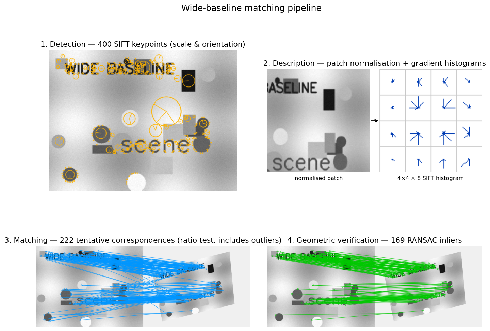

## Wide-Baseline Matching: Obtaining Correspondences Across Viewpoints

Wide-baseline stereo refers to the problem of finding point correspondences between two images of the same scene taken from substantially different viewpoints. Unlike narrow-baseline setups (where a simple window correlation suffices), wide-baseline scenarios introduce large changes in scale, rotation, perspective distortion, and illumination. The standard solution relies on **local features**—distinguished image regions that can be reliably detected and described in a viewpoint-invariant manner. The overall pipeline consists of four main stages: **detection**, **description**, **matching**, and **geometric verification**.

### 1. Feature Detection: Finding Repeatable Keypoints

The goal of detection is to identify a sparse set of **distinguished regions** (also called interest points, keypoints, or covariant regions) that are highly repeatable under the expected geometric and photometric transformations. A good detector must be:

- **Repeatable** – the same physical point should be found in both images despite viewpoint changes.
- **Local** – robust to occlusion; only a small image neighbourhood is considered.
- **Discriminative** – the surrounding patch contains distinctive texture.
- **Efficient** – fast enough to process thousands of points per image.

#### 1.1 Corner Detectors: Harris and FAST

Early detectors focused on **corners**, i.e., points where the image intensity changes significantly in all directions. The **Harris detector** formalises this by examining the second-moment matrix (auto-correlation matrix) of image gradients over a small window $W$:

$$
M = \sum_{(x,y)\in W} w(x,y) \begin{bmatrix} I_x^2 & I_x I_y \\ I_x I_y & I_y^2 \end{bmatrix}
$$

where $I_x, I_y$ are the image derivatives. The eigenvalues $\lambda_1, \lambda_2$ of $M$ characterise the local structure: both large $\Rightarrow$ corner; one large, one small $\Rightarrow$ edge; both small $\Rightarrow$ flat region. To avoid explicit eigenvalue computation, the **cornerness** response is defined as

$$
R = \det(M) - k \, (\operatorname{trace} M)^2 = \lambda_1\lambda_2 - k(\lambda_1+\lambda_2)^2,
$$

with $k \approx 0.04\text{–}0.06$. Local maxima of $R$ above a threshold are selected as keypoints.

Harris corners are **rotation invariant** (the ellipse of the second-moment matrix rotates with the image, but its eigenvalues remain unchanged) and partially invariant to additive/multiplicative intensity changes. However, they are **not scale invariant**—a corner at one scale may become an edge when the image is zoomed.

For real-time applications (e.g., SLAM), the **FAST** detector provides a much faster alternative. It classifies a pixel $p$ as a corner if there exists a contiguous arc of at least 12 pixels on a circle of radius 3 around $p$ that are all brighter or all darker than $p$ by a threshold. Non-maximum suppression (often using the Harris cornerness score) removes clustered responses. FAST is the detector backbone of ORB-SLAM.

#### 1.2 Achieving Scale Invariance: Blob Detectors and Scale Selection

To handle large scale changes, the detector must estimate the **characteristic scale** of each feature independently in each image. The idea is to search for local extrema of a suitable function over both spatial location and scale. The scale at which the extremum occurs is covariant with the image scale.

Common scale-selection functions are based on **blob** templates:

- **Laplacian of Gaussian (LoG):** $\nabla^2 G(x,y;\sigma) = \frac{\partial^2 G}{\partial x^2} + \frac{\partial^2 G}{\partial y^2}$.
- **Difference of Gaussians (DoG):** $G(x,y;k\sigma) - G(x,y;\sigma)$, an efficient approximation of the scale-normalised LoG.
- **Determinant of Hessian (DoH):** $\det H = I_{xx}I_{yy} - I_{xy}^2$, where $H$ is the Hessian matrix of the image (computed after Gaussian smoothing). To compensate for the amplitude decay with increasing scale, the normalised determinant $\sigma^4 \det H$ is used.

The **SIFT** (Scale-Invariant Feature Transform) detector uses DoG: an image pyramid is built by repeatedly blurring and downsampling; DoG images are formed within each octave. Local 3D extrema (in $x,y,\sigma$) of the DoG response are taken as keypoint candidates. Sub-pixel and sub-scale refinement is performed by fitting a 3D quadratic to the DoG values around the extremum.

Other combinations exist, e.g., **Harris-Laplacian** (Harris for spatial location, Laplacian for scale) or **Hessian-Laplacian**. Empirically, scale-space extrema of DoG or Hessian provide high repeatability under scale changes.

#### 1.3 Affine Invariance: Shape Adaptation

For wide-baseline matching, a similarity (rotation + uniform scale) model is often insufficient. Local perspective distortion can be approximated by an **affine transformation**. Affine-invariant detectors iteratively estimate the local affine shape of the region.

The **Harris/Hessian Affine** detector starts with an initial scale-invariant point and iteratively refines the region’s shape using the **second-moment matrix** of the image gradients. The matrix defines an ellipse whose eigenvectors and eigenvalues correspond to the region’s orientation and extent. The image patch is normalised by warping this ellipse to a circle, and the process is repeated until the eigenvalues of the second-moment matrix become equal (isotropic). The final elliptical region is an affine-covariant distinguished region.

Another approach, **MSER** (Maximally Stable Extremal Regions), extracts connected components of thresholded images that remain stable over a range of intensity thresholds. These regions are naturally affine covariant and can be approximated by ellipses via geometric moments.

### 2. Feature Description: Encoding the Local Appearance

Once a set of covariant regions is detected, each must be represented by a **descriptor**—a compact vector that is discriminative yet robust to residual geometric and photometric deformations. The descriptor is computed after normalising the patch to a canonical frame.

#### 2.1 Geometric Normalisation

Given a detected region (an oriented ellipse or similarity frame), the patch is warped to a fixed-size square. This involves:

- **Translation** to centre the region.
- **Scaling** to a canonical radius (e.g., proportional to the detected scale $\sigma$).
- **Rotation** to a canonical orientation. The dominant orientation is estimated from a histogram of gradient directions within the region; the peak(s) of the smoothed histogram define one or more canonical orientations. (If multiple strong peaks exist, multiple descriptors are generated for the same location.)

After normalisation, the patch is approximately invariant to similarity transformations. For affine regions, the normalisation also compensates for non-uniform scaling and shear.

#### 2.2 SIFT Descriptor

The **SIFT descriptor** is the most influential hand-crafted descriptor. It is built from gradient orientation histograms computed in the normalised patch:

1. The patch (typically $16\times16$ samples around the keypoint) is divided into a $4\times4$ grid of sub-windows.
2. In each sub-window, an 8-bin histogram of gradient orientations is formed. The contribution of each pixel is weighted by its gradient magnitude and a Gaussian window centred at the keypoint (to down-weight distant pixels).
3. The 16 histograms are concatenated into a $128$-dimensional vector.
4. The vector is normalised to unit length to achieve invariance to affine intensity changes ($I \to aI+b$). To reduce the influence of large gradient magnitudes, values are clamped to a threshold and the vector is re-normalised.

This design provides robustness to small localisation errors, moderate affine deformations, and illumination changes. Variants like **RootSIFT** (square-root normalisation) further improve performance.

### 3. Matching: Establishing Tentative Correspondences

With a set of descriptors from each image, the next step is to find pairs that likely correspond to the same physical point. The standard approach is **nearest-neighbour matching** in descriptor space:

- For each descriptor in the first image, find its nearest neighbour in the second image (e.g., by Euclidean distance for SIFT, or Hamming distance for binary descriptors).
- To reject ambiguous matches, Lowe introduced the **ratio test**: a match is accepted only if the distance to the nearest neighbour is significantly smaller than the distance to the second-nearest neighbour (typically $d_1 / d_2 < 0.8$). This eliminates many false matches arising from repetitive patterns or non-discriminative regions.

Efficient approximate nearest-neighbour libraries (FLANN, FAISS) are used to handle large sets of high-dimensional descriptors.

### 4. Geometric Verification: Filtering Outliers

The tentative correspondences from the matching stage still contain many outliers (incorrect matches). Since the two images are related by some geometric transformation (e.g., epipolar geometry for a general 3D scene, or a homography for a planar scene), a robust estimation method is employed to find the transformation consistent with the largest set of inliers.

The most common technique is **RANSAC** (Random Sample Consensus):

1. Randomly sample a minimal set of correspondences (e.g., 7 or 8 for the fundamental matrix, 4 for a homography).
2. Estimate the geometric model from this sample.
3. Count the number of inliers—correspondences that agree with the model up to a pixel error threshold.
4. Repeat many times and keep the model with the largest inlier set.
5. Optionally, re-estimate the model using all inliers (least-squares).

The final set of geometrically verified correspondences is then used for subsequent tasks such as camera pose estimation, 3D reconstruction, or image stitching.

### Visualisation of the Full Pipeline

The figure below illustrates the four stages on a synthetic example. A textured scene (top-left) is detected and SIFT keypoints are extracted (orange circles indicate scale, radii indicate orientation). A single keypoint is then normalised and described as a $4\times 4$ grid of $8$-bin gradient histograms (top-right). The same scene is then warped by an aggressive perspective + rotation + scale change. Nearest-neighbour matching with Lowe's ratio test produces many tentative correspondences (bottom-left, orange) — visibly some are wrong. RANSAC homography estimation then keeps only the geometrically consistent inliers (bottom-right, green).

### Summary of the Wide-Baseline Matching Pipeline

1. **Detect** repeatable, covariant regions (keypoints) in each image independently, using scale- and affine-invariant detectors (e.g., DoG + affine adaptation).
2. **Describe** each region by a normalised descriptor (e.g., SIFT) after geometric normalisation (translation, scale, rotation).
3. **Match** descriptors across images using nearest-neighbour search with a ratio test to obtain tentative correspondences.
4. **Verify** the matches by robustly estimating the underlying geometric transformation (RANSAC), discarding outliers.

This pipeline, rooted in the principles of local feature design, has been the foundation of wide-baseline stereo, 3D reconstruction, image retrieval, and panorama stitching for decades. Modern learned alternatives (e.g., SuperPoint, D2-Net) follow the same conceptual stages but replace hand-crafted components with deep neural networks.

---

### Self-Test

1. The Harris cornerness response $R = \det(M) - k\,(\operatorname{trace} M)^2$ uses a free parameter $k \approx 0.04$. If you decrease $k$ to $0.01$, how does the set of detected corners change, and why?
2. SIFT achieves scale invariance by detecting keypoints as extrema of the DoG scale-space, while a simple Harris detector does not. What fundamental property of the DoG response makes this scale selection work, and why does Harris lack it?
3. Lowe's ratio test discards a match when $d_1 / d_2 \geq 0.8$. In which type of scene would this test incorrectly discard many true correspondences, and what property of that scene causes the failure?
4. In the geometric verification stage, RANSAC requires a minimum sample of 4 point correspondences to estimate a homography but 7–8 for the fundamental matrix. Why does the fundamental matrix need more points, and what does this imply about when you should prefer estimating one over the other?

### Answer Key

1. Decreasing $k$ from $0.04$ to $0.01$ reduces the penalty on $(\operatorname{trace} M)^2$, making $R$ larger for edge-like points where one eigenvalue dominates. As a result, more pixels—including many that are edges rather than corners—will exceed the detection threshold, so the detector becomes less selective and returns a larger, noisier set of keypoints. Conversely, increasing $k$ tightens the corner criterion and detects fewer but more reliable corners.

2. The DoG response has the property of being **scale-covariant**: a blob of a given physical size produces a peak response at the scale $\sigma$ proportional to that size, so comparing responses across scales identifies a characteristic scale for each keypoint. Harris is computed at a single fixed scale (the window $W$ and the derivative smoothing are fixed), so it has no mechanism to identify which scale best describes a given structure—zooming the image changes whether a feature responds as a corner or an edge, as the text notes explicitly.

3. The ratio test fails in scenes with highly **repetitive or self-similar texture** (e.g., a brick wall, a tiled floor, or a regular grid pattern). In such scenes many descriptors look nearly identical, so for a true match the nearest neighbour and second-nearest neighbour are both close in descriptor space ($d_1 \approx_2$), pushing the ratio above $0.8$ and causing correct correspondences to be discarded. The root cause is insufficient discriminability of the local regions, not a failure of the descriptor design per se.

4. A homography has 8 degrees of freedom (up to scale) and each point correspondence provides 2 equations, so 4 points suffice for a minimal solution. The fundamental matrix has 9 entries subject to the rank-2 constraint, leaving 7 degrees of freedom, which requires 7 correspondences (or 8 for the over-determined 8-point algorithm). The larger minimal sample means each RANSAC iteration is less likely to draw an all-inlier set, so RANSAC is slower and less reliable for the fundamental matrix; when the scene is planar or the camera motion is a pure rotation, one should prefer the homography, which requires fewer points and is geometrically appropriate.