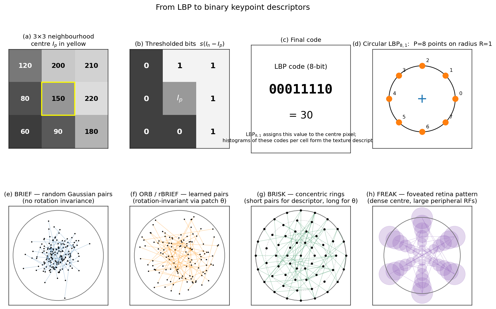

> **Source question (Q11):** Describe "Local Binary Patterns" like descriptors.

## Local Binary Patterns and Binary Descriptors

The SIFT descriptor, discussed in the previous section, produces a 128‑dimensional floating‑point vector that is matched using Euclidean distance. While SIFT offers excellent discriminative power and robustness, its computational and memory footprint can be a bottleneck in real‑time or resource‑constrained applications. An alternative family of descriptors replaces the gradient‑orientation histograms with **binary strings** formed by simple intensity comparisons. These **binary descriptors** can be matched extremely quickly using the **Hamming distance** (the number of bits that differ), which is implemented in hardware on virtually all modern CPUs. The foundational idea behind many of these descriptors is the **Local Binary Pattern (LBP)**, originally developed for texture analysis. This section traces the evolution from LBP to modern binary keypoint descriptors such as BRIEF, ORB, BRISK, and FREAK, and explains their design principles, strengths, and limitations.

### 1. The Local Binary Pattern (LBP)

The Local Binary Pattern, introduced by Ojala et al., is a simple yet powerful texture descriptor that operates on a pixel’s local neighbourhood. For each pixel $p$ in an image, the LBP code is constructed by comparing the intensity of $p$ with the intensities of $P$ equally spaced neighbours on a circle of radius $R$. Formally, let $I_p$ be the intensity of the centre pixel and $I_n$ ($n = 0, \dots, P-1$) the intensities of the neighbours. The LBP code is a $P$-bit binary number:

$$
\text{LBP}_{P,R} = \sum_{n=0}^{P-1} s(I_n - I_p) \, 2^n,
\qquad
s(x) = \begin{cases}
1 & \text{if } x \ge 0,\\
0 & \text{otherwise}.
\end{cases}
$$

The resulting binary string encodes the local texture pattern. For example, a $3 \times 3$ neighbourhood ($P=8, R=1$) yields an 8‑bit code. The image is typically divided into cells, and a histogram of LBP codes is built for each cell; the concatenated histograms form the final texture descriptor.

Key properties of LBP:

- **Illumination invariance:** Because LBP relies only on relative intensity comparisons, it is invariant to monotonic grey‑scale changes (additive and multiplicative shifts).
- **Computational simplicity:** Only integer comparisons and bit‑shifts are required.
- **No geometric normalisation:** The raw LBP code is not rotation‑invariant. Rotation‑invariant variants exist (e.g., by circularly shifting the bit string to its minimum value), but they discard angular information.
- **Locality:** LBP captures only the very local texture; it is not designed as a keypoint descriptor for wide‑baseline matching.

Despite its limitations, LBP demonstrated that a binary string formed by pairwise intensity tests can be a highly discriminative representation of local appearance. This insight directly inspired the development of binary descriptors for local features.

The top row of the figure below traces the construction of a single LBP$_{8,1}$ code: (a) a $3\times 3$ neighbourhood with the centre $I_p = 150$ highlighted; (b) the eight comparisons $s(I_n - I_p)$ shown as black/white cells (1 = $I_n \ge I_p$); (c) the resulting 8-bit string read in MSB-first order, yielding the code "$00011110$" = $30$; (d) the geometric LBP$_{8,1}$ sampling — eight equispaced points on a radius-1 circle around the centre. The bottom row contrasts the sampling patterns of four keypoint binary descriptors, all drawn inside a unit-radius normalised patch: BRIEF picks random Gaussian-distributed point pairs (no orientation); ORB/rBRIEF uses learned, roughly symmetric pairs that are rotated by the patch orientation $\theta$; BRISK places points on concentric rings; FREAK uses a foveated retina-like layout with dense central receptive fields and progressively larger peripheral fields (shown as translucent disks).

### 2. From LBP to Binary Keypoint Descriptors

A keypoint descriptor must be computed over a patch that has been normalised for scale, rotation, and (optionally) affine shape. The LBP idea can be adapted to this setting by replacing the fixed circular neighbourhood with a set of **sampling point pairs** distributed across the normalised patch. A binary descriptor is then a string of bits, each bit being the result of a simple intensity comparison between two pixels (or smoothed pixel values) at predefined locations.

The general recipe for a binary keypoint descriptor is:

1. **Patch normalisation:** Extract a patch around the keypoint, resampled to a canonical scale and rotated by the dominant orientation (if orientation is available).
2. **Sampling pattern:** Define a set of $N$ point pairs $(x_i, y_i)$ within the normalised patch. The pattern is fixed and known in advance.
3. **Binary tests:** For each pair, compare the (smoothed) intensities $I(x_i)$ and $I(y_i)$:

   $$
   \tau(I; x_i, y_i) = \begin{cases}
   1 & \text{if } I(x_i) < I(y_i),\\
   0 & \text{otherwise}.
   \end{cases}
   $$

4. **Descriptor assembly:** Concatenate the $N$ bits to form a binary vector of length $N$ (typically 128, 256, or 512 bits).

Matching two binary descriptors is performed using the **Hamming distance**, which counts the number of differing bits. Modern CPUs can compute the Hamming distance of a 256‑bit string in a single instruction (POPCNT after XOR), making matching orders of magnitude faster than Euclidean distance for float vectors.

### 3. BRIEF: Binary Robust Independent Elementary Features

**BRIEF** (Calonder et al., 2010) was the first descriptor to directly apply the LBP‑style binary test to a normalised image patch. BRIEF does not estimate a dominant orientation; it assumes the patch is already upright (e.g., from a rectified stereo pair). The sampling pattern consists of $N$ point pairs drawn from an isotropic Gaussian distribution centred on the patch. The patch is first smoothed with a Gaussian kernel to reduce noise sensitivity. The resulting descriptor is a 128‑, 256‑, or 512‑bit binary string.

BRIEF is extremely fast to compute and match, but it has two major limitations:

- **No rotation invariance:** Without orientation normalisation, BRIEF fails under significant in‑plane rotation.
- **No scale invariance:** BRIEF relies on a fixed patch size; scale must be handled by an external detector.

Despite these limitations, BRIEF demonstrated that binary descriptors can achieve matching performance comparable to SIFT in controlled settings while being dramatically faster.

### 4. ORB: Oriented FAST and Rotated BRIEF

**ORB** (Rublee et al., 2011) addresses the shortcomings of BRIEF by adding rotation invariance and improving the sampling pattern. The ORB pipeline, already introduced in the context of the FAST detector, consists of:

1. **Detection:** FAST corners are detected at multiple scales (scale‑space pyramid) and filtered with a Harris cornerness measure for non‑maximal suppression. The scale with the maximum FAST response is assigned to the keypoint.
2. **Orientation assignment:** The intensity centroid method computes a dominant orientation $\theta$ for a circular patch around the keypoint. This orientation is used to rotate the sampling pattern.
3. **Descriptor (rBRIEF):** ORB uses a learned binary sampling pattern. A large set of candidate point pairs is evaluated on a training set, and the pairs that produce the most uncorrelated and high‑variance bits are selected. The final descriptor is a 256‑bit binary string. Because the pattern is rotated by $\theta$, the descriptor becomes rotation‑invariant.

ORB achieves a good balance of speed, repeatability, and discriminability. It is the standard feature for real‑time SLAM systems (e.g., ORB‑SLAM2) and is implemented in OpenCV. The use of a binary descriptor allows matching thousands of features in a fraction of a millisecond.

### 5. BRISK: Binary Robust Invariant Scalable Keypoints

**BRISK** (Leutenegger et al., 2011) extends the binary descriptor concept with a scale‑space detector and a rotation‑invariant sampling pattern. The key innovations are:

- **Scale‑space FAST detector:** BRISK builds a scale‑space pyramid and detects FAST corners at each level. True scale‑space extrema are identified by non‑maximal suppression in both space and scale.
- **Concentric sampling pattern:** The descriptor sampling points lie on concentric circles centred on the keypoint. The pattern is designed to be isotropic and to provide long‑range as well as short‑range comparisons.
- **Orientation estimation:** A subset of long‑range point pairs is used to estimate a dominant orientation via local gradient averages, similar to the intensity centroid but computed from the sampling pattern itself.
- **Binary descriptor:** The sampling pattern is rotated by the estimated orientation. Short‑range pairs are used for the actual binary tests, yielding a 512‑bit descriptor.

BRISK is fully scale‑ and rotation‑invariant and achieves competitive matching performance with SIFT while being significantly faster.

### 6. FREAK: Fast Retina Keypoint

**FREAK** (Alahi et al., 2012) draws inspiration from the human retina, where the density of photoreceptors decreases with eccentricity. The FREAK sampling pattern consists of overlapping circular receptive fields arranged in a foveated structure: a dense cluster of points near the centre, with sparser points toward the periphery. Each receptive field is smoothed with a Gaussian whose standard deviation is proportional to the field’s size. The binary tests compare the smoothed intensities of pairs of receptive fields.

FREAK’s design offers several advantages:

- **Coarse‑to‑fine matching:** The pattern is structured so that the first 128 bits correspond to coarse, peripheral comparisons, while later bits encode finer details. This allows a cascade matching strategy: first compare the coarse bits, and only if they match, proceed to the finer bits.
- **Rotation invariance:** Orientation is estimated from a selected set of symmetric pairs, and the pattern is rotated accordingly.
- **Compactness:** A 512‑bit descriptor is typical, but the cascade allows early rejection, speeding up matching.

FREAK is particularly well‑suited for applications where a large database of descriptors must be searched quickly.

### 7. Common Properties of Binary Descriptors

All binary descriptors share a set of characteristic properties that distinguish them from float‑based descriptors like SIFT:

- **Speed:** Computing a binary descriptor requires only pixel comparisons and bit manipulation. Matching uses the Hamming distance, which can be computed with a few CPU instructions. This makes binary descriptors ideal for real‑time applications on embedded platforms.
- **Memory efficiency:** A 256‑bit descriptor occupies only 32 bytes, compared to 512 bytes for a 128‑dimensional float SIFT vector (assuming 4‑byte floats). This drastically reduces memory requirements for large databases and enables on‑chip storage.
- **Matching with Hamming distance:** The Hamming distance is a true metric for binary strings. Approximate nearest‑neighbour libraries (e.g., FLANN, FAISS) can be adapted to binary data, and brute‑force matching is often fast enough for thousands of features.
- **Discriminability trade‑off:** Binary descriptors typically have lower discriminative power than SIFT for the same number of bits, because they discard gradient magnitude and orientation information. However, by increasing the number of bits (e.g., 512 bits) and carefully designing the sampling pattern, the performance gap can be narrowed.
- **Robustness to illumination:** Like LBP, binary descriptors are inherently invariant to monotonic intensity changes, because they rely only on comparisons. They are, however, more sensitive to noise than histogram‑based descriptors; Gaussian smoothing of the patch before comparison is essential.
- **Rotation and scale:** Rotation invariance is achieved by rotating the sampling pattern using an externally estimated orientation (intensity centroid, or pattern‑derived orientation). Scale invariance is provided by the detector (scale‑space FAST or DoG). The descriptor itself is computed on a scale‑normalised patch.

### 8. Summary

Local Binary Patterns introduced the idea of representing local image structure as a binary string of intensity comparisons. This concept was extended to keypoint descriptors in the form of BRIEF, ORB, BRISK, and FREAK. These binary descriptors replace the gradient histograms of SIFT with a set of pairwise intensity tests on a normalised patch, producing a compact binary vector. Matching is performed with the Hamming distance, enabling extremely fast correspondence search. ORB, in particular, combines a FAST detector, intensity‑centroid orientation, and a learned binary pattern (rBRIEF) to create a fully rotation‑ and scale‑invariant feature that is the backbone of modern real‑time SLAM systems. While binary descriptors trade some discriminative power for speed and memory efficiency, they are the method of choice when computational resources are limited and real‑time performance is paramount.

---

### Self-Test

1. BRIEF fails under in-plane rotation while ORB does not — yet both ultimately perform the same binary intensity comparison $\tau(I; x_i, y_i)$. What specific step does ORB add, and why is that step sufficient to recover rotation invariance?
2. Increasing the radius $R$ in $\text{LBP}_{P,R}$ captures texture at a coarser scale, but does not make the descriptor more discriminative indefinitely. When would making $R$ very large cause the LBP code to lose useful information about local structure?
3. FREAK's first 128 bits encode coarse, peripheral comparisons while later bits encode finer central details. How does this ordering enable a cascade matching strategy, and under what database conditions would this cascade provide the largest speed-up over comparing all 512 bits?
4. Binary descriptors are invariant to monotonic grey-scale changes because they use only pairwise intensity comparisons, yet they are described as more noise-sensitive than SIFT. Why does the same comparison operation that grants illumination invariance also increase vulnerability to noise, and how does Gaussian pre-smoothing address this without breaking invariance?

### Answer Key

1. ORB adds an **orientation assignment** step using the intensity centroid method, which computes a dominant angle $\theta$ for the patch. The fixed BRIEF sampling pattern is then rotated by $\theta$ before the binary tests $\tau$ are applied, so the same pattern is always evaluated in the patch's canonical frame regardless of how the patch is oriented in the image. Since the comparison positions rotate with the patch, the resulting bit string is the same for any in-plane rotation, restoring invariance that BRIEF lacks.

2. When $R$ is very large, the $P$ sampled neighbours spread far from the centre pixel $I_p$ and begin to capture pixels whose intensities are determined by different object surfaces or background regions rather than the local texture under study. The comparisons $s(I_n - I_p)$ then reflect global scene content rather than the local structure around $p$, making many bits essentially random with respect to the texture being described. Additionally, at very large radii the finite discrete grid forces the sampling points to be poorly approximated, further degrading the code's stability and discriminative power.

3. Because the first 128 bits encode coarse, long-range comparisons, two descriptors that differ in gross appearance will already diverge in these bits and can be rejected without evaluating the remaining 384 bits. The cascade provides the largest speed-up when the database is large and most candidate pairs are true negatives (non-matches), since the majority of comparisons terminate early after the cheap coarse stage. Conversely, if most candidates are near-matches (high true-positive rate or highly similar database), the cascade saves little because many pairs must be evaluated all the way to the fine bits.

4. The binary test $s(I_n - I_p)$ is invariant to any monotonic intensity shift because only the sign of the difference matters, not its magnitude. However, the same sign-sensitivity means that a small noise perturbation near $I_n \approx I_p$ can flip the bit even when the two pixels are genuinely similar, whereas a gradient-magnitude histogram bins contributions smoothly and many noisy samples average out. Gaussian pre-smoothing raises the effective signal level by averaging out high-frequency noise before the comparison, so the margin $|I_n - I_p|$ is typically large enough that noise cannot flip the sign; invariance is preserved because smoothing is a monotonic-magnitude operation applied uniformly and the comparison still relies only on the sign of the smoothed difference.