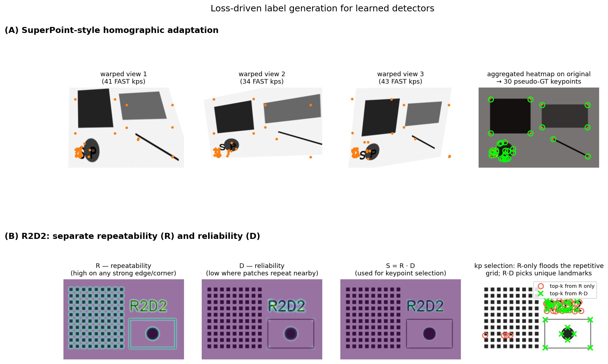

## Learning Local Feature Detectors: Loss Functions and Training Data

The classical detector pipeline – Harris corners, FAST, Difference-of-Gaussians – relies on handcrafted rules that define what constitutes a “good” keypoint. These rules are based on intuitive properties such as high intensity variation in all directions or blob‑like structures at a characteristic scale. While effective, they are not optimised for the ultimate goal of establishing reliable correspondences across wide baselines. The rise of deep learning has enabled a paradigm shift: instead of designing a detector by hand, we can **learn** a function that maps an input image to a set of keypoints, directly optimising the repeatability and discriminability of the resulting features. This section describes two influential learned detectors, **SuperPoint** and **R2D2**, with a focus on their loss functions and the sources of training data that make such learning possible.

### 1. From Handcrafted to Learned Detectors

Recall that a classical detector produces a **response map** (e.g., the Harris cornerness $R$, or the DoG extrema) and then selects local maxima as keypoints. A learned detector follows the same high‑level structure but replaces the handcrafted response function with a convolutional neural network. The network typically outputs a **score map** $S \in \mathbb{R}^{H \times W}$ where each pixel’s value indicates how suitable that location is as a keypoint. Keypoints are then obtained by non‑maximum suppression (NMS) on $S$, possibly with a threshold.

The challenge is that keypoint selection is a discrete, non‑differentiable operation, making end‑to‑end training difficult. Learned detectors therefore rely on carefully designed **loss functions** that provide a differentiable proxy for repeatability and reliability, and on **training data** that supplies supervision for where keypoints should be.

### 2. SuperPoint: Self‑Supervised Interest Point Detection and Description

**SuperPoint** (DeTone et al., 2018) is a fully‑convolutional network that jointly predicts keypoints and descriptors. It consists of a shared VGG‑style encoder and two decoder heads: one for the **detector** (outputting a probability map over pixel locations) and one for the **descriptor** (outputting a dense descriptor map, later interpolated at keypoint locations).

#### 2.1 Detector Loss

The detector head produces a heatmap $\hat{Y} \in [0,1]^{H \times W}$ of keypoint probabilities. The loss is a pixel‑wise binary cross‑entropy between the predicted heatmap and a pseudo‑ground truth heatmap $Y$:

$$
\mathcal{L}_{\text{det}} = -\frac{1}{H W} \sum_{i,j} \Big[ Y_{ij} \log \hat{Y}_{ij} + (1 - Y_{ij}) \log(1 - \hat{Y}_{ij}) \Big].
$$

The crucial question is: **where does $Y$ come from?** SuperPoint uses a two‑stage self‑supervision strategy:

1. **Base detector (MagicPoint) on synthetic shapes.** A simple network is first trained on a synthetic dataset of geometric primitives (triangles, quadrilaterals, lines, ellipses) whose corner points and line intersections are known exactly. This provides perfect ground‑truth keypoint locations. The trained base detector, called **MagicPoint**, learns to detect generic corner‑like structures.

2. **Homographic adaptation on real images.** To transfer the detector to real images without manual labels, a set of random homographies is applied to an unlabelled image (e.g., from MS‑COCO). MagicPoint is run on each warped version, producing a set of detected keypoints. These detections are warped back to the original image and aggregated into a single, robust pseudo‑ground truth heatmap $Y$. The process is repeated for many images, creating a large training set of real images with automatically generated keypoint labels.

SuperPoint is then trained on these real images using the cross‑entropy loss above. The detector learns to predict keypoints that are consistent under homographic transformations, i.e., **repeatable**.

#### 2.2 Descriptor Loss

The descriptor head outputs a dense descriptor map $D \in \mathbb{R}^{H \times W \times d}$. For a pair of images related by a known homography, corresponding keypoints are extracted and their descriptors compared. The loss is a **contrastive margin loss**:

$$
\mathcal{L}_{\text{desc}} = \frac{1}{N} \sum_{n=1}^{N} \Big[ y_n \, d_n^2 + (1 - y_n) \max(0, m - d_n)^2 \Big],
$$

where $d_n = \| \mathbf{d}_n^A - \mathbf{d}_n^B \|_2$ is the Euclidean distance between the descriptors of a putative match, $y_n = 1$ if the pair is a true correspondence (obtained from the homography) and $0$ otherwise, and $m$ is a margin. This loss encourages descriptors of corresponding points to be similar and descriptors of non‑corresponding points to be separated by at least $m$.

The total SuperPoint loss is a weighted sum:

$$
\mathcal{L} = \mathcal{L}_{\text{det}} + \lambda \, \mathcal{L}_{\text{desc}}.
$$

#### 2.3 Training Data Summary for SuperPoint

- **Synthetic shapes** (triangles, quadrilaterals, lines, ellipses) with known vertices → train MagicPoint.
- **Real images** (MS‑COCO) with homographic adaptation → generate pseudo‑ground truth keypoints.
- **Warped image pairs** from the same real images → provide descriptor matching supervision.

This self‑supervised pipeline requires no human annotation of keypoints.

### 3. R2D2: Reliable and Repeatable Detector and Descriptor

**R2D2** (Revaud et al., 2019) argues that repeatability alone is not sufficient: a keypoint may be perfectly repeatable yet its descriptor may be ambiguous (e.g., a corner on a repetitive texture), leading to mismatches. R2D2 therefore predicts two separate properties for each pixel:

- **Repeatability** $R \in [0,1]$: how likely the point is to be detected under viewpoint and illumination changes.
- **Reliability** $D \in [0,1]$: how likely the descriptor extracted at that point is to be matched correctly.

The final keypoint score is the product $S = R \cdot D$, and keypoints are selected as local maxima of $S$.

#### 3.1 Repeatability Loss

The repeatability map should be invariant to transformations: if a point $\mathbf{x}$ in image $I$ corresponds to $\mathbf{x}'$ in image $I'$, then $R(\mathbf{x}) \approx R'(\mathbf{x}')$. R2D2 enforces this by maximising the cosine similarity between repeatability vectors of corresponding patches, while minimising it for non‑corresponding patches. Concretely, for a pair of images with known dense correspondences (from SfM or a homography), a set of corresponding patch pairs $\{(\mathbf{p}_i, \mathbf{p}_i')\}$ is sampled. The repeatability loss is:

$$
\mathcal{L}_{\text{rep}} = -\frac{1}{N} \sum_{i=1}^{N} \frac{\langle \mathbf{r}_i, \mathbf{r}_i' \rangle}{\|\mathbf{r}_i\| \|\mathbf{r}_i'\|} + \frac{1}{N} \sum_{i=1}^{N} \frac{1}{|\mathcal{N}_i|} \sum_{j \in \mathcal{N}_i} \frac{\langle \mathbf{r}_i, \mathbf{r}_j' \rangle}{\|\mathbf{r}_i\| \|\mathbf{r}_j'\|},
$$

where $\mathbf{r}_i$ is a small patch extracted from the repeatability map around $\mathbf{p}_i$, and $\mathcal{N}_i$ is a set of non‑corresponding patches. This loss directly optimises for **local repeatability**: the repeatability map should look the same in the neighbourhood of corresponding points.

#### 3.2 Reliability Loss

The reliability map $D$ should predict whether the descriptor at a point will be discriminative. R2D2 uses a **ranking‑based loss** that directly optimises the Average Precision (AP) of descriptor matching. For a query point $\mathbf{p}$ with descriptor $\mathbf{d}$, the goal is to rank the true match $\mathbf{p}'$ above all other points in the target image. The reliability $D(\mathbf{p})$ acts as a weight: points with low reliability should contribute less to the AP loss, allowing the network to “ignore” ambiguous regions.

The reliability loss is defined as:

$$
\mathcal{L}_{\text{rel}} = 1 - \text{AP}\big( \{ \text{sim}(\mathbf{d}, \mathbf{d}_k') \}_{k=1}^{M}, \pi \big),
$$

where $\text{sim}$ is the descriptor similarity (e.g., dot product), $\pi$ is the index of the true match, and the AP is computed with a differentiable approximation (e.g., using a soft‑ranking function). The reliability map $D$ is trained jointly with the descriptor such that $D(\mathbf{p})$ reflects the expected AP for that point. In practice, the loss encourages $D$ to be high for points whose descriptors yield high AP, and low otherwise.

#### 3.3 Combined Training

The total R2D2 loss is:

$$
\mathcal{L} = \mathcal{L}_{\text{rep}} + \mu \, \mathcal{L}_{\text{rel}}.
$$

The network is trained end‑to‑end, with the repeatability and reliability heads sharing a common encoder. At inference, keypoints are extracted as local maxima of $S = R \cdot D$.

#### 3.4 Training Data Sources for R2D2

R2D2 requires image pairs with **dense, accurate pixel correspondences**. The primary sources are:

- **Structure‑from‑Motion (SfM) datasets.** Large‑scale SfM reconstructions (e.g., MegaDepth, 1DSfM) provide sparse 3D points that can be projected into multiple views, yielding ground‑truth correspondences. These correspondences are interpolated to obtain dense supervision.
- **Synthetic warps.** Applying known homographies to real images generates perfect dense correspondences. This is similar to the SuperPoint approach but used here for both repeatability and reliability supervision.
- **“Good” points from classical methods.** As a bootstrap, points that are successfully matched by a robust classical pipeline (e.g., SIFT + ratio test + RANSAC) can serve as positive examples for repeatability, though R2D2 aims to surpass this initialisation.

The combination of SfM data and synthetic warps provides a rich training signal that captures both the geometric and photometric challenges of real‑world wide‑baseline matching.

The figure below illustrates both ideas with classical stand-ins so the underlying mechanism is visible without invoking a trained network. The top row (A) demonstrates SuperPoint's homographic adaptation: an unlabelled image is warped by many random homographies (three sample warps shown), a base detector (FAST playing the role of MagicPoint) is run on each, and the detections are warped back into the original frame and accumulated. The aggregated heatmap (right panel, hot overlay) is far cleaner than any single detection — local maxima of it become 30 pseudo-ground-truth keypoints (green circles), which is then used as a self-supervised target for $\mathcal{L}_{\text{det}}$. The bottom row (B) illustrates R2D2's central observation that repeatability alone is not enough: on an image with a repetitive grid (left) and unique landmarks (right), the repeatability map $R$ fires on every grid corner; a reliability proxy $D$ (computed here as the minimum-shift-match distance of the local patch) is low on the grid because nearby copies match well, but high on the unique landmarks. The product $S = R\cdot D$ — what R2D2 actually maximises — concentrates only on landmarks. The right-most panel selects the top-30 points from $R$ alone (red circles) and from $R\cdot D$ (green crosses): R-only floods the repetitive grid, while $R\cdot D$ keeps zero of its points there.

### 4. General Taxonomy of Training Data for Learned Detectors

Beyond SuperPoint and R2D2, the community has explored several paradigms for obtaining supervision:

- **Synthetic primitives.** Simple shapes with known geometry (corners, line intersections) provide clean, noise‑free keypoint labels. Used to bootstrap detectors (MagicPoint).
- **Self‑supervision via warps.** Applying random homographies to unlabelled images creates correspondences without human effort. The detector is trained to be covariant with these warps.
- **SfM reconstructions.** Large photo‑tourism datasets (MegaDepth, 1DSfM, etc.) contain millions of images with reconstructed 3D points. Projecting these points into overlapping images yields sparse but highly accurate keypoint correspondences.
- **Video data.** Consecutive frames with small motion can be tracked by optical flow to obtain dense correspondences, though drift and occlusions must be handled.
- **Human annotations.** Rarely used due to cost and subjectivity; mainly for evaluation benchmarks (e.g., HPatches).

The trend is toward methods that require no manual labels, instead mining supervision from geometry (warps, SfM) or from the data itself (self‑supervision).

### 5. Summary

Learned local feature detectors replace handcrafted response functions with neural networks trained to optimise repeatability and reliability directly. **SuperPoint** uses a self‑supervised pipeline: a base detector trained on synthetic shapes is adapted to real images via homographic warping, and a joint detector–descriptor loss (cross‑entropy + contrastive margin) is minimised. **R2D2** introduces a principled separation of repeatability and reliability, with a cosine similarity loss for repeatability and a ranking‑based AP loss for reliability, trained on SfM or warped image pairs. Both methods exemplify how carefully designed loss functions and cleverly sourced training data can produce detectors that outperform classical handcrafted alternatives, especially in challenging wide‑baseline scenarios.

---

### Self-Test

1. SuperPoint's homographic adaptation aggregates detections from many warped views to produce pseudo-ground-truth labels. Why does averaging over many random homographies yield a more reliable heatmap than using a single warp, and what failure mode remains even after aggregation?
2. R2D2 uses the product $S = R \cdot D$ rather than $R$ or $D$ alone as the final keypoint score. Give a concrete scene scenario in which a high-$R$ / low-$D$ point would degrade matching performance, and explain why the product suppresses it.
3. The SuperPoint descriptor loss uses a contrastive margin $m$: if you increase $m$ substantially, how would you expect the trained descriptor space to change, and could this ever hurt matching performance?
4. Both SuperPoint and R2D2 rely on known homographies or SfM correspondences for supervision. In what real-world imaging conditions would these correspondence sources be least reliable, and how might that affect the resulting detector?

### Answer Key

1. A single homographic warp produces detections only from one viewpoint perturbation, so accidental false positives or missed detections in that view pollute the label directly. Averaging over many diverse homographies acts like a voting ensemble: genuine, geometrically stable points accumulate high vote counts across views while noise detections (which rarely coincide across different warps) wash out. The remaining failure mode is that all homographies share the same planar assumption, so scene points that lie off the dominant plane (e.g., foreground objects above a ground plane) receive inconsistent warp-back positions and may produce blurred or spurious heatmap peaks even after aggregation.

2. Consider a repetitive brick wall: every brick corner is highly repeatable ($R \approx 1$) because the corner structure persists under viewpoint change, but every such corner has dozens of visually identical neighbours, making the descriptor ambiguous ($D \approx 0$). If $R$ alone is used for keypoint selection, the matcher will commit to these corners and then fail to establish unique correspondences — one query descriptor matches many target descriptors equally well, producing mismatches. Multiplying by $D$ drives $S = R \cdot D \approx 0$ at these locations, so they are suppressed by NMS and the matcher is directed toward points that are both stable and distinctive.

3. A larger margin $m$ forces non-matching descriptor pairs to be separated by at least $m$ in Euclidean distance, expanding the descriptor space and pushing all negative pairs further apart. The trained descriptors would occupy a more spread-out region of $\mathbb{R}^d$, potentially improving discrimination in dense retrieval scenarios. However, if $m$ is too large relative to the descriptor norm, the loss gradient can saturate for easy negatives and concentrate almost entirely on hard negatives that happen to be noisy or incorrect correspondences (label noise from the homography), causing the descriptor to overfit to the hardest, potentially wrong pairs and degrading overall matching performance.

4. Homography-based supervision assumes a planar scene or pure camera rotation, so it is unreliable for images of strongly non-planar scenes (e.g., indoor clutter, street scenes with depth variation). SfM correspondences fail under dynamic objects (people, cars), transparent or specular surfaces, and scenes with insufficient overlap or repetitive structure where bundle adjustment cannot converge. In these conditions the pseudo-ground-truth labels are noisy or missing: the detector will be trained to fire at points that are geometrically consistent under the (incorrect) planar assumption or at SfM-reconstructed regions only, potentially ignoring rich texture in dynamic or reflective areas and reducing generalisation to unconstrained real-world scenarios.