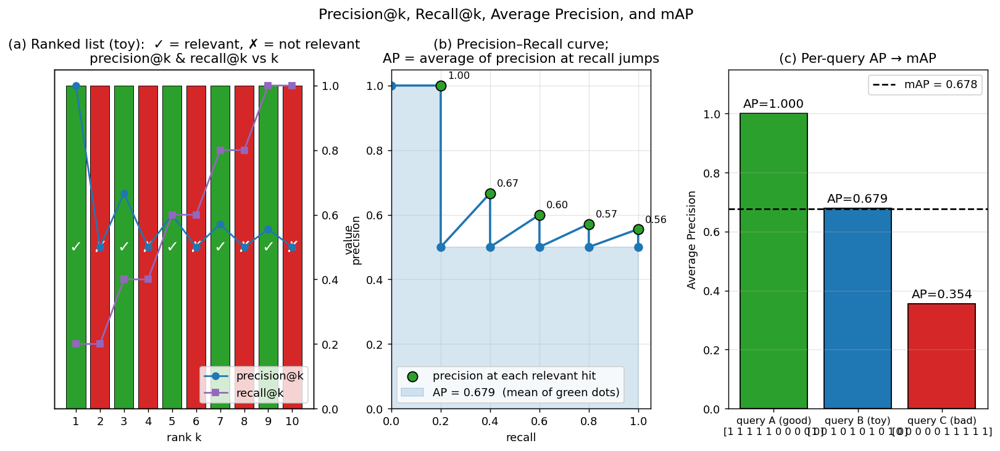

> **Source question (Q14):** How is mAP computed? Discuss relation to precision@k, recall@k for particular k.

## Mean Average Precision (mAP) and its Relation to Precision@k and Recall@k

In image retrieval, the system must rank database images according to their relevance to a query. Evaluating the quality of this ranking is non‑trivial: a single metric that captures the trade‑off between precision and recall across all possible cut‑off points is needed. **Mean Average Precision (mAP)** is the standard summary statistic for retrieval benchmarks. This section defines mAP, shows how it is computed, and explains its relationship to the simpler, cut‑off‑dependent measures **precision@k** and **recall@k**.

### 1. Recap: Precision@k and Recall@k

Given a query $q$ and a database of $N$ images, the retrieval system produces an ordered list of all $N$ images, from most to least relevant according to some scoring function $s(q, a)$. In the evaluation setting, we have binary ground‑truth labels: each database image is either **relevant** (positive) or **non‑relevant** (negative) to the query. Let $R$ be the total number of relevant images for this query.

For a chosen cut‑off $k$ (the number of top‑ranked images we examine), we define:

- **Precision@k** – the fraction of the top‑$k$ retrieved images that are relevant:

  $$
  \text{Precision@k} = \frac{\#\text{relevant in top }k}{k}.
  $$

- **Recall@k** – the fraction of all relevant images that have been retrieved within the top $k$:

  $$
  \text{Recall@k} = \frac{\#\text{relevant in top }k}{R}.
  $$

These two numbers are linked: for a fixed ranking, as $k$ increases, recall@k is non‑decreasing (it eventually reaches 1 when $k$ is large enough to include all relevant images), while precision@k fluctuates and typically decreases as more non‑relevant images enter the top‑$k$ window.

The slide material illustrates this with a toy example: a database of 10 images, 5 of which are relevant. The ranking (from top to bottom) has relevant images at positions 1, 3, 5, 7, and 9. The corresponding precision@k and recall@k values are:

| $k$ | Relevant in top $k$ | Precision@k | Recall@k |
|-----|---------------------|--------------|----------|
| 1   | 1                   | 1.00         | 0.2      |
| 2   | 1                   | 0.50         | 0.2      |
| 3   | 2                   | 0.67         | 0.4      |
| 4   | 2                   | 0.50         | 0.4      |
| 5   | 3                   | 0.60         | 0.6      |
| 6   | 3                   | 0.50         | 0.6      |
| 7   | 4                   | 0.57         | 0.8      |
| 8   | 4                   | 0.50         | 0.8      |
| 9   | 5                   | 0.56         | 1.0      |
| 10  | 5                   | 0.50         | 1.0      |

### 2. Limitations of Fixed‑$k$ Metrics

The choice of $k$ is arbitrary. If we report only precision@10, a system that places all relevant images in the top 5 and then fills the rest with non‑relevant ones will have the same precision@10 as a system that scatters the relevant images across the top 10, yet the former is clearly better. Conversely, recall@k alone ignores the order among the relevant items. A single $k$ cannot capture the full behaviour of the ranking. The slide material explicitly asks: *“what should $k$ be? should we use only one window?”* The answer is that we need a metric that summarises performance across **all** possible recall levels.

### 3. Average Precision (AP)

**Average Precision (AP)** for a single query is the average of the precision values obtained at the ranks where a relevant image appears. Formally, let the ranked list of $N$ images have relevance indicators $r_i \in \{0,1\}$ ($r_i = 1$ if the image at rank $i$ is relevant). Let $P(i) = \frac{1}{i}\sum_{j=1}^{i} r_j$ be the precision at cut‑off $i$. Then

$$
\text{AP} = \frac{1}{R} \sum_{i=1}^{N} r_i \cdot P(i),
$$

where $R = \sum_{i=1}^{N} r_i$ is the total number of relevant images. In words: we walk down the ranked list, and whenever we encounter a relevant image, we note the current precision; we then average these precision values over all relevant images.

Equivalently, AP is the area under the **precision–recall curve** (often with interpolation, but the non‑interpolated version is the same as the definition above when using the finite sum). The precision–recall curve plots precision as a function of recall, and AP integrates precision over the full range of recall $[0,1]$. This makes AP a single number that rewards systems that place relevant images early in the ranking: the sooner a relevant image appears, the higher the precision at that point, and thus the higher the contribution to AP.

### 4. Computing AP: A Worked Example

Using the same ranking from the slide material (relevant at ranks 1, 3, 5, 7, 9; $R=5$):

- At rank 1: $P(1) = 1/1 = 1.00$
- At rank 3: $P(3) = 2/3 \approx 0.667$
- At rank 5: $P(5) = 3/5 = 0.600$
- At rank 7: $P(7) = 4/7 \approx 0.571$
- At rank 9: $P(9) = 5/9 \approx 0.556$

$$
\text{AP} = \frac{1.00 + 0.667 + 0.600 + 0.571 + 0.556}{5} \approx 0.679.
$$

If the ranking were perfect (all 5 relevant images in the first 5 positions), AP would be 1.0. If the relevant images were all at the end, AP would be much lower. Thus AP reflects the entire ranking, not just a single cut‑off.

The figure below visualises the three concepts using the same toy ranking from the table above (10 items, relevant at ranks 1, 3, 5, 7, 9). Panel (a) shows the ranked list as a bar (green ✓ = relevant, red ✗ = not relevant) and overlays precision@k (blue circles) and recall@k (purple squares) — note how precision@k oscillates as non-relevant items dilute it, while recall@k climbs monotonically. Panel (b) plots the step-shaped precision–recall curve: the five green dots are the precision values at the recall jumps (1.00, 0.67, 0.60, 0.57, 0.56). Their arithmetic mean — the area under the step curve — is $\text{AP} = 0.679$, matching the worked example. Panel (c) computes AP for three different rankings: a perfect ranking ($\text{AP} = 1.0$), the toy ranking ($0.679$), and a worst-case ranking with all relevant items at the bottom ($0.354$). The dashed line shows $\text{mAP} = 0.678$, the arithmetic mean across queries.

### 5. Mean Average Precision (mAP)

In a retrieval benchmark, we have a set of queries $Q$. For each query $q \in Q$, we compute its Average Precision $\text{AP}(q)$. The **Mean Average Precision** is simply the arithmetic mean over all queries:

$$
\text{mAP} = \frac{1}{|Q|} \sum_{q \in Q} \text{AP}(q).
$$

mAP is the primary evaluation metric in most image retrieval and object detection challenges (e.g., Oxford5k, Paris6k, COCO). It provides a single, interpretable number: an mAP of 1.0 means perfect retrieval for every query; an mAP of 0.5 means that, on average, the system’s ranking quality is equivalent to having half of the relevant images at the very top and the rest scattered.

### 6. Relation to Precision@k and Recall@k

Precision@k and recall@k are **point estimates** on the precision–recall curve. For a given $k$, they give the coordinates $(\text{recall@k}, \text{precision@k})$. AP, by contrast, aggregates precision at **all** recall levels where a relevant item is found. The relationship can be summarised as follows:

- **AP is a weighted average of precision@k values**, but only at those $k$ where a relevant image appears. The weight is uniform across the $R$ relevant items.
- **Precision@k for a fixed $k$ can be read directly from the ranked list**, whereas AP requires the entire ranking. If one must choose a single $k$ for operational reasons (e.g., a user only looks at the first page of results), precision@k is the appropriate metric. However, for system comparison, AP (and mAP) is preferred because it does not require an arbitrary choice of $k$.
- **Recall@k is the fraction of relevant items found up to rank $k$.** AP can be seen as the average of precision at the points where recall increases. Thus AP inherently captures the trade‑off: a system that achieves high recall early (i.e., high precision at low recall levels) will have a high AP.
- **mAP summarises performance across queries.** While precision@k and recall@k can also be averaged over queries (yielding mean precision@k, mean recall@k), those averages still depend on $k$. mAP is the standard because it integrates over all $k$ and all queries in a principled way.

In the slide example, if we only looked at precision@5 (0.60) and recall@5 (0.60), we would miss the fact that the first relevant image appeared immediately (precision@1 = 1.0) and that the last relevant image was found only at rank 9. AP captures the whole story in a single number (0.679).

### 7. Summary

- **Precision@k** and **recall@k** measure retrieval quality at a single cut‑off $k$; they are easy to compute but depend on the choice of $k$.
- **Average Precision (AP)** averages the precision at every rank where a relevant image is retrieved, effectively computing the area under the precision–recall curve. It provides a ranking quality measure that does not require choosing $k$.
- **Mean Average Precision (mAP)** is the mean of AP over all test queries, and it is the standard metric for image retrieval benchmarks.
- mAP is directly related to precision@k and recall@k: it can be seen as a summary of precision at all recall levels, weighted equally across relevant items.

---

### Self-Test

1. A retrieval system achieves precision@10 = 0.8 on a query where $R = 5$. Can you conclude it has a high AP? Why or why not?
2. Two systems have the same mAP of 0.70, but system A has high AP on easy queries and low AP on hard ones, while system B is more uniform. How does mAP hide this difference, and when would it matter which system you deploy?
3. If all relevant images for a query appear in the bottom half of the ranked list, how does the AP formula penalise this compared to a random shuffle of the same images?
4. Recall@k is non-decreasing as $k$ grows, yet precision@k oscillates. Why does AP use only the precision values at ranks where a relevant image appears, rather than averaging precision@k over all $k$ from 1 to $N$?

### Answer Key

1. No. Precision@10 = 0.8 tells us 8 of the top-10 retrieved images are relevant, but since $R = 5$ only 5 of those "relevant" slots can actually be correct, so this value is impossible — at most precision@10 = 0.5 when $R = 5$. More generally, even a valid precision@10 cannot determine AP because AP depends on the order in which relevant images appear across the entire ranked list; all 5 relevant images could be packed into the top 5 (giving high AP) or spread to ranks 2, 4, 6, 8, 10 (giving lower AP), both yielding the same precision@10.

2. mAP is a simple arithmetic mean over queries, so it treats every query equally regardless of difficulty; a very high AP on easy queries can compensate for poor AP on hard ones. This matters in deployment when users predominantly issue hard queries (e.g., fine-grained or ambiguous searches), where system B's uniform performance would be preferable, or conversely when easy-query throughput is the priority and system A would serve better.

3. If all $R$ relevant images sit in the bottom half of the list, each precision value $P(i)$ at the rank $i$ of a relevant image is small — because few relevant images have been seen by that point relative to the many non-relevant images ranked above them. By the AP formula $\text{AP} = \frac{1}{R}\sum_{i} r_i \cdot P(i)$, these small $P(i)$ values drag AP far below what a random shuffle would give, since a random ordering would place some relevant images earlier, yielding at least a few high-precision hits.

4. Averaging precision@k over all $k$ from 1 to $N$ would give undue weight to non-relevant positions, where precision@k merely dips without any new information about retrieval quality. Sampling precision only at ranks where recall actually increases (i.e., where $r_i = 1$) ensures every term in the sum corresponds to a meaningful event — a relevant image being found — and the resulting average directly reflects how precisely the system ranks the $R$ items that matter.