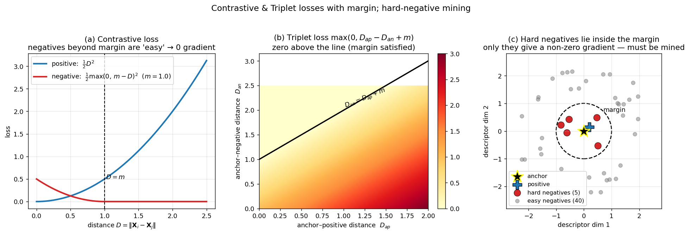

> **Source question (Q24):** How do the contrastive and triplet loss work? What is the role of the margin? What are hard negatives and why are they so important?

## Contrastive and Triplet Losses: Margin and Hard Negative Mining

The previous sections described how a deep network $f_\theta$ maps an image to a global descriptor $\mathbf{X} \in \mathbb{R}^d$ and how different pooling strategies (SPoC, MAC, GeM) produce translation‑invariant representations. To make these descriptors useful for retrieval, the network must be trained so that relevant images are close in the descriptor space and irrelevant ones are far apart. This is achieved by **metric learning losses**. Two of the most fundamental are the **contrastive loss** and the **triplet loss**. This section explains how they work, the role of the margin, and why **hard negative mining** is essential for learning a discriminative embedding.

### 1. Contrastive Loss

The contrastive loss operates on **pairs** of images. During training, a Siamese architecture is used: two identical networks with shared weights process two input images and produce their global descriptors $\mathbf{X}_i$ and $\mathbf{X}_j$. The pair is labelled as either **positive** ($y=0$, the images are relevant) or **negative** ($y=1$, they are not). The loss is defined as

$$
L_{\text{contrastive}}(i,j) = (1-y)\,\frac{1}{2} D_{ij}^2 \;+\; y\,\frac{1}{2}\, \max\!\big(0,\, m - D_{ij}\big)^2,
$$

where $D_{ij} = \|\mathbf{X}_i - \mathbf{X}_j\|_2$ is the Euclidean distance between the (usually $\ell_2$‑normalised) descriptors, and $m > 0$ is a **margin** hyper‑parameter.

- **Positive pairs** ($y=0$): the loss is simply $\frac{1}{2} D_{ij}^2$. It penalises *any* distance, pushing the two descriptors to be as close as possible.
- **Negative pairs** ($y=1$): the loss is $\frac{1}{2} \max(0, m - D_{ij})^2$. If the distance is already larger than the margin $m$, the loss is zero and no gradient flows. If the distance is smaller than $m$, the loss is positive and the network is updated to push the descriptors apart until the distance reaches at least $m$.

The margin therefore defines a “safe” radius around each descriptor: negatives that lie outside this radius are considered sufficiently separated and are ignored. This prevents the network from wasting capacity on pairs that are already well separated.

### 2. Triplet Loss

Triplet loss generalises the idea to **triplets**: an **anchor** image $a$, a **positive** image $p$ (relevant to the anchor), and a **negative** image $n$ (irrelevant). The three images are processed by a three‑branch network with shared weights. The loss is

$$
L_{\text{triplet}}(a,p,n) = \max\!\big(0,\, D_{ap} - D_{an} + m\big),
$$

where $D_{ap} = \|\mathbf{X}_a - \mathbf{X}_p\|_2$ and $D_{an} = \|\mathbf{X}_a - \mathbf{X}_n\|_2$.

The loss encourages the anchor–positive distance to be smaller than the anchor–negative distance by at least the margin $m$. If $D_{an} > D_{ap} + m$, the triplet already satisfies the desired ordering and the loss is zero. Otherwise, the loss is positive and gradients flow to decrease $D_{ap}$ and/or increase $D_{an}$.

### 3. The Role of the Margin

In both losses, the margin $m$ is critical:

- **Enforces a minimum separation.** Without a margin, the triplet loss could be zero as soon as $D_{an} > D_{ap}$, even if the difference is infinitesimal. The margin forces a gap, leading to a more robust embedding where positive and negative distributions are clearly separated.
- **Controls the difficulty.** A larger margin demands that negatives be pushed farther away, which can improve discrimination but may also make optimisation harder. A smaller margin relaxes the constraint.
- **Focuses learning on informative examples.** In the contrastive loss, the margin acts as a threshold: only negatives inside the margin produce a gradient. This naturally ignores “easy” negatives that are already far away, concentrating the learning signal on the pairs that are currently violating the desired separation.

### 4. Hard Negatives and Why They Are Essential

In a large training set, the overwhelming majority of possible negative pairs are **easy**: their descriptors are already far apart, so the loss is zero and they contribute no gradient. Training only on such pairs leads to **no learning**. **Hard negatives** are negative pairs that are close in the descriptor space according to the current network parameters – they violate the margin constraint and produce a non‑zero loss.

The slides emphasise this point explicitly:

> *“hard‑negative mining is important … many negatives already have far enough descriptor – zero gradients – nothing to learn … choose hard ones – nearby in the descriptor space.”*

Hard negatives provide the **only informative training signal for the negative side** of the loss. They force the network to refine the decision boundary and learn fine‑grained distinctions between visually similar but distinct objects. Without them, the embedding may collapse to a trivial solution where all negatives are pushed just barely beyond the margin, or it may fail to separate challenging confusable instances.

#### Mining Strategies

Because the hardness of a negative depends on the evolving network parameters, hard negatives must be re‑identified periodically during training. Two common strategies are:

- **Offline mining:** After a number of training epochs, compute descriptors for the entire training set, find the hardest negatives for each anchor (e.g., the closest descriptors from a different class or 3D model), and form training batches from these hard pairs. This is thorough but computationally expensive.
- **Online mining within a batch:** For each anchor in a mini‑batch, select the hardest negative among the other samples in the same batch. This is efficient and widely used, but its effectiveness depends on the batch size. As noted in the slides, *“the larger the batch, the more likely to include hard negatives in the batch even with random sampling.”* Modern approaches therefore use very large batches (sometimes with gradient accumulation tricks) to increase the chance of capturing informative negatives.

The slides also illustrate how structure‑from‑motion (SfM) data can be used to select **diverse hard negatives** – one per 3D model – to avoid redundancy and cover different failure modes of the current embedding.

The figure shows all three ideas. Panel (a) plots the contrastive-loss curves for a positive pair (quadratic in distance, always pulling closer) and a negative pair (quadratic only inside the margin $m$, zero beyond it — exactly the "easy negatives produce no gradient" regime). Panel (b) shows the triplet-loss surface as a function of $(D_{ap}, D_{an})$: the loss is zero above the line $D_{an} = D_{ap} + m$ and increases linearly below it. Panel (c) places the anchor at the origin in a 2-D embedding space: the dashed circle is the margin, the positive sits next to it, easy negatives (gray) are outside the margin and contribute zero gradient, and a few hard negatives (red) inside the margin are the *only* source of useful signal for the negative side of the loss — which is why mining them matters.

### 5. Summary

- **Contrastive loss** pulls positive pairs together and pushes negative pairs apart beyond a margin $m$.
- **Triplet loss** enforces a relative ordering: the anchor–positive distance must be smaller than the anchor–negative distance by at least $m$.
- The **margin** prevents trivial solutions, enforces a separation gap, and focuses the loss on informative pairs.
- **Hard negatives** – negatives that are currently close in the descriptor space – are the only source of non‑zero gradient for the negative component. Mining them is essential for learning a discriminative embedding; without them, the network learns nothing from the vast majority of negative pairs.

---

### Self-Test

1. In the triplet loss $\max(0, D_{ap} - D_{an} + m)$, what happens to learning if you set $m = 0$ and most negatives already satisfy $D_{an} > D_{ap}$? Why is this problematic even if the ordering is technically correct?
2. The contrastive and triplet losses both use a margin, but they operate on pairs vs. triplets respectively. In what scenario would the triplet loss provide a richer training signal than the contrastive loss, and why?
3. If you double the batch size during online hard negative mining, how does this affect the probability of encountering a truly hard negative, and what is the trade-off compared to offline mining?
4. Consider a retrieval dataset where many distinct landmarks look visually similar (e.g., different gothic cathedrals). How would this affect which negatives are "hard," and could aggressive hard negative mining ever hurt generalisation in such a setting?

### Answer Key

1. With $m = 0$, the triplet loss becomes $\max(0, D_{ap} - D_{an})$, which is zero whenever the anchor–positive distance is even infinitesimally smaller than the anchor–negative distance. Even if the correct ordering holds, there is no enforced gap, so the embedding can be arbitrarily loose — positive and negative clusters may overlap in practice due to noise or query variation. The margin $m$ exists precisely to create a robust buffer zone, ensuring the separation is large enough to be meaningful at test time.

2. The triplet loss encodes a **relative** ordering between a positive and a negative with respect to the same anchor, giving a richer gradient signal whenever the anchor–positive and anchor–negative distances are close. In contrast, contrastive loss treats each pair independently, so it cannot directly compare how far a positive is versus how far a negative is from the same anchor. When the training data contains many clusters of visually similar images (e.g., similar scenes from different viewpoints), the triplet formulation better expresses the constraint that matters for retrieval: "the correct match must be closer than any incorrect one."

3. Doubling the batch size increases the number of candidate negatives sampled for each anchor, making it more likely that at least one truly hard negative (close in descriptor space) appears in the batch — consistent with the lecture's observation that larger batches improve hard-negative coverage with random sampling. The trade-off versus offline mining is efficiency versus thoroughness: online mining is cheaper per step but limited to the batch's diversity, while offline mining scans the full dataset to find the globally hardest negatives at the cost of periodic expensive re-indexing passes.

4. Visually similar but distinct landmarks (like different gothic cathedrals) will share architectural features, pushing their descriptors close together and making them frequent hard negatives for each other. Aggressive hard negative mining in this regime risks **false negative pollution**: the network is repeatedly penalised for descriptors that are close because the underlying scenes are genuinely similar, which can force it to over-separate legitimate near-duplicates and harm generalisation. The slide's suggestion of selecting **one hard negative per 3D model** (diverse hard negatives) is one mitigation — it limits redundancy and reduces the chance that the miner repeatedly selects the same confusable category as the hardest negative.