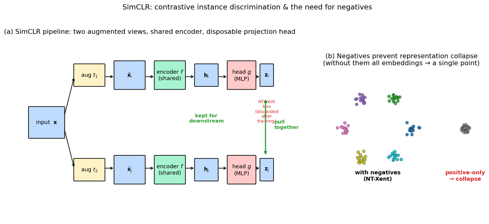

> **Source question (Q26):** Describe the SIMCLR approach for self-supervised learning. What happens if you train it only using positive pairs?

## SimCLR: A Simple Framework for Contrastive Learning of Visual Representations

The previous sections introduced contrastive and triplet losses for learning image descriptors from labelled data. Self‑supervised learning (SSL) removes the need for manual labels by deriving a supervisory signal from the data itself. Among SSL methods, **instance discrimination** treats each image as its own class, and the goal is to learn representations that are invariant to data augmentations while being discriminative across different images. **SimCLR** (Simple Framework for Contrastive Learning of Visual Representations) is a prominent instance‑discrimination method that achieves state‑of‑the‑art performance with a remarkably straightforward design. This section describes the SimCLR pipeline, its key components, and explains why training with *only* positive pairs leads to a collapsed representation.

### 1. The SimCLR Pipeline

SimCLR learns a global image representation by maximising agreement between differently augmented views of the same image while pushing apart views from different images. The architecture consists of three main blocks:

1. **Stochastic data augmentation module.** For each input image $\mathbf{x}$, two random augmentations are sampled from a carefully composed set of transformations, producing two views $\tilde{\mathbf{x}}_i$ and $\tilde{\mathbf{x}}_j$. The composition of augmentations is critical: SimCLR uses random cropping, resizing, colour jittering, colour dropping, Gaussian blur, and horizontal flipping. The combination of spatial and colour distortions forces the network to learn semantic content rather than low‑level shortcuts.

2. **Base encoder $f(\cdot)$.** This is a standard CNN (e.g., ResNet‑50) that maps each augmented view to a representation vector $\mathbf{h} = f(\tilde{\mathbf{x}})$. The encoder is the backbone that will later be used for downstream tasks.

3. **Projection head $g(\cdot)$.** A small multi‑layer perceptron (MLP) with one hidden layer maps $\mathbf{h}$ to a lower‑dimensional embedding $\mathbf{z} = g(\mathbf{h})$. The contrastive loss is applied in this embedding space. Crucially, after pre‑training the projection head is **discarded**, and only the representation $\mathbf{h}$ from the encoder is used for transfer learning. The slides note that this *“disposable projection block … is used for training and then removed – internal representation generalizes better.”* The projection head filters out information that is irrelevant for the instance discrimination task, allowing the encoder to retain more generally useful features.

The full forward pass for a mini‑batch of $N$ images yields $2N$ embeddings $\mathbf{z}_1, \dots, \mathbf{z}_{2N}$, where each pair $(\mathbf{z}_{2k-1}, \mathbf{z}_{2k})$ corresponds to two views of the same image.

The figure summarises the pipeline and the role of negatives. Panel (a) is a flow diagram of one mini-batch step: input $\mathbf{x}$ is augmented twice, each view is encoded by the shared $f$ to produce the representation $\mathbf{h}$ (kept for downstream tasks), then projected by the disposable head $g$ to embeddings $\mathbf{z}$ where NT-Xent pulls the matched pair together (green double-arrow) while the loss's denominator pushes other batch items apart. Panel (b) sketches the two outcomes: with negatives, the learned embedding spreads classes around the unit circle in distinct clusters; with positive pairs only, the gradient has no repulsive component and all images map to a single point — the classic representation collapse.

### 2. Contrastive Loss (NT‑Xent)

SimCLR uses a variant of the contrastive loss called the **normalised temperature‑scaled cross entropy loss (NT‑Xent)**. For a positive pair $(i, j)$, the loss is defined as

$$
\ell_{i,j} = -\log \frac{\exp\bigl(\text{sim}(\mathbf{z}_i, \mathbf{z}_j) / \tau\bigr)}{\sum_{k=1}^{2N} \mathbf{1}_{[k \neq i]}\, \exp\bigl(\text{sim}(\mathbf{z}_i, \mathbf{z}_k) / \tau\bigr)},
$$

where $\text{sim}(\mathbf{u}, \mathbf{v}) = \frac{\mathbf{u}^\top \mathbf{v}}{\|\mathbf{u}\|\,\|\mathbf{v}\|}$ is the cosine similarity, and $\tau > 0$ is a temperature parameter. The denominator sums over all $2N-1$ other embeddings in the batch, which act as **negative examples**. The total loss is the sum over all positive pairs (both directions):

$$
\mathcal{L} = \frac{1}{2N} \sum_{k=1}^{N} \bigl( \ell_{2k-1,2k} + \ell_{2k,2k-1} \bigr).
$$

This loss can be seen as a non‑parametric softmax classifier that tries to identify the correct positive among a set of negatives. It is closely related to the instance‑discrimination loss described in the slides, where *“each image (and all of its augmentations) forms a class by itself.”*

### 3. Key Design Choices

SimCLR’s simplicity hides several critical design choices that make it work:

- **Large batch size.** Because the negatives are drawn from the current mini‑batch, a larger batch provides more negatives and makes the discrimination task harder, leading to better representations. SimCLR uses batch sizes of up to 8192, enabled by large‑scale hardware (TPUs). The slides explicitly mention *“large batch through hardware support.”*

- **Composition of augmentations.** No single augmentation is sufficient; the combination of random cropping and strong colour distortion prevents the network from solving the task by matching colour histograms or other trivial cues. The slides state that *“composition of augmentations is a key.”*

- **Projection head.** Using a non‑linear projection head before the loss, and discarding it afterwards, consistently improves the quality of the encoder’s representation. The projection head absorbs the invariances that are specific to the contrastive task, leaving the encoder’s output more generic.

- **Normalisation and temperature.** Cosine similarity and a learned or tuned temperature $\tau$ control the concentration of the similarity scores, balancing the influence of hard vs. easy negatives.

### 4. What Happens If You Train Only with Positive Pairs?

If we remove all negatives from the loss – i.e., train only with positive pairs – the objective reduces to minimising the distance between the two views of each image, without any repulsive force. The loss would become something like

$$
\mathcal{L}_{\text{pos}} = \frac{1}{N} \sum_{k=1}^{N} \bigl\| \mathbf{z}_{2k-1} - \mathbf{z}_{2k} \bigr\|^2,
$$

possibly with a cosine similarity variant. In this setting, the network can achieve zero loss by mapping **all** images to the same constant vector. This is known as **representation collapse**: the encoder learns a trivial, degenerate solution where every input produces an identical output. The representation carries no discriminative information and is useless for any downstream task.

The presence of negatives is essential because they create a **contrastive pressure** that forces the embeddings of different images apart. The NT‑Xent loss can be interpreted as a form of **energy‑based model** where the positive pair is pulled together while the negatives define a partition function that prevents collapse. Without the denominator, the loss has no mechanism to penalise the trivial constant solution.

This collapse phenomenon is not unique to SimCLR; it is a fundamental challenge in self‑supervised learning with positive‑only losses. Other SSL methods address it through different means: **BYOL** and **SimSiam** use asymmetric architectures (e.g., a momentum encoder or a stop‑gradient operation) to avoid collapse without explicit negatives, while **Barlow Twins** and **VICReg** use redundancy reduction and variance regularisation, respectively. SimCLR, in contrast, relies on a large number of explicit negatives within the batch to maintain a well‑separated embedding space.

### 5. Summary

- **SimCLR** is a simple yet powerful SSL framework based on instance discrimination. It learns by maximising agreement between two augmented views of the same image while pushing apart views of different images.
- The architecture consists of a base encoder, a disposable projection head, and a carefully composed set of data augmentations.
- The loss is a normalised temperature‑scaled cross entropy (NT‑Xent) that uses all other images in the batch as negatives.
- **Large batch size** and **strong data augmentation** are critical for performance.
- Training **only with positive pairs** removes the repulsive force and leads to **representation collapse**, where all images map to the same constant vector. The negatives are essential to prevent this trivial solution and to learn a discriminative representation.

---

### Self-Test

1. SimCLR discards the projection head $g(\cdot)$ after pre-training and uses only the encoder output $\mathbf{h}$ for downstream tasks. Why does this design choice improve transfer performance compared to using $\mathbf{z}$ directly?
2. BYOL achieves competitive self-supervised performance without any explicit negative pairs, yet SimCLR collapses without them. What structural difference in BYOL prevents representation collapse, and why does SimCLR's symmetric architecture require negatives to avoid the same fate?
3. If you halve the batch size during SimCLR training (and cannot compensate with more hardware), how would you expect the quality of learned representations to change, and what could you adjust in the augmentation pipeline or loss to partially mitigate the effect?
4. Consider an extreme augmentation policy where one of the two views always retains the original image colours unchanged while the other receives heavy colour jittering. Under what conditions might this asymmetry cause the network to learn a shortcut solution, and what does the NT-Xent loss's temperature $\tau$ have to do with how aggressively such shortcuts are penalised?

### Answer Key

1. The projection head $g(\cdot)$ is trained to be invariant to the specific augmentations used in contrastive pre-training, so the embedding $\mathbf{z}$ discards information irrelevant to instance discrimination but potentially useful for downstream tasks (e.g., colour, texture details). By discarding $g(\cdot)$ and using $\mathbf{h}$, the encoder retains richer, more general features because the projection head has "absorbed" the task-specific invariances. The text notes that this "disposable projection block … is used for training and then removed – internal representation generalises better."

2. BYOL uses an **asymmetric architecture**: an online network that is updated by gradient descent and a momentum (target) network whose weights are an exponential moving average of the online network's weights, plus a predictor applied only on the online side. This asymmetry, combined with the stop-gradient on the target network, breaks the symmetry that would otherwise allow a constant solution to satisfy the objective. SimCLR's symmetric architecture applies identical transformations to both views and has no such asymmetry, so without the repulsive pressure from negatives (the denominator in NT-Xent), the loss can be minimised trivially by collapsing all embeddings to a single point.

3. Halving the batch size from $N$ to $N/2$ reduces the number of in-batch negatives from $2N-2$ to $N-2$ per anchor, making the discrimination task easier and yielding weaker, less discriminative representations. To partially mitigate this, one could use a **memory bank** (as in MoCo) to decouple the number of negatives from the batch size, or increase the **strength and diversity of augmentations** so that the harder positives partially compensate for fewer negatives. Alternatively, decreasing the temperature $\tau$ can sharpen the loss landscape and focus learning on hard negatives, though this risks instability with a small negative set.

4. If one view always preserves original colours, the encoder can solve the contrastive task by matching colour statistics between the clean view and any jittered view, since the clean view provides a stable colour anchor—this is a shortcut that bypasses learning semantic content. This shortcut is most likely when images in the batch are colour-distinguishable (e.g., a red fire engine versus a green tree), so colour alone identifies the correct positive. Regarding $\tau$: a lower temperature sharpens the softmax over negatives, concentrating gradients on the hardest negatives and penalising any similarity between different-image embeddings more aggressively; however, if the shortcut (colour) already separates positives from negatives cleanly, a low $\tau$ reinforces the shortcut rather than eliminating it, whereas a higher $\tau$ provides a softer gradient signal that is less sensitive to easy colour-based separation.