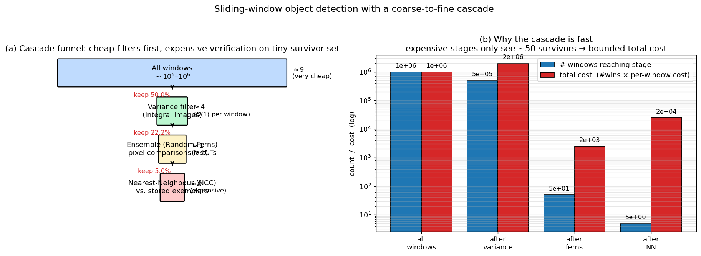

## Sliding Window Object Detection and Efficient Cascade Rejection

The TLD tracker relies on an object detector that must evaluate thousands of image patches per frame in real time. The detector is built around the **sliding window** (or **scanning window**) paradigm, which is a classic approach to object localisation. This section describes the steps of sliding window detection and explains how the TLD detector achieves reasonable speed through a **cascade of increasingly discriminative classifiers**.

### 1. The Sliding Window Paradigm

Given an input image, the goal is to find all instances of the object of interest. The sliding window approach systematically scans the image with a rectangular window of a fixed aspect ratio, at **all possible positions and over a range of scales**. At each position and scale, the image content inside the window is extracted, normalised, and passed to a classifier that decides whether it contains the object or background. The output is a set of bounding boxes with associated confidence scores, which can be further processed by non‑maximum suppression to remove redundant detections.

A naïve implementation of this idea is computationally prohibitive: a typical VGA frame scanned at tens of scales with a dense stride yields on the order of $10^5$–$10^6$ windows. Evaluating a sophisticated classifier on every window would be far too slow for real‑time operation. Therefore, practical sliding window detectors employ a **cascade architecture**: a sequence of tests of increasing complexity, where the vast majority of windows are rejected early by cheap operations, and only a tiny fraction reaches the most expensive final stage.

### 2. Sliding Window Detection in TLD

In TLD, the object is represented by a bounding box of fixed aspect ratio (location and scale). The detector performs the following steps:

1. **Multi‑scale scanning.** The image is repeatedly down‑sampled to create a scale pyramid. At each scale, a window of the fixed object size (after normalisation, $15 \times 15$ pixels) is slid over the image with a step of a few pixels. Every such window defines a candidate patch.

2. **Patch extraction and normalisation.** The image content inside the window is resampled to a canonical $15 \times 15$ pixel patch. This normalisation removes the effects of scale and translation, so that a single fixed‑size model can be used for all windows.

3. **Sequential classification.** The normalised patch is passed through a three‑stage cascade:
   - **Variance filter**
   - **Ensemble classifier (Random Ferns)**
   - **Nearest‑Neighbour (NN) classifier**

   A window must survive all three stages to be considered a detection. The cascade is designed so that each stage rejects a large fraction of the remaining windows, with the computational cost increasing from stage to stage.

### 3. The Three‑Stage Cascade

#### Stage 1: Variance Filter

The variance filter exploits the observation that a patch containing a well‑defined object typically has higher intensity variance than a uniform or low‑contrast background patch. The variance of a patch $X$ is computed as

$$
\operatorname{Var}[X] = \mathbb{E}[X^2] - (\mathbb{E}[X])^2.
$$

Using **integral images** (also known as summed‑area tables), both $\mathbb{E}[X]$ and $\mathbb{E}[X^2]$ can be computed in constant time for any rectangular region, regardless of its size. This makes the variance filter extremely fast. Patches whose variance falls below a threshold (learned from the initial positive examples) are immediately rejected as background. In TLD, this filter typically discards about **50% of all windows**, halving the number of patches that must be processed by the subsequent stages.

#### Stage 2: Ensemble Classifier (Random Ferns)

The surviving patches are passed to an **ensemble classifier** based on **Random Ferns**. A Random Fern is a set of binary tests (pixel comparisons) whose outcomes are grouped together to index a lookup table that stores the posterior probability of the patch being the object. Multiple ferns are evaluated independently, and their outputs are averaged to produce a confidence score.

The key advantage of Random Ferns is their speed: the binary tests are simple pixel intensity comparisons that can be evaluated very quickly, and the lookup tables are small. The ensemble classifier acts as a coarse but fast filter that rejects the majority of the remaining background patches. After this stage, only a few dozen windows (typically around **50**) are left for the final, most expensive classifier.

#### Stage 3: Nearest‑Neighbour (NN) Classifier

The final stage is a **nearest‑neighbour classifier** that compares the candidate patch against a stored model of positive and negative patches. The similarity metric is **Normalised Cross‑Correlation (NCC)**. For each candidate patch, the relative similarity to the positive and negative sets is computed; a patch is accepted if its similarity to the positives is sufficiently higher than its similarity to the negatives (i.e., if the *conservative similarity* exceeds a threshold).

The NN classifier is computationally expensive because it involves comparing the candidate against many stored exemplars. However, because the cascade has already eliminated the vast majority of windows, only around 50 patches per frame reach this stage, keeping the total cost manageable.

The figure makes the cascade economics concrete. Panel (a) is a funnel diagram: roughly $10^6$ candidate windows enter the variance filter (very cheap, integral-image lookups), which keeps ~50%; the Random-Ferns ensemble cuts those down to ~50 survivors with fast pixel comparisons; the NN classifier finally processes only those last ~5 candidates with expensive NCC. Panel (b) shows why the design works: surviving window counts drop ~5 orders of magnitude across stages, and the per-stage *total cost* (windows × per-window cost) stays bounded — the expensive NCC step never sees more than a few dozen patches per frame, which is what makes real-time scanning possible.

### 4. How Reasonable Speed Is Achieved

The speed of the TLD detector is the result of several design choices that work together:

- **Cascade architecture.** The sequential decision process ensures that cheap operations are applied first, and expensive operations are applied only to a tiny fraction of the windows. The variance filter rejects 50% of patches almost instantly; the ensemble classifier rejects most of the rest; the NN classifier sees only ~50 patches per frame.

- **Integral images for variance.** The variance filter would be slow if computed naïvely for every window, but integral images reduce the computation to a few array lookups and arithmetic operations, independent of the window size.

- **Simple features in early stages.** The variance filter uses a single scalar statistic. The Random Ferns use only pixel comparisons, which are extremely fast to evaluate and do not require feature extraction.

- **Fixed normalisation size.** All patches are resized to $15 \times 15$ pixels, which is small enough that even the NCC computation in the NN stage is relatively cheap.

- **Parallelism.** The detector runs in parallel with the tracker, so its speed requirements are those of the overall frame rate, not of a single exhaustive search. Moreover, the detector can be further accelerated by limiting the search region based on the tracker’s prediction, although the basic TLD scans the whole image.

In summary, sliding window detection is made practical by a **coarse‑to‑fine cascade** that rapidly discards the overwhelming majority of background windows using computationally inexpensive tests, reserving the costly nearest‑neighbour evaluation for a handful of promising candidates. This design allows the TLD detector to run in real time while maintaining high detection accuracy.

---

### Self-Test

1. The variance filter rejects patches with low intensity variance as likely background. Why would this heuristic fail when tracking a nearly uniform-coloured object (e.g., a white wall or a plain t-shirt)?
2. How does the role of the Random Ferns ensemble classifier differ from the role of the Nearest-Neighbour classifier — specifically, what property does each stage optimise for, and why does their ordering in the cascade matter?
3. If you doubled the scanning stride (step size between window positions) to speed up the detector, how would that affect detection recall, and under what object-size conditions would the impact be most severe?
4. Integral images allow variance to be computed in $O(1)$ per window regardless of window size. Why does this efficiency argument break down if you instead need to compute a feature that depends on the *spatial arrangement* of pixel intensities (e.g., a Gabor response) rather than just aggregate statistics?

### Answer Key

1. The variance filter works because well-defined objects typically exhibit higher intensity variance than uniform background regions. A nearly uniform-coloured object (e.g., a plain white t-shirt) has low intra-patch variance itself, so its patches would fall below the variance threshold and be discarded as background — the very patches that should survive. In this case, the heuristic conflates a low-contrast object with featureless background, causing the positive object windows to be rejected in Stage 1 before they can reach the more discriminative classifiers.

2. The Random Ferns ensemble optimises for **speed**: it uses simple pixel-comparison binary tests and lookup tables to quickly prune the large pool of surviving windows with a coarse but fast confidence estimate. The Nearest-Neighbour classifier optimises for **accuracy/discrimination**: it computes full NCC similarity against stored positive and negative exemplars to make a precise accept/reject decision. Their ordering matters because placing the cheap-but-coarse ferns first reduces the candidate pool from potentially thousands of windows down to ~50, so the expensive NN computation is only invoked on the small fraction of patches that the ferns cannot confidently reject.

3. Doubling the stride means the window centre moves in larger steps, so some object positions may never be closely covered by any window position, reducing **recall** (true positive detections missed). The impact is most severe for small objects: when an object occupies only a few pixels in a given scale level, even a one- or two-pixel misalignment caused by a coarser stride can cause the window to overlap the object insufficiently, pushing the patch below the detection threshold. For large objects the window footprint is much bigger relative to the stride increment, so misalignment matters less.

4. The $O(1)$ efficiency of integral images stems from the fact that $\mathbb{E}[X]$ and $\mathbb{E}[X^2]$ are pure aggregate (order-independent) sums over the pixel values in a rectangle — they can be precomputed once in the integral image and then retrieved with four lookups. A Gabor response, by contrast, is a convolution with a spatially extended, oriented sinusoidal kernel; its value depends on *which* pixel is at *which* location within the window, not merely on their collective sum. There is no equivalent integral-image trick that pre-aggregates all possible spatially-structured inner products, so evaluating a Gabor feature still requires $O(k^2)$ multiplications per window (where $k$ is the kernel size) or a global FFT whose cost is not reduced by the sliding-window structure.