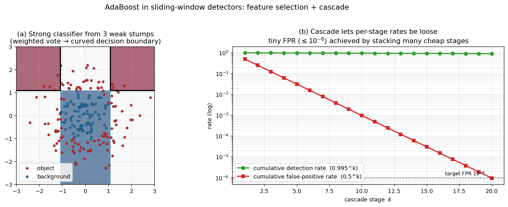

> **Source question (Q30):** Why is the Adaboost algorithm often used for the "sliding window" methods? Give more than one reason.

## Why Is the AdaBoost Algorithm Often Used for Sliding‑Window Methods?

Sliding‑window object detection, as described in the context of the TLD tracker, must evaluate an enormous number of image patches – often $10^5$ to $10^6$ per frame – and decide whether each contains the object of interest. A successful detector must therefore satisfy two demanding requirements simultaneously: **extremely high classification speed** and **high detection accuracy**. The **AdaBoost** (Adaptive Boosting) algorithm, together with the cascade architecture it naturally enables, has become a cornerstone of many sliding‑window detectors (most famously the Viola–Jones face detector) because it addresses both requirements in a principled and highly effective way. Below are the main reasons for its widespread adoption.

### 1. Feature Selection from a Massive Pool

A sliding‑window classifier can be built from a very large set of candidate features – for example, thousands or even hundreds of thousands of Haar‑like rectangle features computed efficiently via integral images. Training a classifier on all of them would be computationally intractable and would lead to overfitting. AdaBoost performs **automatic feature selection** during training: in each boosting round, it selects the single weak classifier (i.e., the one feature with its optimal threshold) that minimises the weighted classification error on the training set. The final strong classifier is a weighted combination of only a small number of selected features – typically a few dozen to a few hundred – each of which contributes discriminative power. This built‑in feature selection yields a compact model that is both fast to evaluate and highly relevant to the task.

### 2. Cascade Architecture for Extreme Speed

AdaBoost naturally lends itself to the construction of a **cascade of classifiers**. A single strong classifier, even if composed of simple weak learners, may still be too slow when applied to every window. The cascade solves this by arranging a sequence of AdaBoost‑trained stages of increasing complexity. Early stages contain very few features (sometimes just one or two) and are designed to reject the vast majority of background windows with minimal computation. Later stages use more features and are more discriminative, but they are evaluated only on the tiny fraction of windows that survive the earlier filters. This coarse‑to‑fine strategy – exactly the same philosophy used in the TLD detector’s three‑stage cascade – reduces the average number of feature evaluations per window to a very small number, making real‑time performance possible.

AdaBoost is particularly well suited for building such a cascade because:

- Each stage is itself a strong classifier obtained by boosting simple weak learners.
- The training procedure for a cascade stage can be tuned to achieve a desired **detection rate** (e.g., 0.995) while aggressively minimising the **false positive rate** (e.g., 0.5). This is done by adjusting the threshold of the AdaBoost strong classifier.
- Stages are trained sequentially: after one stage is trained, the negative examples that pass through it are collected and used as the negative training set for the next stage, focusing the subsequent stages on the “hard” background patterns.

### 3. Combining Simple, Fast Weak Classifiers into a Powerful Strong Classifier

AdaBoost constructs a highly accurate strong classifier by linearly combining many **weak classifiers** – classifiers that need only be slightly better than random guessing. In the context of sliding‑window detection, the weak classifiers are typically decision stumps based on simple features (e.g., a single Haar‑like feature compared to a threshold). These weak classifiers are extremely fast to evaluate, especially when the features are computed via integral images in constant time. AdaBoost’s weighted voting scheme ensures that the final decision is robust and generalises well, even though each individual weak learner is very simple. This combination of simplicity and accuracy is ideal for scanning thousands of windows.

### 4. Focus on Hard Examples During Training

AdaBoost iteratively re‑weights the training samples, increasing the weight of misclassified examples. This forces subsequent weak classifiers to concentrate on the examples that are difficult for the current ensemble. In a detection setting, this means the final classifier pays special attention to the boundary between object and background appearances – precisely the region where mistakes are most likely. The resulting model is well tuned to discriminate the object from the specific background patterns that are easily confused with it, which is critical for keeping the false positive rate low across millions of windows.

### 5. Fast Evaluation with Integral Images

Although not a property of AdaBoost itself, the algorithm is almost always paired with features that can be computed in constant time using **integral images** (e.g., Haar‑like features, variance, local binary patterns). AdaBoost’s feature selection picks the most informative of these efficiently computable features, and the cascade structure ensures that only a handful of them are evaluated on the majority of windows. The synergy between AdaBoost, simple rectangle features, and integral images is what made the original Viola–Jones detector run at video frame rates on modest hardware, and it remains a blueprint for many real‑time detectors today.

### Summary

AdaBoost is a natural fit for sliding‑window detection because it simultaneously performs **feature selection**, builds a **cascade of increasingly discriminative stages**, combines **cheap weak classifiers** into a strong one, and **focuses learning on difficult examples**. These properties directly address the core challenge of sliding‑window methods: evaluating a huge number of windows with both high speed and high accuracy. While the TLD detector uses a different ensemble (Random Ferns) and a nearest‑neighbour final stage, it shares the same cascade philosophy that AdaBoost‑based detectors have proven so successful.

The figure illustrates both ideas. Panel (a) shows a toy AdaBoost strong classifier built from three axis-aligned weak stumps: each stump alone is barely better than random, but their weighted vote produces a curved decision surface that separates "object" (red) from "background" (blue) — a small number of cheap features composed into something powerful. Panel (b) explains why the cascade matters numerically: if each stage achieves a high per-stage detection rate ($\approx\!0.995$) and a loose per-stage false-positive rate ($\approx\!0.5$), then after $k$ stages the cumulative detection rate stays high ($0.995^k$) while the cumulative false-positive rate decays geometrically ($0.5^k$) — reaching $10^{-6}$ after about 20 stages, all built from cheap features.

---

### Self-Test

1. In a cascade detector, why is it beneficial to place stages with very few features first, even though individually they produce many false positives?
2. AdaBoost re-weights misclassified examples at each round — how does this mechanism specifically help when the training set has many more background patches than object patches?
3. If you reduced the number of boosting rounds (i.e., the number of weak classifiers selected) in a single cascade stage, what would happen to that stage's detection rate and false positive rate, and how would this ripple through the rest of the cascade?
4. The TLD detector uses Random Ferns rather than AdaBoost as its ensemble — what property of random ferns makes them preferable for an online learning scenario where the training set changes every frame?

### Answer Key

1. Early stages with very few features are extremely fast to evaluate and can reject the vast majority of background windows at minimal computational cost, even though their individual false positive rate is high (e.g., 50%). Because most windows are background, discarding, say, half of all windows at the cost of only one or two feature comparisons dramatically reduces the total work. The later, more complex stages — which are more expensive — then only need to process the small fraction of windows that survive, making the overall average evaluation cost very low.

2. When the training set is heavily imbalanced (far more background than object patches), a naive classifier can achieve low error simply by predicting "background" almost always. AdaBoost's re-weighting mechanism counters this by increasing the importance of misclassified examples — including the rare positive (object) patches that are initially missed — so that each successive weak classifier is forced to focus on the difficult boundary rather than the easy majority class. This iterative focus on hard examples means the final strong classifier learns to discriminate the object from the "hard negatives" that resemble it, directly addressing the imbalance problem.

3. Reducing the number of boosting rounds selects fewer and weaker discriminative features, which lowers the threshold needed to achieve a given detection rate, so the stage's **detection rate** tends to decrease (more objects missed) while its **false positive rate** rises (more background windows pass). Because cascade stages are trained sequentially and each subsequent stage receives as its negative training set the hard examples that survived the previous stages, a weaker early stage passes more, and more diverse, negatives to the next stage — increasing its training burden and potentially requiring more features or stages overall to maintain the same end-to-end accuracy.

4. Random Ferns are a **generative**, **non-iterative** classifier: each fern maintains a simple probability table over binary feature responses, and these tables can be updated incrementally by adjusting counts or probabilities without retraining from scratch. In contrast, AdaBoost must re-run its sequential boosting loop over the entire (updated) weighted training set whenever new examples arrive, which is computationally prohibitive per frame. The TLD detector exploits random ferns' cheap online update rule to incorporate new positive and negative patches generated by the tracker each frame, allowing the detector to adapt to appearance changes in real time.