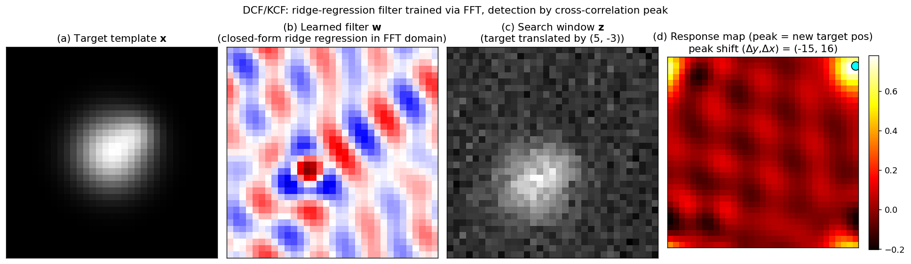

> **Source question (Q35):** DCT - discriminative (kernel) correlation tracking. The algorithm, representation of the object, the search method.

## Discriminative (Kernel) Correlation Tracking (DCT / KCF)

Discriminative Correlation Filter (DCF) trackers – and their kernelised extension, the Kernelised Correlation Filter (KCF) – represent a family of algorithms that reformulate visual object tracking as a **discriminative learning problem** solved entirely in the Fourier domain. Unlike generative methods such as the mean‑shift tracker, which build an appearance model of the target alone, DCF trackers learn a classifier that separates the target from its immediate background. The breakthrough insight is that evaluating a linear classifier on every possible sub‑window of an image is equivalent to a **cross‑correlation**, which can be computed with blazing speed via the Fast Fourier Transform (FFT). By further showing that all cyclic shifts of a base patch form a natural training set with a special *circulant* structure, the learning itself reduces to element‑wise operations in the Fourier domain. This section describes the algorithm, the way the object is represented, and the search strategy that together enable DCF/KCF trackers to run at hundreds of frames per second while achieving state‑of‑the‑art accuracy.

### 1. From Correlation to Discriminative Tracking

Consider a linear classifier parameterised by a weight vector $\mathbf{w}$ (the *correlation filter*). Given an image patch $\mathbf{z}$, the classifier’s confidence score is the dot product $\mathbf{w}^\top \mathbf{z}$. To locate the target in a new frame, we need to evaluate this classifier on every possible sub‑window of a larger search region. If we treat the search region as a 2D signal and the classifier as a template, sliding the template over the signal and computing the dot product at each position is exactly the **cross‑correlation** operation:

$$
\text{response map} = \mathbf{w} \star \mathbf{z}.
$$

By the Convolution Theorem, cross‑correlation in the spatial domain becomes an element‑wise product in the Fourier domain:

$$
\mathcal{F}\{\mathbf{w} \star \mathbf{z}\} = \hat{\mathbf{w}}^* \odot \hat{\mathbf{z}},
$$

where $\hat{\mathbf{w}} = \mathcal{F}(\mathbf{w})$, $\hat{\mathbf{z}} = \mathcal{F}(\mathbf{z})$, $*$ denotes complex conjugation, and $\odot$ is the element‑wise product. The response map is recovered by the inverse FFT. This reduces the cost of an exhaustive sliding‑window search from $\mathcal{O}(n^4)$ to $\mathcal{O}(n^2 \log n)$, making dense evaluation practical.

The remaining challenge is **learning** the filter $\mathbf{w}$ from a single training image. The DCF framework solves this by constructing a rich training set from a single base patch and by employing ridge regression, which admits a closed‑form solution that again diagonalises in the Fourier domain.

### 2. The Learning Algorithm: Ridge Regression with Circulant Data

Let $\mathbf{x}$ be a base image patch (the target) and let $\mathbf{y}$ be a desired response map – typically a 2D Gaussian centred at the target location, so that the classifier produces a smooth peak at the true position and low values elsewhere. We wish to learn a filter $\mathbf{w}$ that minimises the squared error over all training samples while remaining smooth.

#### 2.1 Circulant Matrices as a Training Set

Instead of manually cropping positive and negative examples, the DCF framework uses **all cyclic shifts** of the base patch $\mathbf{x}$ as training samples. If $\mathbf{x}$ is an $n \times n$ image, its cyclic shifts are generated by the permutation matrix

$$
P = \begin{bmatrix}
0 & 0 & \cdots & 0 & 1 \\
1 & 0 & \cdots & 0 & 0 \\
0 & 1 & \cdots & 0 & 0 \\
\vdots & \vdots & \ddots & \vdots & \vdots \\
0 & 0 & \cdots & 1 & 0
\end{bmatrix},
$$

so that $P^i \mathbf{x}$ shifts $\mathbf{x}$ by $i$ elements vertically or horizontally. The data matrix containing all cyclic shifts is a **circulant matrix** $X = C(\mathbf{x})$. Circulant matrices have the remarkable property that they are diagonalised by the Discrete Fourier Transform (DFT):

$$
X = F \,\operatorname{diag}(\hat{\mathbf{x}})\, F^H,
$$

where $F$ is the unitary DFT matrix and $\hat{\mathbf{x}} = \mathcal{F}(\mathbf{x})$.

#### 2.2 Ridge Regression and the MOSSE Solution

The learning objective is **ridge regression** (least‑squares with $L_2$ regularisation):

$$
\min_{\mathbf{w}} \| X \mathbf{w} - \mathbf{y} \|^2 + \lambda \|\mathbf{w}\|^2,
$$

where $\lambda$ controls the trade‑off between data fit and smoothness, preventing overfitting. The closed‑form solution is

$$
\mathbf{w} = (X^H X + \lambda I)^{-1} X^H \mathbf{y}.
$$

Substituting the diagonalisation $X = F \operatorname{diag}(\hat{\mathbf{x}}) F^H$ and using the unitarity of $F$ yields, after algebraic manipulation, the **MOSSE** (Minimum Output Sum of Squared Errors) solution:

$$
\hat{\mathbf{w}} = \frac{\hat{\mathbf{x}}^* \odot \hat{\mathbf{y}}}{\hat{\mathbf{x}}^* \odot \hat{\mathbf{x}} + \lambda}.
$$

All operations are element‑wise; the filter is obtained by an inverse FFT. This is the core learning step of a DCF tracker. It requires only a few FFTs and no expensive matrix inversions, making it extremely fast.

#### 2.3 Kernelised Correlation Filters (KCF)

To capture non‑linear relationships, the same circulant structure can be exploited in **kernel ridge regression**. The classifier is expressed in dual form as a linear combination of kernel evaluations:

$$
f(\mathbf{z}) = \sum_{i} \alpha_i \, \kappa(\mathbf{z}, \mathbf{x}_i),
$$

where $\boldsymbol{\alpha}$ are the dual coefficients and $\kappa$ is a kernel function. If the kernel is *translation invariant* (e.g., Gaussian, polynomial), the kernel matrix $K$ built from circulant data is itself circulant. The dual coefficients then admit a Fourier‑domain solution:

$$
\hat{\boldsymbol{\alpha}} = \frac{\hat{\mathbf{y}}}{\hat{\mathbf{k}}^{\mathbf{x}\mathbf{x}} + \lambda},
$$

where $\mathbf{k}^{\mathbf{x}\mathbf{x}}$ is the **kernel auto‑correlation** of the base patch $\mathbf{x}$. For a Gaussian kernel, this auto‑correlation can be computed entirely in the Fourier domain using only element‑wise operations and a few FFTs (see the slide’s `kernel_correlation` function). The resulting tracker is the **Kernelised Correlation Filter (KCF)**.

### 3. Object Representation

The object is represented by a **feature map** extracted from the image patch, not by raw pixel intensities alone. The choice of features dramatically affects tracking robustness.

- **MOSSE** originally used raw grayscale pixel values (a single‑channel feature). This is simple but sensitive to illumination changes.
- **CSK** (Circulant Structure of tracking with Kernels) extended MOSSE by applying a Gaussian kernel to raw pixels, improving discrimination while keeping the same circulant machinery.
- **KCF** employs **Histogram of Oriented Gradients (HOG)** features, typically 31 or 32 channels computed on a dense grid of cells. HOG captures local shape and edge orientation, providing invariance to photometric variations while remaining fast to compute.
- **Further extensions** integrate multiple feature types: colour names, colour histograms, PCA‑reduced HOG, or deep convolutional neural network (CNN) features (e.g., from VGG‑Net). The KCF framework naturally handles multi‑channel features: the kernel correlation simply sums the contributions over all channels in the Fourier domain. For example, the Gaussian kernel correlation between two multi‑channel patches $\mathbf{x}$ and $\mathbf{z}$ is

$$
k^{\mathbf{x}\mathbf{z}} = \exp\!\left(-\frac{1}{\sigma^2} \Big( \|\mathbf{x}\|^2 + \|\mathbf{z}\|^2 - 2\,\mathcal{F}^{-1}\!\big(\sum\nolimits_c \hat{\mathbf{x}}_c^* \odot \hat{\mathbf{z}}_c\big) \Big) \right),
$$

where $c$ indexes the feature channels. This allows the tracker to exploit rich, high‑dimensional representations without sacrificing the computational benefits of the Fourier‑domain formulation.

### 4. The Search Method

At each new frame, the tracker must locate the target using the previously learned filter (or dual coefficients) and an updated appearance model.

#### 4.1 Translation Search

1. **Extract a search window** centred at the target’s previous position. The window is larger than the target to accommodate motion. A cosine (or sine) window is applied to the patch to smoothly taper the edges to zero, which enforces the cyclic assumption of the FFT and emphasises the central region.
2. **Compute the feature map** $\mathbf{z}$ for this search window (same representation as used for training).
3. **Compute the response map**:
   - For a linear DCF: $\text{response} = \mathcal{F}^{-1}\big( \hat{\mathbf{w}}^* \odot \hat{\mathbf{z}} \big)$.
   - For KCF: first compute the kernel cross‑correlation $\mathbf{k}^{\mathbf{x}\mathbf{z}}$ between the learned target appearance $\mathbf{x}$ and the search patch $\mathbf{z}$, then $\text{response} = \mathcal{F}^{-1}\big( \hat{\mathbf{k}}^{\mathbf{x}\mathbf{z}} \odot \hat{\boldsymbol{\alpha}} \big)$.
4. **Locate the peak**: the pixel with the maximum response value indicates the translation displacement of the target relative to the previous position. The target bounding box is updated accordingly.

#### 4.2 Scale Adaptation

The basic DCF/KCF formulation estimates only translation. Scale changes are handled by one of two common strategies:

- **Multi‑scale search (MOSSE, SAMF):** Several patches are extracted at different scales around the estimated translation, each resized to the fixed filter size. The filter is evaluated on each, and the scale yielding the highest response is selected. This is simple but requires multiple forward passes.
- **Separate scale filter (DSST):** A dedicated 1‑dimensional correlation filter is trained on a scale pyramid (a set of image patches cropped at multiple scales, all centred at the target location). The scale filter is evaluated independently to estimate the optimal scale, while the translation filter handles the 2D location. This decoupling is efficient and accurate.

#### 4.3 Model Update

To adapt to appearance changes, the tracker maintains a running estimate of the target appearance $\mathbf{x}$ and the filter coefficients. After each frame, the new appearance $\mathbf{x}_{\text{new}}$ and the newly computed filter $\mathbf{w}_{\text{new}}$ (or $\boldsymbol{\alpha}_{\text{new}}$) are blended with the previous models using a fixed learning rate $\eta$ (e.g., $\eta = 0.02$):

$$
\mathbf{x} \leftarrow (1-\eta)\,\mathbf{x} + \eta\,\mathbf{x}_{\text{new}}, \qquad
\mathbf{w} \leftarrow (1-\eta)\,\mathbf{w} + \eta\,\mathbf{w}_{\text{new}}.
$$

This exponential moving average provides temporal smoothing and enables the tracker to gradually adapt to changes in illumination, pose, and background.

The figure walks through one detection step with an actual closed-form MOSSE filter. Panel (a) is the target template $\mathbf{x}$ (a Gaussian blob with an off-centre dark spot). Panel (b) shows the learned filter $\mathbf{w}$ obtained from the Fourier-domain ridge regression formula $\hat{\mathbf{w}} = \hat{\mathbf{x}}^* \odot \hat{\mathbf{y}} / (\hat{\mathbf{x}}^*\odot\hat{\mathbf{x}} + \lambda)$ — the filter has both positive and negative weights and emphasises the discriminative parts of the template. Panel (c) is the search window $\mathbf{z}$ with the target translated by $(\Delta y, \Delta x) = (5, -3)$ plus a bit of noise. Panel (d) is the response map computed in the Fourier domain; its peak (cyan dot) lies exactly at the true shift, recovering the displacement in one FFT-domain multiplication.

### 5. Summary

- **Algorithm:** DCF/KCF learns a discriminative classifier by solving ridge regression on all cyclic shifts of a base patch. The circulant structure of the data matrix allows the solution to be computed entirely in the Fourier domain with element‑wise operations, yielding the MOSSE filter. The kernelised version (KCF) extends this to non‑linear decision boundaries using the kernel trick while preserving the same computational efficiency.
- **Object representation:** The target is represented by a multi‑channel feature map (raw pixels, HOG, colour names, or deep CNN features). The KCF framework naturally handles multiple channels by summing their contributions in the kernel computation.
- **Search method:** Detection is performed by computing the cross‑correlation (or kernelised cross‑correlation) between the learned filter and the search window in the Fourier domain. The peak of the resulting response map gives the new target location. Scale is estimated either by a multi‑scale search or by a separate scale filter. The model is updated online with a running average.

The elegance of DCF/KCF lies in the marriage of a sound machine‑learning formulation (ridge regression) with the computational power of the FFT, yielding trackers that are both highly accurate and exceptionally fast.

---

### Self-Test

1. The DCF framework treats all cyclic shifts of a base patch as training samples. Why is this a reasonable approximation for generating positive and negative examples, and under what circumstances might it break down?
2. The regularisation term $\lambda$ in the ridge regression objective controls the trade-off between data fit and filter smoothness. How would an overly large $\lambda$ affect the tracker's response map and its ability to localise the target precisely?
3. KCF with HOG features is generally more robust than a linear DCF on raw pixels, but not always superior. Describe a tracking scenario where the additional complexity of HOG and the kernel trick would *not* help and might even hurt performance.
4. The model update rule uses a fixed learning rate $\eta$. How does the choice of $\eta$ create a fundamental tension between adapting to gradual appearance change and maintaining a reliable target model under occlusion or drift?

### Answer Key

1. Cyclic shifts of a base patch naturally produce nearby sub-windows that straddle the target boundary, giving samples that are mostly background (negative) or mostly target (positive) without manual annotation. This approximation breaks down when the target is near the image border (where cyclic wrap-around introduces nonsensical training samples) or when the background immediately surrounding the target is atypical of the broader scene, causing the filter to overfit to a non-representative set of distractors.

2. A very large $\lambda$ heavily penalises filter energy, forcing $\mathbf{w}$ toward zero and making the learned filter overly smooth and diffuse. In the Fourier solution $\hat{\mathbf{w}} = (\hat{\mathbf{x}}^* \odot \hat{\mathbf{y}}) / (\hat{\mathbf{x}}^* \odot \hat{\mathbf{x}} + \lambda)$, a dominant $\lambda$ in the denominator suppresses high-frequency components, producing a broad, flat response map with a shallow peak that makes precise sub-pixel localisation unreliable.

3. HOG and the kernel trick are most beneficial when appearance variation (illumination, viewpoint, deformation) is the dominant challenge. They would offer little advantage — and could hurt — when tracking a nearly uniform or textureless object (e.g., a plain white ball), because HOG responses near zero across all orientations give a degenerate feature map, and the kernel trick then amplifies noise rather than discriminative signal; a simple linear filter on raw pixel intensities may produce a sharper, more stable response in such cases.

4. A high $\eta$ lets the model quickly incorporate new appearance, which is useful for gradual changes like illumination or pose drift, but it also means that a frame with an occluded or incorrectly localised target will rapidly corrupt the stored appearance model — a phenomenon known as model drift. Conversely, a very low $\eta$ keeps the model stable and resistant to outlier frames, but the tracker may fail to adapt to legitimate appearance changes and eventually lose the target. The fixed exponential moving average $\mathbf{w} \leftarrow (1-\eta)\mathbf{w} + \eta\mathbf{w}_{\text{new}}$ cannot distinguish between reliable updates and corrupted ones, so there is no universally optimal $\eta$.