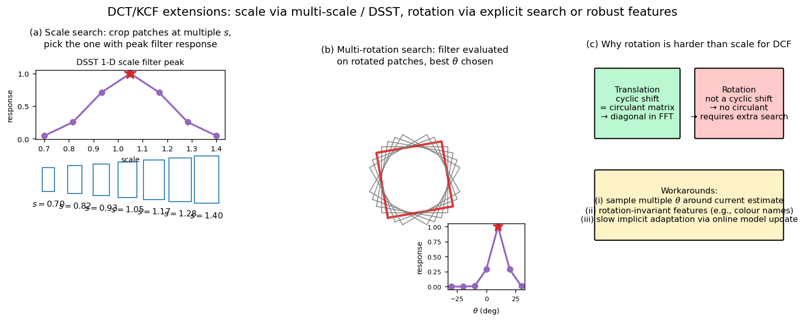

> **Source question (Q36):** DCT tracking in the presence of rotation and scale change.

## DCT Tracking in the Presence of Rotation and Scale Change

Discriminative Correlation Filter (DCT) trackers – including MOSSE, KCF, and their successors – have demonstrated remarkable speed and accuracy by reformulating tracking as a ridge regression problem solved in the Fourier domain. The core formulation, however, models only **translation**: the filter is trained on cyclic shifts of a base patch and evaluated by computing a 2D response map whose peak gives the horizontal and vertical displacement. Real-world objects also undergo **scale changes** and **rotations**, which break the assumption that the target’s appearance can be captured by a fixed-size, axis-aligned bounding box. This section describes how DCT trackers are extended to handle scale and rotation, building on the circulant machinery introduced in the previous section.

### 1. The Challenge of Scale and Rotation

A standard DCT tracker maintains a target template $\mathbf{x}$ of fixed dimensions and learns a filter $\mathbf{w}$ (or dual coefficients $\boldsymbol{\alpha}$) that discriminates this template from its cyclic shifts. When the target grows, shrinks, or rotates in the image plane, its appearance within the original bounding box changes substantially. The filter, which expects the target at a specific scale and orientation, will produce a weaker response or even drift to background clutter. Therefore, the tracker must **adapt the geometric state** – scale and rotation – in addition to translation.

### 2. Handling Scale Change

Scale adaptation is the most widely addressed extension in the DCT family. Two main strategies have proven effective.

#### 2.1 Multi‑Scale Search (MOSSE, SAMF)

The simplest approach, already present in the original MOSSE tracker, is to evaluate the learned filter on several image patches extracted at different scales around the estimated translation. The procedure is:

1. **Crop a set of patches** centred at the predicted location, each with a different scale factor $s \in \{s_1, s_2, \dots, s_K\}$ (e.g., $s \in \{0.9, 1.0, 1.1\}$).
2. **Resize all patches** to the fixed filter size using bilinear interpolation.
3. **Compute the response map** for each scale using the standard Fourier‑domain detection (cross‑correlation or kernelised cross‑correlation).
4. **Select the scale** that yields the highest maximum response, and update the target size accordingly.

This method is straightforward and adds only a constant factor to the computational cost. The SAMF tracker refines it by using a finer quantisation of the scale space and by employing a single filter evaluated on all normalised scales.

#### 2.2 Separate Scale Filter (DSST)

A more elegant and efficient solution is the **Discriminative Scale Space Tracker (DSST)**. Instead of repeatedly evaluating the translation filter at multiple scales, DSST learns a dedicated 1‑dimensional correlation filter for scale estimation.

- **Scale pyramid:** At the estimated translation location, a set of image patches is extracted at $S$ different scales, all centred at the target centre. Each patch is resized to a common size, and a feature vector (e.g., HOG) is computed. These feature vectors are stacked to form a 1D “scale feature” signal.
- **Training:** A 1D correlation filter is trained on the scale feature signal using the same ridge regression formulation, with a 1D Gaussian desired output centred at the current scale.
- **Detection:** In the next frame, after translation is estimated, the scale filter is evaluated on the scale pyramid extracted at the new location. The peak of the 1D response gives the scale change.

Because the scale dimension is typically much smaller than the spatial dimensions (e.g., $S \approx 33$ scales), the 1D filter is extremely fast to compute and update. DSST thus decouples translation and scale estimation, achieving high accuracy with minimal overhead.

### 3. Handling Rotation Change

Rotation is more challenging than scale for DCT trackers because the circulant structure of the data matrix relies on **cyclic shifts in the spatial domain**, which do not naturally model rotation. A cyclic shift of an image patch wraps pixels at the boundaries, which does not correspond to a geometric rotation. Consequently, standard DCT trackers do **not** inherently estimate rotation. Several strategies have been proposed to cope with in‑plane rotation.

#### 3.1 Rotation as an Additional Search Dimension

The most direct extension is to treat rotation analogously to scale: sample a set of rotation angles around the current estimate, rotate each patch, and evaluate the filter on all of them.

- **Multi‑rotation search:** After translation (and possibly scale) is estimated, extract patches rotated by angles $\theta \in \{\theta_1, \dots, \theta_M\}$. Each rotated patch is cropped and resized to the fixed filter size. The filter is applied, and the angle yielding the highest response is selected. This can be combined with scale search, leading to a 3D search over translation, scale, and rotation. The computational cost grows linearly with the number of rotation samples, making real‑time performance challenging if many angles are tested.
- **Joint scale‑rotation filter:** Following the DSST philosophy, one can learn a 2D filter in the scale‑rotation domain. A set of patches at different scales and rotations is extracted, and a 2D correlation filter is trained on this grid. The detection step then localises the peak in the scale‑rotation plane. This is conceptually clean but requires careful handling of boundary effects and interpolation.

#### 3.2 Rotation‑Invariant Features

An alternative is to use feature representations that are inherently robust to rotation, reducing the need for explicit rotation search.

- **Orientation‑invariant descriptors:** Standard HOG features are computed on a dense grid of cells with fixed orientation bins; they are not rotation‑invariant. However, one can compute **rotation‑invariant HOG** by aligning the dominant gradient orientation or by using Fourier analysis of orientation histograms. Similarly, colour histograms and colour names are fully rotation‑invariant and can be integrated into the DCT framework as additional feature channels.
- **Deep features:** Convolutional neural networks pre‑trained on large datasets (e.g., VGG‑Net) produce feature maps that exhibit some degree of rotation invariance due to pooling and data augmentation. Using such deep features in a DCT tracker (as in the work of Ma et al.) improves robustness to moderate rotation without explicit angle estimation.

#### 3.3 Implicit Adaptation via Model Updates

In many tracking scenarios, the frame‑to‑frame rotation is small (a few degrees). The exponential moving average update of the target appearance model $\mathbf{x}$ and the filter coefficients allows the tracker to slowly adapt to a rotating target. The cosine window, which emphasises the centre of the patch, also helps by suppressing boundary artefacts that would otherwise be introduced by rotation. While this does not explicitly estimate rotation, it often suffices for slow, continuous rotation.

### 4. Combined Scale and Rotation Handling in Practice

State‑of‑the‑art DCT trackers typically prioritise scale adaptation because scale changes are more common and more detrimental than rotation in many benchmarks. Rotation is either ignored, handled by a coarse multi‑angle search, or addressed through robust features. A practical pipeline for handling both might look like:

1. **Translation:** Evaluate the translation filter on a search window centred at the previous location.
2. **Scale:** At the new translation, evaluate a separate scale filter (DSST) or perform a multi‑scale search.
3. **Rotation:** Optionally, at the estimated translation and scale, evaluate the filter on a few rotated versions of the patch and select the best angle. Update the rotation state.
4. **Model update:** Update the translation filter, scale filter, and target appearance using the extracted patch at the final geometric state.

The computational budget dictates the granularity of the scale and rotation search. Thanks to the efficiency of the Fourier‑domain operations, even a 3D search (translation + scale + rotation) can run at interactive frame rates if the number of scale and rotation bins is kept moderate.

The figure summarises the three extension strategies. Panel (a) shows multi-scale search: a scale pyramid of crops (each rescaled to the fixed filter size), with the inset plotting the response over scales — the peak picks the best $s$ (analogously, DSST replaces this multi-evaluation with a dedicated 1-D scale filter). Panel (b) shows multi-rotation search: the filter is evaluated on patches rotated by several $\theta$ around the current estimate, and the peak of the resulting 1-D response curve gives the rotation. Panel (c) explains why rotation is fundamentally harder than scale: translation corresponds to a cyclic shift (circulant data matrix → diagonal in FFT, giving the closed-form solution), whereas rotation has no such circulant structure, forcing explicit angle search or rotation-invariant features.

### 5. Summary

- **Scale change** is well handled in DCT trackers by multi‑scale search (MOSSE, SAMF) or by a dedicated 1D scale correlation filter (DSST). Both approaches leverage the same circulant/Fourier machinery and add minimal overhead.
- **Rotation change** is not natively supported by the cyclic shift model. It can be addressed by sampling multiple rotations, by learning a separate rotation filter, or by using rotation‑invariant features. In many practical systems, slow rotation is absorbed by the online model update.
- The modular nature of DCT tracking allows these extensions to be combined, yielding trackers that are robust to similarity transformations while retaining the core speed advantage of correlation filters.

---

### Self-Test

1. DSST decouples translation and scale into two separate filters. Why is this decoupling computationally advantageous compared to evaluating the translation filter at every scale, and what assumption does it rely on?
2. The circulant structure of DCT trackers is built around cyclic shifts. Why does this make rotation fundamentally harder to handle than scale, even though both are geometric transformations?
3. If you increase the number of rotation angles $M$ sampled during multi-rotation search, how does this affect the trade-off between tracking accuracy and real-time performance, and at what point does adding more angles stop helping?
4. A DCT tracker using only slow model updates (no explicit rotation search) is tracking a spinning object with rotation of ~30° per frame. Under what conditions would this implicit adaptation fail, and what could you add to recover?

### Answer Key

1. The decoupling is advantageous because the scale filter is 1-dimensional (with only $S \approx 33$ scale bins), making it far cheaper to train and evaluate than re-running the full 2D translation filter at every scale. The key assumption is that translation and scale can be estimated **sequentially** — first find the correct spatial location, then refine the scale at that fixed location — rather than jointly searching a 3D space.

2. The cyclic shift operation moves pixels horizontally or vertically, which corresponds naturally to translation; stretching this shift by a scalar factor approximates scale change via patch resizing. Rotation, by contrast, moves pixels along circular arcs and changes the orientation of local structures, which **cannot be modelled by any composition of cyclic shifts**. As the text states, a cyclic shift merely wraps boundary pixels, producing an artefact that does not resemble a rotated patch, so the circulant data matrix has no built-in basis for rotation.

3. Increasing $M$ improves angular resolution and reduces the chance of missing the true orientation, thereby improving accuracy — but the computational cost grows linearly with $M$, threatening real-time performance. Adding more angles stops helping once the angular step $\Delta\theta = 180°/M$ is finer than the accuracy achievable given image noise and feature quantisation; beyond that threshold, extra angles add cost without reducing the mean angular error.

4. Implicit adaptation via exponential moving average works only for slow, continuous rotation (a few degrees per frame); at ~30° per frame the appearance change between frames is too large for the filter to track without drifting to background clutter or losing the target entirely. Failure is especially likely when the target has strong orientation-dependent texture (e.g., text or asymmetric patterns), because the filter update rate cannot keep pace. To recover, one could add an explicit multi-rotation search (sampling angles around the current estimate) or use rotation-invariant features such as colour histograms or dominant-orientation-aligned HOG, as described in Section 3.2.