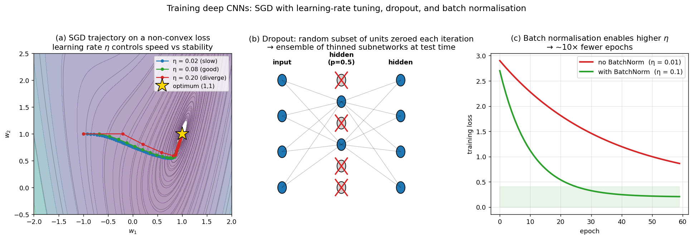

> **Source question (Q41):** Deep Neural Nets for image classification. Learning - the cost function, the SGD (stochastic gradient method), drop-out, batch normalization. SGD parameters.

## Deep Neural Nets for Image Classification: Learning — Cost Function, SGD, Dropout, Batch Normalization, and SGD Parameters

Training a deep convolutional neural network for image classification is an optimisation problem of enormous scale. The network may contain millions of parameters, and the training set can consist of millions of labelled images. This section explains the core components that make this optimisation feasible and effective: the **cost function** that defines what it means to be correct, the **stochastic gradient descent (SGD)** algorithm that iteratively adjusts the parameters, the **hyper‑parameters** that control SGD, and two indispensable regularisation techniques — **dropout** and **batch normalisation** — that stabilise training and prevent overfitting. The exposition follows the framework established in the course slides and builds on the architectural building blocks described in the previous section.

### 1. The Learning Objective: Empirical Risk Minimisation

A deep network for classification defines a parametric function $f(\mathbf{x}; \mathbf{W})$ that maps an input image $\mathbf{x}$ to a vector of class scores (logits). The goal of learning is to find the parameter tensor $\mathbf{W}$ (all weights and biases of the network) that minimises the discrepancy between the predicted scores and the ground‑truth labels over the training set $\mathcal{D} = \{(\mathbf{x}_i, \mathbf{y}_i)\}_{i=1}^{N}$.

This discrepancy is measured by a **loss function** $\ell(f(\mathbf{x}; \mathbf{W}), \mathbf{y})$. The **empirical risk** is the average loss over the training set:

$$
J(\mathbf{W}) = \frac{1}{N} \sum_{i=1}^{N} \ell\bigl(f(\mathbf{x}_i; \mathbf{W}), \mathbf{y}_i\bigr).
$$

Training consists of finding $\mathbf{W}^* = \arg\min_{\mathbf{W}} J(\mathbf{W})$. Because $J$ is highly non‑convex and the dataset is huge, the minimisation is performed iteratively using gradient‑based methods.

### 2. The Cost Function: Cross‑Entropy Loss

For multi‑class classification, the standard choice — used in AlexNet and virtually all modern image classifiers — is the **cross‑entropy loss** (also called softmax log‑loss). The network’s final layer produces a vector of raw scores $\mathbf{z} = f(\mathbf{x}; \mathbf{W}) \in \mathbb{R}^C$, where $C$ is the number of classes. These scores are converted into a probability distribution over classes by the **softmax** function:

$$
p_i = \frac{e^{z_i}}{\sum_{j=1}^{C} e^{z_j}}, \qquad i = 1, \dots, C.
$$

The ground‑truth label is represented as a **one‑hot** vector $\mathbf{y}$, where $y_i = 1$ if $i$ is the true class and $0$ otherwise. The cross‑entropy loss for a single example is then

$$
\ell(\mathbf{z}, \mathbf{y}) = -\sum_{i=1}^{C} y_i \log p_i.
$$

Because only the true class has $y_i = 1$, this simplifies to $-\log p_{\text{true}}$. Minimising this loss is equivalent to maximising the log‑likelihood of the correct class under the model’s predicted distribution. The gradient of the cross‑entropy loss with respect to the logits has a particularly simple form:

$$
\frac{\partial \ell}{\partial z_i} = p_i - y_i,
$$

which makes back‑propagation efficient and numerically stable.

The total cost over a mini‑batch of $m$ examples is the average of the individual losses, often augmented with a **weight decay** term (L2 regularisation) that penalises large weights:

$$
J(\mathbf{W}) = \frac{1}{m} \sum_{k=1}^{m} \ell(\mathbf{z}^{(k)}, \mathbf{y}^{(k)}) + \frac{\lambda}{2} \|\mathbf{W}\|_2^2,
$$

where $\lambda$ is the regularisation strength. Weight decay is equivalent to imposing a Gaussian prior on the weights and helps prevent overfitting.

### 3. Stochastic Gradient Descent (SGD)

The workhorse optimisation algorithm for deep networks is **Stochastic Gradient Descent (SGD)**. The core idea is to approximate the true gradient of the empirical risk — which would require a pass over the entire dataset — by a gradient computed on a small, randomly sampled **mini‑batch** of training examples.

**Update rule.** Let $\mathbf{W}_t$ denote the parameter vector at iteration $t$, and let $\mathcal{B}_t$ be a mini‑batch of $m$ examples drawn uniformly from the training set. The mini‑batch gradient is

$$
\nabla J_{\mathcal{B}_t}(\mathbf{W}_t) = \frac{1}{m} \sum_{(\mathbf{x}, \mathbf{y}) \in \mathcal{B}_t} \nabla_{\mathbf{W}} \ell\bigl(f(\mathbf{x}; \mathbf{W}_t), \mathbf{y}\bigr) + \lambda \mathbf{W}_t.
$$

The parameters are then updated by taking a step in the opposite direction:

$$
\mathbf{W}_{t+1} = \mathbf{W}_t - \eta \, \nabla J_{\mathcal{B}_t}(\mathbf{W}_t),
$$

where $\eta > 0$ is the **learning rate**. This is the basic SGD step, as illustrated in the course slides (the weight update formula shown in the historical context of back‑propagation).

**Why stochastic?** Using a small batch introduces noise into the gradient estimate. This noise has several beneficial effects: it helps the optimisation escape shallow local minima and saddle points, and it acts as an implicit regulariser that can improve generalisation. Moreover, the per‑iteration cost is independent of the dataset size, making SGD scalable to millions of images.

**Back‑propagation.** The gradient $\nabla_{\mathbf{W}} \ell$ is computed efficiently by the back‑propagation algorithm, which applies the chain rule of calculus to the computational graph of the network. The slides emphasise that the entire graph is end‑to‑end differentiable, enabling automatic differentiation in modern frameworks such as PyTorch and TensorFlow.

### 4. SGD Parameters and Variants

The behaviour and convergence of SGD are governed by several critical hyper‑parameters. Tuning them is often the difference between a network that learns effectively and one that fails to converge.

#### 4.1 Learning Rate $\eta$

The learning rate controls the step size. It is the single most important hyper‑parameter:

- **Too large:** the loss may oscillate or diverge.
- **Too small:** convergence is prohibitively slow, and the optimisation may get stuck in poor local minima.

Common practice is to start with a moderate learning rate (e.g., $0.01$ for SGD, $0.001$ for Adam) and decay it over time. **Learning rate schedules** include:

- **Step decay:** reduce $\eta$ by a factor (e.g., $0.1$) every fixed number of epochs.
- **Exponential decay:** $\eta_t = \eta_0 \cdot \gamma^t$.
- **Cosine annealing:** smoothly decreases $\eta$ following a cosine curve, often with warm restarts.
- **Warmup:** linearly increase $\eta$ from a small value to the target during the first few epochs, which stabilises early training when using large batch sizes or batch normalisation.

#### 4.2 Momentum

Momentum accelerates SGD by accumulating a velocity vector that smooths the updates and dampens oscillations. The update with momentum is:

$$
\mathbf{v}_{t+1} = \mu \mathbf{v}_t - \eta \nabla J_{\mathcal{B}_t}(\mathbf{W}_t),
$$
$$
\mathbf{W}_{t+1} = \mathbf{W}_t + \mathbf{v}_{t+1},
$$

where $\mu \in [0, 1)$ is the momentum coefficient (typically $0.9$). A variant known as **Nesterov accelerated gradient** computes the gradient at a look‑ahead position $\mathbf{W}_t + \mu \mathbf{v}_t$, often yielding faster convergence.

#### 4.3 Weight Decay $\lambda$

Weight decay, already introduced in the cost function, adds an L2 penalty that shrinks the weights toward zero. In the SGD update, it manifests as an additional term $-\eta \lambda \mathbf{W}_t$. It is a standard regulariser that improves generalisation. Some optimisers (e.g., AdamW) decouple weight decay from the adaptive learning rate for better behaviour.

#### 4.4 Batch Size $m$

The mini‑batch size determines the trade‑off between gradient accuracy and computational efficiency:

- **Small batches** (e.g., $32$–$64$): noisy gradient estimates, can help generalisation but may require smaller learning rates.
- **Large batches** (e.g., $256$–$1024$): more accurate gradients, better GPU utilisation, but may converge to sharp minima that generalise less well. Large batch training often requires scaling the learning rate linearly with the batch size and using warmup.

The slides note that AlexNet was trained with a batch size of $128$ on a single GPU with $3$ GB of memory.

#### 4.5 Adaptive Optimisers

While the question focuses on SGD, the course material also mentions **ADAM** (ADAptive Moment estimation), which adapts the learning rate for each parameter based on estimates of the first and second moments of the gradients. ADAM introduces additional hyper‑parameters $\beta_1$ (typically $0.9$), $\beta_2$ ($0.999$), and $\epsilon$ ($10^{-8}$). It often requires less tuning of the learning rate and is a popular default choice. However, vanilla SGD with momentum remains competitive, especially when carefully tuned.

### 5. Dropout: Stochastic Regularisation

**Dropout** is a regularisation technique that randomly omits a fraction of the hidden units during each training iteration. As explained in the slides, in AlexNet $50\%$ of the hidden units in the fully connected layers are randomly set to zero (dropped) with probability $p = 0.5$. At test time, all units are active, but their outgoing weights are multiplied by $p$ (or, equivalently, the activations are scaled by $1-p$ during training — the so‑called *inverted dropout*).

**Why dropout works.** By randomly disabling neurons, dropout prevents the network from relying too heavily on any single neuron. Each training sample is effectively processed by a different, randomly thinned sub‑network. This forces the network to learn redundant, distributed representations. At test time, the full network approximates an **ensemble average** of exponentially many thinned networks, which significantly reduces overfitting. The slides draw an analogy to Random Forests, where averaging many independent models improves generalisation.

Dropout is typically applied after fully connected layers, but it can also be used after convolutional layers (with lower drop probabilities, e.g., $0.1$–$0.2$). It is not used at test time, and it is usually turned off when batch normalisation is employed, as batch normalisation itself provides a regularising effect.

### 6. Batch Normalisation

**Batch normalisation** (BatchNorm) is a technique that normalises the activations of each layer to have zero mean and unit variance over the current mini‑batch. It was introduced to address the problem of **internal covariate shift** — the change in the distribution of layer inputs as the parameters of previous layers are updated, which slows down training.

For a mini‑batch $\mathcal{B} = \{\mathbf{x}_1, \dots, \mathbf{x}_m\}$ of a layer’s pre‑activation values (or post‑activation, depending on the convention), BatchNorm computes:

$$
\mu_{\mathcal{B}} = \frac{1}{m} \sum_{i=1}^{m} \mathbf{x}_i, \qquad
\sigma_{\mathcal{B}}^2 = \frac{1}{m} \sum_{i=1}^{m} (\mathbf{x}_i - \mu_{\mathcal{B}})^2.
$$

The normalised values are

$$
\hat{\mathbf{x}}_i = \frac{\mathbf{x}_i - \mu_{\mathcal{B}}}{\sqrt{\sigma_{\mathcal{B}}^2 + \epsilon}},
$$

where $\epsilon$ is a small constant for numerical stability. To preserve the network’s representational capacity, BatchNorm introduces two learnable parameters per channel: a scale $\gamma$ and a shift $\beta$, yielding the final output

$$
\mathbf{y}_i = \gamma \hat{\mathbf{x}}_i + \beta.
$$

During inference, the running averages of $\mu_{\mathcal{B}}$ and $\sigma_{\mathcal{B}}^2$ accumulated during training are used instead of the mini‑batch statistics.

**Benefits, as highlighted in the slides:**

- **Accelerates training:** by keeping activations well‑scaled, BatchNorm allows much higher learning rates. The slides state that training can be $10\times$ faster (fewer epochs needed).
- **Reduces sensitivity to initialisation:** the normalisation makes the network robust to the scale of weight initialisation.
- **Acts as a regulariser:** the noise introduced by the mini‑batch statistics has a regularising effect, often allowing dropout to be reduced or even removed. The slides note that “dropout can be excluded/smaller” and a “better optimum found.”
- **Mitigates vanishing gradients:** by preventing activations from drifting into saturated regimes of non‑linearities.

BatchNorm is typically inserted after a convolutional or fully connected layer and before the non‑linear activation (though the original paper placed it after the activation; both orderings are used). It has become a standard component in almost all modern CNN architectures.

The figure visualises the three core training ingredients. Panel (a) shows SGD trajectories on a 2-D non-convex loss surface under three learning rates: $\eta = 0.02$ is too small and crawls; $\eta = 0.08$ converges nicely to the optimum (1,1); $\eta = 0.20$ overshoots and diverges off the contour map. Panel (b) sketches dropout on a 2-hidden-layer network: at each training iteration a random subset of hidden units is zeroed out (red X) and edges to/from those units are removed, so each step trains a different thinned subnetwork — the test-time model is an implicit ensemble average. Panel (c) shows the practical effect of BatchNorm: by stabilising activation scales, it permits ~10× larger learning rates, reducing the number of epochs to reach a given loss by roughly the same factor.

### 7. Putting It All Together: A Typical Training Recipe

The course slides summarise a “general recipe” for training deep networks, which integrates all the elements discussed above:

1. **Architecture:** a deep convolutional network with ReLU (or GELU) activations, max‑pooling, and fully connected layers.
2. **Loss:** cross‑entropy with softmax output.
3. **Optimiser:** SGD with momentum (or ADAM), a well‑tuned learning rate schedule, and weight decay.
4. **Regularisation:** dropout (especially in fully connected layers) and batch normalisation throughout the network.
5. **Data augmentation:** random crops, horizontal flips, and colour jitter artificially enlarge the training set, further combating overfitting.
6. **Initialisation:** proper weight initialisation (e.g., He initialisation for ReLU) and the use of batch normalisation ensure stable gradient flow from the start.

During training, the forward pass computes the loss on a mini‑batch; back‑propagation computes the gradients of the loss with respect to all parameters; and the optimiser updates the weights. This loop is repeated for many epochs until convergence. The slides report that AlexNet required $90$ epochs (cycles through the training set) and $5$ days on a GTX $580$ GPU — a testament to the computational demands that have since been dramatically reduced by hardware advances and algorithmic improvements.

In summary, the successful training of deep image classifiers hinges on a carefully orchestrated interplay between the **cost function** (cross‑entropy), the **optimisation algorithm** (SGD and its hyper‑parameters), and **regularisation techniques** (dropout and batch normalisation). Mastery of these components is essential for both understanding and applying deep learning to computer vision problems.

---

### Self-Test

1. Batch normalisation uses mini-batch statistics during training but running averages during inference. Why would using mini-batch statistics at test time be problematic, and what failure mode would it cause for single-sample inference?
2. Dropout and batch normalisation both act as regularisers, yet they are often not used together. Why might combining them lead to worse performance rather than stronger regularisation?
3. If you double the mini-batch size $m$ while keeping all other hyper-parameters fixed, how would you expect the training dynamics and generalisation to change, and what adjustment to $\eta$ is typically recommended?
4. The gradient of the cross-entropy loss with respect to the logits is $p_i - y_i$. Intuitively, why does this form make the gradient signal large when the network is confidently wrong, but small when it is confidently correct?

### Answer Key

1. At test time, a single sample forms a "mini-batch" of size one, so its batch statistics ($\mu_{\mathcal{B}}$ and $\sigma_{\mathcal{B}}^2$) are just the sample's own mean and variance — normalising by these would wash out all discriminative activation information, collapsing the signal to near-zero. More generally, mini-batch statistics are noisy estimators that depend on which other samples happen to be in the batch, making predictions non-deterministic and inconsistent across calls. Running averages accumulated during training provide stable, dataset-level statistics that produce reliable, reproducible outputs at inference time.

2. As noted in the text, batch normalisation already introduces noise through its mini-batch statistics, which provides a regularising effect — hence "dropout can be excluded/smaller." When dropout is added on top, the additional stochastic zeroing of activations disrupts the mini-batch statistics that BatchNorm relies on, causing the normalisation to be computed over a corrupted and inconsistent set of values. This interaction increases the variance of the BatchNorm estimates without a commensurate gain in regularisation, often leading to training instability and worse final performance rather than stronger regularisation.

3. Doubling $m$ halves the stochastic noise in the gradient estimate, producing more accurate but less diverse gradient updates; this can accelerate convergence per iteration but tends to converge to sharper minima that generalise less well. The standard recommended adjustment is to scale $\eta$ linearly with batch size (the "linear scaling rule"), so $\eta \rightarrow 2\eta$, often combined with a warmup period to avoid instability at the start. Without increasing $\eta$ accordingly, the effective learning progress per unit of data seen decreases, slowing down training.

4. For the true class, $y_i = 1$, so the gradient is $p_i - 1$; when the network is confidently correct, $p_i \approx 1$ and the gradient $\approx 0$, providing little update signal. When the network is confidently wrong on the true class, $p_i \approx 0$ and the gradient $\approx -1$, producing a large correction. For incorrect classes, $y_i = 0$ and the gradient is simply $p_i$, which is large when the network assigns high probability to a wrong class. This self-calibrating behaviour means the loss naturally focuses learning effort where the predictions are most erroneous.