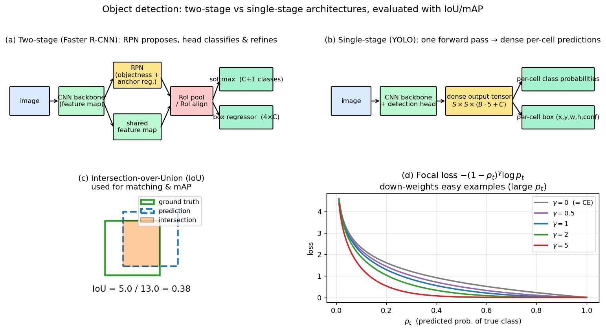

> **Source question (Q43):** Deep Neural Nets for detection. Proposal-based and end-to-end methods. Class label and bounding box prediction.

## Deep Neural Networks for Object Detection: Proposal‑Based and End‑to‑End Methods

Object detection is the task of simultaneously localising and classifying all objects of interest in an image. Unlike image classification, which assigns a single label to the whole image, detection must answer **what** objects are present and **where** they are located. The output is a set of bounding boxes, each associated with a class label and a confidence score. The course material traces the evolution of deep‑learning‑based detectors from exhaustive scanning to sophisticated end‑to‑end architectures. This section focuses on the two dominant paradigms: **proposal‑based** (two‑stage) methods and **end‑to‑end** (single‑stage) methods, and explains how each predicts class labels and bounding boxes.

### 1. The Object Detection Problem and Evaluation

Formally, given an input image $\mathbf{I}$, a detector must produce a set of $M$ predictions $\{(\mathbf{b}_i, c_i, s_i)\}_{i=1}^{M}$, where $\mathbf{b}_i = (x, y, w, h)$ is a bounding box, $c_i \in \{1,\dots,C\}$ is the predicted class (with $C$ object categories), and $s_i$ is a confidence score. During training, the ground truth consists of a set of annotated boxes with class labels.

**Evaluation metrics** are essential for comparing detectors. The standard measure is **Intersection over Union (IoU)**, also known as the Jaccard index:

$$
\text{IoU}(\mathbf{b}_{\text{pred}}, \mathbf{b}_{\text{gt}}) = \frac{|\mathbf{b}_{\text{pred}} \cap \mathbf{b}_{\text{gt}}|}{|\mathbf{b}_{\text{pred}} \cup \mathbf{b}_{\text{gt}}|}.
$$

A prediction is considered a true positive if its IoU with a ground‑truth box exceeds a threshold (typically $0.5$). **Mean Average Precision (mAP)** summarises the precision–recall curve across all classes. The course slides illustrate these concepts and note that mAP is the primary benchmark metric on datasets such as Pascal VOC and COCO.

### 2. Proposal‑Based Methods: The R‑CNN Family

Proposal‑based detectors decompose the task into two stages: first, generate a sparse set of **region proposals** that are likely to contain objects; second, classify each proposal and refine its bounding box. This paradigm dominated the early deep‑learning era and remains highly accurate.

#### 2.1 R‑CNN: Regions with CNN Features

The original **R‑CNN** (Girshick et al., CVPR 2014) uses an external region proposal algorithm (e.g., Selective Search) to generate around 2000 category‑independent candidate boxes. Each proposal is cropped from the image, warped to a fixed size (e.g., $224 \times 224$), and fed through a convolutional neural network (CNN) to extract a feature vector. The features are then classified by a set of linear SVMs (one per class) and a separate bounding‑box regressor refines the proposal coordinates.

- **Class label prediction:** For each proposal, the CNN feature vector is scored by $C$ binary SVMs. The class with the highest score (after non‑maximum suppression) is assigned, provided it exceeds a threshold; otherwise the proposal is labelled “background”.
- **Bounding box prediction:** A class‑specific linear regression model predicts a correction $(\Delta x, \Delta y, \Delta w, \Delta h)$ that transforms the proposal box into a tighter fit around the object.

R‑CNN achieved a dramatic improvement over prior art (over 30% mAP gain on Pascal VOC 2012) but was extremely slow because the CNN was run independently for every proposal.

#### 2.2 Fast R‑CNN: Shared Convolutions and Multi‑Task Loss

**Fast R‑CNN** (Girshick, ICCV 2015) addresses the speed bottleneck by sharing the convolutional computation across all proposals. The entire image is processed once by a stack of convolutional layers to produce a feature map. For each proposal, a **Region of Interest (RoI) pooling** layer extracts a fixed‑length feature vector from the feature map (by max‑pooling the proposal region into a fixed spatial grid, e.g., $7 \times 7$). These RoI features are then fed through fully connected layers that branch into two sibling outputs:

- A **softmax classifier** over $C+1$ classes (including background).
- A **bounding‑box regressor** that outputs $4 \times C$ offsets (four coordinates for each object class).

The network is trained end‑to‑end with a **multi‑task loss** that combines classification and localisation:

$$
L = L_{\text{cls}} + \lambda \, [u \geq 1] \, L_{\text{loc}},
$$

where $L_{\text{cls}}$ is the cross‑entropy loss for the true class $u$, $L_{\text{loc}}$ is a smooth‑L1 loss on the bounding‑box offsets (only for foreground proposals, indicated by the Iverson bracket $[u \geq 1]$), and $\lambda$ balances the two terms. The bounding‑box regression targets are parameterised as scale‑invariant offsets relative to the proposal:

$$
t_x = \frac{x - x_p}{w_p}, \quad t_y = \frac{y - y_p}{h_p}, \quad t_w = \log\frac{w}{w_p}, \quad t_h = \log\frac{h}{h_p},
$$

where $(x_p, y_p, w_p, h_p)$ are the proposal coordinates and $(x, y, w, h)$ the ground‑truth box.

Fast R‑CNN significantly speeds up both training and testing, but the external proposal generation remains a bottleneck.

#### 2.3 Faster R‑CNN: Learned Region Proposals

**Faster R‑CNN** (Ren et al., NIPS 2015) eliminates the external proposal algorithm by introducing a **Region Proposal Network (RPN)** that shares convolutional features with the detection network. The RPN slides a small network over the feature map and, at each spatial location, considers $k$ **anchor boxes** of different scales and aspect ratios. For each anchor, the RPN outputs:

- An **objectness score** (two‑class softmax: object vs. not‑object).
- Four **bounding‑box regression offsets** to refine the anchor.

Thus, the RPN itself performs class‑agnostic objectness prediction and bounding‑box regression. The top‑ranked proposals (after non‑maximum suppression) are passed to the Fast R‑CNN head for final classification and refinement. Training alternates between the RPN and the detection network, or uses a joint approximation.

**Class label prediction** in the final stage is a $(C+1)$-way softmax, exactly as in Fast R‑CNN. **Bounding box prediction** occurs twice: first in the RPN to adjust anchors, then in the detection head to further refine the proposals. Both stages use the same parameterisation of offsets relative to the anchor/proposal.

Faster R‑CNN achieves state‑of‑the‑art accuracy (e.g., 73.2% mAP on VOC 2007) at 5 frames per second, making it a practical and influential two‑stage detector.

#### 2.4 Mask R‑CNN: Adding Instance Segmentation

**Mask R‑CNN** (He et al., ICCV 2017) extends Faster R‑CNN with a third branch that predicts a binary segmentation mask for each RoI, in parallel with the class and box heads. It introduces **RoIAlign**, a quantization‑free pooling operation that preserves spatial accuracy. While primarily a segmentation method, it exemplifies how the proposal‑based framework naturally accommodates additional pixel‑level predictions.

### 3. End‑to‑End Methods: Single‑Shot Detection

End‑to‑end detectors forgo a separate proposal stage and instead predict bounding boxes and class labels directly from the image in a single forward pass. They are typically faster and conceptually simpler, though early versions traded some accuracy for speed.

#### 3.1 YOLO: You Only Look Once

**YOLO** (Redmon et al., CVPR 2016) frames detection as a regression problem. The input image is divided into an $S \times S$ grid (e.g., $7 \times 7$). Each grid cell predicts $B$ bounding boxes (e.g., $B=2$) and associated confidence scores, along with $C$ class probabilities. The confidence score reflects both the likelihood that the cell contains an object and the accuracy of the predicted box: $\text{confidence} = \Pr(\text{Object}) \times \text{IoU}_{\text{pred}}^{\text{truth}}$.

The network output is a tensor of shape $S \times S \times (B \cdot 5 + C)$. For each cell and each box, the five numbers are $(x, y, w, h, \text{confidence})$, where $(x, y)$ is the box centre relative to the cell, and $(w, h)$ are relative to the whole image. The class probabilities are conditional on the cell containing an object, $\Pr(\text{Class}_i \mid \text{Object})$.

At inference time, the per‑cell class probabilities are multiplied by the box confidences to obtain class‑specific confidence scores, and non‑maximum suppression removes duplicates.

**Training loss** is a sum‑of‑squares error that jointly optimises localisation, confidence, and classification, with weighting factors to balance the contributions of small and large boxes and to down‑weight the influence of empty grid cells. The loss includes:

- Localisation loss for boxes responsible for an object (based on highest IoU with ground truth).
- Confidence loss for both object and no‑object cells.
- Classification loss for cells that contain an object.

YOLO is extremely fast (45 fps for the base version, 150 fps for Fast YOLO) and reasons globally about the image, which reduces false positives. However, its coarse grid limits the detection of small or densely packed objects.

**YOLOv2 / YOLO 9000** (Redmon & Farhadi, CVPR 2017) improves accuracy with batch normalisation, higher resolution, anchor boxes (dimensions found by k‑means clustering), and a finer output grid. It also introduces a hierarchical classification scheme that enables training on datasets with and without bounding‑box labels, expanding the detectable vocabulary to over 9000 categories.

#### 3.2 RetinaNet and Focal Loss

**RetinaNet** (Lin et al., ICCV 2017) is a single‑stage detector that matches the accuracy of two‑stage methods by addressing the extreme **class imbalance** between foreground objects and background. In dense sampling of anchors, the vast majority are easy negatives that overwhelm the training signal.

The key innovation is the **Focal Loss**, a dynamically scaled cross‑entropy loss that down‑weights the contribution of well‑classified examples and focuses training on hard, misclassified ones:

$$
\text{FL}(p_t) = -\alpha_t (1 - p_t)^\gamma \log(p_t),
$$

where $p_t$ is the model’s estimated probability for the true class, $\alpha_t$ is a class‑balancing weight, and $\gamma \geq 0$ is the focusing parameter (e.g., $\gamma = 2$). When $p_t$ is large (easy example), $(1-p_t)^\gamma$ becomes very small, reducing the loss.

RetinaNet uses a Feature Pyramid Network (FPN) backbone and two task‑specific subnetworks: one for classification (with focal loss) and one for bounding‑box regression (smooth‑L1 loss), applied to a dense set of anchors. This design achieves top accuracy while maintaining the speed of a single‑stage detector.

#### 3.3 DETR: Detection with Transformers

**DETR** (Carion et al., ECCV 2020) is a fully end‑to‑end detector that casts object detection as a direct set prediction problem, eliminating the need for anchors, region proposals, and non‑maximum suppression. It uses a standard CNN backbone to extract features, which are then processed by a **Transformer encoder–decoder**. The decoder takes a small fixed number of learned **object queries** (e.g., 100) and, through cross‑attention, produces output embeddings for each query. A simple feed‑forward network (FFN) then predicts, for each query, either a class label (including a “no‑object” class) or a bounding box.

The training loss is a **bipartite matching** between the set of $N$ predictions and the ground‑truth objects (padded with “no‑object”). The Hungarian algorithm finds the optimal one‑to‑one assignment that minimises a matching cost combining classification and bounding‑box errors. The loss then penalises the matched pairs:

$$
L = \sum_{i=1}^{N} \left[ -\log \hat{p}_{\hat{\sigma}(i)}(c_i) + \mathbb{1}_{\{c_i \neq \varnothing\}} \lambda_{\text{box}} L_{\text{box}}(b_i, \hat{b}_{\hat{\sigma}(i)}) \right],
$$

where $\hat{\sigma}$ is the optimal assignment, $\hat{p}$ are predicted class probabilities, $c_i$ the true class, and $L_{\text{box}}$ a combination of L1 loss and generalized IoU loss.

DETR is conceptually elegant and achieves competitive performance, especially on large objects, but requires long training schedules. Its self‑attention maps also naturally reveal instance segmentation cues, leading to extensions like MaskFormer and Mask2Former.

The figure compares the two paradigms side-by-side and shows the two pieces of detection machinery they share. Panel (a) is a schematic of a two-stage detector (Faster R-CNN): a CNN backbone produces a shared feature map; the Region Proposal Network outputs objectness + anchor refinement; RoI-pooled features feed two sibling heads producing $(C+1)$-class softmax and per-class box regression. Panel (b) is a single-stage detector (YOLO): one CNN forward pass produces an $S \times S \times (B\cdot 5 + C)$ dense output tensor that is directly decoded into per-cell classes and boxes. Panel (c) illustrates Intersection-over-Union, the metric used to decide which predictions count as true positives. Panel (d) plots the Focal Loss for several focusing parameters $\gamma$: setting $\gamma > 0$ multiplies cross-entropy by $(1-p_t)^\gamma$, pushing the loss for easy (high-$p_t$) examples toward zero so that hard examples dominate the gradient — RetinaNet's answer to the foreground/background imbalance of dense single-stage detection.

### 4. Summary: Class Label and Bounding Box Prediction Across Paradigms

The table below summarises how the main detection architectures handle the two core outputs.

| Method | Class label prediction | Bounding box prediction |
|--------|------------------------|--------------------------|
| **R‑CNN** | Linear SVMs on CNN features per proposal | Class‑specific linear regression on proposal offsets |
| **Fast R‑CNN** | Softmax over $C+1$ classes on RoI features | Class‑specific regression head (smooth‑L1 loss) on RoI features |
| **Faster R‑CNN** | RPN: objectness (2‑class softmax); Detection head: $(C+1)$-class softmax | RPN: anchor offset regression; Detection head: proposal offset regression |
| **YOLO** | Per‑grid‑cell class probabilities, multiplied by box confidence | Direct regression of $(x, y, w, h)$ relative to grid cell and image |
| **RetinaNet** | Per‑anchor classification with focal loss | Per‑anchor box regression (smooth‑L1) |
| **DETR** | FFN on decoder output: $(C+1)$-class softmax | FFN on decoder output: normalised box coordinates (L1 + GIoU loss) |

Proposal‑based methods decouple localisation and classification into two stages, using a region proposal mechanism (external or learned) and refining boxes twice. End‑to‑end methods unify the pipeline, predicting all outputs in a single network pass, with innovations such as grid‑based prediction, focal loss, and transformer‑based set prediction to handle the challenges of dense detection. Both paradigms continue to evolve, with modern frameworks (Detectron2, YOLOv8) offering robust implementations that balance accuracy and speed for real‑world applications, including the autonomous driving tasks demonstrated by the CTU eForce formula student team.

---

### Self-Test

1. YOLO divides the image into an $S \times S$ grid and each cell predicts a fixed number of boxes — why does this design struggle with small or densely clustered objects, and how does YOLOv2's use of anchor boxes help?
2. Focal Loss in RetinaNet down-weights easy examples via the factor $(1 - p_t)^\gamma$. What would happen to training if you set $\gamma = 0$, and why does a large $\gamma$ risk under-training?
3. DETR uses bipartite matching with the Hungarian algorithm instead of NMS. Why is NMS unnecessary in DETR's framework, and in what scenario might the set-prediction approach still produce duplicate detections?
4. Fast R-CNN shares the convolutional backbone across all region proposals, whereas R-CNN runs the CNN separately for each proposal. Beyond speed, does sharing the backbone affect what the network can learn — and if so, how?

### Answer Key

1. Each grid cell can only predict $B$ boxes and one set of class probabilities, so if multiple objects (or many small objects) fall in the same cell, the network cannot represent them all — only the one box with the highest IoU is trained for localisation. YOLOv2 introduces anchor boxes with shapes pre-computed via k-means clustering on ground-truth boxes and uses a finer output grid, which allows each cell to predict multiple distinct boxes with different aspect ratios and better covers small or overlapping objects.

2. Setting $\gamma = 0$ reduces Focal Loss to standard cross-entropy ($\text{FL}(p_t) = -\alpha_t \log(p_t)$), so easy background examples contribute equally to the gradient and overwhelm the rare, hard foreground examples — exactly the class-imbalance problem RetinaNet is designed to solve. A very large $\gamma$ suppresses the loss for most examples so aggressively that even moderately hard examples receive negligible gradient, causing the model to converge slowly or fail to learn fine-grained discriminations because too little training signal remains.

3. DETR enforces a one-to-one assignment between predictions and ground-truth objects during training via the Hungarian algorithm, so each object can be "claimed" by at most one query; this global uniqueness constraint makes post-hoc NMS redundant. Duplicates could still arise if the number of object queries $N$ is smaller than the actual number of objects in a scene, forcing multiple queries to attend to the same instance — or during early training before the bipartite matching has converged, when several queries may settle on the same target.

4. Sharing the backbone enables end-to-end training with a multi-task loss, so the convolutional features are jointly optimised for both localisation and classification rather than being fixed from a pre-trained network (as in R-CNN). This joint optimisation allows the backbone to learn representations that are directly useful for bounding-box regression and class discrimination simultaneously, generally yielding richer, task-adapted features and better generalisation compared to the pipeline approach of R-CNN.